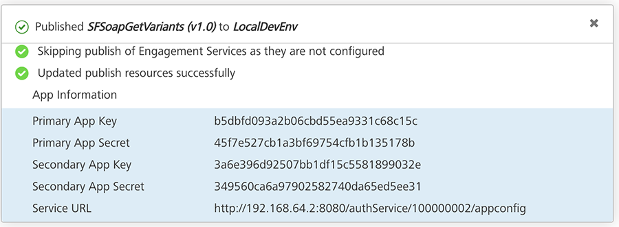
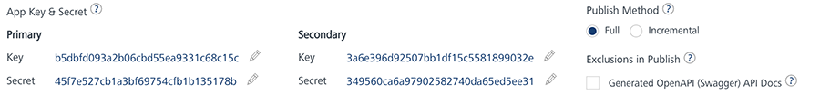

                              

User Guide: [Publish](Publish.md) > Separate App Key/App Secret for Web and Native Channels

Separate App Key/App Secret for Native and Web Channels
-------------------------------------------------------

Volt MX  Foundry from V8 SP4 FP4 HF4 supports generating a separate set of app key/ app secret for the Web and native channels. It also supports the deprecating app key/app secret to allow developers to rotate the keys and keep the app more secure.

**Why Do You Need Separate App Key/App Secret**: To ensure you follow the proper security guidelines and best practices for authentication your app, HCL recommends using a **separate** set of an app key/app secret for building apps for Web and Native channels.

**What are Separate App Key/App Secret**: Volt MX Foundry generates the separate set of app key/app secret for Web and Native channels for an app by default. After you publish an app, you can view the Primary Key/Secret and Secondary Key/Secret in the **Published** status dialog > **App Information**. You can modify the app key/app secret.

Volt MX  Iris uses the following app key/app secret to build binaries:

*   **Primary App Key and** **Primary App Secret** that is used by the Web channel.
*   **Secondary App Key and** **Secondary App Secret** that is used by the Native channel.
    
    
    

> **_Important:_** If your Volt MX Foundry version is V8 SP4 FP4 HF4 or later and Iris version is V8 SP4 FP45 or earlier, the primary key is used for Web and Native channels.  

### Prerequisites

To use separate app key or app secret, ensure you have access to the following:

*   Volt MX Foundry version should be V8 SP4 FP4 HF4 or later.
*   Iris version should be V8 SP4 FP45 or later.

#### Deprecating an App Key/App Secret

Key rotation is supported to help make the app more secure and allow developers to deprecate the active set of app key/ app secret for primary or secondary key-set. While deprecating the active app key/app secret, Volt MX Foundry ensures that you can either auto-generate a new app key/app secret or manually define your own key secret.

**To deprecate an active app key/app secret, follow these steps:**

1.  Go to Volt MX Foundry and open the app published to an environment.
2.  In the **[Publish > Service & Web Client](Publish.md)** page, click **App Key**. The **App Key & Secret** dialog appears and displays the Primary Key/Secret and Secondary Key/Secret details of the app.
3.  Click **Deprecate** for Primary or Secondary.
4.  The message box appears for your confirmation. Click **YES**. Now the existing app key/app secret are marked as **Deprecated**.
    
    > **_Note:_** You cannot deprecate the active app key/app secret until you delete the existing deprecated app key/app secret.
    
    
    
5.  Click **Save** to generate the new app key/app secret and to save these details. Otherwise, you can click the **Edit** button next to the app key/secret to enter the details in the text field. Click the **Tick** button next to the text field to save the details. You have created a new app key/secret.
    
    *   In this case, if you click **CLOSE** without saving the new app key/app secret details, your changes are canceled.
    *   After the new app key/app secret details are saved, the deprecated app key/secret details are marked as **Deprecated**. The **Delete** button appears for the app key/app secret that you have deprecated.
    
    > **_Important:_** Once you delete the deprecated app key/app secret, users cannot access the app using the previous app key/app secret.
    
    > **_Note:_** If you inadvertently deprecate an app key and secret and wishes to reuse the previously used app key/secret, you can do so by manually copy and pasting it to the active app key/secret and saving it.
    
6.  To delete the deprecated app key/app secret permanently, click **Delete**.
7.  Click **CLOSE**.
    
    The new app key/app secret is updated to the app in the run-time server. You do not need to republish the app to the server. Now the services from the app are accessible with the new app key/app secret.
    
    If you want the new app key/app secret to being part of your client app, you can build the app binary with the new app key/app secret and publish it to your environment. Now users can access the app with the new app key/app secret.
