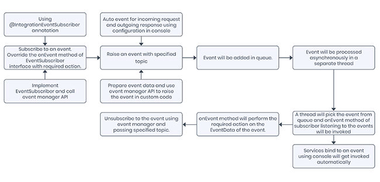
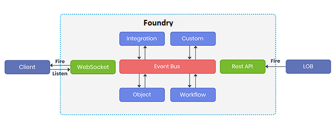
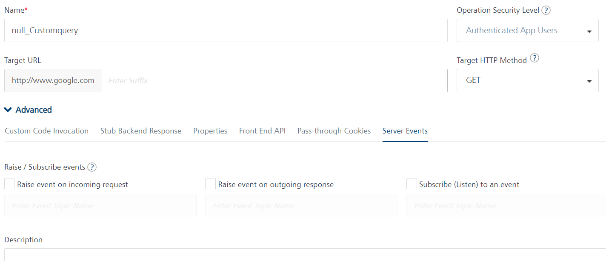

                             

User Guide: [Integration](Services.md#integration) \> [Advanced Configurations](Advanced_Configurations.md) > Server Events 

Server Events
=============

Server-side events is a capability of the Volt MX Foundry runtime server that enables backend services or custom business logic to fire events and handle events. Server events are helpful when certain activities can be executed asynchronously such as processing a submitted order or invoking a slow backend API where the client app doesn’t need to wait on the response.

Server Events Processing
------------------------

To process an event, you have to create a Subscriber. You can do it multiple ways like by using an Annotation or through custom java API or by binding a service using Volt MX Foundry Console to act as a subscriber. When an event is raised, the Subscriber listening to it will get the event data. There are two ways to raise an event which are through Auto Event or through Java API.

This event will be added to the memory queue in Volt MX Foundry. A separate thread runs in Volt MX Foundry which will pick the event from the queue and notify the subscribers listening to the specified topic.



Terminology
-----------

**Publisher** - A service/custom code acts as a Publisher when it raises an event, when invoked. It sends the event data to the Event Bus for processing.

**Subscriber** - A service/custom code which is listening to a Topic is called a Subscriber. When an event is raised with that Topic, the Subscriber gets the related event data from Event Bus and processes the data.

**Topic** - Topics are classes or named logical channels to which Publisher can fire events. The Subscribers listening to a Topic will receive the related event data whenever an event is raised with the subscribed Topic.

**Event** - These are messages that contain event data. A Publisher raises an event and a Subscriber consumes the event data of an event.

**Event Bus** - It acts as a message broker which stores and routes the event data from Publishers to Subscribers.

Create a Server-Side Event
--------------------------

Events can be created (i.e. “raised” or “fired”) as part of a service invocation or from custom business logic. Volt MX Foundry support auto creation and fire of events for incoming request and outgoing response of a service. User can also bind a service to one or more events with specified topics. Custom business logic can subscribe/unsubscribe/raise an event using exposed APIs.

Volt MX  Foundry exposes a WebSocket end point to subscribe/unsubscribe/raise an event from an external client. Volt MX Foundry also exposed a HTTP end point to fire an event from any external client. . Once the event is created, the service or business logic will finish executing it. Another service or custom business logic should be configured to handle that event and perform the desired action and this work will be executed in a different process on the server asynchronously.

> **_Note:_** HTTP end point doesn’t support subscribe and unsubscribe.



### Create an Event from any Service  



**Create event on incoming request**: To create the server-side event on the inbound request, in the Advanced settings tab of an operation, click the **Server Events** tab and then select the **Raise event on incoming request** checkbox. Provide the name of the event that describes the data or purpose of the event in the related **Enter Event Topic Name** box. The event will include the payload of the incoming request and default parameters like service id, operation id, object id, service version, headers, query parameters and more. You can provide semi-colon separated multiple event topic name.

**Create event on outgoing response**: To create the server-side event on the outbound response, in the Advanced settings tab of an operation, click the **Server Events** tab and then select the **Create event on outgoing response** checkbox. Provide the name of the event that describes the data or purpose of the event in the **Enter Event Topic Name** box. The event will include the payload of the outgoing response payload and default parameters like service id, operation id, object id, service version, headers, query parameters and more. You can provide semi-colon separated multiple event topic name.

Other services can listen to this event with the help of the given Topic name. Whenever this service is invoked, an Event is raised and subscribers to this Topic will get the relevant event data. You can also provide the Topic name in Parent topic and Child topic name format. When a service subscribes to the parent topic, the event data of all the child topics is sent to the subscriber. If you subscribe to any child topic, the event data related only to the subscribed child topic is sent to the subscriber. Use “/” as a separator for parent and child topic name.

For example, Parent service name can be “transaction” and its child can be “transaction/credit” and “transaction/debit”.

### Create Event from Business Logic

**APIs**

*   **EventData**: This class is used to create events with details. The subscriber will get the event details if the conditions in the event are met. Event details can contain id, topic, type (type of event data in an event like transaction, audit, and more), data, additional metadata, producer, timestamp, app id and user profile from the identity of the event. Following are the constructors supported to create EventData:
    
    *   **EventData(String topic, Object data)**: It takes only topic and data to create EventData. Identity related attributes like app id, user profile will not be generated in this case.
        
    *   **EventData(String topic, Object data, ServicesManager servicesManager)**: It takes topic, data and services manager to create event data. Services Manager will be used to populate identity related attributes like app id, user profile.
        
*   **EventManager**: This class is used to subscribe/unsubscribe to an event of a specified topic. You can access Event Manager using Services Manager API in their custom code.
    
```
request.getServicesManager().getEventManager()
```
    
This class contains the following APIs:
    
*   **subscribe**: Subscribes the given event subscriber to all events with the specified topic.
    
```
request.getServicesManager().getEventManager().subscribe(<topic>, <subscriber>);  
    
```
    
*   **unsubscribe**: Unsubscribes the given event subscriber to all events with the specified topic.
        
```
request.getServicesManager().getEventManager().unsubscribe(<topic>, <subscriber>);
```
*   **EventNotifier**: This class is used to notify subscribers and check the status of events. You can access Event Notifier using Services Manager API in their custom code.
    
```
request.getServicesManager().getEventNotifier();
```
    
This class contains the following APIs:
    
*   **notify (with event data)**: Notify all subscribers of the given event based on the topic.
        
```
request.getServicesManager().getEventNotifier().notify(<event_data>);
```
*   **notify (with topic and data)**: Creates event data internally and notifies all subscribers of the given event based on the topic.
        
```
request.getServicesManager().getEventNotifier().notify(<topic>, <data>);
```  

```
package com.event.wf;

import org.json.JSONObject;

import com.hcl.voltmx.middleware.common.JavaService2;
import com.hcl.voltmx.middleware.controller.DataControllerRequest;
import com.hcl.voltmx.middleware.controller.DataControllerResponse;
import com.hcl.voltmx.middleware.dataobject.Param;
import com.hcl.voltmx.middleware.dataobject.Result;

public class WFEvent implements JavaService2{

	@Override
	public Object invoke(String arg0, Object[] arg1, DataControllerRequest request, 
			DataControllerResponse arg3)
			throws Exception {
		JSONObject obj = new JSONObject();
		obj.put("userName", request.getParameter("userName"));
		Result result = new Result();
		result.addParam(new Param("opstatus", "0", "number"));
		result.addParam(new Param("hello", "Hello " + request.getParameter("userName"), "string"));
		request.getServicesManager().getEventNotifier().notify("signaltestw03js/start",obj);
		return result;
	}

}

```  


Handling Server Side Events
---------------------------

Once an event is created, a service or custom business logic is configured to handle that event. The execution of the event handler occurs asynchronously in a separate thread. If the event is handled by a service, the event payload is passed as the request to the service similar to a client invoking the service as a REST API. If the event is handled by custom code, the event payload is passed into the custom logic as part of the event data.

### Handle Events from Service

**Subscribe (Listen) to an event**: To bind the service to an event of specified topic, in the Advanced settings tab of an operation, click the **Server Events** tab and then select the **Subscribe (Listen) to an event** checkbox. The service will be invoked whenever the subscribed event is triggered with the specified topic. Type the name of the event in the related **Enter Event Topic Name** box. You can provide semi-colon separated multiple event topic name.

### Handle Event from Custom Logic:

**APIs**

*   **EventSubscriber**: This class provides mechanism for receiving notification from notifier and perform the required actions. User can implement this class in their custom code. This class contains the following API:
    *   **onEvent**: Receives notification when any event of the subscribed topic is triggered. Make sure that this API is thread-safe as multiple threads can call this API simultaneously.
        

> **_Note:_** Refer to the [Foundry Queue Service java document](../../../../../java_docs_apis/MiddlewareAPI/index-all.md) for more information on Foundry Queue Service APIs.

Create Subscriber from Business Logic
-------------------------------------

User can create subscriber in their custom code by following ways:

Implementing EventSubscriber Interface:

Implement **EventSubscriber** interface and provide specific implementation of **onEvent** method to create custom subscriber.

```
public class CustomEventSubscriber implements EventSubscriber {
 
    @Override
    public void onEvent(EventData eventData) {
        // user specific implementation
    }
}

```

Using Annotation

Use **@IntegrationEventSubscriber** to create custom subscriber. While creating subscriber using annotation, user can specify the topic name that he wants to subscribe, and the framework will subscribe the user to the specified topic.

```
@IntegrationEventSubscriber(topics = {"app/test/events", "app/test/events1"}
public class TestEventSubscriber implements EventSubscriber {
 
    @Override
    public void onEvent(EventData eventData) {
        // user specific implementation
    }
}

```

Use Case
--------

An online shopping website can use server events feature to send the order status emails automatically to its customers who have placed orders on their website. The developer can write the custom code to trigger events when an order is either successful or failed. The concerned customer will get an email depending upon the status of the order.

```
eventData = new EventData("apps/order/success", response.getResponse());

```
> **_Note:_** response.getResponse() should return json string in order to send this response to event.


### Custom Code to trigger an Event

```
import com.hcl.voltmx.middleware.api.events.EventData;
import com.hcl.voltmx.middleware.common.DataPostProcessor2;
import com.hcl.voltmx.middleware.controller.DataControllerRequest;
import com.hcl.voltmx.middleware.controller.DataControllerResponse;
import com.hcl.voltmx.middleware.dataobject.Result;
 
public class PostProcessorToTriggerEvents implements DataPostProcessor2 {
 
  @Override
  public Object execute(Result result, DataControllerRequest request,
      DataControllerResponse response) throws Exception {
    EventData eventData;
    if (response.getStatusCode() == 200) {
      eventData = new EventData("apps/order/success", response.getResponse());
      eventData.addAdditionalMetadata("orderId", result.getParamValueByName("orderId"));
    } else {
      eventData = new EventData("apps/order/fail", response.getResponse());
      eventData.addAdditionalMetadata("trackingId", result.getParamValueByName("trackingId"));
    }
 
    eventData.addAdditionalMetadata("userId", result.getParamValueByName("userId"));
    eventData.addAdditionalMetadata("product", result.getParamValueByName("product"));
    request.getServicesManager().getEventNotifier().notify(eventData);
    return result;
  }
}

```

**Event on successful order**

```
import java.util.Map;
 
import com.hcl.voltmx.middleware.api.events.EventData;
import com.hcl.voltmx.middleware.api.events.EventSubscriber;
import com.hcl.voltmx.middleware.api.events.IntegrationEventSubscriber;
 
@IntegrationEventSubscriber(topics = {"apps/order/success"})
public class OrderSuccessEvent implements EventSubscriber {
  private static final String SUCCESS_MESSAGE = "Dear %s, Your order for %s is successful. "
      + "Your order id is%s. Order details:%s.";
 
  @Override
  public void onEvent(EventData eventData) {
    Map<String, Object> additionalMetadata = eventData.getAdditionalMetadata();
    Object userId = additionalMetadata.get("userId");
    Object product = additionalMetadata.get("product");
    Object orderId = additionalMetadata.get("orderId");
    String message = String.format(SUCCESS_MESSAGE, userId, product, orderId, eventData.getData());
    sendSuccessMail(String.valueOf(userId), message);
  }
 
  private static void sendSuccessMail(String userId, String message) {
  }
}

```

Event on failed order

```
import java.util.Map;
 
import com.hcl.voltmx.middleware.api.events.EventData;
import com.hcl.voltmx.middleware.api.events.EventSubscriber;
import com.hcl.voltmx.middleware.api.events.IntegrationEventSubscriber;
 
@IntegrationEventSubscriber(topics = {"apps/order/fail"})
public class OrderFailedEvent implements EventSubscriber {
  private static final String FAILURE_MESSAGE = "Dear %s, Your order for %s is failed. "
      + "Your tracking id is %s. Details: %s.";
 
  @Override
  public void onEvent(EventData eventData) {
    Map<String, Object> additionalMetadata = eventData.getAdditionalMetadata();
    Object userId = additionalMetadata.get("userId");
    Object product = additionalMetadata.get("product");
    Object trackingId = additionalMetadata.get("trackingId");
    String message = String.format(FAILURE_MESSAGE, userId, product, trackingId,
        eventData.getData());
 
    sendFailureMail(String.valueOf(userId), message);
  }
 
  private static void sendFailureMail(String userId, String message) {
  }
}

```

Raise an Event from HTTP end point
----------------------------------

In Volt MX Foundry, you can also raise an event from HTTP end point from external client. You have to invoke a POST method on /ServerEvents endpoint (sample URL: <VoltMX\_app\_services\_url>/services/ServerEvents) with X-VoltMX-Authorization token in header, JSON array body with events as key, topic name, and data for each event.

**Sample Request**:

**Method**: POST

**Header**: X-VoltMX-Authorization : <Authorization\_token>

**Body**: JSON array with events as key.

```
{
    "events": [
        {
            "topic": "transaction/deposit",
            "data": "988",
            "additionalMetadata": {
                "amount": "5678",
                "user": "voltmx"
            }
        }
    ]
}

```

WebSocket endpoint for events (/ServerEvents/Stream)
----------------------------------------------------

A WebSocket supports bi-directional communication between a client and a server. With VoltMX Foundry, a client app can connect to a WebSocket, and then subscribe and unsubscribe from events to the server. For more information about the client-side APIs, refer to [Server Event APIs](./../Content/VoltMXStudio/ServerEventAPIs.md).

> **_Note:_** A client device can only subscribe and unsubscribe from events that are configured on the Throw Signal node in Workflows. To subscribe to an event from a client device, the event type must be [Client](./Workflow.md#throw-signal-event-for-async-workflow) Only.

After a connection is established between a client and a WebSocket, the server sends a ping to the client every 30 seconds. If the client responds to the server ping, the WebSocket session continues to run. If the client closes the connection, or if the client does not respond after three pings, the WebSocket session is terminated.

From V9 Service Pack 3, WebSockets are enabled by default for the VoltMX Foundry Cloud. For on-premise instances of Foundry, WebSockets are disabled by default. To enable WebSockets, set the **VOLTMX_SERVER_CLIENT_EVENTS_ENABLED** property to **true** in the **server_configuration** table of the **admin DB**, or in the **middleware.properties** file.    

From V9 Service Pack 3, for on-premise instances of Foundry, you can configure the following properties in the **server_configuration** table of the **admin DB**, or in the **middleware.properties** file.  

   *   **VOLTMX_SERVER_EVENT_WEBSOCKET_PING_SCHEDULED_TIME_IN_SECONDS**: Specifies the time (in seconds) after which the server is scheduled to run, so that it can send a ping to the client. The default value is 30 seconds.  

   *   **VOLTMX_SERVER_EVENTS_WEBSOCKET_WORKER_THREAD_POOL_SIZE**: Specifies the number of threads that are maintained in the worker thread pool. The worker threads are used to send pings to the client. The default value is 2 threads.  

**WebSocket Endpoint**  

You can also use the WebSocket endpoint to subscribe to an event, unsubscribe from an event, raise an event, and listen to an event from client. The WebSocket endpoint is protected with an X-VoltMX-Authorization token.


<!-- You can use WebSocket to subscribe to an event, unsubscribe from an event, raise an event, and listen to an event from client. WebSocket endpoint is protected with **X-VoltMX-Authorizatio**n token. By default, WebSocket is disabled. Set the **VOLTMX\_SERVER\_CLIENT\_EVENTS\_ENABLED** to **true** in **server\_configuration** table of admin DB to enable WebSocket. -->

**Sample end point URL**: <VoltMX\_foundry\_app\_services\_ul\>/services/ServerEvents/Stream

**Protocol**: ws

**Header**: X-VoltMX-Authorization : <Authorization\_token\>

**Body**:

*   **Subscribe to an event**: JSON array with topic of events to subscribe and subscribe as key.

```
{
    "subscribe": [
        "transaction/deposit",
        "transaction/withdraw"
    ]
}

```

*   **Raise an event**: JSON array with events as key and topic name and data in body.

```
{
    "events": [
        {
            "topic": "transaction/deposit",
            "data": "988",
            "additionalMetadata": {
                "amount": "5678",
                "user": "voltmx"
            }
        },
        {
            "topic": "transaction/withdraw",
            "data": "1500",
            "additionalMetadata": {
                "amount": "12345",
                "user": "foundry"
            }
        }
    ]
}

```

*   **Unsubscribe to an event**: JSON array with topic of events to subscribe and **unsubscribe** as key.

```
{
    "unsubscribe": [
        "transaction/deposit",
        "transaction/withdraw"
    ]
}

```

> **_Note:_** You can also subscribe, unsubscribe and raise an event with JSON array as body with required keys and data.
