                              

User Guide: [Publish](Publish.md) > [Reconfiguration at Publish](ReconfigPublish.md) > Use Case

Service Reconfiguration
=======================

In an Enterprise, as a best practice, the development enterprise backend systems are maintained separately from the production enterprise backend systems. Foundry supports the ability to follow the best practice by providing DEV, QA and PROD environments. DEV and QA environments are typically configured to communicate with development enterprise backend and PROD is configured to communicate with Production enterprise backend.

Service Reconfiguration lets you use the same service against different environments by providing the ability to change the connection parameters to a backend while publishing an app to an environment.

> **_Important:_** **Full** publish method is selected by default, you can switch to **Incremental** publish to reduce publish duration. Refer to [Publish > Delta Publish](Publish.md).

Use Case
--------

You can use service reconfiguration based on the following scenarios:

A developer can use an app configuration in the current workspace and publish the reconfigured app to another environment. A developer can reconfigure only a few entities (such as base URL, User ID, and password).

For example, currently, an endpoint URL of an integration service of the app is configured as `https://qa.sample.com`, which is a QA environment. But after an app is published in a PROD environment, a developer wants the integration service to communicate to a production endpoint - for example, `https://sample.com`. In such cases, a developer can reconfigure the endpoint URL from http://sample.test.com  to  https://sample.com, and publish the app to a PROD environment. 

Reconfiguring a Service  

--------------------------

To reconfigure a service from the **Publish** tab, do the following:

1.  From the **Services and Web Client** tab, select the required environment.
2.  Click **Configure and Publish**. The **Configuration** page is displayed.  
    [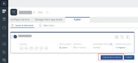](Resources/Images/AppReconfigPublish1.png)
3.  Select the required service type from the list. You can also configure the [app](AppReconfig.md) related information from here. The service types available in the list are as follows:
    *   Identity Services
    *   Integration Services
    *   Object Service
4.  The app displays the selected service details with default connection parameters and configurable connection parameters.

The list of the configurable connection parameters vary for each service type. Following is the list of configurable connection parameters with respect to each service type and adapter.

[Identity Service](javascript:void(0);)

  
| Identity Service Provider | Properties |
| --- | --- |
| Okta Login | Domain name> **_Note:_** Refresh the other URLs on the domain name to point to the new reconfigured URL. Client ID Client Secret |
| OAuth Services (Out of the box OAuth connectors like Microsoft, Linkedin) | Authorize Endpoint Token Endpoint Profile Endpoint Client ID Client Secret |
| Custom Identity Service | Custom Identity Service Endpoint |
| SAP Service | Gateway Address Port Scheme |
| Salesforce | OAuth 2.0 and Username/Password: Salesforce ClientID Salesforce ClientSecret Salesforce URL |
| Microsoft Active Directory | SAML: Metadata URL (in case Metadata Mode = URL) LDAP/LDAPS: Domain Name LDAP URL Root Domain Azure Active Directory (SAML): Metadata URL (in case Metadata Mode = URL) |
| SAML | Metadata URL (in case Metadata Mode = URL) |
| Open LDAP | Domain Name LDAP URL Root Domain Bind Username |

[Integration Service](javascript:void(0);)

  
| Adapter type | Properties |
| --- | --- |
| XML | Base URL - you can reconfigure the base URL. Web Authentication - you can configure the authentication modes. ignore proxy - you can reconfigure the proxy (for on-premises only). |
| JSON | Base URL - you can reconfigure the base URL. Web Authentication - you can configure the authentication modes. ignore proxy - you can reconfigure the proxy (for on-premises only). |
| SOAP | Base URL - you can reconfigure the base URL. Web Authentication - you can configure the authentication modes. ignore proxy - you can reconfigure the proxy (for on-premises only). |
| SAP | If you choose Select authentication service as **Use Existing Identity Provider**, you cannot reconfigure any entities. If you choose Select authentication service as **Specify Login Endpoint**, you can reconfigure the entities such as gateway address, port, and header prefix. |
| Salesforce | If you choose Salesforce Authentication Type as **Use Existing Identity Provider**, you cannot reconfigure any entities. If you choose Salesforce Authentication Type as **Specify Login Endpoint**, you can reconfigure the entities such as client ID, client secret, username, and password. |
| Java | None |
| JavaScript | None |
| APIProxy | None |
| Relational Database | Connection Parameters Schema Mapping JSON |
| MongoDB | Connection Parameters |
| RAML | Connection Parameters |
| OpenAPI (Swagger) | Connection Parameters:  - Host URL  - Base Path  - Scheme (for Swagger 2.0 only) **_Note:_** If the Swagger file does not contain a scheme, **https** is selected by default. If the Swagger file contains both **http** and **https**, **http** is selected by default. Reconfiguring the scheme is only available on VoltMX Foundry versions V9 SP3 or later. If your runtime server version is V9 SP2 or earlier, the reconfigured scheme from the Foundry Console is not honored at run time. |
| Salesforce | Connection Parameters |
| IBM MQ | Connection Parameters |
| **_Note:_** Throttling details for all integration services are displayed under **Publish** > **Configure & Publish** > **Integration Service Configuration**.||

[Object Service](javascript:void(0);)

  
| Adapter type | Properties |
| --- | --- |
| SAP | If you choose Select authentication service as **Use Existing Identity Provider**, you cannot reconfigure any entities. If you choose Select authentication service as **Specify Login Endpoint**, you can reconfigure the entities such as gateway address, port, and header prefix. |
| Salesforce | If you choose Salesforce Authentication Type as **Use Existing Identity Provider**, you cannot reconfigure any entities. If you choose Salesforce Authentication Type as **Specify Login Endpoint**, you can reconfigure the entities such as client ID, client secret, username, and password. |
| Relational Database | Connection Parameters Schema Mapping JSON |
| MongoDB | Connection Parameters |
| RAML | Connection Parameters |
| Integration/Orchestration | None |
| Storage | None |
| > **_Note:_** Throttling details for all object services are displayed under **Publish** > **Configure & Publish** > **Object Service Configuration**. ||

The service details page displays the following fields:

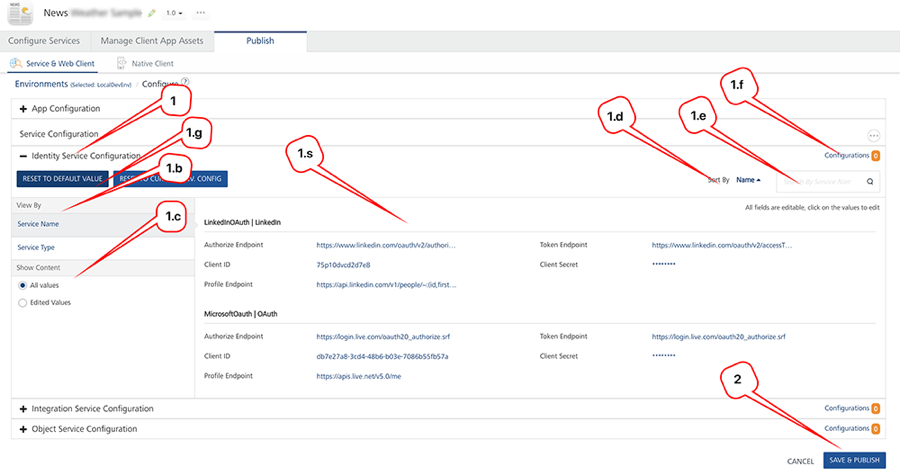

  
| Number | Section | Description |
| --- | --- | --- |
| 1 | Identity Service Configuration | Displays the Identity Services configuration details for app reconfiguration. |
| 1\. a | Work area | Displays the configurable properties of all the services such as Client ID, Client Secret and Domain Name. You can edit the values of the properties and click Save. An undo icon appears next to the value field until you publish the app. You can reset the new value to default value by selecting one of the options in the Reset to Default Values drop-down list. > **_Note:_**  Based on a combination of selected conditions in the **View By** and **Show Content** sections, the system displays services, entities for all services, and edited values.You can select the following combinations in the **View By** and **Show Content** section:    -  Service Name and All Values   -  Service Name and Edited Values   -  Service Type and All Values   -  Service Type and Edited Values |
| 1\. b | View By | Displays services based on conditions such as service name or service type. **Service Name**: Displays services and their entities. **Service Type**: Displays the headers of service types. To view content in a service type, click the **Plus (+)** icon. |
| 1\. c | **Show Content** | Displays content in services based on conditions such as all values or edited values. **All Values**: Displays services and their entities. **Edited Values**: Displays services and their edited entities. |
| 1\. d | **Sort By** | Sorts the services in the work area in A to Z  or  Z or A order. |
| 1\. e | **Search by Service Name** | Filters the services based on service name. |
| 1\. f | Configurations | Compares the reconfigured services. |
| 1\. g | **Reset to Default Values** Reset to Default Value Reset to Current Env. Config | Resets the values of reconfigured services. |
| 2 | **SAVE & PUBLISH** | Saves and publishes the reconfigured app to an environment. |

You can do the following from the service details page to configure the connection parameters:

*   In **View By**, you can select the required option to change the order in which you view the services. The options available are as follows:
    *   **Service Name**: Click **Service Name** if you want to view the services in an alphabetical order based on the service names. The system displays all the details of each service in this view.
        
        > **_Note:_**   By default, the list view is set to **View By as Service Name** and **Show Content as All Values**.
        
        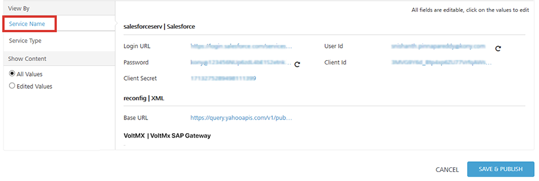
        
    *   **Service Type**: Click **Service Type** if you want to group the services based on the service type. To view details in each service type, click the **Plus** icon and expand the service.
        
        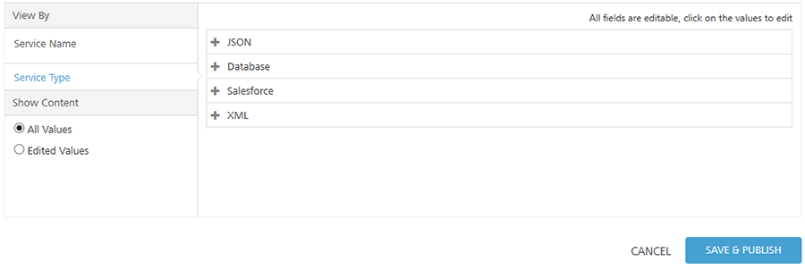
        
*   In **Show Content**, you can select the required option to change the view of the content within the service based on their values. The options available are as follows:
    *   **All Values**: Click **All Values** if you want to view all values including reconfigured values for the selected filter in the **View By** section.  
        For example, if you change User ID and Password for Salesforce service, shown below.
        
        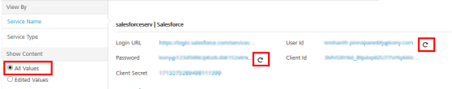  
        
    *   **Edited Values**: Click **Edited Values** if you want to view only the reconfigured values for the selected filter in the **View By** section.  
        For example, if you change User ID and Password for Salesforce service, shown below.
        
        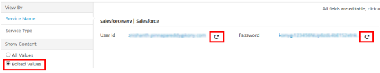
        
*   In the work area, follow these steps to reconfigure values in the services:
    1.  To change any value, click the value. For example, to change the base URL, click it.
        
        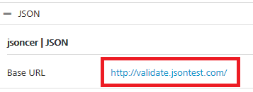
        
        The system displays the value in the text box, and the **save** and **cancel** buttons next to the text box.
        
        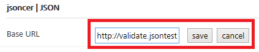
        
    2.  Edit the value in the text box . For example, change  `com`   to  `net`.
        
        > **_Important:_**  When you reconfigure a value, click the **save** button to save the changes. If you click anywhere else on the page, the changes will be lost, and you will get only the previous data.
        
    3.  Click **save**. The system adds an **undo** button next to each reconfigured values.
        
        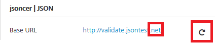
        
*   Click **SAVE & PUBLISH** to start the publishing.

You can also do the following tasks from the service details page:

*   [Compare Reconfigured Integration Services](#compare-reconfigured-services)
*   [Reset Values for Reconfigured Integration Services](#reset-values-for-reconfigured-services)

Reconfigure the Schema Name in Relational Database Connectors
-------------------------------------------------------------

In **Integration Service Configuration**, you can reconfigure the schema name in Relational Database Connectors using JSON. To reconfigure the schema name, follow these steps:

*   Under **Schema Mapping JSON**, click against the service to enter the schema name.
    
    **For example**, To change the schema name from dev to QA, enter the JSON value and click **Save**.
    
    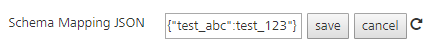
    
    *   `test_abc` - Schema on which operations are selected.
    *   `test_123` - Schema on which run time operations must be performed.

The system adds an **undo** button next to each reconfigured value.

*   Click **Save and Publish** to start the publishing.

Compare Reconfigured Services  

--------------------------------

In the service details page, after you reconfigure values of services, you can compare the details of all services. You cannot edit any fields in the compare dialog.

1.  In the App configuration page, click **Configurations** on the required service configuration row.  
    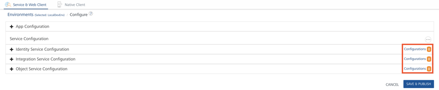  
    
    The system displays the **Current Environment Configuration Vs Definition Values** dialog box.
    
    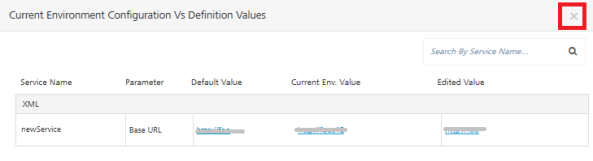
    

*   Service Name: Displays the service name.
*   Parameter: Displays the field name that is reconfigurable.
*   Default Value: Displays the value configured in the design time.
*   Current Env. Value:Displays reconfigured value in the current environment.
*   Edited Value: Displays the edited value for the selected environment.
    
    > **_Important:_**  In the **Current Environment Configuration Vs Definition Values** dialog box, the values in the **Current Env. Value**  and  **Edited Value** fields are updated to an environment only when you click **SAVE & PUBLISH**.
    

3.  Click the **Close** button at the top-right corner to exit the dialog.

Reset Values for Reconfigured Services
--------------------------------------

In the service details page, after you reconfigure values of services, you can reset the values to the default configuration or to the current environment configuration.  
  

> **_Important:_**  When you modify a field and save the service, the system overrides old values with the new values in the current environment clipboard.

To reset to default values, follow these steps:

*   **Reset to Default Value**: After you reconfigure a value in the work area, and when you choose **Reset to Default Value**, the system resets the reconfigured values to the default values that are configured in the current workspace - for example, Developer environment.
*   **Reset to Current Environment Config**: Contains last saved values. After you reconfigure a value in the work area, when you choose **Reset to Current Environment Config**, the system resets all values to the current environment (last saved values).
