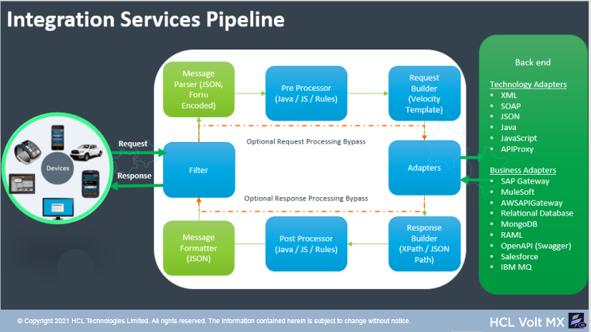

User Guide: [Integration](#integration) \> Overview

# Integration

## Overview

An Integration Service is an application component that represents the application interaction with an external system or data source. A service definition comprises the meta-data or the configurations required to exchange data with the external system or data source. For example, the configurations can be service type, Endpoint URL, service ID, type (HTTP/HTTPS), request parameters, response parameters, preprocessors and postprocessors, and authentication credentials if required.

For more hands-on approach on how to implement Integration Services, import and preview the **News and Weather** app using Volt MX Iris.  

## Use Cases

If you want to develop an app which enables users to browse through news headlines with different categories such as _Top Stories_, _World_, _Science_, _Technology_, _Sports_, weather conditions and so on. In this scenario, you need to use Integration services of Volt MX Foundry to fetch data from 3rd party news and weather APIs, which populates the same data in the front end of the app.

## Workflow of Integration Services

The following workflow describes the various stages of Integration services:

| **Service Request flow**                                                                                                                                                                                                                                                                                                                                                                                                                                                                                                                                                                                                                                                                                                                                                                                                                                                                                                                                                                                                                                                                                                                                                                                                                               |
| ------------------------------------------------------------------------------------------------------------------------------------------------------------------------------------------------------------------------------------------------------------------------------------------------------------------------------------------------------------------------------------------------------------------------------------------------------------------------------------------------------------------------------------------------------------------------------------------------------------------------------------------------------------------------------------------------------------------------------------------------------------------------------------------------------------------------------------------------------------------------------------------------------------------------------------------------------------------------------------------------------------------------------------------------------------------------------------------------------------------------------------------------------------------------------------------------------------------------------------------------------ |
| a. **Request** A client sends a **request** to Volt MX Foundry.  b. **Filter**  c. **Message Parser (JSON, Form Encoded)**  d. **Pre-Processor** After Volt MX Foundry receives the call from the device, Volt MX Foundry executes custom Java/JS code based on the configured **Pre-Processor** before making any outbound calls.The custom Java/JS code is typically used to decide on what service to call. The custom code can also perform data validation on the request input.  e. **Request Builder (Velocity Template)** For adapters (such as XML, JSON), user can format the request sent to an enterprise backend by defining a [velocity template](http://velocity.apache.org/).  f. **Adapters** An adapter is the component that communicates to the backend. it takes the formatted request from the request builder and sends it to the enterprise backend. In addition to the out of the box adapters, we can import adapters from [VoltMX Marketplace](https://marketplace.voltmx.com/domain/general?category=2124).  **_Note_:** You can select the **Enable pass-through** check box in the **Request Input** tab for Volt MX Foundry to forward the headers and body of clients request to the back end as is. |

| **Service Response flow**                                                                                                                                                                                                                                                                                                                                                                                                                                                                                                                                                                                                                                                                                                                                                                                                                                                                                                                                            |
| -------------------------------------------------------------------------------------------------------------------------------------------------------------------------------------------------------------------------------------------------------------------------------------------------------------------------------------------------------------------------------------------------------------------------------------------------------------------------------------------------------------------------------------------------------------------------------------------------------------------------------------------------------------------------------------------------------------------------------------------------------------------------------------------------------------------------------------------------------------------------------------------------------------------------------------------------------------------- |
| a. **Adapters** An adapter receives the response from the enterprise backend for further processing in Volt MX Foundry.  b. **Response Builder** Volt MX Foundry extracts data from the backend payload using **XPath** or **JSON Path** in the form of response parameters.  c.**Post-Processor** After extracting the data, Foundry executes the custom Java/JS code based on the configured **Post-Processor**.The custom Java/JS code is typically used to process the data before returning the data to the client. The custom code can also determine whether Foundry needs to make additional service calls.  c. **Message Formatter (JSON)**  e. **Filter**   f. **Response** Volt MX Foundry sends the transformed **response** (in JSON) to the client.  **_Note:_** You can select the **Enable pass-through** check box in the **Response Output** tab for Volt MX Foundry to forward the response from the back end as is to clients. |

## Supported Endpoint Adapters

Volt MX Integration supports back-end connectivity to Web services such as XML, JSON, JavaScript, Database, Salesforce and so on. If external data sources do not expose the services to these well-known interfaces, you can build a Java service with a custom code.

Out of the box Volt MX Foundry Integration Services support connectivity to the following different endpoint adapters.

<table>
  <tr>
    <th>Endpoint Type</th>
    <th>Description</th>
    <th>Endpoint Configuration</th>
  </tr>
  <tr>
    <td>
      <a href="XML.html">XML</a>
    </td>
    <td>An XML Adapter communicates with an external data source using an XML endpoint over the HTTP protocol.</td>
    <td>
      <ul>
        <li>
          <a href="XML.html#configure-xml-end-point-adapter">Configure XML Endpoint Adapter</a>
        </li>
        <li>
          <a href="XML.html#create-operations-for-xml">Create Operations for XML</a>
          <ul>
            <li>
              <a href="XML.html#configure-request-operation-for-xml">Configure Request Operation for XML</a>
            </li>
            <li>
              <a href="XML.html#configure-response-operation-for-xml">Configure Response Operation for XML</a>
            </li>
          </ul>
        </li>
      </ul>
    </td>
  </tr>
  <tr>
    <td>
      <a href="SOAP.html">SOAP</a>
    </td>
    <td>Simple Object Access Protocol (SOAP) is a messaging protocol that uses WSDL to describe the functionality of a SOAP based web service.</td>
    <td>
      <ul>
        <li>
          <a href="SOAP.html#configure-soap-end-point-adapter">Configure SOAP Endpoint Adapter</a>
        </li>
        <li>
          <a href="SOAP.html#create-operations-for-soap">Create Operations for SOAP</a>
          <ul>
            <li>
              <a href="SOAP.html#configure-request-operation-for-soap">Configure Request Operation for SOAP</a>
            </li>
            <li>
              <a href="SOAP.html#configure-response-operation-for-soap">Configure Response Operation for SOAP</a>
            </li>
          </ul>
        </li>
      </ul>
    </td>
  </tr>
  <tr>
    <td>
      <a href="JSON.html">JSON</a>
    </td>
    <td>JavaScript Object Notation (JSON) communicates with an external data source over the HTTP protocol, and returns a response in JSON format.</td>
    <td>
      <ul>
        <li>
          <a href="JSON.html#configure-json-end-point-adapter">Configure JSON Endpoint Adapter</a>
        </li>
        <li>
          <a href="JSON.html#create-operations-for-json">Create Operations for JSON</a>
          <ul>
            <li>
              <a href="JSON.html#configure-request-operation-for-json">Configure Request Operation for JSON</a>
            </li>
            <li>
              <a href="JSON.html#configure-response-operation-for-json">Configure Response Operation for JSON</a>
            </li>
          </ul>
        </li>
      </ul>
    </td>
  </tr>
  <tr>
    <td>
      <a href="Java_Adapter.html">Java</a>
    </td>
    <td>Java Adapter interacts with the software application that does not support restful APIs using a custom Java code.</td>
    <td>
      <ul>
        <li>
          <a href="Java_Adapter.html#configure-java-endpoint-adapter">Configure Java Endpoint Adapter</a>
        </li>
        <li>
          <a href="Java_Adapter.html#create-operations-for-java">Create Operations for Java</a>
          <ul>
            <li>
              <a href="Java_Adapter.html#configure-request-operation-for-java">Configure Request Operation for Java</a>
            </li>
            <li>
              <a href="Java_Adapter.html#configure-response-operation-for-java">Configure Response Operation for Java</a>
            </li>
          </ul>
        </li>
      </ul>
    </td>
  </tr>
  <tr>
    <td>
      <a href="JavaScript_Adapter.html">JavaScript</a>
    </td>
    <td>JavaScript integrates plain JavaScript services to applications in Volt MX Foundry.</td>
    <td>
      <ul>
        <li>
          <a href="JavaScript_Adapter.html#configure-javascript-endpoint-adapter">Configure JavaScript Endpoint Adapter</a>
        </li>
        <li>
          <a href="JavaScript_Adapter.html#create-operations-for-javascript">Create Operations for JavaScript</a>
          <ul>
            <li>
              <a href="JavaScript_Adapter.html#configure-request-operation-for-javascript">Configure Request Operation for JavaScript</a>
            </li>
            <li>
              <a href="JavaScript_Adapter.html#configure-response-operation-for-javascript">Configure Response Operation for JavaScript</a>
            </li>
          </ul>
        </li>
      </ul>
    </td>
  </tr>
  <tr>
    <td>
      <a href="API_Proxy_Adapter.html">API Proxy</a>
    </td>
    <td>API Proxy forwards the request and response without intermediate transformation (without affecting the actual request and response).</td>
    <td>
      <ul>
        <li>
          <a href="API_Proxy_Adapter.html#configure-apiproxy-endpoint-adapter">Configure API Proxy Endpoint Adapter</a>
        </li>
        <li>
          <a href="API_Proxy_Adapter.html#create-operations-for-apiproxy">Create Operations for API Proxy</a>
        </li>
      </ul>
    </td>
  </tr>
  <tr>
    <td>
      <a href="MockData_Adapter.html">Mock Data</a>
    </td>
    <td>The Volt MX Mock Data adapter capability helps you to continue to develop apps when the back-end services that an app connects to are not ready to be leveraged.</td>
    <td>
      <ul>
        <li>
          <a href="MockData_Adapter.html#configure-mock-data-adapter">Configure Mock Data Endpoint Adapter</a>
        </li>
        <li>
          <a href="MockData_Adapter.html#create-operations-for-mock-data">Create Operations for Mock Data</a>
          <ul>
            <li>
              <a href="MockData_Adapter.html#configure-request-operation-for-mock-data">Configure Request Operation for Mock Data</a>
            </li>
            <li>
              <a href="MockData_Adapter.html#create-response-operation-for-mock-data">Configure Response Operation for Mock Data</a>
            </li>
          </ul>
        </li>
      </ul>
    </td>
  </tr>
  <tr>
    <td>
      <a href="VoltMX_SAP_Gateway_Adapter.html">VoltMX SAP Gateway</a> Only available if you have SAP Gateway services in your account
    </td>
    <td>Volt MX SAP Gateway communicates with external SAP services over supported HTTP methods.</td>
    <td>
      <ul>
        <li>
          <a href="VoltMX_SAP_Gateway_Adapter.html#configure-volt-mx-sapgateway-endpoint-adapter">Configure VoltMX SAP Gateway Endpoint Adapter</a>
        </li>
        <li>
          <a href="VoltMX_SAP_Gateway_Adapter.html#create-operations-for-voltmxsapgateway">Create Operations for VoltMX SAP Gateway</a>
          <ul>
            <li>
              <a href="VoltMX_SAP_Gateway_Adapter.html#configure-request-operation-for-volt-mx-sapgateway">Configure Request Operation for VoltMX SAP Gateway</a>
            </li>
            <li>
              <a href="VoltMX_SAP_Gateway_Adapter.html#configure-response-operation-for-volt-mx-sapgateway">Configure Response Operation for VoltMX SAP Gateway</a>
            </li>
          </ul>
        </li>
      </ul>
    </td>
  </tr>
  <tr>
    <td>
      <a href="Mulesoft.html">MuleSoft</a>
    </td>
    <td>MuleSoft (Anypoint Platform™) is a platform that helps app developers to design custom APIs and deploy to a Mule Enterprise Service Bus runtime (ESB). With MuleSoft integration service in Volt MX Foundry, developers can interact with more than 50 types of adapters.</td>
    <td>
      <ul>
        <li>
          <a href="Mulesoft.html#configure-mulesoft-end-point-adapter">Configure MuleSoft Endpoint Adapter</a>
        </li>
        <li>
          <a href="Mulesoft.html#create-operations-for-mulesoft">Create Operations for MuleSoft</a>
          <ul>
            <li>
              <a href="Mulesoft.html#configure-request-operation-for-mulesoft">Configure Request Operation for MuleSoft</a>
            </li>
            <li>
              <a href="Mulesoft.html#configure-response-operation-for-mulesoft">Configure Response Operation for MuleSoft</a>
            </li>
          </ul>
        </li>
      </ul>
    </td>
  </tr>
  <tr>
    <td>
      <a href="AWS_API_Gateway_Adapter.html">AWS API Gateway</a>
    </td>
    <td>AWS API Gateway connects to the services configured and deployed under API Gateway Service in Amazon Web Services.</td>
    <td>
      <ul>
        <li>
          <a href="AWS_API_Gateway_Adapter.html#configure-awsapigateway-endpoint-adapter">Configure AWS API Gateway Endpoint Adapter</a>
        </li>
        <li>
          <a href="AWS_API_Gateway_Adapter.html#create-operations-for-awsapigateway">Create Operations for AWS API Gateway</a>
          <ul>
            <li>
              <a href="AWS_API_Gateway_Adapter.html#configure-request-operation-for-awsapigateway">Configure Request Operation for AWS API Gateway</a>
            </li>
            <li>
              <a href="AWS_API_Gateway_Adapter.html#configure-response-operation-for-awsapigateway">Configure Response Operation for AWS API Gateway</a>
            </li>
          </ul>
        </li>
      </ul>
    </td>
  </tr>
  <tr>
    <td>
      <a href="Relational_Database_Adapter.html">Database</a>
    </td>
    <td>With Volt MX Foundry database adapter, you can connect to your own database as an endpoint. After you configure the database adapter in Volt MX Foundry Console, you can perform create, read, update, and delete (CRUD and Binary CRUD) operations on data in the tables and invoke stored procedures, functions, and views.</td>
    <td>
      <ul>
        <li>
          <a href="Relational_Database_Adapter.html#configure-database-end-point-adapter">Configure Database Endpoint Adapter</a>
        </li>
        <li>
          <a href="Relational_Database_Adapter.html#create-crud-operations-for-database-adapter">Create CRUD Operations for Database Adapter</a>
        </li>
        <li>
          <a href="Relational_Database_Adapter.html#configure-crudoperations-for-a-database-adapter">Configure CRUD Operations for a Database Adapter</a>
          <ul>
            <li>
              <a href="Relational_Database_Adapter.html#create-a-database-record-with-create-operation">Create a Database Record with Create Operation</a>
            </li>
            <li>
              <a href="Relational_Database_Adapter.html#how-to-query-a-database-and-display-information-with-the-read-operation">Query a Database and Display Information with Read Operation</a>
            </li>
            <li>
              <a href="Relational_Database_Adapter.html#how-to-update-a-database-record-with-update-operation">Update a Database Record with Update Operation</a>
            </li>
            <li>
              <a href="Relational_Database_Adapter.html#how-to-delete-a-database-record-with-delete-operation">Delete a Database Record with Delete Operation</a>
            </li>
          </ul>
        </li>
      </ul>
    </td>
  </tr>
  <tr>
    <td>
      <a href="MongoDB_Adapter.html">MongoDB</a>
    </td>
    <td>With Volt MX Foundry MongoDB database adapter, you can connect to your own MongoDB database as an endpoint. After you configure the MongoDB adapter, you can perform create, read, update, and delete (CRUD) operations on MongoDB collections and documents.</td>
    <td>
      <ul>
        <li>
          <a href="MongoDB_Adapter.html#configure-mongodb-end-point-adapter">Configure MongoDB Adapter</a>
        </li>
        <li>
          <a href="MongoDB_Adapter.html#create-and-configure-operations-for-mongodb-adapter">Create and Configure CRUD Operations for a MongoDB Adapter</a>
        </li>
      </ul>
    </td>
  </tr>
  <tr>
    <td>
      <a href="RAML_Adapter.html">RAML</a>
    </td>
    <td>RESTful API Modeling Language (RAML) is a YAML-based language for describing RESTful APIs.</td>
    <td>
      <ul>
        <li>
          <a href="RAML_Adapter.html#configure-ramlendpoint-adapter">Configure RAML Endpoint Adapter</a>
        </li>
        <li>
          <a href="RAML_Adapter.html#create-operations-for-raml">Create Operations for RAML</a>
          <ul>
            <li>
              <a href="RAML_Adapter.html#configure-request-operation-for-raml">Configure Request Operation for RAML</a>
            </li>
            <li>
              <a href="RAML_Adapter.html#configure-response-operation-for-raml">Configure Response Operation for RAML</a>
            </li>
          </ul>
        </li>
      </ul>
    </td>
  </tr>
  <tr>
    <td>
      <a href="Salesforce_Adapter.html">Salesforce</a>
    </td>
    <td>Salesforce uses a protocol-specific adapter to connect to an external system and access its data.</td>
    <td>
      <ul>
        <li>
          <a href="Salesforce_Adapter.html#configure-salesforce-endpoint-adapter">Configure Salesforce Endpoint Adapter</a>
        </li>
        <li>
          <a href="Salesforce_Adapter.html#create-operations-for-salesforce">Create Operations for Salesforce</a>
          <ul>
            <li>
              <a href="Salesforce_Adapter.html#configure-request-operation-for-salesforce">Configure Request Operation for Salesforce</a>
            </li>
            <li>
              <a href="Salesforce_Adapter.html#configure-response-operation-for-salesforce">Configure Response Operation for Salesforce</a>
            </li>
          </ul>
        </li>
      </ul>
    </td>
  </tr>
  <tr>
    <td>
      <a href="IBM_MQ_service.html">IBM MQ</a>
    </td>
    <td>IBM MQ server 9.0.0 version is a messaging middleware that simplifies and accelerates the integration of diverse applications and business data across multiple platforms. Volt MX uses the IBM MQ service to secure the message delivery and reduce the risk of data loss.</td>
    <td>
      <ul>
        <li>
          <a href="IBM_MQ_service.html#configure-ibmmq-end-point-adapter">Configure IBM MQ Endpoint Adapter</a>
        </li>
        <li>
          <a href="IBM_MQ_service.html#create-operations-for-ibmmq-service">Create Operations for IBM MQ</a>
          <ul>
            <li>
              <a href="IBM_MQ_service.html#configure-request-operation-for-ibmmq">Configure Request Operation for IBM MQ</a>
            </li>
            <li>
              <a href="IBM_MQ_service.html#configure-response-operation-for-ibmmq">Configure Response Operation for IBM MQ</a>
            </li>
          </ul>
        </li>
      </ul>
    </td>
  </tr>
  <tr>
    <td>
      <a href="SAP_JCO.html">SAP JCo</a>
    </td>
    <td>Volt MX Foundry allows you to access and use the external SAP services using custom SAP Connector. You must load the required Business Application Programming Interface (BAPI) functions to define an SAP service. The BAPI files contain the SAP methods and functions.</td>
    <td>
      <ul>
        <li>
          <a href="SAP_JCO.html#configure-sap-jco-end-point-adapter">Configure SAP JCo Endpoint Adapter</a>
        </li>
        <li>
          <a href="SAP_JCO.html#create-operations-for-sapjco">Create Operations for SAP JCo</a>
          <ul>
            <li>
              <a href="SAP_JCO.html#configure-request-operation-for-sap-jco">Configure Request Operation for SAP JCo</a>
            </li>
            <li>
              <a href="SAP_JCO.html#configure-response-operation-for-sapjco">Configure Response Operation for SAP JCo</a>
            </li>
          </ul>
        </li>
      </ul>
    </td>
  </tr>
  <tr>
    <td>
      <a href="Open_API__Swagger_.html">Open API (Swagger)</a>
    </td>
    <td>Swagger is a powerful open API specification framework backed by a large ecosystem of tools that helps you design, build, document, and consume your RESTful APIs.</td>
    <td>
      <ul>
        <li>
          <a href="Open_API__Swagger_.html#configuring-an-openapi-swagger-end-point-adapter">Configure Open API (Swagger) Endpoint Adapter</a>
        </li>
        <li>
          <a href="Open_API__Swagger_.html#creating-operations-for-openapi-swagger">Create Operations for Open API (Swagger)</a>
          <ul>
            <li>
              <a href="Open_API__Swagger_.html#configuring-request-parameters">Configure Request Operation for Open API (Swagger)</a>
            </li>
            <li>
              <a href="Open_API__Swagger_.html#configuring-response-parameters">Configure Response Operation for Open API (Swagger)</a>
            </li>
          </ul>
        </li>
      </ul>
    </td>
  </tr>
  <tr>
    <td>
      <a href="Email_Adapter.html">Email Adapter</a>
    </td>
    <td>The Email Adapter is used to send emails from the client app. You can also view the status of the emails that were sent by using the Email service. The email requests are sent to the Volt MX Foundry server which in-turn redirects them to the Volt MX Engagement server.</td>
    <td>
      <ul>
        <li>
          <a href="Email_Adapter.html#configure-a-service-definition">Configure the Email Adapter</a>
        </li>
        <li>
          <a href="Email_Adapter.html#configure-operations-for-the-service-definition">Create Operations for the Email Adapter</a>
          <ul>
            <li>
              <a href="Email_Adapter.html#request-input-parameters">Request Input Parameters</a>
            </li>
            <li>
              <a href="Email_Adapter.html#response-output-parameters">Response Output Parameters</a>
            </li>
          </ul>
        </li>
      </ul>
    </td>
  </tr>
  <tr>
    <td>
      <a href="S3_File_Storage.html">AWS S3</a>
    </td>
    <td>The AWS S3 service on Volt MX Foundry connects to the specified S3 bucket, and also performs supported operations.</td>
    <td>
      <ul>
        <li>
          <a href="S3_File_Storage.html#configure-a-service-for-aws-s3">Configure the AWS S3 adapter</a>
        </li>
        <li>
          <a href="S3_File_Storage.html#create-operations-for-aws-s3">Create Operations for AWS S3</a>
          <ul>
            <li>
              <a href="S3_File_Storage.html#configure-request-input-parameters">Configure Request Operation for AWS S3</a>
            </li>
            <li>
              <a href="S3_File_Storage.html#configure-response-output-parameters">Configure Response Operation for AWS S3</a>
            </li>
          </ul>
        </li>
      </ul>
    </td>
  </tr>
  <tr>
    <td>
      <a href="Cloudian_File_Storage.html">Cloudian</a>
    </td>
    <td>The Cloudian service on Volt MX Foundry connects to the specified S3 bucket on a HyperStore, and also performs supported operations.</td>
    <td>
      <ul>
        <li>
          <a href="Cloudian_File_Storage.html#configure-a-service-for-cloudian">Configure the Cloudian Adapter</a>
        </li>
        <li>
          <a href="Cloudian_File_Storage.html#create-operations-for-cloudian">Create Operations for Cloudian</a>
          <ul>
            <li>
              <a href="Cloudian_File_Storage.html#configure-request-input-parameters">Configure Request Operation for Cloudian</a>
            </li>
            <li>
              <a href="Cloudian_File_Storage.html#configure-response-output-parameters">Configure Response Operation for Cloudian</a>
            </li>
          </ul>
        </li>
      </ul>
    </td>
  </tr>
  <tr>
    <td>
      <a href="Foundry_Admin_Adapter.html">Foundry Admin Adapter</a>
    </td>
    <td>The Foundry Admin Adapter is used to perform administrative tasks (exposed via secure APIs) on a Foundry run-time server. With the adapter, external systems can invoke the provided APIs to read or modify settings on the Foundry server.</td>
    <td>
      <ul>
        <li>
          <a href="Foundry_Admin_Adapter.html#step1-configure-a-rules-service-and-publish-it-to-an-environment">Step 1: Configure a Rules Service and publish it to an environment</a>
        </li>
        <li>
          <a href="Foundry_Admin_Adapter.html#step2-configure-an-integration-service-using-the-foundry-admin-adapter">Step 2: Configure an Integration Service using the Foundry Admin adapter</a>
        </li>
        <li>
          <a href="Foundry_Admin_Adapter.html#step3-configure-the-operations-for-managing-the-rules">Step 3: Configure the Operations for Managing the Rules</a>
        </li>
        <li>
          <a href="Foundry_Admin_Adapter.html#step4-publish-the-foundry-app-containing-the-integration-service-to-that-environment">Step 4: Publish the Foundry app containing the Integration Service to that environment</a>
        </li>
        <li>
          <a href="Foundry_Admin_Adapter.html#operations-supported-for-foundry-admin-adapter-with-sample-requestresponse-and-error-scenario">Operations supported for Foundry Admin Adapter</a>
        </li>
      </ul>
    </td>
  </tr>
  <tr>
    <td>
      <a href="Red_Hat_PAM_Adapter.html">Red Hat PAM</a>
    </td>
    <td>The Red Hat PAM adapter in Foundry Console exposes the services and operations that are created by using the Red Hat PAM Business Central Interface.</td>
    <td>
      <ul>
        <li>
          <a href="Red_Hat_PAM_Adapter.html#how-to-configure-service-definition-for-red-hat-pam-adapter">Configure Service Definition for Red Hat PAM Adapter</a>
        </li>
        <li>
          <a href="Red_Hat_PAM_Adapter.html#how-to-create-and-configure-operations-for-the-red-hat-pam-adapter">Create and Configure Operations for the Red Hat PAM Adapter</a>
        </li>
      </ul>
    </td>
  </tr>
  <tr>
    <td>
      <a href="Text_Adapter.html">Text</a>
    </td>
    <td>Text Adapter forwards the request that has Text data and gives response without intermediate transformation (without affecting the actual request and response).</td>
    <td>
      <ul>
        <li>
          <a href="Text_Adapter.html#configure-text-adapter">Configure Text Adapter</a>
        </li>
        <li>
          <a href="Text_Adapter.html#create-operations-for-text-adapter">Create Operations for Text Adapter</a>
        </li>
      </ul>
    </td>
  </tr>
</table>

<!-- | Endpoint Type | Description | Endpoint Configuration |
| --- | --- | --- |
| [XML](XML.md#Configur) | An XML Adapter communicates with an external data source using an XML endpoint over the HTTP protocol. | [Configure XML Endpoint Adapter](XML.md#configure-xml-end-point-adapter) [Create Operations for XML](XML.md#create-operations-for-xml) [Configure Request Operation for XML](XML.md#configure-request-operation-for-xml) [Configure Response Operation for XML](XML.md#configure-response-operation-for-xml) |
| [SOAP](SOAP.md#top) | Simple Object Access Protocol (SOAP) is a messaging protocol that uses WSDL to describe the functionality of a SOAP based web service. | [Configure SOAP Endpoint Adapter](SOAP.md#configure-soap-end-point-adapter) [Create Operations for SOAP](SOAP.md#create-operations-for-soap) [Configure Request Operation for SOAP](SOAP.md#configure-request-operation-for-soap) [Configure Response Operation for SOAP](SOAP.md#configure-response-operation-for-soap) |
| [JSON](JSON.md) | JavaScript Object Notation (JSON) communicates with an external data source over the HTTP protocol, and returns a response in JSON format. | [Configure JSON Endpoint Adapter](JSON.md#configure-json-end-point-adapter) [Create Operations for JSON](JSON.md#create-operations-for-json) [Configure Request Operation for JSON](JSON.md#configure-request-operation-for-json) [Configure Response Operation for JSON](JSON.md#configure-response-operation-for-json) |
| [Java](Java_Adapter.md) | Java Adapter interacts with the software application that does not support restful APIs using a custom Java code. | [Configure Java Endpoint Adapter](Java_Adapter.md#configure-java-endpoint-adapter) [Create Operations for Java](Java_Adapter.md#create-operations-for-java) [Configure Request Operation for Java](Java_Adapter.md#configure-request-operation-for-java) [Configure Response Operation for Java](Java_Adapter.md#configure-response-operation-for-java) |
| [JavaScript](JavaScript_Adapter.md) | JavaScript integrates plain JavaScript services to applications in Volt MX Foundry. | [Configure JavaScript Endpoint Adapter](JavaScript_Adapter.md#JavaScript_Service) [Create Operations for JavaScript](JavaScript_Adapter.md#create-operations-for-javascript) [Configure Request Operation for JavaScript](JavaScript_Adapter.md#configure-request-operation-for-javascript) [Configure Response Operation for JavaScript](JavaScript_Adapter.md#configure-response-operation-for-javascript) |
| [API Proxy](API_Proxy_Adapter.md) | API Proxy forwards the request and response without intermediate transformation (without affecting the actual request and response). | [Configure API Proxy Endpoint Adapter](API_Proxy_Adapter.md#configure-api-proxy-endpoint-adapter) [Create Operations for API Proxy](API_Proxy_Adapter.md#create-operations-for-api-proxy) |
| [Mock Data](MockData_Adapter.md) | The Volt MX Mock Data adapter capability helps you to continue to develop apps when the back-end services that an app connects to are not ready to be leveraged. | [Configure Mock Data Endpoint Adapter](MockData_Adapter.md#StubOperations) [Create Operations for Mock Data](MockData_Adapter.md#StubOperations) [Configure Request Operation for Mock Data](MockData_Adapter.md#Stub_Request) [Configure Response Operation for Mock Data](MockData_Adapter.md#Stub_Output) |
| [VoltMX SAP Gateway](VoltMX_SAP_Gateway_Adapter.md) | Volt MX SAP Gateway communicates with external SAP services over supported HTTP methods. | [Configure Volt MX SAP Gateway Endpoint Adapter](VoltMX_SAP_Gateway_Adapter.md#configure-sap-gateway-endpoint-adapter) [Create Operations for Volt MX SAP Gateway](VoltMX_SAP_Gateway_Adapter.md#create-operations-for-sap-gateway) [Configure Request Operation for Volt MX SAP Gateway](VoltMX_SAP_Gateway_Adapter.md#configure-request-operation-for-sap-gateway) [Configure Response Operation for Volt MX SAP Gateway](VoltMX_SAP_Gateway_Adapter.md#configure-response-operation-for-sap-gateway) |
| [MuleSoft](Mulesoft.md) | MuleSoft (Anypoint Platform™) is a platform that helps app developers to design custom APIs and deploy to a Mule Enterprise Service Bus runtime (ESB). With MuleSoft integration service in Volt MX Foundry, developers can interact with more than 50 types of adapters. | [Configure MuleSoft Endpoint Adapter](Mulesoft.md#configure-mulesoft-end-point-adapter) [Create Operations for MuleSoft](Mulesoft.md#create-operations-for-mulesoft) [Configure Request Operation for MuleSoft](Mulesoft.md#configure-request-operation-for-mulesoft) [Configure Response Operation for MuleSoft](Mulesoft.md#configure-response-operation-for-mulesoft) |
| [AWS API Gateway](AWS_API_Gateway_Adapter.md) | AWS API Gateway connects to the services configured and deployed under API Gateway Service in Amazon Web Services. | [Configure AWS API Gateway Endpoint Adapter](AWS_API_Gateway_Adapter.md#configure-aws-api-gateway-endpoint-adapter) [Create Operations for AWS API Gateway](AWS_API_Gateway_Adapter.md#create-operations-for-aws-api-gateway) [Configure Request Operation for AWS API Gateway](AWS_API_Gateway_Adapter.md#configure-request-operation-for-aws-api-gateway) [Configure Response Operation for AWS API Gateway](AWS_API_Gateway_Adapter.md#configure-response-operation-for-aws-api-gateway) |
| [Database](Relational_Database_Adapter.md) | With Volt MX Foundry database adapter, you can connect to your own database as an endpoint. After you configure the database adapter in Volt MX Foundry Console, you can perform create, read, update, and delete (CRUD and Binary CRUD) operations on data in the tables and invoke stored procedures, functions, and views. | [Configure Database Endpoint Adapter](Relational_Database_Adapter.md#configure-database-end-point-adapter) [Create CRUD Operations for Database Adapter](Relational_Database_Adapter.md#create-crud-operations-for-database-adapter) [Configure CRUD Operations for a Database Adapter](Relational_Database_Adapter.md#configure-crud-operations-for-a-database-adapter) [Create a Database Record with Create Operation](Relational_Database_Adapter.md#create-a-database-record-with-create-operation)[Query a Database and Display Information with Read Operation](Relational_Database_Adapter.md#how-to-query-a-database-and-display-information-with-the-read-operation)[Update a Database Record with Update Operation](Relational_Database_Adapter.md#how-to-update-a-database-record-with-update-operation)[Delete a Database Record with Delete Operation](Relational_Database_Adapter.md#how-to-delete-a-database-record-with-delete-operation) |
| [MongoDB](MongoDB_Adapter.md) | With Volt MX Foundry MongoDB database adapter, you can connect to your own MongoDB database as an endpoint. After you configure the MongoDB adapter, you can perform create, read, update, and delete (CRUD) operations on MongoDB collections and documents. | [Configure MongoDB Adapter](MongoDB_Adapter.md#configure-mongodb-end-point-adapter) [Create and Configure CRUD Operations for a MongoDB Adapter](MongoDB_Adapter.md#create-and-configure-operations-for-mongodb-adapter) |
| [RAML](RAML_Adapter.md) | RESTful API Modeling Language (RAML) is a YAML-based language for describing RESTful APIs. | [Configure RAML Endpoint Adapter](RAML_Adapter.md#configure-raml-endpoint-adapter) [Create Operations for RAML](RAML_Adapter.md#create-operations-for-raml) [Configure Request Operation for RAML](RAML_Adapter.md#configure-request-operation-for-raml) [Configure Response Operation for RAML](RAML_Adapter.md#configure-response-operation-for-raml) |
| [Salesforce](Salesforce_Adapter.md) | Salesforce uses a protocol-specific adapter to connect to an external system and access its data. | [Configure Salesforce Endpoint Adapter](Salesforce_Adapter.md#configure-salesforce-endpoint-adapter) [Create Operations for Salesforce](Salesforce_Adapter.md#create-operations-for-salesforce) [Configure Request Operation for Salesforce](Salesforce_Adapter.md#configure-request-operation-for-salesforce) [Configure Response Operation for Salesforce](Salesforce_Adapter.md#configure-response-operation-for-salesforce) |
| [IBM MQ](IBM_MQ_service.md) | IBM MQ server 9.0.0 version is a messaging middleware that simplifies and accelerates the integration of diverse applications and business data across multiple platforms. Volt MX uses the IBM MQ service to secure the message delivery and reduce the risk of data loss. | [Configure IBM MQ Endpoint Adapter](IBM_MQ_service.md#configure-ibm-mq-end-point-adapter) [Create Operations for IBM MQ](IBM_MQ_service.md#create-operations-for-ibm-mq-service) [Configure Request Operation for IBM MQ](IBM_MQ_service.md#configure-request-operation-for-ibm-mq) [Configure Response Operation for IBM MQ](IBM_MQ_service.md#configure-response-operation-for-ibm-mq) |
| [SAP JCo](SAP_JCO.md) | Volt MX Foundry allows you to access and use the external SAP services using custom SAP Connector. You must load the required Business Application Programming Interface (BAPI) functions to define an SAP service. The BAPI files contain the SAP methods and functions. | [Configure SAP JCo Endpoint Adapter](SAP_JCO.md#configure-sap-jco-end-point-adapter) [Create Operations for SAP JCo](SAP_JCO.md#create-operations-for-sap-jco) [Configure Request Operation for SAP JCo](SAP_JCO.md#configure-request-operation-for-sap-jco) [Configure Response Operation for SAP JCo](SAP_JCO.md#configure-response-operation-for-sap-jco) |
| [Open API (Swagger)](Open_API__Swagger_.md) | Swagger is a powerful open API specification framework backed by a large ecosystem of tools that helps you design, build, document, and consume your RESTful APIs. | [Configure Open API (Swagger) Endpoint Adapter](Open_API__Swagger_.md#configuring-an-openapi-swagger-end-point-adapter) [Create Operations for Open API (Swagger)](Open_API__Swagger_.md#creating-operations-for-openapi-swagger) [Configure Request Operation for Open API (Swagger)](Open_API__Swagger_.md#configuring-request-parameters) [Configure Response Operation for Open API (Swagger)](Open_API__Swagger_.md#configuring-response-parameters) | -->

