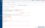
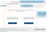

                               

User Guide: Role Permissions to Access Foundry Cloud

Settings - Volt MX Cloud
========================

Using **Settings** in Volt MX Cloud, you can manage users and accounts based on your role, for example, inviting users, assigning roles to users, managing reports and environments permissions, deleting users, and exporting users.

Roles Permissions to Access Foundry Console
------------------------------------------

Roles help to users to access Foundry Console and perform certain operations. There are four types of roles Foundry including the owner, admin, member, and Dev portal.

*   **Owner**: An Owner role has access to the complete functionality of Foundry Console. An Owner has access to advanced configurations and operations such as **external auth configuration**, **MFA for account level**, and so on. An Owner is a super-set of the Admin role.
*   **Admin**: An Admin role has access to the functionality of the Foundry Console.
*   **Member**: A Member role has access to the limited functionality of Foundry Console.
*   **Dev Portal**: Lets you create a Portal for exposing APIs created using Volt MX Foundry. Developers from internal and external partner teams can access the portal created to explore and test the APIs.

Refer to the following screen-shot for more details.

<table style="margin-left: 0;margin-right: auto;width: 481px;"><colgroup><col style="width: 454px;"></colgroup><tbody><tr><td></td></tr></tbody><tfoot><tr><td><b><i>Note: </i></b>The following features can be granted by using the <b>Custom Access</b> functionality:- Build Client App- Engagement Services- App Services- Logic Services- Logging Console <b><i>Note: </i></b>The Feature Level Access Permissions (<b>Custom Access</b>) functionality supported only for Foundry Clouds.</td></tr></tfoot></table>

Environment Permissions - Foundry Clouds
---------------------------------------

An environment can have 3 types of access permissions to users.

*   **No Access**: Users cannot access a Volt MX environment.
*   **Full Access**: Users can access a Volt MX environment, which helps to build apps, publish apps, and Admin Console.
*   **Custom Access**: The **Feature Level Access** permission is supported only for Foundry clouds. Based on these permissions set for a specific Foundry Cloud, users are privileged to access a specific set of features of Foundry accordingly.

> **_Important:_** By default, all the roles have **Full Access** to Iris, Foundry Starter, and Cloud Build environments. For the remaining environments, all the roles have **No Access** by default.

> **_Note:_** The **Custom Access** permission is supported only for Foundry Clouds.

> **_Note:_** By default, all users have access to Foundry Console to create apps.

The following table details you about the features with access level permissions of an environment:

  
| Environment Permissions - Custom Access |||
| --- | --- | --- |
|   Features in an Environment | **Feature Level Access Permissions** ||
| --- | --- | --- |
| | Disable Access | Enable Access |
| --- | --- |
| **Build Client App** – If this feature is enabled, users can view the environment configuration from Iris and build a client app that connects to the environment.  It allows a user to only have Build Client App access, if the user is only allowed to build binaries pointing to an environment, but not publish or make changes to the server from Iris or from Foundry console. This feature is very useful when developers need to build binaries pointing to a production server. However, only admins are allowed to modify the server runtime by allowing the publishing capabilities.  **_Important:_** You can build apps using Iris if you have access permissions to the **Build Client App** feature in the Cloud.   To build and publish apps, you must have access to the App Services feature in your cloud. |  |  |
| **App Services**: If this feature is enabled, users can build apps using Iris and publish apps as well. This is a superset of Build Client App access and provides both the build and publish capabilities.  **For example, If a developer has been given access to App Services, the developer can build and publish to the server from Iris or from Foundry console.** |  |  |
| **Engagement Services** – Access to the Engagement Server’s admin console associated with this environment. |  |  |
| **Logic Services** - Access to the Integrate Node.js Services to Foundry Applications.   Refer to [How to Integrate Node.js Services into Foundry Apps](Logic_in_Apps.md). |  |  |
| **Logging Console** - Access to the logs for this environment from the Log Console.   Refer to [Log Services](Logging_as_a_Service.md). |  |  |
| You can configure the **Environment Permissions**, as follows:   **While inviting users to Cloud: Settings** > **Users** > **Manage Users** > **INVITE** > **Environment Permissions** > **FEATURE LEVEL ACCESS**. Refer to **[Invite User to an Account](#invite-user-to-an-account)  ** **While updating User Environments Access**: **Settings** > **Users** > **Manage Users** > **More Options** > **Manage Cloud Access**. This is applicable to the existing users. Refer to [Managing Cloud Access of Existing User](#managing-cloud-access-of-existing-users)   **While updating the environment users access**: **Environments** > **Clouds** > **More Options** > **Manage Access**. [Managing Cloud Features in Environments](ManageCloudFeatures.md) |||

Users - Cloud
-------------

The **Users** tab in Volt MX Cloud helps you manage users in your account. Only users having an **owner**/**admin** role in the account can access this **Users** tab.

### Manage Users

To manage users of an account, follow these steps:

1.  In the Volt MX Foundry Console, click **Settings** in the left pane. By default, the **Users** > **Manage Users** page is displayed.
    
    
    
2.  In the **Manage Users** page, you can perform various actions such as inviting a user, deleting a user(s), exporting users, and controlling user access.

#### **Invite User to an Account**

A user invited to an account can access reports and clouds in that account based on the role. Follow these steps to invite a user.

1.  Go to Foundry Console, click **Settings** > **Users** > **Manage Users**.
2.  Click **Invite**. The **Invite User** dialog window appears. You need to fill the required user details such as email, account role, Reports Access, and environment permissions.
    
    
    
> **_Note:_** This is a sample screen shot, which has **Full Access** for a Iris Cloud. The Full Access is also applicable for the following clouds: **Licensing Cloud** and **AppFactory**.
    
3.  Enter the following details in the **Invite User** dialog window:
    
    | Step | Field | Action |
    | - | --- | --- |
    | a | Enter the email ID | Enter the user email address |
    | b | Account Role | Select the role available from the **Account Role** list. **Admin/Owner:** By default, a user with an **Admin/Owner** role has **Full Access** to reports. For example, **Full Access** (Standard Reports, Dashboard, Funnel Reports, Custom Reports, Custom Metrics, Custom Dashboards)  **Note:**  An invited user cannot modify the **Reports Access** field of an **Admin/Owner**.**Member**: By default, a user with the **Member** role has **Standard Access** to reports.  **Note:**  An **Owner/Admin** can change the **Report Access** permissions while inviting a Member role.**Developer Portal Only**: By default, a user with the **Developer Portal Only** role has **Standard Access** permission to reports.  **Note:**  A user with account role **Developer Portal Only** will have the Reports Access as Standard Access. You cannot modify the **Reports Access** field of the **Developer Portal Only** user. |
    | c | Reports Access | If you have selected **Member** as Account Role, select one of the following Report access permissions:**Standard Access** (Standard Reports, Dashboard). This is selected by default.**Custom Access** (Standard Reports, Dashboard, Custom Reports, Custom Dashboards)**Full Access** (Standard Reports, Dashboard, Custom Reports, Custom Metrics, Custom Dashboards)> **_Important:_** A user with Reports Access permissions as **Full Access** and **Custom Reports Access** can access these reports even if the user does not have access to any of the environments. |
    | d | Environment Permissions | Displays the clouds under the **CLOUD NAME** column created for a specific account. Under the **FEATURE LEVEL ACCESS** permissions column, click the required tab, for example, **No Access**, **Full Access**, and **Custom Access**.  **Note:**  For more information on the environment permissions, refer to [Feature Level Access Permissions - Foundry Cloud](#roles-permissions-to-access-foundry-console)**.**   **Note:**  The **Custom Access** permission is supported only for VoltMX Foundry clouds. Select the required permissions for the Foundry Clouds:  No AccessAll features of this cloud are disabled for the selected user.Full AccessAccess to all features of this cloud is enabled for the selected user. Each of these features is enabled with a tick mark.Custom Access - Supports from Volt MX Foundry V9 onwards only for Volt MX Foundry Clouds.You can select all the features or specific ones of a cloud by using the **Custom Access** permission. For example: When you select **Custom Access**, all features of this cloud are enabled to the selected user by default. Each of these features is enabled with a tick mark.If you want to disable a specific feature, select that feature.**Build Client App****App Services****Logging Console****Engagement**> **_Important:_**  If a Cloud version below V9 and if it contains legacy features such as Sync Server, these features are not displayed in the **Manage Cloud Access > FEATURE LEVEL ACCESS** section. As a result, you cannot change these features.> **_Important:_**  When you change the cloud access permissions, the cloud users must log in to Volt MX Foundry again. This is to ensure that these features are reflected in their environments.For example, Let us say there is a member user called Member1, and an admin user called admin1.The Member1 has access to features in a specific Cloud, such as Build Client App, Engagement Services, and App Services.1. Member1 logs in to Foundry Console.2. Member1 is accessing the Foundry Console and Engagement Services Console.3. At this point, Admin1 logs in to Foundry Console and removes access to Engagement Services for Member1.Here, when the Admin1 removes access to a feature for the user, the user (here Member1) should have the access only to the modified set of features in that Cloud. |
    
4.  Click **INVITE**. An invitation will be sent to the user. After the user accepts the invitation, the user is added to the users list.

#### Delete User from Account

Only users with the **Admin** role in the account can access the **Users** tab.

1.  Go to Volt MX Foundry and click **Settings** > **Users** > **Manage Users**. The existing users are listed on the **Manage Users** page.
2.  Select the check box for each user.
3.  Click the **DELETE** button. The **Delete User(s)** dialog appears for your confirmation.
    
    > **_Note:_** Click the **More Options** button next to the user and select **Delete**.
    
4.  Click **DELETE**.

#### **Export Users of Account to Excel File**

You can export the existing users of the account data to an Excel (.xls) file. The excel format contains users with record-level data in a tabular form such as the User Name, User Email, Account Role, Reports Access, and Last Logged ON.

1.  Go to Volt MX Foundry, click **Settings** > **Users** > **Manage Users**. The existing users are listed on the **Manage Users** page.
2.  To export all the existing users, click **EXPORT**.
    
    > **_Note:_** To export one or more users, select the required check boxes and then click **EXPORT**.
    

#### Managing Cloud Access of Existing Users

You can modify the existing cloud access permissions of a user, if required.

1.  Go to Volt MX Foundry, click **Settings** > **Users** > **Manage Users**. The existing users are listed on the **Manage Users** page.
2.  Click the **More Options** button next to the user. The options available are as follows:
    *   Delete
    *   Managing Cloud Access
    *   [View User Activity](#audit-logs-cloud)
3.  Select **Manage Cloud Access**. The **Manage Cloud Access** dialog box appears and displays the available clouds for that user.
    
    Managing Cloud Access of Existing User
    
    
    
4.  Under the **Feature Level Access** column, select the feature permissions of the Clouds.
5.  Under the **FEATURE LEVEL ACCESS** permissions column, click the required tab and select the features, for example, **No Access**, **Full Access**, and **Custom Access**.
    
    > **_Note:_** For more information on the environment permissions, refer to [Feature Level Access Permissions - Foundry Cloud](#roles-permissions-to-access-foundry-console)**.**
    
6.  Click **SAVE** to save the changes.

### **Default Services & Apps Permissions**

As an Admin/Owner, you can configure the default access control for the new apps and services. So, when a new user is invited to an account or automatically added to an account using the master account setting, these default access control settings are applied to users. Refer to [Default Services & Apps Permissions](Account_Settings_User_ACLs.md).

Accounts
--------

The **Accounts** tab in the Settings menu helps you view the details of the account such as account name, location, company information, phone number, address and so on. It also allows you to configure **external-user authentication** and **multi-factor authentication** for the account.

### Profile

Only users with the Owner role in the account can modify the account profile details.

All other users in the account can view account profile details in read-only mode.

### External User Authentication

Only users with the Owner role in the account can access the **External User Authentication** tab. You can enable the external authentication with users to access the Volt MX Foundry console. OAuth compatible identity services are supported for external authentication.

To enable the external user authentication, follow these steps:

1.  Create an OAuth based identity service in Volt MX Foundry.
2.  As an owner, go to Volt MX Foundry > **Settings**.
3.  In the **Accounts** tab, click the **External User Authentication**.
    
4.  Click **ENABLE EXTERNAL USER AUTHENTICATION**.
5.  In the Select Provider list, select an existing identity service that you have created and configure it.
    
    > **_Note:_** OAuth compatible identity services will be displayed in the Select Provider list of the external authentication page.
    
    
    
6.  Configure custom login URL, if required.
    
7.  Select the **Create User on First Login** check box if you want the users to be created on the fly upon the first login.
    
    > **_Note:_** If you choose not to create the users on the fly, you will need to create them in Volt MX Foundry and in the IdP separately.
    
8.  **Name**: Enter the text for the login button for the external identity provider. The name is displayed on the external login section.  
    By default the default text and the selected provider from the list is displayed here. For example, default text is <`Launch Login`\> <`selected provider name`\>. Refer to the Figure 2.  
    
9.  **Description**: Enter the description for the external identity provider. The description is displayed on external login section. This is a mandatory field. Refer to the Figure 2.
    
    <table style="border-left-style: solid;border-left-width: 1.5pt;border-left-color: #ccc;border-right-style: solid;border-right-width: 1.5pt;border-right-color: #ccc;border-top-style: solid;border-top-width: 1.5pt;border-top-color: #ccc;border-bottom-style: solid;border-bottom-width: 1.5pt;border-bottom-color: #ccc;margin-left: 0;margin-right: auto;caption-side: bottom;width: 101px;"><caption>[Figure 2- External Login Page]</caption><colgroup><col style="width: 94px;"></colgroup><tbody><tr><td></td></tr></tbody></table>
    
10.  Click **SAVE**. Your external user authentication is configured.  
    You can configure more than one external user authentications in your account, refer to the following section.

#### Multiple External User Authentications (Logging into Foundry Console on Cloud with multiple user authentication login options)

From V9 Service Pack 2, this feature supports for configuring more than one external identity providers for Cloud Login in addition to the existing HCL Account Login details in the same Count account.  
**Use Case. Logging into Foundry Console Cloud with multiple user authentication login options.** In this case, apart from Foundry Cloud users you want to provide login access to two more different users set to the same Foundry Cloud account, for example, ContractEmployees (users with Gmail account) and the EnterpriseEmployees (user emails configured with Okta). You have configured Google and Okta identity services for External User Authentication in the same account. Here, the **Enterprise Login URL** for these three users sets should be unique.

<table style="caption-side: bottom;margin-left: 0;margin-right: auto;mc-table-style: url('Resources/TableStyles/Basic.css');width: 819px;" class="TableStyle-Basic" cellspacing="0" data-mc-conditions="Default.V9SP2GA"><colgroup><col class="TableStyle-Basic-Column-Column1"></colgroup><tbody><tr class="TableStyle-Basic-Body-Body1"><td class="TableStyle-Basic-BodyD-Column1-Body1">The sample screen shows multiple external user authentications configured in a Foundry account.</td></tr><tr class="TableStyle-Basic-Body-Body1"><td class="TableStyle-Basic-BodyD-Column1-Body1"><b>EXTERNAL LOGIN URL</b> column displays the unique login URL for all users configured in the same account</td></tr><tr class="TableStyle-Basic-Body-Body1"><td class="TableStyle-Basic-BodyD-Column1-Body1"><b>NAME</b> column displays the specified label that is displayed on the Login button for external auth login page.</td></tr><tr class="TableStyle-Basic-Body-Body1"><td class="TableStyle-Basic-BodyD-Column1-Body1"><b>DESCRIPTION</b> column displays the specified description that is displayed on the external auth login page.</td></tr><tr class="TableStyle-Basic-Body-Body1"><td class="TableStyle-Basic-BodyA-Column1-Body1"><b>CONFIGURE NEW</b> button is active to configure multiple external user authentications.</td></tr></tbody></table>

  

So, when an user from any of these groups try to access Foundry Clod using this **Enterprise Login URL**, the Login page displays all these configured external identity providers list with the message: `This <> account has been configured to required user authentication via an external identity provider`. The user needs to click one of the Login buttons to login to Foundry Console account. For Enterprise Login users to log in with HCL email account, users must click **HCL Account Login** link. The following sample screen shows details the Login page with multiple external user authentications configured in the Foundry account.

### External User Authentication with Azure-SAML

Security Assertion Markup Language (SAML) is an XML-based markup language. It is used for authentication and authorization between identity providers and service providers. Microsoft Azure provides a single sign-on SAML protocol, which can be used to create an external Identity provider for VoltMX Foundry.

> NOTE:
>External authentication with Azure-SAML is only supported for VoltMX Foundry on the AWS (default) cloud. It is not supported for on-premises or container installations.

#### Prerequisites

A Foundry app that contains an Identity service with the required Azure-SAML configuration. For more information about creating the service, refer to [SAML Identity Service](Identity5_SAML.md).

> IMPORTANT:
>
> *   Mapping the **Email** and **Profile URL** fields to the back-end provider is mandatory for external authentication.
> *   The Foundry app must be published to the cloud for which external authentication is required.
>
>     For more information, refer to [Publishing a Foundry app](Publish.md).

#### Using Azure-SAML for external authentication

After you create and publish an app with the Azure-SAML configuration, follow these steps to set up external authentication:

1. Sign in to the VoltMX Foundry Console.
2. From the left pane, navigate to **Settings**.
3. On the **Accounts** tab, click **External User Authentication**.
4. Click **CONFIGURE NEW**.
5. From the **Identity Providers** list, select the Identity service that you created.
6. Select the **Create User on the First Login** check box if you want users to be created on the fly on their first login.
7. Type a **Name** and **Description** for the provider based on your requirement.
8. Click **SAVE**.

Users that are registered to the back-end provider can then sign into VoltMX Foundry by using their Azure-SAML credentials.

#### Limitations

*   From the V8 SP3 release, Foundry uses the provider's name for identification instead of the GUID. Therefore, to import an app from earlier versions, you must perform additional steps before publishing the app. For more information, refer to [Importing a legacy app](Settings_Cloud.html#Importing_Legacy).
*   An app on the Azure cloud can be linked to only one Identity provider on Foundry. Therefore, an Azure app cannot be used with multiple Foundry clouds.

    To link the back-end provider to a different cloud, you can create a new Azure app with the same metadata.

*   For a proper back-end log out, Foundry supports only one external authentication provider.

Importing a legacy app

To import and publish an app from versions earlier than V8 SP3, follow these steps:

1. Import the app (zip file) to Foundry.

     For more information, refer to [How to Import an App](Export-Import_Apps.md).

2. Open the imported app, and then select the Identity service that must be configured.

3. On the lower-right corner of the service configuration page, click **SAVE**.

4. Publish the app to the cloud for which the Identity service is required.

     For more information, refer to [Publishing a Foundry app](Publish.md).

### Multi-factor authentication

Only users with the Owner role in the account can access this tab. For more information on multi-factor authentication, refer to [How to Enable Multi-Factor Authentication](EnablingMultiFactorAuthentication.md).

Audit Logs - Cloud
------------------

The **Audit Logs** tab in the **Settings** menu helps you to capture all the user activities performed in a Volt MX Foundry Account. These activities are displayed as Audit Logs. Only users having an **owner**/**admin** role in the account can access the **Audit Logs** tab.

To view the user activities of an account in the Audit Logs page, follow these steps.

1.  In the Volt MX Foundry Console, navigate to **Settings** > **Audit Logs**. The Audit Logs page displays the existing logs by default.
    
    These logs are displayed based on the object categories such as apps, services, and users. The logs are displayed with the following details:
    
    *   **OBJECT NAME**: Displays the name of the object, such as: app name, service, and email ID of the user.
    *   **OBJECT TYPE**: Displays the type of the object, such as: Apps, Services, and Users.
    *   **ACTION**: Displays the CRUD operations performed for the object type, such as: created, deleted, modified, published, and unpublished.
    *   **MODIFIED BY**: Displays the email ID of the user that performed the action.
    *   **MODIFIED ON**: Displays the time-stamp of when the action was performed.
    
    > **_Note:_** By default, the logs are displayed for the last week.
    

To apply filters and view specific user activities of an account, follow these steps.

1.  In the Volt MX Foundry Console, navigate to **Settings** > **Audit Logs**. The Audit Logs page displays the existing logs by default.
    
2.  You can apply the following filters for the Audit Logs:
    
    *   **Object Type**: From the drop-down list, select the options for which you want to view the audit logs.  
        
        

The drop-down list contains the following options:

        
        *   Apps
            
        *   Services

        *   Users
            
        

        
            
        
    *   **Action**: From the drop-down list, select the options for which you want to view the audit logs.  
        
        

The drop-down list contains the following options:
        

        
        *   Create

        *   Modify

        *   Delete
        
        *   Publish            
                            
        
 
        
    *   **Object Name**: Enter the name of the object, such as the app name, service name or the email ID of the user.
    *   **Modified By**: Enter the email ID of the user that performed the actions.
    *   **Modified On**: From the drop-down list, select the date range for which you want to view the activities.  
        
        

The drop-down list contains the following options:

        
        *   Today
            
        *   Yesterday
            
        *   Last 7 Days
            
        *   Last 30 Days
            
        *   This Month
            
        *   Last Month
            
        *   Custom Range 

            For the **Custom Range** option, select the start date and the end date from the date range pick.

           

3.  Click Apply to display the logs based on the filters.

To download the audit logs, click the **Download log** button and select the required option, such as PDF and Excel.
