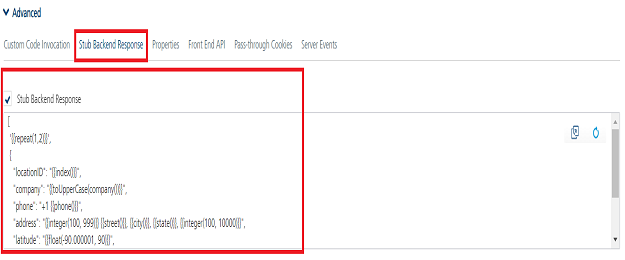

                               

User Guide: [Integration](Services.md#top) \> [Advanced Configurations](Advanced_Configurations.md) > Stub Template (sample code)

**How to Develop Apps based on a Stubbed Service**
--------------------------------------------------

The **VoltMX Foundry Stub back-end response** capability helps app developers to continue to develop apps when the backend services that an app connects to are not ready to be leveraged. There are several instances in an app development life-cycle when back-end systems and app development happen in parallel and only the contract or interface for the app to communicate to a backend is finalized. In this scenario, the app developer can create a response template to "stub" the response that is expected from the actual backend. The response template can have data from service requests, hard-coded values or use pre-built functions such as concat, firstName, lastName, gender, random, email, and phone, and options to randomize the output within the required criteria.

For example, in the scenario mentioned earlier, a Volt MX app developer can create the service that points to an endpoint URL along with a stub template. The stub response template can be set for each operation of a service. The app developers can continue to develop apps based on a **sample back-end response from the stub template**. The service can be modified to connect to the configured backend URL or to send a stub response based on a setting.

> **_Note:_** Stubbing is supported only for JSON, XML, and SOAP Integration services.

> **_Important:_** Services built with Stub Backend Response will give mock data and live data as these services can be switch between live backend and mock data.

> **_Note:_** nd response is used by the **Data Panel** feature of Volt MX Iris V8 SP3 GA. For more information on Data Panel, click [here](../../../Iris/iris_user_guide/Content/DataPanel.md#top).

### Stub Template

The back-end stubbed response specifies a Stub template for stubbing and returning dynamically-generated mock data, instead of connecting to the back end and getting the data from the back-end URL.

The following table details a sample Stub response template and a back-end response that is generated based on the stub template.

  
| Sample Stub Template | Sample Stub Response |
| --- | --- |
|  \[ '{ {repeat(1,2)} }', { "locationID": "{ {index()} }", "company": "{ {toUpperCase(company())} }", "phone": "+1 { {phone()} }", "address": "{ {integer(100, 999)} } { {street()} }, { {city()} }, { {state()} }, { {integer(100, 10000)} }", "latitude": "{ {float(-90.000001, 90)} }", "longitude": "{ {float(-180.000001, 180)} }", "office":"{ {random("HR Head Office","Sales Head Office","Marketing Head Office","Development Center")} }" } \] |  \[{ "locationID": "0", "company": "RODEOMAD", "phone": "+1 371-222-9269", "address": "671 Division Place, Grill, South Dakota, 9220", "latitude": "-0.29528046", "longitude": "159.72824", "office": "Marketing Head Office" }, { "locationID": "1", "company": "ACME", "phone": "+1 311-324-8984", "address": "257 Adam Place, McCoy, South Carolina, 21245", "latitude": "-0.23528046", "longitude": "124.72824", "office": "Sales Head Office" }\] |

### Pre-built Functions Supported in Stub Template

The following list of the **sample pre-built functions** are supported in the Stub response template:

### repeat(&lt;lower_value&gt;, &lt;upper_value&gt;)  


<table class="TableStyle-Basic" cellspacing="0" style="mc-table-style: url('Resources/TableStyles/Basic.css');width: 820px;"><colgroup><col class="TableStyle-Basic-Column-Column1" style="width: 181px;"> <col class="TableStyle-Basic-Column-Column1"></colgroup><tbody><tr class="TableStyle-Basic-Body-Body1"><td class="TableStyle-Basic-BodyE-Column1-Body1" style="font-weight: bold;">Description</td><td class="TableStyle-Basic-BodyD-Column1-Body1"><b>repeat</b> function repeats JSON&nbsp;or XML objects randomly based on the <b>value range</b> provided in the syntax. This is typically set at the beginning of a collection to repeat number of times as required. For example, it can be set to get a random number of transactions for an account for a set format by setting repeat function at the head of the collection as shown in the default template above.</td></tr><tr class="TableStyle-Basic-Body-Body1"><td class="TableStyle-Basic-BodyE-Column1-Body1" style="font-weight: bold;">Syntax</td><td class="TableStyle-Basic-BodyD-Column1-Body1"><code class="codefirst">'{ {repeat (&lt;lower_value&gt;, &lt;upper_value&gt;)} }'</code></td></tr><tr class="TableStyle-Basic-Body-Body1"><td class="TableStyle-Basic-BodyB-Column1-Body1" style="font-weight: bold;">Sample stub template</td><td class="TableStyle-Basic-BodyA-Column1-Body1"><code class="codefirst">'{ {repeat(30,40)} }'</code></td></tr></tbody></table>

### repeat(<number\>)  


<table class="TableStyle-Basic" cellspacing="0" style="mc-table-style: url('Resources/TableStyles/Basic.css');width: 820px;"><colgroup><col class="TableStyle-Basic-Column-Column1" style="width: 177px;"> <col class="TableStyle-Basic-Column-Column1"></colgroup><tbody><tr class="TableStyle-Basic-Body-Body1"><td class="TableStyle-Basic-BodyE-Column1-Body1" style="font-weight: bold;">Description</td><td class="TableStyle-Basic-BodyD-Column1-Body1"><b><b>repeat</b> function repeats JSON&nbsp;or XML objects randomly based on the <b>fixed number</b></b> provided in the syntax. This is typically set at the beginning of a collection to repeat number of times as required. For example, it can be set to get a random number of transactions for an account for a set format by setting repeat function at the head of the collection as shown in the default template above.</td></tr><tr class="TableStyle-Basic-Body-Body1"><td class="TableStyle-Basic-BodyE-Column1-Body1" style="font-weight: bold;">Syntax</td><td class="TableStyle-Basic-BodyD-Column1-Body1"><code class="codefirst">'{ {repeat (&lt;number&gt;)} }'</code></td></tr><tr class="TableStyle-Basic-Body-Body1"><td class="TableStyle-Basic-BodyB-Column1-Body1" style="font-weight: bold;">Sample stub template</td><td class="TableStyle-Basic-BodyA-Column1-Body1"><code class="codefirst">'{ {repeat(2)} }'</code></td></tr></tbody></table>

### integer(min,max)  

<table class="TableStyle-Basic" cellspacing="0" style="mc-table-style: url('Resources/TableStyles/Basic.css');width: 820px;"><colgroup><col class="TableStyle-Basic-Column-Column1" style="width: 176px;"> <col class="TableStyle-Basic-Column-Column1"></colgroup><tbody><tr class="TableStyle-Basic-Body-Body1"><td class="TableStyle-Basic-BodyE-Column1-Body1" style="font-weight: bold;">Description</td><td class="TableStyle-Basic-BodyD-Column1-Body1">Generates a random integer in the specified range.<b>&nbsp;</b></td></tr><tr class="TableStyle-Basic-Body-Body1"><td class="TableStyle-Basic-BodyE-Column1-Body1" style="font-weight: bold;">Syntax</td><td class="TableStyle-Basic-BodyD-Column1-Body1"><code class="codefirst"><code class="codefirst">"{ {integer(min,max)} }"</code></code></td></tr><tr class="TableStyle-Basic-Body-Body1"><td class="TableStyle-Basic-BodyE-Column1-Body1" style="font-weight: bold;">Sample stub template</td><td class="TableStyle-Basic-BodyD-Column1-Body1"><code class="codefirst">"productRating":"{ {integer(0,5)} }"</code></td></tr><tr class="TableStyle-Basic-Body-Body1"><td class="TableStyle-Basic-BodyB-Column1-Body1" style="font-weight: bold;">Sample stub response</td><td class="TableStyle-Basic-BodyA-Column1-Body1"><code class="codefirst"><code class="codefirst">"productRating": "4"</code></code></td></tr></tbody></table>

### float(min,max)  


<table class="TableStyle-Basic" cellspacing="0" style="mc-table-style: url('Resources/TableStyles/Basic.css');width: 820px;"><colgroup><col class="TableStyle-Basic-Column-Column1" style="width: 177px;"> <col class="TableStyle-Basic-Column-Column1"></colgroup><tbody><tr class="TableStyle-Basic-Body-Body1"><td class="TableStyle-Basic-BodyE-Column1-Body1" style="font-weight: bold;">Description</td><td class="TableStyle-Basic-BodyD-Column1-Body1">Generates a random 32-bit floating point number in the specified range.</td></tr><tr class="TableStyle-Basic-Body-Body1"><td class="TableStyle-Basic-BodyE-Column1-Body1" style="font-weight: bold;">Syntax</td><td class="TableStyle-Basic-BodyD-Column1-Body1"><code class="codefirst"><code class="codefirst">"{ {float(min,max)} }"</code></code></td></tr><tr class="TableStyle-Basic-Body-Body1"><td class="TableStyle-Basic-BodyE-Column1-Body1" style="font-weight: bold;">Sample stub template</td><td class="TableStyle-Basic-BodyD-Column1-Body1"><code class="codefirst">"floatrange": "{ {float(3,9)} }"</code></td></tr><tr class="TableStyle-Basic-Body-Body1"><td class="TableStyle-Basic-BodyB-Column1-Body1" style="font-weight: bold;">Sample stub response</td><td class="TableStyle-Basic-BodyA-Column1-Body1"><code class="codefirst"><code class="codefirst">"floatrange": "6.718242"</code></code></td></tr></tbody></table>

### float(min,max,"%.2f")  

<table class="TableStyle-Basic" cellspacing="0" style="mc-table-style: url('Resources/TableStyles/Basic.css');width: 820px;"><colgroup><col class="TableStyle-Basic-Column-Column1" style="width: 178px;"> <col class="TableStyle-Basic-Column-Column1"></colgroup><tbody><tr class="TableStyle-Basic-Body-Body1"><td class="TableStyle-Basic-BodyE-Column1-Body1" style="font-weight: bold;">Description</td><td class="TableStyle-Basic-BodyD-Column1-Body1">Generates a random 32-bit floating point number in the specified range of floating point numbers, with an option to round of the number of decimal places.</td></tr><tr class="TableStyle-Basic-Body-Body1"><td class="TableStyle-Basic-BodyE-Column1-Body1" style="font-weight: bold;">Syntax</td><td class="TableStyle-Basic-BodyD-Column1-Body1"><code class="codefirst"><code class="codefirst">"{ {float(min,max,"%.2f")} }"</code></code></td></tr><tr class="TableStyle-Basic-Body-Body1"><td class="TableStyle-Basic-BodyE-Column1-Body1" style="font-weight: bold;">Sample stub template</td><td class="TableStyle-Basic-BodyD-Column1-Body1"><code class="codefirst">"floatrange": "{ {float(3,9,"%.2f")} }"</code></td></tr><tr class="TableStyle-Basic-Body-Body1"><td class="TableStyle-Basic-BodyB-Column1-Body1" style="font-weight: bold;">Sample stub response</td><td class="TableStyle-Basic-BodyA-Column1-Body1"><code class="codefirst"><code class="codefirst">"floatrange": "8.87"</code></code></td></tr></tbody></table>

### double(min,max)  

<table class="TableStyle-Basic" cellspacing="0" style="mc-table-style: url('Resources/TableStyles/Basic.css');width: 820px;"><colgroup><col class="TableStyle-Basic-Column-Column1" style="width: 179px;"> <col class="TableStyle-Basic-Column-Column1"></colgroup><tbody><tr class="TableStyle-Basic-Body-Body1"><td class="TableStyle-Basic-BodyE-Column1-Body1" style="font-weight: bold;">Description</td><td class="TableStyle-Basic-BodyD-Column1-Body1">Generates a random 64-bit double number in the specified range.</td></tr><tr class="TableStyle-Basic-Body-Body1"><td class="TableStyle-Basic-BodyE-Column1-Body1" style="font-weight: bold;">Syntax</td><td class="TableStyle-Basic-BodyD-Column1-Body1"><code class="codefirst"><code class="codefirst">"{ {double(min,max)} }"</code></code></td></tr><tr class="TableStyle-Basic-Body-Body1"><td class="TableStyle-Basic-BodyE-Column1-Body1" style="font-weight: bold;">Sample stub template</td><td class="TableStyle-Basic-BodyD-Column1-Body1"><code class="codefirst">"double": "{ {double(2,8)} }"</code></td></tr><tr class="TableStyle-Basic-Body-Body1"><td class="TableStyle-Basic-BodyB-Column1-Body1" style="font-weight: bold;">Sample stub response</td><td class="TableStyle-Basic-BodyA-Column1-Body1"><code class="codefirst"><code class="codefirst">"double": "7.654668228367652"</code></code></td></tr></tbody></table>

### long(min,max)  

<table class="TableStyle-Basic" cellspacing="0" style="mc-table-style: url('Resources/TableStyles/Basic.css');width: 820px;"><colgroup><col class="TableStyle-Basic-Column-Column1" style="width: 180px;"> <col class="TableStyle-Basic-Column-Column1"></colgroup><tbody><tr class="TableStyle-Basic-Body-Body1"><td class="TableStyle-Basic-BodyE-Column1-Body1" style="font-weight: bold;">Description</td><td class="TableStyle-Basic-BodyD-Column1-Body1">Generates a random long number in the specified range.</td></tr><tr class="TableStyle-Basic-Body-Body1"><td class="TableStyle-Basic-BodyE-Column1-Body1" style="font-weight: bold;">Syntax</td><td class="TableStyle-Basic-BodyD-Column1-Body1"><code class="codefirst"><code class="codefirst">"{ {long(min,max)} }"</code></code></td></tr><tr class="TableStyle-Basic-Body-Body1"><td class="TableStyle-Basic-BodyE-Column1-Body1" style="font-weight: bold;">Sample stub template</td><td class="TableStyle-Basic-BodyD-Column1-Body1"><code class="codefirst">"network":"{ {long(200,500)} }"</code></td></tr><tr class="TableStyle-Basic-Body-Body1"><td class="TableStyle-Basic-BodyB-Column1-Body1" style="font-weight: bold;">Sample stub response</td><td class="TableStyle-Basic-BodyA-Column1-Body1"><code class="codefirst"><code class="codefirst">"network":"378"</code></code></td></tr></tbody></table>

### uuid()  

<table class="TableStyle-Basic" cellspacing="0" style="mc-table-style: url('Resources/TableStyles/Basic.css');width: 820px;"><colgroup><col class="TableStyle-Basic-Column-Column1" style="width: 181px;"> <col class="TableStyle-Basic-Column-Column1"></colgroup><tbody><tr class="TableStyle-Basic-Body-Body1"><td class="TableStyle-Basic-BodyE-Column1-Body1" style="font-weight: bold;">Description</td><td class="TableStyle-Basic-BodyD-Column1-Body1">Generates a random GUID.</td></tr><tr class="TableStyle-Basic-Body-Body1"><td class="TableStyle-Basic-BodyE-Column1-Body1" style="font-weight: bold;">Syntax</td><td class="TableStyle-Basic-BodyD-Column1-Body1"><code class="codefirst"><code class="codefirst">"{ {uuid()} }"</code></code></td></tr><tr class="TableStyle-Basic-Body-Body1"><td class="TableStyle-Basic-BodyE-Column1-Body1" style="font-weight: bold;">Sample stub template</td><td class="TableStyle-Basic-BodyD-Column1-Body1"><code class="codefirst">"objects": "{ {uuid()} }"</code></td></tr><tr class="TableStyle-Basic-Body-Body1"><td class="TableStyle-Basic-BodyB-Column1-Body1" style="font-weight: bold;">Sample stub response</td><td class="TableStyle-Basic-BodyA-Column1-Body1"><code class="codefirst"><code class="codefirst">"objects": "fb81ad08-42e3-4b61-9a2c-636f95952766"</code></code></td></tr></tbody></table>

### hex() 

<table class="TableStyle-Basic" cellspacing="0" style="mc-table-style: url('Resources/TableStyles/Basic.css');width: 820px;"><colgroup><col class="TableStyle-Basic-Column-Column1" style="width: 182px;"> <col class="TableStyle-Basic-Column-Column1"></colgroup><tbody><tr class="TableStyle-Basic-Body-Body1"><td class="TableStyle-Basic-BodyE-Column1-Body1" style="font-weight: bold;">Description</td><td class="TableStyle-Basic-BodyD-Column1-Body1">Generates a random 16 bytes hexadecimal string.</td></tr><tr class="TableStyle-Basic-Body-Body1"><td class="TableStyle-Basic-BodyE-Column1-Body1" style="font-weight: bold;">Syntax</td><td class="TableStyle-Basic-BodyD-Column1-Body1"><code class="codefirst"><code class="codefirst">"{ {hex()} }"</code></code></td></tr><tr class="TableStyle-Basic-Body-Body1"><td class="TableStyle-Basic-BodyE-Column1-Body1" style="font-weight: bold;">Sample stub template</td><td class="TableStyle-Basic-BodyD-Column1-Body1"><code class="codefirst"><code class="codefirst">"color": "{ {hex()} }"</code></code></td></tr><tr class="TableStyle-Basic-Body-Body1"><td class="TableStyle-Basic-BodyB-Column1-Body1" style="font-weight: bold;">Sample stub response</td><td class="TableStyle-Basic-BodyA-Column1-Body1"><code class="codefirst"><code class="codefirst"><code class="codefirst">"color": "b53ff7fa4b63b18cdf7729e85c39e660"</code></code></code></td></tr></tbody></table>

### hex(size)

<table class="TableStyle-Basic" cellspacing="0" style="mc-table-style: url('Resources/TableStyles/Basic.css');width: 820px;"><colgroup><col class="TableStyle-Basic-Column-Column1" style="width: 183px;"> <col class="TableStyle-Basic-Column-Column1"></colgroup><tbody><tr class="TableStyle-Basic-Body-Body1"><td class="TableStyle-Basic-BodyE-Column1-Body1" style="font-weight: bold;">Description</td><td class="TableStyle-Basic-BodyD-Column1-Body1">Generates a random hexadecimal string according to the specified size in bytes.</td></tr><tr class="TableStyle-Basic-Body-Body1"><td class="TableStyle-Basic-BodyE-Column1-Body1" style="font-weight: bold;">Syntax</td><td class="TableStyle-Basic-BodyD-Column1-Body1"><code class="codefirst"><code class="codefirst">"{ {hex(size)} }"</code></code></td></tr><tr class="TableStyle-Basic-Body-Body1"><td class="TableStyle-Basic-BodyE-Column1-Body1" style="font-weight: bold;">Sample stub template</td><td class="TableStyle-Basic-BodyD-Column1-Body1"><code class="codefirst"><code class="codefirst">"color": "{ {hex(2)} }"</code></code></td></tr><tr class="TableStyle-Basic-Body-Body1"><td class="TableStyle-Basic-BodyB-Column1-Body1" style="font-weight: bold;">Sample stub response</td><td class="TableStyle-Basic-BodyA-Column1-Body1"><code class="codefirst"><code class="codefirst"><code class="codefirst">"color": "1b41"</code></code></code></td></tr></tbody></table>

### objectId()  

<table class="TableStyle-Basic" cellspacing="0" style="mc-table-style: url('Resources/TableStyles/Basic.css');width: 820px;"><colgroup><col class="TableStyle-Basic-Column-Column1" style="width: 184px;"> <col class="TableStyle-Basic-Column-Column1"></colgroup><tbody><tr class="TableStyle-Basic-Body-Body1"><td class="TableStyle-Basic-BodyE-Column1-Body1" style="font-weight: bold;">Description</td><td class="TableStyle-Basic-BodyD-Column1-Body1">Generates a hexadecimal string of size 12 bytes.</td></tr><tr class="TableStyle-Basic-Body-Body1"><td class="TableStyle-Basic-BodyE-Column1-Body1" style="font-weight: bold;">Syntax</td><td class="TableStyle-Basic-BodyD-Column1-Body1"><code class="codefirst"><code class="codefirst">"{ {objectId()} }"</code></code></td></tr><tr class="TableStyle-Basic-Body-Body1"><td class="TableStyle-Basic-BodyE-Column1-Body1" style="font-weight: bold;">Sample stub template</td><td class="TableStyle-Basic-BodyD-Column1-Body1"><code class="codefirst"><code class="codefirst">"id": "{ {objectId()} }"</code></code></td></tr><tr class="TableStyle-Basic-Body-Body1"><td class="TableStyle-Basic-BodyB-Column1-Body1" style="font-weight: bold;">Sample stub response</td><td class="TableStyle-Basic-BodyA-Column1-Body1"><code class="codefirst"><code class="codefirst"><code class="codefirst">"<code class="codefirst">id": "1c91293a4c777000585e04e6"</code></code></code></code></td></tr></tbody></table>

### bool()  

<table class="TableStyle-Basic" cellspacing="0" style="mc-table-style: url('Resources/TableStyles/Basic.css');width: 820px;"><colgroup><col class="TableStyle-Basic-Column-Column1" style="width: 186px;"> <col class="TableStyle-Basic-Column-Column1"></colgroup><tbody><tr class="TableStyle-Basic-Body-Body1"><td class="TableStyle-Basic-BodyE-Column1-Body1" style="font-weight: bold;">Description</td><td class="TableStyle-Basic-BodyD-Column1-Body1">Generates a random Boolean value, either True or False.</td></tr><tr class="TableStyle-Basic-Body-Body1"><td class="TableStyle-Basic-BodyE-Column1-Body1" style="font-weight: bold;">Syntax</td><td class="TableStyle-Basic-BodyD-Column1-Body1"><code class="codefirst"><code class="codefirst">"{ {bool()} }"</code></code></td></tr><tr class="TableStyle-Basic-Body-Body1"><td class="TableStyle-Basic-BodyE-Column1-Body1" style="font-weight: bold;">Sample stub template</td><td class="TableStyle-Basic-BodyD-Column1-Body1"><code class="codefirst"><code class="codefirst">"stockAvailable": "{ {bool()} }"</code></code></td></tr><tr class="TableStyle-Basic-Body-Body1"><td class="TableStyle-Basic-BodyB-Column1-Body1" style="font-weight: bold;">Sample stub response</td><td class="TableStyle-Basic-BodyA-Column1-Body1"><code class="codefirst"><code class="codefirst"><code class="codefirst">"stockAvailable": "true"</code></code></code></td></tr></tbody></table>

### bool(&lt;probability&gt;)  

<table class="TableStyle-Basic" cellspacing="0" style="mc-table-style: url('Resources/TableStyles/Basic.css');width: 820px;"><colgroup><col class="TableStyle-Basic-Column-Column1" style="width: 185px;"> <col class="TableStyle-Basic-Column-Column1"></colgroup><tbody><tr class="TableStyle-Basic-Body-Body1"><td class="TableStyle-Basic-BodyE-Column1-Body1" style="font-weight: bold;">Description</td><td class="TableStyle-Basic-BodyD-Column1-Body1">Generates a random Boolean value, either True or False as per the given probability.</td></tr><tr class="TableStyle-Basic-Body-Body1"><td class="TableStyle-Basic-BodyE-Column1-Body1" style="font-weight: bold;">Syntax</td><td class="TableStyle-Basic-BodyD-Column1-Body1"><code class="codefirst"><code class="codefirst">"{ {bool(probability)} }"</code></code></td></tr><tr class="TableStyle-Basic-Body-Body1"><td class="TableStyle-Basic-BodyE-Column1-Body1" style="font-weight: bold;">Sample stub template</td><td class="TableStyle-Basic-BodyD-Column1-Body1"><code class="codefirst">"stockAvailable": "{ {bool(0.9)} }"</code></td></tr><tr class="TableStyle-Basic-Body-Body1"><td class="TableStyle-Basic-BodyB-Column1-Body1" style="font-weight: bold;">Sample stub response</td><td class="TableStyle-Basic-BodyA-Column1-Body1"><code class="codefirst">"stockAvailable": "true"</code></td></tr></tbody></table>

### index()  

<table class="TableStyle-Basic" cellspacing="0" style="mc-table-style: url('Resources/TableStyles/Basic.css');width: 820px;"><colgroup><col class="TableStyle-Basic-Column-Column1" style="width: 184px;"> <col class="TableStyle-Basic-Column-Column1"></colgroup><tbody><tr class="TableStyle-Basic-Body-Body1"><td class="TableStyle-Basic-BodyE-Column1-Body1" style="font-weight: bold;">Description</td><td class="TableStyle-Basic-BodyD-Column1-Body1">Generates an incrementing index integer for each record with a specific starting point.</td></tr><tr class="TableStyle-Basic-Body-Body1"><td class="TableStyle-Basic-BodyE-Column1-Body1" style="font-weight: bold;">Syntax</td><td class="TableStyle-Basic-BodyD-Column1-Body1"><code class="codefirst">"{ {index()} }"</code></td></tr><tr class="TableStyle-Basic-Body-Body1"><td class="TableStyle-Basic-BodyE-Column1-Body1" style="font-weight: bold;">Sample stub template</td><td class="TableStyle-Basic-BodyD-Column1-Body1"><code class="codefirst">"locationID": "{ {index()} }"</code></td></tr><tr class="TableStyle-Basic-Body-Body1"><td class="TableStyle-Basic-BodyB-Column1-Body1" style="font-weight: bold;">Sample stub response</td><td class="TableStyle-Basic-BodyA-Column1-Body1"><code class="codefirst">"locationID": "0"</code></td></tr></tbody></table>

### index("index-name")  

<table class="TableStyle-Basic" cellspacing="0" style="mc-table-style: url('Resources/TableStyles/Basic.css');width: 820px;"><colgroup><col class="TableStyle-Basic-Column-Column1" style="width: 183px;"> <col class="TableStyle-Basic-Column-Column1"></colgroup><tbody><tr class="TableStyle-Basic-Body-Body1"><td class="TableStyle-Basic-BodyE-Column1-Body1" style="font-weight: bold;">Description</td><td class="TableStyle-Basic-BodyD-Column1-Body1">Generates an incrementing index integer for each record based on the name of the index.</td></tr><tr class="TableStyle-Basic-Body-Body1"><td class="TableStyle-Basic-BodyE-Column1-Body1" style="font-weight: bold;">Syntax</td><td class="TableStyle-Basic-BodyD-Column1-Body1"><code class="codefirst">"{ {index("index-name")} }"</code></td></tr><tr class="TableStyle-Basic-Body-Body1"><td class="TableStyle-Basic-BodyE-Column1-Body1" style="font-weight: bold;">Sample stub template</td><td class="TableStyle-Basic-BodyD-Column1-Body1"><code class="codefirst">"index-number": "{ {index("abc")} }"</code></td></tr><tr class="TableStyle-Basic-Body-Body1"><td class="TableStyle-Basic-BodyB-Column1-Body1" style="font-weight: bold;">Sample stub response</td><td class="TableStyle-Basic-BodyA-Column1-Body1"><code class="codefirst">"index-number": "42"</code></td></tr></tbody></table>

### index(&lt;number&gt;)  

<table class="TableStyle-Basic" cellspacing="0" style="mc-table-style: url('Resources/TableStyles/Basic.css');width: 820px;"><colgroup><col class="TableStyle-Basic-Column-Column1" style="width: 184px;"> <col class="TableStyle-Basic-Column-Column1"></colgroup><tbody><tr class="TableStyle-Basic-Body-Body1"><td class="TableStyle-Basic-BodyE-Column1-Body1" style="font-weight: bold;">Description</td><td class="TableStyle-Basic-BodyD-Column1-Body1">Generates an incrementing index integer for each record with a specific starting point.</td></tr><tr class="TableStyle-Basic-Body-Body1"><td class="TableStyle-Basic-BodyE-Column1-Body1" style="font-weight: bold;">Syntax</td><td class="TableStyle-Basic-BodyD-Column1-Body1"><code class="codefirst">"{ {index(78)}"</code></td></tr><tr class="TableStyle-Basic-Body-Body1"><td class="TableStyle-Basic-BodyE-Column1-Body1" style="font-weight: bold;">Sample stub template</td><td class="TableStyle-Basic-BodyD-Column1-Body1"><code class="codefirst">"index-number": "{ {index(78)} }"</code></td></tr><tr class="TableStyle-Basic-Body-Body1"><td class="TableStyle-Basic-BodyB-Column1-Body1" style="font-weight: bold;">Sample stub response</td><td class="TableStyle-Basic-BodyA-Column1-Body1"><code class="codefirst">"index-number": "4248"</code></td></tr></tbody></table>

### index("index-name",&lt;number&gt;)  

<table class="TableStyle-Basic" cellspacing="0" style="mc-table-style: url('Resources/TableStyles/Basic.css');width: 820px;"><colgroup><col class="TableStyle-Basic-Column-Column1" style="width: 186px;"> <col class="TableStyle-Basic-Column-Column1"></colgroup><tbody><tr class="TableStyle-Basic-Body-Body1"><td class="TableStyle-Basic-BodyE-Column1-Body1" style="font-weight: bold;">Description</td><td class="TableStyle-Basic-BodyD-Column1-Body1">Generates an incrementing index integer for each record based on both a specific starting point and name of the index.</td></tr><tr class="TableStyle-Basic-Body-Body1"><td class="TableStyle-Basic-BodyE-Column1-Body1" style="font-weight: bold;">Syntax</td><td class="TableStyle-Basic-BodyD-Column1-Body1"><code class="codefirst">"<code class="codefirst">{ {index("index-name",78)}"</code></code></td></tr><tr class="TableStyle-Basic-Body-Body1"><td class="TableStyle-Basic-BodyE-Column1-Body1" style="font-weight: bold;">Sample stub template</td><td class="TableStyle-Basic-BodyD-Column1-Body1"><code class="codefirst">"index-name-number": "{ {index("abc",78)} }"</code></td></tr><tr class="TableStyle-Basic-Body-Body1"><td class="TableStyle-Basic-BodyB-Column1-Body1" style="font-weight: bold;">Sample stub response</td><td class="TableStyle-Basic-BodyA-Column1-Body1"><code class="codefirst">"index-name-number": "626"</code></td></tr></tbody></table>

### lorem(count,"words")  

<table class="TableStyle-Basic" cellspacing="0" style="mc-table-style: url('Resources/TableStyles/Basic.css');width: 820px;"><colgroup><col class="TableStyle-Basic-Column-Column1" style="width: 182px;"> <col class="TableStyle-Basic-Column-Column1"></colgroup><tbody><tr class="TableStyle-Basic-Body-Body1"><td class="TableStyle-Basic-BodyE-Column1-Body1" style="font-weight: bold;">Description</td><td class="TableStyle-Basic-BodyD-Column1-Body1">Generates a random dummy text. User must specify the count of words required.</td></tr><tr class="TableStyle-Basic-Body-Body1"><td class="TableStyle-Basic-BodyE-Column1-Body1" style="font-weight: bold;">Syntax</td><td class="TableStyle-Basic-BodyD-Column1-Body1"><code class="codefirst">"<code class="codefirst"><code class="codefirst">{ {lorem(count,"words")} }"</code></code></code></td></tr><tr class="TableStyle-Basic-Body-Body1"><td class="TableStyle-Basic-BodyE-Column1-Body1" style="font-weight: bold;">Sample stub template</td><td class="TableStyle-Basic-BodyD-Column1-Body1"><code class="codefirst">"productDescription": "{ {lorem(5, "words")} }"</code></td></tr><tr class="TableStyle-Basic-Body-Body1"><td class="TableStyle-Basic-BodyB-Column1-Body1" style="font-weight: bold;">Sample stub response</td><td class="TableStyle-Basic-BodyA-Column1-Body1"><code class="codefirst">"productDescription": "lorem ipsum porta sit curabitur"</code></td></tr></tbody></table>

### lorem(count,"paragraphs")  

<table class="TableStyle-Basic" cellspacing="0" style="mc-table-style: url('Resources/TableStyles/Basic.css');width: 820px;"><colgroup><col class="TableStyle-Basic-Column-Column1" style="width: 172px;"> <col class="TableStyle-Basic-Column-Column1"></colgroup><tbody><tr class="TableStyle-Basic-Body-Body1"><td class="TableStyle-Basic-BodyE-Column1-Body1" style="font-weight: bold;">Description</td><td class="TableStyle-Basic-BodyD-Column1-Body1">Generates a random dummy paragraph. User must specify the count of paragraphs required.</td></tr><tr class="TableStyle-Basic-Body-Body1"><td class="TableStyle-Basic-BodyE-Column1-Body1" style="font-weight: bold;">Syntax</td><td class="TableStyle-Basic-BodyD-Column1-Body1"><code class="codefirst">"{ {lorem(count,"paragraphs")} }"</code></td></tr><tr class="TableStyle-Basic-Body-Body1"><td class="TableStyle-Basic-BodyE-Column1-Body1" style="font-weight: bold;">Sample stub template</td><td class="TableStyle-Basic-BodyD-Column1-Body1"><code class="codefirst">"about": "{ {lorem(2, "paragraphs")} }"</code></td></tr><tr class="TableStyle-Basic-Body-Body1"><td class="TableStyle-Basic-BodyB-Column1-Body1" style="font-weight: bold;">Sample stub response</td><td class="TableStyle-Basic-BodyA-Column1-Body1"><code class="codefirst">"about": " Lorem ipsum eros amet accumsan non quisque ut molestie nullam sagittis tincidunt.Lorem ipsum quis aliquam nostra.Lorem ipsum litora tristique arcu habitant.Lorem ipsum nulla mauris inceptos fusce adipiscing tortor torquent."</code></td></tr></tbody></table>

### phone()  

<table class="TableStyle-Basic" cellspacing="0" style="mc-table-style: url('Resources/TableStyles/Basic.css');width: 820px;"><colgroup><col class="TableStyle-Basic-Column-Column1" style="width: 181px;"> <col class="TableStyle-Basic-Column-Column1"></colgroup><tbody><tr class="TableStyle-Basic-Body-Body1"><td class="TableStyle-Basic-BodyE-Column1-Body1" style="font-weight: bold;">Description</td><td class="TableStyle-Basic-BodyD-Column1-Body1">Generates a random phone number. The phone number is preceded by <code class="codefirst">+</code> to indicate a country code. This allows to set phone numbers for different countries. For example, for USA/Canada, the phone number format is <code class="codefirst">+1 xxx xxx xxxx</code></td></tr><tr class="TableStyle-Basic-Body-Body1"><td class="TableStyle-Basic-BodyE-Column1-Body1" style="font-weight: bold;">Syntax</td><td class="TableStyle-Basic-BodyD-Column1-Body1"><code class="codefirst">"{ {phone()} }"</code></td></tr><tr class="TableStyle-Basic-Body-Body1"><td class="TableStyle-Basic-BodyE-Column1-Body1" style="font-weight: bold;">Sample stub template</td><td class="TableStyle-Basic-BodyD-Column1-Body1"><code class="codefirst">"phone": "+1 { {phone()} }"</code></td></tr><tr class="TableStyle-Basic-Body-Body1"><td class="TableStyle-Basic-BodyB-Column1-Body1" style="font-weight: bold;">Sample stub response</td><td class="TableStyle-Basic-BodyA-Column1-Body1"><code class="codefirst">"phone": "+1 371-222-9269"</code></td></tr></tbody></table>

### gender()  

<table class="TableStyle-Basic" cellspacing="0" style="mc-table-style: url('Resources/TableStyles/Basic.css');width: 820px;"><colgroup><col class="TableStyle-Basic-Column-Column1" style="width: 195px;"> <col class="TableStyle-Basic-Column-Column1"></colgroup><tbody><tr class="TableStyle-Basic-Body-Body1"><td class="TableStyle-Basic-BodyE-Column1-Body1" style="font-weight: bold;">Description</td><td class="TableStyle-Basic-BodyD-Column1-Body1">Generates a random gender value, either male or female.</td></tr><tr class="TableStyle-Basic-Body-Body1"><td class="TableStyle-Basic-BodyE-Column1-Body1" style="font-weight: bold;">Syntax</td><td class="TableStyle-Basic-BodyD-Column1-Body1"><code class="codefirst">"{ {gender()} }"</code></td></tr><tr class="TableStyle-Basic-Body-Body1"><td class="TableStyle-Basic-BodyE-Column1-Body1" style="font-weight: bold;">Sample stub template</td><td class="TableStyle-Basic-BodyD-Column1-Body1"><code class="codefirst">"gender": "{ {gender()} }"</code></td></tr><tr class="TableStyle-Basic-Body-Body1"><td class="TableStyle-Basic-BodyB-Column1-Body1" style="font-weight: bold;">Sample stub response</td><td class="TableStyle-Basic-BodyA-Column1-Body1"><code class="codefirst">"gender": "female"</code></td></tr></tbody></table>

### date()  

<table class="TableStyle-Basic" cellspacing="0" style="mc-table-style: url('Resources/TableStyles/Basic.css');width: 820px;"><colgroup><col class="TableStyle-Basic-Column-Column1" style="width: 184px;"> <col class="TableStyle-Basic-Column-Column1"></colgroup><tbody><tr class="TableStyle-Basic-Body-Body1"><td class="TableStyle-Basic-BodyE-Column1-Body1" style="font-weight: bold;">Description</td><td class="TableStyle-Basic-BodyD-Column1-Body1">Generates the current date.</td></tr><tr class="TableStyle-Basic-Body-Body1"><td class="TableStyle-Basic-BodyE-Column1-Body1" style="font-weight: bold;">Syntax</td><td class="TableStyle-Basic-BodyD-Column1-Body1"><code class="codefirst">"{ {date()} }"</code></td></tr><tr class="TableStyle-Basic-Body-Body1"><td class="TableStyle-Basic-BodyE-Column1-Body1" style="font-weight: bold;">Sample stub template</td><td class="TableStyle-Basic-BodyD-Column1-Body1"><code class="codefirst">"date": "{ {date()} }"</code></td></tr><tr class="TableStyle-Basic-Body-Body1"><td class="TableStyle-Basic-BodyB-Column1-Body1" style="font-weight: bold;">Sample stub response</td><td class="TableStyle-Basic-BodyA-Column1-Body1"><code class="codefirst">"date": "Tue, 11 Sep 2018 10:55:44 GMT"</code></td></tr></tbody></table>

### date("java-simple-date-format")  

<table class="TableStyle-Basic" cellspacing="0" style="mc-table-style: url('Resources/TableStyles/Basic.css');width: 820px;"><colgroup><col class="TableStyle-Basic-Column-Column1" style="width: 186px;"> <col class="TableStyle-Basic-Column-Column1"></colgroup><tbody><tr class="TableStyle-Basic-Body-Body1"><td class="TableStyle-Basic-BodyE-Column1-Body1" style="font-weight: bold;">Description</td><td class="TableStyle-Basic-BodyD-Column1-Body1">Generates the current date in the specified date format.</td></tr><tr class="TableStyle-Basic-Body-Body1"><td class="TableStyle-Basic-BodyE-Column1-Body1" style="font-weight: bold;">Syntax</td><td class="TableStyle-Basic-BodyD-Column1-Body1"><code class="codefirst">"{ {date("java-simple-date-format")} }"</code></td></tr><tr class="TableStyle-Basic-Body-Body1"><td class="TableStyle-Basic-BodyE-Column1-Body1" style="font-weight: bold;">Sample stub template</td><td class="TableStyle-Basic-BodyD-Column1-Body1"><code class="codefirst">"date_format": "{ {date("dd-MM-yyyy HH:mm:ss")} }"</code></td></tr><tr class="TableStyle-Basic-Body-Body1"><td class="TableStyle-Basic-BodyB-Column1-Body1" style="font-weight: bold;">Sample stub response</td><td class="TableStyle-Basic-BodyA-Column1-Body1"><code class="codefirst">"date_format": "11-09-2018 12:00:00"</code></td></tr></tbody></table>

### date("begin-date","end-date","java-simple-date-format")  

<table class="TableStyle-Basic" cellspacing="0" style="mc-table-style: url('Resources/TableStyles/Basic.css');width: 820px;"><colgroup><col class="TableStyle-Basic-Column-Column1" style="width: 188px;"> <col class="TableStyle-Basic-Column-Column1"></colgroup><tbody><tr class="TableStyle-Basic-Body-Body1"><td class="TableStyle-Basic-BodyE-Column1-Body1" style="font-weight: bold;">Description</td><td class="TableStyle-Basic-BodyD-Column1-Body1">Generates a random date in the specified range and specified format. Your date range input must be in this format: <code class="codefirst">dd-MM-yyyy HH:mm:ss</code></td></tr><tr class="TableStyle-Basic-Body-Body1"><td class="TableStyle-Basic-BodyE-Column1-Body1" style="font-weight: bold;">Syntax</td><td class="TableStyle-Basic-BodyD-Column1-Body1"><code class="codefirst">"{ {date("begin-date","end-date","java-simple-date-format"} }"</code></td></tr><tr class="TableStyle-Basic-Body-Body1"><td class="TableStyle-Basic-BodyE-Column1-Body1" style="font-weight: bold;">Sample stub template</td><td class="TableStyle-Basic-BodyD-Column1-Body1"><code class="codefirst"><code class="codefirst">"{ {date("01-01-2014 12:00:00", "01-01-2018 12:00:00", "yyyy-MM-dd'T'HH:mm:ss Z")} }"</code></code></td></tr><tr class="TableStyle-Basic-Body-Body1"><td class="TableStyle-Basic-BodyB-Column1-Body1" style="font-weight: bold;">Sample stub response</td><td class="TableStyle-Basic-BodyA-Column1-Body1"><code class="codefirst">"date_of_joining": "2015-12-22T22:00:33 +0000"</code></td></tr></tbody></table>

### date("begin-date","end-date")  


<table class="TableStyle-Basic" cellspacing="0" style="mc-table-style: url('Resources/TableStyles/Basic.css');width: 820px;"><colgroup><col class="TableStyle-Basic-Column-Column1" style="width: 188px;"> <col class="TableStyle-Basic-Column-Column1"></colgroup><tbody><tr class="TableStyle-Basic-Body-Body1"><td class="TableStyle-Basic-BodyE-Column1-Body1" style="font-weight: bold;">Description</td><td class="TableStyle-Basic-BodyD-Column1-Body1">Generates a random date in the specified range of dates with default format. Your input must be in this format <code class="codefirst">EEE, d MMM yyyy HH:mm:ss z</code></td></tr><tr class="TableStyle-Basic-Body-Body1"><td class="TableStyle-Basic-BodyE-Column1-Body1" style="font-weight: bold;">Syntax</td><td class="TableStyle-Basic-BodyD-Column1-Body1"><code class="codefirst">"{ {date("begin-date","end-date")}"</code></td></tr><tr class="TableStyle-Basic-Body-Body1"><td class="TableStyle-Basic-BodyE-Column1-Body1" style="font-weight: bold;">Sample stub template</td><td class="TableStyle-Basic-BodyD-Column1-Body1"><code class="codefirst"><code class="codefirst">"date_default_format": "{ {date("01-01-2014 12:00:00", "01-01-2018 12:00:00", "EEE, d MMM yyyy-MM-dd'T'HH:mm:ss Z")} }"</code></code></td></tr><tr class="TableStyle-Basic-Body-Body1"><td class="TableStyle-Basic-BodyB-Column1-Body1" style="font-weight: bold;">Sample stub response</td><td class="TableStyle-Basic-BodyA-Column1-Body1"><code class="codefirst">"date_default_format": "Tue, 21 Jun 2016-06-21T19:26:18 +0000"</code></td></tr></tbody></table>

### timestamp()  


<table class="TableStyle-Basic" cellspacing="0" style="mc-table-style: url('Resources/TableStyles/Basic.css');width: 820px;"><colgroup><col class="TableStyle-Basic-Column-Column1" style="width: 189px;"> <col class="TableStyle-Basic-Column-Column1"></colgroup><tbody><tr class="TableStyle-Basic-Body-Body1"><td class="TableStyle-Basic-BodyE-Column1-Body1" style="font-weight: bold;">Description</td><td class="TableStyle-Basic-BodyD-Column1-Body1">Generates the current timestamp (milliseconds, between the current time and midnight, January 1, 1970 UTC):</td></tr><tr class="TableStyle-Basic-Body-Body1"><td class="TableStyle-Basic-BodyE-Column1-Body1" style="font-weight: bold;">Syntax</td><td class="TableStyle-Basic-BodyD-Column1-Body1"><code class="codefirst">"<code class="codefirst">{ {timestamp()} }"</code></code></td></tr><tr class="TableStyle-Basic-Body-Body1"><td class="TableStyle-Basic-BodyE-Column1-Body1" style="font-weight: bold;">Sample stub template</td><td class="TableStyle-Basic-BodyD-Column1-Body1"><code class="codefirst"><code class="codefirst">"time": "{ {timestamp()} }"</code></code></td></tr><tr class="TableStyle-Basic-Body-Body1"><td class="TableStyle-Basic-BodyB-Column1-Body1" style="font-weight: bold;">Sample stub response</td><td class="TableStyle-Basic-BodyA-Column1-Body1"><code class="codefirst">"time": "1536662962710"</code></td></tr></tbody></table>

### timestamp("begin-date","end-date")  


<table class="TableStyle-Basic" cellspacing="0" style="mc-table-style: url('Resources/TableStyles/Basic.css');width: 820px;"><colgroup><col class="TableStyle-Basic-Column-Column1" style="width: 189px;"> <col class="TableStyle-Basic-Column-Column1"></colgroup><tbody><tr class="TableStyle-Basic-Body-Body1"><td class="TableStyle-Basic-BodyE-Column1-Body1" style="font-weight: bold;">Description</td><td class="TableStyle-Basic-BodyD-Column1-Body1">Generates the current timestamp (milliseconds, between the current time and midnight, January 1, 1970 UTC) between two dates with default format. Your input must be in this format <code class="codefirst">EEE, d MMM yyyy HH:mm:ss z</code></td></tr><tr class="TableStyle-Basic-Body-Body1"><td class="TableStyle-Basic-BodyB-Column1-Body1" style="font-weight: bold;">Syntax</td><td class="TableStyle-Basic-BodyA-Column1-Body1"><code class="codefirst">"{ {timestamp("begin-date","end-date"} }"</code></td></tr></tbody></table>

### country()  


<table class="TableStyle-Basic" cellspacing="0" style="mc-table-style: url('Resources/TableStyles/Basic.css');width: 820px;"><colgroup><col class="TableStyle-Basic-Column-Column1" style="width: 190px;"> <col class="TableStyle-Basic-Column-Column1"></colgroup><tbody><tr class="TableStyle-Basic-Body-Body1"><td class="TableStyle-Basic-BodyE-Column1-Body1" style="font-weight: bold;">Description</td><td class="TableStyle-Basic-BodyD-Column1-Body1">Generates a random country name.</td></tr><tr class="TableStyle-Basic-Body-Body1"><td class="TableStyle-Basic-BodyE-Column1-Body1" style="font-weight: bold;">Syntax</td><td class="TableStyle-Basic-BodyD-Column1-Body1"><code class="codefirst">"<code class="codefirst">{ {country()} }"</code></code></td></tr><tr class="TableStyle-Basic-Body-Body1"><td class="TableStyle-Basic-BodyE-Column1-Body1" style="font-weight: bold;">Sample stub template</td><td class="TableStyle-Basic-BodyD-Column1-Body1"><code class="codefirst"><code class="codefirst">"country": "{ {country()} }"</code></code></td></tr><tr class="TableStyle-Basic-Body-Body1"><td class="TableStyle-Basic-BodyB-Column1-Body1" style="font-weight: bold;">Sample stub response</td><td class="TableStyle-Basic-BodyA-Column1-Body1"><code class="codefirst">"country": "Montenegro"</code></td></tr></tbody></table>

### countryList()  


<table class="TableStyle-Basic" cellspacing="0" style="mc-table-style: url('Resources/TableStyles/Basic.css');width: 820px;"><colgroup><col class="TableStyle-Basic-Column-Column1" style="width: 192px;"> <col class="TableStyle-Basic-Column-Column1"></colgroup><tbody><tr class="TableStyle-Basic-Body-Body1"><td class="TableStyle-Basic-BodyE-Column1-Body1" style="font-weight: bold;">Description</td><td class="TableStyle-Basic-BodyD-Column1-Body1">Generates a JSON&nbsp;mapping with all country codes and country name.</td></tr><tr class="TableStyle-Basic-Body-Body1"><td class="TableStyle-Basic-BodyB-Column1-Body1" style="font-weight: bold;">Syntax</td><td class="TableStyle-Basic-BodyA-Column1-Body1"><code class="codefirst">"<code class="codefirst">{ {countryList()} }"</code></code></td></tr></tbody></table>

### countryList("country\_code\_1", "country\_code\_2")  


<table class="TableStyle-Basic" cellspacing="0" style="mc-table-style: url('Resources/TableStyles/Basic.css');width: 820px;"><colgroup><col class="TableStyle-Basic-Column-Column1" style="width: 192px;"> <col class="TableStyle-Basic-Column-Column1"></colgroup><tbody><tr class="TableStyle-Basic-Body-Body1"><td class="TableStyle-Basic-BodyE-Column1-Body1" style="font-weight: bold;">Description</td><td class="TableStyle-Basic-BodyD-Column1-Body1">Generates a JSON&nbsp;mapping with given country codes and country name.</td></tr><tr class="TableStyle-Basic-Body-Body1"><td class="TableStyle-Basic-BodyB-Column1-Body1" style="font-weight: bold;">Syntax</td><td class="TableStyle-Basic-BodyA-Column1-Body1"><code class="codefirst">"<code class="codefirst">{ {countryList("IN", "US", "UK")} }"</code></code></td></tr></tbody></table>

### city()  


<table class="TableStyle-Basic" cellspacing="0" style="mc-table-style: url('Resources/TableStyles/Basic.css');width: 820px;"><colgroup><col class="TableStyle-Basic-Column-Column1" style="width: 192px;"> <col class="TableStyle-Basic-Column-Column1"></colgroup><tbody><tr class="TableStyle-Basic-Body-Body1"><td class="TableStyle-Basic-BodyE-Column1-Body1" style="font-weight: bold;">Description</td><td class="TableStyle-Basic-BodyD-Column1-Body1">Generates a random city.</td></tr><tr class="TableStyle-Basic-Body-Body1"><td class="TableStyle-Basic-BodyE-Column1-Body1" style="font-weight: bold;">Syntax</td><td class="TableStyle-Basic-BodyD-Column1-Body1"><code class="codefirst">"<code class="codefirst">{<code class="codefirst">{city()} }"</code></code></code></td></tr><tr class="TableStyle-Basic-Body-Body1"><td class="TableStyle-Basic-BodyE-Column1-Body1" style="font-weight: bold;">Sample stub template</td><td class="TableStyle-Basic-BodyD-Column1-Body1"><code class="codefirst"><code class="codefirst">"city": "{ {city()} }"</code></code></td></tr><tr class="TableStyle-Basic-Body-Body1"><td class="TableStyle-Basic-BodyB-Column1-Body1" style="font-weight: bold;">Sample stub response</td><td class="TableStyle-Basic-BodyA-Column1-Body1"><code class="codefirst">"city": "Belva"</code></td></tr></tbody></table>

### state()  


<table class="TableStyle-Basic" cellspacing="0" style="mc-table-style: url('Resources/TableStyles/Basic.css');width: 820px;"><colgroup><col class="TableStyle-Basic-Column-Column1" style="width: 195px;"> <col class="TableStyle-Basic-Column-Column1"></colgroup><tbody><tr class="TableStyle-Basic-Body-Body1"><td class="TableStyle-Basic-BodyE-Column1-Body1" style="font-weight: bold;">Description</td><td class="TableStyle-Basic-BodyD-Column1-Body1">Generates a random state name.</td></tr><tr class="TableStyle-Basic-Body-Body1"><td class="TableStyle-Basic-BodyE-Column1-Body1" style="font-weight: bold;">Syntax</td><td class="TableStyle-Basic-BodyD-Column1-Body1"><code class="codefirst">"<code class="codefirst">{<code class="codefirst">{state()} }"</code></code></code></td></tr><tr class="TableStyle-Basic-Body-Body1"><td class="TableStyle-Basic-BodyE-Column1-Body1" style="font-weight: bold;">Sample stub template</td><td class="TableStyle-Basic-BodyD-Column1-Body1"><code class="codefirst"><code class="codefirst">"state": "{ {state()} }"</code></code></td></tr><tr class="TableStyle-Basic-Body-Body1"><td class="TableStyle-Basic-BodyB-Column1-Body1" style="font-weight: bold;">Sample stub response</td><td class="TableStyle-Basic-BodyA-Column1-Body1"><code class="codefirst">"state": "Pennsylvania"</code></td></tr></tbody></table>

### company()  


<table class="TableStyle-Basic" cellspacing="0" style="mc-table-style: url('Resources/TableStyles/Basic.css');width: 820px;"><colgroup><col class="TableStyle-Basic-Column-Column1" style="width: 197px;"> <col class="TableStyle-Basic-Column-Column1"></colgroup><tbody><tr class="TableStyle-Basic-Body-Body1"><td class="TableStyle-Basic-BodyE-Column1-Body1" style="font-weight: bold;">Description</td><td class="TableStyle-Basic-BodyD-Column1-Body1">Generates a random company name.</td></tr><tr class="TableStyle-Basic-Body-Body1"><td class="TableStyle-Basic-BodyE-Column1-Body1" style="font-weight: bold;">Syntax</td><td class="TableStyle-Basic-BodyD-Column1-Body1"><code class="codefirst">"<code class="codefirst">{<code class="codefirst">{company()} }"</code></code></code></td></tr><tr class="TableStyle-Basic-Body-Body1"><td class="TableStyle-Basic-BodyE-Column1-Body1" style="font-weight: bold;">Sample stub template</td><td class="TableStyle-Basic-BodyD-Column1-Body1"><code class="codefirst"><code class="codefirst">"company": "{ {company()} }"</code></code></td></tr><tr class="TableStyle-Basic-Body-Body1"><td class="TableStyle-Basic-BodyB-Column1-Body1" style="font-weight: bold;">Sample stub response</td><td class="TableStyle-Basic-BodyA-Column1-Body1"><code class="codefirst">"company": "Gorganic"</code></td></tr></tbody></table>

### lastName()  


<table class="TableStyle-Basic" cellspacing="0" style="mc-table-style: url('Resources/TableStyles/Basic.css');width: 820px;"><colgroup><col class="TableStyle-Basic-Column-Column1" style="width: 199px;"> <col class="TableStyle-Basic-Column-Column1"></colgroup><tbody><tr class="TableStyle-Basic-Body-Body1"><td class="TableStyle-Basic-BodyE-Column1-Body1" style="font-weight: bold;">Description</td><td class="TableStyle-Basic-BodyD-Column1-Body1">Generates a random last name.</td></tr><tr class="TableStyle-Basic-Body-Body1"><td class="TableStyle-Basic-BodyE-Column1-Body1" style="font-weight: bold;">Syntax</td><td class="TableStyle-Basic-BodyD-Column1-Body1"><code class="codefirst">"<code class="codefirst">{<code class="codefirst">{lastName()} }"</code></code></code></td></tr><tr class="TableStyle-Basic-Body-Body1"><td class="TableStyle-Basic-BodyE-Column1-Body1" style="font-weight: bold;">Sample stub template</td><td class="TableStyle-Basic-BodyD-Column1-Body1"><code class="codefirst"><code class="codefirst">"lastname": "{ {lastName()} }"</code></code></td></tr><tr class="TableStyle-Basic-Body-Body1"><td class="TableStyle-Basic-BodyB-Column1-Body1" style="font-weight: bold;">Sample stub response</td><td class="TableStyle-Basic-BodyA-Column1-Body1"><code class="codefirst">"lastname": "Randolph"</code></td></tr></tbody></table>

### firstName()  


<table class="TableStyle-Basic" cellspacing="0" style="mc-table-style: url('Resources/TableStyles/Basic.css');width: 820px;"><colgroup><col class="TableStyle-Basic-Column-Column1" style="width: 200px;"> <col class="TableStyle-Basic-Column-Column1"></colgroup><tbody><tr class="TableStyle-Basic-Body-Body1"><td class="TableStyle-Basic-BodyE-Column1-Body1" style="font-weight: bold;">Description</td><td class="TableStyle-Basic-BodyD-Column1-Body1">Generates a random first name.</td></tr><tr class="TableStyle-Basic-Body-Body1"><td class="TableStyle-Basic-BodyE-Column1-Body1" style="font-weight: bold;">Syntax</td><td class="TableStyle-Basic-BodyD-Column1-Body1"><code class="codefirst">"<code class="codefirst">{<code class="codefirst">{firstName()} }"</code></code></code></td></tr><tr class="TableStyle-Basic-Body-Body1"><td class="TableStyle-Basic-BodyE-Column1-Body1" style="font-weight: bold;">Sample stub template</td><td class="TableStyle-Basic-BodyD-Column1-Body1"><code class="codefirst"><code class="codefirst">"firstname": "{ {firstName()} }"</code></code></td></tr><tr class="TableStyle-Basic-Body-Body1"><td class="TableStyle-Basic-BodyB-Column1-Body1" style="font-weight: bold;">Sample stub response</td><td class="TableStyle-Basic-BodyA-Column1-Body1"><code class="codefirst">"firstname": "Mays"</code></td></tr></tbody></table>

### username()  


<table class="TableStyle-Basic" cellspacing="0" style="mc-table-style: url('Resources/TableStyles/Basic.css');width: 820px;"><colgroup><col class="TableStyle-Basic-Column-Column1" style="width: 201px;"> <col class="TableStyle-Basic-Column-Column1"></colgroup><tbody><tr class="TableStyle-Basic-Body-Body1"><td class="TableStyle-Basic-BodyE-Column1-Body1" style="font-weight: bold;">Description</td><td class="TableStyle-Basic-BodyD-Column1-Body1">Generates a random username based on the first initial of your random first name and random last name in lowercase.</td></tr><tr class="TableStyle-Basic-Body-Body1"><td class="TableStyle-Basic-BodyE-Column1-Body1" style="font-weight: bold;">Syntax</td><td class="TableStyle-Basic-BodyD-Column1-Body1"><code class="codefirst">"<code class="codefirst">{<code class="codefirst">{username()} }"</code></code></code></td></tr><tr class="TableStyle-Basic-Body-Body1"><td class="TableStyle-Basic-BodyE-Column1-Body1" style="font-weight: bold;">Sample stub template</td><td class="TableStyle-Basic-BodyD-Column1-Body1"><code class="codefirst"><code class="codefirst">"username": "{ {username()} }"</code></code></td></tr><tr class="TableStyle-Basic-Body-Body1"><td class="TableStyle-Basic-BodyB-Column1-Body1" style="font-weight: bold;">Sample stub response</td><td class="TableStyle-Basic-BodyA-Column1-Body1"><code class="codefirst">"username": "nbarr"</code></td></tr></tbody></table>

### email()  


<table class="TableStyle-Basic" cellspacing="0" style="mc-table-style: url('Resources/TableStyles/Basic.css');width: 820px;"><colgroup><col class="TableStyle-Basic-Column-Column1" style="width: 203px;"> <col class="TableStyle-Basic-Column-Column1"></colgroup><tbody><tr class="TableStyle-Basic-Body-Body1"><td class="TableStyle-Basic-BodyE-Column1-Body1" style="font-weight: bold;">Description</td><td class="TableStyle-Basic-BodyD-Column1-Body1">Generate a random email address in the standard format. For example: the email standard format is <code class="codefirst">&lt;firstName&gt;.&lt;lastName&gt;@&lt;domain&gt;.&lt;com&gt;</code></td></tr><tr class="TableStyle-Basic-Body-Body1"><td class="TableStyle-Basic-BodyE-Column1-Body1" style="font-weight: bold;">Syntax</td><td class="TableStyle-Basic-BodyD-Column1-Body1"><code class="codefirst">"<code class="codefirst">{ {email()} }"</code></code></td></tr><tr class="TableStyle-Basic-Body-Body1"><td class="TableStyle-Basic-BodyE-Column1-Body1" style="font-weight: bold;">Sample stub template</td><td class="TableStyle-Basic-BodyD-Column1-Body1"><code class="codefirst"><code class="codefirst">"email": "{ {email()} }"</code></code></td></tr><tr class="TableStyle-Basic-Body-Body1"><td class="TableStyle-Basic-BodyB-Column1-Body1" style="font-weight: bold;">Sample stub response</td><td class="TableStyle-Basic-BodyA-Column1-Body1"><code class="codefirst">"email": "irma.england@mazuda.com"</code></td></tr></tbody></table>

### email("mydomain.com")  


<table class="TableStyle-Basic" cellspacing="0" style="mc-table-style: url('Resources/TableStyles/Basic.css');width: 820px;"><colgroup><col class="TableStyle-Basic-Column-Column1" style="width: 204px;"> <col class="TableStyle-Basic-Column-Column1"></colgroup><tbody><tr class="TableStyle-Basic-Body-Body1"><td class="TableStyle-Basic-BodyE-Column1-Body1" style="font-weight: bold;">Description</td><td class="TableStyle-Basic-BodyD-Column1-Body1">Generates a random email address with the specified domain name in the standard format.For example: the email standard format is <code class="codefirst">&lt;firstName&gt;.&lt;lastName&gt;@&lt;"mydomain.com"&gt;</code></td></tr><tr class="TableStyle-Basic-Body-Body1"><td class="TableStyle-Basic-BodyE-Column1-Body1" style="font-weight: bold;">Syntax</td><td class="TableStyle-Basic-BodyD-Column1-Body1"><code class="codefirst">"<code class="codefirst">{ {email("mydomain.com")} }"</code></code></td></tr><tr class="TableStyle-Basic-Body-Body1"><td class="TableStyle-Basic-BodyE-Column1-Body1" style="font-weight: bold;">Sample stub template</td><td class="TableStyle-Basic-BodyD-Column1-Body1"><code class="codefirst"><code class="codefirst">"email": "{ {email("mydomain.com")} }"</code></code></td></tr><tr class="TableStyle-Basic-Body-Body1"><td class="TableStyle-Basic-BodyB-Column1-Body1" style="font-weight: bold;">Sample stub response</td><td class="TableStyle-Basic-BodyA-Column1-Body1"><code class="codefirst">"email": "wilson.allison@mydomain.com"</code></td></tr></tbody></table>

### ssn()  


<table class="TableStyle-Basic" cellspacing="0" style="mc-table-style: url('Resources/TableStyles/Basic.css');width: 820px;"><colgroup><col class="TableStyle-Basic-Column-Column1" style="width: 205px;"> <col class="TableStyle-Basic-Column-Column1"></colgroup><tbody><tr class="TableStyle-Basic-Body-Body1"><td class="TableStyle-Basic-BodyE-Column1-Body1" style="font-weight: bold;">Description</td><td class="TableStyle-Basic-BodyD-Column1-Body1">Generates a random social security number.</td></tr><tr class="TableStyle-Basic-Body-Body1"><td class="TableStyle-Basic-BodyE-Column1-Body1" style="font-weight: bold;">Syntax</td><td class="TableStyle-Basic-BodyD-Column1-Body1"><code class="codefirst">"<code class="codefirst">{ {ssn()} }"</code></code></td></tr><tr class="TableStyle-Basic-Body-Body1"><td class="TableStyle-Basic-BodyE-Column1-Body1" style="font-weight: bold;">Sample stub template</td><td class="TableStyle-Basic-BodyD-Column1-Body1"><code class="codefirst"><code class="codefirst">"ssn": "{ {ssn()} }"</code></code></td></tr><tr class="TableStyle-Basic-Body-Body1"><td class="TableStyle-Basic-BodyB-Column1-Body1" style="font-weight: bold;">Sample stub response</td><td class="TableStyle-Basic-BodyA-Column1-Body1"><code class="codefirst">"ssn": "285-59-5039"</code></td></tr></tbody></table>

### ipv4()  


<table class="TableStyle-Basic" cellspacing="0" style="mc-table-style: url('Resources/TableStyles/Basic.css');width: 820px;"><colgroup><col class="TableStyle-Basic-Column-Column1" style="width: 206px;"> <col class="TableStyle-Basic-Column-Column1"></colgroup><tbody><tr class="TableStyle-Basic-Body-Body1"><td class="TableStyle-Basic-BodyE-Column1-Body1" style="font-weight: bold;">Description</td><td class="TableStyle-Basic-BodyD-Column1-Body1">Generates a random ipv4 address.</td></tr><tr class="TableStyle-Basic-Body-Body1"><td class="TableStyle-Basic-BodyE-Column1-Body1" style="font-weight: bold;">Syntax</td><td class="TableStyle-Basic-BodyD-Column1-Body1"><code class="codefirst">"<code class="codefirst">{ {ipv4()} }"</code></code></td></tr><tr class="TableStyle-Basic-Body-Body1"><td class="TableStyle-Basic-BodyE-Column1-Body1" style="font-weight: bold;">Sample stub template</td><td class="TableStyle-Basic-BodyD-Column1-Body1"><code class="codefirst"><code class="codefirst">"ipv4": "{ {ipv4()} }"</code></code></td></tr><tr class="TableStyle-Basic-Body-Body1"><td class="TableStyle-Basic-BodyB-Column1-Body1" style="font-weight: bold;">Sample stub response</td><td class="TableStyle-Basic-BodyA-Column1-Body1"><code class="codefirst">"ipv4": "218.110.1.153"</code></td></tr></tbody></table>

### ipv6()  


<table class="TableStyle-Basic" cellspacing="0" style="mc-table-style: url('Resources/TableStyles/Basic.css');width: 820px;"><colgroup><col class="TableStyle-Basic-Column-Column1" style="width: 208px;"> <col class="TableStyle-Basic-Column-Column1"></colgroup><tbody><tr class="TableStyle-Basic-Body-Body1"><td class="TableStyle-Basic-BodyE-Column1-Body1" style="font-weight: bold;">Description</td><td class="TableStyle-Basic-BodyD-Column1-Body1">Generates a random ipv6 address.</td></tr><tr class="TableStyle-Basic-Body-Body1"><td class="TableStyle-Basic-BodyE-Column1-Body1" style="font-weight: bold;">Syntax</td><td class="TableStyle-Basic-BodyD-Column1-Body1"><code class="codefirst">"<code class="codefirst">{ {ipv6()} }"</code></code></td></tr><tr class="TableStyle-Basic-Body-Body1"><td class="TableStyle-Basic-BodyE-Column1-Body1" style="font-weight: bold;">Sample stub template</td><td class="TableStyle-Basic-BodyD-Column1-Body1"><code class="codefirst"><code class="codefirst">"ipv6": "{ {ipv6()} }"</code></code></td></tr><tr class="TableStyle-Basic-Body-Body1"><td class="TableStyle-Basic-BodyB-Column1-Body1" style="font-weight: bold;">Sample stub response</td><td class="TableStyle-Basic-BodyA-Column1-Body1"><code class="codefirst">"ipv6": "<code class="codefirst">ipv6": "e801:bde0:c898:3a0e:2401:1b23:2199:4d3f"</code></code></td></tr></tbody></table>

### ipv6("upper")  


<table class="TableStyle-Basic" cellspacing="0" style="mc-table-style: url('Resources/TableStyles/Basic.css');width: 820px;"><colgroup><col class="TableStyle-Basic-Column-Column1" style="width: 211px;"> <col class="TableStyle-Basic-Column-Column1"></colgroup><tbody><tr class="TableStyle-Basic-Body-Body1"><td class="TableStyle-Basic-BodyE-Column1-Body1" style="font-weight: bold;">Description</td><td class="TableStyle-Basic-BodyD-Column1-Body1">Generates a random ipv6 address with all the alphabetical characters in uppercase.</td></tr><tr class="TableStyle-Basic-Body-Body1"><td class="TableStyle-Basic-BodyB-Column1-Body1" style="font-weight: bold;">Syntax</td><td class="TableStyle-Basic-BodyA-Column1-Body1"><code class="codefirst">"{ {ipv6("upper")} }"</code></td></tr></tbody></table>

### ipv6("lower")  


<table class="TableStyle-Basic" cellspacing="0" style="mc-table-style: url('Resources/TableStyles/Basic.css');width: 820px;"><colgroup><col class="TableStyle-Basic-Column-Column1" style="width: 209px;"> <col class="TableStyle-Basic-Column-Column1"></colgroup><tbody><tr class="TableStyle-Basic-Body-Body1"><td class="TableStyle-Basic-BodyE-Column1-Body1" style="font-weight: bold;">Description</td><td class="TableStyle-Basic-BodyD-Column1-Body1">Generates a random ipv6 address with all the alphabetical characters in lowercase.</td></tr><tr class="TableStyle-Basic-Body-Body1"><td class="TableStyle-Basic-BodyB-Column1-Body1" style="font-weight: bold;">Syntax</td><td class="TableStyle-Basic-BodyA-Column1-Body1"><code class="codefirst">"{ {ipv6("lower")} }"</code></td></tr></tbody></table>

### concat(var arg)  


<table class="TableStyle-Basic" cellspacing="0" style="mc-table-style: url('Resources/TableStyles/Basic.css');width: 820px;"><colgroup><col class="TableStyle-Basic-Column-Column1" style="width: 209px;"> <col class="TableStyle-Basic-Column-Column1"></colgroup><tbody><tr class="TableStyle-Basic-Body-Body1"><td class="TableStyle-Basic-BodyE-Column1-Body1" style="font-weight: bold;">Description</td><td class="TableStyle-Basic-BodyD-Column1-Body1">Generates a string by concatenating all the strings given as inputs.</td></tr><tr class="TableStyle-Basic-Body-Body1"><td class="TableStyle-Basic-BodyE-Column1-Body1" style="font-weight: bold;">Syntax</td><td class="TableStyle-Basic-BodyD-Column1-Body1"><code class="codefirst">"{concat("A","B","C","D")} }"</code></td></tr><tr class="TableStyle-Basic-Body-Body1"><td class="TableStyle-Basic-BodyE-Column1-Body1" style="font-weight: bold;">Sample stub template</td><td class="TableStyle-Basic-BodyD-Column1-Body1"><code class="codefirst"><code class="codefirst">"id": "{ {concat("EMP",index())} }"</code></code></td></tr><tr class="TableStyle-Basic-Body-Body1"><td class="TableStyle-Basic-BodyB-Column1-Body1" style="font-weight: bold;">Sample stub response</td><td class="TableStyle-Basic-BodyA-Column1-Body1"><code class="codefirst">"id": "EMP2942"</code></td></tr></tbody></table>

### substring("word",3)  


<table class="TableStyle-Basic" cellspacing="0" style="mc-table-style: url('Resources/TableStyles/Basic.css');width: 820px;"><colgroup><col class="TableStyle-Basic-Column-Column1" style="width: 209px;"> <col class="TableStyle-Basic-Column-Column1"></colgroup><tbody><tr class="TableStyle-Basic-Body-Body1"><td class="TableStyle-Basic-BodyE-Column1-Body1" style="font-weight: bold;">Description</td><td class="TableStyle-Basic-BodyD-Column1-Body1">Generates a substring from the given string and the starting position.</td></tr><tr class="TableStyle-Basic-Body-Body1"><td class="TableStyle-Basic-BodyE-Column1-Body1" style="font-weight: bold;">Syntax</td><td class="TableStyle-Basic-BodyD-Column1-Body1"><code class="codefirst">"{ {substring("word",3)} }"</code></td></tr><tr class="TableStyle-Basic-Body-Body1"><td class="TableStyle-Basic-BodyE-Column1-Body1" style="font-weight: bold;">Sample stub template</td><td class="TableStyle-Basic-BodyD-Column1-Body1"><code class="codefirst"><code class="codefirst">"substring":"{ {substring("SampleApps", 3)} }"</code></code></td></tr><tr class="TableStyle-Basic-Body-Body1"><td class="TableStyle-Basic-BodyB-Column1-Body1" style="font-weight: bold;">Sample stub response</td><td class="TableStyle-Basic-BodyA-Column1-Body1"><code class="codefirst">"substring":"pleApps"</code></td></tr></tbody></table>

### substring("long word", 1, 6)  


<table class="TableStyle-Basic" cellspacing="0" style="mc-table-style: url('Resources/TableStyles/Basic.css');width: 820px;"><colgroup><col class="TableStyle-Basic-Column-Column1" style="width: 210px;"> <col class="TableStyle-Basic-Column-Column1"></colgroup><tbody><tr class="TableStyle-Basic-Body-Body1"><td class="TableStyle-Basic-BodyE-Column1-Body1" style="font-weight: bold;">Description</td><td class="TableStyle-Basic-BodyD-Column1-Body1">Generates a substring from the given string, the starting position, and the end position.</td></tr><tr class="TableStyle-Basic-Body-Body1"><td class="TableStyle-Basic-BodyE-Column1-Body1" style="font-weight: bold;">Syntax</td><td class="TableStyle-Basic-BodyD-Column1-Body1"><code class="codefirst">"{ {substring("long word", 1, 6)} }"</code></td></tr><tr class="TableStyle-Basic-Body-Body1"><td class="TableStyle-Basic-BodyE-Column1-Body1" style="font-weight: bold;">Sample stub template</td><td class="TableStyle-Basic-BodyD-Column1-Body1"><code class="codefirst"><code class="codefirst">"substring":"{ {substring("Sampleword" , 1,6)} }"</code></code></td></tr><tr class="TableStyle-Basic-Body-Body1"><td class="TableStyle-Basic-BodyB-Column1-Body1" style="font-weight: bold;">Sample stub response</td><td class="TableStyle-Basic-BodyA-Column1-Body1"><code class="codefirst">"substring":"ample"</code></td></tr></tbody></table>

### random("SampleValue1","SampleValue2","SampleValue3","SampleValue4")  


<table class="TableStyle-Basic" cellspacing="0" style="mc-table-style: url('Resources/TableStyles/Basic.css');width: 820px;"><colgroup><col class="TableStyle-Basic-Column-Column1" style="width: 208px;"> <col class="TableStyle-Basic-Column-Column1"></colgroup><tbody><tr class="TableStyle-Basic-Body-Body1"><td class="TableStyle-Basic-BodyE-Column1-Body1" style="font-weight: bold;">Description</td><td class="TableStyle-Basic-BodyD-Column1-Body1"><b>random</b> function provides string values to each record randomly based on the predefined sample string values provided while invoking the function.</td></tr><tr class="TableStyle-Basic-Body-Body1"><td class="TableStyle-Basic-BodyE-Column1-Body1" style="font-weight: bold;">Syntax</td><td class="TableStyle-Basic-BodyD-Column1-Body1"><code class="codefirst">"<code class="codefirst">{ {random("SampleValue1","SampleValue2","SampleValue3","SampleValue4")} }"</code></code></td></tr><tr class="TableStyle-Basic-Body-Body1"><td class="TableStyle-Basic-BodyE-Column1-Body1" style="font-weight: bold;">Sample stub template</td><td class="TableStyle-Basic-BodyD-Column1-Body1"><code class="codefirst">"office":"{ {random("HR Head Office","Sales Head Office","Marketing Head Office","Development Center")} }"</code></td></tr><tr class="TableStyle-Basic-Body-Body1"><td class="TableStyle-Basic-BodyB-Column1-Body1" style="font-weight: bold;">Sample stub response</td><td class="TableStyle-Basic-BodyA-Column1-Body1"><code class="codefirst">"office": "Marketing Head Office"</code></td></tr></tbody></table>

### alpha()  


<table class="TableStyle-Basic" cellspacing="0" style="mc-table-style: url('Resources/TableStyles/Basic.css');width: 820px;"><colgroup><col class="TableStyle-Basic-Column-Column1" style="width: 206px;"> <col class="TableStyle-Basic-Column-Column1"></colgroup><tbody><tr class="TableStyle-Basic-Body-Body1"><td class="TableStyle-Basic-BodyE-Column1-Body1" style="font-weight: bold;">Description</td><td class="TableStyle-Basic-BodyD-Column1-Body1">Generates a random string with alphabetic characters of length between 10 to 20 characters.</td></tr><tr class="TableStyle-Basic-Body-Body1"><td class="TableStyle-Basic-BodyE-Column1-Body1" style="font-weight: bold;">Syntax</td><td class="TableStyle-Basic-BodyD-Column1-Body1"><code class="codefirst">"<code class="codefirst">{ {alpha()} }"</code></code></td></tr><tr class="TableStyle-Basic-Body-Body1"><td class="TableStyle-Basic-BodyE-Column1-Body1" style="font-weight: bold;">Sample stub template</td><td class="TableStyle-Basic-BodyD-Column1-Body1"><code class="codefirst">"alpha": "{ {alpha()} }"</code></td></tr><tr class="TableStyle-Basic-Body-Body1"><td class="TableStyle-Basic-BodyB-Column1-Body1" style="font-weight: bold;">Sample stub response</td><td class="TableStyle-Basic-BodyA-Column1-Body1"><code class="codefirst">"alpha": "jFulYDTuFQBk"</code></td></tr></tbody></table>

### alpha(min,max)  


<table class="TableStyle-Basic" cellspacing="0" style="mc-table-style: url('Resources/TableStyles/Basic.css');width: 820px;"><colgroup><col class="TableStyle-Basic-Column-Column1" style="width: 205px;"> <col class="TableStyle-Basic-Column-Column1"></colgroup><tbody><tr class="TableStyle-Basic-Body-Body1"><td class="TableStyle-Basic-BodyE-Column1-Body1" style="font-weight: bold;">Description</td><td class="TableStyle-Basic-BodyD-Column1-Body1">Generates a random string with alphabetic characters and length in the given range.</td></tr><tr class="TableStyle-Basic-Body-Body1"><td class="TableStyle-Basic-BodyE-Column1-Body1" style="font-weight: bold;">Syntax</td><td class="TableStyle-Basic-BodyD-Column1-Body1"><code class="codefirst">"{ {alpha(min,max)} }"</code></td></tr><tr class="TableStyle-Basic-Body-Body1"><td class="TableStyle-Basic-BodyE-Column1-Body1" style="font-weight: bold;">Sample stub template</td><td class="TableStyle-Basic-BodyD-Column1-Body1"><code class="codefirst">"alphaRange": "{ {alpha(15,20)} }"</code></td></tr><tr class="TableStyle-Basic-Body-Body1"><td class="TableStyle-Basic-BodyB-Column1-Body1" style="font-weight: bold;">Sample stub response</td><td class="TableStyle-Basic-BodyA-Column1-Body1"><code class="codefirst">"alphaRange": "hTyLpLYMHGJkYrEB"</code></td></tr></tbody></table>

### alpha(length)  


<table class="TableStyle-Basic" cellspacing="0" style="mc-table-style: url('Resources/TableStyles/Basic.css');width: 820px;"><colgroup><col class="TableStyle-Basic-Column-Column1" style="width: 203px;"> <col class="TableStyle-Basic-Column-Column1"></colgroup><tbody><tr class="TableStyle-Basic-Body-Body1"><td class="TableStyle-Basic-BodyE-Column1-Body1" style="font-weight: bold;">Description</td><td class="TableStyle-Basic-BodyD-Column1-Body1">Generates a random string with alphabetic characters of given length.</td></tr><tr class="TableStyle-Basic-Body-Body1"><td class="TableStyle-Basic-BodyE-Column1-Body1" style="font-weight: bold;">Syntax</td><td class="TableStyle-Basic-BodyD-Column1-Body1"><code class="codefirst">"{ {alpha(length)} }"</code></td></tr><tr class="TableStyle-Basic-Body-Body1"><td class="TableStyle-Basic-BodyE-Column1-Body1" style="font-weight: bold;">Sample stub template</td><td class="TableStyle-Basic-BodyD-Column1-Body1"><code class="codefirst">"alphaLength": "{ {alpha(7)} }"</code></td></tr><tr class="TableStyle-Basic-Body-Body1"><td class="TableStyle-Basic-BodyB-Column1-Body1" style="font-weight: bold;">Sample stub response</td><td class="TableStyle-Basic-BodyA-Column1-Body1"><code class="codefirst">"alphaLength": "ZKziDST"</code></td></tr></tbody></table>

### alphaNumeric()  


<table class="TableStyle-Basic" cellspacing="0" style="mc-table-style: url('Resources/TableStyles/Basic.css');width: 820px;"><colgroup><col class="TableStyle-Basic-Column-Column1" style="width: 201px;"> <col class="TableStyle-Basic-Column-Column1"></colgroup><tbody><tr class="TableStyle-Basic-Body-Body1"><td class="TableStyle-Basic-BodyE-Column1-Body1" style="font-weight: bold;">Description</td><td class="TableStyle-Basic-BodyD-Column1-Body1">Generates a random string with alpha-numeric characters of length between 10 to 20 characters.</td></tr><tr class="TableStyle-Basic-Body-Body1"><td class="TableStyle-Basic-BodyE-Column1-Body1" style="font-weight: bold;">Syntax</td><td class="TableStyle-Basic-BodyD-Column1-Body1"><code class="codefirst">"{ {alphaNumeric()} }"</code></td></tr><tr class="TableStyle-Basic-Body-Body1"><td class="TableStyle-Basic-BodyE-Column1-Body1" style="font-weight: bold;">Sample stub template</td><td class="TableStyle-Basic-BodyD-Column1-Body1"><code class="codefirst">"alphaNumeric": "{ {alphaNumeric()} }"</code></td></tr><tr class="TableStyle-Basic-Body-Body1"><td class="TableStyle-Basic-BodyB-Column1-Body1" style="font-weight: bold;">Sample stub response</td><td class="TableStyle-Basic-BodyA-Column1-Body1"><code class="codefirst">"alphaNumeric": "hIrUkxDzdH4VIR86g6G"</code></td></tr></tbody></table>

### alphaNumeric(min,max)  


<table class="TableStyle-Basic" cellspacing="0" style="mc-table-style: url('Resources/TableStyles/Basic.css');width: 820px;"><colgroup><col class="TableStyle-Basic-Column-Column1" style="width: 193px;"> <col class="TableStyle-Basic-Column-Column1"></colgroup><tbody><tr class="TableStyle-Basic-Body-Body1"><td class="TableStyle-Basic-BodyE-Column1-Body1" style="font-weight: bold;">Description</td><td class="TableStyle-Basic-BodyD-Column1-Body1">Generates a random string with alpha-numeric characters of length in the specified range.</td></tr><tr class="TableStyle-Basic-Body-Body1"><td class="TableStyle-Basic-BodyE-Column1-Body1" style="font-weight: bold;">Syntax</td><td class="TableStyle-Basic-BodyD-Column1-Body1"><code class="codefirst">"{ {alphaNumeric(min,max)} }"</code></td></tr><tr class="TableStyle-Basic-Body-Body1"><td class="TableStyle-Basic-BodyE-Column1-Body1" style="font-weight: bold;">Sample stub template</td><td class="TableStyle-Basic-BodyD-Column1-Body1"><code class="codefirst">"alphaNumericRange": "{ {alphaNumeric(15,20)} }"</code></td></tr><tr class="TableStyle-Basic-Body-Body1"><td class="TableStyle-Basic-BodyB-Column1-Body1" style="font-weight: bold;">Sample stub response</td><td class="TableStyle-Basic-BodyA-Column1-Body1"><code class="codefirst">"alphaNumericRange": "k5BBh4U45o19vhaO4LQ"</code></td></tr></tbody></table>

### alphaNumeric(length)  


<table class="TableStyle-Basic" cellspacing="0" style="mc-table-style: url('Resources/TableStyles/Basic.css');width: 820px;"><colgroup><col class="TableStyle-Basic-Column-Column1" style="width: 192px;"> <col class="TableStyle-Basic-Column-Column1"></colgroup><tbody><tr class="TableStyle-Basic-Body-Body1"><td class="TableStyle-Basic-BodyE-Column1-Body1" style="font-weight: bold;">Description</td><td class="TableStyle-Basic-BodyD-Column1-Body1">Generates a random string with alpha-numeric characters of the given length.</td></tr><tr class="TableStyle-Basic-Body-Body1"><td class="TableStyle-Basic-BodyE-Column1-Body1" style="font-weight: bold;">Syntax</td><td class="TableStyle-Basic-BodyD-Column1-Body1"><code class="codefirst">"{ {alphaNumeric(length)} }"</code></td></tr><tr class="TableStyle-Basic-Body-Body1"><td class="TableStyle-Basic-BodyE-Column1-Body1" style="font-weight: bold;">Sample stub template</td><td class="TableStyle-Basic-BodyD-Column1-Body1"><code class="codefirst">"alphaNumericLength": "{ {alphaNumeric(7)} }"</code></td></tr><tr class="TableStyle-Basic-Body-Body1"><td class="TableStyle-Basic-BodyB-Column1-Body1" style="font-weight: bold;">Sample stub response</td><td class="TableStyle-Basic-BodyA-Column1-Body1"><code class="codefirst">"alphaNumericLength": "Zphdrag"</code></td></tr></tbody></table>

### toLowerCase("text")  


<table class="TableStyle-Basic" cellspacing="0" style="mc-table-style: url('Resources/TableStyles/Basic.css');width: 820px;"><colgroup><col class="TableStyle-Basic-Column-Column1" style="width: 191px;"> <col class="TableStyle-Basic-Column-Column1"></colgroup><tbody><tr class="TableStyle-Basic-Body-Body1"><td class="TableStyle-Basic-BodyE-Column1-Body1" style="font-weight: bold;">Description</td><td class="TableStyle-Basic-BodyD-Column1-Body1">Converts the string value to lowercase letters.</td></tr><tr class="TableStyle-Basic-Body-Body1"><td class="TableStyle-Basic-BodyE-Column1-Body1" style="font-weight: bold;">Syntax</td><td class="TableStyle-Basic-BodyD-Column1-Body1"><code class="codefirst">"{ {toLowerCase(company())} }"</code></td></tr><tr class="TableStyle-Basic-Body-Body1"><td class="TableStyle-Basic-BodyE-Column1-Body1" style="font-weight: bold;">Sample stub template</td><td class="TableStyle-Basic-BodyD-Column1-Body1"><code class="codefirst">"company": "{ {toLowerCase(company())} }"</code></td></tr><tr class="TableStyle-Basic-Body-Body1"><td class="TableStyle-Basic-BodyB-Column1-Body1" style="font-weight: bold;">Sample stub response</td><td class="TableStyle-Basic-BodyA-Column1-Body1"><code class="codefirst">"company": "rodeomad"</code></td></tr></tbody></table>

### toUpperCase("text")  


<table class="TableStyle-Basic" cellspacing="0" style="mc-table-style: url('Resources/TableStyles/Basic.css');width: 820px;"><colgroup><col class="TableStyle-Basic-Column-Column1" style="width: 196px;"> <col class="TableStyle-Basic-Column-Column1"></colgroup><tbody><tr class="TableStyle-Basic-Body-Body1"><td class="TableStyle-Basic-BodyE-Column1-Body1" style="font-weight: bold;">Description</td><td class="TableStyle-Basic-BodyD-Column1-Body1">Converts the string value to uppercase letters.</td></tr><tr class="TableStyle-Basic-Body-Body1"><td class="TableStyle-Basic-BodyE-Column1-Body1" style="font-weight: bold;">Syntax</td><td class="TableStyle-Basic-BodyD-Column1-Body1"><code class="codefirst">"{ {toUpperCase(company())} }"</code></td></tr><tr class="TableStyle-Basic-Body-Body1"><td class="TableStyle-Basic-BodyE-Column1-Body1" style="font-weight: bold;">Sample stub template</td><td class="TableStyle-Basic-BodyD-Column1-Body1"><code class="codefirst">"company": "{ {toUpperCase(company())} }"</code></td></tr><tr class="TableStyle-Basic-Body-Body1"><td class="TableStyle-Basic-BodyB-Column1-Body1" style="font-weight: bold;">Sample stub response</td><td class="TableStyle-Basic-BodyA-Column1-Body1"><code class="codefirst">"company": "RODEOMAD"</code></td></tr></tbody></table>

### ##Escape braces  

<table class="TableStyle-Basic" cellspacing="0" style="mc-table-style: url('Resources/TableStyles/Basic.css');width: 820px;"><colgroup><col class="TableStyle-Basic-Column-Column1" style="width: 194px;"> <col class="TableStyle-Basic-Column-Column1"></colgroup><tbody><tr class="TableStyle-Basic-Body-Body1"><td class="TableStyle-Basic-BodyE-Column1-Body1" style="font-weight: bold;">Description</td><td class="TableStyle-Basic-BodyD-Column1-Body1">If you want to escape braces from within a function use a single escape character as seen in the example below:</td></tr><tr class="TableStyle-Basic-Body-Body1"><td class="TableStyle-Basic-BodyB-Column1-Body1" style="font-weight: bold;">Syntax</td><td class="TableStyle-Basic-BodyA-Column1-Body1"><code class="codefirst">"{ {concat("\{", "test", "\}")} }</code></td></tr></tbody></table>

### ##XML support  

<table class="TableStyle-Basic" cellspacing="0" style="mc-table-style: url('Resources/TableStyles/Basic.css');width: 820px;"><colgroup><col class="TableStyle-Basic-Column-Column1" style="width: 193px;"> <col class="TableStyle-Basic-Column-Column1"></colgroup><tbody><tr class="TableStyle-Basic-Body-Body1"><td class="TableStyle-Basic-BodyE-Column1-Body1" style="font-weight: bold;">Description</td><td class="TableStyle-Basic-BodyD-Column1-Body1">Stub template supports XML format.</td></tr><tr class="TableStyle-Basic-Body-Body1"><td class="TableStyle-Basic-BodyB-Column1-Body1" style="font-weight: bold;">Syntax</td><td class="TableStyle-Basic-BodyA-Column1-Body1"><input type="button" id="button" class="btn" style="float: right;" value="Copy" onclick="var codeSnippet = this.parentNode.textContent; copyFunction(codeSnippet, this);"> &lt;?xml version="1.0" encoding="UTF-8"?&gt; &lt;root&gt; '{ {repeat(2)} }', &lt;element&gt; &lt;id&gt;{ {guid()} }&lt;/id&gt; &lt;name&gt;{ {firstName()} }&lt;/name&gt; &lt;index&gt;{ {lastName()} }&lt;/index&gt; &lt;/element&gt; &lt;tags&gt;'{ {repeat(7)} }', { {lorem(1, "words")} }&lt;/tags&gt; &lt;friends&gt; '{ {repeat(3)} }', &lt;friend&gt; &lt;id&gt;{ {index()} }&lt;/id&gt; &lt;name&gt;{ {firstName()} } { {surname()} }&lt;/name&gt; &lt;/friend&gt; &lt;/friends&gt; &lt;/root&gt;</td></tr></tbody></table>

### ##Nesting functions  

<table class="TableStyle-Basic" cellspacing="0" style="mc-table-style: url('Resources/TableStyles/Basic.css');width: 820px;"><colgroup><col class="TableStyle-Basic-Column-Column1" style="width: 192px;"> <col class="TableStyle-Basic-Column-Column1"></colgroup><tbody><tr class="TableStyle-Basic-Body-Body1"><td class="TableStyle-Basic-BodyE-Column1-Body1" style="font-weight: bold;">Description</td><td class="TableStyle-Basic-BodyD-Column1-Body1">Stub service supports nesting functions as well. For example, if you wanted to create results that looked like dollar amounts, you can do the following:</td></tr><tr class="TableStyle-Basic-Body-Body1"><td class="TableStyle-Basic-BodyB-Column1-Body1" style="font-weight: bold;">Syntax</td><td class="TableStyle-Basic-BodyA-Column1-Body1"><code class="codefirst">"{ {concat("$",float(0.90310, 5.3421, "%.2f"))} }</code> or something like this if you wanted a capitalized F or M: <code class="codefirst">{ {toUpperCase(substring(gender(),0,1))} }</code></td></tr></tbody></table>

### How to Enable Stub Back-end Response

1.  In the **Integration > Operations > Advance** section, select the **Stub Backend Response** check box. The text box is enabled with a sample Stub response template.
    
    
    
2.  Configure your stub template in the provided field.
3.  Click **Test**. Volt MX Foundry generates the backend response based on the Stub template.
4.  Publish the app. After you publish the app, you can test the stub response by either using Admin Console, a client application, or Volt MX Foundry.

### How to Test a Stub Response from Admin Console

1.  Publish your app to a runtime server.
2.  Go to the runtime server in **Admin Console**.
3.  Go to the **Integration Services** tab.
4.  For the stub service that you created, select the stubbed operation from the **Operations** list.
5.  Click **Get Response**.
    
    > **_Note:_** The `X-VoltMX-Stub-Response header` as `true` in the back-end response indicates that the response is generated from the Stub template, and not from the actual back end.
    

### **Advanced Parameters in Stub Response**

#### How to Configure a Request Input and Request Header Parameters in Stub Template

You can access input parameters in a Stub template by using the `{ {requestBody("<request_param_name>")} }` function. Additionally, you can access headers by using the `{ {requestHeader("<header_name>")} }` function.

For example, you want to send the `testUser` request input parameter to the Stub template and the value of the parameter is defined in the Input Parameters section of Console. You can access the input parameter in the stub template as `"inputtest": "{ {requestBody("testUser")} }"`.

The following sample Stub template has been configured with the testUser request input parameter.

```
 [
  '{ {repeat(30,40)} }',
  {
    "locationID": "{ {index()} }",
    "company": "{ {toUpperCase(company())} }",
    "phone": "+1 { {phone()} }",
    "address": "{ {integer(100, 999)} } { {street()} }, { {city()} }, { {state()} }, { {integer(100, 10000)} }",  
   ``"`inputtest": "{ {requestBody("testUser")} }"`,``
    "latitude": "{ {float(-90.000001, 90)} }",  
    "longitude": "{ {float(-180.000001, 180)} }",
    "office":"{ {random("HR Head Office","Sales Head Office","Marketing Head Office","Development Center")} }"
  }
]
```

> **_Note:_** Volt MX functions for request input and header are as follows:  
  
\-  To access any header with name, `requestHeader`: Syntax: `{ {requestHeader("<header_name>")} }`  
\-  To access a request parameter, `requestBody`: Syntax: `{ {requestBody("<request_param_name>")} }  
`

#### How to Configure X-VoltMX-Stub-Request Header

At runtime, when the actual back-end service is available, and you still want to test the Stub response, you can enable the Stub response feature by sending the `X-VoltMX-Stub-Request header` parameter as request input.

> **_Important:_** For example, You have created a Stub response, but have not selected the **Stub Backend Response** check box, and published the back-end app. When you send the `X-VoltMX-Stub-Request header` parameter in the request input, even if the stub back response is set to false, you still get the Stub response.

> **_Note:_** You can send headers with values in the SDKs for service level. For example, `var headers = {"your-header-keys" : "your-header-values"};`  
  
For more information on how to configure headers in SDKs, refer [VoltMX Iris SDKs > Invoking an Integration Service](VoltMXStudio/Installing_VoltMXJS_SDK.md#InvokingJS)

#### How to Configure a Global Request Parameter to enable Stubbing from an Application

If you want to enable stubbed response from all services in an app, even if the service is not published with stubbing enabled, you can do so by using the `setGlobalRequestParam` feature from Volt MX Foundry SDK.

Consider a scenario where you want to switch between live and stubbed services during app development and you have an option from the app to switch between services. Here, this feature helps you to effectively troubleshoot in case there is any issue with the back-end service data or with the application code.

**Syntax:**

```
 setGlobalRequestParam(paramName, paramValue, aramType);
```

For more information on Global Request Parameter - SDKs, refer [VoltMX Iris SDKs > Initializing the Volt MX Client SDK > setGlobalRequestParam](VoltMXStudio/Installing_VoltMXJS_SDK.md#InitialiJS), and search for `setGlobalRequestParam`.

#### How to Disable Stubbing in an Environment

When you want to use a back-end service at all times and want to disable the Stub response feature at the environment-level (such as production environment) to avoid Stub response in a non-development environment, you can set the `VOLTMX_SERVER_DISABLE_ALL_STUB_RESPONSE` configuration property with the value as `true` (default value is false) as `-D param` or in the `server_configuration` table of the Admin database.
