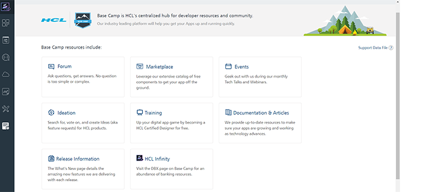

User Guide: Support

# Volt MX Support

The **Support** page displays links to the latest tutorials and articles and Developer resources from Base Camp Library. Base Camp is VoltMX's centralized hub for developer resources and community. Our resource-rich platform will help you get your Apps up running quickly.

The following are the Developer resources from Base Camp Library:

- [Forum](https://support.hcltechsw.com/community?id=community_forum&sys_id=1cdf6e1a1bf31898beab64e6ec4bcbae) - Ask questions, get answers.
- [Marketplace](https://marketplace.hclvoltmx.com/) - Free! Yes, we said free components to pop into your apps.
- [Events](https://www.hcltechsw.com/about/events) - Geek out with us during our monthly Tech Talks and Webinars.
- [Ideation](https://volt-mx.hcltechsw.com/ideas) - Search for, vote on, and create Ideas (feature requests) for HCL products.
- [Training](https://academy.hcltechsw.com/courses?search=eyJjYXQiOiIxMCIsInRpdGxlIjoiIiwiZmlsdGVyIjoiIn0=) - Up your game by becoming a HCL Certified Designer for free.
- [Documentation](https://opensource.hcltechsw.com/volt-mx-docs/docs/documentation/) & [Articles](https://support.hcltechsw.com/csm?id=kb_search&spa=1&kb_category=db382ff1db631c14a45ad9fcd3961936) – Resources the way you want them.
- [Release Notes - Foundry](https://opensource.hcltechsw.com/volt-mx-docs/docs/documentation/VMX_release_notes.md#volt-foundry) & [Iris](https://opensource.hcltechsw.com/volt-mx-docs/docs/documentation/VMX_release_notes.md#volt-iris) - Do not miss a beat when we release new features into the wild.
<!-- - [HCL Infinity](https://basecamp.voltmx.com/s/dbx) - Visit the DBX page on Base Camp for banking resources. -->
