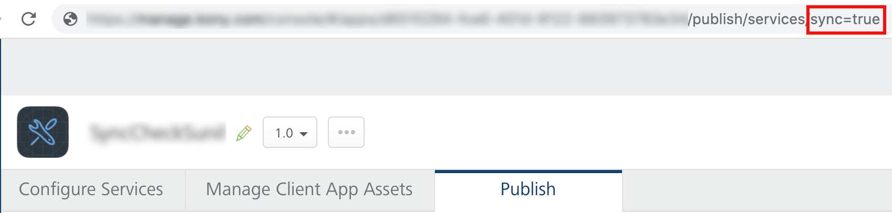
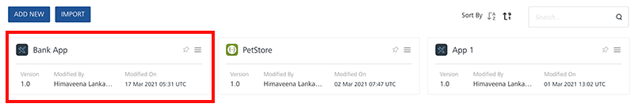
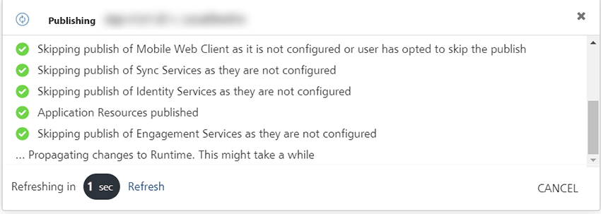
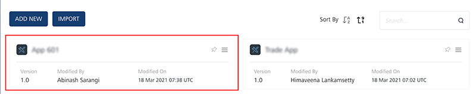
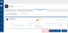

                               

User Guide: [Publish](Publish.md) > Synchronous Publish

Synchronous Publish Apps in Volt MX Foundry Console
==================================================

When you publish apps, your apps are published to clouds or environments. By default, the [asynchronous publishWhen asynchronous publish is initiated, the Publish dialog can be closed and the app publish process continues in the background. Also the user interface (UI) is unblocked, and you can perform other actions in the Console such as creating or modifying other apps and services.](javascript:void(0);) is enabled. If you are required to publish apps synchronously, you can enable synchronous publish by adding the parameter `sync=true` at the end of the **Console** URL while you are in the **Publish** page of an app.

For example: `https://voltmxfoundry_console/apps/<appid>/publish/services?sync=true`

When you enable synchronous publish, the UI in the Console remains blocked until the initiated operation or app publish progress is finished. As the user interface (UI) is blocked, you cannot perform other actions in the Console such as creating or modifying other apps and services.

> **_Note:_** **For on-premises only:**  
  
To skip a .war file if you have uploaded it for **Web** platform under the **Manage Client App Assets** tab, select the **Allow Manual Publish Only** check box in the [**Add a New Environment**](Environments.md) window.

### How to Synchronous Publish an app in Volt MX Foundry Console

To publish an app synchronously, follow these steps:

1.  From the **Applications** page, select a desired app.
    
    
    
2.  Click the **Publish** tab. By default, the **Service & Web Client Publish** tab is selected and lists clouds or environments configured for the Volt MX Foundry account.
    
    
    
    The list also displays one of the following app publish statuses and availability status for that environment.
    
    | APP PUBLISH STATUS ||
    | --- | --- |
    | Published: An app is published to a cloud or environment. You can unpublish the app, if required. ||
    | Not Published: An app is not published to a cloud or environment. You can publish the app, if required. ||
    | Error: An app is canceled while publishing or unpublishing. You can publish or unpublish the app, if required. ||
    | ENVIRONMENT STATUS ||
    | **Busy**: Server is busy publishing another app.App publish request will not be submitted for publishing.For example, When you try to publish an app in a Busy environment, the error message is displayed “`Server is busy processing another request. Please try after some time`” ||
    | **Available**: Server is ready for publishing the app.You can publish/unpublish an app to this environment successfully.For example:When an environment status is Available, if you try to publish an app, the app is submitted for publishing and processed via the publish life-cycle successfully.When an environment status is Available, and if multiple apps (app1 and app2) are sent for publishing simultaneously from different users of the same Foundry account, then the app which is submitted for publish first (say app1) will be processed for publishing, and for app2 the error message will be the shown “`Server is busy processing another request. Please try after some time`” ||
    | **Unknown**: Unable to fetch the server status.App publish request will not be submitted for publishingFor example: When an environment status is Unknown, if you try to publish an app, the app is submitted for publishing, but the publishing might not be successful. ||
    
    > **_Note:_**  Ensure that you have added services (for example, identity service, integration service, sync service, and messaging service) for your application before publishing.  
      
    To publish native client binaries to a Volt MX Management Environment, refer to [How to Publish Native Client Binaries from Volt MX Foundry to Volt MX Management Environment](Publish_Native_Client.md#publishing-native-client-binaries-from-foundry-to-management)
    

1.  To enable synchronous publish, follow these steps:
    
    1.  In the **Publish** page of the app, go to the end of the Console URL, and then add a parameter ‘`sync=true`’.
        
        For example:`` `https://mobilefoundry_console/apps/<appid>/publish/services?sync=true` ``
        
    2.  Press **Enter** key. The **Publish** page gets reloaded and enabled for synchronous publishing.
    
    > **_Note:_**  The asynchronous publish feature enables you to unblock the UI while an app publish is in progress.
    
2.  Based on the available environment status, click an environment.
    
    > **_Note:_**  The **CONFIGURE & PUBLISH** and **PUBLISH** buttons are dim when you have not selected any environment. When an environment is selected, only then is the ****CONFIGURE & PUBLISH****and ****PUBLISH**** buttons are available.
    
3.  Click the **PUBLISH** button. The process of publishing the app begins.
    
    
    
    After the app is published, the app status changes to **Published** in the **Select environment to publishing** section. The **Publishing** dialog also displays details for published services and primary app key/app secret, secondary app key/app secret, service URL, and Web application URL. For more information, refer to [Separate App Key/App Secret for Native and Web Channels](SeparateAppKey-Secret.md).
    
    
    
    > **_Note:_**  You can also publish an app via API. For more details, refer to [Continuous Integration - Publish an app via API](CI_with_Foundry_APIs.md#publish-via-apis)
    

### How to Synchronous Unpublish an App in Volt MX Foundry Console

Unpublishing an app allows you to modify, unlink, or delete a service. During the time an app is unpublished, the end users cannot access the app.

To unpublish an app synchronously, follow these steps:

1.  In the **Applications** page, click an app. The application details page displays.
    
    
    
2.  Click the **Publish** tab. By default, the **Service & Web Client Publish** tab is selected and lists clouds or environments configured for the Volt MX Foundry account.
3.  To enable synchronous unpublish in the **Publish** tab, follow these steps:
    
    1.  In the **Publish** page of the app, go to end of the Console URL, and then add a parameter ‘`sync=true`’.
        
        For example:`` `https://mobilefoundry_console/apps/<appid>/publish/services?sync=true` ``
        
    2.  Press **Enter** key. The **Publish** page gets reloaded and enabled for synchronous publishing.
    
    > **_Note:_**  The asynchronous publish feature enables you to unblock the UI while an app publish is in progress.
    
4.  Based on the available environment status, select the environment and then click **UNPUBLISH.**
    
    > **_Note:_** For more details on Environment availability status, refer to [Environment Status for Publish/Unpublish](#ENVIRONMENTstatus).
    
    > **_Note:_**  When an environment is published, only then the **UNPUBLISH** button is available.
    
    
    
    The process of unpublishing the app begins.
    
    
    
    For more details about app publish stages, refer to [Publish Life-cycle](Publish_LifeCycle.md#publish-life-cycle).
    
    After the app is successfully unpublished, the app status changes to **Not Published** in the **Select environment to publishing** section.
    
    > **_Note:_**  You can also unpublish an app via API. For more details, refer to [Continuous Integration - Unpublish an app via API](CI_with_Foundry_APIs.md#unpublish)
