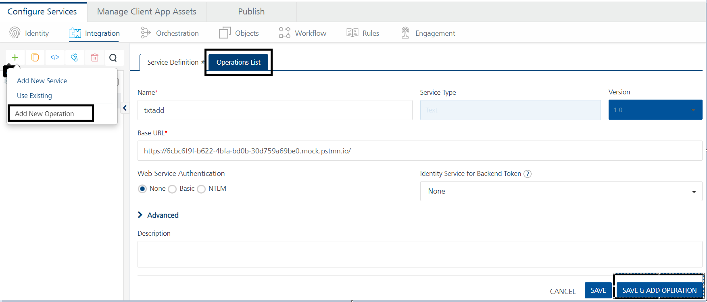
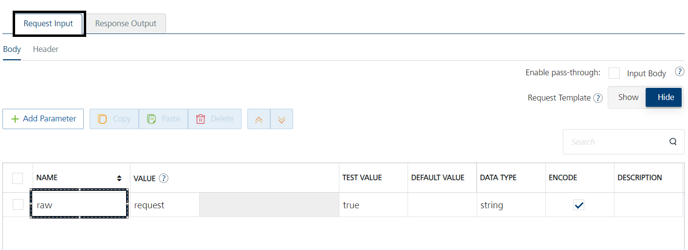

Configure Text Adapter
-----------------------
With Volt MX Foundry Text Adapter forwards the request that has Text data and gives response without intermediate transformation (without affecting the actual request and response).  

By enabling Text, the input (body and headers) of a client's input request is forwarded to the back end and the output response from the back end is forwarded to the device with no changes in the input request and output response.  

Text adapter takes the unformatted string as input and gives output as  

•	Raw text    
•	Json

### Configure Text Endpoint Adapter

To configure Text service in the [Integration Service Definition](ConfigureIntegrationService.md) tab, follow these steps:

1. In the Name field, provide a unique name for your service.

2.	From the Service Type list, select Text.

3.	Provide the following details in the Text service definition:

    |Field|Description|
    |-|-|
    |Base URL Configuration|**Base URL-** Type the URL (provide the format and explain the URL parameters)|
    |Web Service Authentication|Web Service Authentication Select one of the following modes:|
    ||**None-** Select this option if you do not want to provide any authentication for the service.|
    ||**Basic-** Provide User ID and Password if the external Web service requires a form or basic authentication.
    ||**NTLM-** Your service follows the NT LAN Manager authentication process. You are required to provide the User ID, Password, NTLM Host, and NTLM Domain.
    |Identity Service for Backend Token|Select the Identity service associated with your app if this service needs backend token like access_token from that Identity service to access the backend server.|    

4.  Provide the following additional details in the Text service definition:          

    |Field|Description|
    |-|-| 
    |Custom Code|Custom Code enables you to specify dependent JAR. To specify dependent JAR, select the JAR containing preprocessor or postprocessor libraries from the drop-down list, or click Upload New to browse the JAR file from your local system. This step allows you to further filter the data sent to the back end.|
    || **_Important_**: Make sure that you upload a custom JAR file that is built on the same JDK version used for installing Volt MX Foundry Integration. For example, if the JDK version on the machine where Volt MX Foundry Integration is installed is 1.6, you must use the same JDK version to build your custom jar files. If the JDK version is different, an unsupported class version error will appear when a service is used from a device.|
    |Throttling|API throttling enables you to limit the number of request calls within a minute. If an API exceeds the throttling limit, it will not return the service response.|
    || **To specify throttling in Volt MX Foundry Console, follow these steps:**|    
    || In the **Total Rate Limit** text box, enter a required value. With this value, you can limit the number of requests configured in your Volt MX Foundry console in terms of Total Rate Limit.|    
    || In the **Rate Limit Per IP** text box, enter a required value. With this value, you can limit the number of IP address requests configured in your Volt MX Foundry console in terms of Per IP Rate Limit.|    
    || **To override throttling in App Services Console, refer to** [Override API Throttling Configuration.](API_Throttling_Override.md#override-api-throttling-configuration)|    
    ||**_Note:_** In case of On-premises, the number of nodes in a clustered environment is set by configuring the VOLTMX_SERVER_NUMBER_OF_NODES property in the Admin Console. This property indicates the number of nodes configured in the cluster. The default value is 1.Refer to [The Runtime Configuration tab on the Settings screen of App Services](../../../Foundry/vmf_integrationservice_admin_console_userguide/Content/Runtime_Configuration.md). The total limit set in the Volt MX Foundry Console will be divided by the number of configured nodes. For example, a throttling limit of 600 requests/minute with three nodes will be calculated to be 200 requests/minute per node. This is applicable for Cloud and On-premises.|    
    |URL Provider Class|Enter the qualified name of the URL Provider Class. For more information, refer [URL Provider Support for XML, JSON, SOAP, and API Proxy](URL_Provider_Support_for_XML__JSON__SOAP_and_API_Proxy.md).|  

     > **_Note:_** All options in the Advanced section are optional.    

5. In the **Description** field, provide a suitable description for the service.

6. Click **Save** to save your service definition.

Create Operations for Text Adapter
-----------------------------------

The **Operations List** tab appears only after the service definition is saved.

> **_Note:_** Click **Operations List** tab > **Configure Operation**. The **Configured Operations** list appears.

### Create Operations for Text Adapter  

1.  Click **SAVE & ADD OPERATION** in your service definition page to save your service definition and display the **NewOperation** tab for adding operations.  
    OR  
    Click **Add Operation** to add a new operation or from the tree in the left pane, click **Add > Add New Operation**.    

    Image displayed as below:  

    

2.	To create an operation, provide the following details:  

    |Field|Description|
    |-|-|
    |Name|Enter a unique name for your operation.|
    |Operation Security Level|It specifies how a client must authenticate to invoke this operation.|
    ||**Select one of the following security operations in the Operation Security Level field.**|
    ||**Authenticated App User** - It restricts the access to clients who have successfully authenticated using an Identity Service associated with the app.|
    ||**Anonymous App User** - It allows the access from trusted clients that have the required App Key and App Secret. Authentication through an Identity Service is not required.|
    ||**Public** - It allows any client to invoke this operation without any authentication. This setting does not provide any security to invoke this operation and you should avoid this authentication type if possible.|
    ||**Private** - It blocks the access to this operation from any external client. It allows invocation either from an Orchestration/Object Service, or from the custom code in the same run-time environment.|
    |Front End HTTP Method|Select a HTTP method that you want to invoke on the integration server. By default, the field is set to Post method.|
    ||**_Note:_** The front-end HTTP methods are used for all non-SDK clients such as API Management users. Invoking a service from an SDK will continue to use the POST method for operations.|
    ||**_Note:_** From SP3 onwards, the **Front End HTTP Method** is called as **Resource Method**. You can configure the **Resource Method** in the [Advanced> Front End API section](FrontEndAPI.md)|
    |Target HTTP Method|Select a HTTP method that you want to invoke on the back-end service from integration server.|
    |Operation Path|Modify the path if required.|
    ||**_Note:_** If you provide incorrect Salesforce endpoint details, the **Object** list will contain only _Login object.|
    |Base URL and Target URL|The **Target URL** field is prepopulated with the URL that you provided at the **Base URL** field. You can add the suffix, if required. For example, to the base URL, you can add suffix such as /latest  or /sports to get latest news or sports news: http://feeds.foxnews.com/foxnews`/latest` http://feeds.foxnews.com/foxnews`/sports`| 

3.  For addition configuration of request(or) response operations, provide the following details in the Advanced section:

    |Field|Description|
    |-|-|
    |Custom Code Invocation|You can add pre and post processing logic to services to modify the request inputs. When you test, the services details of various stages in the service execution are presented to you for better debugging. All options in the Advanced section are optional. For more details, refer to [Preprocessor and Postprocessor](Java_Preprocessor_Postprocessor_.md).
    |Properties|[Additional configuration properties (timeout, cachable, unescape embedded xml in response, response encoding, number of connection retries](Java_Preprocessor_Postprocessor_.md#timeout_cachable) allows you to configure service call time out cache response|
    |Front End API|It allows you map your endpoint/back-end URL of an operation to a [front-end URL](FrontEndAPI.md).|
    |Server Events|Using Server Events you can configure this service to trigger or process server side events. For detailed information, refer [Server Events](ServerEvents.md).|

4.  > **_Note:_** All options in the Advanced section are optional.

5.	Click **Save** to save the operation. 

6.	By **default**, Text Adapter gives **JSON response**.

7.	To get **Raw response** need to a Request Input parameter called **“raw”** under **Body** tab. 

    
