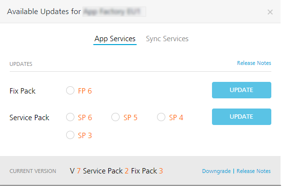
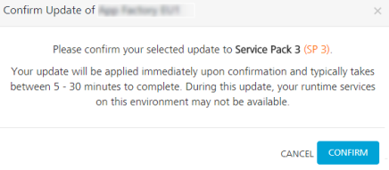

                               

User Guide: Volt MX Foundry Updates on Cloud

Volt MX  Foundry Updates on Cloud
===============================

HCL is constantly making improvements to Volt MX Foundry, which you can install as updates to your PROD environments/Clouds. As an Admin, you can view the latest available Fix Pack version as well as all the Service Packs of the current Cloud's Major version.

### How to Update a Fix Pack or Service Pack

1.  From the left pane in your Volt MX Foundry Console, click **Environments**. By default, the **Clouds/Environments** tab is selected and displays the list of clouds or environments configured for the Volt MX Foundry account.
2.  Click the **Settings** button of an environment.
3.  From the **Settings** context menu, select the **Check for Updates**. The **Available Updates** dialog appears.
    
    
    
    You can switch between the **App Services** and **Sync Services** tabs to view the available _Fix Pack_  and _Service Pack_  updates for the current environment version. Updates are displayed in the following format:
    
    |   App Services |   Sync Services |
    | --- | --- |
    | **UPDATES** | **UPDATES** |
    | Fix Pack version > **_Note:_** Only the latest version of a Fix Pack is displayed. | Fix Pack version> **_Note:_** Only the latest version of a Fix Pack is displayed. |
    | Service Pack versions | Service Pack versions |
    | Current Cloud Version ||
    
4.  You can select the available latest fix pack version or a service pack version of app services or sync services and then click **UPDATE**.

> **_Note:_** You can select one update option at a time and update it.

The **Confirm Update** dialog displays the following message and prompts for you to confirm the update.

For example, _Your update will be applied immediately upon confirmation and typically takes between 5 - 30 minutes to complete. During this update, your runtime services on this environment may not be available._

9.  Click **CONFIRM**. The process of downloading the updates begins.
