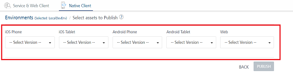
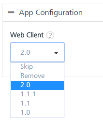

                              

User Guide: [Manage Client App Assets](Manage_Client_App_Assets.md) > Upgrading Client Binaries

Upgrading Client Binaries
=========================

You can upgrade a binary file by importing another binary that has the same version, make changes to it, and then upload the new version to Volt MX Foundry Console. VoltMX Foundry allows you to upload multiple versions of a binaries.

*   **For native client binaries**, if you select a binary version from the **Platforms** drop-down list and publish as preview or publish it to Enterprise App Store (EAS), the system publishes the selected version to EAS. EAS supports storing all the uploaded versions of native client binaries in the database.
    
    
    

In EAS Console, an Admin can select a particular version and need to re-publishing the app for the targeted users.
    
*   **For Web client binaries**, if you select a `.war` version from the **Web Client** platform drop-down list and publish it to the Server, the system overrides the existing version of the .War file with new version in the Server. Volt MX Foundry publishes only one version of a  `.war` file to the server.
    
    
    

For more details, refer to [Managing Client App Assets](Manage_Client_App_Assets.md#UpdateBinaries_ManageClientBinaries).
