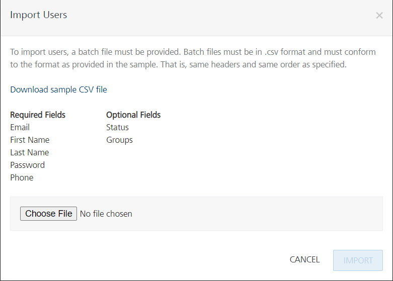
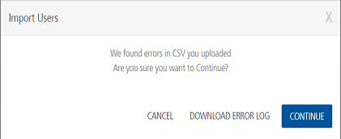

                               

User Guide: [Identity](Identity.md) > [Configure the Identity Service](ConfigureIdentiryService.md) > Use Case

User Repository Identity Service
--------------------------------

With the Enhanced **User Repository** identity service, you can create multiple instances in the same account. An instance of the User Repository type can contain a custom set of users. You can use one service for authentication of multiple apps, use them individually, or share the service across multiple apps.

`Admins` and `Members` are the default groups available in each **User Repository** identity service instance. A user must be part of a group in an instance. By default, all users are associated to the Members group. This authentication service works in the same norms as other VoltMX Foundry services.

### Use Case 1- Creating multiple instances of User Repository Identity Service

For example, you have created two apps: `Employees` and `citizenIDStore`. Now you want to create separate login credentials for these apps and publish these apps to one environment in the same account. So the individual set of users can access only the authenticated apps from that account. You can use the **User Repository Identity Service** type to achieve this.

*   Here, you create `EmployeeUserRepository` identity service instance and associate it to the `Employees` app and publish the app to a `Staging` environment. Now all users in the `EmployeeUserRepository` can only access the `Employees` app from the Staging environment, in that account.
*   Similarly, you create another instance of the identity service: `citizenUserRepository` and associate it to the `citizenIDStore` app and publish the app to the Staging environment. Now all users in the `` `citizenUserRepository` `` can only access the `citizenIDStore` app from a Staging environment.

> **_Note:_** Users from a particular User Repository can only access the app associated with it.

The following flow diagram explains the usage of **User Repository** authentication in Volt MX Foundry.

> **_Note:_**  NTLM authentication is not supported by User Repository identity service.

### Creating a User Repository Identity Service

To configure an identity service using User Repository, follow these steps:

1.  In Volt MX Foundry Console, from the left pane, click the **Apps**.
2.  In the **Foundry Apps** page, click **ADD NEW**. By default, the **Configure Services** tab is selected. A new app is added, and you are directed to the **Identity** page of the new app.
3.  Click **CONFIGURE NEW**.
    
    > **_Note:_** For more details on Identity Service Designer page, refer to [**Identity** service designer](#IdentitySDpage).
    
4.  Specify a name for the service in the **Name** text box.
5.  From the **Type of Identity** list, select **User Repository**.
    
    
    
6.  Click **SAVE**.
7.  Click the **Advanced** to provide additional configuration of your service definition:
    *   Now you can enable or disable the integrity check for an identity service at the provider level. If the integrity is disabled at the provider level, then the provider is meant for server-to-server communication only. To disable the integrity check, In **Advanced**, select the **Restrict to Foundry Server to Server Authentication** check box. This setting blocks a traditional client app from using an identity service. It will only allow the identity service to be used from a Volt MX Foundry Server to authenticate and invoke services.
    *   **Concurrent User Logins**: Select one of the following three options to configure concurrent user login sessions. For more information, refer to [Concurrent User Logins](ConcurrentUserLogins.md).
        *   **Allow concurrent user sessions (no restrictions)**: When this option is selected, an app user with unique credentials is allowed to have multiple apps from different instances.
        *   **Allow only one active user session per app**: Logging into simultaneous instances of **the same app** is not supported. When this option is selected, an app user can log in to only one instance of client apps linked to a specific Foundry app which has the identity service linked.  
            
        *   **Allow only one active user session across all apps**: Logging to simultaneous instances of **the same app or across apps** is not supported. When this option is selected, a unique app user can log in to only one instance of client apps linked to all Foundry apps using the identity service.  
            
            > **_Important:_** Apps enabled for SSO will not work if the option is selected, Allow only one active user session across all apps.
            

The **Users List** page appears with the **IMPORT USERS** and **ADD USERS** buttons, which you can use to add users or import users into the User Repository identity service.

### Adding a User with a Group to a User Repository

To add a user to the User Repository, follow these steps:

1.  [After you create a user repository identity service](#creating-a-user-repository-identity-service), click **ADD USER**.

Click to continue...

2.  The **Add User** dialog appears.
    
    
    
3.  Provide the required details for the mandatory fields (Email, First Name, Last Name, and Password.)
4.  To associate the user to a Group: In **Add / Select Group (s)**, select the required check boxes for the available groups from the list. The default groups are **Admins** and **Members**.
    
    
    
    *   **To add new group, follow these steps:**
        1.  Enter the name for a new group in the text field.
        2.  Click the **Add Group**. The new group is created and added to the list.
    
    If you have not selected any group, the user is added to the **Members** group by default.
    
    > **_Note:_** For more details on how to use Groups, refer to [Using Groups in an App](GroupsinUserRepository.md).
    
5.  Click **ADD USER**.
    
    You can add another user by repeating these steps above in the procedure.
    

### Importing users to a User Repository

You can add multiple users to the Volt MX Foundry console through a CSV file in the **Import Users** window.

To import users to a User Repository, follow these steps:

1.  [After you create a user repository identity service](#creating-a-user-repository-identity-service), click **IMPORT USERS**. The **Import Users** dialog appears.

Click to continue...

2.  Click **IMPORT USERS**. The **Import Users** dialog appears.
    
    
    
    You can import multiple users either by using the sample template provided in a .CSV file format or similar to the `template.CSV` file. The .CSV file must include all the headers such as Email, First Name, Last Name, Password, Phone, Status, and Groups. It is mandatory that the .CSV file contains all the **Required Fields** (Email, First Name, Last Name, Password, and Phone.)
    
    > **_Note:_** Data entered in your .CSV file should have all the following mandatory fields. You can use alphanumeric and special characters to fill the data for each field as follows:
    
    *   **Email**: Contains only a valid mail.
    *   **First Name**  and  **Last Name**:
        *   Cannot contain special characters:  **\>, <, &, +, |, /, \\, \***
        *   Min size - 1 (or Empty String) ; Max size - 128
    *   **Password**
        *   Contains only a valid password includes at least one uppercase, one lowercase, and one digit.
        *   Min size - 8; Max size - 20
    *   **Phone**
        *   Contains a white space or a valid phone number (digits 0 to 9, #, -, +)
        *   Min size - 1; Max size - 20
    
    > **_Note:_** Data entered in your .CSV file can have all the following optional fields:  
    
    *   **Status**  Contains a white space (space or -) or a valid status such as pending, active, blocked, or disabled
        *   **Pending:** Users in the pending state cannot log in or use any of the MBaaS services.
            
            Users enter the pending state in one of the following ways:
            
            *   A user is imported into authentication via direct user registration to the Volt MX User Repository but pending confirmation from sysadmin/email verification.
            *   A user is added to the system after logging in via an external provider. However, the provider's policy is set to "new users will be in pending state unless confirmed by administrator."
        *   **Active:** Users can log in and use services.
            
            Users enter the active state by an admin/user action or due to a policy on provider as default active when logged in to MBaaS.
            
        *   **Blocked:** Users cannot log in or use any service.
            
            Blocked is typically an automated action by an authentication service based on policies such as nonconsecutive log-ins.
            
            Users can be reactivated through an admin action, with a policy that is auto-enabled after 24 hours, or via answers to secret questions.
            
        *   **Disabled**: Users cannot log in or use any of the services. This status is set by an explicit admin action.
    *   **Groups**
        *   Contains group names (digits 0 to 9, #, -, +)
        *   Can contain special characters:  **\>, <, &, +, |, /, \\, \***
        *   Min size - 1 (or Empty String) ; Max size - 128
        *   If you want to specify multiple groups, use semi-colon to separate the group names. For example, Employees;Admins;Managers
    
3.  To use the sample template CSV file, follow these steps. Otherwise, proceed to the next [Step 4](#Step4).
    1.  Click **Download sample CSV file**. The `sample.CSV` file downloads into your local system.
    2.  Navigate to the sample.CSV file and open it, and then fill in details. After filling, save the file and then close it.
4.  Click the **Browse** button to browse and upload your CSV file.
    
    After you select a CSV file, the system shows the file name. If no file is selected, its status is set to  `No file selected`
    
    > **_Note:_** The **Import** button is made available only after you upload your .CSV file.
    
5.  Click **Import** to import your data.  
    
    The system will validate your CSV file for the following:
    
    *   If you select any file type other than a CSV file, an error will display, such as `Unsupported File type`.
    *   If the file size is greater than 75KB, an error will display, such as the `Selected file is too Hilarge. Size limit is 75KB.`
    *   If a field in the CSV file contains wrong data, the system will throw an error, as shown below:
        
        
        
6.  To view error logs, click **Download Error Log**. The system generates an **error.csv** file, and prompts you to open or save the file.
7.  To continue importing users, click **Continue**. The system imports only users with valid data into the console successfully, generates an **error.csv** file, and prompts you to open or save the file. The details of imported users are displayed in the grid list.
    
    > **_Important:_**  If you click **Continue**, the system successfully imports only users with correct data into the console. An error.csv file contains only users fields with invalid data and corresponding error messages.
    
8.  Click **Save**. The system saves the **error.csv** in your browser's default download location. For example, in Firefox, the system prompts you to save or open the file.
    
    The following is a list of error messages for each field:
    
      
    | Field With Wrong Data | Error Message Displayed |
    | --- | --- |
    | **Email -** for example, _sample\_email_ | Email/User ID contains illegal characters and is invalid |
    | **First Name** - for example, _&&_ | First Name must be a maximum of 128 characters First Name contains illegal characters and is invalid |
    | **Last Name** - for example, _&&_ | Last Name must be at a maximum of 128 characters Last Name contains illegal characters and is invalid |
    | **Phone -** for example, _12346753abc_ | Phone field contains illegal characters and is invalid |
    | **Password** - for example, _passw_ | Password must be between 8-20 characters |
    | **Status** \- for example, my status | User status **my status** is invalid. Pending, active, blocked, and disabled are valid statuses. |

### Exporting Users from a User Repository

You can export the existing users of the user repository to an .CSV file. The .CSV file contains users with record level data in a tabular form such as Email, First Name, Last Name, Password, Phone, Status, and Groups.

> **_Note:_** When you export users from a user repository, the content of the Password field is not exported.

> **_Note:_** Maximum 10000 users can be exported at a time.

You can import users from the exported .CSV file into another user repository identity service. Before importing the .CSV, ensure that you must fill password for all users in the .CSV file.

To export users of the User Repository to an Excel file, do the following:

1.  Go to Foundry Console, and navigate to the app.
2.  In the **Configure Services** > **Identity** tab of the app, click the user repository identity service. The User Repository identity services details are displayed.
3.  Click **EXPORT**.

### Editing or Deleting a User from a User Repository Identity Service

To edit a user from the User Repository, follow these steps:

1.  From the **Identity** tab of an app, click the required user repository service. The list of users is displayed.
2.  Click the **More Options** button next to the user.
    
    *   To edit a user, do the following:
        1.  To edit a user, click **Edit User Details.** The **Edit User** window appears.
        2.  Enter the required details.
        3.  Click the **EDIT USER** button.
    
    *   To delete a user, do the following:
        1.  To delete a user, click **Delete**. The **Delete User** confirmation window appears.
        2.  Click the **DELETE** button.

### Cloning a User Repository Identity Service

1.  Go to the **Identity** tab of the app in Volt MX Foundry. The page lists the existing services (if any).
2.  Click **More Options** button next to the identity service type of the User Repository.
    
    
    
3.  Click **Clone**: When you clone a user repository identity service, all users added in the first service are present in the cloned service as well.
    
    > **_Important:_** When you click **Clone**, the system generated new name appears for the cloned identity service, in the list. The new name remains in the edit mode until you click anywhere else on the screen. If you want, you can rename it. Changes made to a cloned identity service will not impact the original service.
    

### Reset Password

If you have used User Repository identity service to authenticate and build your app by using MF-SDKs, and if you forgot your password to access the app, you can reset your password based on your registered email ID. Refer to [Reset Password for Authentication based on User Repository Identity Service](Forgot_Password.md)

> **_Note:_** For more information on how you can integrate Volt MX OAuth Provider, User Repository, and OAuth 2.0 Identity services to create a basic login form, refer to a Base Camp article: [Exploring Volt MX OAuth Provider](https://support.hcltechsw.com/csm?id=kb_article&sysparm_article=KB0083892).
