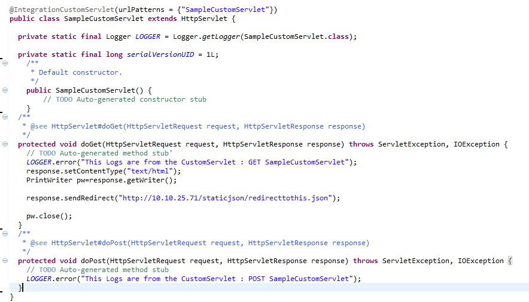
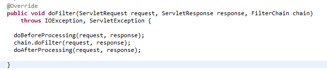
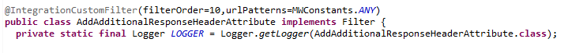
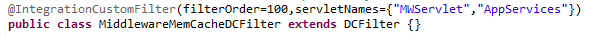
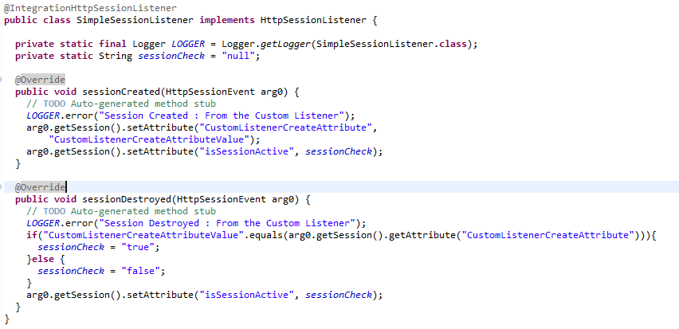

                             

User Guide: [Integration](Services.md#integration) \> [Advanced Configurations](Advanced_Configurations.md) > How to Use Custom Servlets, Filters, and Listeners

How to Use Custom Servlets, Filters, and Listeners
==================================================

Volt MX  Foundry lets you further customize your Volt MX Foundry apps by adding custom servlets, filters and listeners. This topic provides examples and describes how to add these to your Volt MX Foundry apps.

How to Add a Custom Servlet
---------------------------

You can add custom servlets with custom logic, and publish it by adding it to Volt MX Foundry application and it works as per the Java Servlet Specification.

For example, you can

*   Create a servlet with the desired URL pattern where you can then write your custom code.
*   Use custom servlets to integrate other third-party servlets.

The following sample code shows a simple custom servlet that redirects a request to the provided URL.



How to Add a Custom Filter
--------------------------

You can add custom filters to add custom logic alongside the existing filters already provided by Volt MX Foundry.

The following steps describe how to add security checks to a request.

1.  Create a filter class following the Java Servlet Specification, and then annotate it with the Volt MX **@IntegrationCustomFilter** annotation.
2.  Write the logic in the **doFilter()** method, and then publish the custom JAR by adding it as a transitive dependency to your Volt MX Foundry App.
3.  Configure **filterOrder** between the custom filters for your custom filter. Refer to the example below. Volt MX recommends that you start the **filterOrder** from the number 101 as 1 – 100 are reserved for Volt MX.
4.  Configure a custom filter to a request pattern  
    **or**  
      
    Configure a custom filter to one of the following VoltMX\-provided servlets
    *   **MWServlet** - Used for integration and orchestration services.
        
    *   **AppServices** - Used for object services runtime request.
        
    *   **AppMetadataServices** – Used for object services metadata request.  
        
5.  Request pattern can be given to match for a particular service URL pattern.

How to Add a Custom Listener
----------------------------

You can also use custom listeners to add custom logic for application events, such as application start-up, or session create and destroy.

> **_Note:_** To create a custom session listener, use the **@IntegrationHttpSessionListener** annotation.

The following code sample shows a **SimpleSessionListener** class which implements an**HttpSessionListener** that is invoked every time the session is created or destroyed.



How to Create a Custom Servlet Context Listener
-----------------------------------------------

Servlet Context Listener is used to listen to startup and shutdown event of context. Every method in listener interface takes Event object as input.

To create a custom servlet context listener, use **@IntegrationServletContextListener** annotation.

The following sample for Custom `ServletContextListener` is invoked on application life cycle events.

*   `contextInitialized` - When the application boots up or during startup.
    
*   `contextDestroyed` \- When the application is stopped or during shutdown.
    

```
 package com.voltmx.customlistener;
 
import javax.servlet.ServletContextEvent;
import javax.servlet.ServletContextListener;
 
import org.apache.log4j.Logger;
 
import com.hcl.voltmx.middleware.servlet.listeners.IntegrationServletContextListener;
 
@IntegrationServletContextListener
public class MWServletContextListener implements ServletContextListener {
 
  private static final Logger LOGGER = Logger.getLogger(MWServletContextListener.class);
 
  @Override
  public void contextInitialized(ServletContextEvent sce) {
    LOGGER.error("Initializing custom resources");
    CustomResourceInitializer.initialize();
  }
 
  @Override
  public void contextDestroyed(ServletContextEvent sce) {
    LOGGER.error("Destroying custom resources");
    CustomResourceInitializer.destroy();
  }
 
}
```

**Follow these steps to publish a custom ServletContextListener** -

1.  Create a servlet context listener with **@IntegrationServletContextListener** annotation.
    
2.  Build a jar file for the class.
    
3.  Upload the jar file as a dependency to a service in **VoltMX Foundry Console**.
    
4.  **Publish** the app.
    

> **_Note:_** As the **ServletContextListener** is an application life cycle, the events will be invoked only once during startup and shutdown. After publish, the server must restart to invoke the `contextInitialized` event.
