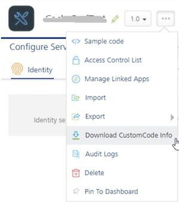
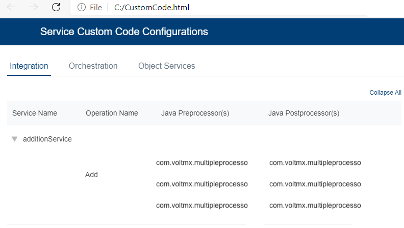

  

Viewing Verbs and Pre and Post Processors associated with Foundry Apps
=====================================================================

The Custom Code Invocation feature in VoltMX Foundry provides the ability to write custom code as pre and post processors to modify/filter request and response parameters to service calls.

You can specify the Java class name, custom JavaScript code, or Rules for preprocessor and postprocessor. Java class names contain the preprocessor and postprocessor. You need to navigate each of the verbs/methods in the services configurations section, and configure pre and post processors in Foundry Console.

**Problem statement**:

Consider a scenario where a Foundry app has lots of pre and post processors associated with back-end services. And if you are required to view all these Java Pre and Post processors, you must navigate to each of the operation/verb of service and then figure out if any processors are associated. It is tedious.

**Solution**:

From VoltMX SP3, Foundry supports the visibility of all Java Pre and Postprocessors linked to services specific to an app on a single screen. The new **Download CustomCode Info** feature is added to the **Apps** context menu.

When you click **Download CustomCode Info**, all the associated data of Java pre and post processors in the app is exported to a .ZIP file (appname.zip) and the zip file is downloaded to your local drive. The zip file contains the `CustomCode.md` file that contains Service Custom Code Configurations for Integration/Orchestration/Objects in an app. You can navigate to each of the tabs and view the details. The Expand/Collapse All options allows you to view the entire list of details in a tab.  

The screenshot details sample configurations in the CustomCode.html file:

