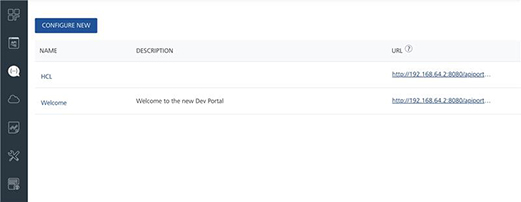
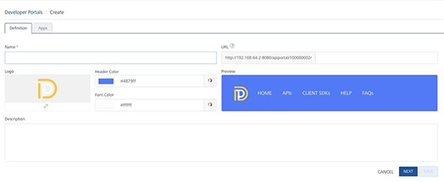
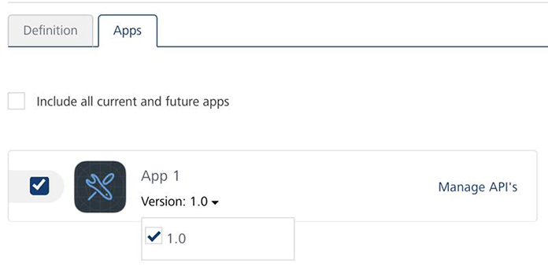
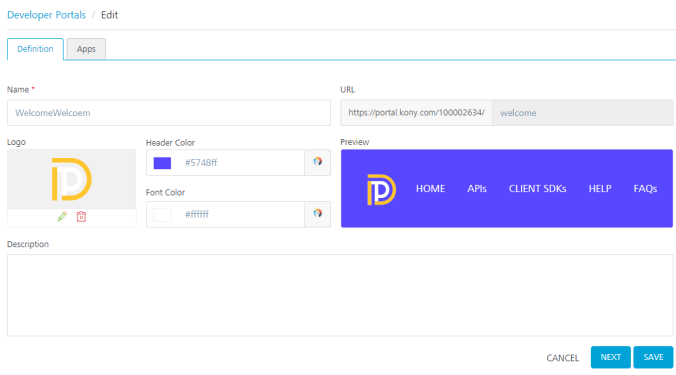
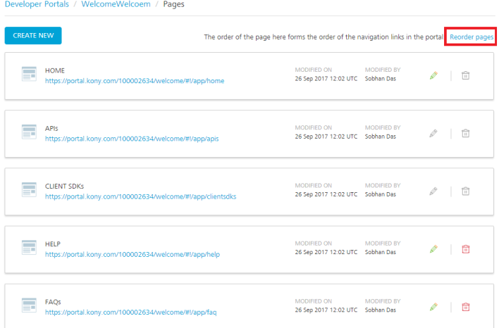
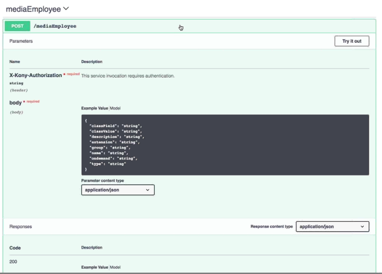
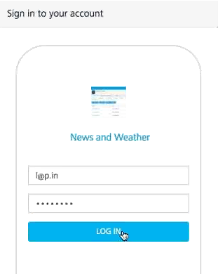

User Guide: Developer Portal

# Developer Portal

Volt MX Foundry Developer Portal feature lets you create a Portal for exposing APIs created using Volt MX Foundry. Developers from internal and external partner teams can access the portal created to explore and test the APIs.

To configure a Dev Portal, you will need to ensure that you have Volt MX account credentials (through [manage.hclvoltmx.com](http://manage.hclvoltmx.com/)). For more information, or if you need to register for a Volt MX account, see the topic [Accessing the Volt MX Foundry Console](Accessing_VoltMX_MBaaS_Portal.html).

## Creating a New Developer Portal

You as an Admin or owner can create, update, or modify Developer Portal for your partners to access the service APIs of your app. A member can only view Developer Portal.

Each Dev Portal has a default logo, and **Header** menu with pages corresponding to the portal home page, APIs, and more. The **HOME**, **HELP**, and **FAQs** pages can be modified to suit your needs. The basic information is covered in the following procedure, while more details about fully modifying your portal can be found in the section [Customizing a Developer Portal](#customizing-a-developer-portal) later in this topic.

To create a new developer portal, do the following:

1.  In **Developer Portal**, click **CONFIGURE NEW**.  
    
3.  Under the **Definition** tab, in **Name**, type the name for your portal.  
    

    > **_Note:_** As you type a name for your portal in the **Name** field, the **URL** field populates the name to create the URL for the new portal, by default. You can edit the URL while creating the portal. Once the portal is created you cannot change the URL. Any special characters in the Name field will be ignored for the URL. While editing the Dev portal, you cannot change the URL.

1.  If you want a custom logo for your Dev Portal, click on **Logo**, select the image file containing your logo, and then click **Open**.
2.  If you want your Dev Portal to have a different font color or header color, click **Header Color** and **Font Color**.

    > **_Note:_** The logo, header color, and font color can all be changed after the Dev Portal is created. For more information, see the Customizing a Developer Portal section later in this topic.

1.  In Description, type a short description of your Developer Portal.
2.  Click **Next**.

    By default all the apps are linked to Developer portal.

3.  To **add specific apps** to Developer portal, do the following:

    1.  Go to the **Apps** tab.
    2.  Select the required check boxes for **the apps** that you want to add to the Dev Portal.

        > **_Note:_** To select **all apps** that you want to add to the Dev Portal, select the **Include all current and future apps** check box

    3.  click **SAVE** to add the selected apps with services to Developer portal.

5.  (From Volt MX Foundry V8 SP4 onwards) To **add specific services** of an app to Developer portal, do the following: 

    1.  Go to the **Apps** tab.

        2.  Select the required check box for **the app**. If you want to add **multiple versions of the app**, you can select the available app versions from the **Version** list. The **Manage APIs** link is enabled for the selected app

            

        1.  Click the **Manage APIs** link. The **API Services** dialog appears and displays services tabs such as Identity, Integration, Orchestration and Objects tabs for the selected app version. By default all the configured services for each app version are selected in each service tab.

            You can view the services from each version by selecting the required version.

            

        1.  Select the app version from the **Version** list.

            1.  Click the required services tab and clear the check boxes for required services.

                > **_Important:_** Repeat this step if you want to add specific services from different versions of the app.

            2.  Click **OK** to save the settings and close the **API Services** dialog.

    2.  In the **Apps** tab, click **SAVE** to add app with services to Developer portal.

> **_Note:_** You can also search for specific apps by entering an app name in the **Search** box

Now you can log into your Developer portal account and can view the add apps with services

The selected services of an app are listed in the swagger file of the app. You can click API Documentation in Developer Portal to download services details.

## Customizing a Developer Portal

After you have created a Dev Portal, you can modify or update the information on the portal. For example, you might want to add additional frequently asked questions, or give more details on what the apps in the portal can do. You can also modify the look and feel of the portal pages, and add or remove pages, if necessary. The procedures in this section describe how to edit your portals and how to manage the pages of the portal.

### Editing a Developer Portal

To edit a Dev Portal, do the following:

1.  Hover your cursor over the required portal, click the **Settings** button, and then click **Edit**.  
    

2.  Under the **Definition** tab, in **Name**, type the name for your portal.

    

3.  If you want to add a custom logo to your Dev Portal, click on **Logo**, select the image file containing your logo, and then click **Open**.
1.  If you want your Dev Portal to have a different font color or header color, click **Header Color** and **Font Color**.

    > **_Note:_** You can view the header color and font color in the preview section before saving. The logo, header color, and font color can all be changed after the Dev Portal is created.

1.  If you want to modify the description of the portal, type a description in the **Description** field.

### Managing Dev Portal Pages

To manage the pages available in the Dev Portal, hover your cursor over the required portal, click the **Settings** button, and then click **Manage Pages**.  

In the **Pages** window, a list of all pages for the specific portal are listed.  

The order of the pages in the list determines the order of the navigation links that are displayed in the portal header. The default order of pages are:

- **HOME** - The home page for the portal.
- **APIs** - A page listing all apps available through the portal, along with their corresponding APIs.
- **CLIENT SDKs** - Links for users to download the appropriate SDKs for using the portal (such as iOS or Android).
- **HELP** - A page with a brief description on how to use the portal.
- **FAQs** - A page for Frequently Asked Questions.

All of the pages are pre-populated with general information by default. However, the **HOME**, **HELP**, and **FAQs** pages can be modified as needed, or additional pages can be added.

#### Modifying the Page Order

To modify the order of the pages, do the following:

1.  Click **Reorder Pages**  
    
2.  Drag-and-drop the pages into the order you want. When you are finished, click **SAVE PAGE ORDER**. The **HOME** page is not draggable.

#### Editing a Specific Page

If you have selected Manage Pages for a portal, you can edit the specific pages of your portal. For example, to provide new or updated information, or to add new FAQs.

> **_Note:_** You cannot edit the **APIs** or **Client SDKs** pages.

To edit a specific page, do the following:

In the **Pages** window, click the **Edit** icon of the page you want to edit.  

The page appears with a graphical interface that you can use to directly add, modify, or delete information on the page.  

The menu at the top of the page provides functionality for changing fonts, changing styles, adding links, inserting images, switching to code view for the page, and more. For information about each button, hover the mouse over the button and a brief description of the button's functionality will appear.

In the interface, you can click anywhere on the page and add or modify text.

If there are links on the page, such as **Explore APIs** in the previous image, you can click on it and do one of the following:

- Select **Edit** to change the name of the link and the destination of the link.

Or

- Select **Unlink** to remove the link.

When you have finished editing the page, click **PUBLISH** to save the updated page, or click **CANCEL** to leave the page without saving updates.

#### Deleting a Specific Page

To delete a page, click the **Trash Can** icon associated with the page.

> **_Note:_** By default, you cannot delete the **HOME**, **APIs**, or **CLIENT SDKs** pages.

#### Adding a New Page

To add a new page to your portal, click the **CREATE NEW** button, and, use the interface to design your page.

When the page is complete, click **Save**.

## Granting Developer Portal Access

After the Dev Portal is configured, you can provide users access to the portal by inviting them using the Volt MX Foundry Console. There is a specific role added to the user account that has been added to Volt MX Foundry called **Developer Portal Only**. This provides access to specific Dev Portals only and does not provide access to the Volt MX Foundry Console.

### Inviting a new user for Developer Portal only access

> **_Note:_** The new user should not be part of the Dev portal.

To invite a new user to access the Developer Portal, do the following:

1.  In **Settings**, and click the **INVITE** button.
2.  In the Invite User window, type the user's email address, and under **Account Role**, click the drop-down box and select **Developer Portal Only**.
3.  In **Environment Permissions**, select the environment or environments to grant the user access to.
    > **_Note:_** The user can access all Dev Portals in Volt MX account that they have been granted access.
1.  Click **INVITE**.

The user will receive an email notification of access, along with a link to the Dev Portal.

## Using the Developer Portal

After a user has been added, they can click the link in their email invitation to use the portal. Enter the required details and click **Accept Invitation**.

Users can have access to multiple Dev Portals. A user can switch from one Dev Portal to another by clicking the Dev Portal drop-down box and selecting the portal they want to switch to.  

Apps are published per environment, so you must ensure that you have the correct environment selected in the portal. To change the environment, click the **Environment** drop-down box and select the correct environment where the app is located.  

You can view details of a particular app by clicking on it.

The app details are shown.  

To view a specific service, click **View**.

After a service is selected, the portal retrieves details about all exposed APIs for that service. The following screen only appears for V8 or above Clouds.  

APIs enabled with Custom Front-end URLs

From Volt MX Foundry V8 SP3 onwards, if you have enabled a front-end URL in Volt MX Foundry and if the front-end URL has a value, the value is displayed as path (as per the swagger) in Developer Portal, as shown in the following table:

| Front-end configured with Resource HTTP method | APIs displays the following additional details in parameters section                                                                                                     |
| ---------------------------------------------- | ------------------------------------------------------------------------------------------------------------------------------------------------------------------------ |
| **GET** method                                 | Parameters **Path** for the configured front-end URL verb, which is one of the request parameters. **Query** parameters of the request parameters. Responses             |
| **POST/ PUT** methods                          | Parameters **Path** for the configured front-end URL verb, which is one of the request parameters. **Body** contains request input parameters in a JSON format Responses |
| **DELETE** method                              | Parameters **Path** for the configured front-end URL verb, which is one of the request parameters. Responses                                                             |

You can click on an API to get more detailed information.  

Each API lists its corresponding parameters, and example values, and response codes for the API.

To use the API, click **Try It Out**. You can then modify the values for the parameters as needed. When you want to test the API, click **Execute**.

#### Securing an API using an Identity Service (Invoking an API protected by identity service)

Some APIs require authorization through an identity service to use and test. These correspond to service that has its Operation Security Level set to **Authenticated App User**.

To test an API , which uses an identity service of type OAuth 2.0, do the following:

1.  Click the **Authorize** button.  
    
2.  In the Available Authorizations window, provide the **client_id** and **client_secret** information.  
    

    These correspond to the **AppKey** and **Secret** fields listed at the top of the API page.  
    

3.  Click the **Authorize** button.
4.  Enter your credentials that correspond to the identity provider, and click **Log In**.  
    
5.  In the **Request for Authorization** window, click **Authorize**.
6.  Confirm in the **Available Authorizations** window that your identity provider says **Authorized**.  
    

