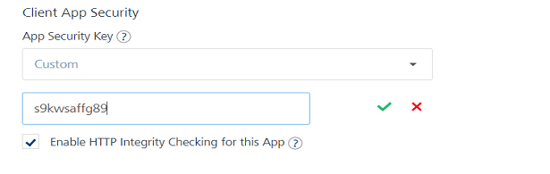

                               

User Guide: [SDKs](../Foundry_SDKs.md) > [VoltMX Iris SDK](Installing_VoltMXJS_SDK.md) > Usage of Custom App Security Key

HTTP Message Body Integrity
---------------------------

The Client App Security feature helps to secure data exchanged between a client app and a server app. Enterprise class applications may need to ensure that network traffic being exchanged between the server and client app is not tampered with. This feature detects and reports network traffic tampering on the data exchanged between the server and client app.

> **_Important:_** HTTP Integrity does not support Scheduler job.

### Best Practices - HTTP Message Body Integrity

As a security best practice, it is recommended that you have different Volt MX Foundry applications with different security keys for Native and Web.

### Error Message - HTTP Message Body Integrity

While exchanging data between a client app and a server app and if the data is tampered, the following error message appears:

*   Error code:`1019`
*   Error message: `Http message Body Integrity Check failed`

### Limitations - HTTP Message Body Integrity

*   HTTP message body integrity does not support **Metrics** **and Binary** features.

> **_Note:_** You can enable [](../ServiceConfig-Identiy-Apps.md)[HTTP Message Body Integrity by using Volt MX Foundry > Identity > SERVICE CONFIGURATION](../ServiceConfig-Identiy-Apps.md#how-to-enable-http-message-body-integrity).

### Usage of Custom App Security Key

Custom App Security Key that is configured in Volt MX Foundry must be provided to the SDK prior to initializing the SDK using a preshow action.



#### Syntax

```
setAppSecurityKey(customSecurityKey)
```

#### Parameters

  
| Input Parameter | Type | Description | Required |
| --- | --- | --- | --- |
| customSecurityKey | String | Custom security key defined in Volt MX Foundry by the user. It contains alphanumeric characters. | Yes |

#### Return Type

  
| Type | Value |
| --- | --- |
| Boolean | True |
| JSON | JSON object with keys, **errmsg** and **errcode**. |

#### Sample Code

```
// **Note**: This piece of code must be called from preAppInit (i.e before SDK init)
// Get an instance of SDK
var client = voltmx.sdk.getCurrentInstance();
var response = client.setAppSecurityKey("customSecurityKey");
if (response !== null && response === true) {
    voltmx.print("Custom security key is set successfully");
} else {
    voltmx.print(response.errmsg + " and " + response.errcode);
}
```

#### Error Codes

  
| Error Code | Error Message |
| --- | --- |
| 1023 | Security Key must be a non empty string. |

> **Note:**  
*   Client and server apps must be in sync with each other.  
    *   If the **Custom Security Key** is enabled in Volt MX Foundry, add it in the client app.  
    *   If the **Custom Security Key** is disabled in Volt MX Foundry, remove it from the client app.  
*   The Integrity Check fails in the following scenarios:  
    *   If the **Custom Security Key** is enabled on the client app and disabled on the server.  
    *   If the **Custom Security Key** is enabled on the server and disabled on the client app.  
*   Rebuild the client application in the following scenarios of Foundry Console.  
    *   If HTTP Integrity is toggled.  
    *   If the app security key is toggled between App Secret and Custom.  
    
