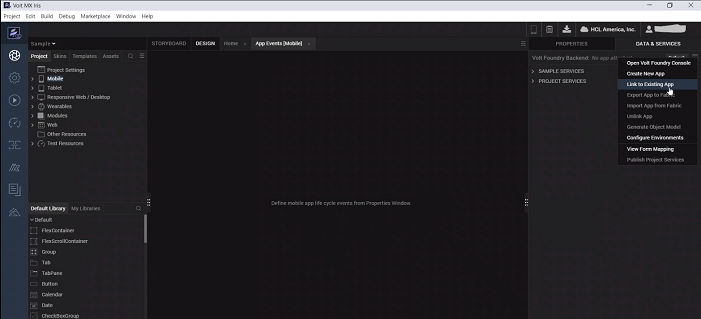

                               

User Guide: [SDKs](../Foundry_SDKs.md) > [VoltMX Iris SDK](Installing_VoltMXJS_SDK.md) > Automatic Event Capture

Initializing the Volt MX JS Client SDK
======================================

The initialization method fetches the Volt MX Foundry configuration and saves it in the cache. The application uses the cached configuration. It is a synchronous call.

You can initialize the Volt MX JS Client SDK in the following ways:

*   [Linking your Foundry application with Volt MX Iris.](#link-foundry-application-with-iris)
*   [Manual initialization through code.](#manual-initialization-through-code)
*   [Manual initialization by using setClientParams.](#manual-initialization-by-using-setclientparams)

> **_Important:_** From Foundry V9 SP1 Fix Pack 9 and above, it is recommended to use only one of the two ways mentioned above to initialize SDK:  
Linking Foundry application with Volt MX Iris  
or  
Manual Initialization through code.  
  
\- SDK initialization is the entry point for using Foundry services in client application thus, initialization should be done prior to invoking any services by using one of the two ways mentioned above. Upgrade scenarios will not get affected and the client application will work seamlessly with the existing code without any changes for SDK initialization  
  
\- For security reasons, if integrity is enabled on the server after building a Iris application and the application is using auto init, then the app needs to be re-built for taking the latest integrity changes.

Link Foundry Application with Volt MX Iris
-----------------------------------------------

To initialize the Volt MX JS Client SDK, link your Volt MX Foundry Application with Volt MX Iris by following these steps.

1.  Open Volt MX Iris Enterprise.
2.  Click **Login** on the upper right corner and sign in to your Volt MX Foundry account.
3.  Go to **Project** menu and click **Settings**.
4.  Under **Project** **Settings**, click **Foundry** tab, select a Could Account and Environment from the **Foundry Details** section, and then click **Done**.
    
    
    
5.  Now, Click on the **DATA & SERVICES** tab (top right), click on More options, and select **Link to Existing App**. The **Foundry Applications** screen appears.
    
    
    
6.  Click **ASSOCIATE** against the Foundry Apps that you want to link to Volt MX Iris.
    
    
    
    > **_Important:_** Note that the default versions of the Foundry app are shown in the below screen-shot and the same is linked for auto init. Please select the version other than default version if you want to have app associated with another Foundry app's version.
    

After you link your Foundry application with Iris, the Volt MX Foundry SDK is initialized automatically when the app starts.

> **_Note:_** <br><br>1.    The initialized SDK is available for use within the application with the variable name **HCLFoundry**.<br/>2.    If the operating system launches an application in the background, the session registers as a Non-Interactive session.<br><br>**For example,**<br><br>i.    On Push Notifications<br/>ii.    Content Provider Calls<br/>iii.    Registering for Geo-location Updates.<br><br>3. If the application launches for interaction, the session registers as an Interactive session.<br><br>**For example,**<br><br>i.    When a user launches the application.<br/>ii.    When another app or component launches the application.  
    
> **_Note:_** When the Iris app is linked with the Foundry app, it fetches the service doc and bundles it with the application. When the Foundry app is re-published and a call is make to the Identity Server, the SDK detects the changes. It replaces the bundled service doc with the new service doc.  
These changes are applied in the next application launch as follows:  
1\. App is launched and initialized with the existing service doc.  
2\. A Login or claims-refresh call is made by the application.  
3\. Application detects the service doc changes and fetches the new service doc in the background. Application will keep on working with the old/existing service doc.  
  
If the application is re-launched, it is be initialized with the updated service doc.  
 
For further details around app versioning, refer to the [Base Camp article: App version support from SDK](https://support.hcltechsw.com/csm?id=kb_article&sysparm_article=KB0083748)

Manual Initialization Through Code
----------------------------------

To initialize the Volt MX JS Client SDK, run the following code:

```
//Sample code to initialize Volt MX Foundry Client

var appkey = "your-app-key";
var appsecret = "your-app-secret";
var serviceUrl = "your-service-url";
var initOptions = 
    {
        "MFAppVersion": "<your-Foundry-app-version>",  //Optional parameter to choose Foundry app version                    
        "vanityUrl" : "<your-Vanity-URL>"};  //Optional parameter to specify Vanity URL
    }

// Get an instance of SDK
var client = new voltmx.sdk();
// initialize SDK
client.init(appkey, appsecret, serviceUrl, function(response)

{    voltmx.print("Init success: " + JSON.stringify(response)); }
, function(error)

{    voltmx.print("Init failed: " + JSON.stringify(error)); }
, initOptions);
```

>**_Note:_** The key "vanityUrl" is case sensitive and value passed to it should be domain name only.

Manual Initialization by using setClientParams
----------------------------------------------

You can also initialize the Volt MX JS Client SDK by using setClient parameters. However, a few data types are not captured in the metrics of the app.

Setting clientParams in the manual init by using setClientParams API allows Volt MX Foundry SDK to send client parameters such as application ID and application name to the parameters set from Volt MX Iris. It also allows these parameters to be consistent across different data collection points such as integration services, application events, and custom metrics.

To initialize the Volt MX JS Client SDK, run the following code:

```
//Sample code to initialize Volt MX Foundry Client manually 
// Get an instance of SDK  
// Assume SDK already initialized
var client = voltmx.sdk.getCurrentInstance();
var clientParams = {};
// appConfig is a global variable that holds the application's configuration.
clientParams.aid = appConfig.appId;
clientParams.aname = appConfig.appName;
client.setClientParams(clientParams);
```

Automatic Event Capture
-----------------------

This feature enables the client application to automatically capture data of the selected events and send it to the server for reporting purpose.

To enable Automatic Event Capture for your Foundry application, follow these steps.

1.  Go to **Project** menu and click **Settings**.
2.  Under **Project Settings**, click the **Metrics APM** tab, select the **Enable automatic event capture** check box.
    
    
    
3.  Now, select the events of which you want to capture the data.
4.  Click **Done** to save your changes.

When an application starts, Volt MX SDK registers a session and sends its information to the Volt MX Foundry Server. If the device is offline, or the server is not reachable, the session’s information persists on the device until it can successfully send the information to the Volt MX Foundry Server.

For more information on application session, refer to [Standard Reports and Dashboard Guide](../../../../Foundry/standard_metrics_reports_guide/Content/VoltMX_Analytics_-_Standard_Reports/Application_activity_Reports.md).

This feature is disabled for the following events:

*   Form Exit
*   Touch or Click
*   Gesture
*   Orientation Change
*   Service Request

For information about how to capture the mentioned events, refer to [APM User Guide](../../../../Foundry/user_journey_app_events_apm/Content/App_Events_and_APM_Guide.md).

Configuring Global Parameters
-----------------------------

The global parameter APIs helps you to set, remove, and edit global header params, query params, and body params in order to send the subsequent SDK network calls.

Enum globalRequestParamType

The globalRequestParamType enum specifies the following param types:

*   headers
*   queryParams
*   bodyParams
    
    > **_Note:_** Global request parameter type `bodyParams` is not supported for Offline Objects, Metrics, Binary and Logger modules for IDE-Android, iOS and Windows platforms.
    

### getGlobalRequestParams

The getGlobalRequestParams method returns the global params of a specific type that have been set.

#### Syntax

```
 getGlobalRequestParams(paramType);
```

#### Parameters

  
| Name | Type | Description |
| --- | --- | --- |
| paramType | globalRequestParamType | The type of the param. |

#### Return Value

This method returns a list of all network params in the following format:

`({<ParamName>, <ParamValue>, <ParamType>},{})`

The param type can be either header, post param, or body.

#### Example

```
// This example returns all global header params.
// Get an instance of SDK  
// Assume SDK already initialized
var client = voltmx.sdk.getCurrentInstance();
client.getGlobalRequestParams(client.globalRequestParamType.headers);
```

### setGlobalRequestParam

The setGlobalRequestParam method adds a param with the specified name, value, and type, to the network calls. If a param with the same name already exists, this API overrides that param. If the same param name is manually added to a network call, the local param will have a higher priority than the global param. After a param is added, it is sent globally to all network calls from licensing and the SDK.

#### Syntax

```
 setGlobalRequestParam(paramName, paramValue, paramType);
```

#### Parameters

| Name | Type | Description |
| --- | --- | --- |
| paramName | String | Name of the parameter |
| paramValue | String | Value of the parameter |
| paramType | globalRequestParamType | The type of the parameter |

#### Example

```
// This example sets a global header with header name testHeader and value testValue.
// Get an instance of SDK
// Assume SDK already initialized  
var client = voltmx.sdk.getCurrentInstance();
client.setGlobalRequestParam("testHeader", "testValue", client.globalRequestParamType.headers);		
```

### removeGlobalRequestParam

The removeGlobalRequestParam method removes the specified param from network calls.

#### Syntax

```
 removeGlobalRequestParam(paramName, paramType);  

```

#### Parameters

  
| Name | Type | Description |
| --- | --- | --- |
| paramName | String | The name of the parameter. |
| paramType | globalRequestParamType | The type of the parameter. |

#### Example

```
// This code example removes the global header with header name testHeader.
// Get an instance of SDK
var client = voltmx.sdk.getCurrentInstance();
client.removeGlobalRequestParam("testHeader", client.globalRequestParamType.headers);		
```

### resetGlobalRequestParams

The resetGlobalRequestParams method resets all the global request params.

#### Syntax

```
 resetGlobalRequestParams()
```

#### Parameters

None

#### Example

```
// This example resets all the global request params
// Get an instance of SDK  
// Assume SDK already initialized
var client = voltmx.sdk.getCurrentInstance();
client.resetGlobalRequestParams();
```
