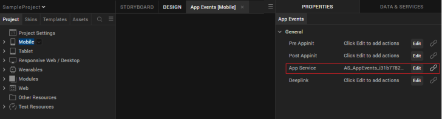
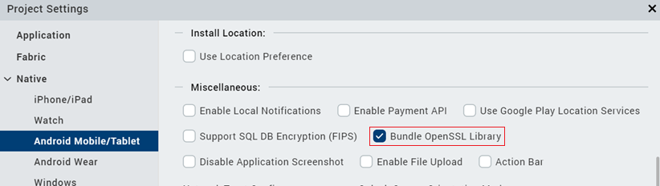
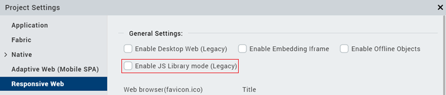
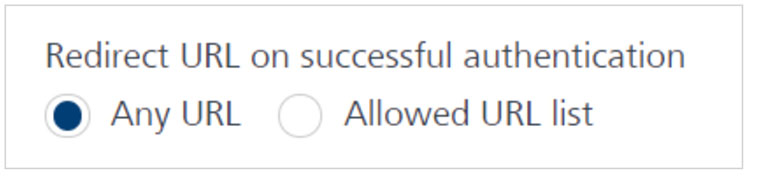
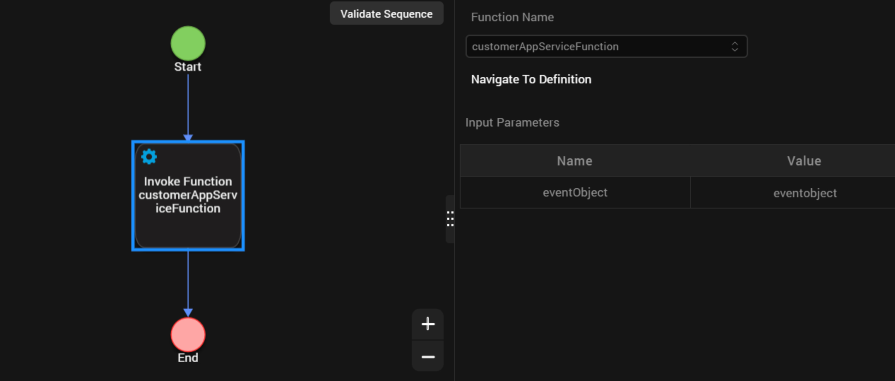
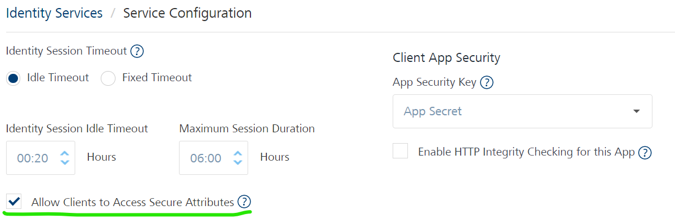

                              

User Guide: [SDKs](../Foundry_SDKs.md) > [VoltMX Iris SDK](Installing_VoltMXJS_SDK.md) > Login with provider type as Basic

Invoking an Identity Service
============================

The following are the methods you can use for an identity service.

*   [Login with provider type as Basic](#login-with-provider-type-as-basic)
*   [Login with provider type as OAuth SAML](#login-with-provider-type-as-oauth-saml)
*   [Login with provider type as OAuth 2.0 with Deep link URL](#login-with-provider-type-as-oauth-with-deep-link-url)
*   [Login in the same browser window with provider type as OAuth 2.0](#login-in-the-same-browser-window-with-provider-type-as-oauth)
*   [Get Backend Token](#get-backend-token)
*   [User Profile](#user-profile)
*   [Get Provider Name](#get-provider-name)
*   [Get Provider Type](#get-provider-type)
*   [Use Persisted Login](#use-persisted-login)
*   [Logout](#logout)
*   [Refresh Login](#refresh-login)

Login with provider type as Basic
---------------------------------

```
// Sample code to authenticate to Volt MX Foundry client			

var serviceName = "identity_service_name";   
// Get an instance of SDK
var client = voltmx.sdk.getCurrentInstance();
var identitySvc = client.getIdentityService(serviceName);
var options = {};
options["userid"] = "userid";
options["password"] = "password"; // Optional values for login
options["loginOptions"]["include_profile"] = false;
options["loginOptions"]["isSSOEnabled"] = false;
options["loginOptions"]["continueOnRefreshError"] = false; //Throws error if previous IdentitySession has expired
options["loginOptions"]["persistLoginResponse"] = false;
options["loginOptions"]["isOfflineEnabled"] = false;
identitySvc.login(options, function(response) {
    voltmx.print("Login Success: " + JSON.stringify(response));
}, function(error) {
    voltmx.print("Login Failure: " + JSON.stringify(error));
});
```

**Please note the following:**

> * The **isSSOEnabled** flag set to true, indicating that Single Sign-On ](SSO) is enabled. This parameter must be passed every time the user logs in. The parameters **userid** and **password** are required only for the first login. For more information about SSO, refer to [Single Sign-On](../single_Sign-On.md).

| Supported Platforms for SSO ||
| --- | --- |
| Platform | SDK Version |
| Android | 7.3 and higher versions |
| iOS | 7.3 and higher versions |
| Web | V8 SP4 and higher versions |
    
   Support for Multi-Login with SSO is available from V8 SP4 and higher versions.
    
> * The earlier code sample provides the following information:
> *    The **include\_profile** parameter is set to true. This parameter specifies whether to encode the user profile as part of the claims token.
> * The **continueOnRefreshError** flag is set to false. The default value is **true**. If the **continueOnRefreshError** is set to **false** and the previous identity provider session has expired, error 1017 is thrown. The error message is "Transient Login failed. Previous Identity Token expired in backend."
> * From version 7.2.5 onward Volt MX Foundry apps allow users to use services protected by different Identity services in the same application session as long as users have authenticated to the Identity service. This allows a user to login to Google and Facebook, for example, via identity services and use integration services dependent on those identity services in the same application session, without having to logout of either.
> *The **isOfflineEnabled** flag is set to true.The default value is false. This option allows users to use previous login information when they are in offline mode. Typically the login details are lost when the app is in offline mode. This option stores the user ID and password to be used if authentication is needed when there is no network connection.
> * To use the **isOfflineEnabled** option, you must enable the "Bundle OpenSSL Library" option in Project Settings. For information about this setting see [Additional Settings](#additional-settings). 
> * This option is valid for iOS and Android platforms only.
> * This option is available for basic login only. It is not available for OAuth/SAML login.
> *  The **persistLoginResponse** flag is set to true. The default value is false. This option allows users to login to an app once and reuse the response across multiple app sessions. Typically the login details are lost when the app is closed. The **persistLoginResponse** option stores the claims token in the data store of the client device. This allows the app developer to use the token to invoke the integration or object services without prompting the user to authenticate again. If the token has expired, the login will fail.
> * To use this option, the Volt MX Foundry server must be configured so that the Identity session is enabled for the entire time the persisted response is needed. For more information about configuration settings see [How to Configure App Session Settings](../ServiceConfig-Identiy-Apps.md#how-to-configure-app-session-settings).
> * In the Android platform, you must also enable the "Bundle OpenSSL Library" option in Project Settings. For information about this setting see [Additional Settings](#additional-settings).
> * To retrieve the claims token from the data store, use the [usePersistedLogin() API](#use-persisted-login).m


> **_Note:_** Please add the same identity provider name that you configured in Foundry's Identity Service tab against providerName. For example, here the identity provider name is `SampleUserStore`.<br>  


### Additional Settings

To use the **isOfflineEnabled** and **persistLoginResponse** options in the Androd platform, you must ensure that the "Bundle Open SSL Library" option is enabled in the Volt MX Iris Project Settings. To do this, perform the following steps.

1.  On the File menu, click **Settings** to open the Project Settings dialog box.
2.  Click the **Native** tab.
3.  Click the**Android** sub-tab.
4.  Check the option for "Bundle OpenSSL Library".

The page will look like the following example.


Login with provider type as OAuth SAML
--------------------------------------

```
// Sample code to authenticate to Volt MX Foundry Client
var serviceName = "identity_service_name";   
// Get an instance of SDK
var client = voltmx.sdk.getCurrentInstance();
var identitySvc = client.getIdentityService(serviceName);
var options = {};
options.include_profile = true;  
//browserWidget is mandatory if using the MVC Architecture  
options.browserWidget = myForm.myBrowserWidget;   
var loginOptions = {};
loginOptions.isSSOEnabled = true;
loginOptions.continueOnRefreshError = false;
loginOptions.persistLoginResponse = true;
options.customOAuthParams =
{
	"key2":"value2",
	"key3":"value3"
};
options.loginOptions = loginOptions;
identitySvc.login(options, function(response) {
    voltmx.print("Login success: " + JSON.stringify(response));
}, function(error) {
    voltmx.print("Login failure: " + JSON.stringify(error));
});
```

> **Note:**   

> *  The client is the **voltmx.sdk();** object.
> *   The earlier code provides the following information:
> *  The **isSSOEnabled** flag set to true, indicating that Single Sign-On (SSO) is enabled. This parameter must be passed every time the user logs in. For more information about SSO, refer to [Single Sign-On.](../single_Sign-On.md)
> *   The **include\_profile** parameter set to **true**. This parameter specifies whether to encode the user profile as part of the claims token.
> *   The **continueOnRefreshError** flag set to **false**. The default value is **true**. This flag throws error 1017 with error message "Transient Login failed, Previous Identity Token expired in backend". This error is thrown when the **continueOnRefreshError** is set to **false** and the previous identity provider session has expired.
<br><br>From version 7.2.5 onward Volt MX Foundry apps allow users to use services protected by different Identity services in the same application session as long as users have authenticated to the Identity service. This allows a user to login to Google and Facebook, for example, via identity services and use integration services dependent on those identity services in the same application session, without having to logout of either.</br></br>

> *  The **persistLoginResponse** flag is set to true. The default value is false. This option allows users to login to an app once and reuse the response across multiple app sessions. Typically the login details are lost when the app is closed. The **persistLoginResponse** option stores the claims token in the data store of the client device. This allows the app developer to use the token to invoke the integration or object services without prompting the user to authenticate again. If the token has expired, the login will fail.
> *  When SSO is enabled, log out with SLO = true does not log out the OAuth provider.
<br>To use this option, the Volt MX Foundry server must be configured so that the Identity session is enabled for the entire time the persisted response is needed. For more information about configuration settings see <a href="../ServiceConfig-Identiy-Apps.html#how-to-configure-app-session-settings">How to Configure App Session Settings</a>.</br>
<br>For the Android platform, you must also enable the "Bundle OpenSSL Library" option in Project Settings. For information about this setting see [Additional Settings](#additional-settings).</br>

> *  To retrieve the claims token from the data store, use the [usePersistedLogin() API](#use-persisted-login).
<br>From version 7.2.02 onward Volt MX Foundry SDK provides an option to customize the OAuth login form using a user-defined form with a browser widget inside it. The browserWidget parameter accepts a voltmx.ui.Browser instance. The SDK will run oAuth related logic on the provided browserWidget instance. This parameter enables a developer to provide a customized oAuth UI. If the provided value is not defined or if it is not an instance of the voltmx.ui.browserWidget, the SDK will create its own browser window with default configuration/customization for oAuth Login.</br>

> * The browserWidget field is mandatory for Volt MX Applications built by using the MVC architecture on Volt MX Iris.

Login with provider type as OAuth  with Deep link URL
--------------------------------------------------------

```
// Sample code to authenticate to Volt MX Foundry Client

var serviceName = "identity_service_name";   
// Get an instance of SDK
var client = voltmx.sdk.getCurrentInstance();
var identitySvc = client.getIdentityService(serviceName);
var username = "username_for_identity_service";
var password = "password_for_identity_service";
var options = {};
options["userid"] = username;
options["password"] = password;
options["UseDeviceBrowser"] = true;
options["customOAuthParams"] =
{
	"key2":"value2",
	"key3":"value3"
};
// This parameter in options will open the login url in native browser. 
// This is a deeplink url, where the control will be redirected after login.
//#ifdef android    
options.success_url = "Deep link url registered for android";
//#else    
options.success_url = "Deep link url registered for rest";
//#endif
identitySvc.login(options, function(response) {
    voltmx.print("Login success: " + JSON.stringify(response));
}, function(error) {
    voltmx.print("Login failure: " + JSON.stringify(error));
});
```

The sample above shows various parameters similar to the parameters of the [Login with provider type as OAuth/SAML](#login-with-provider-type-as-oauth-saml). The following two optional parameters are added further.

*   **UseDeviceBrowser**: This parameter opens the login URL in the native internet browser of the device.
*   **success\_url**: After the log in is successful, control is redirected to the URL (deep link URL).

Deep link URL is the URL that is registered to the application. After redirection, the client calls the method **handleDeeplinkCallback**. (A global function)

**Method signature**: `function handleDeeplinkCallback(query params)`

```
// Sample code to call handleDeeplinkCallback after the deeplink redirection is done. 
// This method will be called after the deeplink redirection. 
//Need to register a call in the App services tab in App Events.

```
 


```
function appservicereq(params) {
    handleDeeplinkCallback(params); // Required validations are done and proceed with rest of login flow.                                }

```


For more information on deep links, click [here](../../../../Iris/iris_user_guide/Content/Introduction.md).

> **_Note:_**

> * The client is the **voltmx.sdk();** object.
The earlier code sample provides the following information:
> * The **isSSOEnabled** flag set to true, indicating that Single Sign-On (SSO) is enabled. This parameter must be passed every time the user logs in. For more information about SSO, refer to [Single Sign-On](../single_Sign-On.md).
> * The **include\_profile** parameter set to **true**. This parameter specifies whether to encode the user profile as part of the claims token.
> * The **continueOnRefreshError** flag set to **false**. The default value is **true**. This flag throws error 1017 with error message "Transient Login failed, Previous Identity Token expired in backend". This error is thrown when the **continueOnRefreshError** is set to **false** and the previous identity provider session has expired.
<br><br>From version 7.2.5 onward Volt MX Foundry apps allow users to use services protected by different Identity services in the same application session as long as users have authenticated to the Identity service. This allows a user to login to Google and Facebook, for example, via identity services and use integration services dependent on those identity services in the same application session, without having to logout of either.</br></br>

> * The **persistLoginResponse** flag is set to true. The default value is false. This option allows users to login to an app once and reuse the response across multiple app sessions. Typically the login details are lost when the app is closed.The **persistLoginResponse** option stores the claims token in the data store of the client device. This allows the app developer to use the token to invoke the integration or object services without prompting the user to authenticate again. If the token has expired, the login will fail.
> *  When SSO is enabled, logging out with SLO = true does not log out the OAuth provider.   
> * The Deeplink API helps the device browser to authenticate the OAuth This can be used for any OAuth2.0 providers. If an OAuth provider does not allow embedded browsers, such as Google OAuth, you must use the Deeplink API, which launches the device browser instead of the embedded browser.
<br><br>To use this option, the Volt MX Foundry server must be configured so that the Identity session is enabled for the entire time the persisted response is needed. For more information about configuration settings see <a href="../ServiceConfig-Identiy-Apps.html#how-to-configure-app-session-settings">How to Configure App Session Settings</a><br/>
<br>For the Android platform, you must also enable the "Bundle OpenSSL Library" option in Project Settings. For information about this setting see [Additional Settings](#additional-settings).<br/>

> * To retrieve the claims token from the data store, use the [usePersistedLogin() API](#use-persisted-login).
<br> From version 7.2.02 onward Volt MX Foundry SDK provides an option to customize the OAuth login form using a user-defined form with a browser widget inside it. The browserWidget parameter accepts a voltmx.ui.Browser instance. The SDK will run oAuth related logic on the provided browserWidget instance. This parameter enables a developer to provide a customized oAuth UI. If the provided value is not defined or if it is not an instance of the voltmx.ui.browserWidget, the SDK will create its own browser window with default configuration/customization for oAuth Login.</br>

### Additional Settings

From V9 ServicePack 2, Foundry supports [rfc7636](https://datatracker.ietf.org/doc.md/rfc7636) for OAuth providers that use PKCE in the Authorization Code grant flow. For more information, refer to [PKCE Support in Foundry](../Identity10_VoltMX_OAuth2.md#pkce-support-in-foundry).

**Android**

To use the PKCE feature in your Android platform, ensure that the **Bundle Open SSL Library** option is enabled in the Iris Project Settings. To enable the option, follow these steps.

1.  From the left-navigation bar of Iris, select Project Settings.  
    The [Project Settings](../../../../Iris/iris_user_guide/Content/Project_Properties_in_VoltMX_Iris.md) window opens.
2.  From the left-panel, expand **Native**, and then select **Android Mobile/Tablet**.
3.  Under **Miscellaneous**, select **Bundle OpenSSL Library**.



**Responsive Web**

For projects that are upgraded from earlier versions of Iris to V9 ServicePack 2, to use the PKCE feature for the Responsive Web platform, ensure that the **JS Library Mode (Legacy)** option is disabled in the Iris Project Settings. To disable the option, follow these steps.

1.  From the left-navigation bar of Iris, select Project Settings.  
    The [Project Settings](../../../../Iris/iris_user_guide/Content/Project_Properties_in_VoltMX_Iris.md) window opens.
2.  From the left-panel, select **Responsive Web**.
3.  Under **General Settings**, clear **JS Library Mode (Legacy)**.




Login in the same browser window with provider type as OAuth 
-------------------------------------------------------------

In the existing design of OAuth login in Volt MX, the login page of an OAuth Identity provider (such as Keycloak, Google, or Okta) opens in a new window (or a new tab) on the browser. The new design implements login in the same browser window.

As the existing design does not contain any full app redirection, the SDK and Client app states do not need to be reinitialized. However, Volt MX uses an SPA architecture for web apps. Therefore, in the new design, the Foundry SDK object and the client app state are reinitialized when the browser redirects to the app from the login page in the same window. To avoid losing the app state and data, make sure that you store the client app data (if any) to the local storage before invoking the Login API.

Prerequisites
--------------
* Iris V9 SP2 FP21, or later
* Foundry V9 SP2 FP1 HF4 (9.2.1.4), or later

> **_Note:_** If you are using versions earlier than V9 SP2, download and install version 9.2.1.x from the Volt MX Downloads page. After installing the 9.2.1.x version, install the 9.2.1.4 hotfix for the Integration Server by following the steps in the Integration Services Hotfix 9.2.1.4 release notes.

Follow these steps before you consume the enhancement

1. If you are using Volt MX Foundry 9.1, make sure that you upgrade to Volt MX Foundry 9.2.1.4.

2. Implement the OAuth Login functionality based on the existing design, where the login page opens in a new window (new tab), and then redirects to the original window of the web app.

3. Use the existing framework APIs to store the client app data before you invoke the login API.

4. After a successful login, call the framework APIs to retrieve the client app data before proceeding with the app functionality.

Steps to implement login in the same browser window

<ol>

<li>Invoking the Login SDK function</li>
</ol> 


 In the client code that invokes the login API, include "noPopup": true as part of the login options.

For Example:


```
var sdkObject = Volt MX.sdk.getDefaultInstance();
var identityServiceObject = sdkObject.getIdentityService("<providerNameOauth>");
var options = {};
options["loginOptions"] = {}; 
options["loginOptions"]["noPopup"] = true; 
options["loginOptions"]["customQueryParamsForOAuth"] = {"success_url": "<app-url>"}; /* For example -> http://example.com/apps/appName// */options["customOAuthParams"] =
{ 
"key2":"value2",
	"key3":"value3"
};
identityServiceObject.login(options, function (res) { 
alert("login passed without redirection"); 
}, function (err) { 
alert("login failed due to" + JSON.stringify(err)); 
});

```


Ideally, you must save the app data or app state before calling the login API. However, if you need to save some data during the login invocation, you can add your save handle function in the options of the login API.

For example:


```
options["loginOptions"]["customDataSaveHandle"] = function(successCallback,failureCallback)
{
/* Perform a task
successCallback(); //Call successCallback if the task is completed successfully
failureCallback(); //Call failureCallback  if you want to abort the login as you were not able to save custom data or state */
}

```

> **_Note:_**  

> * In the login options, you must pass the Success URL parameter (which is the web
    app URL) as part of the "customQueryParamsForOAuth" key.
> * In the Identity console, under Advanced → Redirect URL on successful
    authentication
> * If you have selected Allowed URL list, make sure that the specified Success URL
    is whitelisted.
> * If you have selected Any URL, you do not need to whitelist any URLs.





<dl>
  <dt>2. Configuring an App Service event in the App Lifecycle in the Iris project</dt>
</dl>

In your Iris project, in the App Events section, select the App Service and then attach a function, for example: CustomerAppServiceFunction.





   Make sure that you define the specified function (CustomerAppServiceFunction) in a JS Module.

For example:

```
function customerAppServiceFunction(eventObject)
{
var loginResponse = eventObject.loginResponse;
if (loginResponse)
{
	if (loginResponse.isError == false)
	{
	  //login complete, can return next form
	  return FormAccountDetails;
	}
	else
	{
	  //login failed, can return error/retry form
	  return FormError;
	}
}
}

```

> **_Note:_** 

> * After a successful login, you can restore the state or data in the lifecycle events (such preshow or postShow) of the respective form.
> * After a successful login, make sure that you always use Volt MX.sdk.getDefaultInstance() as the sdk instance. This must be used to fetch instances such as Integration service instance and Object service instance.
 
Known Issues and Limitations
-----------------------------

* To test the OAuth login flow in same browser window, you must publish the web app to a Foundry server, and then run tests on the published web app URL.

* This feature cannot be tested on Iris Live Preview.

* This feature is not supported if your app has http integrity enabled.

* Manual initialization of the SDK is not supported for this feature. Therefore, make sure that the Iris app is linked to the Foundry app before building or generating a live preview.

* Login must be completed after all the lifecycle events of the Iris app have been invoked.

* Transient login (multi-login) is not supported in this feature.


Get Backend Token
-----------------

> **_Important:_** The Get Backend Token API is deprecated.

```
// Sample code to get backend token for provider
var serviceName = "identity_service_name";
// Get an instance of SDK
var client = voltmx.sdk.getCurrentInstance();
var identitySvc = client.getIdentityService(serviceName);
var options = {
    "requestParams": {
        "refresh": "true"
    }
};
var forceFromServer = false;
identitySvc.getBackendToken(forceFromServer, options, function(response) {
    voltmx.print("Backend token is: " + JSON.stringify(response));
}, function(error) {
    voltmx.print("Failed to get backend token: " + JSON.stringify(error));
});
```

> **_Note:_**

> * If forceFromServer is true, then the SDK fetches the token from the server. If forceFromServer is false, then the SDK gives you the token present in localStorage. Please note that only few backend providers such as Salesforce support refresh. If a backend provider does not support refresh, passing `forceRefreshFromServer=true` would result in empty response from this api.
> * The authClient is the IdentityService object.
> * The “Allow Clients to Access Secure Attributes” should be marked as true for working of this API.


  

For more information on how to configure session timeouts, refer to [How to Configure App Session Settings](../ServiceConfig-Identiy-Apps.md#how-to-configure-app-session-settings).

### getSecurityAttributes (new API)

This API can retrieve backend identity response.

```
/*sample snippet for invoking getSecurityAttributes API*/

var sdkObject = voltmx.sdk.getCurrentInstance();
var identityObject = sdkObject.getIdentityService("<<Identity-Provider-Name>>");
identityObject.getSecurityAttributes(function (response) {
   alert('Attributes - '+JSON.stringify(response));
}, function (error_response) {
   alert('failed to fetch attributes due to' + JSON.stringify(error_response));
});
```

User Profile
------------

```
//Sample code to get user profile details
var serviceName = "identity_service_name";   
// Get an instance of SDK
var client = voltmx.sdk.getCurrentInstance();
var identitySvc = client.getIdentityService(serviceName);
var forceFromServer = false;
identitySvc.getProfile(forceFromServer, function(response) {
    voltmx.print("User profile is: " + JSON.stringify(response));
}, function(error) {
    voltmx.print("Failed to fetch profile: " + JSON.stringify(error));
});
```

> **_Note:_** 

> * If forceFromServer is true, then the SDK fetches the token from the server. If forceFromServer is false, then the SDK gives you the token present in localStorage.
> * The authClient is the IdentityService object.

Get Provider Name
-----------------

```
//Sample code to get provider name
var providerName = authClient.getProviderName();
```

> **_Note:_** The authClient is the IdentityService object.

Get Provider Type
-----------------

```
// Sample code to get provider name
var serviceName = "identity_service_name"; 
// Get an instance of SDK
var client = voltmx.sdk.getCurrentInstance();
var identitySvc = client.getIdentityService(serviceName);
var providerName = identitySvc.getProviderName();
```

> **_Note:_** The authClient is the IdentityService object.

Use Persisted Login
-------------------

When the login option (persistLoginResponse) is set as true, the auth response is stored in the datastore of the client device. You can invoke the **usePersistedLogin** API to check if the login response was stored.

If the API returns true, you can use the services authorized by that login without having to sign in again.

If the API returns false, you need to get authorized again. The persisted response is cleared only when you sign out.

**Return Type**: Boolean

```
// Sample code to retrieve the claims token from the data store.
var serviceName = "identity_service_name";
// Get an instance of SDK
var client = voltmx.sdk.getCurrentInstance();
var identitySvc = client.getIdentityService(serviceName);
var isLoginPersisted = identitySvc.usePersistedLogin();
```

Logout
------

```
// Sample code to logout from auth service
var serviceName = "identity_service_name";
// Get an instance of SDK
var client = voltmx.sdk.getCurrentInstance();
var identitySvc = client.getIdentityService(serviceName);
var options = {};
options["slo"] = true;
options["browserWidget"] = myForm.browserWidget;
options["logoutOptions"]["customOAuthParams"] =
{
	"key2":"value2",
	"key3":"value3"
};
identitySvc.logout(function(response) {
    voltmx.print("Logout success: " + JSON.stringify(response));
}, function(error) {
    voltmx.print("Logout failure: " + JSON.stringify(error));
}, options);
```

> **_Note:_**

> * The authClient is the IdentityService object for the loggedIn provider.
> * To log out from all applications, the user must log out of every Identity service that they are logged on to.
> * The code sample shows the parameter **slo** set to **true**, indicating that all apps will be logged out when SSO is enabled.
> * If **slo** is set to **false**, or if the app does not send **slo**, the user is logged out of the app. The user is not logged out of the other apps that are logged in using SSO.
> * Any apps that use SSO based services must log in by entering credentials and re-initiating SSO.For more information, refer to [Single Sign-On](../single_Sign-On.md).

Refresh Login
-------------

Refresh login API refreshes the identity session (enabled for refresh) with backend auth server to give new internal auth tokens that are mapped with refreshed backend tokens.

### Input

*   successcallback : Function
*   failureCallback : Function
*   options: JSON

> **_Note:_** 

> * From V9 ServicePack 1 FixPack 30 and V9 ServicePack 2 FixPack 15, the refreshLogin API contains an optional input parameter called options. The options parameter contains a retain_backend_refresh_token flag.
> * The default value of the retain_backend_refresh_token flag is false. If the flag is set to true, the refresh tokens are not deleted irrespective of the backend response code.
> * If the retain_backend_refresh_token flag is not specified or set to false, and the backend sends the error code 400 or 401, the refresh tokens are deleted.
> * For error response codes other than 400 and 401, the refresh tokens are not deleted irrespective of the flag value; and the back-end response is not modified based on the flag setup.


```
// Sample code to invoke refresh login
var sdkObject = Volt MX.sdk.getCurrentInstance();
var identityObject = sdkObject.getIdentityService("<<Identity-Provider-Name>>");
var options = {};
options["retain_backend_refresh_token"] = true;
options["customOAuthParams"] =
{
	"key2":"value2",
	"key3":"value3"
};
identityObject.refreshLogin(function(res) {
    alert('refresh login success');
}, function(err) {
    alert('refresh login failed' + JSON.stringify(err));
}, options );

```

> **_Note:_** <br>This Refresh Login API will not work until login is done on same identity provider with refresh enabled mode.</br>
<br>The API is supported from App Services version 9.1.0.3 or higher.</br>
<br>The API is not supported from On-premies V9.1 hotfix onwards</br>

An error information will be shown in following cases:

*   When refreshLogin is invoked without performing login with loginOptions containing the `enable_refresh_login` key equals to true, following error will be shown.
```
/*sample code for performing login with refresh enabled options to enable working of refreshLogin API*/
var sdkObject = Volt MX.sdk.getCurrentInstance();
var identityObject = sdkObject.getIdentityService("<<Identity-Provider-Name>>");
var options = {
    "loginOptions":
        {
            "enable_refresh_login": true
        }
};

identityObject.login(options, function (response) {
    alert('login success');
}, function (error_response) {
    alert('login failed due to' + JSON.stringify(error_response));
});

```
*   If Refresh login (offline\_access scope) is not supported on backend identity provider, the error response contains the following key values:
    *   errcode : 108
        
    *   errmsg : "Required refresh tokens to enable refresh login are null or undefined"
        
*   If the **Enable Refresh Login** check box was not set to true (not selected) in Foundry console, the error response contains the following key values:
    
    *   errcode : 108
        
    *   errmsg : "Required refresh tokens to enable refresh login are null or undefined"
	
<!-- trivial change -->
