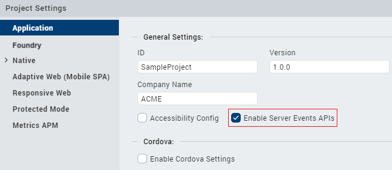

Server Event APIs
=================

>  **_Important:_**
    To use the following APIs, you must use version V9SP3 (or later) for both Iris and Foundry. Only one connection per application and one callback for event notification is allowed. Server Events are only supported for on-premise instances of Foundry.  


Server Events is a capability of the Volt MX Foundry run-time server that lets the back-end services generate and subscribe to events. Server Events help you to generate events asynchronously such as processing a submitted order and invoking a time-taking activity where the client app does not need to wait for the response.For example, processing a submitted order or invoking an activity that takes a long time.

>  **_Note:_**    
    The Server Events APIs are supported in Android, iOS, and SPA/DW platforms. Only one connection per application and one callback for event notification is allowed. Server Events are only supported for on-premise instances of Foundry.  


Prerequisites
--------------

Enable the Server Event APIs on Iris. To enable the APIs, follow these steps:

1.  From the left navigation bar of Iris, select **Project Settings**.
2.  On the **Project Settings** window, in the **Application** section, select **Enable Server Events APIs**.



The following global callbacks are mandatory in the `setServerEventsCallbacks` API:

*   onEventCallback
*   onFailureCallback


setServerEventsCallbacks API
----------------------------

The `setServerEventsCallbacks` API sets the common callback for the Server Events API. The common callbacks are onEventCallback, onFailureCallback, and onCloseCallback.

> **_Important:_** Make sure this API is called once per application life cycle as the callbacks are common, and re-assigning can override the existing defined callbacks. Even if the connection is closed, the callbacks remain in the assigned application life cycle.

### Syntax

```
VMXFoundry.setServerEventsCallbacks(options);
```

### Parameters  

<table>
<tr>
<th>Parameter</th>
<th>Type</th>
<th>Description</th>
</tr>    
<tr>
<td>setupOptions</td>
<td>JSON</td>
<td>
<p>This parameter contains the following options:</p>
<ul>
<li><b>onEventCallback</b> (Mandatory): Invoked when the server returns the response for a triggered event and whenever the connection is established for the first time, that is onOpen.</li>       
<li><b>onFailureCallback</b> (Mandatory): Invoked when the server returns an error response.</li>       
<li><b>onCloseCallback</b> (Optional): Invoked when the WebSocket connection is closed.</li>
</ul>
</td>
</tr>
</table>


### Sample Code

```
setupOptions =
{
	"onEventCallback": function(message)
	{
		//Handle the server event notification
	},

	"onFailureCallback": function(error)
	{
		//Handle the error that occurred
	},

	"onCloseCallback": function(message)
	{
		//Handle the closure of the connection
	}
};
VMXFoundry.setServerEventsCallbacks(setupOptions);
```


subscribeServerEvents API
-------------------------

The **subscribeServerEvents** API opens a connection and sends a subscription message for the topics you have provided. After subscribing, the application starts receiving the ServerEvents messages for the subscribed topics.

> **_Important:_**  
Make sure that you subscribe to the topics by using this API when an app is launched because there is no support to reconnect to a topic if a connection fails or if the app crashes. For more information, refer to [Limitations](#limitations).

### Syntax

```
VMXFoundry.subscribeServerEvents(topicsToSubscribe, subscribeOptions);
```

### Parameters

  
| Parameter | Type | Description |
| --- | --- | --- |
| topicsToSubscribe | String | Specifies the events to be subscribed. |
| subscribeOptions | JSON | It determines the success and failure of the subscription. This parameter must contain the following functions: **onEventCallback**: If there is a reply from the server, the onEventCallback function is invoked. **onFailureCallback**: If the subscription fails, the onFailureCallback function is invoked. |

### Sample Code

```
var eventsToSubscribe = ["service1/operation1", "service1/operation2", "service2/operation1"];

subscribeOptions = {

    "onEventCallback": function(message) {

        //Handle the server event notification

    },

    "onFailureCallback": function(error) {

        //Handle the subscription failure, majorly due to websocket failure.

    }

};

VMXFoundry.subscribeServerEvents(eventsToSubscribe, subscribeOptions);
```

unsubscribeServerEvents API
---------------------------

The **unsubscribeServerEvents** API is used to unsubscribe the ServerEvents' messages for the topics you have provided.

> **_Note:_**  If you unsubscribe from all the topics, make sure that you close the existing connection by using the [closeConnection](#closeConnection) option.

### Syntax

```
VMXFoundry.unsubscribeServerEvents(topicsToUnsubscribe, unsubscribeOptions);
```

### Parameters

  
| Parameter | Type | Description |
| --- | --- | --- |
| topicsToUnsubscribe | String | Specifies the events to be unsubscribed. |
| UnsubscribeOptions | JSON | This parameter must contain the following functions: **closeConnection**: If you want to close the existing connection, closeConnection must be set to **true**. **onCloseCallback**: This function is invoked when the closeConnection function is set to true and the websocket is closed successfully. |

### Sample Code

```
var eventsToUnsubscribe = ["service1/operation1", "service1/operation2", "service2/operation1"];

unsubscribeOptions = {

    "closeConnection": true, //pass this value as true if you want to close the existing connection.

    "onCloseCallback": function(error) {

        //callback will be invoked if closeConnection is set to true and websocket connection is closed successfully.

    }

};

VMXFoundry.unSubscribeServerEvents(eventsToUnsubscribe, unsubscribeOptions);
```

Reference: Response Codes
--------------------------

|Response Code|Response|
|-------------|--------|
|6201|Subscribe Success|
|6202|Subscribe Error|
|6203|Subscribe Partial Success|
|6207|Unsubscribe Success|
|6208|Unsubscribe Error|
|6209|Unsubscribe Partial Success|
|6210|On Event|
|7200|On Open|
|7201|On Error|
|7202|On Close|


Notes and Expected Behaviors:
-------------------------------

*   **SSL pinning Support for Server Events:**

    From the V9 ServicePack 5 release, SSL Pinning is supported for the Android and iOS channels.

    For more information about SSL Pinning, refer to the following documents:

    *   [Apply Application Security](../../../../Iris/iris_user_guide/Content/ApplicationSecurity.md)
    *   [Certificate Pinning](../../../../Iris/iris_user_guide/Content/Certificate_Pinning.md)
    *   [Public Key Pinning](../../../../Iris/iris_user_guide/Content/Public_Key_Pinning.md)

*   **Background behaviors:**

    *   Android: WebSocket connection is active max for 5 mins or until the OS does not kill the connection/app in the background.

        To enable usage of WebSocket in the background, use Foreground Service and Location services with background location services enabled (Location Always) to keep the app active in the background.
    
    *   iOS: WebSocket connection is active max for 5 mins or until the OS does not kill the connection/app in the background.

        To enable usage of WebSocket in the background, use Background Mode with Location service which will further increase the background time for the WebSocket connection for 10 mins.


    > **_Note:_**  The WebSocket connection gets paused whenever the application is sent to the background, this is due to iOS OS limitation. After the app comes to foreground and if the app is not killed by the OS, relevant data would be received by the application      


*   **Network failures: When network connectivity goes OFF and WebSocket is still running.**

    |Platforms|Android|iOS|Chrome|Firefox|Safari|Edge|IE|
    |-|-|-|-|-|-|-|-|
    |Expected Behaviors|Failure callback followed by Close callback.|Failure callback.|Failure callback.|Failure callback followed by Close callback.|Failure callback followed by Close callback.|Failure callback.|Failure callback followed by Close callback.|


Frequently Asked Questions
--------------------------

*   Can I subscribe to a topic more than once?
    
    Yes, you can subscribe to events for a topic multiple times. The events will be notified each time an application has subscribed to that topic.
    
*   Can I unsubscribe to a partial list of topics?
    
    Yes, you can unsubscribe to a partial list of topics.
    
*   Can I use different callbacks for every subscription?
    
    Currently, the API maintains only one callback and the events for all topics will be notified through the same callback. When a different callback is passed with another subscription, all the events will start invoking the latest callback provided in the subscription.
    

Limitations
-----------

*   There is no support to reconnect to a topic if a connection fails or if the client app crashes. Therefore, the app will not receive notifications when an event is invoked.  
    
    If the connection fails or if the app crashes, you need to use the [subscribeServerEvents API](#subscribeserverevents-api) to subscribe to the topics. Make sure that you call the API when the app is launched.
