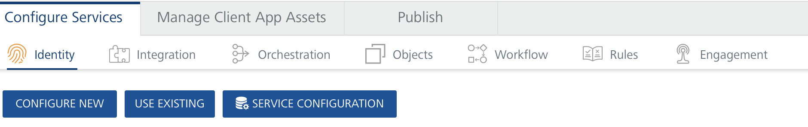
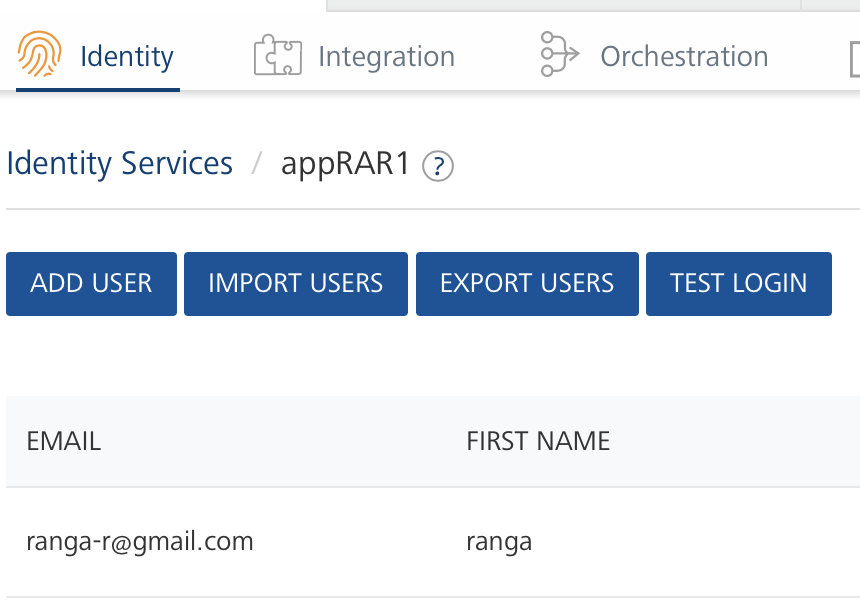
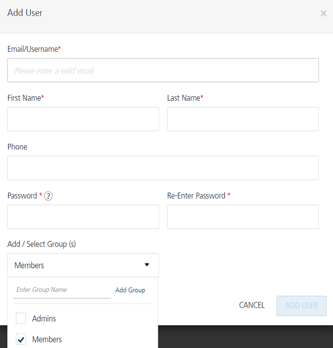
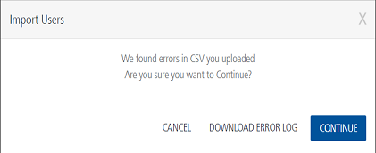

                               

   

Volt MX  User Repository (User Store) Identity Service (Support is deprecated from V8 SP4 AprilFP onwards)
---------------------------------------------------------------------------------------------------------

Volt MX  Foundry allows you to use the built-in **VoltMX User Repository** (User Store) identity service to authenticate your apps. It provides a compact but robust authentication solution for all users that are part of the service. Typically, you can create log-in credentials for app users, so that the service restricts the number of users accessing the application. `Admins` and `Members` are the default groups available in the Volt MX User Repository.A user must be part of a group. By default, all users are associated to the **Members** group.

> **_Note:_** Support for Volt MX User Repository Identity Service is deprecated from V8 SP4 AprilFP onwards.

The **VoltMX User Repository** identity service is available in every Volt MX Foundry account by default. You are allocated only a single instance of the Volt MX User Repository identity service for a single Volt MX Foundry account. Users from the Volt MX User Repository identity service can access all the apps associated with it in the same account.

*   For example, if your goal is to enable authentication your app with all the users from the account, you can use the **VoltMX User Repository** service to achieve the goal. When the service is enabled for authentication of an app, all the users from the service are authorized to access the app.

> **_Important:_** With the **enhanced User Repository** identity service type, you can create multiple instances in the same account. You can create custom set of users in an instance of the enhanced **User Repository** type and use them for authentication of apps. For more details, refer [User Repository Identity Service](UserRepositoryIdentityService.md).

The following flow diagram explains the usage of **built-in Volt MX User Repository** authentication in Volt MX Foundry.

Steps to enable a user to access your application include:

*   [Enabling Volt MX User Repository for Your Application](#Enabling_User_Store_Service_for_Your_Application).
*   [Adding a User to the Volt MX User Repository](#adding-a-user-to-volt-mx-user-repository)
*   [Importing Users to the Volt MX User Repository](#importing-users-to-volt-mx-user-repository)
    *   [Editing a User](#editing-a-user)
    *   [Deleting a User](#deleting-a-user)

### Enabling Volt MX User Repository Identity Service for Your Application

To link the Volt MX User Repository with your Volt MX Foundry app, follow these step:

1.  In Volt MX Foundry Console, from the left pane, click the **Apps**.
2.  In the **Applications** page, click **Custom Apps** > **ADD NEW**. By default, the **Configure Services** tab is selected. A new app is added, and you are directed to the **Identity** page of the new app.
3.  Click **USE EXISTING**.
    
    
    
4.  In the **Existing Services** page, select the check box for the **VoltMX User Repository** (type: User Store) from the list.
5.  Click **ADD**.

### Adding a User to Volt MX User Repository

To create a User under the Volt MX User Repository, follow these steps:

1.  From the **Identity** tab of an app, click the **More Options** button next to the **VoltMX User Repository**, and then click **Edit**.
    
    
    
    A list of existing users is displayed.
    
2.  Click **Add New User**. The **Add New User** dialog appears.
    
    
    
3.  Provide the required details.
    
    
    
4.  Associating the user to a Group. In **Add / Select Group (s)**, select the check box for the available groups from the list. The default groups are **Admins** and **Members**.
    
    
    
    *   **To add new group, follow these steps:**
        1.  Enter the name for a new group in the text field.
        2.  Click the **Add Group**. The new group is created and added to the list.
    
    If you have not selected any group, the user is added to the **Members** group by default.
    
5.  Click **ADD USER**.
    
    You can add another user by repeating these steps above in the procedure.
    

### Importing Users to Volt MX User Repository

You can add multiple users to the Volt MX Foundry console through a CSV file in the **Import Users** window. The users will appear in the **Users List** page. If any users existed before importing, the newly imported users are appended at the beginning of the existing users. When there are users already added to Volt MX User Repository and you try to upload them again by using a CSV file, the new data will override the existing data.

To import users to Volt MX User Repository, follow these steps:

1.  From the **Identity** tab of an app, click the **More Options** button next to the **VoltMX User Repository**, and then click **Edit**.
    
    A list of existing users is displayed.
    

2.  Click **IMPORT USERS**. The **Import Users** dialog appears.
    
    
    
    You can import multiple users either by using the sample template provided in a .CSV file format or similar to the `template.CSV` file. The .CSV file must include all the headers such as Email, First Name, Last Name, Password, Phone, and Status. It is mandatory that the .CSV file contains all the **Required Fields** (Email, First Name, Last Name, Password, and Phone.)
    
    > **_Note:_** Data entered in your .CSV file should have all the following mandatory fields. You can use alphanumeric and special characters to fill the data for each field as follows:
    
    *   **Email**: Contains only a valid mail.
    *   **First Name**  and  **Last Name**:
        *   Cannot contain special characters:  **\>, <, &, +, |, /, \\, \***
        *   Min size - 1 (or Empty String) ; Max size - 128
    *   **Password**
        *   Contains only a valid password includes at least one uppercase, one lowercase, and one digit.
        *   Min size - 8; Max size - 20
    *   **Phone**
        *   Contains a white space or a valid phone number (digits 0 to 9, #, -, +)
        *   Min size - 1; Max size - 20
    
    > **_Note:_** Data entered in your .CSV file can have all the following optional fields:  
    
    *   **Status**  Contains a white space (space or -) or a valid status such as pending, active, blocked, or disabled
        *   **Pending:** Users in the pending state cannot log in or use any of the MBaaS services.
            
            Users enter the pending state in one of the following ways:
            
            *   A user is imported into authentication via direct user registration to the Volt MX User Repository but pending confirmation from sysadmin/email verification.
            *   A user is added to the system after logging in via an external provider. However, the provider's policy is set to "new users will be in pending state unless confirmed by administrator."
        *   **Active:** Users can log in and use services.
            
            Users enter the active state by an admin/user action or due to a policy on provider as default active when logged in to MBaaS.
            
        *   **Blocked:** Users cannot log in or use any service.
            
            Blocked is typically an automated action by an authentication service based on policies such as nonconsecutive log-ins.
            
            Users can be reactivated through an admin action, with a policy that is auto-enabled after 24 hours, or via answers to secret questions.
            
        *   **Disabled**: Users cannot log in or use any of the services. This status is set by an explicit admin action.
    *   **Groups**
        *   Contains group names (digits 0 to 9, #, -, +)
        *   Can contain special characters:  **\>, <, &, +, |, /, \\, \***
        *   Min size - 1 (or Empty String) ; Max size - 128
        *   If you want to specify multiple groups, use semi-colon to separate the group names. For example, Employees;Admins;Managers
    
    > **_Important:_** Currently Foundry 1.0 does not support all the above scenarios for Status. The statuses are treated as “Not Active” for pending, blocked and disabled.
    
3.  To use the sample template CSV file, follow these steps. Otherwise, proceed to the next [Step 4](#Step4).
    1.  Click **Download sample CSV file**. The `sample.CSV` file downloads into your local system.
    2.  Navigate to the sample.CSV file and open it, and then fill in details. After filling, save the file and then close it.
4.  Click the **Browse** button to browse and upload your CSV file.
    
    After you select a CSV file, the system shows the file name. If no file is selected, its status is set to  `No file selected`
    
    > **_Note:_** The **Import** button is made available only after you upload your .CSV file.
    
5.  Click **Import** to import your data.  
    
    The system will validate your CSV file for the following:
    
    *   If you select any file type other than a CSV file, an error will display, such as `Unsupported File type`.
    *   If the file size is greater than 75KB, an error will display, such as the `Selected file is too Hilarge. Size limit is 75KB.`
    *   If a field in the CSV file contains wrong data, the system will throw an error, as shown below:
        
        
        
6.  To view error logs, click **Download Error Log**. The system generates an **error.csv** file, and prompts you to open or save the file.
7.  To continue importing users, click **Continue**. The system imports only users with valid data into the console successfully, generates an **error.csv** file, and prompts you to open or save the file. The details of imported users are displayed in the grid list.
    
    > **_Important:_**  If you click **Continue**, the system successfully imports only users with correct data into the console. An error.csv file contains only users fields with invalid data and corresponding error messages.
    
8.  Click **Save**. The system saves the **error.csv** in your browser's default download location. For example, in Firefox, the system prompts you to save or open the file.
    
    
    
    The following is a list of error messages for each field:
    
      
    | Field With Wrong Data | Error Message Displayed |
    | --- | --- |
    | **Email -** for example, _sample\_email_ | Email/User ID contains illegal characters and is invalid |
    | **First Name** - for example, _&&_ | First Name must be a maximum of 128 characters First Name contains illegal characters and is invalid |
    | **Last Name** - for example, _&&_ | Last Name must be at a maximum of 128 characters Last Name contains illegal characters and is invalid |
    | **Phone -** for example, _12346753abc_ | Phone field contains illegal characters and is invalid |
    | **Password** - for example, _passw_ | Password must be between 8-20 characters |
    | **Status** \- for example, my status | User status **my status** is invalid. Pending, active, blocked, and disabled are valid statuses. |
    

### Editing a User

If you want to edit an existing user, you can edit basic details such as first name, last name or phone number. While editing a user's details, in the **Password** text box, the system displays `<unchanged>`. If you want to edit password, you will have to enter a new password. Otherwise, the previously stored password will be selected for the user. You can edit one user at a time.

To edit a user from the Volt MX User Repository, follow these steps:

1.  From the **Identity** tab of an app, click the **More Options** button next to the **VoltMX User Repository**, and then click **Edit**.
2.  From the **User List** page, click the **More Options** button next to required user, and then click the **Edit User Details** button. The **Edit User** window appears.
    
    
    
3.  Make the necessary changes, and click **EDIT USER**. The system updates the user details in the grid list and displays a confirmation message: `User edited successfully`.

### Deleting a User

You can permanently delete a user from the Volt MX User Repository.

You can only delete one user at a time.

To delete a user from the Volt MX User Repository, follow these steps:

1.  From the **Identity** tab of an app, click the **More Options** button next to the **VoltMX User Repository**, and then click **Edit**.
2.  From the **User List** page, click the **More Options** button next to required user, and then click the **Delete** button. The **Confirm Delete** window appears.
    
    
    
3.  Click **OK** to delete a user. The system displays a confirmation message: `User deleted successfully`.
    
    The deleted user is no longer displayed in the grid view.
    

For more hands-on approach on how to use Volt MX User Repository, import and preview the **Employee Directory** app on to your Volt MX Iris.  

