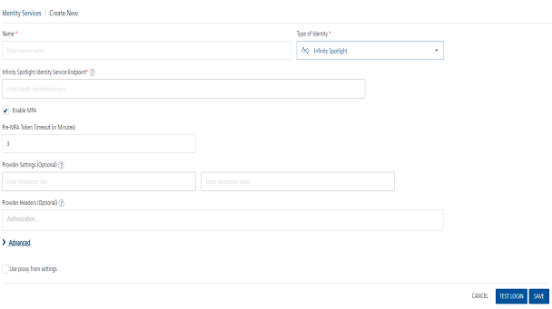
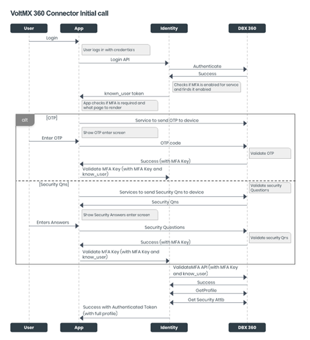
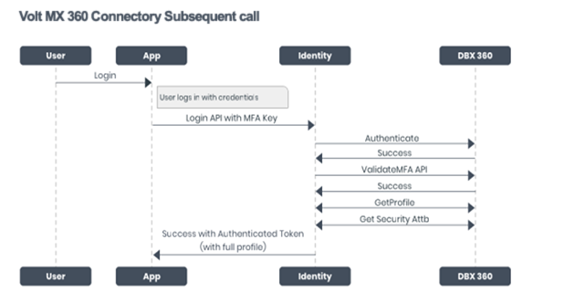

                              

User Guide: [Integration](Services.md#integration) \> [Configure the Integration Service](ConfigureIntegrationService.md) > Volt MX Customer 360

Volt MX  Customer 360 Adapter
============================

Volt MX  Customer 360 Adapter is an identity connector that you can use in the Volt MX DBX application suite. This adapter supports multi-factor authentication (MFA) (if enabled), and it fetches profile and security attributes of users from the configured DBX server.



To configure an Identity service by using Volt MX Customer 360 adapter, follow these steps:

1.  On the Identity service Design screen, in the **Name** box, type a name for the service.
    
2.  From the **Type of Identity** list, select **VoltMX Customer 360**.
    
3.  In the **VoltMX Customer 360 Identity Service Endpoint** box, type the URL to which the Identity service must navigate to get the meta data.
    
4.  The **Enable MFA** check box is selected by default. This helps you in the test login flow to test the status of the short-lived known\_user token (whether it is issued or not). This setting has no impact on the DBX server, as the server's adaptive algorithm decides the MFA status, and then responds accordingly in the login flow.
    
5.  In the **Pre-MFA Token Timeout (in Minutes)** box, type the required value. It determines the timeout value for the short-lived known\_user token.
    
6.  In the **Provider Settings (Optional)** section, do the following:
    
    *   In the **Enter Parameter Key** box, type the parameter that you want to configure as an additional attribute. For example, `<Backend-config-key>`.
        
    *   In the **Enter Parameter Value**box, type the necessary parameter value. For example, `<backend-config-key-value>`.
        
7.  In the **Provider Headers (Optional)** section, type the header parameters from the login request.
    
8.  In **Advanced > Post Authentication URL**, type the URL that you want to invoke after an Identity session is created. After this URL is invoked, the Identity response is returned to the client.
    
9.  Click **Test Login** to verify the credentials. The **Test Login** dialog box appears.
    
    *   Type the required details in the **Header** and **Body** boxes for the custom Identity provider.
        
    *   The entries for the Header and Body boxes are auto-inserted to the login request. You can delete an entry by clicking the **Delete** beside it.
        
    *   Click Sign In. The test results are displayed in the Identity Response dialog.
        
10.  Click **Save**. Volt MX Foundry displays the Identity screen, and the custom Identity service is configured.
    

Initial Call Process by using Volt MX Customer 360 Adapter
----------------------------------------------------------

When a user signs in to the DBX application for the first time, the following calls occur among the DBX app, Identity service, and DBX server:

*   The login request is sent to the Volt MX Foundry Identity service through the Login API.
    
*   The Identity service sends the login request to the DBX server to be authenticated.
    
*   On successful authentication of the user from the DBX server, the Identity service verifies the MFA status. By default, MFA is enabled. If MFA is not enabled, the Identity service returns the authenticated token.
    
*   If MFA is enabled, the Identity service sends a “**known\_user token**” to the DBX application.
    
*   The DBX app contains the custom logic internal to its implementation to fetch MFA. The configured MFA can be of any type, namely: OTP, and/or security questions, and/or any custom logic to obtain an MFA key.
    
*   **OTP flow**
    *   If the bank or user enables OTP as the type of MFA, the DBX app displays the OTP screen. And the app invokes a service that sends an OTP to the user's registered device.
        
    *   After the user type the OTP, it is sent to the DBX server to be validated.
        
    *   On successful validation, the DBX server sends an MFA key to the DBX application.
        
    *   The DBX app sends the MFA key along with the Known User token to the Identity service.
        
*   **Security Questions Flow**
    *   If the bank or user enables Security Questions as the type of MFA, the DBX app displays the Security Questions screen. And the app invokes a service that requests the DBX server to send the security questions.
        
    *   After the user provides the answers to the questions, they are sent to the DBX server to be validated.
        
    *   On successful validation, the DBX server sends an MFA key to the DBX application.
        
    *   The DBX app sends the MFA key along with the Known User token to the Identity service.
        
*   The Identity service sends the MFA key and the Known User token to the DBX server to validate the user who is trying to access the DBX application.
    
*   On successful validation, the DBX server sends the profile and security attributes of the user to the Identity service.
*   The Identity service sends the authenticated token with full profile details to the DBX application.
    



Subsequent Call Process by using Volt MX Customer 360 Connector
---------------------------------------------------------------

On subsequent logins, the following calls occur among the DBX app, Identity service, and DBX server:

*   The DBX application invokes the Login API along with the stored MFA key, and sends the details to the Identity service.
    
*   The Identity service sends the MFA key and the known\_user token to the DBX server to validate the user who is trying to access the DBX application.
    
*   On successful validation, the DBX server sends the profile and security attributes of the user to the Identity service.
    
*   The Identity service sends the authenticated token with full profile details to the DBX application.
    



> **_Important:_** This document contains the information about the intended implementation for the connector. As the actual implementation can vary, kindly refer the DBX documentation ([DBX](https://voltmxdocs.atlassian.net/wiki/spaces/ARBD/overview) > Digital Banking Platform > Feature Description and Specification - Digital Banking Platform > Infrastructure Services > Local Services > Local Services - API Reference > Login Local Services > dbxUserLogin (Orchestration Service)) to know the actual implementation.

SDKs
----

> **_Note:_** These APIs are valid from V8 SP4 Fix Pack 14 onwards.

### getMfaDetails

The getMfaDetails function helps you to identify whether multi factor authentication (MFA) is enabled or disabled in the Identity service. If MFA is enabled, this function also lets you know the type of MFA that is active.

#### Signature

```
<IdentityObj>.getMfaDetails()
```

#### Parameters

None

#### Return Type

JSON - containing enablement flag and metadata

#### Example

```
var serviceName = "identity_service_name";
// Get an instance of SDK
var client = voltmx.sdk.getCurrentInstance();
var identitySvc = client.getIdentityService(serviceName);
var mfaDetails = idenidentitySvc.getMfaDetails();
if(mfaDetails["is_mfa_enabled"] == true){
     voltmx.print(“mfa is enabled and mfa meta information is -“+JSON.stringify(mfaDetails["mfa_meta"]));
}

```

### validateMfa

The validateMfa function validates the MFA parameters. On successful validation, this function allows you to access the client use cases that were restricted which were restricted by multi-factor authentication.

#### Signature

```
< IdentityObj >.validateMfa(mfaParams , successCallback, errorCallback)
```

#### Parameters

  
| Parameter | Type | Description | Required |
| --- | --- | --- | --- |
| mfaParams | JSON | These parameters must match with the getMfaDetails() response parameters. | Yes |
| successCallback | Function | This function is invoked on successful MFA validation. | Yes |
| errorCallback | Function | This function is invoked when there is an error while MFA validation with the cause of failure as an argument. | Yes |

#### Return Type

None

#### Example

```

var serviceName = "identity_service_name";
// Get an instance of SDK
var client = voltmx.sdk.getCurrentInstance();
var identitySvc = client.getIdentityService(serviceName);
var mfaParams = {"mfa_Key" : "mfa value"};
function successCallback(){
  voltmx.print("validation successful");
}
function errorCallback(err){
  voltmx.print("validation unsuccessful with error - "+ JSON.stringify(err));
}
idenidentitySvc.validateMfa(mfaParams , successCallback, errorCallback);

```
