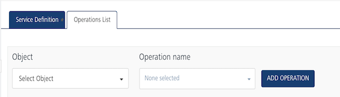
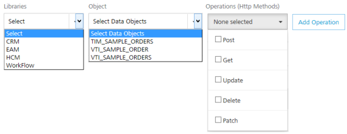

Only available if you have SAP Gateway services in your account.                               

User Guide: [Integration](Services.md#integration) \> [Configure the Integration Service](ConfigureIntegrationService.md) > Volt MX SAP Gateway Adapter

Volt MX  SAP Gateway Adapter
---------------------------

With Volt MX Foundry, you can access external Volt MX SAP services by using the Volt MX SAP Gateway adapter. Based on your Volt MX SAP Gateway authentication, you can use Volt MX SAP libraries and objects along with the supported HTTP methods in your app.

### Configure Volt MX SAP Gateway Endpoint Adapter

To configure Volt MX SAP Gateway service in the **[Integration Service Definition](ConfigureIntegrationService.md)** tab, follow these steps:

1.  In the **Name** field, provide a unique name for your service.
2.  From the **Service Type** list, select **VoltMX SAP Gateway**.
3.  Provide the following details to create the Volt MX SAP Gateway service:  
    
    | Field | Description |
    | --- | --- |
    | Select Authentication Services | **Use Existing Identity Provider** - to select an identity provider. This drop-down lists all identity providers only if you have already created identity providers for SAP in the Identity page. Fill in the details for the following fields: From the **Identity** list, select your VoltMX SAP Gateway identity.The details for the selected identity are displayed in the **Gateway address & port** text box. You cannot modify these details.Under the **User ID** and **Password**, provide valid log-in credentials that you created while registering with VoltMX SAP services.In the **Default Caller ID**, provide the ID that VoltMX SAP Gateway uses for logging and auditing.In the **Default Caller Group**, provide the ID that VoltMX SAP Gateway uses for logging and auditing. This information is optional. **Specify Login Endpoint**\- to configure a new endpoint. Fill in the details for the following fields: In the **Gateway address**, enter the domain. For example, connect.voltmx.com_._ In the **Port** text box, enter a valid port number ranging from 1 to 65535. In the **Header parameter name prefix \*** text box, enter the header. For example, VoltMXSAP. Under the **User ID** and **Password**, provide valid log-in credentials that you created while registering with VoltMX SAP Gateway services. In the **Default Caller ID**, provide the ID that VoltMX SAP Gateway uses for logging and auditing. In the **Default Caller Group**, provide the ID that VoltMX SAP Gateway uses for logging and auditing. This information is optional |

4. 

For additional configuration of your service definition, provide the following details in the **Advanced** section:

    
    | Field | Description |
    | --- | --- |
    | Throttling | API throttling enables you to limit the number of request calls within a minute. If an API exceeds the throttling limit, it will not return the service response. **To specify throttling in VoltMX Foundry Console, follow these steps:** In the **Total Rate Limit** text box, enter a required value. With this value, you can limit the number of requests configured in your VoltMX Foundry console in terms of Total Rate Limit. In the **Rate Limit Per IP** text box, enter a required value. With this value, you can limit the number of IP address requests configured in your VoltMX Foundry console in terms of Per IP Rate Limit. **To override throttling in App Services Console, refer to** [Override API Throttling Configuration](API_Throttling_Override.md#override-api-throttling-configuration). > **_Note:_** In case of On-premises, the number of nodes in a clustered environment is set by configuring the `VOLTMX_SERVER_NUMBER_OF_NODES` property in the Admin Console. This property indicates the number of nodes configured in the cluster. The default value is 1. Refer to [The Runtime Configuration tab on the Settings screen of App Services](../../../Foundry/vmf_integrationservice_admin_console_userguide/Content/Runtime_Configuration.md). The total limit set in the VoltMX Foundry Console will be divided by the number of configured nodes. For example, a throttling limit of 600 requests/minute with three nodes will be calculated to be 200 requests/minute per node. This is applicable for Cloud and On-premises. |
        
    

    
    > **_Note:_** All the fields in the Advanced section are optional.
    
5.  In the **Description** field, provide a suitable description for the service.
    
6.  To enable the proxy, select the **Use proxy from settings** check box. By default, the check box is cleared.  
    The **Use proxy from settings** check box dims when no proxy is configured under the ****[Settings > Proxy](Settings.md#proxy)****.
    
7.  Click **Save** to save your service definition.

### Create Operations for VoltMX SAP Gateway

The **Operations List** tab appears only after the service definition is saved.

> **_Note:_** Click **Operations List** tab > **Configure Operation**. The **Configured Operations** list appears.

Based on your Volt MX SAP Gateway authentication, the system loads all tables such as libraries and objects along with supported HTTP methods.  

To create operation, follow these steps:

1.  Click **SAVE & ADD OPERATION** in your service definition page to save your service definition and display the **NewOperation** tab for adding operations.  
                        OR  
    Click **Add Operation** to add a new operation or from the tree in the left pane, click **Add > Add New Operation**.  
    
    

Click to View image

        
    

    

    > **_Note:_** To use an existing integration service, refer to [How to Use an Existing Integration Service](Manage_Existing_Integration_Services_1.md#how-to-use-an-existing-integration-service).

    

2.  Under **Operations List** tab, from the **Libraries** list, select a library - for example, CRM. The system loads available objects and operations for the selected library.
3.  From the **Object** list, select an object.
4.  From the **Operations (HTTP Methods)** list, select the required check boxes for each operation.
5.  To configure more operations for your Volt MX SAP Gateway integration service, repeat Steps a through b. You can select a new library and object, and supported operations.
    
6.  Click **ADD OPERATION**. The system adds your operation to the Operations List page, and it also adds your new Volt MX SAP Gateway service into the **Integration** page.
    
7.  To edit an operation, either click on the required operation name or click **Edit** from the **Settings** in the **Operations List** screen. The operation details page is displayed.  
    
8.  To configure an operation, provide the following details:  
    

| Field | Description |
| --- | --- |
| Name | Enter a unique name for your operation. |
| Operation Security Level | It specifies how a client must authenticate to invoke this operation. |
| Front End HTTP Method | Select a HTTP method that you want to invoke on the integration server. By default, the field is set to **Post** method. > **_Note:_** The front-end HTTP methods are used for all non-SDK clients such as API Management users. Invoking a service from an SDK will continue to use the POST method for operations. |
| Target HTTP Method | Select a HTTP method that you want to invoke on the back-end service from integration server. |
| Operation Path | Modify the path if required. > **_Note:_** If you provide incorrect Salesforce endpoint details, the **Object** list will contain only _\_Login_ object. |

Select one of the following security operations in the **Operation Security Level** field.
 

* **Authenticated App User** – It restricts the access to clients who have successfully authenticated using an Identity Service associated with the app.
* **Anonymous App User** – It allows the access from trusted clients that have the required App Key and App Secret. Authentication through an Identity Service is not required.
* **Public** – It allows any client to invoke this operation without any authentication. This setting does not provide any security to invoke this operation and you should avoid this authentication type if possible.
* **Private** - It blocks the access to this operation from any external client. It allows invocation either from an Orchestration/Object Service, or from the custom code in the same run-time environment. 

9. 

 response operations, provide the following details in the **Advanced** section:

    
    | Field | Description |
    | --- | --- |
    | Front End API | It allows you map your endpoint (or) backend URL of an operation to a [front-end URL](FrontEndAPI.md). |
    | Server Events | Using Server Events you can configure this service to trigger or process server side events. For detailed information, refer [Server Events](ServerEvents.md). |
    
    

    > **_Note:_** All options in the Advanced section are optional.
    

### Configure Request Operation for Volt MX SAP Gateway

Integration services accept only `form-url-encoded` inputs for all the input parameters provided in the service input parameters (request input).

You can perform the following actions in Request Input tab:

1.  Click **Add Parameter** to add an entry (if the entries for input and the output tabs does not exist).
    
2.  To make duplicate entries, select the check box for the entry, click **Copy** and **Paste**.
    
3.  To delete an entry, select the check box for an entry and click **Delete** .
    
4.  Under the **Body** tab, provide the following details:  
    
    | Field | Description |
    | --- | --- |
    | Name | It Contains a Unique Identifier. Change the name if required. |
    | Test Value | Enter a value. A test value is used for testing the service. |
    | Default Value | Enter the value, if required. The default value will be used if the test value is empty. |
    | Scope | Select Request or Session. It is set to **Request** by default. **Request** indicates that the value must be retrieved from the HTTP request received from the mobile device. **Session** indicates that the value must be retrieved from the HTTP session stored on VoltMX Foundry. |
    | Datatype | --- |
    | Encode | Select the check box to enable encoding of an input parameter. For example, the name New York Times would be encoded as _New_York_Times_ when the encoding is set to True. The encoding must also adhere to the HTML URL encoding standards. |

    

Select one of the following data types.

    * **String** - A combination of alpha-numeric and special characters. Supports all formats including UTF-8 and UTF-16 with no maximum size limit. * * **Boolean** - A value that can be true or false. 
    * **Number** - An integer or a floating number. 
    * **Collection** - A group of data, also referred as data set.

    
  
    
5.  Under the **Header** tab, provide the **Custom HTTP Headers**. For example, **POST** or **GET**. The following Custom HTTP Headers are required by the external source:
    
    *   **ID**: The rows are created based on the selected operation. Change the value if required.
        
    *   **TEST VALUE**: Enter a value. A test value is used for testing the service.
    *   **Scope**: Select request or session. By default, this field is set to Request.
    
6.  To validate the operation details, click **Save and Test**. For more details, refer to [Test a Service Operation](Test_a_Service_Operation.md).
    

### Configure Response Operation for Volt MX SAP Gateway

1.  Click the **Response Output** tab to view the output test values, such as name, scope, data type.  
    
    > **_Note:_** If you define parameters inside a record as the session, the session scope will not get reflected for the parameters.
    
2.  To validate the operation details, click **Save and Test**. For more details, refer to [Test a Service Operation](Test_a_Service_Operation.md).
3.  Click **SAVE OPERATION** to save the operation.
    
    > **_Note:_** You can view the service in the Data Panel feature of Volt MX Iris. By using the Data Panel, you can link back-end data services to your application UI elements seamlessly with low-code to no code. For more information on Data Panel, click [here](../../../Iris/iris_user_guide/Content/DataPanel.md#top).
    

### How to Edit or Test an Existing Volt MX SAP Gateway Adapter

If you want to edit an existing Volt MX SAP service, you can edit details such as service name, authentication service information, operations.

Each operation contains four tabs, including input, attributes, output, and advanced. If you want to test an existing operation for Volt MX SAP service - for example, get or put - enter necessary test values in the input and the advanced tabs. The results are displayed in the JSON format. The input values can be data types, test values, and session keys.

To edit or test an existing Volt MX SAP integration service, follow these steps:

1.  In the **Integration** page, click one of your SAP services.
2.  Make the necessary changes in the **Service Definition** and **Operations** sections. You can test an operation by inputting values. To test an operation, refer to **How to configure Volt MX SAP Gateway Operations**.
3.  Click **Done** to save the changes. The system displays the **Integration** page.
