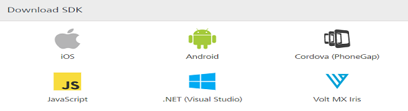

User Guide: [SDKs](../Foundry_SDKs.md) > [.NET (Visual Studio) SDK](Installing_Windows_SDK.md) > Downloading the .NET (Visual Studio) SDK

# Downloading .NET (Visual Studio) SDK Files

To download the .NET SDK, follow these steps:

1.  In the Volt MX Foundry console, navigate to <b>Apps</b> > <b>SDKs</b>, and click <b>.NET (Visual Studio)</b>. The system prompts you to save the zip file in your local system.

    

    

2.  Save the `voltmx-windows-sdk.zip` file in your local system.
3.  Extract `voltmx-windows-sdk.zip` file that you just downloaded.  
    The `WindowsSDK` folder contains the following files
    - voltmx.SDK.dll
    - HELP
    - LICENSE.txt
    - Newtonsoft.Json.dll
