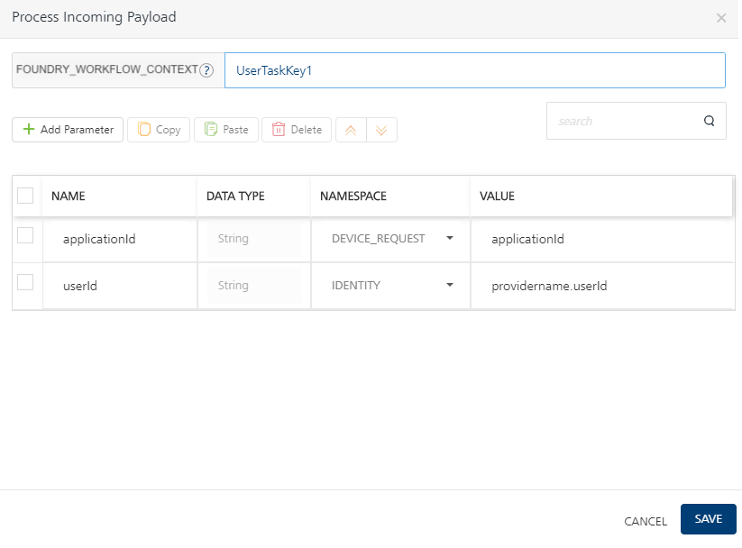

# <madcap:keyword term="WorkFlow Best Practices">Workflow Best Practices</madcap:keyword>

## Accessing an element in an array via index

Use the following sample expression to access an element in an array via index in FOUNDRY_WORKFLOW_CONTEXT namespace.

`FOUNDRY_WORKFLOW_CONTEXT.resp.Employee.get(2).name`

This means, if a response has an array of Employee in `FOUNDRY_WORKFLOW_CONTEXT.resp.Employee`, then you can get the name of the third employee by this expression.

## Accessing scope attributes via FOUNDRY_WORKFLOW_CONTEXT namespace

**Use Case:** Workflows are executed in the background. In case of long-running workflows, if you are using attributes from an identity scope or session scope, there is no guarantee that those attributes are available throughout the workflow execution.

**Recommended best practices**: When a workflow needs any kind of attributes from an `IDENTITY` or `SESSION` scope, always try to populate the necessary data from all other scopes to **FOUNDRY_WORKFLOW_CONTEXT**, and use these values from **FOUNDRY_WORKFLOW_CONTEXT**.

You can configure the attributes from an `IDENTITY` or `SESSION` scope by using <madcap:conditionaltext madcap:conditions="Default.V9SP2GA">**Process Incoming Payload** mapping editor or</madcap:conditionaltext> a service task.

<madcap:dropdown madcap:conditions="Default.V9SP2GA"><madcap:dropdownhead><madcap:dropdownhotspot>**How to Store namespace data in **FOUNDRY_WORKFLOW_CONTEXT** using ****Process Incoming Payload**** (User Task in Foundry Console)**</madcap:dropdownhotspot></madcap:dropdownhead><madcap:dropdownbody>

*   Click **Configure** under **Process Incoming Payload** of a in User task properties, in a workflow service. The **Process Incoming Payload** dialog box appears.

    

    1.  Specify a top-level key name in **FOUNDRY_WORKFLOW_CONTEXT** field. The top-level key stores data copied from output elements of the other namespaces.
    2.  Map parameters in the table to copy data from other namespaces. Individual elements of the output can be accessed by using a dot(.) notation with a key.

        For example, `Foundry_Workflow_Context.UserTaskKey1.applicationId = Device_request.applicationId`

        *   Top-level key: `UserTaskKey1` , which stores data copied from the mapped output of the element, `applicationId`.
        *   The `applicationId` element is mapped to the `applicationId` parameter that is available in the DEVICE_REQUEST namespace.

</madcap:dropdownbody></madcap:dropdown><madcap:dropdown madcap:conditions="Default.V9SP2M1"><madcap:dropdownhead><madcap:dropdownhotspot>**How to Store namespace (identity or session) attributes as key value by using a service task**</madcap:dropdownhotspot></madcap:dropdownhead><madcap:dropdownbody>

*   Avoid using the `IDENTITY` scope as it can expire at any time while the workflow is under execution. <u>Instead, populate the necessary values from an `IDENTITY` scope to **FOUNDRY_WORKFLOW_CONTEXT** by using a service task</u>.
*   Avoid using the `SESSION` scope as it can contain **custom** data elements that might get lost while persisting when a workflow execution fails. <u>Instead, populate the necessary values from a `SESSION` scope to **FOUNDRY_WORKFLOW_CONTEXT** by using a service task.</u>  
    Though an attempt will be made for persisting the session scope data on workflow failure, but it is not fully guaranteed.

</madcap:dropdownbody></madcap:dropdown>