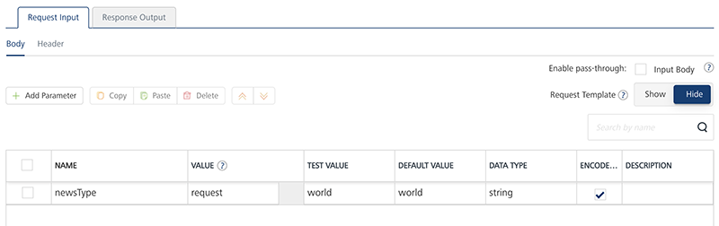
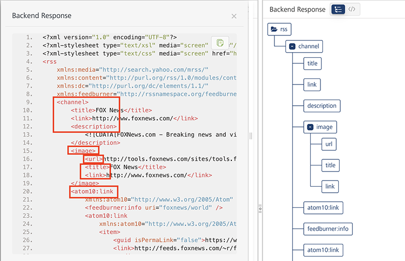
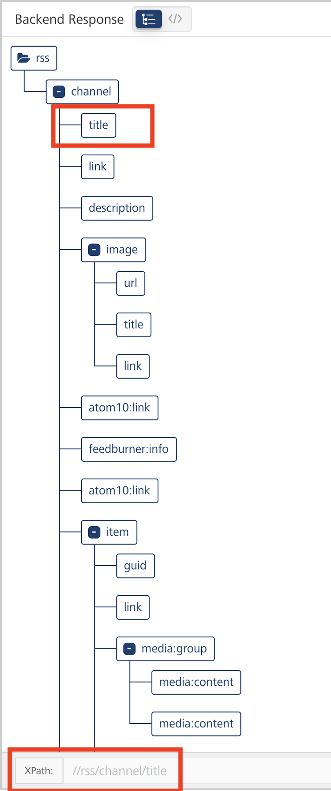
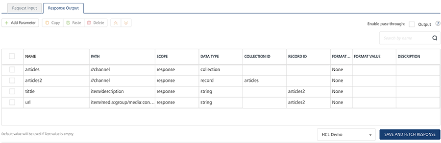
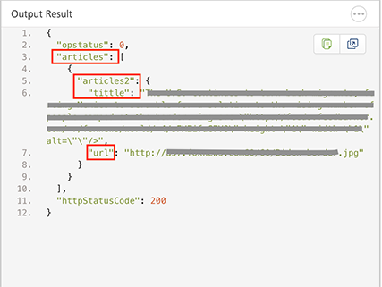

                               

User Guide: [Integration](Services.md#integration) \> [Advanced Configurations](Advanced_Configurations.md) > XPath supported operators in Volt MX Foundry

XPath in Volt MX Foundry
=======================

XPath (XML Path Language) is a query language for selecting nodes from an XML document. Volt MX Foundry supports XPath expressions to compute/filter (for example, strings, numbers, or Boolean values) a back-end response that is in XML format. Volt MX supports XPath for XML, SOAP, and JSON integration services.

For more information about XPath, refer [https://www.w3schools.com/xml/xml\_xpath.asp](https://www.w3schools.com/xml/xml_xpath.asp).

XPath supported operators in Volt MX Foundry
-------------------------------------------

The following table details the supported operators for XPath expressions in Volt MX Foundry.

  
| Operators | Description |
| --- | --- |
| AND | Boolean and |
| OR | Boolean or |
| + | Plus |
| \- | Minus |
| \* | Multiply |
| Div | Division |
| Mod | Modulus (division remainder) |
| Sum | This converts the value of each node in the node-set to a number and totals the result. |
| Round | This returns the closest integer to the argument. The rounding rules follow Java conventions which are not quite the same as the XSL rules. |

*   While configuring XPath for a response, for arithmetic XPath expressions, operators and operands should be separated by at least one space ( ).
    
    For example,
    
```
 <? xml version="1.0" encoding="UTF-8”?>  
    <CATALOG>
    <PLANT>  
    <ZONE>4</ZONE>  
    <PRICE>2.44</PRICE>
    </PLANT>  
    </CATALOG>
      
    *Sample arithmetic operations with at least one space:*   
    //CATALOG/PLANT/ZONE + //CATALOG/PLANT/PRICE
    //CATALOG/PLANT/ZONE * //CATALOG/PLANT/PRICE
    //CATALOG/PLANT/ZONE div //CATALOG/PLANT/PRICE
    
```

How to use XPath in Volt MX Foundry
----------------------------------

1.  Create an [integration **service**](#IntegrationSDpage) of an app for XML, SOAP, or JSON.
2.  Create an operation.
3.  Configure the input parameters in the **Request Input**.
    
    For example:
    
    
    
4.  Select the environment from the **Select an Environment** list.
5.  Click **Save and Fetch Response** to view the results of the operation.
    
    The back-end response is displayed in the XML format, in the **Test Result** section.  
    In **Backend Response** window, you can view the raw response as either raw data or in a tree format.
    
    
    
    Clicking on an element in the tree to display the XPath of that tag.
    
    
    
6.  Now apply XPath expressions for extracting the required elements from the back-end response of the service call.
    
    For example, the following is a sample XPath expressions
    
    
    
      
    | Name/ID | XPath | Scope | Data Type | Collection ID | Record ID |
    | --- | --- | --- | --- | --- | --- |
    | articles | //channel | response | Collection |   |   |
    | articles2 | //channel | response | Record | articles |   |
    | title | item/title | response | Sting string |   | articles2 |
    | url | item/media:group/media:content/@url | response | Sting string |   | articles2 |


    **Collection** - A group of data, also referred to as data set. A collection contains only records, and a record contains a string, boolean, or number values. 

    **Record** - A group data elements under the specified parameter. A record can also be part of a collection. Typically, a record provides metadata to a segment. 

    > **_Note:_** For JSON integration service, the back-end response will be in JSON format. JSONPath format should contain `$` in the expression.  
      
    For example: `$` the root object/element
    
7.  Click **Save and Fetch Response** again.
    
    Now the back-end response is filtered based on the XPath expressions and displays the output in JSON format.
    
    
    

### **XPath Example Reference**

The following example details a sample backend response, and XPath configurations and Output Result based on the XPath configurations

*   **The following is a sample Backend Response, in XML, from the Target URL of an integration service.**  
    Sample Target URL link: [http://www.mocky.io/v2/5a9fa4e92e0000630074d133](http://www.mocky.io/v2/5a9fa4e92e0000630074d133)
    
    
<details close markdown="block"><summary>Click here to view sample Backend response</summary>  
    
    
```
 <!-- This is a Sample backend response -->  
      
    <catalog>
        <book id="bk101">
            <author>Gambardella, Matthew</author>
            <title>XML Developer's Guide</title>
            <genre>Computer</genre>
            <price>44.95</price>
            <publish_date>2000-10-01</publish_date>
        </book>
        <book id="bk102">
            <author>Ralls, Kim</author>
            <title>Midnight Rain</title>
            <genre>Fantasy</genre>
            <price>5.95</price>
            <publish_date>2000-12-16</publish_date>
        </book>
        <book id="bk103">
            <author>Corets, Eva</author>
            <title>Maeve Ascendant</title>
            <genre>Fantasy</genre>
            <price>5.95</price>
            <publish_date>2000-11-17</publish_date>
        </book>
        <book id="bk104">
            <author>Corets, Eva</author>
            <title>Oberon's Legacy</title>
            <genre>Fantasy</genre>
            <price>5.95</price>
            <publish_date>2001-03-10</publish_date>
        </book>
        <book id="bk105">
            <author>Corets, Eva</author>
            <title>The Sundered Grail</title>
            <genre>Fantasy</genre>
            <price>5.95</price>
            <publish_date>2001-09-10</publish_date>
        </book>
        <book id="bk106">
            <author>Randall, Cynthia</author>
            <title>Lover Birds</title>
            <genre>Romance</genre>
            <price>4.95</price>
            <publish_date>2000-09-02</publish_date>
        </book>
        <book id="bk107">
            <author>Thurman, Paula</author>
            <title>Splish Splash</title>
            <genre>Romance</genre>
            <price>4.95</price>
            <publish_date>2000-11-02</publish_date>
        </book>
        <book id="bk108">
            <author>Knorr, Stefan</author>
            <title>Creepy Crawlies</title>
            <genre>Horror</genre>
            <price>4.95</price>
            <publish_date>2000-12-06</publish_date>
        </book>
        <book id="bk109">
            <author>Kress, Peter</author>
            <title>Paradox Lost</title>
            <genre>Science Fiction</genre>
            <price>6.95</price>
            <publish_date>2000-11-02</publish_date>
        </book>
        <book id="bk110">
            <author>O'Brien, Tim</author>
            <title>Microsoft .NET: The Programming Bible</title>
            <genre>Computer</genre>
            <price>36.95</price>
            <publish_date>2000-12-09</publish_date>
        </book>
        <book id="bk111">
            <author>O'Brien, Tim</author>
            <title>MSXML3: A Comprehensive Guide</title>
            <genre>Computer</genre>
            <price>36.95</price>
            <publish_date>2000-12-01</publish_date>
        </book>
        <book id="bk112">
            <author>Galos, Mike</author>
            <title>Visual Studio 7: A Comprehensive Guide</title>
            <genre>Computer</genre>
            <price>49.95</price>
            <publish_date>2001-04-16</publish_date>
        </book>
    </catalog>
```

</details>
    
*   **The following table details the XPath for the AND operator and Output Result based on the sample response.**
    
      
    | XPath for AND operator | Output Result |
    | --- | --- |
    | computerBooks: `book [genre = 'Computer' and author = "O'Brien, Tim"]` | { "httpStatusCode": 200, "catalog": \[ { "computerBooks": { "computerAuthor": "O'Brien, Tim", "computerTitle": "Microsoft .NET: The Programming Bible" } }, { "computerBooks": { "computerAuthor": "O'Brien, Tim", "computerTitle": "MSXML3: A Comprehensive Guide" } } \], "opstatus": 0 } |
    
*   **The following table details the XPath for the OR operator and Output Result based on the sample response.**
    
      
    | XPath for OR operator | Output Result |
    | --- | --- |
    |  fictionBooks: `book [genre = 'Fantasy' or genre = 'Science Fiction']` |  { "httpStatusCode": 200, "catalog": \[ { "fictionBooks": { "fictionTitle": "Midnight Rain", "fictionGenre": "Fantasy" } }, { "fictionBooks": { "fictionTitle": "Maeve Ascendant", "fictionGenre": "Fantasy" } }, { "fictionBooks": { "fictionTitle": "Oberon's Legacy", "fictionGenre": "Fantasy" } }, { "fictionBooks": { "fictionTitle": "The Sundered Grail", "fictionGenre": "Fantasy" } }, { "fictionBooks": { "fictionTitle": "Paradox Lost", "fictionGenre": "Science Fiction" } } \], "opstatus": 0 } |
    
*   **The following table details the XPaths for arithmetic operators and Output Result based on the sample response.**
    
      
    | XPath | Output Result |
    | --- | --- |
    | add: `count(//book[genre = 'Fantasy']) + count(//book[genre = 'Romance'])` romanceCount: `count(//book[genre = 'Romance'])` fantasyCount: `count(//book[genre = 'Fantasy'])` computerAuthorCount: `count(//book[genre = 'Computer' and author = "O'Brien, Tim"])` fictionCount: `count(//book[genre = 'Fantasy' or genre = 'Science Fiction'])` subtract: `count(//book[genre = 'Fantasy']) - count(//book[genre = 'Romance'])` divide: `count(//book[genre = 'Fantasy' or genre = 'Science Fiction']) div count(//book[genre = 'Romance'])` multiply: `count(//book[genre = 'Fantasy']) * count(//book[genre = 'Romance'])` modulus: `count(//book[genre = 'Fantasy' or genre = 'Science Fiction']) mod count(//book[genre = 'Romance'])` | { "add": 6, "romanceCount": 2, "fantasyCount": 4,  "computerAuthorCount": 2,"fictionCount": 5, "subtract": 2, "divide": 2.5, "multiply": 8, "modulus": "1", "httpStatusCode": 200 } |
