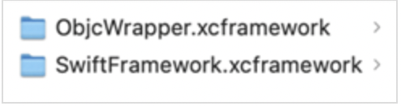

# NFI Support for Swift-based SDK

Swift is an open-source programming language that is created and designed by Apple to provide developers with high flexibility. Swift is used to build apps for iOS, Mac, Apple TV, and Apple Watch. A Swift-based SDK hides a majority of low-level implementation to provide a simplified way of utilizing API-based Swift services.

Native Function APIs (NFIs) on the other hand, are modules that can wrap the native (iOS, Android) APIs in JavaScript functions. The functions can then be used in a Voltmx Iris app to facilitate native functions. For more information, refer to [Native Function APIs](../../../../Iris/iris_api_dev_guide/content/native_function.md) in the [Voltmx Iris API Developers' Guide](../../../../Iris/iris_api_dev_guide/content/native_function.md#introduction).

To create NFIs that support Swift-based SDKs, perform the following actions:

1.  Wrap the functionality from Swift into Objective-C methods.
2.  Put the Objective-C methods in a minimal wrapper framework.
3.  Generate an NFI for the wrapper framework.

For detailed information about generating an NFI for the Swift framework, refer to the following sections.

<b>Create a Swift framework</b>

1.  In Xcode, create a Swift-based framework and declare the classes and methods by using the `@objc` keyword, for example:

    `@objc(Library) public class Library: NSObject{}`

2.  Based on your requirement, compile the Swift-based framework for a **device**, a **simulator**, or both.

    A header file is created with the name of your framework (`framework_name-Swift.h`). The headers and classes are exposed by using the `@objc` keyword.

3.  Use the following code to build and generate the `xcframework` for the device and simulator frameworks:

    `xcodebuild -create-xcframework -framework pathToDeviceFolder -framework pathToSimulatorFolder -output pathToWriteXCFramework`

<b>Create an Objective-C wrapper for the Swift framework</b>

1.  In Xcode, create a new Objective-C framework.
2.  Copy the Swift framework (generated earlier) to the Objective-C framework.
3.  For every class that is required, create files with the following extensions: `.h`, `.m`

    Make sure that the file names are unique for every class, for example:

    *   `LibraryWrapper.h`
    *   `LibraryWrapper.m`
    *   `LibraryListWrapper.h`
    *   `LibraryListWrapper.m`
    *   `BookWrapper.h`
    *   `BookWrapper.m`
4.  In the files with a `.m` extension, import the framework file that was created earlier (`framework_name-Swift.h`), for example:

    <pre><code>
        #import "LibraryWrapper.h"
        #import &lt;SwiftFramework/framework_name-Swift.h&gt;
    </code></pre>

5.  In the files with a `.h` extension, declare the wrapper method so that the Swift framework methods are invoked, for example:

    <pre><code>
    - (id)initWithName:(NSString*)name andBooks:(NSArray*)books;
    - (void)updateBooksList:(NSArray*)list;
    - (void)removeBook:(NSUUID*)bookId;
    </code></pre>
    

6.  In the files with a `.m` extension, define the methods and invoke the framework methods, for example:

    <pre><code>
    @implementation LibraryWrapper
    Static Library* libraryObj;
    -(id)initWithName:(NSString*)name andBooks:(NSArray*)books {
      library = [[Library alloc]initWithName:name books:books];
      return self;
    }
    -(void)updateBooksList:(NSArray*)list {
      [libraryObj updateBooksList:list];
    }
    -(void)removeBook:(NSUUID*)bookId {
      [libraryObj removeBook:bookId];
    }
    @end
    </code></pre>

7.  After the wrapper files are defined, use the following code to build and generate the `xcframework` for a device and simulator:

    `xcodebuild -create-xcframework -framework pathToDeviceFolder -framework pathToSimulatorFolder -output pathToWriteXCFramework`

<b>Generate an NFI for the Objective-C wrapper</b>

1.  In the Quantum NFI tool, move the `xcframework` folders of the Swift framework and the Objective-C wrapper framework to the same directory.  
     

2.  In the `config.plist` file of the NFI project, add keys for the wrappers and relevant files. 

    The following code snippet is an example of adding the keys to the `config.plist` file:

    <pre><code>
    &lt;key&gt;ObjcWrapperFramework&lt;/key&gt;
    &lt;dict&gt;
	&lt;key&gt;Documentation&lt;/key&gt;
	&lt;false/&gt;
	&lt;key&gt;Mode&lt;/key&gt;
	&lt;string&gt;XCFWKS&lt;/string&gt;
	&lt;key&gt;ThirdPartyBuildHeaders&lt;/key&gt;
	&lt;array&gt;
		&lt;string&gt;LibraryListWrapper.h&lt;/string&gt;
		&lt;string&gt;LibraryWrapper.h&lt;/string&gt;
		&lt;string&gt;BookWrapper.h&lt;/string&gt;
	&lt;/array&gt;
	&lt;key&gt;ThirdPartyBuildHeadersCommonPath&lt;/key&gt;
	&lt;string&gt;path/to/project/ObjcWrapper.framework/Headers&lt;/string&gt;
	&lt;key&gt;ThirdPartyRootDir&lt;/key&gt;
	&lt;string&gt;path/to/dir&lt;/string&gt;
	&lt;key&gt;enabled&lt;/key&gt;
	&lt;true/&gt;
    &lt;/dict&gt;
    </code></pre>

3.  Use the following code to generate the NFI bindings of the Objective-C wrapper framework:

    `python build_tp.pyc`

