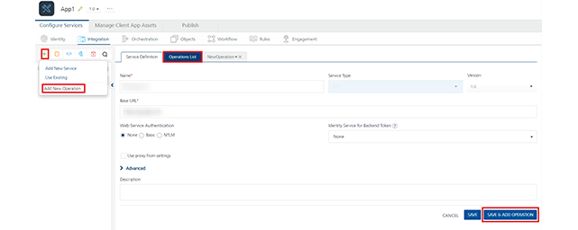

                             

JavaScript Connector
====================

With JavaScript Connector service, you can integrate plain JavaScript services to applications in Volt MX Foundry.

You can upload custom JavaScript files to Volt MX Foundry. Using JavaScript connectors, you can easily create server side code and make it available as operations. The JavaScript file must contain functions that the user wants to be made available as operations, along with other supporting functions. Please view the Limitations section for details of the structure for JavaScript function definitions.

For more details about the sample JavaScript code, refer to [JavaScript Sample Code for Preprocessor and Postprocessor](JS_Pre-Post_Samples.md).

Based on JDK version supported by the Volt MX Foundry Installer, the JavaScript Connector uses the following JavaScript engines:

*   If Java version 1.7 or 1.8, then it uses Nashorn JavaScript engine
*   If Java version below 1.7 , then it uses Rhino JavaScript engine

### How to Configure a New JavaScript Connector Integration Service

To configure a JavaScript connector, follow these steps:

1.  In the [integration **service definition** tab](#IntegrationSDpage), follow these steps:
    1.  In the **Name** field, enter a name – for example, JavaScript\_Service.
    2.  From the **Service Type** drop-down list, select **JavaScript**.
        
    3.  From the **Versions** drop-down list, select the required version. You can select only one version of the service.
        
    4.  From the **Specify the Javascript libraries** section, select a .JS file or click **Upload** to select the .JS files from your local machine. The console adds your JS file to the console. The system displays the added JS file's name under the **Specify the Javascript libraries** section.
        
        The system allows you to upload more than one JS file at **Specify the Javascript libraries**.
        
        JavaScript files, once uploaded, will be available across the Volt MX Foundry console. They cannot be deleted, only unlinked. You can unlink uploaded JS files by clicking the **Unlink** button.
        
2.  Click **SAVE** to save your service definition. The system displays the success message: Service Saved Successfully.  
    The **Operations List** tab appears only after the **Service Definition** is saved. The **ADD OPERATION** button in the Service Definition page is active only after you click the **SAVE** button.
3.  Click **ADD OPERATION** to display **Operations List** tab for adding operations to the service.
    
    > **_Note:_**  You can also add operations by following these steps:  
      
     -  Click the **Operations List** tab.  
     -  From the tree in the left pane, click **Add > Add New Operation**, shown below:
    
    [Click to View image](javascript:void(0);)
    
    
    
    > **_Note:_** To use an existing integration service, refer to [How to Use an Existing Integration Service.](#Use)
    
    1.  Under **Operations List** tab, in the **JS Library** drop-down list, select the required .JS file – for example, Sample.js. This will populate the Function drop-down list.
    2.  From the **Function** drop-down list, select the required functions. Each function equates to an operation.
    3.  Click **ADD OPERATION** to create operations with the selected functions.  
        The new operations are created and listed under the **Configured Operations**.
        
        Operations name are auto-generated in the format : <Name-of-the-JS-file>\_<function-name>. For example, `sample_function_addTwoNumbers`
        
4.  Click the operation. In the **Operation Modal** tab, follow these steps:
    
    The tab contains the request input, response output, and advanced sections. The input values are data types, scope, and format types. By default, the system will display the **Request Input** tab.  
    
    > **_Note:_** You can add an entry by clicking the **Add** button if entries for the input and the output tabs do not exist.  
      
    You can also delete an entry. Select the check box for an entry, and then click the **Delete** button.
    
    1.  In the **Name** field, modify the operation name if required.
    2.  [Select one of the following security operations in the **Operation Security Level** field. By default, the field is set to Authenticated App User:  
        ](javascript:void(0);)
        
        *   **Authenticated App User** – indicates that the operation is secured. To use the operation, an app user must be authenticated by an associated identity service.
        *   **Anonymous App User** – indicates that a user must have the app key and app secret to access this operation.
        *   **Public** – indicates that the operation requires no special security.
        
5.  Click the Advanced tab to configure the preprocessor and postprocessor for JavaScript. All options in the Advanced section are optional .
    
    [Click here For more details](javascript:void(0);)
    
    Configure the parameters for the preprocessor and postprocessor to filter the request and response objects for your business requirements. You can only specify custom JavaScript code for preprocessor and postprocessor.
    
    *   **JavaScript Preprocessor and Postprocessor** - Based on the interface, the preprocessors and postprocessors implement the following objects:
        
        `<serviceInputParams>`, `<request>`, `<response>` and `<result>`.
        
        You can use these objects and their corresponding methods directly in JavaScript code.  
        For a sample JavaScript code, refer to [JavaScript Sample Code for Preprocessor and Postprocessor](JS_Pre-Post_Samples.md).
        
        The step allows you to further filter the data received from a service call.
        
    
    1.  Under the **Custom Code Invocation**, follow these steps:
        *   Under **Preprocessor**, configure one of the following:
            *   Select **JavaScript** to open a text box. Here, you can write custom JavaScript code for the preprocessor.
        *   Under **Postprocessor**, configure one of the following:
            *   Select **JavaScript** to open a text box. Here, you can write custom JavaScript code for the postprocessor.
    2.  Under the **Properties** section, provide details for the following advanced service properties:
        *   **Cache Response** - the duration in seconds within which the service response is fetched from the cache. Select the **Cache Response** check box, and provide the details in the text box.
    
6.  In the **Request Input** > **Body** tab, provide the following details:
    
    > **_Note:_**  You can add an entry by clicking the **Add Parameter** button if entries for the input and the output tabs do not exist.  
      
    \-  To make duplicate entries, select the check box for the entry, click **Copy**, and then click **Paste**.  
      
    \-  To delete an entry, select the check box for an entry, and then click the **Delete** button.
    
    1.  The **NAME** field contains a unique identifier for a parameter. Change the identifier if required.
    2.  In the **Test Value**: Enter a value. A test value is used for testing the service.
    3.  In the **Default value** field, change the value if required.
    4.  Select request or session in the **Scope** field. By default, this field is set to **Request**.
        
        *   **Request** - Indicates that the value must be retrieved from the HTTP request received from a mobile device.
        *   **Session** - Indicates that the value must be retrieved from the HTTP session stored on Volt MX Foundry.
    5.  Select a data type in the **Data Type** field:
        *   **String** - A combination of alphanumeric and special characters. String supports all formats including UTF-8 and UTF-16 with no maximum size limit.
        *   **Date** - A value that is true or false.
        *   **Boolean** - A value that is true or false.
        *   **Number** - An integer or a floating number.
        *   **Collection** - A group of data or data set.
    6.  Select the **Encode** check box to enable an input parameter to be encoded. For example, the name New York Times would be encoded as New_York_Times when the encoding is set to True. The encoding must also adhere to the HTML URL encoding standards.
    
    > **_Note:_** The Response Output tab is not honored in JavaScript Connector.
    
7.  Click the **Response Output** tab, and enter the values for required fields such as name, scope, data type, collection ID, record ID, format and format value.
    
    In JavaScript service, the response (output) from a backend is not parsed based on the response values. The complete response from the backend is sent to the client device.
    
8.  these steps:
9.  Click **SAVE OPERATION** to save the operation. The system updates the operation definition.
    
    If you click **Cancel**, the **Operation Modal** tab will close without saving any information.
    
    > **_Note:_** To add more operations for your JavaScript service, repeat [Step 3 through Step 4.](#sTEP3)
    

### Limitations for Nashorn JS Engine

*   Nashorn does not support some common JavaScript libraries and global JavaScript functions, such as jQuery, setTimeout, setInterval or XMLHttpRequest. However, it provides an alternate mechanism to perform the same operation. You can invoke the required functionality using Java for such cases. For example, consider the XMLHttpRequest API. Since Nashorn does not support this API, you will need to use Java to perform the required operations. You can use URLConnection java class or HttpClient API to achieve the same goal.
    
*   Nashorn only supports ECMAScript-262 Edition 5.1. It does not support any features of Edition 6 or any nonstandard features provided by other JavaScript implementations.
*   Nashorn does not include a browser plug-in API.
*   Nashorn does not include support for DOM/CSS or any related libraries (such as jQuery, Prototype, or Dojo)
*   Nashorn does not include direct debugging support.
*   Nashorn does not have event loop or a task queue.

### Limitations for Supported JavaScript Function Formats

*   Supported formats of the JavaScript function definition as follows:
```
 function abc() { … }
```
