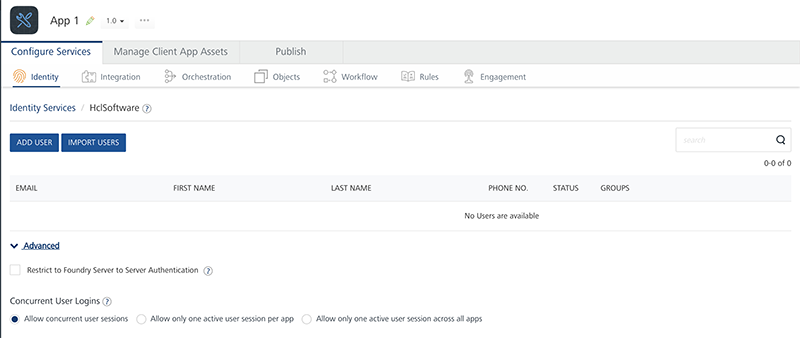

                              

User Guide: [Identity](Identity.md) > [Configure the Identity Service](ConfigureIdentiryService.md) > [User Repository](UserRepositoryIdentityService.md) > Sign-Up for a User Repository

Sign-Up for Volt MX User Repository
===================================

Sign-up is a new capability of Volt MX User Repository that allows the users to signup or register to the application by using their e-mail ID. Until V8 SP4, only an admin can add the users in the Volt MX User Repository. From V9 onwards, the users can directly signup by providing their user details.

Configuration of the Sign-Up User Flow
--------------------------------------

You can configure the sign-up feature in two ways.

*   [Invoke the Sign-up API in the Iris application.](#invoking-the-sign-up-api-in-the-iris-application)
*   [Configure the User Store Adapter.](#configuring-the-user-store-adapter)

### Invoking the Sign-Up API in the Iris Application

To enable the sign-up feature by invoking the Sign-up API, follow these steps.

1.  Sign in to [VoltMX Foundry Console](http://manage.hclvoltmx.com/).
2.  Create a User Repository Identity Service.
    
    For more information about how to create an Identity service by using the User Repository identity type, click [here](../../../Foundry/voltmx_foundry_user_guide/Content/UserRepositoryIdentityService.md#creating-a-user-repository-identity-service).
    
3.  In the Identity tab, select the **Enable Signup** check box and publish the application.
    
    
    
4.  Now, [create a project](../../../Iris/iris_user_guide/Content/Part_II_CreatingAnApplication.md) in Volt MX Iris.
5.  Link your Foundry Application to your Volt MX Iris project.
6.  To enable the sign-up feature, invoke the `identitySvc.register` API with the user details in Iris with the user details.

#### Register API

The Register API registers or signs up a new user asynchronously and executes the given callback.

Syntax

```
register (params, successCallback, failureCallback, options);
```

Parameters

  
| Parameter | Type | Description | Required |
| --- | --- | --- | --- |
| params | Object | Details of the user such as userID, password first name, and last name. | Yes |
| successCallback | Function | Method invoked on success. | Yes |
| failureCallback | Function | Method invoked on failure, | Yes |
| options | Object | Map for optional parameters. | Optional |

Sample Code:

```
//Sample code to register a user to an Identity Service.
//Currently available for Volt MX User Repository i.e. userstore
var serviceName = "userstore";
// Get an instance of SDK
var client = voltmx.sdk.getCurrentInstance();
var identitySvc = client.getIdentityService(serviceName);
var registerParams = {
    "userid": "userID",
    "password": "password",
    "first_name": "<user's-first-name>",
    "last_name": "<user's-last-name>",
    "phone": "<user's-phone-number>"
};
identitySvc.register(registerParams, function(response) {
    voltmx.print("User Registration Successful: " + JSON.stringify(response));
}, function(error) {
    voltmx.print("User Registration Failed: " + JSON.stringify(error));
});
```

### Configuring the User Store Adapter

To enable the sign-up feature by configuring the User Store Adapter, follow these steps.

1.  Import the User Store Adapter from [VoltMX Marketplace](https://marketplace.hclvoltmx.com/) to your Volt MX Foundry Console.
    
    For more information on how to import an adapter from Marketplace, click [here](../../../Foundry/voltmx_foundry_user_guide/Content/CustomDataConfig.md#importing).
    
2.  Create a User Repository Identity Service.
    
    For more information about how to create an Identity service by using the User Repository identity type, click [here](../../../Foundry/voltmx_foundry_user_guide/Content/UserRepositoryIdentityService.md#creating-a-user-repository-identity-service).
    
3.  In the Identity tab, select the **Enable Signup** check box.
    
    
    
4.  Configure an Integration service by using the adapter and type your User Repository Service Name in the Provider Name. The functionalities of the user store adapter are available as Integration service operations.
5.  In the sign-up operation, pass the user details and publish the application.

User Flow to Signup to the Application
--------------------------------------

1.  User chooses the Signup option. A User Details page appears.
2.  The user types the following details and clicks Submit.
    *   First Name
    *   Last Name
    *   E-mail ID
    *   Password
3.  Now, the user receives an activation email to the provided email ID. The email contains an activation link.
4.  After the user clicks on the activation link, he/she becomes an active member in the User Store and can sign in to the application using their credentials.

Error Codes
-----------

The user might encounter the following errors while signing up to the application:

  
| Error Code | Error Message | HTTP Status | Description |
| --- | --- | --- | --- |
| \-12 | UnSupported Operation | 400 | This error occurs when the API is invoked in the On-prem case. |
| \-4 | Invalid User Credentials | 400 | This error occurs if the user details are invalid or missing. |
| \-70 | Multiple users with same username are found | 409 | This error occurs when the registered user receives the activation email again. |
| \-7 | Invalid Provider | 400 | This error occurs if the provider is not found. |
| \-119 | Provider type is not userRepository | 400 | This error occurs if the provider of non-user repository is mentioned. |
| \-27 | given provider not exist in app services | 400 | This error occurs if the validation of the token fails. |
| \-5 | Token invalid | 401 | This error occurs if the token is invalid. |
| \-6 | Token expired | 401 | This error occurs if the token is expired. |
| \-1 | Uncategorized Failure occured | 500 | This error occurs in case of any unexpected failure. |
| \-120 | The Attempt to send email has failed | 500 | This error occurs if the email is not sent due to some reason. |
