   

Integration
===========

The Integration tab is where you define services for your application.

A service is an application component that represents the application interaction with the external data source. A service definition comprises the meta-data or the configurations required to exchange data with the external data source. For example, the configurations can be service type, service ID, input parameters, output parameters, preprocessors and postprocessors, target URL, authentication credentials if required, and type (HTTP/HTTPS).

The service definition enables the application to exchange data with any external data source. The Volt MX Foundry provides back-end for connecting to a Web service and an XML service. Even if the external data source does not expose the services to these well-known interfaces, the developer can build a Java service.

Menu path for integration service designer:

1.  After you [create an application](Adding Applications.md), in the **Configure Services** tab, click the **Integration** service tab. The **Integration** page appears and lists the existing integration services (if any).
    
    
    
2.  Click **CONFIGURE NEW** to create an integration service. The following details are displayed in the integration service designer.
    
    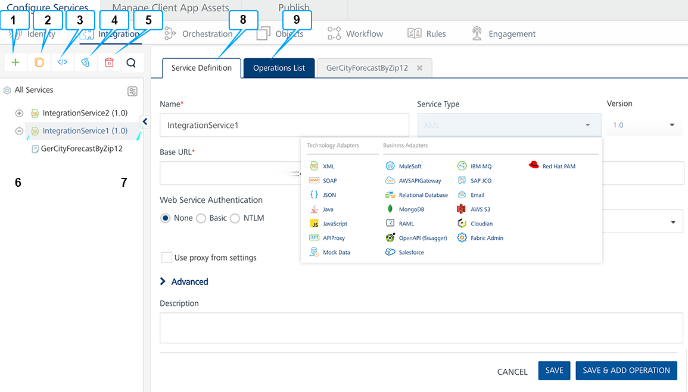
    
    
    
    The Integration page displays the following sections for an endpoint:
    
    | Number | Section | Description |
    | --- | --- | --- |
    | 1 | Add | Allows you to add the following:Add New ServiceUse ExistingAdd New Operation |
    | 2 | Clone | Allows you to duplicate an existing service. Changes made to a cloned service will not impact the original service. |
    | 3 | Sample Code | A dynamic code is generated based on the configuration of a service. You can use this code in your SDK. |
    | 4 | Unlink | Allows you remove the service from the Integration services section of an app. When a service is unlinked, it is disassociated from a particular app. |
    | 5 | Delete button | Allows you to delete a service. |
    | 6 | Search button | Allows you to search services and operations in the **Services** section. |
    | 7 | **Services section** | Configured services for an app.You can click the expand or collapse button of a service to show or hide operations in the services. |
    | 8 | **Show / Hide button** | Allows you the show or hide the tree. When you hide the tree section, the right pane is used for service definition or operations details. |
    | 9 | **Service Definition tab** | Allows you to configure service defection for an integration service. |
    | 10 | Operations List tab | Allows you to configure operations for an integration service. |
    

Volt MX  Foundry supports the following endpoints:

*   [XML](#how-to-configure-an-xml-service)
*   [SOAP](#how-to-configure-a-soap-service)
*   [JSON](#how-to-configure-a-json-service)
*   [Java](#how-to-configure-a)
*   [JavaScript](#how-to-configure-a-javascript-connector-service)
*   [Database](#how-to-configure-a-database-service)
*   [API Proxy](#how-to-configure-an-api-proxy-service)
*   [AWS API Gateway](#how-to-configure-an-aws-api-gateway-service)
*   [Salesforce](#how-to-configure-a-salesforce-service)
*   [VoltMX SAP Gateway](#how-to-configure-volt-mx-sap-gateway)
*   [MuleSoft](#how-to-configure-a-mulesoft-service)
*   [RAML](Services.md#RAML)

Salesforce is integrated with Volt MX Foundry portal, most of the details required for creating a service definition are automated. Whereas, for the remaining endpoints, you need to manually enter the details required for creating a service definition.

While configuring an integration service with basic auth mode, ensure that some reserved IDs are not used as input/header IDs. Key words such as userid, pwd and password are reserved by middleware when a user selects basic auth mode.

How to Configure an XML Service
-------------------------------

A service that communicates with an external data source using an XML endpoint over the HTTP protocol is known as an XML Service.

### Use Case

This section explains creation of an XML service for the following example:

1.  The user enters the latitude and longitude values on a form in the mobile application.
2.  The application invokes the designated XML service and hits the URL defined in the service with the longitude and latitude values as input parameters.
3.  The service fetches the response and the response is sent back to the application.
4.  The response received is displayed on a form to the user.

To configure a XML service, follow these steps:

1.  In the [integration **service definition** tab](#IntegrationSDpage), follow these steps:
    
    1.  In the **Name** field, provide a unique name for your service.
    2.  From the Service Type list, select _XML_.
        
        By default, XML is selected and the following section is displayed.
        
        
        
        
        
    3.  In the **Base URL**, type the URL.
    4.  In the **Client Authentication** field, select an identity provider from the drop-down list. This drop-down list shows identity providers only if you have created identity providers for OAuth 2.0 in the Identity page.
        
    5.  Click the **Advanced** tab to specify dependent JAR and API throttling. All options in the Advanced section are optional.
        *   **To specify dependent JAR, follow these steps**:
            
            Select the JAR containing preprocessor or postprocessor libraries from the drop-down list, or click **Upload New** to browse the JAR file from your local system. The step allows you to further filter the data sent to the back end:
            
            Make sure that you upload a custom JAR file that is built on the same JDK version used for installing Volt MX Foundry Integration.  
              
            For example, if the JDK version on the machine where Volt MX Foundry Integration is installed is 1.6, you must use the same JDK version to build your custom jar files. If the JDK version is different, an unsupported class version error will appear when a service is used from a device.
            
        *   **API throttling** enables you to limit the number of request calls within a minute. If an API exceeds the throttling limit, the API will not return the service response.**  
            To specify throttling, follow these steps:**  
            1.  In the **Total Rate Limit** text box, enter a required value. With this value, you can limit the number of requests configured in your Volt MX Foundry console in terms of Total Rate Limit.
                
            2.  In the **Per IP Rate Limit** text box, enter a required value. With this value, you can limit the number of IP address requests configured in your Volt MX Foundry console in terms of Per IP Rate Limit.
                
                To override throttling, refer to [Override API Throttling Configuration](API_Throttling_Override.md).
                
                Enable API throttling in a clustered environment by configuring the `VOLTMX_SERVER_NUMBER_OF_NODES` property in the **server\_configuration** table available in Admin database. This property indicates the number of nodes configured in the cluster. The default value is 1.
                
    
    1.  Under the **Web Service Authentication**, select one of the following modes:
        1.  **None**: Select the option if you do not want to provide any authentication for the service.
        2.  **Basic**: Provide User ID and Password if the external Web service requires form or basic authentication.
        3.  **NTLM**: Your service follows the NT LAN Manager authentication process. You are required to provide the User ID, Password, NTLM Host, and NTLM Domain.
    2.  To enable the proxy, select the **Use proxy from settings** check box. By default, the check box is cleared.  
        The **Use proxy from settings** check box dims when no proxy is configured under the **[Settings > Proxy](Settings.md#proxy)**.
2.  Click **SAVE** to save your service definition. The system displays the success message: Service Saved Successfully.  
    The **Operations List** tab appears only after the **Service Definition** is saved. The **ADD OPERATION** button in the Service Definition page is active only after you click the **SAVE** button.
3.  Click **ADD OPERATION** to display the **NewOperation** page.
    
     You can also display the **NewOperation** page. Follow these steps:  
      
     -  Click the **Operations List** tab > **CONFIGURE OPERATION**.  
     -  From the tree in the left pane, click **Add > Add New Operation**, shown below:
    
    Click to View image
    
    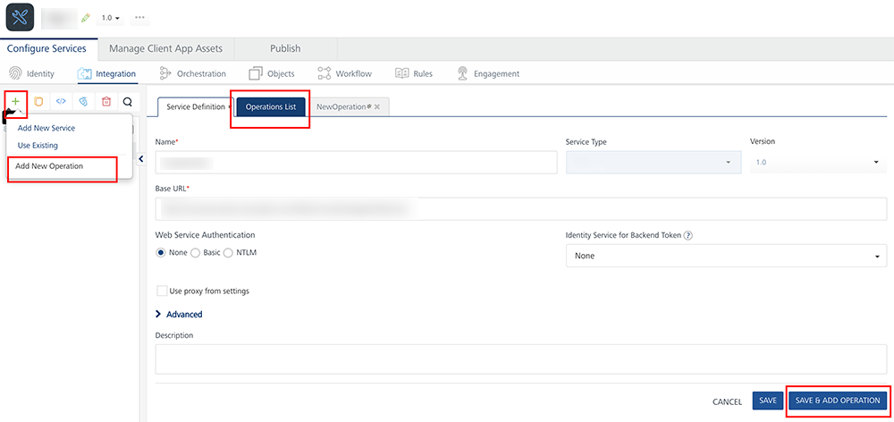
    
    To use an existing integration service, refer to [How to Use an Existing Integration Service](#how-to-use-an-existing-integration-service).
    

1.  Type a new name for the operation in the **Operation Name** box.
    
    While configuring an integration service with basic auth mode, ensure that some reserved IDs are not used as input/header IDs. Key words such as userid, pwd and password are reserved by middleware when a user selects basic auth mode.
    
    
    
2.  Select one of the following security operations in the **Operation Security Level** field. By default, the field is set to Authenticated App User :  
    
    *   **Authenticated App User** – indicates that the operation is secured. To use the operation, an app user must be authenticated by an associated identity service.
    *   **Anonymous App User** – indicates that a user must have the app key and app secret to access the operation.
    *   **Public** – indicates that the operation requires no special security.
    
3.  Select the required method for the operation from the **HTTP Methods** field.
    
    The **Target URL** field is prepopulated with the URL. You can add the suffix, if required.
    
    For example, to the base URL, you can add suffix such as `/latest`  or `/sports` to get latest news or sports news:
    
    *   ``http://feeds.foxnews.com/foxnews`/latest` ``
    *   ``http://feeds.foxnews.com/foxnews`/sports` ``

5.  Click the  Advanced tab to configure the preprocessor and postprocessor for Java and JavaScript. All options in the Advanced section are optional. For more details, refer to [Preprocessor and Postprocessor](Java_Preprocessor_Postprocessor_.md). [Click here](Java_Preprocessor_Postprocessor_.md)
    
    Configure the parameters for the preprocessor and postprocessor to filter the request and response objects for your business requirements. You can specify the Java class name or custom JavaScript code for preprocessor and postprocessor. Java class names contain the preprocessor and postprocessor.
    
    *   **Java Preprocessor and Postprocessor** - The preprocessor and postprocessor are Java classes that implement **DataPreProcessor** / **DataPreProcessor2** and **DataPostProcessor** / **DataPostProcessor2** interfaces. A developer can write custom code in the **execute** method of the preprocessor or postprocessor class.
        
        For a sample Java class code, refer to [Java Sample Code for Preprocessor and Postprocessor](Java_Pre-Post_Samples.md).
        
         You need the `middleware-system.jar` for defining custom code.**  
          
        \- For On-premises** Volt MX Foundry, you can find the jar within the installation folder `<VoltMXFoundryInstallDir>/middleware_home/` .  
          
        \- **For Cloud**, contact Volt MX Cloud Support for getting the appropriate middleware-system.jar for your server version.
        
        For details on Middleware APIs for preprocessor and postprocessor,  
        contact refer to [Volt MX App Services API](../../../../../java_docs_apis/MiddlewareAPI/index.md)
        
    *   **JavaScript Preprocessor and Postprocessor** - Based on the interface, the preprocessors and postprocessors implement the following objects:
        
        `<serviceInputParams>`, `<request>`, `<response>` and `<result>`.
        
        You can use the objects and their corresponding methods directly in JavaScript code.  
        For a sample JavaScript code, refer to [JavaScript Sample Code for Preprocessor and Postprocessor](JS_Pre-Post_Samples.md).
        
    
    The step allows you to further filter the data received from a service call.
    
    
    
    1.  Under the **Custom Code Invocation**, follow these steps:
        *   Under **Preprocessor**, configure one of the following:
            *   Select **Java**, and in the **Class** text box, enter the preprocessor class. This step enables a developer to include any business logic on the data before forwarding the request to the external data source.
            *   Select **JavaScript** to open a text box. You can write custom JavaScript code for the preprocessor.
        *   Under **Postprocessor**, configure one of the following:
            *   Select **Java**, and in the **Class** text box, enter the postprocessor class. This step enables a developer to include any business logic on the data before sending the response to a mobile device.
            *   Select **JavaScript** to open a text box. You can write custom JavaScript code for the postprocessor.
    
    1.  Under the **Properties** section, provide details for the following advanced service properties:
        
        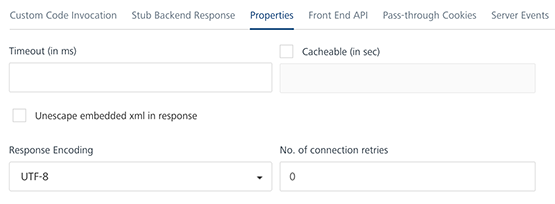
        
        *   **Timeout (in ms)** - the duration in milliseconds after which the service call times out. Provide the details in the text box.
        *   **Cache Response** - the duration in seconds within which the service response is fetched from the cache. Select the **Cache Response** check box, and provide the details in the text box.
        *   **Unescape embedded xml in response -** To ignore the MuleSoft response received in the XML value field, select the **Unescape embedded xml in response** check box.
        *   **Response Encoding -** Select the appropriate response encoding. The default value is UTF-8. For more information about different encoding schemes, refer to [Response Encoding Schemes](../../../Iris/iris_user_guide/Content/Response_Encoding.md).
    2.  Under the **Pass-through Cookies**, specify a comma separated list of cookie names. When cookies names are present in the incoming client request, these cookies are send to the backend target along with preprocessor request. A sample value looks like - cookie1, cookie2.
        
    
6.  In the **Request Input** tab, do the following:
    
    Integration services accept only `form-url-encoded` inputs for all input parameters provided in service input parameters (request input).
    
     You can add an entry by clicking the **Add Parameter** button if entries for the input and the output tabs do not exist.  
      
    \-  To make duplicate entries, select the check box for the entry, click **Copy**, and then click **Paste**.  
      
    \-  To delete an entry, select the check box for an entry, and then click the **Delete** button.
    
    
    
    | ID | Path | CollectionID |
    | --- | --- | --- |
    | channel | //channel |   |
    | Title | //item/title | channel |
    
    1.  Under the **Body** tab, do the following:
        
        *   To forward the body of the client's request to backend as it is, select the **Enable pass-through input body** check box. For more details on API Proxy service, refer to [](#how-to-enable-pass-through-proxy-for-operations)[How to Enable Pass-through Proxy for Operations](#APIProxyCheckBox).
            
            
            
        
        *   To configure parameters in the clients body, do the following:
            1.  In the **NAME** field, enter the name for the request input parameter.
            2.  **VALUE:** select request or session. By default, this field is set to **Request.** Three different options are available in Volt MX Foundry under **Request Input > Body** > **VALUE** during configuration of any operation. These options primarily determine the source of the value of the header**.**
                *   **Request**: If this option is selected, the Integration Server picks the value pairs from the client's request during run time and forwards the same to the back-end.
                    
                    User has the option to configure the default value. This default value is taken if the request does not have the header.
                    
                *   **Session**: If this option is selected, the value of header is picked from session context based on the user configuration.
                *   **Identity**: If this is selected, you can filter the request parameters based on the response from the identity provider. For more details to configure identity filters, refer to [Enhanced Identity Filters - Integration Services](Identity_Filters_Integration.md).
            3.  **TEST VALUE**: Enter a value. A test value is used for testing the service.
            4.  **DEFAULT VALUE:** enter the value if required. The default value will be used if the test value is empty.
            5.  **SCOPE:** select request or session. By default, this field is set to **Request.**
                *   **Request** - Indicates that the value must be retrieved from the HTTP request received from a mobile device.
                    
                *   **Session** - Indicates that the value must be retrieved from the HTTP session stored on Volt MX Foundry.  
                    The default data type for the selected column is loaded under the **DATATYPE** field.
            6.  Select the **Encode** check box to enable an input parameter to be encoded. For example, the name New York Times would be encoded as _New_York_Times_  when the encoding is set to True. The encoding must also adhere to the HTML URL encoding standards.
    2.  Click the **Header** tab to provide the following customer headers:  
        
        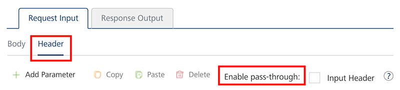
        
        Based on the operation - for example, post or get -, provide custom HTTP headers.
        
        *   To forward headers of the client's request to backend as it is, select the **Enable pass-through input header** check box. For more details on API Proxy service, refer to [How to Enable Pass-through Proxy for Operations](#how-to-enable-pass-through-proxy-for-operations).
        *   To configure parameters in the client's header, do the following.
            
            1.  In the **NAME** field, provide custom HTTP headers required by the external source.
            2.  **VALUE:** select request or session. By default, this field is set to **Request.** Five different options are available in Volt MX Foundry under **Request Input > Headers** > **VALUE** during configuration of any operation. These options primarily determine the source of the value of the header**.**
                *   **Request**: If this option is selected, the Integration Server picks the value pairs from the client's request during run time and forwards the same to the back-end.
                    
                    User has the option to configure the default value. This default value is taken if the request does not have the header.
                    
                *   **Session**: If this option is selected, the value of header is picked from session context based on the user configuration.
                *   **Constant**: Constant is used to configure the value that is picked and sent to back-end by the Integration Server during the run-time.
                *   **Expression**: Select this option to configure the velocity template expressions for the header values.
                    
                    You cannot edit the default value for expression.
                    
                *   **Identity**: If this is selected, you can filter the request parameters based on the response from the identity provider. For more details to configure identity filters, refer to [Enhanced Identity Filters - Integration Services](Identity_Filters_Integration.md).
            3.  **TEST VALUE**: Enter a value. A test value is used for testing the service.
            4.  **DEFAULT VALUE:** change the syntax if required.
            5.  **DESCRIPTION**: Enter a proper description.
        
        To validate the details, click **Fetch Response**. The result of the operation appears.
        
    3.  Click the **Response Output** tab to configure the fields of the table for displaying the data:
        
        
        
        *   To forward the response from the backend to the client as it is, select the **Enable pass-through output body** check box. For more details on API Proxy service, refer to [](#how-to-enable-pass-through-proxy-for-operations)[How to Enable Pass-through Proxy for Operations](#APIProxyCheckBox).
        
        *   To configure parameters in the response, enter the values for required fields such as name, path, scope, data type, collection ID, record ID, format and format value.
            
        
        To validate the details, click **Test**. The result of the operation appears.
        
         When you enable Pass-through proxy flags, you will notice that you cannot configure request input, headers, and response out parameters for this operation.
        
7.  Click **SAVE OPERATION** to save the changes.
    
    To use an existing integration service, refer to [How to Use an Existing Integration Service](#how-to-use-an-existing-integration-service).
    

How to Configure a SOAP Service
-------------------------------

**Use Case**

*   You can use a mobile device to find a city's weather reports based on a ZIP code. The device initiates the service request.
*   Volt MX Application Server runs the back-end processes.
*   The response is fetched from the SOAP service and is sent to the application.
*   The response is displayed to the user.

To create the service definitions for an external data source providing SOAP interface, use the SOAP Service. You need to have a WSDL URL or file to create the service definition. For this example, we will use a WSDL URL of a weather application that has a GetCityWeatherByZip service and will provide appropriate configurations for the Service Definition.

To configure a SOAP service, follow these steps:

1.  In the [integration **service definition** tab](#IntegrationSDpage), follow these steps:
    
    1.  In the **Name** field, provide a unique name for your service.
    2.  From the **Service Type** list, select _SOAP_.
        
        By default, XML is selected. If you select **SOAP**, the following section is displayed.
        
        
        
        
        
    
    1.  In the **Base URL**, type the URL
    2.  In the **Choose WSDL URL**, select the option to specify the WSDL URL or upload the WSDL file.
        *   If you click **Specify WSDL URL**, the system displays URL text box. Enter the WSDL URL.
            
            In case, if you are unable to read metadata from an integration service (for example, SOAP) that is protected by an SSL certificate, enable the integration service by following one of the ways:  
              
            \- Download the WSDL file from the https WSDL URL and upload the WSDL file on Volt MX Foundry console.  
              
            \- Importing the SSL into your cacerts in your Volt MX Foundry install location. For more details, refer to [FAQs](Appendix - FAQs.md#SOAPWSDL)
            
            In case, if you are unable to read metadata from an integration service (for example, SOAP) that is protected by an SSL certificate, enable the integration service by following:  
              
            \- Download the WSDL file from the https WSDL URL and upload the WSDL file on Volt MX Foundry console.  
            
        *   If you click **Upload WSDL File**, the system allows you to upload the WSDL file. Click the **Upload WSDL File** button to navigate to the WSDL file from your local system, and then click **Open**. The system uploads your WSDL file.
            
    3.  In the **Client Authentication** field, select an identity provider from the drop-down list. This drop-down list shows identity providers only if you have created identity providers for OAuth 2.0 in the Identity page.
        
    4.  Click the **Advanced** tab to specify dependent JAR and API throttling. All options in the Advanced section are optional.
        *   **To specify dependent JAR, follow these steps**:
            
            Select the JAR containing preprocessor or postprocessor libraries from the drop-down list, or click **Upload New** to browse the JAR file from your local system. The step allows you to further filter the data sent to the back end:
            
            Make sure that you upload a custom JAR file that is built on the same JDK version used for installing Volt MX Foundry Integration.  
              
            For example, if the JDK version on the machine where Volt MX Foundry Integration is installed is 1.6, you must use the same JDK version to build your custom jar files. If the JDK version is different, an unsupported class version error will appear when a service is used from a device.
            
        *   **API throttling** enables you to limit the number of request calls within a minute. If an API exceeds the throttling limit, the API will not return the service response.**  
            To specify throttling, follow these steps:**  
            1.  In the **Total Rate Limit** text box, enter a required value. With this value, you can limit the number of requests configured in your Volt MX Foundry console in terms of Total Rate Limit.
                
            2.  In the **Per IP Rate Limit** text box, enter a required value. With this value, you can limit the number of IP address requests configured in your Volt MX Foundry console in terms of Per IP Rate Limit.
                
                To override throttling, refer to [Override API Throttling Configuration](API_Throttling_Override.md).
                
                Enable API throttling in a clustered environment by configuring the `VOLTMX_SERVER_NUMBER_OF_NODES` property in the **server\_configuration** table available in Admin database. This property indicates the number of nodes configured in the cluster. The default value is 1.
                
    
    1.  Under the **Web Service Authentication**, select one of the following modes:
        1.  **None**: Select the option if you do not want to provide any authentication for the service.
        2.  **Basic**: Provide User ID and Password if the external Web service requires form or basic authentication.
        3.  **NTLM**: Your service follows the NT LAN Manager authentication process. You are required to provide the User ID, Password, NTLM Host, and NTLM Domain.
        4.  To enable the proxy, select the **Use proxy from settings** check box. By default, the check box is cleared.  
            The **Use proxy from settings** check box dims when no proxy is configured under the **[Settings > Proxy](Settings.md#proxy)**.
2.  Click **SAVE** to save your service definition. The system displays the success message: Service Saved Successfully.  
    The **Operations List** tab appears only after the **Service Definition** is saved. The **ADD OPERATION** button in the Service Definition page is active only after you click the **SAVE** button.
3.  Click **ADD OPERATION** to display the **Operations List** tab for adding operations.
    
     You can also add operations by following these steps:  
      
     -  Click the **Operations List** tab.  
     -  From the tree in the left pane, click **Add > Add New Operation**, shown below:
    
    Click to View image
    
    
    
    To use an existing integration service, refer to [How to Use an Existing Integration Service](#how-to-use-an-existing-integration-service).
    

1.  Under **Operations List** tab, from the **Operations** list box, select one or more check boxes.
    
    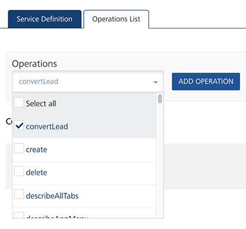
    
2.  Click **ADD OPERATION**.
    
    While configuring an integration service with basic auth mode, ensure that some reserved IDs are not used as input/header IDs. Key words such as userid, pwd and password are reserved by middleware when a user selects basic auth mode.
    
    
    
3.  Click the operation that you created. The selected operation page appears.
4.  In the **Name** field, modify the name if required.
5.  Select one of the following security operations in the **Operation Security Level** field. By default, the field is set to Authenticated App User :  
    
    *   **Authenticated App User** – indicates that the operation is secured. To use this operation, an app user must be authenticated by an associated identity service.
    *   **Anonymous App User** – indicates that a user must have the app key and app secret to access this operation.
    *   **Public** – indicates that the operation requires no special security.
    
6.  In the **Target URL** text box, modify the path if required.
    
    For example, to the base URL, you can add suffix such as `/latest`  or `/sports` to get latest news or sports news:
    
    *   ``http://feeds.foxnews.com/foxnews`/latest` ``
    *   ``http://feeds.foxnews.com/foxnews`/sports` ``

5.  Click the  Advanced tab to configure the preprocessor and postprocessor for Java and JavaScript. All options in the Advanced section are optional. For more details, refer to [Preprocessor and Postprocessor](Java_Preprocessor_Postprocessor_.md). Click here
    
    Configure the parameters for the preprocessor and postprocessor to filter the request and response objects for your business requirements. You can specify the Java class name or custom JavaScript code for preprocessor and postprocessor. Java class names contain the preprocessor and postprocessor.
    
    *   **Java Preprocessor and Postprocessor** - The preprocessor and postprocessor are Java classes that implement **DataPreProcessor** / **DataPreProcessor2** and **DataPostProcessor**/ **DataPostProcessor2** interfaces. A developer can write custom code in the **execute** method of the preprocessor or postprocessor class.
        
        For a sample Java class code, refer to [Java Sample Code for Preprocessor and Postprocessor](Java_Pre-Post_Samples.md).
        
         You need the `middleware-system.jar` for defining custom code.**  
          
        \- For On-premises** Volt MX Foundry, you can find the jar within the installation folder `<VoltMXFoundryInstallDir>/middleware_home/` .  
          
        \- **For Cloud**, contact Volt MX Cloud Support for getting the appropriate middleware-system.jar for your server version.
        
        For details on Middleware APIs for preprocessor and postprocessor,  
        contact refer to [Volt MX App Services API](../../../../../java_docs_apis/MiddlewareAPI/index.md)
        
    *   **JavaScript Preprocessor and Postprocessor** - Based on the interface, the preprocessors and postprocessors implement the following objects:
        
        `<serviceInputParams>`, `<request>`, `<response>` and `<result>`.
        
        You can use the objects and their corresponding methods directly in JavaScript code.  
        For a sample JavaScript code, refer to [JavaScript Sample Code for Preprocessor and Postprocessor](JS_Pre-Post_Samples.md).
        
    
    The step allows you to further filter the data received from a service call.
    
    
    
    1.  Under the **Custom Code Invocation**, follow these steps:
        *   Under **Preprocessor**, configure one of the following:
            *   Select **Java**, and in the **Class** text box, enter the preprocessor class. This step enables a developer to include any business logic on the data before forwarding the request to the external data source.
            *   Select **JavaScript** to open a text box. You can write custom JavaScript code for the preprocessor.
        *   Under **Postprocessor**, configure one of the following:
            *   Select **Java**, and in the **Class** text box, enter the postprocessor class. This step enables a developer to include any business logic on the data before sending the response to a mobile device.
            *   Select **JavaScript** to open a text box. You can write custom JavaScript code for the postprocessor.
    
    1.  Under the **Properties** section, provide details for the following advanced service properties:
        
        
        
        *   **Timeout (in ms)** - the duration in milliseconds after which the service call times out. Provide the details in the text box.
        *   **Cache Response** - the duration in seconds within which the service response is fetched from the cache. Select the **Cache Response** check box, and provide the details in the text box.
        *   **Unescape embedded xml in response -** To ignore the MuleSoft response received in the XML value field, select the **Unescape embedded xml in response** check box.
        *   **Response Encoding -** Select the appropriate response encoding. The default value is UTF-8. For more information about different encoding schemes, refer to [Response Encoding Schemes](../../../Iris/iris_user_guide/Content/Response_Encoding.md).
    2.  Under the **Pass-through Cookies**, specify a comma separated list of cookie names. When cookies names are present in the incoming client request, these cookies are send to the backend target along with preprocessor request. A sample value looks like - cookie1, cookie2.
    
6.  Click **Request Input** and do the following.
    
    Integration services accept only `form-url-encoded` inputs for all input parameters provided in service input parameters (request input).
    
     You can add an entry by clicking the **Add Parameter** button if entries for the input and the output tabs do not exist.  
      
    \-  To make duplicate entries, select the check box for the entry, click **Copy**, and then click **Paste**.  
      
    \-  To delete an entry, select the check box for an entry, and then click the **Delete** button.
    
    1.  Under the **Body** tab, do the following:
        
        *   To forward the body of the client's request to backend as it is, select the **Enable pass-through input body** check box. For more details on API Proxy service, refer to [](#how-to-enable-pass-through-proxy-for-operations)[How to Enable Pass-through Proxy for Operations](#APIProxyCheckBox).
            
            
            
        *   To configure parameters in the client's body, do the following.
            1.  In the **NAME** field, enter the name for the request input parameter.
            2.  **VALUE:** select request or session. By default, this field is set to **Request.** three different options are available in Volt MX Foundry under **Request Input > Body** > **VALUE** during configuration of any operation. These options primarily determine the source of the value of the header**.**
                *   **Request**: If this option is selected, the Integration Server picks the value pairs from the client's request during run time and forwards the same to the back-end.
                    
                    User has the option to configure the default value. This default value is taken if the request does not have the header.
                    
                *   **Session**: If this option is selected, the value of header is picked from session context based on the user configuration.
                *   **Identity**: If this is selected, you can filter the request parameters based on the response from the identity provider. For more details to configure identity filters, refer to [Enhanced Identity Filters - Integration Services](Identity_Filters_Integration.md).
            3.  **TEST VALUE**: Enter a value. A test value is used for testing the service.
            4.  **DEFAULT VALUE:** enter the value if required. The default value will be used if the test value is empty.
            5.  Select the **ENCODE** check box to enable an input parameter to be encoded. For example, the name New York Times would be encoded as _New_York_Times_  when the encoding is set to True. The encoding must also adhere to the HTML URL encoding standards.
    2.  Click the **Header** tab to provide the following customer headers:
        
        Based on the operation - for example, post or get -, provide custom HTTP headers. To provide customer headers, click **Header**.
        
        
        
        *   To forward the header of the client's request to backend as it is, select the **Enable pass-through input header** check box. For more details on API Proxy service, refer to [How to Enable Pass-through Proxy for Operations](#how-to-enable-pass-through-proxy-for-operations).
        *   To configure parameters in the client's header, do the following.
            
            1.  In the **NAME** field, enter the name for the request input parameter.
            2.  **VALUE:** select request or session. By default, this field is set to **Request.** Five different options are available in Volt MX Foundry under **Request Input > Headers** > **VALUE** during configuration of any operation. These options primarily determine the source of the value of the header**.**
                *   **Request**: If this option is selected, the Integration Server picks the value pairs from the client's request during run time and forwards the same to the back-end.
                    
                    User has the option to configure the default value. This default value is taken if the request does not have the header.
                    
                *   **Session**: If this option is selected, the value of header is picked from session context based on the user configuration.
                *   **Constant**: Constant is used to configure the value that is picked and sent to back-end by the Integration Server during the run-time.
                *   **Expression**: Select this option to configure the velocity template expressions for the header values.
                    
                    You cannot edit the default value for expression.
                    
                *   **Identity**: If this is selected, you can filter the request parameters based on the response from the identity provider. For more details to configure identity filters, refer to [Enhanced Identity Filters - Integration Services](Identity_Filters_Integration.md).
            3.  **TEST VALUE**: Enter a value. A test value is used for testing the service.
            4.  **DEFAULT VALUE:** enter the value if required. The default value will be used if the test value is empty.
            5.  **DESCRIPTION**: Enter a proper description.
            
            To validate the details, click **Fetch Response**. The result of the operation appears.
            
    3.  Click the **Response Output** tab to configure the fields of the table for displaying the data:
        
        
        
        *   To forward the response from the backend to the client as it is, select the **Enable pass-through output body** check box. For more details on API Proxy service, refer to [How to Enable Pass-through Proxy for Operations](#how-to-enable-pass-through-proxy-for-operations)
        
        *   To configure parameters in the response, enter the values for required fields such as name, path, scope, data type, collection ID, record ID, format and format value.
            
            | ID | Path |
            | --- | --- |
            | State | //GetCityWeatherByZIPResponse/GetCityWeatherByZIPResult /State |
            | City | //GetCityWeatherByZIPResponse/GetCityWeatherByZIPResult /City |
            | Temperature | //GetCityWeatherByZIPResponse/GetCityWeatherByZIPResult / |
            | Humidity | //GetCityWeatherByZIPResponse/GetCityWeatherByZIPResult /RelativeHumidity |
            | Wind | //GetCityWeatherByZIPResponse/GetCityWeatherByZIPResult /Wind |
            
        
        To validate the details, click **Test**. The result of the operation appears.
        
        When you enable Pass-through proxy flags, you will notice that you cannot configure request input, headers, and response out parameters for this operation.
        
7.  Click **SAVE OPERATION** to save the changes. To use an existing integration service, refer to [How to Use an Existing Integration Service](#how-to-use-an-existing-integration-service).
    

How to Configure a JSON Service
-------------------------------

A service that communicates with an external data source using JSON over the HTTP protocol, and returns a response in JSON format is known as a JSON Service. You can use the JSON services in any case where you would use an XML service. But, the response of a JSON service is in a JSON format.

#### Concepts about JSON Connector

Notations

*   JSON Object - {}
*   JSON Array - \[\]

##### Important Considerations

*   JSON Array will consist of an array of JSON Objects or a blank array.
*   JSON Object is a key value pair. The key is a String and value can be a String, number(int, float,double), JSON Object or JSON Array.
*   JSON string will not contain attributes.
*   JSON path does not provide Axes like Xpath.

##### Selecting Elements

  
| Element | Description |
| --- | --- |
| _elementname_ | Selects all child elements of the named Element. |
| _//_ | Selects elements in the document from the current element that match the selection no matter where they are. |

##### Example

  
| Path Expression | Result |
| --- | --- |
| bookstore (or) /bookstore | Selects all the child elements of the bookstore element |
| bookstore/book | Selects all book elements that are children of bookstore |
| //book | Selects all book elements no matter where they are in the JSON string |
| bookstore//book | Selects all book elements that are descendant of the bookstore element, no matter where they are under the bookstore element |

##### Predicates

Predicates are used to find a specific element or an element that contains a specific value. Predicates are always embedded in square brackets.

  
| Path Expression | Result |
| --- | --- |
| bookstore/book\[1\] | Selects the first book element that is the child of the bookstore element |
| bookstore/book\[last()\] | Selects the last book element that is the child of the bookstore element |
| bookstore/book\[last()-1\] | Selects the last but one book element that is the child of the bookstore element |
| bookstore/book\[position()<3\] | Selects the first two book elements that are children of the bookstore element |
| bookstore/book\[price>35.00\] | Selects all the book elements of the bookstore element that have a price element with a value greater than 35.00 |
| bookstore/book\[price>35.00\]/title | Selects all the title elements of the book elements of the bookstore element that have a price element with a value greater than 35.00 |

##### Operators

  
| Operator | Description | Example | Result |
| --- | --- | --- | --- |
| \> | Greater than | price>9.80 | true if price is 9.90 false if price is 9.80 |
| \>= | Greater than or equal to | price>=9.80 | true if price is 9.90 false if price is 9.70 |
| < | Less than | price<9.80 | true if price is 9.00 false if price is 9.80 |
| != | Not equal | price!=9.80 | true if price is 9.90 false if price is 9.80 |
| \= | Equal | price=9.80 | true if price is 9.80 false if price is 9.90 |

To configure a JSON service, follow these steps:

1.  In the [integration **service definition** tab](#IntegrationSDpage), follow these steps:
    
    1.  In the **Name** field, provide a unique name for your service.
    
    1.  From the Service Type list, select _JSON_. By default, XML is selected. If you select **JSON**, the following details are displayed.
        
        
        
        
        
    
    1.  In the **Base URL**, type the URL.
    2.  In the **Client Authentication** field, select an identity provider from the drop-down list. This drop-down list shows identity providers only if you have created identity providers for OAuth 2.0 in the Identity page.
    3.  Click the **Advanced** tab to specify dependent JAR and API throttling. All options in the Advanced section are optional.
        *   **To specify dependent JAR, follow these steps**:
            
            Select the JAR containing preprocessor or postprocessor libraries from the drop-down list, or click **Upload New** to browse the JAR file from your local system. The step allows you to further filter the data sent to the back end:
            
            Make sure that you upload a custom JAR file that is built on the same JDK version used for installing Volt MX Foundry Integration.  
              
            For example, if the JDK version on the machine where Volt MX Foundry Integration is installed is 1.6, you must use the same JDK version to build your custom jar files. If the JDK version is different, an unsupported class version error will appear when a service is used from a device.
            
        *   **API throttling** enables you to limit the number of request calls within a minute. If an API exceeds the throttling limit, the API will not return the service response.**  
            To specify throttling, follow these steps:**  
            1.  In the **Total Rate Limit** text box, enter a required value. With this value, you can limit the number of requests configured in your Volt MX Foundry console in terms of Total Rate Limit.
                
            2.  In the **Per IP Rate Limit** text box, enter a required value. With this value, you can limit the number of IP address requests configured in your Volt MX Foundry console in terms of Per IP Rate Limit.
                
                To override throttling, refer to [Override API Throttling Configuration](API_Throttling_Override.md).
                
    4.  Under the **Web Service Authentication**, select one of the following modes:
        1.  **None**: Select the option if you do not want to provide any authentication for the service.
        2.  **Basic**: Provide User ID and Password if the external Web service requires form or basic authentication.
        3.  **NTLM**: Your service follows the NT LAN Manager authentication process. You are required to provide the User ID, Password, NTLM Host and NTLM Domain.
    5.  To enable the proxy, select the **Use proxy from settings** check box. By default, the check box is cleared.  
        The **Use proxy from settings** check box dims when no proxy is configured under the ****[Settings > Proxy](Settings.md#proxy)****.
2.  Click **SAVE** to save your service definition. The system displays the success message: Service Saved Successfully.  
    The **Operations List** tab appears only after the **Service Definition** is saved. The **ADD OPERATION** button in the Service Definition page is active only after you click the **SAVE** button.
3.  Click **ADD OPERATION** to display the **NewOperation** page.
    
     You can also display the **NewOperation** page. Follow these steps:  
      
     -  Click the **Operations List** tab > **CONFIGURE OPERATION**.  
     -  From the tree in the left pane, click **Add > Add New Operation**, shown below:
    
    Click to View image
    
    
    
    To use an existing integration service, refer to [How to Use an Existing Integration Service](#how-to-use-an-existing-integration-service).
    
    1.  Type a new name for the operation in the **Operation Name** box.
        
        While configuring an integration service with basic auth mode, ensure that some reserved IDs are not used as input/header IDs. Key words such as userid, pwd and password are reserved by middleware when a user selects basic auth mode.
        
        
        
    2.  Select one of the following security operations in the **Operation Security Level** field. By default, the field is set to Authenticated App User:  
        
        *   **Authenticated App User** – indicates that the operation is secured. To use the operation, an app user must be authenticated by an associated identity service.
        *   **Anonymous App User** – indicates that a user must have the app key and app secret to access this operation.
        *   **Public** – indicates that the operation requires no special security.
        
    3.  Select the required method for the operation from the **HTTP Methods** field.
        
        The **Target URL** field is prepopulated with the URL. You can add the suffix, if required.
        
        For example, to the base URL, you can add suffix such as `/latest`  or `/sports` to get latest news or sports news:
        
        *   ``http://feeds.foxnews.com/foxnews/`latest` ``
        *   ``http://feeds.foxnews.com/foxnews/`sports` ``
4.  Click the  Advanced tab to configure the preprocessor and postprocessor for Java and JavaScript. All options in the Advanced section are optional. For more details, refer to [Preprocessor and Postprocessor](Java_Preprocessor_Postprocessor_.md). Click here
    
    Configure the parameters for the preprocessor and postprocessor to filter the request and response objects for your business requirements. You can specify the Java class name or custom JavaScript code for preprocessor and postprocessor. Java class names contain the preprocessor and postprocessor.
    
    *   **Java Preprocessor and Postprocessor** - The preprocessor and postprocessor are Java classes that implement **DataPreProcessor** / **DataPreProcessor2** and **DataPostProcessor**/ **DataPostProcessor2** interfaces. A developer can write custom code in the **execute** method of the preprocessor or postprocessor class.
        
        For a sample Java class code, refer to [Java Sample Code for Preprocessor and Postprocessor](Java_Pre-Post_Samples.md).
        
         You need the `middleware-system.jar` for defining custom code.**  
          
        \- For On-premises** Volt MX Foundry, you can find the jar within the installation folder `<VoltMXFoundryInstallDir>/middleware_home/` .  
          
        \- **For Cloud**, contact Volt MX Cloud Support for getting the appropriate middleware-system.jar for your server version.
        
        For details on Middleware APIs for preprocessor and postprocessor,  
        contact refer to [Volt MX App Services API](../../../../../java_docs_apis/MiddlewareAPI/index.md)
        
    *   **JavaScript Preprocessor and Postprocessor** - Based on the interface, the preprocessors and postprocessors implement the following objects:
        
        `<serviceInputParams>`, `<request>`, `<response>` and `<result>`.
        
        You can use the objects and their corresponding methods directly in JavaScript code.  
        For a sample JavaScript code, refer to [JavaScript Sample Code for Preprocessor and Postprocessor](JS_Pre-Post_Samples.md).
        
    
    The step allows you to further filter the data received from a service call.
    
    
    
    1.  Under the **Custom Code Invocation**, follow these steps:
        *   Under **Preprocessor**, configure one of the following:
            *   Select **Java**, and in the **Class** text box, enter the preprocessor class. This step enables a developer to include any business logic on the data before forwarding the request to the external data source.
            *   Select **JavaScript** to open a text box. You can write custom JavaScript code for the preprocessor.
        *   Under **Postprocessor**, configure one of the following:
            *   Select **Java**, and in the **Class** text box, enter the postprocessor class. This step enables a developer to include any business logic on the data before sending the response to a mobile device.
            *   Select **JavaScript** to open a text box. You can write custom JavaScript code for the postprocessor.
    2.  Under the **Properties** section, provide details for the following advanced service properties:
        
        
        
        *   **Timeout (in ms)** - the duration in milliseconds after which the service call times out. Provide the details in the text box.
        *   **Cache Response** - the duration in seconds within which the service response is fetched from the cache. Select the **Cache Response** check box, and provide the details in the text box.
        *   **Unescape embedded xml in response -** To ignore the MuleSoft response received in the XML value field, select the **Unescape embedded xml in response** check box.
        *   **Response Encoding -** Select the appropriate response encoding. The default value is UTF-8. For more information about different encoding schemes, refer to [Response Encoding Schemes](../../../Iris/iris_user_guide/Content/Response_Encoding.md).
    3.  Under the **Pass-through Cookies**, specify a comma separated list of cookie names. When cookies names are present in the incoming client request, these cookies are send to the backend target along with preprocessor request. A sample value looks like - cookie1, cookie2.
    
5.  In the **Request Input** tab, do the following:
    
    Integration services accept only `form-url-encoded` inputs for all input parameters provided in service input parameters (request input).
    
     You can add an entry by clicking the **Add Parameter** button if entries for the input and the output tabs do not exist.  
      
    \-  To make duplicate entries, select the check box for the entry, click **Copy**, and then click **Paste**.  
      
    \-  To delete an entry, select the check box for an entry, and then click the **Delete** button.
    
    1.  Under the **Body** tab, do the following:
        *   To forward the body of the client's request to backend as it is, select the **Enable pass-through input body** check box. For more details on API Proxy service, refer to [How to Enable Pass-through Proxy for Operations](#how-to-enable-pass-through-proxy-for-operations).
            
            
            
        *   To configure parameters in the client's body, do the following:
            
            1.  In the **NAME** field, enter the name for the request input parameter.
            2.  **VALUE:** select request or session. By default, this field is set to **Request.** three different options are available in Volt MX Foundry under **Request Input > Body** > **VALUE** during configuration of any operation. These options primarily determine the source of the value of the header**.**
                *   **Request**: If this option is selected, the Integration Server picks the value pairs from the client's request during run time and forwards the same to the back-end.
                    
                    User has the option to configure the default value. This default value is taken if the request does not have the header.
                    
                *   **Session**: If this option is selected, the value of header is picked from session context based on the user configuration.
                *   **Identity**: If this is selected, you can filter the request parameters based on the response from the identity provider. For more details to configure identity filters, refer to [Enhanced Identity Filters - Integration Services](Identity_Filters_Integration.md).
            3.  In the **TEST VALUE** filed, enter the user input for the selected column.
            
            1.  In the **DEFAULT VALUE**, enter the value if required. The default value will be used if the test value is empty.
            2.  Select the **Encode** check box to enable an input parameter to be encoded. For example, the name New York Times would be encoded as _New_York_Times_  when the encoding is set to True. The encoding must also adhere to the HTML URL encoding standards.
    2.  Click the **Header** tab to provide the following customer headers:  
        Based on the operation - for example, post or get -, provide custom HTTP headers.
        *   To forward the header of the client's request to backend as it is, select the **Enable pass-through input header** check box. For more details on API Proxy service, refer to [How to Enable Pass-through Proxy for Operations](#how-to-enable-pass-through-proxy-for-operations).
            
            
            
        *   To configure parameters in the client's header, do the following.  
            
            1.  In the **NAME** field, provide custom HTTP headers required by the external source.
            2.  **VALUE:** select request or session. By default, this field is set to **Request.** Five different options are available in Volt MX Foundry under **Request Input > Headers** > **VALUE** during configuration of any operation. These options primarily determine the source of the value of the header**.**
                *   **Request**: If this option is selected, the Integration Server picks the value pairs from the client's request during run time and forwards the same to the back-end.
                    
                    User has the option to configure the default value. This default value is taken if the request does not have the header.
                    
                *   **Session**: If this option is selected, the value of header is picked from session context based on the user configuration.
                *   **Constant**: Constant is used to configure the value that is picked and sent to back-end by the Integration Server during the run-time.
                *   **Expression**: Select this option to configure the velocity template expressions for the header values.
                    
                    You cannot edit the default value for expression.
                    
                *   **Identity**: If this is selected, you can filter the request parameters based on the response from the identity provider. For more details to configure identity filters, refer to [Enhanced Identity Filters - Integration Services](Identity_Filters_Integration.md).
            3.  **TEST VALUE**: Enter a value. A test value is used for testing the service.
            4.  **DEFAULT VALUE:** change the syntax if required.
            5.  **DESCRIPTION**: Enter a proper description.
                
            
            To validate the details, click **Fetch Response**. The result of the operation appears.
            
    3.  Click the **Response Output** tab to configure the fields of the table for displaying the data:
        
        
        
        *   To forward the response from the backend to the client as it is, select the **Enable pass-through output body** check box. For more details on API Proxy service, refer to [How to Enable Pass-through Proxy for Operations](#how-to-enable-pass-through-proxy-for-operations).
        
        *   To configure parameters in the response, enter the values for required fields such as name, path, scope, data type, collection ID, record ID, format and format value.
            
        
        Enter the values for required fields such as name, path, scope, data type, collection ID, record ID, format and format value.
        
        | ID | Path |
        | --- | --- |
        | city | //current\_observation/display\_location/city |
        | latitude | //current\_observation/display\_location/latitude |
        | longitude | //current\_observation/display\_location/longitude |
        | temperature | //current\_observation/temp\_c |
        | relative\_humidity | //current\_observation/relative\_humidity |
        | windspeed | //current\_observation/wind\_string |
        | icon | //current\_observation/icon |
        | icon\_url | //current\_observation/icon\_url |
        | forecast\_url | //current\_observation/forecast\_url |
        
        To validate the details, click **Test**. The result of the operation appears.
        
         When you enable Pass-through proxy flags, you will notice that you cannot configure request input, headers, and response out parameters for this operation.
        
6.  Click **SAVE OPERATION** to save the changes.  
    To use an existing integration service, refer to [How to Use an Existing Integration Service](#how-to-use-an-existing-integration-service).
    

Adding a Service Definition for non-Salesforce endpoints
--------------------------------------------------------

To add a service definition, follow these steps:

1.  In the **Integration** tab, click **Add New Integration**, and then click **Configure New**.
2.  Provide unique name for your service.
3.  Under the **Endpoint**, provide the following details:
    1.  Select an **EndPoint Type**.
    2.  Type the Base URL address.
    3.  WSDL URL (for SOAP endpoint only): Type the WSDL URL that contains the _wsdl_ file.
        
        Applicable to SOAP endpoint only.
        
    4.  Expand **Advanced** and select the authentication mode.
        1.  **None**: Select the option if your services does not require authentication for your application.
        2.  **Basic**: Provide User ID and Password if the external Web service requires form or basic authentication.
        3.  **NTLM**: Your service follows the NT LAN Manager authentication process. You are required to provide the User ID, Password, NTLM Host and NTLM Domain.
            
            
            
    5.  Click **Continue** to display **Operations** page.
        
        
        
4.  Type a new name for the operation.
5.  Select an HTTP method from the list.
6.  For a successful service call, you have to provide the following operations details:
    1.  **Input**: On this tab, you can provide details of the call. You can also validate the call by clicking **Test**. On the **Result** tab, you can see the response received from the Endpoint URL. 
    2.  **Output**: On this tab, you can refine the data being received from the service call.
        
        
        
    3.  **Advanced**: On this tab,
        *   From the **Custom Code Invocation**, if you want to further filter the data Received from the service call, you can upload the JAR file containing the Preprocessor Class Name and Postprocessor Class name.
        *   **HTTP Headers**: You can provide the HTTP Headers for the call.
        *   **Properties**: You can configure various advanced service properties.
            
            
            
    4.  Click **Save**.

How to Configure a Java Connector
---------------------------------

With Java service, you can interact with your software application that does not support restful APIs. A service that uses a custom Java connector is a Java service. The Java connector is a custom Java class and you can create a Java connector either by implementing `com.hcl.voltmx.middleware.common.JavaService` interface or `com.hcl.voltmx.middleware.common.JavaService2` interface. Volt MX recommends to use JavaService2 as you can get an access to `DataControllerRequest` and `DataControllerResponse` objects.

You must load the required JAR files to define a Java service. The JAR files contain the Java classes. The Java classes contain the Java methods. These methods have the logic defined that is required for a service. Java services are mostly used with Webconnector Services.

The `middleware-system.jar` helps you to develop a Java connector. You can download the `middleware-system.jar` from Admin Console's download page.

### Data Conversion of a Java Service

Click here for more details

The data structure of the Volt MX Result object `(com.hcl.voltmx.middleware.datamapping.Result)` shows that all the data is converted, but the complete data in the Volt MX Result object in not exposed as expected. You get a part of the data in Volt MX Foundry because only a few unnamed records are converted into an object instead of an array.

The use of JSON Arrays is particularly important for the mapping of data in user interface segments that require arrays as data input.

The following code details sample original JSON data, data converted to Volt MX Object, and in the result - data converted only limited unnamed records into an object in Volt MX Foundry (loss of data).

```
 
                        **//Sample: Original JSON Data:** 
{"booking":[
{"amount":-254.6,"description":"Paiement carte BIM STORES PALMIER  le 21/02/2016 à 18:54","doc_id":17150820,"value_date":"2016-02-19","temporary":false,"date":"2016-02-21"},{"amount":-44.26,"description":"Paiement internet LYDEC ECOM  le 19/02/2016 à 13:04","doc_id":17146660,"value_date":"2016-02-18","temporary":false,"date":"2016-02-19"},{"amount":-37.26,"description":"Paiement internet LYDEC ECOM  le 19/02/2016 à 13:19","doc_id":17146835,"value_date":"2016-02-18","temporary":false,"date":"2016-02-19"},{"amount":-14.34,"description":"Paiement internet LYDEC ECOM  le 19/02/2016 à 13:11","doc_id":17146744,"value_date":"2016-02-18","temporary":false,"date":"2016-02-19"}
]}
  
**Sample: Data converted to VOLTMX Object:**  
Dataset [id=booking, index=-1, 
	records=[
		Record [index=-1, order=0, id=, 
			params=[
				Param [name=amount, value=-254.6], 
				Param [name=description, value=Paiement carte BIM STORES PALMIER  le 21/02/2016 à 18:54], 
				Param [name=doc_id, value=17150820], 
				Param [name=value_date, value=2016-02-19], 
				Param [name=temporary, value=false], 
				Param [name=date, value=2016-02-21]
			], datasets=[], records=[]
			], Record [index=-1, order=0, id=, 
			params=[
				Param [name=amount, value=-44.26], 
				Param [name=description, value=Paiement internet LYDEC ECOM  le 19/02/2016 à 13:04], 
				Param [name=doc_id, value=17146660], 
				Param [name=value_date, value=2016-02-18], 
				Param [name=temporary, value=false], 
				Param [name=date, value=2016-02-19]
			], datasets=[], records=[]
			], 
  
  
//Sample: Data converted only limited unnamed records into an object in Volt MX Foundry:  
"booking": {
            "": {
                "date": "2016-02-21",
                "temporary": "false",
                "amount": "-254.6",
                "description": "Paiement carte BIM STORES PALMIER  le 21/02/2016 à 18:54",
                "doc_id": "17150820",
                "value_date": "2016-02-19"
            }
		}

```

### Writing a Java Class

To write a Java class for a Java connector, follow these steps:

1.  Create a Java connector either by implementing the `com.hcl.voltmx.middleware.common.JavaService` interface or `com.hcl.voltmx.middleware.common.JavaService2` interface.
2.  When you implement `com.hcl.voltmx.middleware.common.JavaService`, you have to implement the following `invoke()` method with the signature:
```
 public Object invoke(String paramString, Object[] paramArrayOfObject) throws Exception;
```
3.  When you implement `com.hcl.voltmx.middleware.common.JavaService2`, you have to implement the following `invoke()` method with the signature:
```
 public Object invoke(String methodID, Object[] objectArray, DataControllerRequest request, DataControllerResponse response) throws Exception;
```

Adding a Java service involves the following steps:

*   [How to Configure a New Java Connector Integration Service](#how-to-configure-a-new-java-connector-integration-service)
*   [How to Edit an Existing Java Connector Integration Service](#how-to-edit-an-existing-java-connector-integration-service)

### How to Configure a New Java Connector Integration Service

To configure your Java connector, follow these steps:

1.  In the [integration **service definition** tab](#IntegrationSDpage), follow these steps:
    1.  In the **Name** field, enter a name – for example, Java\_operation.
    2.  From the **Service Type** drop-down list, select **JAVA**.
        
    3.  From the **Specify Java Connector Jar** list, select a JAR file, or click **Upload** **New** to select the JARs from your local machine. The system adds your main JAR file to the console. The system displays the added JAR file's name under the Specify Java Connector Jar field.
        
        The system allows you to select and upload only one JAR file at **Specify Java Connector Jar**. The main JAR file contains Volt MX middleware java services.
        
        You can delete an uploaded JAR file by clicking the **Delete** button.
        
        To upload an updated JAR file, upload the new file, which must have the same name as the old JAR file. The new JAR file overrides the existing file.
        
    4.  Under the **Specify Dependent Jar** list, select one or more JAR files if the main JAR depends only on external JARs. You can also click **Upload New** to select the JARs from your local machine. The system adds JAR files to the console.
        
        You can remove an existing dependent JAR file from the console. Click the Unlink button. The system displays the Unlink JAR confirmation message window. Click confirm. The JAR file is removed from the Specify Dependent Jar section.
        
    5.  Click the **Advanced** tab to specify dependent JAR and API throttling. All options in the Advanced section are optional.
        *   **To specify dependent JAR, follow these steps**:
            
            Select the JAR containing preprocessor or postprocessor libraries from the drop-down list, or click **Upload New** to browse the JAR file from your local system. The step allows you to further filter the data sent to the back end:
            
            Make sure that you upload a custom JAR file that is built on the same JDK version used for installing Volt MX Foundry Integration.  
              
            For example, if the JDK version on the machine where Volt MX Foundry Integration is installed is 1.6, you must use the same JDK version to build your custom jar files. If the JDK version is different, an unsupported class version error will appear when a service is used from a device.
            
        *   **API throttling** enables you to limit the number of request calls within a minute. If an API exceeds the throttling limit, the API will not return the service response.**  
            To specify throttling, follow these steps:**  
            1.  In the **Total Rate Limit** text box, enter a required value. With this value, you can limit the number of requests configured in your Volt MX Foundry console in terms of Total Rate Limit.
                
            2.  In the **Per IP Rate Limit** text box, enter a required value. With this value, you can limit the number of IP address requests configured in your Volt MX Foundry console in terms of Per IP Rate Limit.
                
                To override throttling, refer to [Override API Throttling Configuration](API_Throttling_Override.md).
                
2.  Click **SAVE** to save your service definition. The system displays the success message: Service Saved Successfully.  
    The **Operations List** tab appears only after the **Service Definition** is saved. The **ADD OPERATION** button in the Service Definition page is active only after you click the **SAVE** button.
3.  Click **ADD OPERATION** to display **Operations List** tab for adding operations.
    
     You can also add operations by following these steps:  
      
     -  Click the **Operations List** tab.  
     -  From the tree in the left pane, click **Add > Add New Operation**, shown below:
    
    Click to View image
    
    
    
    To use an existing integration service, refer to [How to Use an Existing Integration Service](#how-to-use-an-existing-integration-service).
    
    1.  Under **Operations List** tab, in the **Operation name** text box, enter a name – for example, Java\_operation.
    2.  From the Class Name drop-down list, select the Java class that has the method defined.
    3.  Click **ADD OPERATION** to display the Operation Modal tab.
        
4.  In the **Operation Modal** tab, follow these steps:
    
    This tab contains the request input, response output, and advanced sections. The input values are data types, scope, and format types. By default, the system will display the **Request Input** tab.  
    
    
    
    You can add an entry by clicking the **Add** button if entries for the input and the output tabs do not exist.  
      
    You can also delete an entry. Select the check box for an entry, and then click the **Delete** button.
    
    1.  In the **Name** field, modify the name if required.
    2.  Select one of the following security operations in the **Operation Security Level** field. By default, the field is set to Authenticated App User :  
        
        *   **Authenticated App User** – indicates that the operation is secured. To use the operation, an app user must be authenticated by an associated identity service.
        *   **Anonymous App User** – indicates that a user must have the app key and app secret to access this operation.
        *   **Public** – indicates that the operation requires no special security.
        
5.  Click the  Advanced tab to configure the preprocessor and postprocessor for Java and JavaScript. All options in the Advanced section are optional. For more details, refer to [Preprocessor and Postprocessor](Java_Preprocessor_Postprocessor_.md). Click here
    
    Configure the parameters for the preprocessor and postprocessor to filter the request and response objects for your business requirements. You can specify the Java class name or custom JavaScript code for preprocessor and postprocessor. Java class names contain the preprocessor and postprocessor.
    
    *   **Java Preprocessor and Postprocessor** - The preprocessor and postprocessor are Java classes that implement **DataPreProcessor** / **DataPreProcessor2** and **DataPostProcessor**/ **DataPostProcessor2** interfaces. A developer can write custom code in the **execute** method of the preprocessor or postprocessor class.
        
        For a sample Java class code, refer to [Java Sample Code for Preprocessor and Postprocessor](Java_Pre-Post_Samples.md).
        
         You need the `middleware-system.jar` for defining custom code.**  
          
        \- For On-premises** Volt MX Foundry, you can find the jar within the installation folder `<VoltMXFoundryInstallDir>/middleware_home/` .  
          
        \- **For Cloud**, contact Volt MX Cloud Support for getting the appropriate middleware-system.jar for your server version.
        
        For details on Middleware APIs for preprocessor and postprocessor,  
        contact refer to [Volt MX App Services API](../../../../../java_docs_apis/MiddlewareAPI/index.md)
        
    *   **JavaScript Preprocessor and Postprocessor** - Based on the interface, the preprocessors and postprocessors implement the following objects:
        
        `<serviceInputParams>`, `<request>`, `<response>` and `<result>`.
        
        You can use the objects and their corresponding methods directly in JavaScript code.  
        For a sample JavaScript code, refer to [JavaScript Sample Code for Preprocessor and Postprocessor](JS_Pre-Post_Samples.md).
        
    
    The step allows you to further filter the data received from a service call.
    
    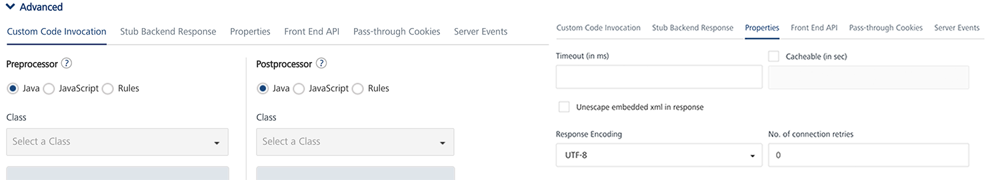
    
    1.  Under the **Custom Code Invocation**, follow these steps:
        *   Under **Preprocessor**, configure one of the following:
            *   Select **Java**, and in the **Class** text box, enter the preprocessor class. This step enables a developer to include any business logic on the data before forwarding the request to the external data source.
            *   Select **JavaScript** to open a text box. You can write custom JavaScript code for the preprocessor.
        *   Under **Postprocessor**, configure one of the following:
            *   Select **Java**, and in the **Class** text box, enter the postprocessor class. This step enables a developer to include any business logic on the data before sending the response to a mobile device.
            *   Select **JavaScript** to open a text box. You can write custom JavaScript code for the postprocessor.
    2.  Under the **Properties** section, provide details for the following advanced service properties:
        
        
        
        *   **Timeout (in ms)** - the duration in milliseconds after which the service call times out. Provide the details in the text box.
        *   **Cache Response** - the duration in seconds within which the service response is fetched from the cache. Select the **Cache Response** check box, and provide the details in the text box.
        *   **Unescape embedded xml in response -** To ignore the MuleSoft response received in the XML value field, select the **Unescape embedded xml in response** check box.
        *   **Response Encoding -** Select the appropriate response encoding. The default value is UTF-8. For more information about different encoding schemes, refer to [Response Encoding Schemes](../../../Iris/iris_user_guide/Content/Response_Encoding.md).
    
6.  In the **Request Input** > **Body** tab, provide the following details:
    
    Integration services accept only `form-url-encoded` inputs for all input parameters provided in service input parameters (request input).
    
     You can add an entry by clicking the **Add Parameter** button if entries for the input and the output tabs do not exist.  
      
    \-  To make duplicate entries, select the check box for the entry, click **Copy**, and then click **Paste**.  
      
    \-  To delete an entry, select the check box for an entry, and then click the **Delete** button.
    
    1.  The **NAME** field contains a unique identifier for a parameter. Change the identifier if required.
    2.  In the **Default value** field, change the syntax if required.
    3.  Select a data type in the **Data Type** field:
        *   **String** - A combination of alphanumeric and special characters. String supports all formats including UTF-8 and UTF-16 with no maximum size limit.
        *   **Boolean** - A value that is true or false.
        *   **Number** - An integer or a floating number.
        *   **Collection** - A group of data or data set.
    4.  Select request or session in the **Scope** field. By default, this field is set to **Request**.
        
        *   **Request** - Indicates that the value must be retrieved from the HTTP request received from a mobile device.
        *   **Session** - Indicates that the value must be retrieved from the HTTP session stored on Volt MX Foundry.
    5.  In the **Description**, provide the description.
7.  Click the **Response Output** tab, and enter the values for required fields such as name, scope, data type, collection ID, record ID, format and format value.
    
    In Java service, the response (output) from a backend is not parsed based on the response values. The complete response from the backend is sent to the client device.
    
    By default, the `opStatus` and `httpStatusCode` values for Java and JavaScript services are added as 0 and 200.
    
8.  Click the **Response Output** tab, and follow these steps:
    
    
    
    1.  The **Name** field contains a unique identifier for a parameter. Change the identifier if required.
    2.  Select request or session in the **Scope** field. By default, this field is set to **Request**.
        *   **Request** - Indicates that the value must be retrieved from the HTTP request received from a mobile device.
        *   **Session** - Indicates that the value must be retrieved from the HTTP session stored on Volt MX Foundry.
    3.  Select a data type in the **Data Type** field:
        *   **String** - A combination of alphanumeric and special characters. String supports all formats including UTF-8 and UTF-16 with no maximum size limit.
        *   **Boolean** - A value that is true or false.
        *   **Number** - An integer or a floating number.
        *   **Record** - A group data elements under the specified parameter. A record can also be part of a collection. Typically, a record provides metadata to a segment. For more details, refer to [How to Create a Collection Data Type](#how-to-create-a-collection-data-type-for-java-service).
        *   **Collection** - A group of data, also referred to as data set. A collection contains only records, and a record contains string, boolean, or number values. For more details, refer to [How to Create a Collection Data Type](#how-to-create-a-collection-data-type-for-java-service).
    4.  Select a format type in the **Format Type** list.
        *   **None** - No format.
        *   **Currency -** Currency format.
        *   **Number** \- Number format.
        *   **Date** \- Date format.
        
        *   If datatype is string, then the options in the Format Type are Currency, Number and Date.
            
        *   If the datatype is number, then the options in the Format Type are Currency and Date.
            
        *   If the datatype is boolean, then the options in the Format Type and Format Value text box are disabled.
            
        
    5.  In the **Format Value** field, provide the standard for converting the specified format.  
        For example, enter a date format as **MMDDYY** to display the date in Month/Date/Year.
        *   **Currency** - For currency format, refer to [java.text.DecimalFormat](http://docs.oracle.com/javase/7/docs/api/java/text/DecimalFormat.html).
        *   **Number** - For number format, refer to [java.text.DecimalFormat](http://docs.oracle.com/javase/7/docs/api/java/text/DecimalFormat.html).
        *   **Date** - For date format, refer to [java.text.SimpleDateFormat](http://docs.oracle.com/javase/7/docs/api/java/text/SimpleDateFormat.html).
9.  Click **SAVE OPERATION** to save the operation. The system updates the operation definition.
    
    If you click **Cancel**, the **Edit Service Parameters** window will close without saving any information.
    
    To add more operations for your Java service, repeat [Step 3 through Step 4.](#sTEP3)
    

#### How to Create a Collection Data Type for Java Service

To create a collection data type, follow these steps:

1.  In the **Operation Modal** tab > the **Output** tab, click the **Add Parameter** button. A new row is added.
2.  In the **NAME** field, enter the name - for example Collection1, and select the datatype as **Collection**. Complete the other fields as required.  
    Select the check box, and click the **Add** button, shown below:  
    
    
    A row appears under Collection1.
    
    If you select the check box for **Collection**, you can add more records under a collection.
    
    
    
3.  Clear the check box that you selected.  
    In the new row's **ID** text box, enter the name (for example, Record1), and select the datatype as **Record**.  
    Fill the other fields as required.  
    Select only the check box for this row, and click the **Add** button, shown below:  
    
    Ensure that you have selected the check box for a Collection or Record before adding a row under it.  
    
    
    
    A row appears under Record1.
    
    
    
    If you select the check box for **Record**, you can add parameters under a record.
    

### How to Edit an Existing Java Connector Integration Service

If you want to edit an existing Java service, you can edit details such as service name, JAR files, operation modal details. While editing a Java service, you can change the Java service type. A Java service must be available in the Integration home screen. To add an existing Integration service, refer to **[Use an Existing Service](#Use)**.

To edit an existing Java service, follow these steps:

1.  In the **Integration** page, click one of your Java services.
2.  Under **Operations** > **Configured** **Operations**, hover your cursor over the required service, click the **Settings** button, and then click **Edit**.
    
    The operation details are displayed in the **Edit Service Parameters** dialog.
    
    
    
3.  Make the necessary changes in the **Service Definition** section, and click **Update**.  
    For more details, refer to [How to Configure Service Definition for Java Service](#JC_ServiceDefinition).
4.  Under the **Operation** section, hover your cursor over the required service, click the **Settings** button, and then click **Edit** to display the **Operation Modal** tab.  
    To modify Java operations, refer to **[How to Configure and Edit Operation Modal](#JC_OperationModal)**.
5.  Click **Done** to update your Java service. The Integration page is displayed.

How to Configure a JavaScript Connector Service
-----------------------------------------------

With the JavaScript Connector service, you can integrate plain JavaScript services to applications in Volt MX Foundry.

You can upload custom JavaScript files to Volt MX Foundry. Using JavaScript connectors, you can easily create server-side code and make it available as operations. The JavaScript file must contain functions that a user wants to be made available as operations, along with other supporting functions. You can also add preprocessor and postprocessor to the operations defined. For more details on the structure for JavaScript function definitions, refer to the [Limitations](#limitations-for-javascript-engine-javascript-connector) section.

For more details about the sample JavaScript code, refer to [JavaScript Sample Code for Preprocessor and Postprocessor](JS_Pre-Post_Samples.md).

Based on the JDK version supported by Volt MX Foundry Installer, the JavaScript Connector uses the following JavaScript engines:

*   If the Java version is 1.7 or 1.8, then the connector uses Nashorn JavaScript engine
*   If the Java version is below 1.7 , then the connector uses Rhino JavaScript engine

### How to Configure a New JavaScript Connector Integration Service

To configure a JavaScript connector, follow these steps:

1.  In the [integration **service definition** tab](#IntegrationSDpage), follow these steps:
    1.  In the **Name** field, enter a name – for example, JavaScript\_Service.
    2.  From the **Service Type** drop-down list, select **JavaScript**.
        
    3.  From the **Versions** drop-down list, select the required version. You can select only one version of the service.
        
    4.  From the **Specify the Javascript libraries** section, select a .JS file, or click **Upload** to select the .JS file from your local machine. The console adds your JS file to the console. The system displays the added JS file's name under the **Specify the Javascript libraries** section.
        
        The system allows you to upload more than one JS file at **Specify the Javascript libraries**.
        
        Once uploaded, JavaScript files are available across Volt MX Foundry console. They cannot be deleted, only unlinked. You can unlink uploaded .JS files by clicking the **Unlink** button.
        
    5.  Click the **Advanced** tab to specify API throttling. All options in the Advanced section are optional.
        *   API throttling enables you to limit the number of request calls within a minute. If an API exceeds the throttling limit, the API will not return the service response.**  
            To specify throttling, follow these steps:**  
            1.  In the **Total Rate Limit** text box, enter a required value. With this value, you can limit the number of requests configured in your Volt MX Foundry console in terms of Total Rate Limit.
                
            2.  In the **Per IP Rate Limit** text box, enter a required value. With this value, you can limit the number of IP address requests configured in your Volt MX Foundry console in terms of Per IP Rate Limit.
                
                To override throttling, refer to [Override API Throttling Configuration](API_Throttling_Override.md).
                
                Enable API throttling in a clustered environment by configuring the `VOLTMX_SERVER_NUMBER_OF_NODES` property in the **server\_configuration** table available in Admin database. This property indicates the number of nodes configured in the cluster. The default value is 1.
                
2.  Click **SAVE** to save your service definition. The system displays the success message: Service Saved Successfully.  
    The **Operations List** tab appears only after the **Service Definition** is saved. The **ADD OPERATION** button in the Service Definition page is active only after you click the **SAVE** button.
3.  Click **ADD OPERATION** to display **Operations List** tab for adding operations to the service.
    
     You can also add operations by following these steps:  
      
     -  Click the **Operations List** tab.  
     -  From the tree in the left pane, click **Add > Add New Operation**, shown below:
    
    Click to View image
    
    
    
    To use an existing integration service, refer to [How to Use an Existing Integration Service](#how-to-use-an-existing-integration-service).
    
    1.  Under **Operations List** tab, in the **JS Library** drop-down list, select the required .JS file – for example, Sample.js. This will populate the Function drop-down list.
    2.  From the **Function** drop-down list, select the required functions. Each function equates to an operation.
    3.  Click **ADD OPERATION** to create operations with the selected functions.  
        The new operations are created and listed under the **Configured Operations**.
        
        Operations name are auto-generated in the format : <Name-of-the-JS-file>\_<function-name>. For example, `sample_addTwoNumbers`
        
4.  Click the operation. In the **Operation Modal** tab, follow these steps:
    
    The tab contains the request input, response output, and advanced sections. The input values are data types, scope, and format types. By default, the system will display the **Request Input** tab.  
    
    
    
    You can add an entry by clicking the **Add** button if entries for the input and the output tabs do not exist.  
      
    You can also delete an entry. Select the check box for an entry, and then click the **Delete** button.
    
    1.  In the **Name** field, modify the operation name if required.
    2.  Select one of the following security operations in the **Operation Security Level** field. By default, the field is set to Authenticated App User :  
        
        *   **Authenticated App User** – indicates that the operation is secured. To use the operation, an app user must be authenticated by an associated identity service.
        *   **Anonymous App User** – indicates that a user must have the app key and app secret to access this operation.
        *   **Public** – indicates that the operation requires no special security.
        
5.  Click the  Advanced tab to configure the preprocessor and postprocessor for JavaScript. All options in the Advanced section are optional .refer to [Preprocessor and Postprocessor](Java_Preprocessor_Postprocessor_.md).Click here For more details
    
    Configure the parameters for the preprocessor and postprocessor to filter the request and response objects for your business requirements. You can only specify custom JavaScript code for preprocessor and postprocessor.
    
    *   **JavaScript Preprocessor and Postprocessor** - Based on the interface, the preprocessors and postprocessors implement the following objects:
        
        `<serviceInputParams>`, `<request>`, `<response>` and `<result>`.
        
        You can use these objects and their corresponding methods directly in JavaScript code.  
        For a sample JavaScript code, refer to [JavaScript Sample Code for Preprocessor and Postprocessor](JS_Pre-Post_Samples.md).
        
        The step allows you to further filter the data received from a service call.
        
        
        
    
    1.  Under the **Custom Code Invocation**, follow these steps:
        *   Under **Preprocessor**, configure one of the following:
            *   Select **JavaScript** to open a text box. Here you can write custom JavaScript code for the preprocessor.
        *   Under **Postprocessor**, configure one of the following:
            *   Select **JavaScript** to open a text box. Here you can write custom JavaScript code for the postprocessor.
    2.  Under the **Properties** section, provide details for the following advanced service properties:
        
        
        
        *   **Cache Response** - the duration in seconds within which the service response is fetched from the cache. Select the **Cache Response** check box, and provide the details in the text box.
    
6.  In the **Request Input** > **Body** tab, provide the following details:
    
    Integration services accept only `form-url-encoded` inputs for all input parameters provided in service input parameters (request input).
    
     You can add an entry by clicking the **Add Parameter** button if entries for the input and the output tabs do not exist.  
      
    \-  To make duplicate entries, select the check box for the entry, click **Copy**, and then click **Paste**.  
      
    \-  To delete an entry, select the check box for an entry, and then click the **Delete** button.
    
    1.  The **NAME** field contains a unique identifier for a parameter. Change the identifier if required.
    2.  In the **Test Value**: Enter a value. A test value is used for testing the service.
    3.  In the **Default value** field, change the value if required.
    4.  Select request or session in the **Scope** field. By default, the field is set to **Request**.
        
        *   **Request** - Indicates that the value must be retrieved from the HTTP request received from a mobile device.
        *   **Session** - Indicates that the value must be retrieved from the HTTP session stored on Volt MX VoltMX Foundry.
    5.  Select a data type in the **Data Type** field:
        *   **String** - A combination of alphanumeric and special characters. String supports all formats including UTF-8 and UTF-16 with no maximum size limit.
        *   **Date** - A value that is defined as date values.
        *   **Boolean** - A value that is true or false.
        *   **Number** - An integer or a floating number.
        *   **Collection** - A group of data or data set.
    6.  Select the **Encode** check box to enable an input parameter to be encoded. For example, the name New York Times would be encoded as New_York_Times when the encoding is set to True. The encoding must also adhere to the HTML URL encoding standards.
7.  Click the **Response Output** tab, and enter the values for required fields such as name, scope, data type, collection ID, record ID, format and format value.
    
    In JavaScript service, the response (output) from a back end is not parsed based on the response values. The complete response from the back end is sent to the client device.
    
    By default, the `opStatus` and `httpStatusCode` values for Java and JavaScript services are added as 0 and 200.
    
8.  Click the **Response Output** tab, and follow these steps:
    
    The Response Output tab is not honored in JavaScript Connector.
    
    
    
    To configure parameters in the response, enter the values for required fields such as name, scope, path, data type, collection ID, record ID, format and format value.
    
    1.  The **Name** field contains a unique identifier for a parameter. Change the identifier if required. Here, you must provide the output parameters returned from the operations code.
    
    1.  Select request or session in the **Scope** field. By default, this field is set to **Request**.
    2.  Select a data type in the **Data Type** field:
        *   **String** - A combination of alphanumeric and special characters. String supports all formats including UTF-8 and UTF-16 with no maximum size limit.
        *   **Boolean** - A value that is true or false.
        *   **Number** - An integer or a floating number.
        *   **Record** - A group data elements under the specified parameter. A record can also be part of a collection. Typically, a record provides metadata to a segment. For more details, refer to [How to Create a Collection Data Type](#how-to-create-a-collection-data-type-for-java-service).
        *   **Collection** - A group of data, also referred to as data set. A collection contains only records, and a record contains string, boolean, or number values. For more details, refer to [How to Create a Collection Data Type](#how-to-create-a-collection-data-type-for-java-service).
    3.  Select a format type in the **Format** list.
        *   **None** - No format.
        *   **Currency -** Currency format.
        *   **Number** \- Number format.
        *   **Date** - Date format.
    4.  In the **Format Value** field, provide the standard for converting the specified format.  
        For example, enter a date format as **MMDDYY** to display the date in Month/Date/Year.
        *   **Currency** - For currency format, refer to [java.text.DecimalFormat](http://docs.oracle.com/javase/7/docs/api/java/text/DecimalFormat.html).
        *   **Number** - For number format, refer to [java.text.DecimalFormat](http://docs.oracle.com/javase/7/docs/api/java/text/DecimalFormat.html).
        *   **Date** - For date format, refer to [java.text.SimpleDateFormat](http://docs.oracle.com/javase/7/docs/api/java/text/SimpleDateFormat.html).
9.  You can test a JS service operation from Volt MX Foundry. To test JS service operation, do the following:
    
    1.  From the **Select Environment** drop-down list, select an environment from the listed runtime environments configured for the Volt MX Foundry account.
    2.  Click **Save and Fetch Response**. The JS operation gets saved and then the **Output Result** dialog shows the JS operation test results.
10.  Click **SAVE OPERATION** to save the operation. The system updates the operation definition.
    
    If you click **Cancel**, the **Operation Modal** tab will close without saving any information.
    
    To add more operations for your JavaScript service, repeat [Step 3 through Step 4.](#JSC_STEP3)
    

### Limitations for JavaScript Engine - JavaScript Connector

*   The JavaScript Engine does not support some common JavaScript libraries and global JavaScript functions such as jQuery, setTimeout, setInterval or XMLHttpRequest. However, it provides an alternate mechanism to perform the same operation. You can invoke the required functionality using Java for such cases. For example, consider the XMLHttpRequest API. Since Nashorn does not support this API, you will need to use Java to perform the required operations. You can use URLConnection java class or HttpClient API to achieve the same goal.
    
*   The JavaScript Engine only supports ECMAScript-262 Edition 5.1. It does not support any features of Edition 6 or any nonstandard features provided by other JavaScript implementations.
*   The JavaScript Engine does not include a browser plug-in API.
*   The JavaScript Engine does not include support for DOM/CSS or any related libraries (such as jQuery, Prototype, or Dojo)
*   The JavaScript Engine does not include direct debugging support.
*   The JavaScript Engine does not support event loop or a task queue.

### Limitations for Supported Function Formats - JavaScript Connector

*   Supported formats of the JavaScript function definition as follows:
```
 function abc() { … }
```

How to Configure a Database Service
-----------------------------------

With Volt MX Foundry database connector, you can connect to your own database as an endpoint. After you configure the database connector in Volt MX Foundry Console, you can perform create, read, update, and delete (CRUD) operations on data in the tables.

For example, banks maintain a store of users and their details. With Volt MX Foundry database connector, banks can connect to their own databases and manage customers data.

**Advantages of Volt MX Foundry Database connector:**

*   Admins can connect to the given database.
*   Admins can mange the databases using CRUD operations.
*   When an admin is creating CRUD operations, the admin can access the configured schema.

**Limitations of Volt MX Foundry Database connector:**

*   Currently Volt MX Foundry database connector supports MySQL, Oracle, and MS SQL databases.
*   Stored procedures support is available only for MySQL.
*   Plain SQL commands are not supported - for example, insert, select, and alter.
*   Using the database connector, an admin can only alter the data in tables - Data Manipulation Language (DML).  
    An admin cannot alter the structure of the table - Data Definition Language (DDL).  
    For example, an admin cannot add a column in the table.
*   Using the update operation, an admin can update multiple records at a time based on primary value.
*   Using the delete operation, an admin can delete one record at a time based on primary value.
*   Support for a single operation on multiple tables is not available.  
    For example, the system does not allow the `<Update>` operation for  `Table1`   and   `Table2`.
*   Data types: All major data types are supported.
*   Binary Support is not available in RDBMS DataAdapter.
    
*   Volt MX supports four ODATA commands for the read operation such as `$filter, $orderby, $top,` and ` $skip` .
    
     Open Data Protocol (OData) is an open protocol to allow the creation and consumption of queryable and interoperable RESTful APIs in a simple and standard way. For more details, refer to [http://www.odata.org/](http://www.odata.org/)
    

Adding a database service involves the following steps:

*   [How to Configure a Service Definition for a Database Service](#how-to-configure-a-service-definition-for-a-database-service)
*   [How to Create CRUD Operations for a Database Service](#how-to-create-crud-operations-for-a-database-service)
*   [How to Configure CRUD Operations for a Database Service](#how-to-configure-crud-operations-for-a-database-service)

### How to Configure a Service Definition for a Database Service

1.  In the [integration **service definition** tab](#IntegrationSDpage), follow these steps:
    1.  In the **Name** field, enter a unique name for your service. When you enter the name, the name is updated for the active service under the **Services** section in the left pane.
    2.  From the **Service Type** list, select **Database**.  
        By default, XML is selected. If you select **Database**, the **Database Type, Database Connection URL**,and other details are displayed.
        
        
        
    3.  In the **Database Type** drop-down list, select the database - for example, MySQL.
    4.  In the **Database Connection URL**, enter the database connection URL - for example, `jdbc:mysql://<ip_address>[:<port>]`
        
        Databased with proxy are supported in
        
    5.  Under the **User ID**, enter a valid user name for your database.
    6.  Under the **Password**, enter a valid password for your database.
        
        To test your database connection details, click **Test Connection**. If the entered details are correct, the system displays the message: Valid Database connection details.
        
    7.  In the **Description**, enter the appropriate description about the service.
        
         For on-premises, proxy support is not available for database service.
        
    8.  Click the **Advanced** tab to specify dependent JAR and API throttling. All options in the Advanced section are optional.
        *   **To specify dependent JAR, follow these steps**:
            
            Select the JAR containing preprocessor or postprocessor libraries from the drop-down list, or click **Upload New** to browse the JAR file from your local system. The step allows you to further filter the data sent to the back end:
            
            Make sure that you upload a custom JAR file that is built on the same JDK version used for installing Volt MX Foundry Integration.  
              
            For example, if the JDK version on the machine where Volt MX Foundry Integration is installed is 1.6, you must use the same JDK version to build your custom jar files. If the JDK version is different, an unsupported class version error will appear when a service is used from a device.
            
        *   **API throttling** enables you to limit the number of request calls within a minute. If an API exceeds the throttling limit, the API will not return the service response.**  
            To specify throttling, follow these steps:**  
            1.  In the **Total Rate Limit** text box, enter a required value. With this value, you can limit the number of requests configured in your Volt MX Foundry console in terms of Total Rate Limit.
                
            2.  In the **Per IP Rate Limit** text box, enter a required value. With this value, you can limit the number of IP address requests configured in your Volt MX Foundry console in terms of Per IP Rate Limit.
                
                To override throttling, refer to [Override API Throttling Configuration](API_Throttling_Override.md).
                
                Enable API throttling in a clustered environment by configuring the `VOLTMX_SERVER_NUMBER_OF_NODES` property in the **server\_configuration** table available in Admin database. This property indicates the number of nodes configured in the cluster. The default value is 1.
                
    9.  Click **SAVE** to save your service definition. The system displays the success message: Service Saved Successfully.  
        The **Operations List** tab appears only after the **Service Definition** is saved. For creating operations for a database service, refer to [How To Create CRUD Operations for Database Service](#how-to-create-crud-operations-for-a-database-service).

### How to Create CRUD Operations for a Database Service

1.  Once you configure the [service definition](#how-to-configure-a-service-definition-for-a-database-service) for a database service, click **ADD OPERATION** to display the **Operations List** tab.  
    
     You can also display the **Operations List** tab. Follow these steps:  
      
     -  Click the **Operations List** tab.  
     -  From the tree in the left pane, click **Add > Add New Operation**, shown below:
    
    
    
2.  In the **Operations List** tab, follow these steps to configure operations:
3.  From the **Schema** drop-down list, select the schema that is loaded based on your database configuration.
4.  From the **Object Type** drop-down list, select the required objects such as table, view, or stored procedures:
    
    *   If you select **Table**, you can select available tables from the **Object** drop-down, and then you can select CRUD operations for the tables.
    *   If you select **View**, you can select available views from the **Object** drop-down and then you can select CRUD operations for the tables.
    *   If you select **Stored Procedures**, you can select available stored procedures from the **Object** drop-down.
        
    
     While adding operations to a database integration service, Volt MX Foundry allows you to select CRUD operations only for table and view object types.
    
5.  From the **Object** drop-down list, select the required check boxes for objects for the selected object type. You can select one or more objects.
6.  From the **Operations** drop-down list, select the required check boxes for CRUD operations for tables or views. You can select one or more CRUD operations.
    
7.  Click the **ADD OPERATION** button. The new operations are created under the **Configured Operations** section.
    
    
    
    Operation names are auto-generated in the format. The default name format of a database operation is `<schema_name>_<table_name>_<operations>`. You can change the operation name if required.  
    For example, `RdbmsDetails_CustomerDetails_create`.
    
    
    
    When an admin creates CRUD operations for a database connector, the admin is under a particular schema. To customize fields, refer to [How to Configure CRUD Operations for Database Service](#how-to-configure-crud-operations-for-a-database-service).
    

### How to Configure CRUD Operations for a Database Service

Once you create [CRUD operations](#how-to-create-crud-operations-for-a-database-service) for database service, you can configure CRUD operations as follows:

*   [How to Create a Database Record with Create Operation](#how-to-create-a-database-record-with-create-operation)
*   [How to Query a Database and Display Information with Read Operation](#how-to-query-a-database-and-display-information-with-the-read-operation)
*   [How to Update a Database Record with Update Operation](#how-to-update-a-database-record-with-update-operation)
*   [How to Delete a Database Record with Delete Operation](#how-to-delete-a-database-record-with-delete-operation)

#### How to Create a Database Record with Create Operation

1.  Under **Configured Operations**, hover your cursor over the create operation, click the **Settings** button, and then click **Edit**.
    
     To edit an operation, you can also click the operation from the service tree pane, shown below.
    
    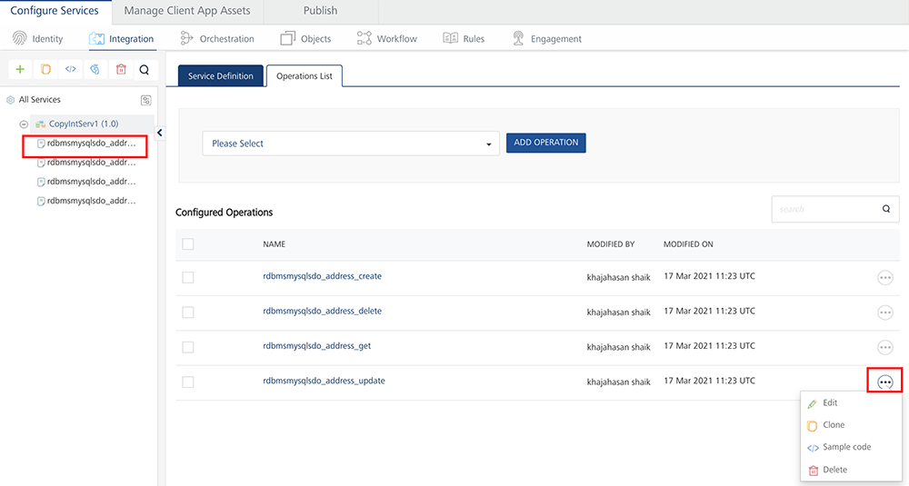
    
    The system displays the selected operation in the edit mode. The create operation has the Request Input tab.
    
    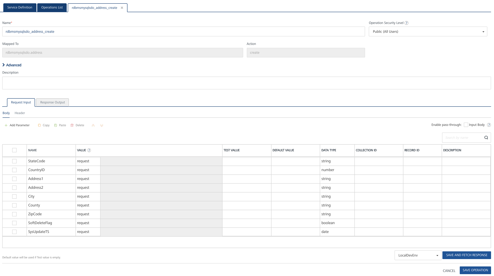
    
     You can add an entry by clicking the **Add Parameter** button if entries for the input and the output tabs do not exist.  
      
    \-  To make duplicate entries, select the check box for the entry, click **Copy**, and then click **Paste**.  
      
      
    \-  To delete an entry, select the check box for an entry, and then click the **Delete** button.
    
    The **Name** field is prepopulated with fields names of the selected database. You can edit this field.
    
2.  Select one of the following security operations in the **Operation Security Level** field. By default, the field is set to Authenticated App User :  
    
    *   **Authenticated App User** – indicates that the operation is secured. To use the operation, an app user must be authenticated by an associated identity service.
    *   **Anonymous App User** – indicates that a user must have the app key and app secret to access the operation.
    *   **Public** – indicates that the operation requires no special security.
    
    The **Action** field is prepopulated with operation names of the selected database. You cannot edit this field.
    
3.  Click the  Advanced tab to configure the preprocessor and postprocessor for Java and JavaScript. All options in the Advanced section are optional. For more details, refer to [Preprocessor and Postprocessor](Java_Preprocessor_Postprocessor_.md).
4.  In the **Request Input** tab, do the following:
    
    Integration services accept only `form-url-encoded` inputs for all input parameters provided in service input parameters (request input).
    
    1.  In the **TEST VALUE** filed, enter the user input for the selected column.
    2.  In the **DEFAULT VALUE**, enter the value if required. The default value will be used if the test value is empty.
    3.  Select request or session in the **Scope** field. By default, the Scope field is set to Request.
        
        *   **Request** - Indicates that the value must be retrieved from the HTTP request received from a mobile device.
        *   **Session** - Indicates that the value must be retrieved from the HTTP session stored on Volt MX Foundry.
        
        The default data type for the selected column is loaded under the **DATATYPE** field.
        
    4.  In the **DESCRIPTION**, provide the description.
    
    To validate the details, click **Fetch Response**. The result of the operation appears.
    
5.  Click **SAVE OPERATION** to save the changes in the create operation.

#### How to Query a Database and Display Information with the Read Operation

1.  Under **Configured Operations**, hover your cursor over the **Read** operation, click the **Settings** button, and then click **Edit**.
    
    The system displays the selected operation in the edit mode. The Read operation has the **Request Input** and **Response Output** tabs.
    
    
    
     You can add an entry by clicking the **Add Parameter** button if entries for the input and the output tabs do not exist.  
      
    In the read operation, the **Name** drop-down list contains a **Select** option that acts as a label for the list. **Select** itself is not a command.  
      
    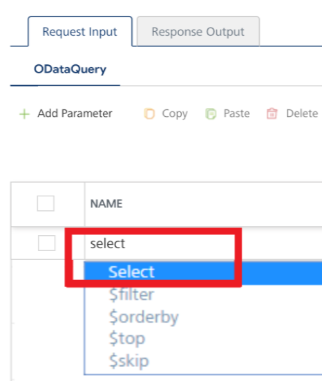  
      
    \-  To make duplicate entries, select the check box for the entry, click **Copy**, and then click **Paste**.  
      
      
    \-  To delete an entry, select the check box for an entry, and then click the **Delete** button.
    
2.  In the **Request Input**, configure the following ODATA commands to filter the data:
    
     [](Resources/Images/RDBMSReadInputParam.png) 
    
    The **NAME** field in the **Request Input** is prepopulated with ODATA commands.
    
    1.  In the **TEST VALUE** filed, enter the query parameter for the selected ODATA command.
        
        For example (sample employee table), shown below:
        
        | Command Name | Test value for the command | Result |
        | --- | --- | --- |
        | $filter | emp\_Id ge 30 | Filters and displays data in the table based on age of employes who are older than 30. |
        | $orderby | emp\_Age | Arranges data in the table based on employees' age. |
        | $top | 5 | Displays top five records in the table. |
        | $skip | 5 | Displays all records in the table except top five records. |
        
        For example (sample configuration for ODATA commands), shown below:
        
        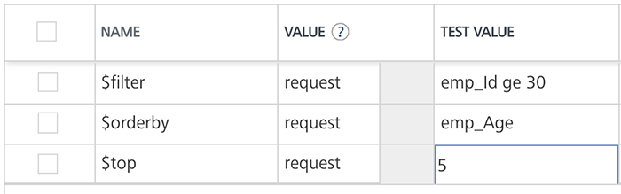
        
    2.  In the **DEFAULT VALUE**, enter the value if required.
    3.  In the **DESCRIPTION**, provide the description.
        
        To validate the details, click **Fetch Response**. The result of the operation appears.
        
        Click **SAVE OPERATION** to save the changes in the read operation.
        
3.  In the **Response Output** tab, configure the fields of the table for displaying the data:
    
    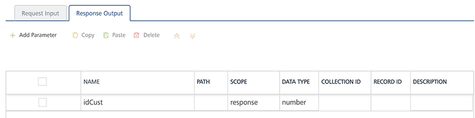
    
    The **Name** field in the Response Output tab is prepopulated with database columns.
    
    1.  Select request or session in the **SCOPE** field. By default, this field is set to **Request**.
    
    *   **Request** - Indicates that the value must be retrieved from the HTTP request received from a mobile device.
    *   **Session** - Indicates that the value must be retrieved from the HTTP session stored on Volt MX Foundry.
    
    3.  In the **DESCRIPTION**, provide the description.
    
    To validate the details, click **Test**. The result of the operation appears.
    
4.  Click **SAVE OPERATION** to save the changes in the read operation.

#### How to Update a Database Record with Update Operation

1.  Under **Configured Operations**, hover your cursor over the **Update** operation, click the **Settings** button, and then click **Edit**.
    
    The system displays the selected operation in the edit mode. The update operation has the Request Input tab.
    
    
    
2.  The **NAME** field contains primary key of the table. You cannot modify these details.
    
    The Name column is prepopulated with fields names in the database.
    
     You can add an entry by clicking the **Add Parameter** button if entries for the input and the output tabs do not exist.  
      
    \-  To make duplicate entries, select the check box for the entry, click **Copy**, and then click **Paste**.  
      
      
    \-  To delete an entry, select the check box for an entry, and then click the **Delete** button.
    
3.  Update the values in the fields, such as **TEST VALUE**, **DEFAULT VALUE**, and **SCOPE**, if required.
    
    To validate the details, click **Fetch Response**. The result of the operation appears.
    
4.  Click **SAVE OPERATION** to save the changes in the update operation.
    

#### How to Delete a Database Record with Delete Operation

1.  Under **Configured Operations**, hover your cursor over the **Delete** operation, click the **Settings** button, and then click **Edit**.
    
    The system displays the selected operation in the edit mode. The delete operation has the Request Input tab.
    
    
    
2.  The **NAME** field contains the primary key of the table. You cannot modify these details. The **Request Input** tab contains only the primary key of the table.
    
3.  In the **TEST VALUE** field, enter the valid primary key value.
4.  Click **Fetch Response** to validate the details. If the test value matches the primary key in the database, the system deletes the record from the database.
    
5.  Click **SAVE OPERATION** to save the changes in the delete operation.
    

How to Configure an API Proxy Service
-------------------------------------

With Volt MX Foundry API Proxy (pass-through proxy) integration service, you can forward the request and response without intermediate transformation (without affecting the actual request and response.)

For example:

When a back end returns the response with a huge data, and if there is no API Proxy enabled with the service, Volt MX Foundry converts the back end response to a JSON format before forwarding the response to a device. Users can use the API Proxy service that forwards a back end response in the original back end format to a device. By enabling API Proxy, the input (body and headers) of a client's input request is forwarded to the back end and the output response from the back end is forwarded to the device with no changes in the input request and output response.

You can configure API Proxy integration service for the following endpoints:

*   XML
    
*   JSON

To configure `API Proxy` integration service for XML or JSON endpoints, follow these steps:

1.  In the [integration **service definition** tab](#IntegrationSDpage), follow these steps:
    1.  In the **Name** field, provide a unique name for your service - for example, `APIProxyService`.
    2.  From the **Service Type** list, select **APIProxy**.
    3.  In the **Base URL**, type the URL of the back end of XML or JSON type.
    4.  In the **Client Authentication** field, select an identity provider from the drop-down list. This drop-down list shows identity providers only if you have created identity providers for [OAuth 2.0](Identity.md#OAuth2ID) in the Identity page.
    5.  Click the **Advanced** tab to specify dependent JAR and API throttling. All options in the Advanced section are optional.
        *   **To specify dependent JAR, follow these steps**:
            
            Select the JAR containing preprocessor or postprocessor libraries from the drop-down list, or click **Upload New** to browse the JAR file from your local system. The step allows you to further filter the data sent to the back end:
            
            Make sure that you upload a custom JAR file that is built on the same JDK version used for installing Volt MX Foundry Integration.  
              
            For example, if the JDK version on the machine where Volt MX Foundry Integration is installed is 1.6, you must use the same JDK version to build your custom jar files. If the JDK version is different, an unsupported class version error will appear when a service is used from a device.
            
        *   **API throttling** enables you to limit the number of request calls within a minute. If an API exceeds the throttling limit, the API will not return the service response.**  
            To specify throttling, follow these steps:**  
            1.  In the **Total Rate Limit** text box, enter a required value. With this value, you can limit the number of requests configured in your Volt MX Foundry console in terms of Total Rate Limit.
                
            2.  In the **Per IP Rate Limit** text box, enter a required value. With this value, you can limit the number of IP address requests configured in your Volt MX Foundry console in terms of Per IP Rate Limit.
                
                To override throttling, refer to [Override API Throttling Configuration](API_Throttling_Override.md).
                
                Enable API throttling in a clustered environment by configuring the `VOLTMX_SERVER_NUMBER_OF_NODES` property in the **server\_configuration** table available in Admin database. This property indicates the number of nodes configured in the cluster. The default value is 1.
                
    6.  Under the **Web Service Authentication**, select one of the following modes:
        1.  **None**: Select the option if you do not want to provide any authentication for the service.
        2.  **Basic**: Provide User ID and Password if the external Web service requires form or basic authentication.
        3.  **NTLM**: Your service follows the NT LAN Manager authentication process. You are required to provide the User ID, Password, NTLM Host, and NTLM Domain.
        4.  To enable the proxy, select the **Use proxy from settings** check box. By default, the check box is cleared.  
            The **Use proxy from settings** check box dims when no proxy is configured under the **[Settings > Proxy](Settings.md#proxy)**.

1.  Click **SAVE** to save your service definition. The system displays the success message: Service Saved Successfully.  
    The **Operations List** tab appears only after the **Service Definition** is saved. The **ADD OPERATION** button in the Service Definition page is active only after you click the **SAVE** button.
2.  Click **ADD OPERATION** to display the **NewOperation** page.
    
     You can also display the **NewOperation** page. Follow these steps:  
      
     -  Click the **Operations List** tab > **CONFIGURE OPERATION**.  
     -  From the tree in the left pane, click **Add > Add New Operation**, shown below:
    
    Click to View image
    
    
    
    To use an existing integration service, refer to [How to Use an Existing Integration Service](#how-to-use-an-existing-integration-service).
    
    1.  In the **Name** field, modify the name if required.
    2.  Select one of the following security operations in the **Operation Security Level** field. By default, the field is set to Authenticated App User:  
        
        *   **Authenticated App User** – indicates that the operation is secured. To use this operation, an app user must be authenticated by an associated identity service.
        *   **Anonymous App User** – indicates that a user must have the app key and app secret to access this operation.
        *   **Public** – indicates that the operation requires no special security.
        
    3.  Select the required method for the operation from the **HTTP Methods** field.
    4.  The **Target URL** field is prepopulated with the URL that you provided at the **Base URL** field. You can add the suffix, if required.
        
        For example, to the base URL, you can add suffix such as `/latest`  or `/sports` to get latest news or sports news:
        
        *   ``http://feeds.foxnews.com/foxnews`/latest` ``
        *   ``http://feeds.foxnews.com/foxnews`/sports` ``
3.  Click the  Advanced tab to configure the preprocessor and postprocessor for Java and JavaScript. All options in the Advanced section are optional. For more details, refer to [Preprocessor and Postprocessor](Java_Preprocessor_Postprocessor_.md).
4.  Click **Save Operation** to save the operation. The system displays the **Operation** section for your service.

### Limitations for API Proxy

*   API Proxy service operations and operations for which pass-through (inputs, headers, and outputs) is enabled cannot be used in orchestration services.  
    For example, when you create an integration service with an API Proxy type or the operations of XML, SOAP, or JSON endpoints with pass-through enabled, the system does not show the services and operations while configuring orchestration operations.
*   Using the MBaaS Client SDK with API Proxy integration service is not supported.

### How to Enable MBaaS Client SDK with API Proxy Integration Service

Using API proxy integration service not supported by default.

To enable MBaaS client SDK with API proxy integration service, a developer must write a foreign function interface (FFI) file to package the payload and send it out in the correct format (SDK only supports `form-url-encoded` data)

With API Proxy integration service is used, the client side metrics are not supported.

### How to Enable Pass-through Proxy for Operations

You can also configure the following pass-through proxy flags in operations for connectors such as [XML](#how-to-configure-an-xml-service), [SOAP](#how-to-configure-a-soap-service), and [JSON](#how-to-configure-a-json-service):

*   Under the **Input Request > Body** tab, select the **Enable pass-through input body** check box to forward the body of a client's request to the back end.
*   Under the **Input Request** **\>** **Header** tab, select the **Enable pass-through input header** check box to forward headers of a client's request to the backend.
*   Under the **Output Response** tab, select the **Enable pass-through output body** check box to forward the response from the backend to a client.

How to Configure an AWS API Gateway Service
-------------------------------------------

AWS API Gateway is a new data adapter of Volt MX Foundry integration services. With Volt MX Foundry AWS API Gateway integration service, you can connect to the services configured and deployed under API Gateway Service in Amazon Web Services.

Volt MX  Foundry AWS API Gateway supports the following integration types of Amazon API Gateway:

*   Lambda Function
*   HTTP Proxy
*   Mock Integration
*   AWS Service Proxy

 VoltMX Foundry supports AWS API Gateway services, which returns JSON response.

Adding an AWS API Gateway service involves the following steps:

*   [How to Configure a Service Definition for an AWS API Gateway Service](#how-to-configure-a-service-definition-for-an-aws-api-gateway-service)
*   [How to Create Operations for an AWS API Gateway Service](#how-to-create-operations-for-an-aws-api-gateway-service)
*   [How to Configure Operations for an AWS API Gateway Service](#how-to-configure-operations-for-an-aws-api-gateway-service)

### How to Configure a Service Definition for an AWS API Gateway Service

To configure `AWS API Gateway` integration service, follow these steps:

1.  In the [integration **service definition** tab](#IntegrationSDpage), follow these steps:
    
    1.  In the **Name** field, provide a unique name for your service - for example, `AWSDataAdapter`.
    2.  From the **Service Type** list, select **AWS API Gateway**.
    3.  **Regions**: Select your region that you have configured AWS API Gateway for your AWS account.
        
        In the **AWS URL**, the system displays the AWS API gateway URL for the selected region. You cannot modify these details.
        
    4.  In the **Access Key ID** field, enter your access key ID that you received from your AWS account.
    5.  In the **Secret Access ID** field, enter your secret access key ID that you received from your AWS account.
    6.  Click the **Advanced** tab to specify dependent JAR and API throttling. All options in the Advanced section are optional.
        *   **To specify dependent JAR, follow these steps**:
            
            Select the JAR containing preprocessor or postprocessor libraries from the drop-down list, or click **Upload New** to browse the JAR file from your local system. The step allows you to further filter the data sent to the back end:
            
            Make sure that you upload a custom JAR file that is built on the same JDK version used for installing Volt MX Foundry Integration.  
              
            For example, if the JDK version on the machine where Volt MX Foundry Integration is installed is 1.6, you must use the same JDK version to build your custom jar files. If the JDK version is different, an unsupported class version error will appear when a service is used from a device.
            
        *   API throttling enables you to limit the number of request calls within a minute. If an API exceeds the throttling limit, the API will not return the service response.**  
            To specify throttling, follow these steps:**  
            1.  In the **Total Rate Limit** text box, enter a required value. With this value, you can limit the number of requests configured in your Volt MX Foundry console in terms of Total Rate Limit.
                
            2.  In the **Per IP Rate Limit** text box, enter a required value. With this value, you can limit the number of IP address requests configured in your Volt MX Foundry console in terms of Per IP Rate Limit.
                
                To override throttling, refer to [Override API Throttling Configuration](API_Throttling_Override.md).
                
                Enable API throttling in a clustered environment by configuring the `VOLTMX_SERVER_NUMBER_OF_NODES` property in the **server\_configuration** table available in Admin database. This property indicates the number of nodes configured in the cluster. The default value is 1.
                
    7.  To enable the proxy, select the **Use proxy from settings** check box. By default, the check box is cleared.  
        The **Use proxy from settings** check box dims when no proxy is configured under the **[Settings > Proxy](Settings.md#proxy)**.
    
    To test your AWS connection details, click **Test Connection**. If the entered details are correct, the system displays the message: `Valid Gateway address and port`.
    

1.  Click **SAVE** to save your service definition. The system displays the success message: Service Saved Successfully.  
    The **Operations List** tab appears only after the **Service Definition** is saved. The **ADD OPERATION** button in the Service Definition page is active only after you click the **SAVE** button.

### How to Create Operations for an AWS API Gateway Service

1.  Once you configure the service definition for an AWS API Gateway service, click **ADD OPERATION** to display the **Operations List** tab.
    
     You can also display the **NewOperation** page. Follow these steps:  
      
     -  Click the **Operations List** tab > **CONFIGURE OPERATION**.  
     -  From the tree in the left pane, click **Add > Add New Operation**, shown below.
    
    Click to View image
    
    
    
    To use an existing integration service, refer to [How to Use an Existing Integration Service](#how-to-use-an-existing-integration-service).
    

1.  From the **API** drop-down list, select the API that is deployed at Amazon Services.
2.  From the **Resource** drop-down list, select the resource.
3.  From the **Stages** drop-down list, select the stage.
4.  From the **Methods** drop-down list, select the check boxes for the methods.
5.  Click the **ADD OPERATION** button. The new operations are created under the **Configured Operations** section.
    
    
    
    Operation names are auto-generated in the format. The default name format of a AWS API operation is `<method_name><api_name><resource_name>`. You can change the operation name if required.
    

### How to Configure Operations for an AWS API Gateway Service

Once you create operations for an AWS API Gateway service, you can configure operations as follows:

1.  Under Configured Operations, hover your cursor over the create operation, click the **Settings** button, and then click **Edit**.
    
    The **Name** field is prepopulated with operation names. You can edit this field if required.
    
2.  Select one of the following security operations in the **Operation Security Level** field. By default, the field is set to Authenticated App User :  
    
    *   **Authenticated App User** – indicates that the operation is secured. To use the operation, an app user must be authenticated by an associated identity service.
    *   **Anonymous App User** – indicates that a user must have the app key and app secret to access the operation.
    *   **Public** – indicates that the operation requires no special security.
    
3.  Click the  Advanced tab to configure the preprocessor and postprocessor for Java and JavaScript. All options in the Advanced section are optional. For more details, refer to [Preprocessor and Postprocessor](Java_Preprocessor_Postprocessor_.md).
4.  In the **Request Input** tab, do the following:
    
    Integration services accept only `form-url-encoded` inputs for all input parameters provided in service input parameters (request input).
    
     You can add an entry by clicking the **Add Parameter** button if entries for the input and the output tabs do not exist.  
      
    \-  To make duplicate entries, select the check box for the entry, click **Copy**, and then click **Paste**.  
      
    \-  To delete an entry, select the check box for an entry, and then click the **Delete** button.
    
    1.  Under the **Body** tab, do the following:
        
        1.  In the **NAME** field, enter the name for the request input parameter.
            
             In the **Body** tab > **NAME** filed, the input parameters are prepopulated.
            
        2.  In the **TEST VALUE** filed, enter the user input for the selected column.
        
        1.  In the **DEFAULT VALUE**, enter the value if required. The default value is used if the test value is empty.
        2.  Select request or session in the **Scope** field. By default, the Scope field is set to Request.
            
            *   **Request** - Indicates that the value must be retrieved from the HTTP request received from a mobile device.
            *   **Session** - Indicates that the value must be retrieved from the HTTP session stored on Volt MX Foundry.
            
            The default data type for the selected column is loaded under the **DATATYPE** field.
            
            Enter the values for required fields such collection ID and record ID.
            
        3.  Select the **Encode** check box to enable an input parameter to be encoded. For example, the name New York Times would be encoded as _New_York_Times_  when the encoding is set to True. The encoding must also adhere to the HTML URL encoding standards.
    2.  Under the **Header**, do the following:  
        Based on the operation - for example, post or get -, provide custom HTTP headers.  
        
        To provide customer headers, click **Header**.
        
        If AWS APIs with API Key Required is set to "true", the api key needs to be sent as request header as x-api-key.
        
        1.  In the **NAME** field, provide custom HTTP headers required by the external source.
        2.  **SCOPE:** Select request or session. By default, the field is set to **Request.** Four options are available in Volt MX Foundry under Request Input > Headers > Scope tab during configuration of any operation. The options primarily determine the source of the value of the header**.**
            *   **Request**: If this option is selected, the Integration Server picks the value pairs from the client's request during run time and forwards the value pairs to the back-end.
                
                The option helps a user to configure the default value. The default value is taken if the request does not have the header.
                
            *   **Session**: If this option is selected, the value of header is picked from the session context based on the user configuration.
            *   **Constant**: Constant is used to configure the value that is picked and sent to back end by the Integration Server during run time.
            *   **Expression**: Select this option to configure the velocity template expressions for the header values.
                
                You cannot edit the default value for the expression.
                
        3.  **TEST VALUE**: Enter a value. A test value is used for testing the service.
            
        4.  **DEFAULT VALUE:** Change the syntax if required.
        5.  **DESCRIPTION**: Enter a proper description.
        
        To validate the details, click **Fetch Response**. The result of the operation appears.
        
5.  In the **Response Output** tab, configure the fields of the table for displaying the data.
    
    
    
    The **Name** field in the Response Output tab is prepopulated with properties of the output API.
    
    Enter the values for required fields such as name, scope, data type, collection ID, record ID, format and format value.
    
    To validate the details, click **Test**. The result of the operation appears.
    
6.  Click **Save Operation** to save the operation. The system displays the **Operation** section for your service.

How to Configure a Salesforce Service
-------------------------------------

To configure your Salesforce service, follow these steps:

1.  In the [integration **service definition** tab](#IntegrationSDpage), follow these steps:
    1.  In the **Service Name** text box, enter a unique name for your service.
    2.  From the **Service Type** list, select **Salesforce**.  
        By default, XML is selected. If you select **Salesforce**, the **Choose Salesforce Authentication Type** section is displayed.
        
        
        
        
        
    3.  Under **Choose Salesforce Authentication Type**, click one of the following modes:
        
        *   [Use Existing Identity Provider](#SFExistingIdentityProvider) - to select an identity provider. This drop-down lists all identity providers only if you have already created identity providers for SAP in the Identity page.
        *   [Specify Login Endpoint](#SFSpecify_Login_Endpoint)\- to configure a new endpoint.
        
        To configure **Use Existing Identity Provider**, fill in the details for the following fields:
        
        screen
        
        1.  From the **Select Identity Provider** list, select your Salesforce identity.
            
            The details for the selected identity are displayed in the **Endpoint URL** text box. You cannot modify these details.
            
        2.  Under the **User ID** and **Password**, provide valid log-in credentials that you created while registering with Salesforce services.
        
        To configure **Specify Log-in Endpoint**, fill in the details for the following fields:
        
        screen
        
        1.  In the **Endpoint URL**, enter the URL - for example, `https://login.salesforce.com/services/oauth2/token`_._
            
        2.  In the **Client ID** text box, enter a valid client id.
            
        3.  In the **Client Secret** text box, enter a valid client secret.
            
        4.  In the **User ID** text box, enter a valid user ID.
            
        5.  In the **Password** text box, enter a valid password.
    4.  Click the **Advanced** tab to specify dependent JAR and API throttling. All options in the Advanced section are optional.
        *   **To specify dependent JAR, follow these steps**:
            
            Select the JAR containing preprocessor or postprocessor libraries from the drop-down list, or click **Upload New** to browse the JAR file from your local system. The step allows you to further filter the data sent to the back end:
            
            Make sure that you upload a custom JAR file that is built on the same JDK version used for installing Volt MX Foundry Integration.  
              
            For example, if the JDK version on the machine where Volt MX Foundry Integration is installed is 1.6, you must use the same JDK version to build your custom jar files. If the JDK version is different, an unsupported class version error will appear when a service is used from a device.
            
        *   **API throttling** enables you to limit the number of request calls within a minute. If an API exceeds the throttling limit, the API will not return the service response.**  
            To specify throttling, follow these steps:**  
            1.  In the **Total Rate Limit** text box, enter a required value. With this value, you can limit the number of requests configured in your Volt MX Foundry console in terms of Total Rate Limit.
                
            2.  In the **Per IP Rate Limit** text box, enter a required value. With this value, you can limit the number of IP address requests configured in your Volt MX Foundry console in terms of Per IP Rate Limit.
                
                To override throttling, refer to [Override API Throttling Configuration](API_Throttling_Override.md).
                
                Enable API throttling in a clustered environment by configuring the `VOLTMX_SERVER_NUMBER_OF_NODES` property in the **server\_configuration** table available in Admin database. This property indicates the number of nodes configured in the cluster. The default value is 1.
                
    5.  To enable the proxy, select the **Use proxy from settings** check box. By default, the check box is cleared. The Use proxy from settings check box dims when no proxy is configured under the **[Settings > Proxy](Settings.md#proxy)**.
2.  Click **SAVE** to save your service definition. The system displays the success message: Service Saved Successfully.  
    The **Operations List** tab appears only after the **Service Definition** is saved. The **ADD OPERATION** button in the Service Definition page is active only after you click the **SAVE** button.
    
    Based on your Salesforce authentication, the system loads all tables such as objects and operations.
    
    
    

1.  Select an object from the **Object** list that is auto-populated with all the existing Salesforce objects.
    
    If you provide incorrect Salesforce endpoint details, the **Object** list will contain only _\_Login_ object.
    
2.  Based on the object added in the previous step, the **Operation name** is listed with operations. Select the check boxes for required operations.
3.  Click **ADD OPERATION**. The system adds your operation in the Operations List section, and it also adds your new Salesforce service into the Integration page.
    
    
    
4.  Under Operations List, hover your cursor over the required operation that you added, click an operation under the **Name** column or click the **Settings** button, and then click **Edit**.
    
    
    
    The operation details are displayed.
    
    
    

1.  In the **Name** field, modify the name if required.
2.  Select one of the following security operations in the **Operation Security Level** field. By default, the field is set to Authenticated App User :  
    
    *   **Authenticated App User** – indicates that the operation is secured. To use this operation, an app user must be authenticated by an associated identity service.
    *   **Anonymous App User** – indicates that a user must have the app key and app secret to access the operation.
    *   **Public** – indicates that the operation requires no special security.
    
3.  In the **Operation Path** text box, modify the path if required.
    
    You can add an entry by clicking the **Add** button if entries for the input and the advanced tabs do not exist. You can also delete an existing entry by clicking the **Delete** button.
    
4.  Click the  Advanced tab to configure the preprocessor and postprocessor for Java and JavaScript. All options in the Advanced section are optional. For more details, refer to [Preprocessor and Postprocessor](Java_Preprocessor_Postprocessor_.md).
5.  In the **Input** tab, provide the following details:
    
    Integration services accept only `form-url-encoded` inputs for all input parameters provided in service input parameters (request input).
    
     You can add an entry by clicking the **Add Parameter** button if entries for the input and the output tabs do not exist.  
      
    \-  To make duplicate entries, select the check box for the entry, click **Copy**, and then click **Paste**.  
      
    \-  To delete an entry, select the check box for an entry, and then click the **Delete** button.
    
    1.  The **NAME** field contains a unique identifier for a parameter. Change the identifier if required.
    2.  The **TEST VALUE** field contains a value to be used to test the service. Change the syntax if required.
    3.  In the **DEFAULT VALUE** field, change the syntax if required.
    4.  In the **SCOPE**, select request or session in the **Scope** field. By default, this field is set to **Request**.
        1.  **Request** - indicates that the value must be retrieved from the HTTP request received from the mobile device.
        2.  **Session** - indicates that the value must be retrieved from the HTTP session stored on Volt MX Foundry.
    5.  Select a data type in the **DATATYPE** field:
        *   **String** - a combination of alpha-numeric and special characters. Supports all formats including UTF-8 and UTF-16 with no maximum size limit.
        *   **Date** - Date format
            *   If datatype is string, then the options in the Format Type are Currency, Number and Date.
            *   If the datatype is number, then the options in the Format Type are Currency and Date.
            *   If the datatype is boolean, then the options in the Format Type and Format Value text box are disabled.   
        *   **Boolean** - a value that can be true or false.
        *   **Number** - an integer or a floating number.
        *   **Collection** - a group of data, also referred to as data set.
    6.  Select the **ENCODE** check box to enable an input parameter to be encoded. For example, the name New York Times would be encoded as _New_York_Times_ when the encoding is set to True. The encoding must also adhere to the HTML URL encoding standards.

1.  Click the ****Output**** tab, and enter the values for required fields such as ID, scope, data type, collection ID, record ID, format and format value.

1.  Click **Test** to view the results.
2.  Click **Save Operation** to save the operation. The system displays the **Operation** section for your service.
3.  Click **Done** to navigate to the **Integration** page.
    
    To use an existing integration service, refer to [How to Use an Existing Integration Service](#how-to-use-an-existing-integration-service).
    

### How to Use Log-in Endpoint with Different Credentials for Design Time and Runtime

If the service is using a log-in endpoint, ensure that you specify the same set of credentials (Client ID, Client Secret, User ID, Password) for design time and run-time.

Because if the log-in endpoint credentials are different for design time and run-time, the system throws an error while accessing a service from an app.

 Error 401: Request Unsuccessful Server responded with 401.

If you want to use log-in endpoint with different credentials for design time and run-time, then parametrize instance URL in the operation path, and send that URL from an app.

For example:

To parametrize an instance URL, follow these steps:

1.  In the **login** operation, click **Output** tab, and make the changes, shown below:
    
    
    
    | ID | Path | Scope |
    | --- | --- | --- |
    | Authorization | concat(//OAuth/token\_type," ",//OAuth/access\_token | session |
    | instanceURL | //OAuth/instance\_url | session |
    
2.  Click **Test** to view the results.
3.  Click **Save Operation** to save the above changes.
4.  In the **getContact** operation, make the following changes:
    1.  In the **Operation Path** text box, change the URL, for example, from ` https://ap1.salesforce.com/`  to    `$<instanceURL>/`.
        
        
        
    2.  In the **Input** tab, configure the following fields, shown below:
        
        | ID | Path | Scope | Encode |
        | --- | --- | --- | --- |
        | queryString | Select ID from contact | session |   |
        | instanceURL | //OAuth/instance\_url | session | No |
        
5.  Click **Test**. The contacts are fetched from the Salesforce.
6.  Click **Save Operation**.

How to Configure Volt MX SAP Gateway
---------------------------------

With Volt MX Foundry, you can access external Volt MX SAP services by using the Volt MX SAP Gateway connector. Based on your Volt MX SAP Gateway authentication, you can use Volt MX SAP libraries and objects along with the supported HTTP methods in your app.

Adding a Volt MX SAP Gateway service involves the following steps:

*   [How to Configure a New Volt MX SAP Gateway](#how-to-configure-a-new-volt-mx-sap-gateway)
*   [How to Edit or Test an Existing Volt MX SAP Gateway Integration Service](#how-to-edit-or-test-an-existing-volt-mx-sap-gateway-integration-service)

### How to Configure a New Volt MX SAP Gateway

To configure your Volt MX SAP Gateway, follow these steps:

1.  In the [integration **service definition** tab](#IntegrationSDpage), follow these steps:
    1.  In the **Name** field, enter a unique name for your service.
    2.  From the **Service Type** list, select **VoltMX SAP gateway**.  
        By default, XML is selected. If you select **VoltMX SAP gateway**, the **Select authentication service** section is displayed.
        
        
        
        
        
    3.  Under **Select authentication service**, click [Specify Login Endpoint](#Specify_Login_Endpoint)one of the following modes:
        
        *   [Use Existing Identity Provider](#ExistingIdentityProvider) - to select an identity provider. This drop-down lists all identity providers only if you have already created identity providers for SAP in the Identity page.
        *   [Specify Login Endpoint](#Specify_Login_Endpoint)\- to configure a new endpoint.
        
        To configure **Use Existing Identity Provider**, fill in the details for the following fields:
        
        
        
        1.  From the **Identity** list, select your Volt MX SAP Gateway identity.
            
            The details for the selected identity are displayed in the **Gateway address & port** text box. You cannot modify these details.
            
        2.  Under the **User ID** and **Password**, provide valid log-in credentials that you created while registering with Volt MX SAP services.
        3.  In the **Default Caller ID**, provide the ID that Volt MX SAP Gateway uses for logging and auditing.
        4.  In the **Default Caller Group**, provide the ID that Volt MX SAP Gateway uses for logging and auditing. This information is optional.
        5.  Click [Step 3](#Step3SaveContinue) to continue.
        
        To configure **Specify Log-in Endpoint**, fill in the details for the following fields:
        
        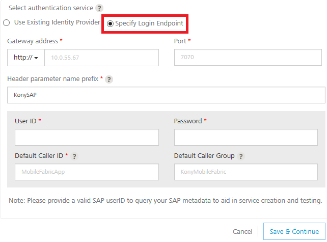
        
        1.  In the **Gateway address**, enter the domain - for example, connect.voltmx.com_._
            
        2.  In the **Port** text box, enter a valid port number ranging from 1 to 65535.
            
        3.  In the **Header parameter name prefix \*** text box, enter the header - for example, VoltMXSAP.
            
        4.  Under the **User ID** and **Password**, provide valid log-in credentials that you created while registering with Volt MX SAP Gateway services.  
            For more details, refer to How to register SAP Sky services.
            
        5.  In the **Default Caller ID**, provide the ID that Volt MX SAP Gateway uses for logging and auditing.
        6.  In the **Default Caller Group**, provide the ID that Volt MX SAP Gateway uses for logging and auditing. This information is optional.
2.  Click the **Advanced** tab to specify API throttling. All options in the Advanced section are optional.
    *   API throttling enables you to limit the number of request calls within a minute. If an API exceeds the throttling limit, the API will not return the service response.**  
        To specify throttling, follow these steps:**  
        1.  In the **Total Rate Limit** text box, enter a required value. With this value, you can limit the number of requests configured in your Volt MX Foundry console in terms of Total Rate Limit.
            
        2.  In the **Per IP Rate Limit** text box, enter a required value. With this value, you can limit the number of IP address requests configured in your Volt MX Foundry console in terms of Per IP Rate Limit.
            
            To override throttling, refer to [Override API Throttling Configuration](API_Throttling_Override.md).
            
            Enable API throttling in a clustered environment by configuring the `VOLTMX_SERVER_NUMBER_OF_NODES` property in the **server\_configuration** table available in Admin database. This property indicates the number of nodes configured in the cluster. The default value is 1.
            

1.  To enable the proxy, select the **Use proxy from settings** check box. By default, the check box is cleared.  
    The **Use proxy from settings** check box dims when no proxy is configured under the ****[Settings > Proxy](Settings.md#proxy)****.
2.  Click **SAVE** to save your service definition. The system displays the success message: Service Saved Successfully.  
    The **Operations List** tab appears only after the **Service Definition** is saved. The **ADD OPERATION** button in the Service Definition page is active only after you click the **SAVE** button.
    
    Based on your Volt MX SAP Gateway authentication, the system loads all tables such as libraries and objects along with supported HTTP methods.
    
    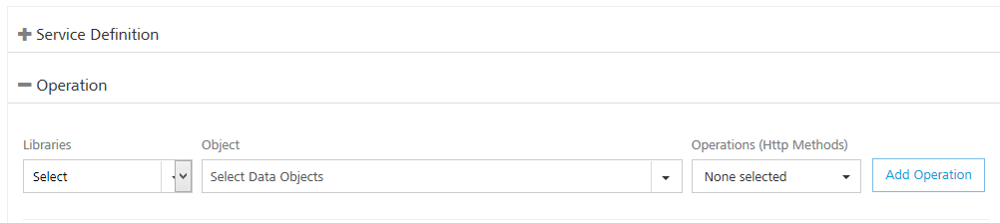
    
3.  Click **ADD OPERATION** to display the **Operations List** tab for adding operations.
    
     You can also add operations by following these steps:  
      
     -  Click the **Operations List** tab.  
     -  From the tree in the left pane, click **Add > Add New Operation**, shown below:
    
    Click to View image
    
    
    
    
    
    1.  Under **Operations List** tab, from the **Libraries** list, select a library - for example, CRM. The system loads available objects and operations for the selected library.
    2.  From the **Object** list, select an object.
    3.  From the **Operations (Http Methods)** list, select the required check boxes for each operation.
        
        To configure more operations for your Volt MX SAP Gateway integration service, repeat Steps a through b. You can select a new library and object, and supported operations.
        
    4.  Click **ADD OPERATION**. The system adds your operation to the Operations List page, and it also adds your new Volt MX SAP Gateway service into the **Integration** page.
    5.  To configure operations, under **Operations List**, hover your cursor over the required service, click the **Settings** button, and then click **Edit**.
        
        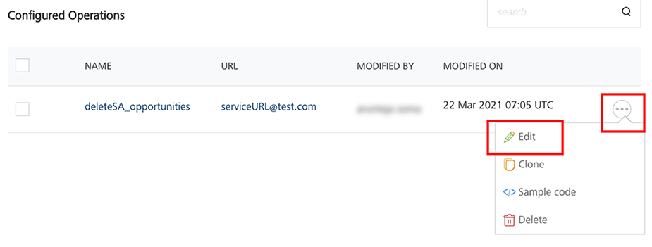
        
        The operation details are displayed.
        
        
        
4.  In the **Name** field, modify the name if required.
5.  Select one of the following security operations in the **Operation Security Level** field. By default, the field is set to Authenticated App User :  
    
    *   **Authenticated App User** – indicates that the operation is secured. To use the operation, an app user must be authenticated by an associated identity service.
    *   **Anonymous App User** – indicates that a user must have the app key and app secret to access the operation.
    *   **Public** – indicates that the operation requires no special security.
    
6.  Select the **HTTP** Methods.
    
7.  In the **Operation Path** text box, modify the path if required.
    
    You can add an entry by clicking the **Add** button if entries for the input and the advanced tabs do not exist. You can also delete an existing entry by clicking the **Delete** button.
    
8.  In the **Request Input** tab, provide the following details:
    
    Integration services accept only `form-url-encoded` inputs for all input parameters provided in service input parameters (request input).
    
    1.  Under the **Body** tab, do the following: 
        1.  The **NAME** field contains a unique identifier or filter for a parameter. Change the identifier if required.
        2.  The **TEST VALUE** field contains a value to be used to test the service. Change the syntax if required.
            
            Use the SAP backend syntax to get the expected results. For more details, refer to [../../../voltmxforsap/](../../../voltmxforsap/)
            
            For example: Parameter name as `filters` and the test value `$filter=<actual filters>`
            
            
            
        3.  In the **DEFAULT VALUE** field, change the syntax if required.
        4.  Select request or session in the **SCOPE** field. By default, this field is set to **Request**.
            *   **Request** - indicates that the value must be retrieved from the HTTP request received from the mobile device.
                
            *   **Session** - indicates that the value must be retrieved from the HTTP session stored on Volt MX Foundry.
                
        5.  Select a data type in the **DATATYPE** field:
            *   **String** - a combination of alpha-numeric and special characters. Supports all formats including UTF-8 and UTF-16 with no maximum size limit.
            *   **Boolean** - a value that can be true or false.
                
            *   **Number** - an integer or a floating number.
                
            *   **Collection** - a group of data, also referred to as data set.
                
        6.  Select the **ENCODE** check box to enable an input parameter to be encoded. For example, the name New York Times would be encoded as _New_York_Times_ when the encoding is set to True. The encoding must also adhere to the HTML URL encoding standards.
        7.  Based on the operation - for example, post or get - provide custom HTTP headers. To provide customer headers, click **Header**.
        8.  Click **Fetch Response** to view the response.  
            You can add more properties to an input parameter such as scope and data types by following the below step.
    2.  Click the **Header** tab to provide the following customer headers. Based on the operation - for example, post or get - provide custom HTTP headers. Custom HTTP headers required by the external data source, shown below:
        
        *   **ID**: The rows are created based on the selected operation. Change the value if required.
            
        *   **TEST VALUE**: Enter a value. A test value is used for testing the service.
        *   **Scope**: Select request or session. By default, this field is set to Request.
        
        To validate the details, click **Fetch Response**. The result of the operation appears.
        
9.  Click the **Attributes** tab to view schema. This is a meta-data schema for which user has configured at Volt MX SAP. The schema is in XML format.
    
    For example, the schema includes elements for the configured tables, such as, table name, description, library name, group name, URL, methods.
    
    
    
10.  Click the **Response Output** tab to view the output test values, such as name, scope, data type.  
    
    
    
    To validate the details, click **Test**. The result of the operation appears.
    
11.  Based on the operation - for example, post or get - provide custom HTTP headers.  
    To provide customer headers, click **Advanced**. In the **Test values** text box, provide custom HTTP headers required by the external data source, shown below:
    
    
    
12.  Click **SAVE OPERATION** to save the operation.

### How to Edit or Test an Existing Volt MX SAP Gateway Integration Service

If you want to edit an existing Volt MX SAP service, you can edit details such as service name, authentication service information, operations.

Each operation contains four tabs, including input, attributes, output, and advanced. If you want to test an existing operation for Volt MX SAP service - for example, get or put - enter necessary test values in the input and the advanced tabs. The results are displayed in the JSON format. The input values can be data types, test values, and session keys.

To edit or test an existing Volt MX SAP integration service, follow these steps:

1.  In the **Integration** page, click one of your SAP services.
2.  Make the necessary changes in the **Service Definition** and **Operations** sections. You can test an operation by inputting values. To test an operation, refer to **[How to configure Volt MX SAP Gateway Operations](#TotestSAPOperation)**.
3.  Click **Done** to save the changes. The system displays the **Integration** page.

How to Configure a MuleSoft Service
-----------------------------------

MuleSoft (Anypoint Platform™) is a platform that helps app developers to design custom APIs and deploy to a Mule Enterprise Service Bus runtime (ESB). With MuleSoft integration service in Volt MX Foundry, developers can interact with more than 50 types of connectors.

To integrate a MuleSoft service in Volt MX Foundry, developers need to create a project in MuleSoft Studio, export the project to a local system, and then deploy it to Cloud Hub. On top of the project deployment, a RESTful API modeling language (RAML) file needs to be built, which defines all the API definitions in the project. A RAML file also contains the defined schemas with properties. When a user creates a project from AnyPoint API Studio with any connector and builds a RAML file over the project, all the APIs can be used in Volt MX Foundry integration service. When a Volt MX Foundry user selects a MuleSoft connector from Volt MX Foundry Console, based on the cloud hub portal credentials of the MuleSoft connector, the system retrieves metadata from a RAML file and displays all APIs of a RAML file. Developers can add these APIs as operations in MuleSoft integration service in Volt MX Foundry Console.

Volt MX  Foundry discovers the MuleSoft endpoints through a RAML file. Volt MX Foundry parses a RAML file and exposes all the MuleSoft endpoints through the integration service. Mobile app developers can use the configured MuleSoft integration service and access the backend systems supported by MuleSoft’s connectors.

 VoltMX Foundry Console will process those projects created from AnyPoint Studio (MuleSoft) that are associated with RAML files.

Project created from AnyPoint Studio (MuleSoft) will not be consumed by portal if it does not use RAML file. Only MuleSoft projects created in the above specified manner using RAML files are supported in Volt MX Foundry Console.

*   **Enterprise Service Bus (ESB)**: An architecture that allows different applications to communicate with each other by acting as a transit system for carrying data between applications within or outside your intranet. An ESB provides transaction management, routing, security, and other functionality for the messages.

In Volt MX Foundry Console, you can provide login credentials of MuleSoft or upload a RAML file to configure an integration service.

**Advantages****of Volt MX Foundry database connector:**

*   Developers can design custom APIs
*   Developers can use more than 50 types of connectors.

**Limitations of Volt MX Foundry MuleSoft connector:**

*   When an apiGroup is created, only one RAML file needs to be created. Multiple files are not supported.
*   Reconfiguration of apps during publish is not supported for MuleSoft.
*   The schema defined must always be in JSON format. XML schema is not supported.
*   API Gateway (On-premises / Cloud) and Mule ESB (On-premises) are not supported.

Prerequisites

*   Log in to MuleSoft with your credentials at [https://anypoint.mulesoft.com/#/signin](https://anypoint.mulesoft.com/#/signin).
*   Download IDE of AnyPoint Studio (MuleSoft) from [https://www.mulesoft.com/platform/studio](https://www.mulesoft.com/platform/studio).
*   Create a project and deploy the project.
*   Build a RAML file. For more details, refer to MuleSoft Documentation at [https://developer.mulesoft.com/anypoint-platform](https://developer.mulesoft.com/anypoint-platform).

Adding a MuleSoft service involves the following steps:

*   [How to Configure Service Definition for MuleSoft Service](#how-to-configure-service-definition-for-mulesoft-service)
*   [How To Create Operations for MuleSoft Service](#how-to-create-operations-for-mulesoft-service)
*   [How to Configure Operations for MuleSoft Service](#how-to-configure-operations-for-mulesoft-service)

### How to Configure Service Definition for MuleSoft Service

1.  In the [integration **service definition** tab](#IntegrationSDpage), follow these steps:
    1.  In the **Name** field, enter a unique name for your service. When you enter the name, the name is updated for the active service under the **Services** section in the left pane.
    2.  From the **Service Type** list, select **MuleSoft**.  
        By default, XML is selected. If you select **MuleSoft**, the below details are displayed.
        
        
        
        
        
    3.  Under **Choose API Discovery Type**, click one of the following modes:
        
        *   To upload a **RAML File**, follow these steps:
            
            1.  Click **RAML File**.
            2.  Click the **Upload RAML File**  and select the RAML file from your local machine.  
                The system adds your main RAML file to the console. The system displays the added RAML file's name under the **Choose API Discovery Type** section.
        *   To use **AnyPoint Platform URL**, follow these steps:
            
            1.  Click **AnyPoint Platform URL**. The system displays the MuleSoft URL in the text box. You cannot modify these details.
            2.  Under the **User ID** and **Password**, provide valid log-in credentials that you created while registering with `MuleSoft AnyPoint` Platform.
                
            
            To test your database connection details, click **Test Connection**. If the entered details are correct, the system displays the message: Valid MuleSoft connection details.
            
             For on-premises, proxy support is not available for MuleSoft service.
            
    4.  Click the **Advanced** tab to specify dependent JAR and API throttling. All options in the Advanced section are optional.
        *   **To specify dependent JAR, follow these steps**:
            
            Select the JAR containing preprocessor or postprocessor libraries from the drop-down list, or click **Upload New** to browse the JAR file from your local system. The step allows you to further filter the data sent to the back end:
            
            Make sure that you upload a custom JAR file that is built on the same JDK version used for installing Volt MX Foundry Integration.  
              
            For example, if the JDK version on the machine where Volt MX Foundry Integration is installed is 1.6, you must use the same JDK version to build your custom jar files. If the JDK version is different, an unsupported class version error will appear when a service is used from a device.
            
        *   **API throttling** enables you to limit the number of request calls within a minute. If an API exceeds the throttling limit, the API will not return the service response.**  
            To specify throttling, follow these steps:**  
            1.  In the **Total Rate Limit** text box, enter a required value. With this value, you can limit the number of requests configured in your Volt MX Foundry console in terms of Total Rate Limit.
                
            2.  In the **Per IP Rate Limit** text box, enter a required value. With this value, you can limit the number of IP address requests configured in your Volt MX Foundry console in terms of Per IP Rate Limit.
                
                To override throttling, refer to [Override API Throttling Configuration](API_Throttling_Override.md).
                
                Enable API throttling in a clustered environment by configuring the `VOLTMX_SERVER_NUMBER_OF_NODES` property in the **server\_configuration** table available in Admin database. This property indicates the number of nodes configured in the cluster. The default value is 1.
                
    5.  To enable the proxy, select the **Use proxy from settings** check box. By default, the check box is cleared.  
        The **Use proxy from settings** check box dims when no proxy is configured under the ****[Settings > Proxy](Settings.md#proxy)****.
    6.  Click **SAVE** to save your service definition. The system displays the success message: Service Saved Successfully.  
        The **Operations List** tab appears only after the **Service Definition** is saved. For creating operations for a MuleSoft service, refer to [How To Create Operations for MuleSoft Service](#how-to-create-operations-for-mulesoft-service).
        
        To use an existing integration service, refer to [How to Use an Existing Integration Service](#how-to-use-an-existing-integration-service).
        

### How To Create Operations for MuleSoft Service

1.  Once you configure the [service definition](#how-to-configure-service-definition-for-mulesoft-service) for a MuleSoft service, click **ADD OPERATION** to display the **Operations List** tab.  
    
     You can also display the **Operations List** tab. Follow these steps:  
      
     -  Click the **Operations List** tab.  
     -  From the tree in the left pane, click **Add > Add New Operation**, shown below:
    
    Click to View image
    
    
    
2.  In the **Operations List** tab, follow these steps to configure operations:
    
    
    
3.  From the **Groups** drop-down list, select the title of the RAML file that is uploaded at AnyPoint CloudHub.
    
    Based on the selected groups, the **Versions** drop-down list is loaded with the versions of the RAML file.  
    
4.  From the **Versions** drop-down list, select the required version. You can select only one version of the RAML file.
5.  From the **Resources** drop-down list, select the required resource.
6.  From the **Operations (Http Methods)** drop-down list, select the required check boxes for methods that you defined in the RAML file. You can click **Select all** check box to select all the operations.
7.  Click the **ADD OPERATION** button. The new operations are created under the **Configured Operations** section.
    
    The system creates a JSON service for the MuleSoft service.
    
    Operation names are auto-generated in the format. The default name format of a MuleSoft operation is `<operation_name><resource_name>`. You can change the operation name if required.  
    For example, `postfolder`.
    
    
    

### How to Configure Operations for MuleSoft Service

Once you create [operations](#how-to-create-operations-for-mulesoft-service) for MuleSoft service, you can configure the operations such as adding parameters, adding test values, and fetching the response.

1.  Under **Configured Operations**, hover your cursor over the create operation, click the **Settings** button, and then click **Edit**.
    
     To edit an operation, you can also click the operation from the service tree pane, shown below:
    
    
    
    The system displays the selected operation in the edit mode.
    
    
    
    The **Name** field is prepopulated with operation names. You can edit this field if required.
    
2.  Select one of the following security operations in the Operation Security Level field. By default, the field is set to Authenticated App User :  
    
    *   **Authenticated App User** – indicates that the operation is secured. To use the operation, an app user must be authenticated by an associated identity service.
    *   **Anonymous App User** – indicates that a user must have the app key and app secret to access the operation.
    *   **Public** – indicates that the operation requires no special security.
    
    The **Operation Path** field is prepopulated with MuleSoft URL. You can edit this field if required.
    
3.  Click the  Advanced tab to configure the preprocessor and postprocessor for Java and JavaScript. All options in the Advanced section are optional. For more details, refer to [Preprocessor and Postprocessor](Java_Preprocessor_Postprocessor_.md).
4.  In the **Request Input** tab, do the following:
    
    Integration services accept only `form-url-encoded` inputs for all input parameters provided in service input parameters (request input).
    
     You can add an entry by clicking the **Add Parameter** button if entries for the input and the output tabs do not exist.  
      
    \-  To make duplicate entries, select the check box for the entry, click **Copy**, and then click **Paste**.  
      
      
    \-  To delete an entry, select the check box for an entry, and then click the **Delete** button.
    

1.  Under the **Body** tab, do the following:
    
    1.  In the **NAME** field, enter the name for the request input parameter.
        
         In the **Body** tab > **NAME** filed, the input parameters are prepopulated based on the properties of the input schema of a RAML file.
        
    2.  In the **TEST VALUE** filed, enter the user input for the selected column.
    
    1.  In the **DEFAULT VALUE**, enter the value if required. The default value will be used if the test value is empty.
    2.  Select request or session in the **Scope** field. By default, the Scope field is set to Request.
        
        *   **Request** - Indicates that the value must be retrieved from the HTTP request received from a mobile device.
        *   **Session** - Indicates that the value must be retrieved from the HTTP session stored on Volt MX Foundry.
        
        The default data type for the selected column is loaded under the **DATATYPE** field.
        
    3.  Select the **Encode** check box to enable an input parameter to be encoded. For example, the name New York Times would be encoded as _New_York_Times_  when the encoding is set to True. The encoding must also adhere to the HTML URL encoding standards.
2.  Under the **Header**, do the following:  
    Based on the operation - for example, post or get -, provide custom HTTP headers.  
    To provide customer headers, click **Header**.
    
    1.  In the **NAME** field, provide custom HTTP headers required by the external source.
    2.  **TEST VALUE**: Enter a value. A test value is used for testing the service.
    3.  **DEFAULT VALUE:** change the syntax if required.
    4.  **SCOPE:** select request or session. By default, this field is set to **Request.**
    
    To validate the details, click **Fetch Response**. The result of the operation appears.
    

6.  In the **Response Output** tab, configure the fields of the table for displaying the data:
    
    
    
    The **Name** field in the Response Output tab is prepopulated with properties of output schema of a RAML file.
    
    Enter the values for required fields such as name, path, scope, data type, collection ID, record ID, format and format value.
    
    To validate the details, click **Test**. The result of the operation appears.
    
7.  Click **SAVE OPERATION** to save the changes in the create operation.

How to Configure a RAML Service
-------------------------------

To integrate a RAML service in Volt MX Foundry, a RAML file or Zip (with all dependent files) must be created, which defines all the API definitions and schemas with properties in the project. When a Volt MX Foundry user creates a service from Volt MX Foundry Console, the system retrieves metadata from a RAML file and displays all APIs of a RAML file.

Volt MX  Foundry parses a RAML file and exposes all the endpoints through the integration service.

#### How to Configure Service Definition for RAML Service

1.  In the [integration **service definition** tab](../../../Foundry/voltmx_foundry_user_guide/Content/Services.md#IntegrationSDpage), follow these steps:
    
    1.  In the **Name** field, enter a unique name for your service. When you enter the name, the name is updated for the active service under the **Services** section in the left pane.
    2.  From the **Service Type** list, select **RAML**.
        
        If you select RAML, the below details are displayed
        
    3.  Under **Connection Parameters**, click **Upload** and select the RAML file from your local machine.
        
        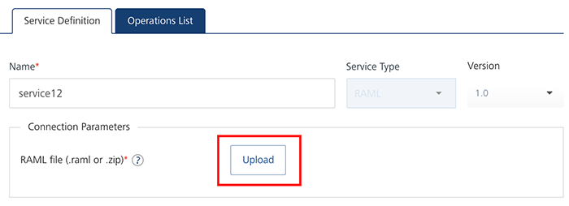
        
        The system adds your main RAML file to the console. The system displays the added RAML file's name under the **Connection Parameters** section.
        
    4.  If required, select an identity provider from the **Authentication** list to link your service.
    5.  Click the **Advanced** tab to specify dependent JAR and API throttling. All options in the Advanced section are optional.
        *   **To specify dependent JAR, follow these steps**:
            
            Select the JAR containing preprocessor or postprocessor libraries from the drop-down list, or click **Upload New** to browse the JAR file from your local system. The step allows you to further filter the data sent to the back end:
            
            Make sure that you upload a custom JAR file that is built on the same JDK version used for installing Volt MX Foundry Integration.  
              
            For example, if the JDK version on the machine where Volt MX Foundry Integration is installed is 1.6, you must use the same JDK version to build your custom jar files. If the JDK version is different, an unsupported class version error will appear when a service is used from a device.
            
        *   **API throttling** enables you to limit the number of request calls within a minute. If an API exceeds the throttling limit, the API will not return the service response.
            
            **To specify throttling, follow these steps:**
            
            1.  In the **Total Rate Limit** text box, enter a required value. With this value, you can limit the number of requests configured in your Volt MX Foundry console in terms of Total Rate Limit.
            2.  In the **Per IP Rate Limit** text box, enter a required value. With this value, you can limit the number of IP address requests configured in your Volt MX Foundry console in terms of Per IP Rate Limit.
                
                Enable API throttling in a clustered environment by configuring the VOLTMX\_SERVER\_NUMBER\_OF\_NODES property in the **server\_configuration** table available in Admin database. This property indicates the number of nodes configured in the cluster. The default value is 1.
                
    6.  Under the **Web Service Authentication**, select one of the following modes:
        *   **None**: Select the option if you do not want to provide any authentication for the service.
        *   **Basic**: Provide User ID and Password if the external Web service requires form or basic authentication.
        *   **NTLM**: Your service follows the NT LAN Manager authentication process. You are required to provide the User ID, Password, NTLM Host and NTLM Domain.
    7.  To enable the proxy, select the **Use proxy from settings** check box. By default, the check box is cleared.
        
        The **Use proxy from settings** check box dims when no proxy is configured under the Settings > Proxy.
        
    8.  Click **SAVE** to save your service definition. The system displays the success message: Service Saved Successfully.
        
        The **Operations List** tab appears only after the **Service Definition** is saved. The **ADD OPERATION** button in the Service Definition page is active only after you click the **SAVE** button.
        

#### How To Create Operations for RAML Service

1.  Click **ADD OPERATION** to display the **Operations List** tab for adding operations.
    
    
    
2.  Under **Operations List** tab, expand the **Please Select** drop down list. Based on the uploaded RAML file, all the supported operations will be displayed.
    1.  Expand an operation.
    2.  Under Objects and Services, select the required check boxes.
3.  Click **ADD OPERATION**. The system adds your operation to the Operations List page.
4.  To configure operations, under **Operations List,** click on a required service.
    
    The operation details are displayed.
    
5.  In the **Name** field, modify the name if required.
6.  Select one of the following security operations in the **Operation Security Level** field. By default, the field is set to Authenticated App User:
    *   **Authenticated App User** – indicates that the operation is secured. To use this operation, an app user must be authenticated by an associated identity service.
    *   **Anonymous App User** – indicates that a user must have the app key and app secret to access the operation.
    *   **Public** – indicates that the operation requires no special security.
7.  Click the **Advanced** tab to configure the preprocessor and postprocessor for Java and JavaScript. All options in the Advanced section are optional. For more details, refer to [Preprocessor and Postprocessor](../../../staging/7.2/assets/voltmx_foundry_user_guide/Content/Java_Preprocessor_Postprocessor_.md).
8.  In the **Input** tab, provide the following details:
    
    Input and Output must be defined in the RAML file only.
    
    1.  The **NAME** field contains a unique identifier for a parameter. Change the identifier if required.
    2.  The **TEST VALUE** field contains a value to be used to test the service. Change the syntax if required.
    3.  In the **DEFAULT VALUE** field, change the syntax if required.
    4.  In the **SCOPE**, select request or session in the **Scope** field. By default, this field is set to **Request**.
        1.  **Request** - indicates that the value must be retrieved from the HTTP request received from the mobile device.
        2.  **Session** - indicates that the value must be retrieved from the HTTP session stored on Volt MX Foundry.
    5.  Select a data type in the **DATATYPE** field:
        1.  **String** - a combination of alpha-numeric and special characters. Supports all formats including UTF-8 and UTF-16 with no maximum size limit.
        2.  **Date** - Date format
            
            *   If datatype is string, then the options in the Format Type are Currency, Number and Date.
            *   If the datatype is number, then the options in the Format Type are Currency and Date.
            *   If the datatype is boolean, then the options in the Format Type and Format Value text box are disabled.
            
            Currently the date datatype is not supported.
            
        3.  **Boolean** - a value that can be true or false.
        4.  **Number** - an integer or a floating number.
    6.  In the **RECORD ID**, provide an ID.
    7.  In the **DESCRIPTION**, provide a description of the Integration Service.
9.  Click the **Response Output** tab to view the output test values, such as name, scope, data type.
10.  To validate the details, select an environment from the **Select Environment** list and click **Save and Test**. The result of the operation appears.
11.  Click **SAVE OPERATION**.
    

How to Configure Swagger Service
--------------------------------

Swagger is a powerful open API specification framework backed by a large ecosystem of tools that helps you design, build, document, and consume your RESTful APIs.

To configure a Swagger service in Volt MX Foundry, a JSON or YAML file(s) (with all dependent swagger files or a single specification file) must be created which defines all the APIs and schemas. When a swagger service is created, and configured, the system retrieves the meta data from the imported single or the dependent JSON or YAML file(s) and displays the APIs of that file.

Volt MX  Foundry parses the JSON or YAML file(s) and exposes all the endpoints through the integration service.

### Configuring Service Definition for Swagger Service

To configure swagger in Integration service, follow these steps:

1.  Click **CONFIGURE NEW** to configure a new service definition in Integration.
    
2.  In the **Service Definition** tab, enter a unique name for the service in the **Name** field. The entered service name is updated under the **All Services** section in the left pane.
3.  From the Service Type, drop-down list select **Swagger**.
    
    On selecting the Service Type as **Swagger**, the following fields are displayed.
    
4.  In the **Connection Parameters** section, click **Upload** to upload a JSON or YAML file(s) with swagger specifications.
    
    The system imports the JSON or YAML file and displays the added file name under the connection parameters section.
    
    
    
5.  If required, select an identity provider from the **Authentication** list to link your service.
    
6.  Under the **Web Service Authentication**, select one of the following modes:
    
    *   **None**: Select the option if you do not want to provide any authentication for the service.
    *   **Basic**: Provide User ID and Password if the external Web service requires form or basic authentication.
        
    *   **NTLM**: Your service follows the NT LAN Manager authentication process. You are required to provide the User ID, Password, NTLM Host and NTLM Domain.
        
7.  Click the **Advanced** link to specify dependent JAR and API throttling. For detailed information, refer to [Advanced](#Advanced) tab.
    
8.  In the **Description** field, enter the description for the defined service.
9.  Click **SAVE** to save your service definition. The system displays the success message: **Service Saved Successfully**.
    
    The **Operations List** tab appears only after the **Service Definition** is saved. The **ADD OPERATION** button in the Service Definition page is active only after you click the **SAVE** button.
    

### How to Create Operations for Swagger Service

**To create operations for the created service definition, follow these steps:**

1.  Click **ADD OPERATION** in **Service Definition** tab to display the **Operations List** tab for adding operations.
    
2.  Under **Operations List** tab, expand the **Please Select** drop down list. Based on the uploaded JSON or YAML file, all the supported operations will be displayed.
    
3.  Expand an Operation and under **Services**, select the required services.
    
    
    
4.  Click **ADD OPERATION**. The system adds your operation to the Operations List page.
    
    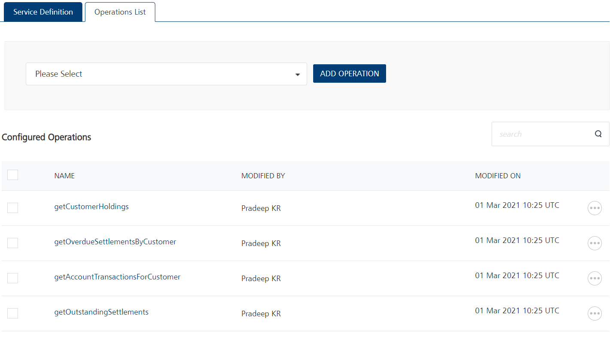
    
5.  To configure operations under **Operations List**, click on a required service.
    
    The operation details are displayed.
    
    
    
6.  In the **Name** field, modify the name if required.
7.  Select one of the following security operations in the **Operation Security Level** field. By default, the field is set to Authenticated App User. For more details, refer to [Security Level](#Security_Level).
    
8.  Click the **Advanced** tab to configure the preprocessor and postprocessor for Java and JavaScript. All options in the Advanced section are optional. For more details, refer to [Preprocessor and Postprocessor](../../../staging/7.2/assets/voltmx_foundry_user_guide/Content/Java_Preprocessor_Postprocessor_.md).
    
9.  In the **Request Input**tab, provide the following details:
    *   The **NAME** field contains a unique identifier for a parameter. Change the identifier, if required.
        
    *   The **TEST VALUE** field contains a value to be used to test the service. Change the syntax, if required.
        
    *   In the **DEFAULT VALUE** field, change the syntax, if required.
        
    *   In the **SCOPE**, select request or session in the Scope field. By default, this field is set to **Request**.
        
        *   **Request** indicates that the value must be retrieved from the HTTP request received from the mobile device.
            
        *   **Session** indicates that the value must be retrieved from the HTTP session stored on Volt MX Foundry.
            
    *   Select a data type in the **DATATYPE** field:
        *   **String** is a combination of alpha-numeric and special characters. Supports all formats including UTF-8 and UTF-16 with no maximum size limit.
        *   **Date** is the Date format
            
            *   If datatype is string, then the options in the Format Type are Currency, Number and Date.
            *   If the datatype is number, then the options in the Format Type are Currency and Date.
            *   If the datatype is boolean, then the options in the Format Type and Format Value text box are disabled.
            
            Currently the date datatype is not supported.
            
        *   **Boolean** a value that can be true or false.
        *   **Number** an integer or a floating number.
    *   In the **RECORD ID**, provide an ID.
    *   In the **DESCRIPTION**, provide a description of the Integration Service.
10.  Click **Add Parameter** to add a new record.
11.  Select a record and click **Copy** to copy the record and click **Paste** to paste it.
12.  Select a record and click **Delete** to delete the selected record.
13.  To validate the details, select an environment from the **Select Environment** drop-down list and click **Save and Fetch Response**. The result of the operation appears in the **Response Output** tab.
14.  Click the **Response Output** tab to view the output test values, such as name, scope, data type.
    
15.  To validate the details, select an environment from the **Select Environment** list and click **Save and Test**. The result of the operation appears..
    
16.  Click **SAVE OPERATION**.
    

### Limitations of using Swagger

**Following are few limitations to be followed before using Swagger:**

*   Only Swagger 2.0 is supported.
    
*   For nested payloads, you cannot test the service from Admin Console in the case of Post/Put. You can only send a request through Admin Console or postman.
    
*   For any operation in Swagger the binary data is not supported.
    
*   If any scheme is not specified in your swagger file, by default HTTPS will be considered.
    
*   If an authentication is linked to your swagger file, you must define it at each operation level under security tag.
    

How to Save or Use a Version of a Service
-----------------------------------------

You can save an integration service to a new version. Saving a new version of an integration service unlinks the current version of the service from the Volt MX Foundry application, and links the new version. A Volt MX Foundry app can be associated with only one version of an integration service.

For more details on API Versioning Use Cases, refer to [VoltMX Foundry API Versioning](API Versioning.md)

To create a new version of an Integration service, follow these steps:

1.  On the **Integration** tab, click the name of a service in the list of existing services. You can also select Edit from the Operations menu for a service.
    
    The **Service Definition** tab appears.
    
2.  Click the **Version** menu.
    
    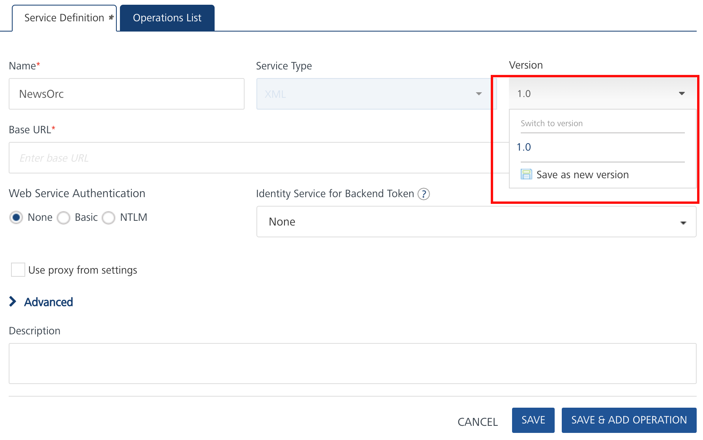
    
3.  Select **Save as new version**.
    
    The **Save as** dialog appears.
    
4.  Type the version number of the new version of the service.
    
    You can use _major.minor_ numbering for versions. Volt MX Foundry supports major versions from 1 through 999, and minor versions from 0 through 99. Volt MX Foundry supports version numbers from 1.0 to 999.99. Note that the dot '.' is a separator for version numbers and does not function as a decimal.
    
5.  Add a description of the new version.
6.  Click **OK**.
    
    Volt MX Foundry links the new version of the service to the Volt MX Foundry app, and unlinks the previous version.
    

To use a different version of an integration service, follow these steps:

1.  On the **Integration** tab, click the name of a service in the list of existing services. You can also select Edit from the Operations menu for a service.
    
    The **Service Definition** tab appears.
    
2.  Click the **Version** menu.
    
    
    
3.  Select a version of the service.
    
4.  The **Alert** dialog appears. The Alert warns you that you are unlinking the current associated version of the service from the application.
    
5.  Click **OK**.
    
    Volt MX Foundry links the version that you selected to the Volt MX Foundry application.
    

How to Use an Existing Integration Service
------------------------------------------

VoltMX VoltMX Foundry allows you to use an existing integration service.

To use an existing integration service, follow these steps:

1.  Go to the **Integration** tab. The page lists the existing services (if any).
2.  In the **Integration**, click ****USE EXISTING**** from the tree in the left-pane or right pane.
    
    To use an existing integration service, in the **Integration** page, you can also click **USE EXISTING**.
    
    
    
    The Existing services dialog appears with a list of existing services.
    
    
    
3.  To use a different version of an integration service, click the **Version** menu of the required service and  select a version of the service.
4.   Hover your cursor over service, and click the **Select** or **Clone** button.
    *   Click **Select** to reuse (link) an existing service. If any changes made to this service, the changes will affect in all the apps using this service.
        
        If a service is a part of a published app, you can rename that service only after the app is unpublished.
        
    *   Click **Clone** to duplicate an existing service. If any changes made to this service will have no impact on the original service.

How to Use Actions on an Existing Integration Service
-----------------------------------------------------

To use actions for existing services such as edit, clone, sample code, unlink, and delete, hover your cursor over the required service, click the **Settings** button to display the context menu. You can perform the following actions on an existing service:

*   **Edit**: Allows you to edit a service. After you edit a service, you have to republish all the apps that are using the service to apply the changes.
    
    To know more about publishing an app, refer to [Publish an app](Publish.md).  
    
    If a service is part of a published app, you can rename that service only after the app is unpublished. Refer to [Unpublish an App](Publish.md).
    
*   **Clone**: Allows you to duplicate an existing service. Changes made to a cloned service will not impact the original service.
*   **Sample Code**: A dynamic code is generated based on the configuration of a service. You can use this code in your SDK.
*   **Unlink**: Allows you remove the service from the **Integration** tab of an app. When a service is unlinked, it is disassociated from a particular app.
    
    If you want to use an unlinked service, select the service from the [Use Existing Integration Service](Services.md#use-cases) dialog.
    
*   **Delete**: Allows you to delete a service.
    
    If a service is a part of a published app, you can delete that service only after you unlink the service from all the published app.
    
*   **Export**: Allows you to export the integration service into your local system. The exported file is an .xml file.

Test the Login for an OAuth 2.0 Identity Service
------------------------------------------------

When you are defining an operation for an integration service, you can request that Volt MX Foundry fetch the response to the operation. If the integration service uses an OAuth 2.0 identity service for authorization, you must log in to the identity service before Volt MX Foundry can fetch the response from the back end.

When you first request that Volt MX Foundry fetch the response, the service does not yet have the required token. You can then authorize Volt MX Foundry to generate the token. Volt MX Foundry then pops up the sign in for the OAuth 2.0 identity provider. After you successfully sign in to the identity service, Volt MX Foundry sends the request with the identity to the OAuth 2.0 back end. Volt MX Foundry gets the token and stores it in a cookie for Volt MX Foundry on the browser. Volt MX Foundry sends the token to the back end, and because the back end has the valid OAuth 2.0 token, the back end sends its response. The back end populates the identity backend response, the backend response, and the output result.

For the lifetime of the session, you can test an operation and you are not required to sign in again. In the identity backend response, you can view the token and clear the token if you want to test the login again.

To test the log in for an identity service, do the following:

1.  Click **Fetch Response**.

The **Identity Backend Response** tab appears. Volt MX Foundry identifies that the integration service is linked to an OAuth identity service. A message informs you that the service needs a backend token. If the message does not appear, the integration service has the backend token.

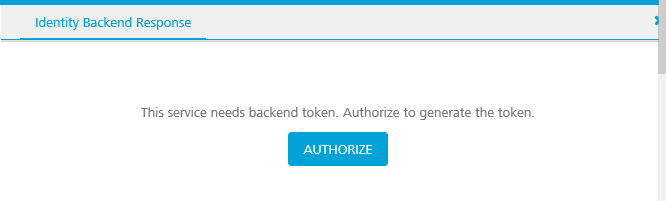

4.  Click **Authorize**.

The sign in screen for the identity service appears.

6.  Enter your credentials and click **Sign In**.

The backend response is populated in the response pane.

8.  To clear the cached token, in the Identity Backend Response tab, click **Clear Token**.

In the Identity Backend Response tab, you can click **Copy** to copy the results of the response to the clipboard. Click **Expand** to open the Identity Backend Response in its own window.

If a custom integration service (for example, MongoDB or RAML) is linked to an OAuth2 identity service, while testing an operation of the integration service from VoltMX Foundry Console, you must pass the `x-volt-mx-oauth2-access-token` as header and `access_token` as header value.  
  
Also, If a custom integration service (for example, MongoDB or RAML) is linked to an OAuth2 identity service, while testing an operation of the integration service from Admin Console, you must pass the `x-volt-mx-oauth2-access-token`  as header and `access_token` as header value.  
  
For example:  
  


<table style="margin-left: 0;margin-right: auto;" madcap:conditions="Default.HTML5 Only"><colgroup><col> <col> <col></colgroup><tbody><tr><td>Rev</td><td>Author</td><td>Edits</td></tr><tr><td>7.1</td><td>SD</td><td>SD</td></tr></tbody></table>
