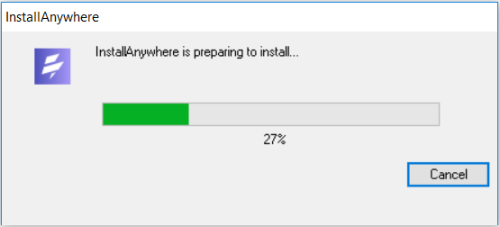
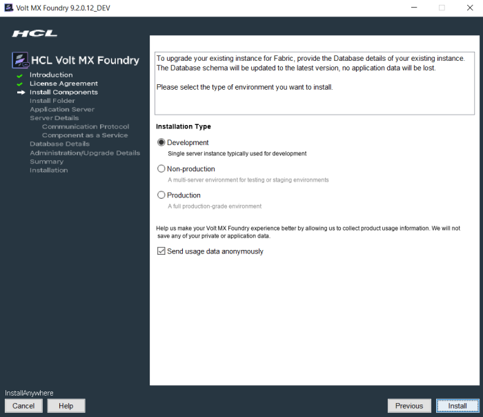
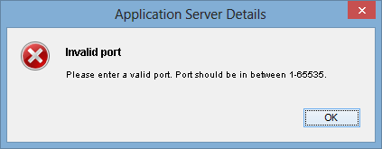

                         


Installing Volt MX Foundry on Tomcat
=====================================

This section of the document provides you with the instructions for installing and configuring Volt MX Foundry components on a single node. For multi-node installations, refer to [Deployment Checklist and Example Case Studies](../../../Foundry/voltmx_Foundry_deployment_guide/Content/Deployment_Checklist.md).

> **_Important:_** You need the required hardware and access to the supporting software as mentioned in the [Prerequisites](Prerequisites.md) section and must perform the steps noted in the [Pre-installation Tasks](Pre-installation_Tasks.md) section.

Make sure that you have proper administrative rights to install Volt MX Foundry on your computer.

The **\<Install Location\>** directory contains the log files documenting each invocation of the installer or uninstaller. To make problem identification easier, provide these log files to Volt MX when reporting an issue.

To install Volt MX Foundry on Tomcat using the installer, follow these steps:

1.  Unzip the `VoltMXFoundrySetup.zip` file.

2.  Double-click `VoltMXFoundryInstaller-x.x.x.x_GA.exe` to launch the
    installer.
    
    The **InstallAnywhere** dialog appears. The **InstallAnyWhere** dialog displays information about the progress of the software installation at run time.

    
    
    A dialog with the Volt MX Foundry logo appears.
    
    
    
3.  The **Welcome to Volt MX Foundry** windows appears.  
    Read the instructions carefully before installing Volt MX Foundry Console.
    
    
    
4.  Read the instructions carefully, and click **Next**.  
    The **LICENSE AGREEMENT** window appears.
    
5.  Scroll until end of the screen, and then select the "**I accept the terms of the License Agreement**" option.
    
      
    
    <p id="InstallComponents"></p>

6.  Click **Next**. The **Install Components** window appears with the
    following supported installation types:

    *   **Development** for single machine instance.
    *   **Non-Production** for larger environments like Staging or Testing.
        
    *   **Production** for a full production-grade instance.
    
    Installation environment is set to Development by default . Choose one of the install type based on your requirement.
    

    

    
7.  Select the **Send usage data anonymously** check box. This allows
    HCL to collect product usage information to make your Volt MX Foundry experience better. HCL does not save any of your private or application data. By default this check box is selected.

8.  Click **Next**. The **Choose components to install** window appears.
    
    
    
9.  Select one or more check boxes for the supported components. By
    default, the **Console**, **Identity Services**, **Integration Services**, **Developer Portal**, and **Engagement Services** check boxes are selected:
    
    *   **Console** - To install Volt MX Foundry Console, select the **Console** check box.  
        The system creates the following databases: `<prefix>mfconsoledb<suffix>`, `<prefix>mfaccountsdb<suffix>`, and  `<prefix>mfreportsdb<suffix>`.
    *   **Identity Services** - To install Volt MX Identity Services, select the **Identity Services** check box.  
        The system creates the following database: `<prefix>idconfigdb<suffix>`.
    *   **Integration Services** - To install Volt MX Foundry Integration Services, select the **Integration Services** check box.  
        The system creates the following databases: `voltmxadmindb`  and  `mfreportsdb`.
    *   **API Developer Portal** - To install developer portal, select the **API Developer Portal** check box.  
        
        > **_Note:_** During installation if you have selected **API Developer Portal**, the **API Developer Portal** is created. You can directly access your [Volt MX Developer Portal](../../../Foundry/voltmx_foundry_user_guide/Content/VoltMXDevPortal.md) in Volt MX Foundry Console.
        
    *   **Engagement Services** - To install Volt MX Foundry Engagement Services, select the **Engagement Services** check box.  
        The system creates the following database: `<prefix>kpnsdb<suffix>`.
    
    **Reports Database**
    
    The reports database is used for configuring reports.
    
    The Installer creates the `mfreportsdb` if you are installing the following Volt MX Foundry components:
    
    *   **Console** without Integration Services (with or without Engagement Services)
    *   **Console** and **Integration Services** (with or without Engagement Services)
    *   **Integration Services** without Console (with or without Engagement Services)
    
    > **_Important:_**  If you try to install Integration and Console in different nodes, ensure that you point to the same reports database to make reports feature work properly.
    
    Reports Database for Integration on a Separate Node
    
    While installing console and integration on separate nodes, the installer prompts you to point the reports database during the integration installation.  
      
    For example:  
    You have installed only Console on one node. The installer creates these three databases such as `<>mfreportsdb<>` along with the `<>mfconsoledb<>` and `<>mfaccountsdb<>`. For example, your report database name is `voltmxmfreportsdb1`  
      
    When you install the integration with or without one or more components (identity, or Engagement Services) on a separate node, the installer displays the **Reports Database Name** field in the **Database Details** window. If the installer prompts you to enter the existing reports db, enter the reports database name (for example, `voltmxmfreportsdb1`) in the **Database Details window > Reports Database Name** field. Refer to the [Database Details](#DatabaseDetails) window.  
      
    Refer to [creating a reports database, for example : mfreports
    
10. Click **Next**. The **Install Folder** window appears. The selected
    path appears in the **Where would you like to install** field.
    

    

    
11. Click **Choose** to browse the required folder from your system.

12. Click **Next**. The **Application Server** window appears asking you
    to choose the application server. By default, the Application Sever is set to Tomcat.
    

    

    
13. In the **Application Server** window, click **Tomcat**.  
    
    > **_Note:_** By default Tomcat manager password is used by Volt MX Foundry for Web Application publish. To change the default Tomcat manager password, the new password needs to be replaced in the `password` field for the user `manager` in the `<tomcat-users>` tag in the `tomcat-users.xml`.  

	Now to replace the value in database, the password value should be encrypted. To encrypt the database password, follow these steps mentioned in the [Encrypt\_Passwords](../../../Foundry/voltmx_foundry_manual_install_guide/Content/Encrypt_Passwords.md) section.  
      
	Once the password is encrypted, replace the encrypted value in the `prop_value` column in the row where prop\_value is `management_server_password` of `<DatabasePrefix>admindb<DatabaseSuffix>` database in the `server_configuration` table.
    
14. Click **Next**.

    <p id="Step13"></p>
    The <b>HTTP or HTTPS</b> window appears asking you to choose the HTTP or HTTPS. By default, this option is set to <b>HTTP</b>.
    
    
    
    <p id="Step10a"></p> 
    a) Between HTTP and HTTPS, if you select HTTP, the following window appears. Enter the <b>Hostname/IP Address</b>, <b>HTTP Port</b>, and <b>Tomcat Shutdown Port</b>. Click <b>Next</b>.
    
    
    
    <p id="Step10b"></p> 
    b) Between HTTP and HTTPS, if you select HTTPS, the following window appears. Enter the <b>Hostname/IP Address</b> <b>HTTP Port</b> <b>HTTPS Port</b> and <b>Tomcat Shutdown Port</b> Click <b>Next.</b>
    
    
    
    > **_Important:_** After installing Volt MX Foundry, import your SSL certificate (for example, `domain.subdomain.crt`) into your Volt MX Foundry Installer's JRE trusted certificate authority (CA) certificates file - for example, `<INSTALL_DIR>\jre\lib\security\cacerts`  
      
    If your SSL certificate is not configured, the system displays an error - for example, "peer not authenticated."  
      
    For details, refer to [Troubleshoot with SSL Certificate Issues](Troubleshooting.md#Service_Provider's_Certificate_Issues).
    
    If any input goes wrong among the inputs provided in the previous steps: [HTTP or HTTPS  >  a](#Step10a)  or  [HTTP or HTTPS  >  b](#Step10b), one of the following error messages will appear:
    
    *   If you provide an invalid hostname/IP address, the following alert is displayed:
        
    
        
    *   If a port is in use, the following alert is displayed:
        
    
        
    *   If you provide an invalid Port, the following alert is displayed:
        
    
        
    *   If you provide the same port numbers for HTTP and HTTPS, the following alert is displayed:
        
    
        

15. After you configure the application server details in the **[HTTP or
    HTTPS](#Step13)** window, click **Next**. The **SSL Configuration** for HTTPS Communication option appears only if you select **HTTPS**. By default, the **Generate a self-signed certificate** option is selected. Choose one of the following two options:

1.  To generate a self-signed certificate, click **Generate a
    self-signed certificate**, and click **Next**. The Details for self-signed SSL Certificate window appears.
        
    > **_Important:_**  To add an existing SSL certificate to a cacerts file, refer to [How to Add Your Existing SSL Certificate](Post-Installation_Tasks.md#how-to-add-an-existing-ssl-certificate-to-cacerts).
        
    
        
    
        
    > **_Note:_** The path for a self-signed certificate is in this location: `<install folder>\keystore.jks`
        
    1.  Enter details for the following fields:
        *   **Organization Unit**: Enter your business unit name.
            *   **Host Name**: Enter your domain name - for example, hcl.net
            *   **Company**: Enter your company name.
            *   **City**: Enter your city name.
            *   **State**: Enter your state name.
            *   **Country**: Enter your country name.
            *   **Certificate Password**: Enter the password for the .jks file that the installer will generate.
            
            *   If you enter invalid details, the following error message is displayed:
                
                
                
            
    2.  To use an existing SSL certificate, click **Use existing certificate**, and click **Next**. The SSL Certificate window appears.
        
    
        
    
        
    > **_Note:_** Provide path for .jks file as input.
        
    
    In the **SSL Configuration** window, enter the file path for keystore file and password details.
    *   If you enter invalid certificate details, the following error message is displayed:
            
    
            

17. Click **Next** to display the **Service Details** window.
    
    
    
    <p id="DatabaseDetails"></p> 
    
18. Click **Next**. The **Database Details** window appears. From the **Choose Database Provider** drop-down, select one of the databases to display database details and fill the details. By default, this option is set to MySQL. 
    
    *   Enter the following database details for **MySQL**.
        
        
        
        **MySQL Cluster - Group Replication** is a new replication type supported from MySQL 5.7 onwards. In case your Foundry setup consists of a MySQL Cluster with Group Replication, please select the same from the list of Database Type Providers instead of the default MySQL option.
        
        
        
        *   **Database Server Hostname/IP**: Enter the DB server Hostname/IP to be used to create a database of selected components of Volt MX Foundry. By default, the server Hostname/IP is set as localhost.
        *   **Database Port**: Enter the database port of the MySQL Server. By default, this field is set to 3306 for MySQL.
        *   **Database User**: Enter the user name used while creating the database user - for example, dbclient.
        *   **Database Password**: Enter the user password used while creating the database user.
        *   **Database Name Prefix**: Enter the valid prefix databases - for example, Volt MX.
        *   **Database Name Suffix**: Enter the valid suffix for all databases - for example, 1.
    *   Enter the following database details for **Oracle**.
        
        
        
        *   **Database Server Hostname/IP**: Enter the DB server Hostname/IP to be used to create a database of selected components of Volt MX Foundry. By default, the server Hostname/IP is set as localhost.
        *   **Database Port**: Enter the database port of the Oracle Server. By default, this field is set to 1521 for Oracle.
        *   **Service ID / Service Name:** Enter Oracle service ID or service name. Service ID is unique alias given to an instance name of Oracle DB.
        *   Select the **Tablespace** for Oracle database:
            
        > **_Important:_**  If tablespaces were already created, the DBA must grant quota (permissions) on these tablespaces to the installer with admin option.  
              
        The DBA also must include grant quota on the schemas from installer login.
            
        *   **Default Tablespace**: If selected, the database schema and SQL scripts migration happen automatically to the default tablespace for example, `USERS`.
        *   **User Defined Tablespace**: If selected, enter the tablespaces for the following:
        *   **Data Tablespace**:  
        Enter the name for Data tablespace.  
                    
        This is a mandatory field. If the Data tablespace field empty, the installer displays the error message:
                    
        
                    
        If the Data tablespace (for example, SampleData) does not exist, the installer displays the error message:
                    
        
                    
        *   **Index Tablespace**: Enter the name of Index tablespace.  
        If the input for Index Tablespace is not provided, then the value will be set to the provided Datatable space value.
        *   **LOB Tablespace**: Enter the name for LOB tablespace.  
        If the input for LOB Tablespace is not provided, then the value will be set to the provided Datatable space value.
        *   **Database System User**: Enter the user name used while creating the database user - for example, dbclient or system.
        *   **Database System Password**: Enter the user password used while creating the database user.
        *   **Database Name Prefix**: Enter the valid prefix databases - for example, Volt MX.
        *   **Database Name Suffix**: Enter the valid suffix for all databases - for example, 54.
      
    *   Enter the following database details for **SQL Server**.
        
    > **_Important:_** If you want to enable Windows Authentication Support on SQL Server, run the following command to start the installation process after extracting the artifact:
        
     
    VoltMXFoundryInstaller-9.0.0.0_GA.exe -Dprop.java.library.path=< location of sqljdbc_auth.dll>

    > **_Note:_** If you choose to enable Windows Authentication support on SQL Server, you do not need to provide the **Database System User** and **Database System Password**.
        
    
        
    *   **Database Server Hostname/IP**: Enter the DB server Hostname/IP to be used to create a database of selected components of Volt MX Foundry. By default, the server Hostname/IP is set as localhost.
        *   **Database Port**: Enter the database port of the SQL Server. By default, this field is set to 1433 for SQL.
        *   **Database System User**: Enter the user name used while creating the database user - for example, dbclient.
        *   **Instance Name (Optional)**: Enter the instance name for the database. This information is optional.
        *   **Database System Password**: Enter the user password used while creating the database user.
        *   **Database Name Prefix**: Enter the valid prefix databases - for example, Volt MX.
        *   **Database Name Suffix**: Enter the valid suffix for all databases - for example, 54.
        
        If a database faces connection issues, the system displays an error message. For example:  
        
        
        > **_Important:_** Follow the below steps only if you want install Volt MX Foundry on Tomcat with Microsoft Azure SQL Server database.
        
        *   For **Microsoft Azure (MSSQL)**, If you want to install Volt MX Foundry V9 on Tomcat with Microsoft Azure SQL, you must edit the `authService.xml` file from the existing Tomcat with Microsoft SQL Server install location. For more details, refer the following section on how to configure identity to work on Microsoft Azure SQL.
            
            
<details close markdown="block">
<summary>Click here</summary>

Configure Identity on Tomcat with Microsoft Azure SQL Server
            
To run identity on Tomcat with Microsoft Azure SQL, you must edit the `authService.xml` file from the existing Tomcat with MSSQL install location.

   1.  Open the `authService.xml` file from the existing Tomcat with
      MSSQL install location.  
      Sample Location for authService.xml from Tomcat with MSSQL install folder, `<LocalDrive>\VoltMXFoundryInstallerV8\tomcat\conf\Catalina\localhost\authService.xml`
   2.  Modify the following the `authService.xml` file:


```
    <?xml version="1.0" encoding="utf-8" ?>
    <!-- The contents of this file will be loaded for each web application -->
    <Context>

    <Resource auth="Container" driverClassName="com.microsoft.sqlserver.jdbc.SQLServerDriver"  
    factory="org.apache.tomcat.jdbc.pool.DataSourceFactory" initialSize="5" jmxEnabled="true" logAbandoned="true" maxActive="10" maxIdle="5" maxWait="10000" minEvictableIdleTimeMillis="30000" minIdle="2" name="jdbc/authglobaldb" password="<Password>" removeAbandoned="true" removeAbandonedTimeout="600" testOnBorrow="true" testOnReturn="false" testWhileIdle="true" timeBetweenEvictionRunsMillis="30000" type="javax.sql.DataSource" url="jdbc:sqlserver://<DBServerIP:PORT>;databasename=<auth database name>;sendStringParametersAsUnicode=true;" username="<User_Name>" validationInterval="30000" validationQuery="SELECT 1"/>

    <Resource auth="Container" driverClassName="com.microsoft.sqlserver.jdbc.SQLServerDrive"factory="org.apache.tomcat.jdbc.pool.DataSourceFactory" initialSize="5" jmxEnabled="true" logAbandoned="true" maxActive="10" maxIdle="5" maxWait="10000" minEvictableIdleTimeMillis="30000" minIdle="2" name="jdbc/authconfig" password="<Password>" removeAbandoned="true" removeAbandonedTimeout="600" testOnBorrow="true" testOnReturn="false" testWhileIdle="true" timeBetweenEvictionRunsMillis="30000" type="javax.sql.DataSource" url="jdbc:sqlserver::/<DBServerIP:PORT>;databasename=<auth database name>;sendStringParametersAsUnicode=true;" username="<User_Name>" validationInterval="30000" validationQuery="SELECT 1"/>

    < /Context >

```

</details>

*   Enter the following database details for **MariaDB**.
    *   **Database Server Hostname/IP**: Enter the DB server Hostname/IP to be used to create a database of selected components of Volt MX Foundry. By default, the server Hostname/IP is set as localhost.
    *   **Database Port**: Enter the database port of the MariaDB. By default, this field is set to 3306 for MariaDB.
    *   **Database User**: Enter the user name used while creating the database user.
    *   **Database Password**: Enter the user password used while creating the database user.
        
        > **_Important:_** The **Reports Database Name** field appears only if you have selected the Console, Identity, and Integration during [Install Components](#InstallComponents).
        
    *   **Database Name Prefix**: Enter the valid prefix databases - for example, Volt MX.
    *   **Database Name Suffix**: Enter the valid suffix for all databases - for example, 54.

19. After entering database server details, click **Next**.
    
    If a database exists, the system displays the warning message: `One or more databases already exist. Do you want to use existing databases? If yes, then the schema may be upgraded.` Shown as follows:
    
    
    
    > **_Important:_** If you are installing Volt MX Foundry V8 on an application server using the existing database and in case if there is a change in server details, you must update the `management_server` details in the `admin` database with the application server instance details for the WebAapp publish to work. You must update the following fields in the `server_configuration` table of the **admin DB**:  
    \- management\_server\_host\_name <application\_instance hostname>  \- management\_server\_port <soap port of application\_instance>  \- management\_server\_user <application\_instance admin username>  \- management\_server\_password <application\_instance admin password>   - management\_server\_groups <application\_instance groups details>
    
20. Click **Next**. The **Administrator Account Configuration** window appears.
    
    The **Administrator Account Configuration** window helps you to configure your super administrator account.
    
    The **Administrator Account Configuration** window appears only while installing Console and Identity Services along with one or all other Volt MX Foundry components such as Integration Services, and Engagement Services on Tomcat on a single node. You can select the components at [Install Components](#InstallComponents).
    
    
    
    > **_Note:_** During installation if you have configured your super administrator account, you can directly log in to Volt MX Foundry Console.
    
21. Select the **Create Volt MX Foundry Administrator Account now** check box and enter the following details to create the super administrator account.
    *   **Public URL**: The URL field is filled with required details, for example. `<Hostname/IP address>:<port>`. Change these details, if required.
        
    *   **First Name**: Enter your first name.
        
    *   **Last Name**: Enter your last name.
        
    *   **Email**: Enter your email address. It can include alphanumeric and special characters that follow the standard email address form.
        
    *   **Password**: Enter the password. It can be a combination of alphanumeric and special characters.
        
    *   **Confirm Password**: Retype the password to reconfirm your identity.
        
22. Enter the databases details, and click **Next**. The **Pre-Installation Summary** window appears.
    
    
    
23. Click **Install**. The **Installing Volt MX Foundry** window appears.
    
    
    
    > **_Note:_**  Sometimes, even after showing 100% installation progress, Volt MX Foundry Installer takes around 20 more minutes to complete installation on Windows.
    
    Once the installation is completed, the **Install Complete** window appears with a confirmation message.
    
      
    
24. Copy the URLs and save them in a notepad. Click **Done** to close the window.
    
    > **_Important:_** After installing Volt MX Foundry, import your SSL (for example, `domain.subdomain.crt`) into your Volt MX Foundry Installer's JRE trusted certificate authority (CA) certificates file - for example, `C:\VoltMX Foundry\jre\lib\security\cacerts`  
      
    If your SSL certificate is not configured, the system displays an error message - for example, "peer not authenticated."  
      
    For details, refer to [Troubleshoot with SSL Certificate Issues](Troubleshooting.md#Service_Provider's_Certificate_Issues).
    
    > **_Note:_** You can now access Volt MX Foundry Console by using the URLs. For more details, refer to [Accessing Vol tMX Foundry Console - On-premises](../../../Foundry/voltmx_foundry_user_guide/Content/How_to_access_VoltMX_Foundry_Portal_on-Prem.md).  
      
    During installation if you have configured your super administrator account, you can directly [log in to Volt MX Foundry Console](../../../Foundry/voltmx_foundry_user_guide/Content/How_to_access_VoltMX_Foundry_Portal_on-Prem.md) by using the Console URL.

</details>
