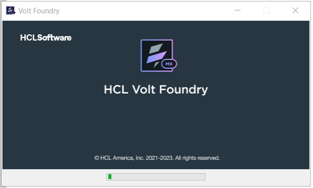
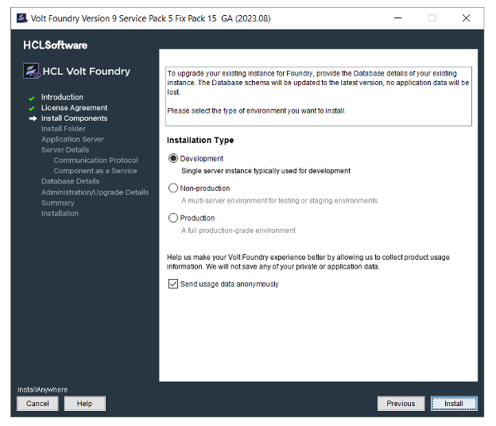
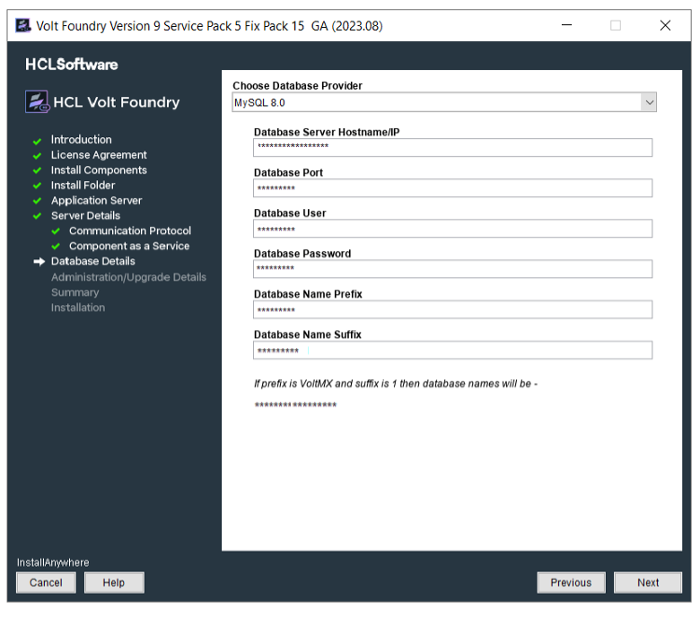
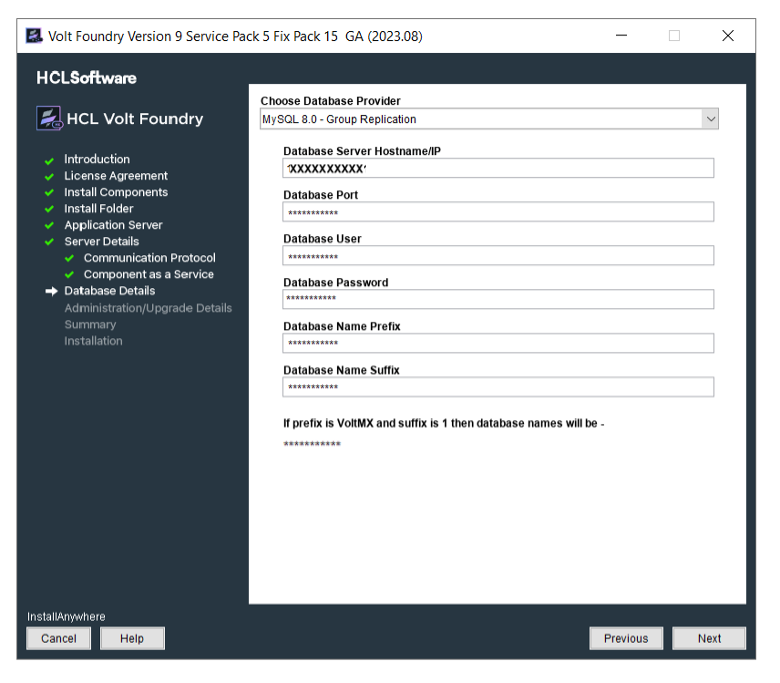
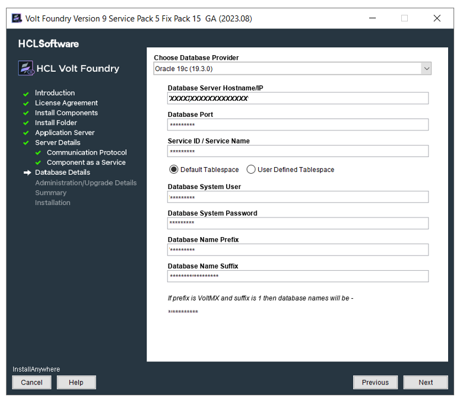
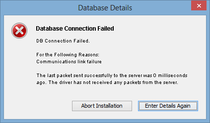
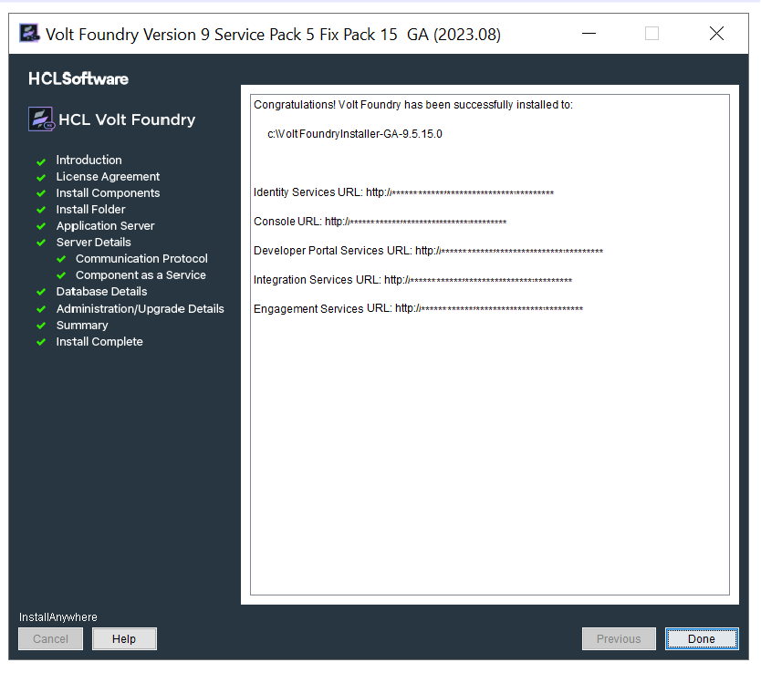

# Installing Volt Foundry on WebLogic

This section of the document provides you with the instructions for installing and configuring Volt Foundry components.

> **_Important:_** You need the required hardware and access to the supporting software as mentioned in the [Prerequisites](Prerequisites.md) section and must perform the steps noted in the [Pre-installation Tasks](Pre-installation_Tasks.md) section.

Ensure that you have proper administrative rights to install Volt Foundry on your computer.

The **<Install Location\>** directory contains the log files documenting each invocation of the installer or uninstaller. To make problem identification easier, provide these log files to Volt MX when reporting an issue.

To install Volt Foundry on WebLogic using the installer, follow these steps:

1.  Unzip the `VoltMXFoundrySetup.zip` file.
2.  Double-click `VoltMXFoundryInstaller-x.x.x.x_GA.exe` to launch the installer.  
    The **InstallAnywhere** dialog appears. The **InstallAnyWhere** dialog displays information about the progress of the software installation at run time.

    

    A dialog with the Volt Foundry logo appears.

    

3.  The **Welcome to Volt Foundry** windows appears.  
    Read the instructions carefully before installing Volt Foundry Console.

    

4.  Read the instructions carefully, and click **Next**.  
    The **LICENSE AGREEMENT** window appears.

5.  Scroll until end of the screen, and select the "**I accept the terms of the License Agreement**" option.

    **Note: **To activate the License Agreement option, read carefully the whole agreement text.

      

6.  Click **Next**. The **Install Components** window appears with the following supported installation types:
    *   **Development** for single machine instance.
    *   **Non-Production** for larger environments like QA or UAT.
    *   **Production** for the production instance.

    Installation environment is set to Development by default .

    

7.  Choose one of the appropriate install type based on your license - for example, Development, Non-Production, or Production.
8.  Select the **Send usage data anonymously** check box. Allows Volt MX to collect product usage information to make your Volt Foundry experience better. Volt MX does not save any of your private or application data. By default this check box is selected.
9.  Click **Next**. The **Choose components to install** window appears.

    

10.  Select one or more check boxes for the supported components. By default, the **Console**, **Identity Services**, **Integration Services**, **Developer Portal**, and **Engagement Services** check boxes are selected:
    *   **Console** - To install Volt Foundry Console, select the **Console** check box.  
        The system creates the following databases: `<prefix>mfconsoledb<suffix>`, `<prefix>mfaccountsdb<suffix>`, and  `<prefix>mfreportsdb<suffix>`.
    *   **Identity Services** - To install Volt MX Identity Services, select the **Identity Services** check box.  
        The system creates the following database: `<prefix>idconfigdb<suffix>`.
    *   **Integration Services** - To install Volt Foundry Integration Services, select the **Integration Services** check box.  
        The system creates the following databases: `voltmxadmindb`  and  `mfreportsdb`.
    *   **API Developer Portal** - To install developer portal, select the **API Developer Portal** check box.  

        > **_Note:_** During installation if you have selected **API Developer Portal**, the **API Developer Portal** is created. You can directly access your [VoltMX Developer Portal](../../../Foundry/voltmx_foundry_user_guide/Content/VoltMXDevPortal.md) in Volt Foundry Console.

    *   **Engagement Services** - To install Volt Foundry Engagement Services, select the **Engagement Services** check box.  
        The system creates the following database: `<prefix>kpnsdb<suffix>`.

 

<u style="font-weight: bold; font-size: 14pt;">Reports Database</u>

The reports database is used for configuring reports.

The Installer creates the `mfreportsdb` if you are installing the following Volt Foundry components:

*   **Console** without Integration Services (with or without Engagement Services)
*   **Console** and **Integration Services** (with or without Engagement Services)
*   **Integration Services** without Console (with or without Engagement Services)

**Note: ** If you try to install Integration and Console in different nodes, ensure that you point to the same reports database to make reports feature work properly.

<u style="font-weight: bold; font-size: 14pt;">Reports Database for Integration on a Separate Node:</u>

While installing console and integration on separate nodes, the installer prompts you to point the reports database during the integration installation.  

For example:  
You have installed only Console on one node. The installer creates these three databases such as `<>mfreportsdb<>` along with the `<>mfconsoledb<>` and `<>mfaccountsdb<>`. For example, your report database name is `voltmxmfreportsdb1`  

When you install the integration with or without one or more components (identity, or Engagement Services) on a separate node, the installer displays the **Reports Database Name** field in the **Database Details** window. If the installer prompts you to enter the existing reports db, enter the reports database name (for example, `voltmxmfreportsdb1`) in the **Database Details window > Reports Database Name** field. Refer to the [Database Details](#DatabaseDetails) window.  

Refer to [creating a reports database, for example, **<prefix\>mfreports<suffix\>**](#CreatingReportsDB).

11.  Click **Next**. The **Install Folder** window appears. The selected path appears in the **Where would you like to install** field.

     

12.  Click **Choose** to browse the required folder from your system.
13.  Click **Next**. The **Application Server** window appears asking you to choose the application server. By default, the Application Sever is set to Tomcat.

     

14.  In the **Application Server** window, select **WebLogic**.
15.  Click **Next** to display the **Service Details** window.
16.  In the **Service Details** window, enter your current system log-in details.
17.  Click **Next**. Enter the details:
     1.  The following window will appear only if you select all the check boxes at [Install Components](#InstallComponents).

         

        *   **Fully Qualified Public URL of Volt Foundry Console**:  Enter load balancer URL to use public communication.

        *   **Hostname/IP Address of WebLogic Administrator Server**: Enter IP Address/Hostname of the WebLogic Administrator Server.  

        *   **WebLogic Administrator Port**: Enter native port of WebLogic Administrator Server.
        *   **WebLogic Administrator Server User**: Enter the log-in username for WebLogic Administrator Server.

        *   **WebLogic Administrator Server User Password**: Enter the log-in password for WebLogic Administrator Server.  

     2.  Click **Next**. The **Server Groups** window appears.  
        A WebLogic Server group consists of multiple server instances that run simultaneously on the same machine or on different machines. Volt Foundry supports **WebLogic Servers** and **WebLogic Clusters**.

         

     3.  Enter server groups separated by commas - for example, 1, 2, shown in the previous step. Click **Next**. The system displays the selected groups in the **Selected Server Group** window, shown below:

         

     4.  Click **Next**. The following screen appears for WebLogic connector Jar.
        *   **MS SQL**: If you want to install Volt Foundry on WebLogic with MS SQL, you must place the SQL connector jar ( `mssql-jdbc-7.2.2.jre11.jar` ) in the WebLogic Server path.

            For more details, follow the below steps:            

            To use Volt Foundry with WebLogic Server in combination with MS SQL database, place the SQL connector jar (mssql-jdbc-7.2.2.jre11.jar) in the WebLogic Server.

            Perform the following steps to complete pre-requisites before continuing with installation :

            1.   Copy the mssql-jdbc-7.2.2.jre11.jar from your Volt Foundry Installation folder.
            2.   Paste the mssql-jdbc-7.2.2.jre11.jar into the `<WL_HOME\>/server/lib` folder
            3.   Go to the `<WL_HOME\>/user_projects/domains/base_domain/bin` and edit the startWeblogic script file.

                <pre class="prettyprint prettyprinted" style="">For  Windows: startWeblogic.cmd</pre>

            4.   Prepend your JAR file to the SAVE_CLASSPATH environment variable.

                <pre class="prettyprint prettyprinted" style="">set SAVE_CLASSPATH=%WL_HOME%/server/lib/mssql-jdbc-7.2.2.jre11.jar;%CLASSPATH%</pre>

            5.   If Windows Integrated Auth is enabled, the sqljdbc_auth.dll should be copied to the folder at: `<WL_HOME\>/user_projects/domains/base_domain/bin`
            6.   Restart the server.

                **Note: **<WL_HOME\> is the folder where WebLogic is installed.

                

        
        *   **Oracle**: To use Volt Foundry with WebLogic Server in combination with Oracle database, you must place the Oracle connector jar (ojdbc8.jar) in the WebLogic Server path.

            For more details, follow the steps in the below:

            Perform the following steps to complete pre-requisites before continuing with installation :

            1.  Copy the ojdbc8.jar from your Volt Foundry Installation folder.
            2.  Paste the ojdbc8.jar into the `<WL_HOME\>/server/lib` folder
            3.  Go to the `<WL_HOME\>/user_projects/domains/base_domain/bin` and edit the startWeblogic script file.

                <pre class="prettyprint prettyprinted" style="">For  Windows: startWeblogic.cmd</pre>

            4.  Prepend your JAR file to the SAVE_CLASSPATH environment variable.

                <pre class="prettyprint prettyprinted" style="">set SAVE_CLASSPATH=%WL_HOME%/server/lib/ojdbc8.jar;%CLASSPATH%</pre>

            5.  Restart the server.

                **Note: **<WL_HOME\> is the folder where WebLogic is installed.

                

            
        *   **MySQL**: To use Volt Foundry with WebLogic Server in combination with MySQL database, you must place the MySQL connector jar (mysql-connector-java-8.x.x) in the WebLogic Server path.

            For more details, follow the steps in the below

            Perform the following steps to complete pre-requisites before continuing with installation :

            1.  Copy the mysql-connector-java-8.x.x from your Volt Foundry Installation folder.
            2.  Paste the mysql-connector-java-8.x.x into the `<WL_HOME\>/server/lib` folder
            3.  Go to the `<WL_HOME\>/user_projects/domains/base_domain/bin` and edit the startWeblogic script file.
                <pre class="prettyprint prettyprinted" style="">For  Windows: startWeblogic.cmd</pre>

            4.  Prepend your JAR file to the SAVE_CLASSPATH environment variable.

                <pre class="prettyprint prettyprinted" style="">set SAVE_CLASSPATH=%WL_HOME%/server/lib/mysql-connector-java-8.0.12.jar;%CLASSPATH%</pre>

            5.  Restart the server.

                **Note: **<WL_HOME\> is the folder where WebLogic is installed.

                

18.  Click **Next**. The **Database Details** window appears. From the **Database Choice** drop-down, choose one of the databases to display database details and fill the details. By default, this option is set to MySQL.

     1.  Enter the following database details for **MySQL**.  
    
         

     2.  **MySQL Cluster - Group Replication** is a new replication type supported from MySQL 5.7 onwards. In case your Foundry setup consists of a MySQL Cluster with Group Replication, please select the same from the list of Database Type Providers instead of the default MySQL option.

         

        *   **Database Server Hostname/IP**: Enter the DB server Hostname/IP to be used to create a database of selected components of Volt Foundry. By default, the server Hostname/IP is set as localhost.
        *   **Database Port**: Enter the database port of the MySQL Server. By default, this field is set to 3306 for MySQL.
        *   **Database User**: Enter the user name used while creating the database user - for example, dbclient.
        *   **Database Password**: Enter the user password used while creating the database user.
        *   **Database Name Prefix**: Enter the valid prefix databases - for example, Volt MX.
        *   **Database Name Suffix**: Enter the valid suffix for all databases - for example, 1.

     3. Enter the following database details for **Oracle**.

        

        *   **Database Server Hostname/IP**: Enter the DB server Hostname/IP to be used to create a database of selected components of Volt Foundry. By default, the server Hostname/IP is set as localhost.
        *   **Database Port**: Enter the database port of the Oracle Server. By default, this field is set to 1521 for oracle.
        *   **Service ID / Service Name:** Enter Oracle service ID or service name. Service ID is unique alias given to an instance name of Oracle DB.
        *   Select the tablespace for Oracle database:

            **Note: ** If tablespaces were already created, the DBA must grant quota (permissions) on these tablespaces to the installer with admin option.  

            The DBA also must include grant quota on the schemas from installer login.

            *   **Default Tablespace**: If selected, the database schema and SQL scripts migration happen automatically to the default tablespace for example, `USERS`
            *   **User Defined Tablespace**: If selected, enter the tablespaces for the following:
                *   **Data Tablespace**:  
                    Enter the name for Data tablespace. This is a mandatory field. If the Data tablespace field empty, the installer displays the error message.If the Data tablespace (for example, SampleData) does not exist, the installer displays the error message.

                *   **Index Tablespace**: Enter the name of Index tablespace.  
                    If the input for Index Tablespace is not provided, then the value will be set to the provided Datatable space value.
                *   **LOB Tablespace**: Enter the name for LOB tablespace.  
                    If the input for LOB Tablespace is not provided, then the value will be set to the provided Datatable space value.  

        *   **Database System User**: Enter the user name used while creating the database user - for example, dbclient.
        *   **Database System Password**: Enter the user password used while creating the database user.
        *   **Database Name Prefix**: Enter the valid prefix databases - for example, jboss.
        *   **Database Name Suffix**: Enter the valid suffix for all databases - for example, 54.

   4.  Enter the following database details for **SQL Server**.
       If you want to enable Windows Authentication Support on SQL Server, run the following command to start the installation process after extracting the artefact:

       <pre class="prettyprint prettyprinted" style="">VoltMXFoundryInstaller-9.2.x.x_GA.exe -Dprop.java.library.path=<location of sqljdbc_auth.dll></pre>

       **Note: **If you choose to enable Windows Authentication support on SQL Server, you do not need to provide the **Database System User** and **Database System Password**.

       *   **Database Server Hostname/IP**: Enter the DB server Hostname/IP to be used to create a database of selected components of Volt Foundry. By default, the server Hostname/IP is set as localhost.

       *   **Database Port**: Enter the database port of the SQL Server. By default, this field is set to 1433 for SQL.

       *   **Database System User**: Enter the user name used while creating the database user - for example, dbclient.
    
       *   **Instance Name (optional)**: Enter the instance name for the database. This information is optional.
    
       *   **Database System Password**: Enter the user password used while creating the database user.
    
       *   **Database Name Prefix**: Enter the valid prefix databases - for example, jboss.
    
       *   **Database Name Suffix**: Enter the valid suffix for all databases - for example, 54.

       If a database faces connection issues, the system displays an error message. For example:

       

19. After entering database server details, click **Next**.

    If a database exists, the system displays the warning message: `One or more databases already exist. Do you want to use existing databases? If yes, then the schema may be upgraded.` shown below:

    

    **Note: **If you are installing Volt Foundry V9 ServicePack 2 on an application server using the existing database and in case if there is a change in server details, you must update the `management_server` details in the `admin` database with the application server instance details for the WebAapp publish to work. You must update the following fields in the `server_configuration` table of the **admin DB**:  

    - management_server_host_name <application_instance hostname\>
    - management_server_port <soap port of application_instance\>
    - management_server_user <application_instance admin username\>
    - management_server_password <application_instance admin password\>   
    - management_server_groups <application_instance groups details\>

20.  Enter the databases details, and click **Next**. The **Pre-Installation Summary** window appears.
21.  Click **Install**. The **Installing Volt Foundry** window appears.

     

     **Note: ** Sometimes, even after showing 100% installation progress, Volt Foundry Installer takes around 20 more minutes to complete installation on Windows.

     Once the installation completes, the **Install Complete** window appears with the confirmation message.

     

22.  Click **Done** to close the window.

     > **_Note:_** You can now access Volt Foundry Console by using the URLs. For more details, refer to [Accessing Volt Foundry Console - On-premises](../../../Foundry/voltmx_foundry_user_guide/Content/How_to_access_VoltMX_Foundry_Portal_on-Prem.md).  
      
     During installation if you have configured your super administrator account, you can directly [log in to Volt Foundry Console](../../../Foundry/voltmx_foundry_user_guide/Content/How_to_access_VoltMX_Foundry_Portal_on-Prem.md) by using the Console URL.

