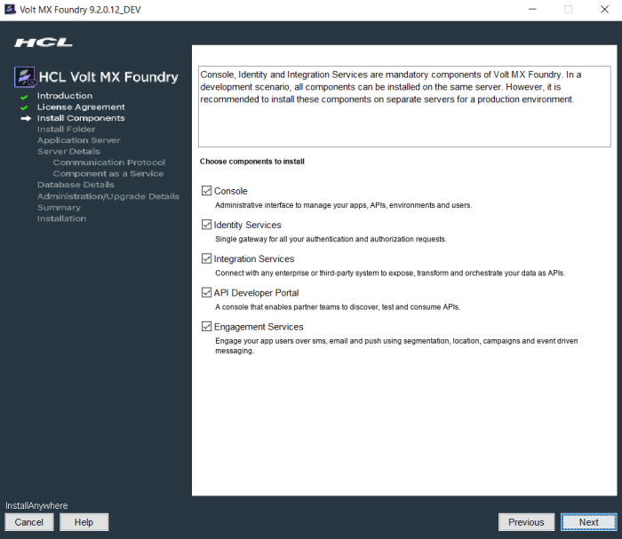
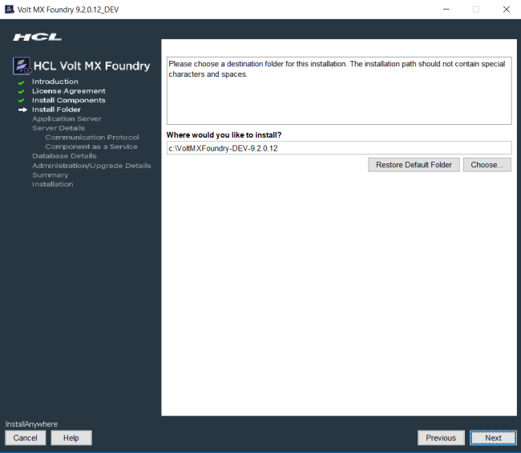
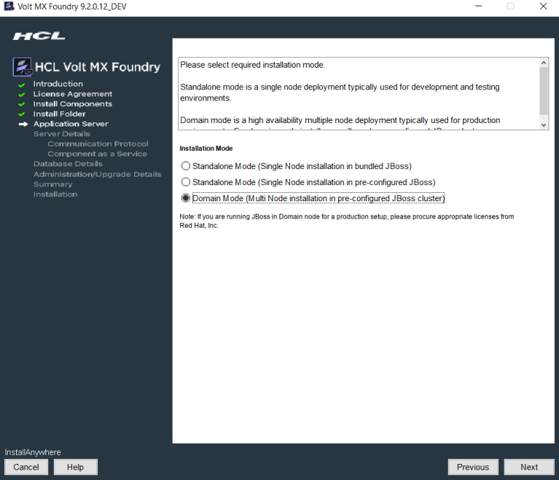
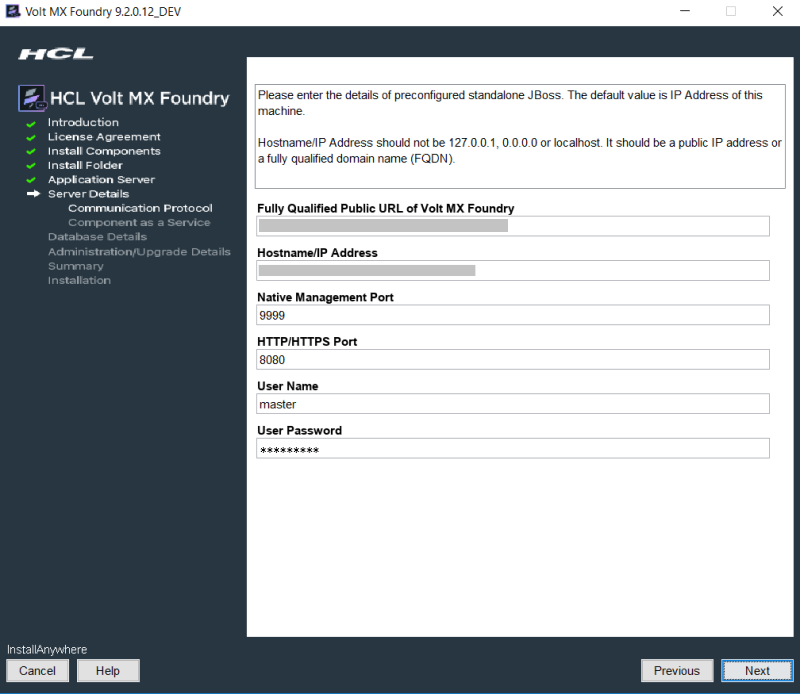
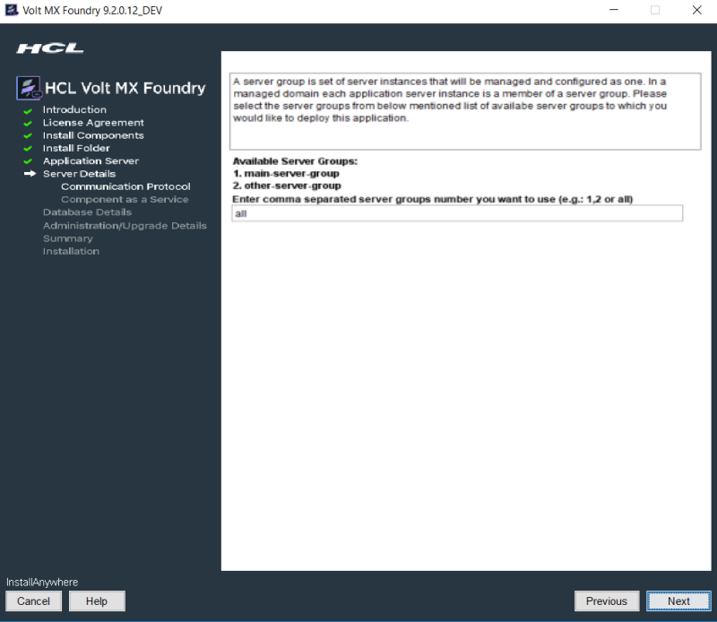
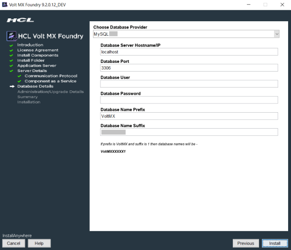
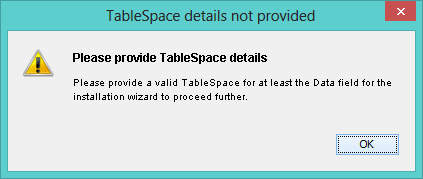
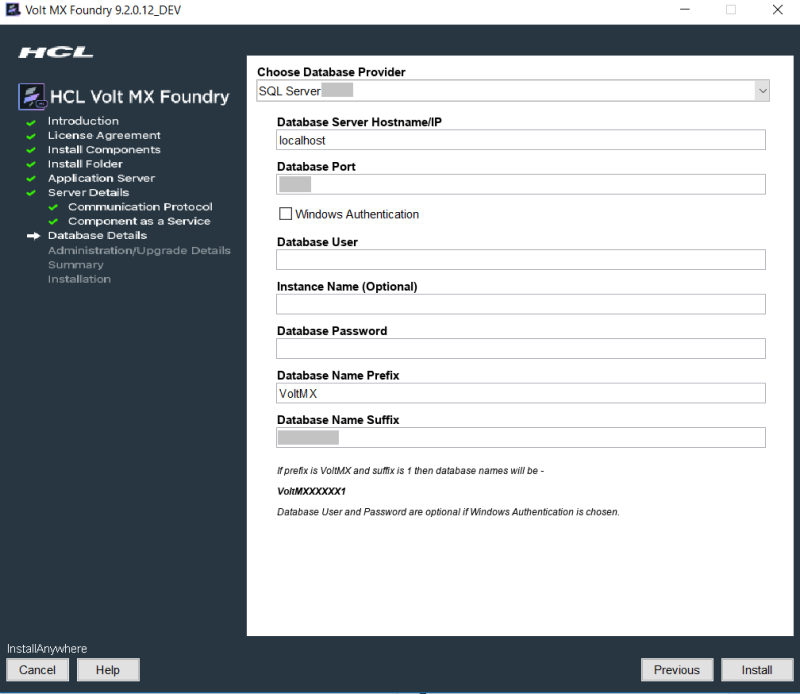
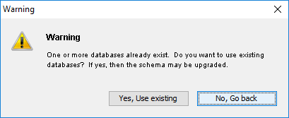
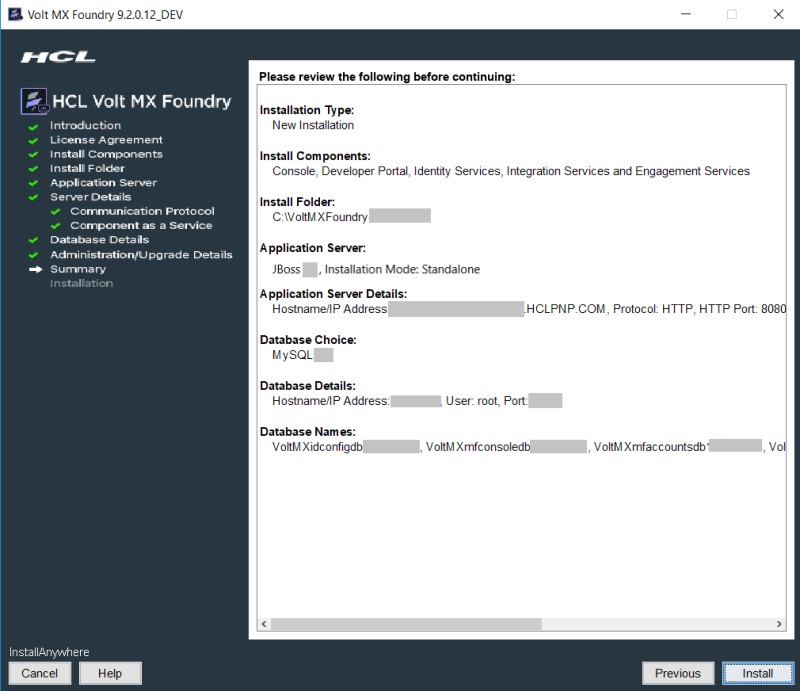

                         

Installing Volt MX Foundry on a Domain Mode (Multi node installation in pre-configured JBoss cluster)
====================================================================================================

This section of the document provides you with the instructions for installing and configuring the Volt MX Foundry components on multinode.

> **_Important:_** Ensure that you have the required hardware and access to the supporting software as mentioned in the [Prerequisites](Prerequisites.md) section and performed the steps as mentioned in the [Pre-Installation Tasks](Pre-installation_Tasks.md) section.

> **_Important:_** Before installing Volt MX Foundry on domain mode, ensure that the JBoss cluster is configured on your install system.

To install the Volt MX Foundry console using the installer, follow these steps:

1.  Unzip the `VoltMXFoundrySetup.zip` file.
2.  Double-click `VoltMXFoundryInstaller-x.x.x.x.GA.exe` to launch the installer.  

     The **InstallAnywhere** dialog appears. The **InstallAnyWhere** dialog displays information about the progress of the software installation at run time.
    
    
    
    A dialog with the Volt MX logo appears.
    
    
    
3.  The **Welcome To Volt MX Foundry** windows appears.  
    Read the instructions carefully before installing Volt MX Foundry Console.
    
    
    
4.  Read the instructions carefully, and click **Next**.  
    The **LICENSE AGREEMENT** window appears.
    
5.  Scroll down and select the "**I accept the terms of the License Agreement**" option.
    
    > **_Note:_** To activate the License Agreement option, read carefully the entire text.
    
      
    
6.  Click **Next**. The **Install Components** window appears with the following supported installation types:
    
    *   **Development** for single machine instance.
    *   **Non-Production** for larger environments like QA or UAT.
        
    *   **Production** for the production instance.
    
    Installation environment is set to Development by default .
    
    
    
7.  Choose one of the appropriate install type based on your license - for example, Development, Non-Production, or Production.
8.  Select the **Send usage data anonymously** check box. Allows HCL to collect product usage information to make your Volt MX Foundry experience better. HCL does not save any of your private or application data. By default this check box is selected.
9.  Click **Next**. The **Choose components to install** window appears.
    
    
    
10. Select one or more check boxes for the supported components. By default, the **Console**, **Identity Services**, **Integration Services**, and **Engagement Services** check boxes are selected.
    
    *   **Console** - To install Volt MX Foundry Console, select the **Console** check box.  
        The system creates the following databases: `<prefix>mfconsoledb<suffix>`, `<prefix>mfaccountsdb<suffix>`, and  `<prefix>mfreportsdb<suffix>`.
    *   **Identity Services** - To install Volt MX Identity Services, select the **Identity Services** check box.  
        The system creates the following database: `<prefix>idconfigdb<suffix>`.
    *   **Integration Services** - To install Volt MX Foundry Integration Services, select the **Integration Services** check box.  
        The system creates the following databases: `voltmxadmindb`  and  `mfreportsdb`.
    *   **API Developer Portal** - To install developer portal, select the **API Developer Portal** check box.  
        
        > **_Note:_** During installation if you have selected **API Developer Portal**, the **API Developer Portal** is created. You can directly access your [VoltMX Developer Portal](../../../Foundry/voltmx_foundry_user_guide/Content/VoltMXDevPortal.md) in Volt MX Foundry Console.
        
    *   **Engagement Services** - To install Volt MX Foundry Engagement Services, select the **Engagement Services** check box.  
        The system creates the following database: `<prefix>kpnsdb<suffix>`.
    
    **Reports Database**
    
    The reports database is used for configuring reports.
    
    The Installer creates the `mfreportsdb` if you choose either Console or Integration Services:
    
    *   **Console** without Integration Services (with or without Engagement Services)
    *   **Console** and **Integration Services** (with or without Engagement Services)
    *   **Integration Services** without Console (with or without Engagement Services)
    
    Reports Database for Integration on a Separate Node:
    
    While installing console and integration on separate nodes, the installer prompts you to point the reports database during the integration installation.  
      
    For example:  
      
    You have installed only Console on one node. The installer creates these three databases such as `<>mfreportsdb<>` along with the `<>mfconsoledb<>` and `<>mfaccountsdb<>`. For example, your report database name is `voltmxmfreportsdb1`  
      
    When you install the integration with or without one or more components (identity, or Engagement Services) on a separate node, the installer displays the **Reports Database Name** field in the **Database Details** window. If the installer prompts you to enter the existing reports db, enter the reports database name (for example, `voltmxmfreportsdb1`) in the **Database Details window > Reports Database Name** field. Refer to the [Database Details](#DatabaseDetails) window.  
      
    Refer to creating a reports database, for example : mfreports
    
11. Click **Next**. The **Install Folder** window appears. The selected path appears in the **Where would you like to install** field.
    
    
    
12. Click **Choose** to browse the required folder from your system.
13. Click **Next**. The **Application Server** window appears asking you to choose the application server. By default, the Application Sever is set to Tomcat.
    
    
    
14. In the **Application Server** window, click **JBoss**, and then click **Next**.
15. The **Installation Mode** window appears asking you to choose the mode. By default, this option is set to **Standalone Mode**. Click **Domain Mode (Multinode)**, and then click **Next**.
    
    
    
    > **_Important:_** To install Volt MX Foundry on single-node on JBoss that is bundled with the Volt MX Foundry installer, choose **1-** **Standalone Mode** (**Single Node**). For more details, refer to [Installing Volt MX Foundry on JBoss - Single Node](Installing_VoltMX_Foundry_on_Windows.md).  
      
    To install Volt MX Foundry on single node on a pre-configured JBoss, choose **2-** **Standalone Mode** (**Existing**). For more details, refer to Installing Volt MX Foundry on Existing JBoss  
    
    *   The **Application Server Details** window will appear with the following details:  
        
        
        Enter the following details:
        
        *   **Fully Qualified Public URL of Volt MX Foundry**: Enter load balancer URL to use public communication.
            
        *   **Master Node Hostname/IP Address**: Enter public Hostname/IP of JBoss master node. Ensure that you have access to JBoss master node from your installation system.
            
        *   **Master Node Management Port**: Enter native port of JBoss master node.
        *   **Master Node HTTP/HTTPS Port**: Enter port of Volt MX Foundry Console.
            
        *   **User**: Enter the user that you configured in the master node of the JBoss cluster.
            
        *   **Master Node User Password**: Enter the password that you configured in the master node of the JBoss cluster.
            
16. Click **Next**. The **Server Groups** window appears.
    
    
    
17. Enter server groups separated by commas - for example, 1, 2, shown above. Click **Next**. The system displays the selected groups in the **Selected Server Group** window.
18. Click **Next**. The **Memcached Server** window appears.

    

    
19. Click **Next**. The **Database Details** window appears. From the **Database Choice** drop-down, choose one of the databases to display database details. By default, this option is set to MySQL.  
      
    
    *    Enter the following database details for **MySQL**.
        
        
        
        **MySQL Cluster - Group Replication** is a new replication type supported from MySQL 5.7 onwards. In case your Foundry setup consists of a MySQL Cluster with Group Replication, please select the same from the list of Database Type Providers instead of the default MySQL option.
        
        
        
        *   **Database Server Hostname/IP**: Enter the DB server Hostname/IP to be used to create a database of selected components of Volt MX Foundry. By default, the server Hostname/IP is set as localhost.
        *   **Database Port**: Enter the database port of the MySQL Server. By default, this field is set to 3306 for MySQL.
        *   **Database User**: Enter the user name used while creating the database user - for example, dbclient.
        *   **Database Password**: Enter the user password used while creating the database user.
        *   **Database Name Prefix**: Enter valid prefix databases - for example, jboss.
            
            For example, the following databases are created for all components: jbossglobaldb54, jbossconfigdb54, jbossconsoledb54, jbossaccountsdb54, jbossmfreportsdb54, jbossadmindb54 and jbossmfreportsdb54
            
        *   **Database Name Suffix**: Enter valid suffix for all databases - for example, 54
    *   Enter the following database details for **Oracle**.
        
        
        
        *   **Database Server Hostname/IP**: Enter the DB server Hostname/IP to be used to create a database of selected components of Volt MX Foundry. By default, the server Hostname/IP is set as localhost.
        *   **Database Port**: Enter the database port of the Oracle Server. By default, this field is set to 1521 for oracle.
        *   **Service ID **/ Service Name**:** Enter Oracle service ID or service name. Service ID is unique alias given to an instance name of Oracle DB.
        *   Select the tablespace for Oracle database:
            
        > **_Important:_**  If tablespaces were already created, the DBA must grant quota (permissions) on these tablespaces to installer with admin option.  
              
        The DBA also must include grant quota on the schemas from installer login.
            
        *   **Default Tablespace**: If selected, the database schema and SQL scripts migration happens automatically to the default tablespace for example, `USERS`
            *   **User Defined Tablespace**: If selected, enter the tablespaces for the following:
                *   **Data Tablespace**:  
                    Enter the name for Data tablespace.  
                    
                    This is a mandatory field. If the Data tablespace field empty, the installers displays the error message:
                    
                    
                    
                    If the Data tablespace (for example, SampleData) does not exist, the installers displays the error message:
                    
                    
                    
                *   **Index Tablespace**: Enter the name for Index tablespace.  
                    If input for Index Tablespace is not provided, then the value will be set to the provided Datatable space value.
                *   **LOB Tablespace**: Enter the name for LOB tablespace.  
                    If input for LOB Tablespace is not provided, then the value will be set to the provided Datatable space value.
        *   **Database System User**: Enter the user name used while creating the database user - for example, dbclient.
        *   **Database System Password**: Enter the user password used while creating the database user.
        *   **Database Name Prefix**: Enter valid prefix databases - for example, Volt MX.
        *   **Database Name Suffix**: Enter valid suffix for all databases - for example, 1.
        
        If a database faces connection issues, the system displays an error message. For example:
        
        
        
    
    *   Enter the following database details for ****SQL Server**.**
        
        > **_Important:_**
        
        If you want to enable Windows Authentication Support on SQL Server, run the following command to start the installation process after extracting the artefact:
        
    
        VoltMXFoundryInstaller-9.x.x.x_GA.exe -Dprop.java.library.
        path=< location of sqljdbc_auth.dll >

    
        
    > **_Note:_** If you choose to enable Windows Authentication support on SQL Server, you do not need to provide the **Database System User** and **Database System Password**.
        

    

        
    *   **Database Server Hostname/IP**: Enter the DB server Hostname/IP to be used to create a database of selected components of Volt MX Foundry. By default, the server Hostname/IP is set as localhost.
    *   **Database Port**: Enter the database port of the SQL Server. By default, this field is set to 1433 for SQL.
    *   **Database System User**: Enter the user name used while creating the database user - for example, dbclient.
    *   **Instance Name (optional)**: Enter the instance name for the database. This information is optional.
    *   **Database System Password**: Enter the user password used while creating the database user.
    *   **Database Name Prefix**: Enter valid prefix databases - for example, Volt MX.
    *   **Database Name Suffix**: Enter valid suffix for all databases - for example, 1.
        
    If a database faces connection issues, the system displays an error message. For example:
        
    
        
    
    
    
    *   Enter the following database details for **MariaDB**.
    *   **Database Server Hostname/IP**: Enter the DB server Hostname/IP to be used to create a database of selected components of Volt MX Foundry. By default, the server Hostname/IP is set as localhost.
    *   **Database Port**: Enter the database port of the MariaDB. By default, this field is set to 3306 for MariaDB.
    *   **Database User**: Enter the user name used while creating the database user.
    *   **Database Password**: Enter the user password used while creating the database user.
            
    > **_Important:_** The **Reports Database Name** filed appears only if you have selected the Console, Identity, and Integration during Install Components.
            
    *   **Database Name Prefix**: Enter the valid prefix databases - for example, jboss.
    *   **Database Name Suffix**: Enter the valid suffix for all databases - for example, 54.
20. After entering database server details, click **Next**.
    
    If a database exists, the system displays the warning message: `One or more databases already exist. Do you want to use existing databases? If yes, then the schema may be upgraded.` shown below:
    
    
    
    > **_Important:_** If you are installing Volt MX Foundry V9 on an application server using the existing database and in case if there is a change in server details, you must update the `management_server` details in the `admin` database with the application server instance details for the WebAapp publish to work. You must update the following fields in the `server_configuration` table of the **admin DB**:  
      
    \- management\_server\_host\_name <application\_instance hostname>  \- management\_server\_port <soap port of application\_instance>  \- management\_server\_user <application\_instance admin username>  \- management\_server\_password <application\_instance admin password>   - management\_server\_groups <application\_instance groups details>
    
21. After entering database server details, click **Next**. The **Administrator Account Configuration** window appears.
    
    The **Administrator Account Configuration** window helps you to configure your super administrator account.
    
    The **Administrator Account Configuration** window appears only while installing Console and Identity Services along with one or all other Volt MX Foundry components such as Integration Services, and Engagement Service on Tomcat or JBoss on a single node. You can select the components at Install Components
    
    
    
    > **_Note:_** During installation if you have configured your super administrator account, you can directly log in to Volt MX Foundry Console.
    
22. Select the **Create Volt MX Foundry Administrator Account now** check box and enter the following details to create the super administrator account.
    *   **Public URL**: The URL field is filled with required details, for example. `<Hostname/IP address>:<port>`. Change these details, if required.
        
    *   **First Name**: Enter the first name of the user.
        
    *   **Last Name**: Enter the last name of the user.
        
    *   **Email**: Enter the email address of the user. It can include alphanumeric and special characters that follow standard email address form.
        
    *   **Password**: Enter the password for the user. It can be a combination of alphanumeric and special characters.
        
    *   **Confirm Password**: Retype the password to ensure the user's identity.
        
23. Click **Next**. The **Pre-Installation Summary** window appears.

    
    

    
24. Click **Install**. The **Installing Volt MX Foundry Console** window appears.

    
    

    
    Once the installation completes, the **Install Complete** window appears with the confirmation message.

    
      
    
    
25. Click **Done** to close the window.
    
    > **_Important:_** After installing Volt MX Foundry, import your SSL certificate in  `<JAVA_HOME>\jre\lib\security\cacerts` of all nodes of the JBoss cluster.  
      
    If your SSL certificate is not configured, the system displays an error - for example, "peer not authenticated."  
      
    For details, refer to [Troubleshoot with SSL Certificate Issues](Troubleshooting.md#Service_Provider's_Certificate_Issues).
    
    > **_Note:_** You can now access Volt MX Foundry Console by using the URLs. For more details, refer to [Accessing Volt MX Foundry Console - On-premises](../../../Foundry/voltmx_foundry_user_guide/Content/How_to_access_VoltMX_Foundry_Portal_on-Prem.md).  
      
      
      
    During installation if you have configured your super administrator account, you can directly [log in to Volt MX Foundry Console](../../../Foundry/voltmx_foundry_user_guide/Content/How_to_access_VoltMX_Foundry_Portal_on-Prem.md) by using the Console URL.
