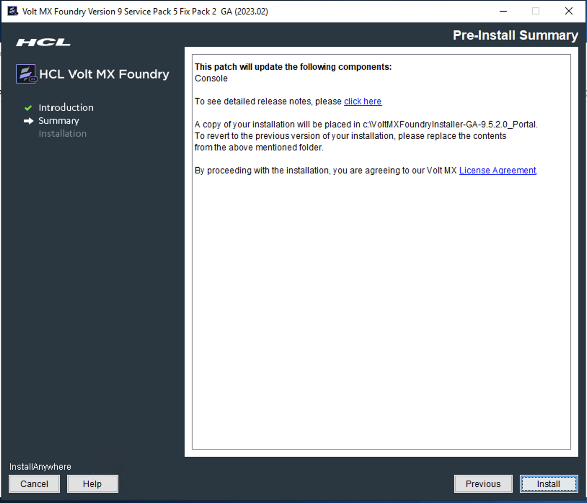

                         

You are here: Installing Hotfix Archives for Volt Foundry - Windows

Installing Hotfix Archives for Volt Foundry - Windows
=======================================================

The Volt Foundry Patch Installer can be used to apply patches (software updates) to Volt Foundry components for a specific GA release.

<b>For example:</b>

To apply a `9.5.x` patch to a version earlier than `9.5.x GA`, you need to upgrade to  9.5.x GA  by using the installer, and then apply the `9.5.x` patch.

The Patch Installer uses hotfix archives and applies the software updates to an existing Volt Foundry Installation. A hotfix archive (which is a `.zip` file) can have artifacts for one or more components. While installing hotfix archives, all components in the archive are installed to your existing Volt Foundry installation.

### Prerequisites

* Ensure that you have a previous version of Volt Foundry GA installed on your system at an accessible network location.

> **_IMPORTANT:_** If you are required to install hotfix archives to a set of components for a specific release, you must have the supported Volt Foundry GA version (for example, Volt Foundry 9.5.x) with required components installed on your system. 
<b>For example</b>, if you are required to install hotfix archive for Console version V 9.5.x, you must have Foundry 9.5.x GA with Console installed on your system. 

* Ensure that  `VoltFoundryPatchInstaller-9.5.x.QA.exe`  file has execute permission

* Please stop the windows Foundry service before applying the patch.

<b>To download Volt Foundry Patch Installer and hotfixes, follow these steps:</b>

1. Login to the <a href="https://hclsoftware.flexnetoperations.com/flexnet/operationsportal/logon.do" target="_blank">HCL License & Download Portal.</a>

      If you do not have login credentials, follow the steps discussed in this article, <a href="https://support.hcltechsw.com/csm?id=kb_article&sysparm_article=KB0069114" target="_blank">How to register to HCLSoftware portals.</a> For more info on the portal, refer to <a href="https://support.hcltechsw.com/csm?id=kb_article&sysparm_article=KB0073344" target="_blank">this article.</a> or contact support by creating a Download Case.

2. Locate HCL Volt MX in Your Downloads, and select HCL Volt Foundry
   v9.x.x.

3. Download the required hotfix components.

<b>To install Volt Foundry patch using the installer, follow these steps:</b>

1. Unzip the `Volt Foundry-9.x.x.GA.zip` file, and navigate to
   the Volt MX <b>Foundry_Patch_Installer_Windowsfolder</b>.

2. Double-click `VoltFoundryPatchInstaller-9.5.x.QA.exe` to
   launch the installer. 
   The <b>InstallAnywhere</b> dialog appears and displays the progress of the launching the installer.

        

      A dialog with the Volt Foundry logo appears.

        

<ol start="3">
  <li>Next, the <b>Introduction</b> window appears asking for following
   details: Enter the details to proceed with the upgrade:</li>
</ol>

   *    Please provide the location of the patch file: Provide the
        patch file location of the Volt Foundry component that you wish to install to current version. For example, middleware.zip.
        For information about creating a patch file, refer to [Creating a patch file for Foundry components](#creating-a-patch-file-for-foundry-components).
   *    Please provide the location of existing installation. The
        default install location appears in this field.
        Provide the location of existing Volt Foundry installation that you wish to upgrade with the selected patch version.

     

<ol start="4">
  <li>Click <b>Next</b>. <b>The Pre-Installation Summary</b> window appears.</li>
</ol>

    

   The installer takes backup of the current install folder. The backup folder will have a suffix of `_{Patch_File_Name}`. For example, if the hotfix name is KPNS.XXX, then the suffix of the backup folder will be `_KPNS.XXX`.

   > **_IMPORTANT:_** The Installer does not support automatic backups of database and other artifacts. The Installer does not support rollback in case of a failure during the upgrade. 
   -  You must take backup of your database and other artifacts
      before upgrading. 
   -  After the upgrade, republish your Volt Foundry
      applications. 

<ol start="5">
  <li>Click <b>Install</b>. The <b>Installing Volt Foundry</b> window appears and the <b>installation starts</b>.</li>
</ol>

   Once the installation completes, the Installation window appears with the confirmation message.

 

   The installation of Volt Foundry is finished. In case of any errors during the installation, refer to the installation log for details. Installation log is located at below location: For example, `C:\VoltMXFoundry900\`

<ol start="6">
<li>Click <b>Done</b> to complete the installation. After the installation
   is completed, the installer creates logs in the install folder.</li>
</ol>

   For troubleshooting tips to resolve problems that you may encounter during installation, refer to the following:

   [FAQs and Troubleshooting](https://opensource.hcltechsw.com/volt-mx-docs/95/docs/documentation/Foundry/voltmx_foundry_windows_install_guide/Content/Troubleshooting.html)

   The <b> < Install Location > </b> directory contains the log files logging each invocation of the installer. To make problem identification easier, provide these log files to Volt Foundry when reporting an issue.

## Creating a patch file for Foundry components

To create a patch file for Foundry components, you need to create a zip file with the relevant files. The contents for the zip must be downloaded from the link to the build artifacts.

  