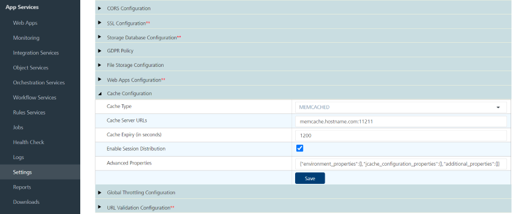
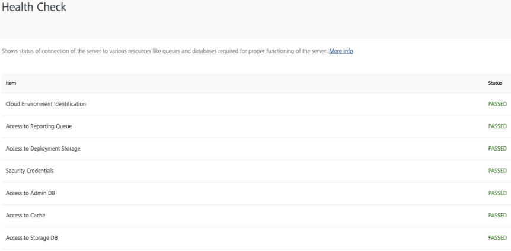
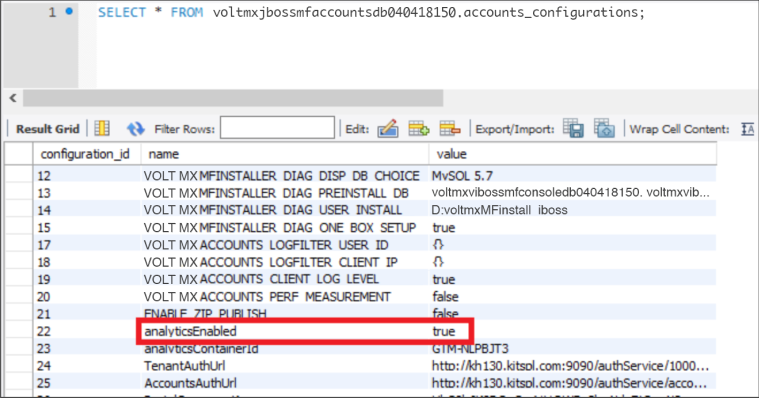

                          

You are here: How to Add an Installer Generated Self-Signed SSL Certificate to Cacerts

Post-Installation Tasks
=======================

Configuring Secure Sockets Layer (SSL) Certificate
--------------------------------------------------

You can troubleshoot trusted certification issues.

> **_Important:_** Apple's App Transport Security (ATS) mandates HTTPS for all communication and requires the use of TLS v1.2 or higher for all SSL certificates and load balancers.  
  
For Apple apps to work properly and adhere to App Store guidelines, you must enable your Volt MX Foundry on-premises instance with SSL and configure your network infrastructure to use TLS version 1.2 or higher. For more information, please refer to the following: [HCL Basecamp article on ATS Compliance](https://support.hcltechsw.com/csm?id=kb_article&sysparm_article=KB0083519).

After installing Volt MX Foundry on HTTPS, import your SSL certificate (for example, `domain.subdomain.crt`) into your Volt MX Foundry Installer's JRE trusted certificate authority (CA) certificates file - for example, `<INSTALL_DIR>\jre\lib\security\cacerts`  

If your SSL certificate is not configured, the system displays an error - "peer not authenticated". For details, refer to [Troubleshoot with SSL Certificate Issues](../../../Foundry/voltmx_foundry_linux_install_guide/Content/Troubleshooting.md#Service_Provider's_Certificate_Issues).

To enable communication between Volt MX Foundry Console and other products such as Volt MX Foundry Integration Services, and Volt MX Foundry Engagement Services, follow these steps:

*   import each product's certificate (VoltMX Foundry Integration, and Volt MX Foundry Engagement Services) into the Volt MX Foundry console (for example, `<INSTALL_DIR>\jre\lib\security\cacerts`).
*   import console cert into the product boxes cacerts such as Volt MX Foundry Server, Volt MX Foundry Engagement Services, and Volt MX Foundry Management.

### How to Add an Installer Generated Self-Signed SSL Certificate to Cacerts  

To add an installer generated self-signed certificate to cacerts, follow these steps:

1.  From your Volt MX Foundry installed system, open the Windows command prompt, and run the following command to generate an `intermediate.crt` file from the keystore:
    
    <code>&lt;USERINSTALLDIR&gt;\jre\bin\keytool -export -alias "&lt;HOST_URL_SSL_CONF&gt;" -file &lt;USERINSTALLDIR&gt;\intermediate.crt -keystore &lt;USERINSTALLDIR&gt;\keystore.jks -storepass &lt;Password_of_keystore&gt;</code>
    
    Based on the hostname and keystore password provided at the [SSL Certificate window](Installing_Foundry_on_Tomcat.md#SSLCertificate), the preceding command exports the required certificate from the source keystore with the given name - for example, `intermediate.crt`.
    
2.  Run the following command to import the `intermediate.crt` certificate file into your Volt MX Foundry Installer's JRE trusted certificate authority (CA) certificates file:
    
    <code>&lt;USERINSTALLDIR&gt;\jre\bin\keytool -import -noprompt -trustcacerts -alias "&lt;HOST_URL_SSL_CONF&gt;" -file &lt;USERINSTALLDIR&gt;\intermediate.crt -keystore &lt;USERINSTALLDIR&gt;\jre\lib\security\cacerts -storepass changeit</code> 
    

### How to Add an Existing SSL Certificate to Cacerts

> **_Note:_** If Java does not identify a certificate issuer by default, you need to import an SSL into your cacerts.

To add an existing SSL certificate to cacerts, use the following steps to import your existing certificate to cacerts with the proper value of alias, keystore location and keystore password:

1.  From your Volt MX Foundry installed system, open the Windows command prompt, and run the following command to add an `intermediate.crt` file from the keystore:
    
    <code>&lt;USERINSTALLDIR&gt;\jre\bin\keytool -export -alias "&lt;yourcertificate_domain&gt;" -file &lt;USERINSTALLDIR&gt;\intermediate.crt -keystore &lt;keystore_location&gt;-storepass &lt;Password_of_keystore&gt;</code>
    

1.  Run the following command to import the `intermediate.crt` certificate file into your Volt MX Foundry Installer's JRE trusted certificate authority (CA) certificates file:
    
    <code>&lt;USERINSTALLDIR&gt;\jre\bin\keytool -import -noprompt -trustcacerts -alias "&lt;yourcertificate_domain&gt;" -file &lt;USERINSTALLDIR&gt;\intermediate.crt -keystore &lt;USERINSTALLDIR&gt;\jre\lib\security\cacerts -storepass changeit</code>
    


<h3 id="jdk-version-compatibility"></h3>

### JDK Version Compatibility

In case if you upgrade your JDK version in your middleware server, to enable JDK version compatibility, make the appropriate changes in an app server's  `middleware.properties` file located in your middleware server installation folder.

For example: When you upgrade JDK V 1.6 to JDK V 1.7 (vice-versa), you can still run your middleware server. Volt MX Foundry's run-time apps cannot be accessed. If you try to access any apps at runtime, the system throws an error message due to JDK version incompatibility.

1.  In your middleware server installation folder, open the  `middleware.properties` file located at the below path:
    *   for JBoss:
        
        `<installer folder>\middleware_home\middleware\middleware-bootconfig`
        
        
    *   for Tomcat: 

        `<installer folder>\middleware_home\middleware\middleware-bootconfig`  

2.  Make the following changes in the  `middleware.properties` file.
    
    *   `ssl.trustStore=<java_home>/jre/lib/security/cacerts`
    *   `ssl.keyStore=<java_home>/jre/lib/security/cacerts`


<!-- <h2 id="how-to-update-security-configuration-in-config-xml-required-in-case-of-weblogic-installation">How to Update Security Configuration in Config.xml (Required in case of WebLogic installation)</h2>

When you install Volt MX Foundry on WebLogic, with default configuration in the WebLogic's config.xml file, Volt MX Foundry fails to register with environments.

To update security configuration in the config.xml file in WebLogic, follow these steps:

1.  Go to `<weblogic profile folder>/config` folder.
2.  Open the **config.xml**, and add below line under the `<node-manager-password-encrypted>` tag:
    
    `<enforce-valid-basic-auth-credentials>false</enforce-valid-basic-auth-credentials>`
    
    For example:
    
```
<default-realm>myrealm</default-realm>
        <credential-encrypted>{AES}rGucYtN8zScvbfvJtHyH/lwhWg1Av2yLPQmQ3vdAV/wACiJ+k8zTKQBTKf8TRcTLWPWFZkunUyllbSvLJ8P07GCgJf4v6egFUlVVdfOpgYrbkohlp49S7KVMTgRkhL79</credential-encrypted>
        <node-manager-username>weblogic</node-manager-username>
        <node-manager-password-encrypted>{AES}R2P+dzOm5y1ODB8e3aMj6spUrJet6h6aUv91umUe5q4=</node-manager-password-encrypted>
        <enforce-valid-basic-auth-credentials>false</enforce-valid-basic-auth-credentials> 
``` -->


<h2 id="how-to-turn-off-the-send-usage-data-anonymously-feature">How to Configure Memcache for Integration Services</h2>

*   For Volt MX Foundry version 7.3 or above, you can configure the memcache from Admin console.
    
    To configure memcache in Foundry 7.3 or above versions, follow these steps:
    
    1.  Open Admin console (http/https://<server-host>:<server-port>/admin).
    2.  In the left pane, go to the **Settings** tab.
        
        
        
    3.  Under the **Runtime Configuration** tab, expand the **Memcache Configuration** key.
    4.  In the **Memcache Cluster** field, provide your memcache **hostname/IP** and **port** details separated with a colon. For example, <hostname/IP>:<Port>
    5.  Save the changes.

*   For below Foundry 7.3, you can configure the memcache using queries on **voltmxadmindb**.
    
    To configure memcache in below Foundry 7.3, follow these steps:
    
    Since UI is not available in version below 7.3, you must update the property value in the **server\_configuration** table of VOLTMXADMINDB database.
    
    > **_Note:_** Name of the VOLTMXADMINDB depends on the suffix and prefix provided, which you provided during the installation.
    
    1.  Execute the following steps:
```
UPDATE <VOLTMXADMINDB>.server_configuration set prop_value =
        '<memcache_hostname>’:’<memcache_port>’' , created_date = CURRENT_TIMESTAMP , updated_date
        = CURRENT_TIMESTAMP WHERE prop_name = 'memcache.cluster';
```
        
        **Verification:** To verify whether the memcache configuration is successfully done, go to the **Health Check** page and look for **Access to Cache** entry.
        
        > **_Note:_** It may take up to 5 minutes for the healthcheck to reflect the cache status. If you are still unable to find the particular entry in the **Health Check** page, try clearing the healthcheck cache using the following URL:  
          
        https://<server-host>:<server-port>/admin/healthcheck?output=json<br>
        

<h2 id="configure-deployment-of-mbaasportal-war-file-for-multi-node">Configure Deployment of mbaasportal.war File for Multi-Node</h2>

Once Volt MX Foundry installation succeeds, the Volt MX Foundry Console will not be displayed as the **enable-welcome-root** value is set **true** in the`domain.xml` file**.**

To configure mbaasportal.war, follow these steps:

1.  In the master node, open the `domain.xml` file from `JBOSSDIR\domain\configuration`, and search for enable-welcome-root="true."
2.  Replace enable-welcome-root="true" with enable-welcome-root="false."

<h2 id="remote-installation-pre-requisites">Remote Installation Prerequisites</h2>

After you have installed Volt MX Foundry, you must retain the **Installation** folder for upgrades. While upgrading, the Volt MX Foundry installer requires the `installvariables.properties` file under the `<USER_INSTALL_DIR>/_VoltMX Foundry_installation` folder.

### Installing Volt MX Foundry Remotely

You can install Volt MX Foundry remotely on the following supported application servers:

*   JBoss Multi-node
*   JBoss Standalone Existing

<!-- *   WebLogic -->

How to Turn off the Send usage data anonymously feature
-------------------------------------------------------

Allows Volt MX to collect product usage information to make your Volt MX Foundry experience better.

1.  Go to the **Accounts** database configured for the Volt MX Foundry installation.
2.  Open the **account\_configurations** table.
3.  Find the row entry in the **name** column with name as `analyticsEnabled`.
4.  Modify it to true/false.
    
    
    
5.  Refresh Volt MX Foundry Console.  
    You should be able to figure out if analytics data that is sent/out by trying to check in the **Network** tab in the Browser Developer Tools.

Configuring Datasource for performance improvements for JBoss pre-existing and Domain Mode
------------------------------------------------------------------------------------------

While using pre-configured JBoss or JBoss in Domain Mode, add the following snippet to the datasource to improve the performance.

```
<pool>  
<min-pool-size>10</min-pool-size>  
<max-pool-size>30</max-pool-size>  
<flush-strategy>IdleConnections</flush-strategy>  
</pool>
```

> **_Note:_** For the bundled version, the installer will add the default size to the datasources.

Health Check URL
----------------

The following is the Component Health Check URL if the initial setup is successful:

```
<http/https>://<Domainname>:<port>/mfconsole/health_check/all
{"workspace":"passed","accounts":"passed","portal":"passed"}
<http/https>://<Domainname>:<port>/authService/v1/manage/checkhealth
Passed
<http/https>://<Domainname>:<port>/admin/healthcheck?output=json
{"healthCheck":"PASSED","healthDetail":
{"Access to Reporting Queue":"PASSED","Access to Admin DB":"PASSED","Access to Reports DB":"PASSED","Access to Storage DB":"PASSED"}
,"version":"V8 SP2 FP1 HF1"}
<http/https>://<Domainname>:<port>/services/healthcheck?output=json
{"healthDetail":
{"appID":"services","Access to Reporting Queue":"PASSED","Access to Admin DB":"PASSED","Access to Storage DB":"PASSED"}
,"applicationHealthCheck":"PASSED","version":{"Middleware Version":"VoltMXFoundryInstaller-GA-8.2.1.1"}}
<http/https>://<Domainname>:<port>/vpns/service/healthcheck/json
{"healthCheck":"PASSED","healthDetail":
{"Quartz jobs":"PASSED","Access to Database Server":"PASSED","Security Credentials":"PASSED"}
,"version":"8.2.1.1_GA"}

```

Steps to enable SAPJCo
----------------------

The installer provides the following artifacts:

1.  SapJCoDestinationProvider.jar
2.  Module.xml (for JBoss)

You can download the other artifacts **libsapjco3.so** (for Linux) or **sapjco3.dll** (for Windows), and **sapjco3.jar** from [https://websmp204.sap-ag.de/connectors](https://websmp204.sap-ag.de/connectors).

The SapJCoDestinationProvider.jar can be located at:

*   `<USER_INSTALL_DIR>/Integration/sapjco/main` - for JBoss

The Module.xml can be located at:

*   `<USER_INSTALL_DIR>/Integration/sapjco/main`

### Steps for Tomcat

1.  Navigate to `<USER_INSTALL_DIR>/tomcat/lib`, and add the following files:
    
    *   **sapjco3.jar**
    *   **libsapjco3.so/sapjco3.dll**
    
    > **_Note:_** The **SapJCoDestinationProvider.jar** is already placed in the `<USER_INSTALL_DIR>/tomcat/lib` by the installer.
    
2.  Restart the server

### Steps for JBoss

**For Windows**: Place the **sapjco3.dll** in the **jboss/bin** folder or **C:/Users/<USER\_NAME>/System32** folder.

**For** **Linux**: Place the **libsapjco3.so** in the **/usr/bin** folder or any location on the machine and append the path to the $LD\_LIBRARY\_PATH variable

#### JBoss - Standalone (Bundled)

1.  Navigate to `<USER_INSTALL_DIR>/jboss/modules/org/sapjco/main`, and add the following files:
    *   **sapjco3.jar**
    *   **SapJCoDestinationProvider.jar**
2.  Navigate to `<USER_INSTALL_DIR>/jboss/modules/org/sapjco/main/`
    *   In `module.xml`, under the **<resources>** tag add `<resource-root path="sapjco3.jar"/>`.
    *   In `standalone-full.xml`, under the **<global-modules>** tag add `<module name="org.sapjco" slot="main"/>`.

#### JBoss - Standalone(Pre-configured)/Domain mode

1.  Navigate to `<JBOSS_DIR>/modules/org/sapjco/main`, and add the following files:
    *   **sapjco3.jar**
    *   **SapJCoDestinationProvider.jar**
2.  Navigate to `<JBOSS_DIR>/modules/org/sapjco/main`.
    *   In `module.xml`, under the **<resources>** tag add `<resource-root path="sapjco3.jar"/>`.
    *   In `standalone.xml` or `domain.xml`, in the subsystem add `<subsystem xmlns="urn:jboss:domain:ee:4.0">`. Add the following tag:
```
<global-modules>  
<module name="org.sapjco" slot="main"/>  
</global-modules>
```

<!-- ### Steps for Weblogic

1.  Navigate to `<WL_HOME>/wlserver/server/lib`, and add the following files:
    *   **sapjco3.jar**
    *   **SapJCoDestinationProvider.jar**
    *   **libsapjco3.so/sapjco3.dll**
2.  Go to `<WL_HOME>/user_projects/domains/base_domain/bin`, and edit the **startWeblogic** script file using one of the following commands.
    
    *   For Windows: `startWeblogic.cmd`
    *   For Linux: `startWeblogic.sh`
3.  Prepend your JAR files to the SAVE\_CLASSPATH environment variable.
    
    For example, in **startWeblogic.sh** add:
    
    `SAVE_CLASSPATH="${WL_HOME}/server/lib/SapJCoDestinationProvider.jar:${WL_HOME}/server/lib/sapjco3.jar:${WL_HOME}/server/lib/libsapjco3.so:${CLASSPATH}"`.
    
4.  Restart the server. -->
