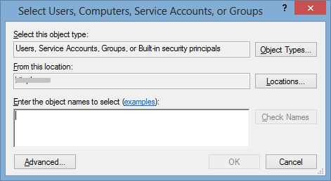
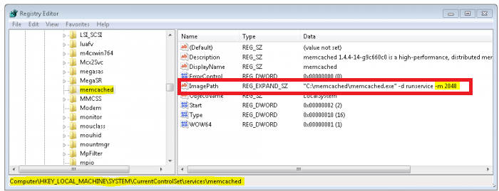

                         

You are here: Download Volt MX Foundry Installer

Pre-Installation Tasks
======================

Download Volt MX Foundry Installer
---------------------------------

Download Volt MX Foundry from Flexnet Operations site and extract the file. To download Volt MX Foundry installer from Flexnet, follow these steps:

1.  Log in to [Flexnet](https://hclsoftware.flexnetoperations.com/flexnet/operationsportal). You can obtain a user name and password from your sales representative or partner.
2.  Once logged in, navigate to "Your Downloads" and select "HCL Volt MX".  HCL Volt MX Foundry will be displayed in the list.

Steps before installing (or) upgrading Volt MX Foundry with the existing database
--------------------------------------------------------------------------------

Perform the following activities before installing (or) upgrading Volt MX Foundry with the existing database:

*   Take database backup
*   Make sure you have previously installed directory
*   Take a backup of applications deployed at the server level. (Post installation, take backup of the changes done to the binaries).
*   Post installation (or) upgrade process, replace old authService.key, workspaceService.key, and ACCOUNTS\_ENCRYPTION\_KEY (applicable only for identity and workspace components).

Add a User in Local Group Policy (Log on as a Service)
------------------------------------------------------

Before installing Volt MX Foundry in a new Windows node, ensure that you have privileges to **log on as a service.** The log on as a service privileges are required to start a service by a user.

When a user name does not have privileges to **log on as a service** and is tries to install Volt MX Foundry in a new Windows box, the system gives the following error:

To grant log on as service to a user, follow these steps:

1.  Click **Start**, and then click **Run** (Win+R).
2.  In the **Run** box, type **gpedit.msc**, and then click **OK**. The **Local Group Policy Editor** window appears.
3.  In the left pane, under **Local Computer Policy**, expand **Computer Configuration** > **Windows Settings** > **Security Settings** > **Local Policies** > **User Rights Assignment.**
    
    
    
4.  In the right pane, double-click **Log on as service**. The **Log on as a service Properties** window appears.
    
    
    
5.  In the **Local security setting** tab, double-click **Add User or Group** to display the **Select Users, Computers, Service Accounts, or Groups** window.
    
    
    
6.  In the **Enter the object names to select** text box, enter the user name, click **OK**. The system adds the user name in the **Local security setting** tab.

Install Memcached Server
------------------------

Memcached is a high-performance, distributed memory object caching system, generic in nature, but intended for use in speeding up dynamic web applications by alleviating database load.

To install Memcached Server, follow these steps:

1.  Download the memcache server.
2.  Extract the zip file.
3.  From the command prompt, navigate to ` memcached`  directory.
4.  Run the following command:
    
    `memcached.exe -d install`
    
    For example, `c:/memcached/memcached.exe -d install`
    
5.  Start the server from the Services or by running one of the following commands:
    *    `c:/memcached/memcached.exe -d start`
    *   `net start memcached Server`
        
        Now your memcached server is installed and is listening to port 11211.
        
6.  By default, the server is set to 64MB memory limit, which is too small. To add the extra memory allocation, edit the registry to add the information. To increase the default memory size, in the **Windows Run** windows, type Regedit to display the **Registry Editor** window:
    
    
    
7.  In the **Registry Editor** window, navigate to the following key:
    
    `HKEY_LOCAL_MACHINE/SYSTEM/CurrentControlSet/Services/memcached Server.`
    
8.  In the key, change the **ImagePath** entry with the following:
    
    `C:/memcached/memcached.exe -d runservice -m 2048`
    
    This way you will use 512 MB memory limit for your server.
    
    If you now go back to the service section you should now see memcached installed, shown below:
    
    
    
    If you are not seeing the above result, restart your computer. You now have memcached running.
    

Configure Load Balancers for Sending Host Information in Multinode
------------------------------------------------------------------

When user is installing Volt MX Foundry on multinode environment, the user should check whether the parameter: `proxypreserveHost` is set to `On` in the Loadbalancer configuration file to send host in the headers.

If the proxypreserveHost is not configured, the loadbalancer will not send host in the headers. Users cannot launch Volt MX Foundry Console.

The above configuration is based on the loadbalancer.

For example:

*   For **Apache**: preserveHost On
*   For **HAProxy**: preserve host flag is not required.

### [Database Pre-Installation Tasks](DB_Pre-installation_Tasks.md)
### [Application Servers Pre-Installation Tasks](Appser_Pre-installation_Tasks.md)
