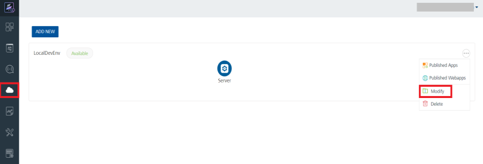
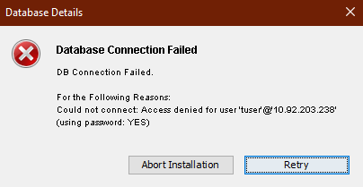

                          

<!-- You are here: Upgrade Issue: FoundryAdminAdapterTest Fails with JWT error -->

FAQs and Troubleshooting
========================

This section lists the troubleshooting tips to resolve problems that you may encounter during installation, and post installation.

**Issue**: If you have upgraded from Foundry V8.x or lower versions to V9 GA or higher versions, some of the services fail to work because of an internal authentication error. These services, such as the **Foundry Admin Adapter**, **Email Adapter**, and **Workflow Email** services, fail with the following error:
```
returned HTTP [400], Response Body [{"details":{"message":"Could not find trust security group for given envId","errcode":0,"errmsg":"Could not find trust security group for given envId"},"httpstatus":"Bad Request","requestid":"5e36d604-09ab-4fbb-9437-42c1d828140f;98","domain":"AUTH","code":-65,"mfcode":"Auth-65","message":"Some of the input parameters provided are invalid"}]  
```

**Workaround**:

To avoid the error, you must perform the following:

1.  Log in to Foundry Console which you upgraded for V9.x.
2.  In your Volt MX Foundry account, click **Environments**. The Environments page appears.
3.  Click **MODIFY** for the environment. The **Modify Environment** page appears, shown below:
    
    
    
4.  In the **Modify Environment** page, click **SAVE**.  


**Issue**: While upgrading from Foundry 7.3 to Volt MX Foundry V9 and then upgrading to a version after V9, the upgrade fails due to the following error:"java.sql.SQLSyntaxErrorException: Table 'prefixidglobaldbsuffix.schema\_version' doesn't exist".
    
**Workaround**:
    
To avoid this issue, perform the following step:

*   Delete the idglobaldb schema before upgrading to the version later than V9.

**Issue**: The publishing of a Storage application fails on an environment that uses the SQLServer with Windows authentication.
    
**Workaround**:
    
In the `server_configuration` table of the Integration database(admindb) insert the key `VOLTMX_SERVER_IS_WINDOWS_AUTHENTICATION_ENABLED` with value set to **true**. Restart the application server.
    

**Issue**:
    
The upgrade installation is rolling back with Validate failed from 8.2.1.3
    
**Workaround**:
    
Before Upgrade, execute below SQL statement from admin database

For **MySQL**  
\------------  
delete from <admindb>.schema\_version where script = 'V62.1\_\_voltmxadmin-mysql-8.2.0.0.sql';  
    
For **SQLServer**  
\---------------  
delete from <admindb>.schema\_version where script = 'V62.1\_\_voltmxadmin-sqlserver-8.2.0.0.sql';  
    
For **Oracle**  
\----------  
delete from <admindb>.schema\_version where script = 'V62.1\_\_voltmxadmin-oracle-8.2.0.0.sql';  
    
    

**Issue**:
    
If you upgrade the integration service or install on new server using the existing database but with a different server details like fully qualified URL port, and when you publish an app, the app publish fails.
    
**Workaround**:
    
You must update management server details in the `server_configuration` table in admin database.
    

*   **How to change the **Hostname/IP address** and **port** details of an existing Volt MX Foundry Server?**
    
    After the installation of Volt MX Foundry, if you want to change the existing Hostname/IP address that was used during the installation of Volt MX Foundry, follow these steps:
    
    1.  Go to your Volt MX Foundry install folder.
    2.  Go to `scripts` folder - for example, `<MFinstallfolder>/scripts`. The `scripts` folder contains a .sql file for the database type that you selected while installing Volt MX Foundry.
    3.  Open the `.sql` file in a text editor.
        
        > **_Important:_** If you want to access Volt MX Foundry Console with a new port, change the value for the `NEW_PORT` with the new value. Otherwise, assign the value of the `OLD_PORT` to the `NEW_PORT` variable.
        
        > **_Important:_** If you want to access Volt MX Foundry Console with a hostname/IP address, change the value for the `NEW_HOST` with the new value. Otherwise, assign the value of the `OLD_HOST` to the `NEW_HOST` variable.
        
    4.  Change the values for the following variables.
        *   For MySQL, MariaDB, and SQL Server, replace the values for the `NEW_HOST` and the `NEW_PORT` with new values.
        *   For Oracle, replace all the occurrences of the `NEW_HOST` and the `NEW_PORT` with new values.
    5.  Run the SQL script on the database where you have installed Volt MX Foundry.

*   **How to change the Engagement Async Core version of an existing Volt MX Foundry Server running on Tomcat?**

From the Installer, you create a service having JVM params. The service gets registered in the WINDOWS Registry. To override any -D params we need to either change the registry entry or update the service. To change the Engagement Async Core version in your Volt MX Foundry server running on Tomcat with Windows OS, do the following:

*   Change the service in Windows Registry.
*   Modify the JVM params by using Regedit.

**Issue**:
    
If you face the error dialogue "`Windows error 2 occurred while loading the Java VM`" while launching the Volt MX Foundry Patch Installer, because of the following:

Volt MX Foundry Patch Installer runs with your system's default Java. If an user machine has Java 8 installed, then check if the machine's `System Environment Path for Java`  or  `JAVA_HOME`  is set to `c:\programdata\oracle\java\javapath`
    
**Workaround**:
    
1.  Remove the current path from `JAVA_HOME` and set the new path as `C:\Program Files (x86)\Java\jre1.8.0_40\bin`
2.  Launch the Volt MX Foundry Patch Installer.
3.  After the installation completed, reset the machine's  `System Environment Path for Java`  or  `JAVA_HOME` path to it's original path. For example `c:\programdata\oracle\java\javapath`

**Issue**:
    
If your service provider's certificate is not configured, the system displays an error - "peer not authenticated."
    
**Workaround**:
    
For trusted certification issues, refer to [Service Provider's Certificate Issues](Post-Installation_Tasks.md#Service_Provider's_Certificate_Issues).
    

**Issue**:
    
When customer wants to install Volt MX Foundry with Oracle as database type, the system throws the error: `Invalid Data Type SDO_GEOMENTRY`
    
**Workaround**:
    
Install Oracle locator, which is required for Volt MX Foundry installation. For more details, refer to [Pre-installation Tasks > Create Locator Component for Oracle Database](DB_Pre-installation_Tasks.md#create-locator-component-for-oracle-database)
    

**Issue**:
    
Upgrading from Volt MX Foundry 6.5.2, 7.0.1 or 7.1.1 with MS SQL Server fails. Installer is rolling back, as the schema version table is not migrating properly while upgrade.
    
**Workaround**:
    
To avoid this issue, follow this step:

Remove the `version_rank` column from `schema_version` table in each schema by following queries before upgrade.
    
```
drop index schema_version_vr_idx on master.<SCHEMA_NAME>.schema_version;  
      
    alter table master.<SCHEMA_NAME>.schema_version drop column version_rank;
```

**Issue**:
    
If you do not want to use a DB user with DBA role or Equivalent privileges for the Volt MX Foundry installation on ORACLE database, follow these steps:
    
**Workaround**:
    
Manual Steps:

1\. Create Component Users (schema) with the required grants as below.

CREATE USER <prefix>MFCONSOLEDB<suffix> identified by <password> default tablespace <dataTablespace> profile default;  
ALTER USER <prefix>MFCONSOLEDB<suffix> QUOTA UNLIMITED ON USERS;  
GRANT CONNECT,RESOURCE,CREATE VIEW TO <prefix>MFCONSOLEDB<suffix>;  
GRANT CREATE JOB TO <prefix>MFCONSOLEDB<suffix>;  
GRANT MANAGE SCHEDULER TO <prefix>MFCONSOLEDB<suffix>;

CREATE USER <prefix>MFACCOUNTSDB<suffix> identified by <password> default tablespace <dataTablespace> profile default;  
ALTER USER <prefix>MFACCOUNTSDB<suffix> QUOTA UNLIMITED ON USERS;  
GRANT CONNECT,RESOURCE,CREATE VIEW TO <prefix>MFACCOUNTSDB<suffix>;  
GRANT CREATE JOB TO <prefix>MFACCOUNTSDB<suffix>;  
GRANT MANAGE SCHEDULER TO <prefix>MFACCOUNTSDB<suffix>;

CREATE USER <prefix>MFREPORTSDB<suffix> identified by <password> default tablespace <dataTablespace> profile default;  
ALTER USER <prefix>MFREPORTSDB<suffix> QUOTA UNLIMITED ON USERS;  
GRANT CONNECT,RESOURCE,CREATE VIEW TO <prefix>MFREPORTSDB<suffix>;  
GRANT CREATE JOB TO <prefix>MFREPORTSDB<suffix>;  
GRANT MANAGE SCHEDULER TO <prefix>MFREPORTSDB<suffix>;

CREATE USER <prefix>IDCONFIGDB<suffix> identified by <password> default tablespace <dataTablespace> profile default;  
ALTER USER <prefix>IDCONFIGDB<suffix> QUOTA UNLIMITED ON USERS;  
GRANT CONNECT,RESOURCE,CREATE VIEW TO <prefix>IDCONFIGDB<suffix>;  
GRANT CREATE JOB TO <prefix>IDCONFIGDB<suffix>;  
GRANT MANAGE SCHEDULER TO <prefix>IDCONFIGDB<suffix>;  
GRANT CREATE TABLE TO <prefix>IDCONFIGDB<suffix>;  
GRANT CREATE ANY INDEX TO <prefix>IDCONFIGDB<suffix>;  
GRANT ALTER ANY TABLE TO <prefix>IDCONFIGDB<suffix>;

CREATE USER <prefix>ADMINDB<suffix> identified by <password> default tablespace <dataTablespace> profile default;  
ALTER USER <prefix>ADMINDB<suffix> QUOTA UNLIMITED ON USERS;  
GRANT CONNECT,RESOURCE,CREATE VIEW TO <prefix>ADMINDB<suffix>;  
GRANT CREATE JOB TO <prefix>ADMINDB<suffix>;  
GRANT MANAGE SCHEDULER TO <prefix>ADMINDB<suffix>;

CREATE USER <prefix>VPNSDB<suffix> identified by <password> default tablespace <dataTablespace> profile default;  
ALTER USER <prefix>VPNSDB<suffix> QUOTA UNLIMITED ON USERS;  
GRANT CONNECT,RESOURCE,CREATE VIEW TO <prefix>VPNSDB<suffix>;  
GRANT CREATE JOB TO <prefix>VPNSDB<suffix>;  
GRANT MANAGE SCHEDULER TO <prefix>VPNSDB<suffix>;

2\. Create a non DBA user with the below grants. This user will be given to the Installer.

CREATE USER <INSTALLER\_USER> IDENTIFIED BY <password>;  
GRANT CREATE SESSION TO <INSTALLER\_USER> WITH ADMIN OPTION;  
GRANT SELECT ANY DICTIONARY TO <INSTALLER\_USER>;  
ALTER USER <INSTALLER\_USER> QUOTA UNLIMITED ON <dataTablespace>;  
ALTER USER <INSTALLER\_USER> QUOTA UNLIMITED ON <indexTablespace>;  
ALTER USER <INSTALLER\_USER> QUOTA UNLIMITED ON <lobTablespace>;

> **_Note:_**   The password for the component users and the installer user have to be same.


**Issue**:
    
If you do not want to use a DB user with DBA role or Equivalent privileges for the Volt MX Foundry installation on MSSQL, follow these steps:
    
**Workaround**:
    
Manual Steps:

Create database <prefix>mfreportsdb<suffix>;  
Create database <prefix>mfaccountsdb<suffix>;  
Create database <prefix>mfconsoledb<suffix>;  
Create database <prefix>admindb<suffix>;  
    
Create database <prefix>vpnsdb<suffix>;  
Create database <prefix>idconfigdb<suffix>;  
CREATE LOGIN loginId WITH PASSWORD = 'loginpwd'  
GO  
use msdb  
GO  
create user userId from LOGIN loginId;  
GO  
EXEC sp\_addrolemember 'SQLAgentUserRole', 'userId'  
EXEC sp\_addrolemember 'SQLAgentReaderRole', 'userId'  
EXEC sp\_addrolemember 'SQLAgentOperatorRole', 'userId'  
GO  
use <prefix>mfreportsdbAN<suffix>  
GO  
create user userId from LOGIN loginId;  
GO  
GRANT ALTER ANY DATABASE DDL TRIGGER TO userId  
GO  
GRANT CREATE TABLE,CREATE TYPE,CREATE PROCEDURE,SELECT,UPDATE,DELETE,INSERT,EXECUTE,REFERENCES,CREATE VIEW,ALTER,VIEW Definition TO userId  
GO  
use <prefix>mfaccountsdb<suffix>  
GO  
create user userId from LOGIN loginId;  
GO  
GRANT ALTER ANY DATABASE DDL TRIGGER TO userId  
GO  
GRANT CREATE TABLE,CREATE TYPE,CREATE PROCEDURE,SELECT,UPDATE,DELETE,INSERT,EXECUTE,REFERENCES,CREATE VIEW,ALTER,VIEW Definition TO userId  
GO  
use <prefix>mfconsoledb<suffix>  
GO  
create user userId from LOGIN loginId;  
GO  
GRANT ALTER ANY DATABASE DDL TRIGGER TO userId  
GO  
GRANT CREATE TABLE,CREATE TYPE,CREATE PROCEDURE,SELECT,UPDATE,DELETE,INSERT,EXECUTE,REFERENCES,CREATE VIEW,ALTER,VIEW Definition TO userId  
GO  
use <prefix>admindb<suffix>  
GO  
create user userId from LOGIN loginId;  
GO  
GRANT CREATE TABLE,CREATE TYPE,CREATE PROCEDURE,SELECT,UPDATE,DELETE,INSERT,EXECUTE,REFERENCES,CREATE VIEW,ALTER TO userId  
GO  
    
use <prefix>vpnsdb<suffix>  
GO  
CREATE SCHEMA <prefix>vpnsdb<suffix>;  
GO  
create user userId from LOGIN loginId;  
GO  
GRANT CREATE TABLE,CREATE TYPE,CREATE PROCEDURE,SELECT,UPDATE,DELETE,INSERT,EXECUTE,REFERENCES,CREATE VIEW,ALTER TO userId  
GO  
use <prefix>idconfigdb<suffix>  
GO  
create user userId from LOGIN loginId;  
GO  
GRANT CREATE TABLE,CREATE TYPE,CREATE PROCEDURE,SELECT,UPDATE,DELETE,INSERT,EXECUTE,REFERENCES,CREATE VIEW,ALTER TO userId  
GO

> **_Note:_** The whole script must be run at once.

> **_Note:_** The loginId and password must be the same as used for Volt MX Foundry Installation.

> **_Note:_** The <prefix> and <suffix> provided must be the same across the script and must also be provided at the time of the Volt MX foundry Installation.

> **_Note:_** You can use the same loginId and userId to avoid confusion.

> **_Note:_** The userId must be same across the script.


**Issue**:
    
After entering Database details the DB connection fails with the following error:
    

    
**Workaround**:
    
The password used for the Database must not contain exclamation marks (!).
    
**Issue**:
    
If you are using any lower versions of MySQL 5.7 such as v5.7.12 or lower during installation, you may encounter an error due to which the installation rolls back. This error occurs due to a bug in the MySQL database.  
For more information, refer [MySQL Bugs](https://bugs.mysql.com/bug.php?id=79286)

Following are the error details:

*   Error Migration V810\_27\_01\_\_DeleteDuplicateAcsUserIdProviderGuidRowsAddUniqueConstraint.sql failed
*   SQL State HY000
*   Error Code 1093
*   Error Message: You can't specify target table 'users' for update in FROM clause
*   Location: <Location where the installation is done>
    
**Workaround**:
    
To resolve this issue, refer [Prerequisites for Volt MX Foundry with MySQL- Applicable for Identity Services](DB_PRe-reqs.md).
    

Upgrade Issue: FoundryAdminAdapterTest Fails with JWT error
----------------------------------------------------------

**Issue**: If you have upgraded from Foundry V8.x or lower versions to Foundry V9 GA or higher versions, you must edit the environment in your on-premises Foundry Console to avoid issues such as:
    
*   The Admin Adapter, Email Adapter and Workflow email services will not work properly.
*   While execution of a Service Task in Workflow Service, if the service task fails with the following error.
    
```
returned HTTP [400], Response Body [{"details":{"message":"Could not find trust security group for given envId","errcode":0,"errmsg":"Could not find trust security group for given envId"},"httpstatus":"Bad Request","requestid":"5e36d604-09ab-4fbb-9437-42c1d828140f;98","domain":"AUTH","code":-65,"mfcode":"Auth-65","message":"Some of the input parameters provided are invalid"}]
```
    
**Workaround**:
    
1.  Log in to your Foundry Console.
2.  In your Volt MX Foundry account, click **Environments**. The Environments page appears.
3.  Click **MODIFY** for the environment. The **Modify Environment** page appears, shown below:
    
    
    
4.  Click **SAVE**.
    
    Now you can execute the aforementioned services successfully.
    

<h2 id="hostname-port-changes-for-tomcat-application-server">Hostname/Port changes for Tomcat Application Server</h2>

Volt MX  Foundry On-Premises Installer provides a script to change the Hostname or Port of the installed Volt MX Foundry instance. In your installed Tomcat Application Server, you must also perform the following changes:

In `//tomcat/webapps/apiportal/WEB-INF/classes/config.properties`, replace the existing URL with the new URL in the following fields:

*   `VOLTMX_ACCOUNT_API_BASE_URL=`
*   `VOLTMX_DEVELOPER_PORTAL_BASE_URL=`

In `//tomcat/webapps/mfconsole/WEB-INF/classes/config.properties`, replace the existing URL with the new URL in the `VOLTMX_ACCOUNT_API_BASE_URL=` field.

In `//tomcat/conf/server.xml`, replace the port number with the new port number in the `<Connector server="VoltMX" port=` field.

In `//tomcat/webapps/accounts/WEB-INF/classes/accounts.properties`, replace the port number with the new port number in the following fields:

*   `VOLTMX_INTEGRATION_SERVICE_PORT=`
*   `VOLTMX_MESSAGING_SERVICE_PORT=`

<h2 id="hostname-port-changes-for-jboss-application-server">Hostname/Port changes for JBoss Application Server</h2>

Volt MX  Foundry On-Premises Installer provides a script to change the Hostname or Port of the installed Volt MX Foundry instance. The script can be found in the installation folder. In your installed JBoss Application Server, you must follow the instructions in the script and also perform the following steps:

1.  In the standalone.xml file replace the IP address/port number with the new IP address/port number.
2.  In `mfconsole.war\WEB-INF\classes\config.properties`, replace the existing URL with the new URL in the `VOLTMX_ACCOUNT_API_BASE_URL=` field.
3.  In `apiportal.war\WEB-INF\classes\config.properties`, replace the existing URL with the new URL in the following fields:
*   `VOLTMX_ACCOUNT_API_BASE_URL=`
*   `VOLTMX_DEVELOPER_PORTAL_BASE_URL=`
4.  In `accounts.war\WEB-INF\classes\accounts.properties`, replace the port number with the new port number in the `VOLTMX_INTEGRATION_SERVICE_PORT=` field.

How to Configure JBoss Cluster
------------------------------

*   Refer to [https://access.redhat.com/solutions/218053](https://access.redhat.com/solutions/218053) to setup EAP in Domain mode.
*   Refer to [https://docs.jboss.org/mod\_cluster/1.1.0.html/Quick\_Start\_Guide.html](https://docs.modcluster.io/#jboss-as) to configure the mod\_cluster.
*   Refer to [https://access.redhat.com/solutions/2332111](https://access.redhat.com/solutions/2332111) to integrate the mod\_cluster with JBoss.

How to Configure Heap and PermGen Size
--------------------------------------

### Configuring Heap and PermGen Size for Tomcat

By default, the heap settings for Tomcat allocated are Min -`Xms1024m` / Max - `Xmx2048m`, and default permgen settings are: -XX:PermSize=`1024m` \-XX:MaxPermSize=`1024`m

For better performance in case of several publishes, update the following heap and permgen settings  in the file: `{Installation directory}/tomcat/bin/catalina.bat`

*   heap settings: Min -`Xms1024m` / Max - `Xmx1024m`.

> **_Important:_** While installing Volt MX Foundry Components including Integration services, set the heap settings to: Min -Xms2048m / Max - Xmx2048m

*   permgen settings : -XX:PermSize=`1024m` -XX:MaxPermSize=`2048m`

### Configuring Heap and PermGen Size for JBoss

In case of multinode, do the following:

*   Configure the Min -`Xms2048m` / Max - `Xmx4096m` heap settings in the file: `{ Server directory }/domain/configuration/host.xml`
*   Configure the Min -`Xms2048m` / Max - `Xmx4096m` heap settings in the file: `{ Server directory }/domain/configuration/domain.xml`
*   permgen settings : -XX:PermSize=`1024m` -XX:MaxPermSize=`2048m`

In case of single node, configure the settings in `{ Install directory }/jboss/standalone/configuration/standalone.xml`


<!-- ### Configuring Heap and PermGen Size for WebLogic

Configure the Min -`Xms6144m` / Max - `Xmx6144m` heap settings in the file: `{Server directory }/user_projects/domains/bin/setDomainEnv.cmd`

1.  Go to the `{Server directory}/user_projects/domains/bin/` folder, and open the `setDomainEnv.cmd` file in a text editor.
2.  Search for the following comment line:
```
@REM IF USER_MEM_ARGS the environment variable is set, use it to override ALL MEM_ARGS values
```
3.  Immediately after the comment line, add the following line:
```
set USER_MEM_ARGS=-Xms6144m -Xmx6144m
```
4.  Save the file, and then restart the WebLogic Server. -->


How to Configure Volt MX Foundry Behind a Reverse Proxy
------------------------------------------------------

If you want to access everything via a proxy URL, including Volt MX Foundry Console (for example, design time for your app developers) and authService, and integration services (for example, runtime from users using your apps), follow these steps:

1.  Install Volt MX Foundry with internal details like your internal IP and HTTP port.
2.  After installation, stop Volt MX Foundry Console (without configuring authservice details) and update the below properties files:
    1.  In the  `accounts.war/WEB-INF/classes`  folder, open the `accounts.properties`  file, and update the `WAAS_BASE_URL=<PUBLIC_URL_OF_YOUR_APACHE>/workspace` property with a public URL instead of the private URL. By default, the private URL is set during installation.
        
        Examples of proxy URLs:
        
        *   `WAAS_BASE_URL=http://test.voltmx.com/workspace`
        *   `WAAS_BASE_URL=https://test.voltmx.com:8443/workspace`
        *   `WAAS_BASE_URL=http://test.voltmx.com:8080/workspace`
    2.  Following are the changes to be made in the war for each App Server:
        *   **Tomcat**: In `mfconsole.war/WEB-INF/classes`, open the `config.properties` file, and update the `VOLTMX_ACCOUNT_API_BASE_URL=<PUBLIC_URL_OF_YOUR_APACHE>/accounts/api/v1_0/` property with a public URL instead of the private URL that was generated during installation.
        *   **JBoss - Standalone (Bundled JBoss)**: In `Standalone/deployments/mfconsole.war`, open the `config.properties` file, and update the `VOLTMX_ACCOUNT_API_BASE_URL=<PUBLIC_URL_OF_YOUR_APACHE>/accounts/api/v1_0/` property with a public URL instead of the private URL that was generated during installation.
        *   **JBoss - Pre-configured and Domain mode**: Take a backup of the existing war. Undeploy `mfconsole.war`. In `mfconsole.war/WEB-INF/classes`, open the `config.properties` file, update the `VOLTMX_ACCOUNT_API_BASE_URL=<PUBLIC_URL_OF_YOUR_APACHE>/accounts/api/v1_0/` property with a public URL instead of the private URL that was generated during installation, and re-deploy the war file.

        <!-- *   **WebLogic**: In `mfconsole.war/WEB-INF/classes`, open the `config.properties` file, and update the `VOLTMX_ACCOUNT_API_BASE_URL=<PUBLIC_URL_OF_YOUR_APACHE>/accounts/api/v1_0/` property with a public URL instead of the private URL that was generated during installation. -->

3.  Start Volt MX Foundry Console.
4.  Launch your Volt MX Foundry Console in browser by using `<PUBLIC_URL_OF_YOUR_APACHE>/mfconsole`. The auth setup page appears.
5.  Enter the auth URL with public URL like `<PUBLIC_URL_OF_YOUR_APACHE>/authService`. If you provide an internal IP here, appconfig will show internal IPs.
6.  Also after log in to Volt MX Foundry Console, while registering server, provide the `PUBLIC_URL` to register integration server. Now all the URLs will have the public hostnames.
    
    If you want to give public access only to runtime services like authservice and integration services you can skip step 2 and step 3 from the above procedure. This will make sure service doc will have all public URLs.
    
    > **_Note:_** Proxy configuration should have preserver host directive for Volt MX Foundry to work correctly after start up.  
      
    For example, in case of apache proxy, use `` `ProxyPreserveHost On`  
    ``and in case of NGINX, use `` `proxy_set_header Host $host;` ``(For more information, refer [Passing request headers](https://docs.nginx.com/nginx/admin-guide/web-server/reverse-proxy#passing-request-headers))
    

Preserving Proxy if Load Balancer or Proxy Server is Configured
---------------------------------------------------------------

To stop the load balancer from redirecting to the load balancer host, add the following properties in **Application Servers** \> **Server name** \> **Web Container Settings** \> **Custom Properties**:

*   com.ibm.ws.webcontainer.extractHostHeaderPort
*   trusthostheaderport

For more information, you can refer to [IBM Support](http://www-01.ibm.com/support/docview.wss?uid=swg21569667).

How to Configure Frontend HTTPS to Tomcat HTTP Redirection
----------------------------------------------------------

If you are installing Volt Foundry on Tomcat on HTTP and wants to route requests via HTTPS apache or loadbalancer, add a connector in the `tomcat/server.xml` with the following attributes:

```
proxyName="<ProxyHost>" proxyPort="<ProxyPort>" scheme="https" secure="true"
```

Example:

```
<Connector server="VoltMXTEST" port="8080" protocol="HTTP/1.1" 
proxyName="mbaastest10.hcl.net" proxyPort="443" scheme="https" secure="true" maxHttpHeaderSize="8192" maxThreads="150" enableLookups="false" acceptCount="25" disableUploadTimeout="true" tcpNoDelay="true" compression="on" compressableMimeType="text/css,text/javascript,text.html" connectionTimeout="20000" URIEncoding="UTF-8"/>
```

How to encrypt the database password
------------------------------------

> **IMPORTANT:** Encryption is only supported for Tomcat application servers.

Volt Foundry provides a 256-bit AES/GCM/NoPadding encryption utility, which can be used to encrypt your database password. To encrypt your database password, follow these steps:

1. Download and extract the installation zip file or tar file.
2. From the extracted folder, open a terminal (console), and then execute the following command:

    ```
    java -jar EncryptionUtility.jar
    ```

3. In the **Enter Password to be Encrypted** field, type the password that is used to access your database.
4. In the **Enter Key to be Encrypted** field, type the key that must be used to encrypt the password.

The console then displays the **Encrypted Password** and **Encrypted Key**. These values must be typed in the ```Database Password``` and ```Encrypted Rotational Key``` boxes on the [Database Details](Installing_Foundry_on_Tomcat.md) screen.
