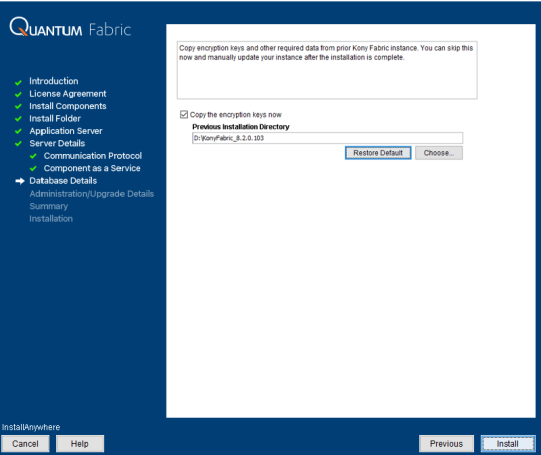

                           

Upgrading Volt MX Foundry to V9
==============================

This section explains upgrading Volt MX Foundry Components through the installer. For an upgrade to work, the minimum installation version should be Foundry 7.x.GA / 8.4.X.GA.

> **_Important:_** The new Volt MX Foundry Upgrade process works by upgrading the existing database to the latest version and by installing fresh application server artifacts, such as data sources, WARs, etc. For installation details such as hostname, database port, prefix, suffix, etc., you must refer to the installation logs of your previous setup.

*   The Installer does not support automatic backups of database and other artifacts. You must perform a cleanup of the existing application server artifacts and take a backup of the custom artifacts.
*   The Installer does not support rollback in case of a failure during the upgrade. In order to rollback you must restore your backed up database and server artifacts before upgrading .
*   After the upgrade, you must republish your Volt MX Foundry applications. The application WAR artifacts maybe required to be built with the latest plugins.
*   If the application server setup is a clustered setup then the installation needs to done by connecting to the Management Server and port.
*   For bundled Tomcat and Standalone JBoss, stop the running app server, start a fresh installation, and ensure that you provide the same Hostname, Ports, and Database schema prefix and suffix as the previous installation.

<!-- *   For remote servers such as Pre-Configured JBoss, Multi-Node JBoss, or WebLogic, perform a cleanup of the app server artifacts, start a fresh installation, and ensure that you provide the same Hostname, Ports, and Database schema prefix and suffix as the previous installation. HCL recommends performing the cleanup of the app server by using the Management Console. -->

*   For remote servers such as Pre-Configured JBoss, or Multi-Node JBoss, perform a cleanup of the app server artifacts, start a fresh installation, and ensure that you provide the same Hostname, Ports, and Database schema prefix and suffix as the previous installation. HCL recommends performing the cleanup of the app server by using the Management Console.

The **<Install Location>** directory contains the log files documenting each invocation of the installer or uninstaller. To make problem identification easier, provide these log files to HCL when reporting an issue.

Prerequisites
-------------

*   You can download the Volt MX Foundry Installer from [https://hclsoftware.flexnetoperations.com](https://hclsoftware.flexnetoperations.com/flexnet/operationsportal/entitledDownloadFile.action?downloadPkgId=HCL_Volt_Foundry_v9.2.x&orgId=HCL&fromRecentFile=false&fromRecentPkg=true&fromDL=false) with your credentials.
*   Ensure that VoltMXFoundryInstaller.exe file has execute permission.
*   Ensure that you have the path of your Previous Installation Directory.

To upgrade Volt MX Foundry using the installer, follow these steps:

1.  Ensure that you stop the application server of your existing Foundry/VoltMX Foundry instance, which you want to upgrade.
2.  Unzip the `VoltMXFoundrySetup.zip` file that you downloaded for upgrading.
3.  Double-click `VoltMXFoundryInstaller-x.x.x.x_GA.exe` to launch the installer.
    *   To use Windows Authentication on MSSQL, refer [Windows Authentication Support](DB_Pre-installation_Tasks.md#windows-authentication-support).  
        The **InstallAnywhere** dialog appears. The **InstallAnyWhere** dialog displays information about the progress of the software installation at run time.
        
        
        
4.  Continue the installation until you reach the **Choose Database Provider** screen.
    
    > **_Note:_** Upgrade steps for Volt MX Foundry until the **Choose Database Provider** section are same that as a fresh installation.
    
    For more details on how to install Volt MX Foundry components on an application server with a database, refer [Installation Modes - Volt MX Foundry](Installing_Modes.md)
    
5.  Click **Next**. The **Database Details** window appears. From the **Database Choice** drop-down, choose one of the databases to display database details and fill the details. By default, this option is set to MySQL.
    
      
    
6.  Enter the database server details such as hostname, port, user, and password.
    
    > **_Note:_** For installation details such as hostname, database port, prefix, suffix, etc., you must refer to the installation logs of your previous setup.
    
7.  Enter the `prefix` and `suffix` of your existing Volt MX Foundry database which is being upgraded.
8.  After entering the prefix and suffix of the database, click **Next**.
    
    If a database exists, the system displays the warning message: `One or more databases already exist. Do you want to use existing databases? If yes, then the schema may be upgraded.` shown below:
    
    
    
9.  Click **Yes, Use existing.** The following screen appears:
    
    
    
    Provide the path of your Previous Installation Directory.
    
    If you choose to skip providing the keys, go to your upgraded Volt MX Foundry install location and paste the following details that you copied from the previous Foundry install folder:
    
    *   `authService.key`: <Install Location>\\tomcat\\webapps\\authService\\WEB-INF\\classes\\authservice.key
    *   `workspaceService.key`: <Install Location>\\tomcat\\webapps\\workspace\\WEB-INF\\classes\\workspaceService.key
    *    `ACCOUNTS_ENCRYPTION_KEY`: <Install Location>\\tomcat\\webapps\\accounts\\WEB-INF\\classes\\accounts.properties
    
    Restart or redeploy the war components after you update the keys.
    
10.  Click **Next**. The **Administrator Account Configuration** window appears.
11.  Clear the **Create Volt MX Foundry administrator account now** check box.  
      
    While installing Volt MX Foundry using an existing database, you must not configure your super administrator account again.
    
    > **_Note:_** You can directly log in to Volt MX Foundry Console using the existing credentials after a successful upgrade.
    
    
    
12.  Click **Next**. The **Summary** window appears.
    
    > **_Note:_**  The existing schemas and upgraded for the new instance. The databases for the selected components are created based on the prefix and suffix that you provided.
    
13.  Click **Install**. The **Installing Volt MX Foundry** window appears.
    
    
    
    > **_Note:_**  Sometimes, even after showing 100% installation progress, Volt MX Foundry Installer takes around 20 more minutes to complete installation on Windows.
    
    Once the installation completes, the **Install Complete** window appears with the confirmation message.
    
      
    
14.  Click **Done** to close the window.
15.  You can now access Volt MX Foundry Console by using the **new** URLs. For more details, refer to [Accessing Volt MX Foundry Console - On-premises](../../../Foundry/voltmx_foundry_user_guide/Content/How_to_access_VoltMX_Foundry_Portal_on-Prem.md).

> **_Note:_** Please update the <b>SSL Trust Store </b> and <b> SSL Key Store </b> fields manually, post foundry upgradation. 
<b>SSL Trust Store</b> and <b>SSL Key Store</b> fields are situated at Admin Console -> Settings -> Runtime configuration -> SSL Configuration.