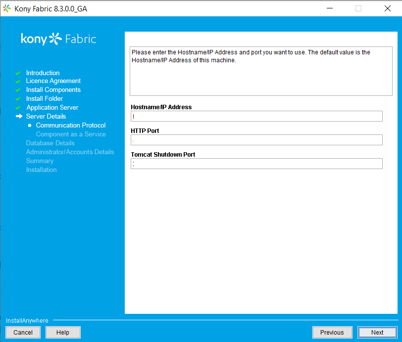
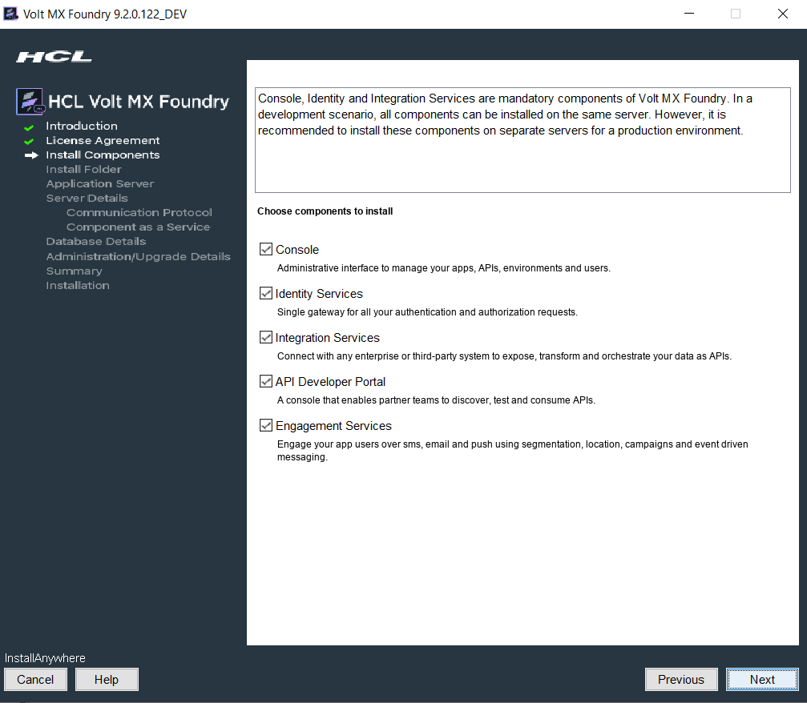
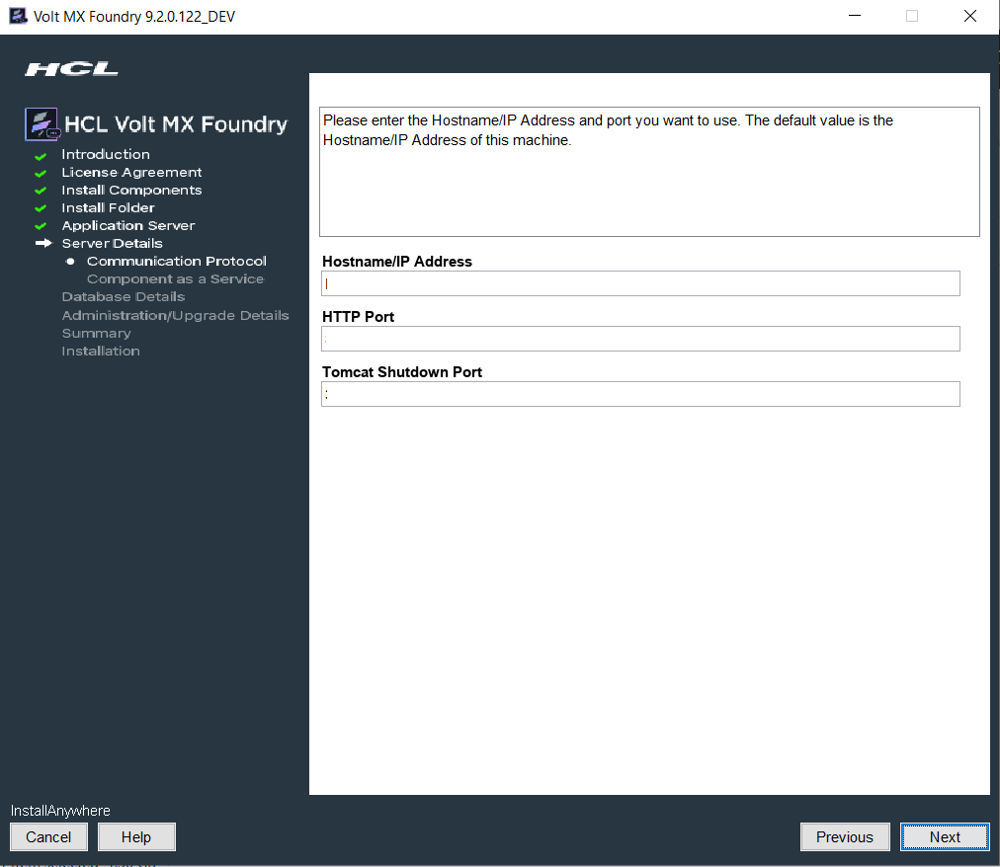
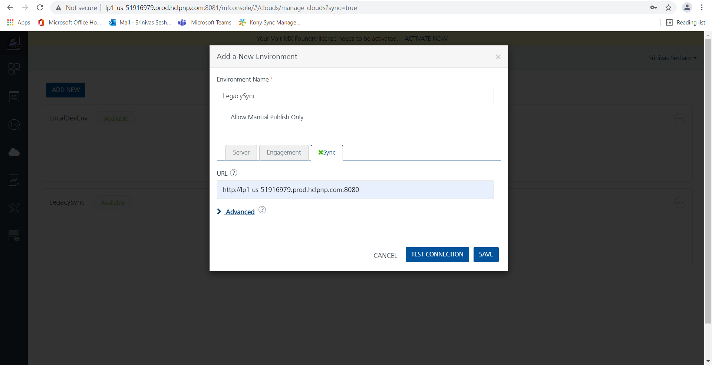
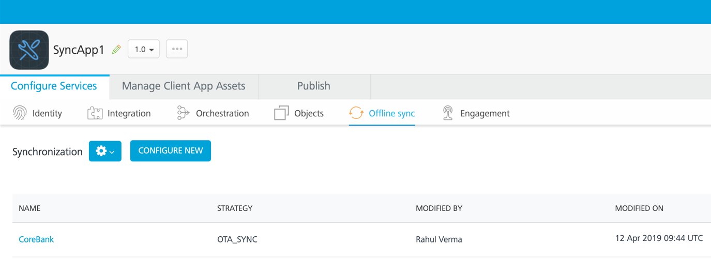

# Using Volt MX Legacy Sync with Foundry

>**_Important:_** Volt MX Legacy Sync has been deprecated. You cannot create a new Legacy Sync-based client application. However, existing Legacy Sync-based apps will continue to work. New applications that need offline and sync capabilities must use the Offline Objects feature. For Q&A about offline objects, please refer to the [Offline Objects FAQ](https://support.hcltechsw.com/csm?id=kb_article&sysparm_article=KB0092079).

To use Volt MX Legacy Sync, do one of the following:

* Install Foundry with Volt MX Legacy Sync.
* Upgrade your application server to Foundry and keep using your existing Sync server.

## Installing Foundry with Volt MX Legacy Sync

Complete the following steps:
  
1. Install the Sync server from Volt MX V8 SP3 Legacy Sync installer (or earlier).
1. Install the console, Identity, and other components from the Foundry installer.

### Installing the Sync server from the Volt MX Legacy Sync installer

1. Run the installer. When prompted to choose components to install, select only Sync Services and leave the other components unchecked.

1. When prompted for the hostname and HTTP port to use for the Sync server, make sure it is different from the one you will use for the Foundry installer.

1. Follow the remaining steps to complete the installation.

### Install console, Identity, and other components from the Foundry installer

1. Run the installer.
1. When prompted to choose components to install, select all that you need. Note that there is no Sync option.

1. When prompted for server details, make sure the Hostname and HTTP port are different from those you specified for the Sync server installation.

1. Follow the remaining steps to complete the installation.

Once the installation is complete, use the Console URL in the Volt MX Foundry installation success window to access the Volt MX Foundry Console. To enable the Sync tab, append "sync=true" to the browser URL:

http<nolink>://hostname:8080/mfconsole/#/clouds/manage-clouds?sync=true

When prompted for a URL in the Add a New Environment dialog box, use the hostname and port you provided during the Volt MX Legacy Sync server installation.

>**_Note:_** The Sync tab in the Foundry console is only visible for legacy apps that contain Sync artifacts. New apps do not contain a Sync tab and must use Offline Objects for synchronization capability.

## Using an existing Sync server with an upgraded Foundry application server

If you have an existing Volt MX installation with Sync Server and want to upgrade the Application Server to 8.4.1.1 and above, follow the normal [Volt MX upgrade procedure](https://opensource.hcltechsw.com/volt-mx-docs/docs/documentation/Foundry/voltmx_foundry_windows_install_guide/Content/Upgrading_VoltMX_Foundry_SP1.md). 
A few points to note:
* For the Foundry server, use a hostname and HTTP port that differ from the ones for your existing Foundry server.
* In step 7 (Choose Database Provider), specify the prefix and suffix of your existing Foundry database in the Database Name Prefix and Database Name Suffix fields. For the exact strings, check MYSQL_DB_PREFIX and MYSQL_DB_SUFFIX in Kony_Fabri_Install_*.log in the Fabric installation folder.
* While setting up the environment in Foundry, the Sync tab is disabled. To enable the tab, append sync=true to the browser URL:

http:<nolink>//hostname:8080/mfconsole/#/clouds/manage-clouds?sync=true
* For Server and Engagement URL, use the hostname and port that you provided during Foundry installation.
* For Sync URL, use the hostname and port of your existing Sync server.
