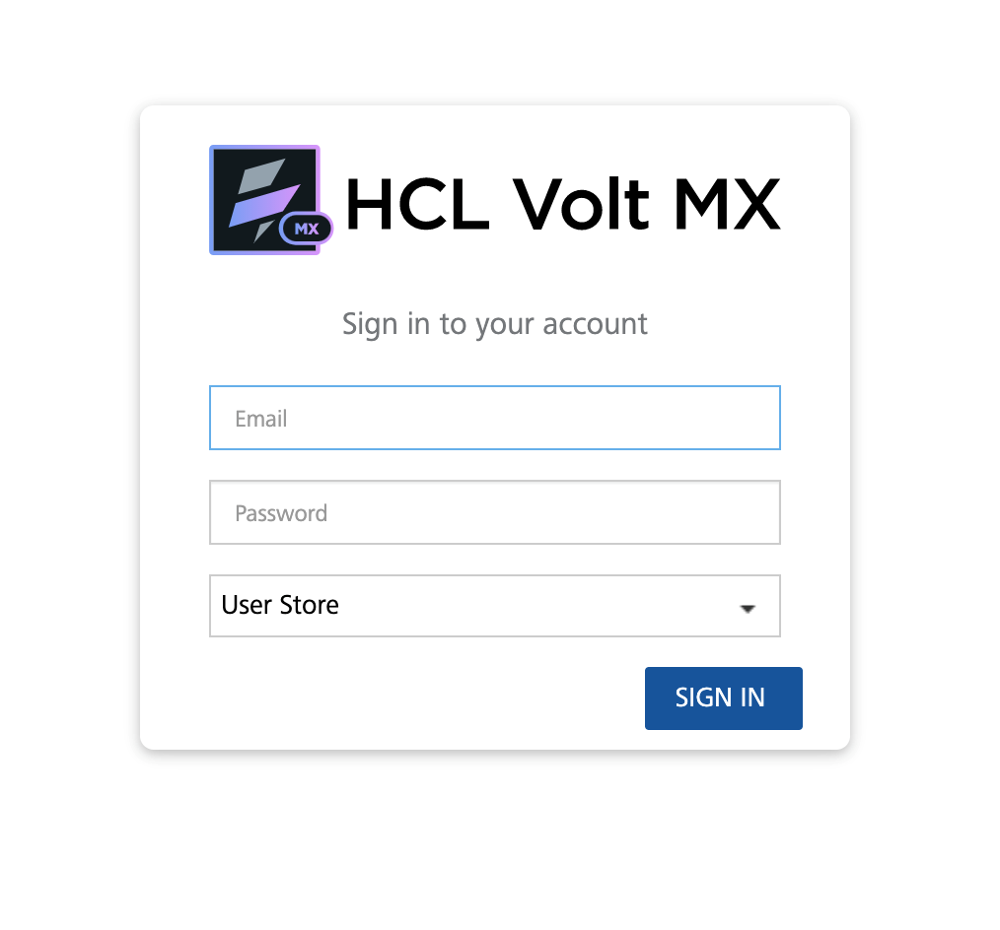
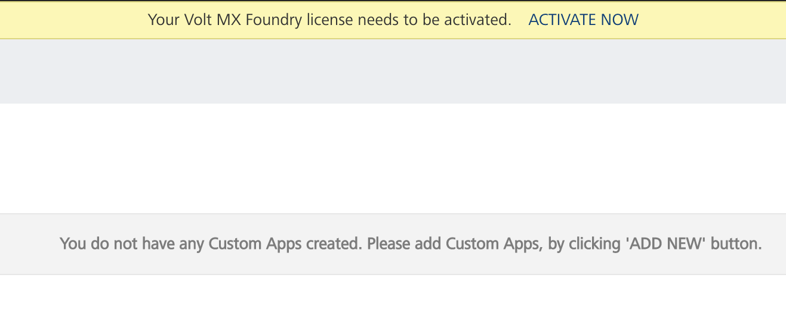
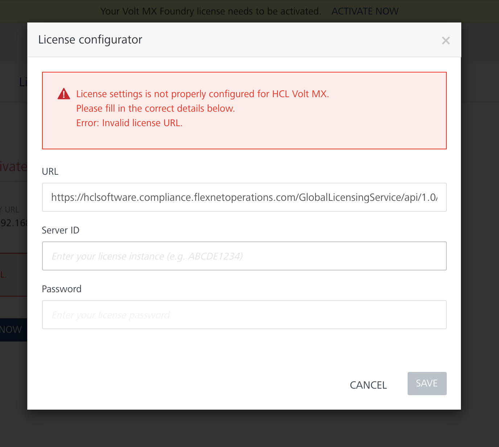
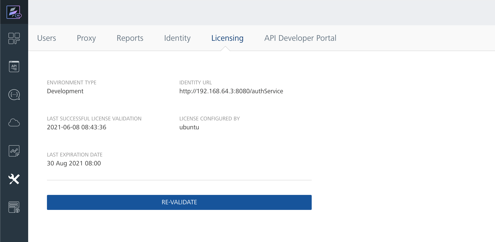
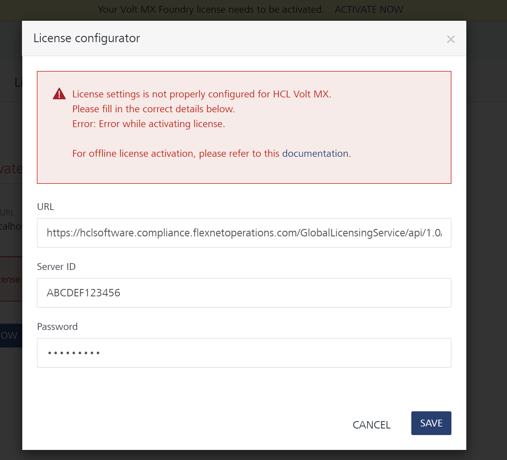
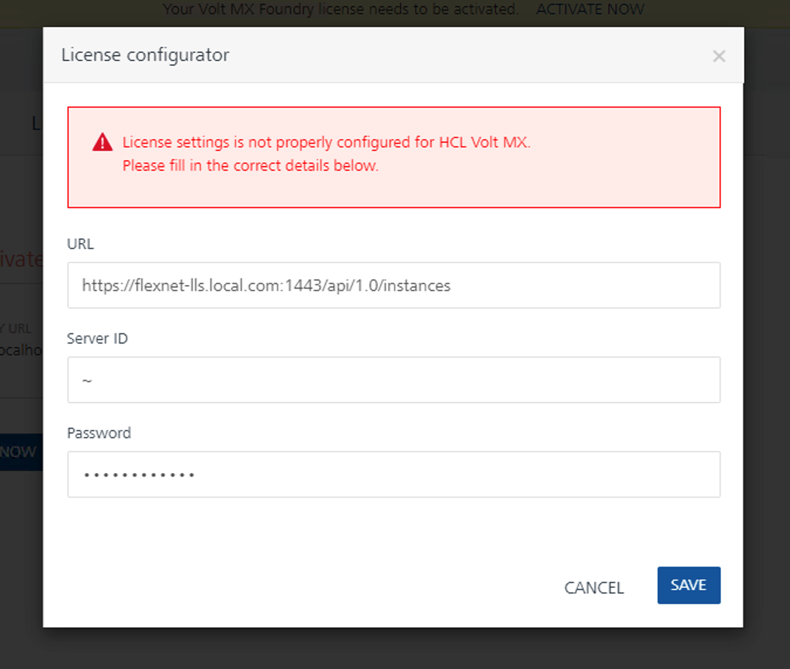
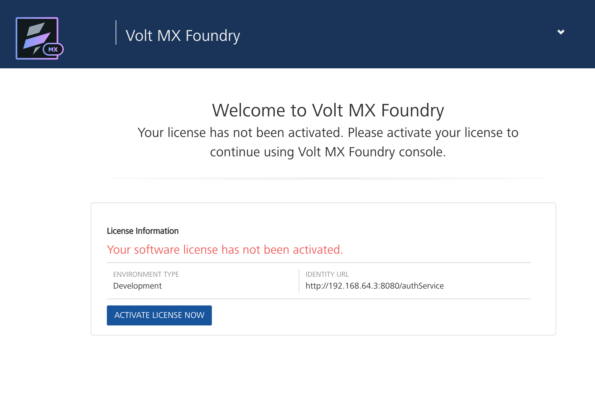

              
Volt MX  Foundry
================
            
Prerequisites
-------------

The following are the prerequisites for activating a Volt MX Foundry license.

- HCL Software Account
- Valid VoltMX Foundry license issued by the HCL Software licensing team

Acquiring your license
----------------------
See [What is the HCL License & Delivery Portal (FlexNet Portal)?](https://support.hcltechsw.com/csm?id=kb_article&sysparm_article=KB0073344) for information on how to acquire your Volt MX
Foundry license through the HCL License & Delivery Portal.

Activating a license for the first time
---------------------------------------

- Download VoltMX Foundry from the HCL License & Delivery Portal.
- Open the VoltMX Foundry console, enter your credentials, and click **SIGN IN**.

- In your VoltMX Foundry console, click **ACTIVATE NOW** at the top of the screen.

- You are redirected to the Licensing tab, which shows that the license has not been activated yet. Click **ACTIVATE LICENSE NOW**.
- The license configurator dialog appears. Input the license information provided by the HCL Software licensing team. 
    - By default, **URL** shows the HCL License & Delivery Portal address.  

      **License URL:** https://hclsoftware.compliance.flexnetoperations.com/GlobalLicensingService/api/1.0/instances

    - Specify the **Server ID** provided by the HCL Software licensing team. See [What is the HCL License & Delivery Portal (FlexNet Portal)?](https://support.hcltechsw.com/csm?id=kb_article&sysparm_article=KB0073344).
    - Specify the administrator **Password** you set for your device in the HCL License & Delivery Portal. See [What is the HCL License & Delivery Portal (FlexNet Portal)?](https://support.hcltechsw.com/csm?id=kb_article&sysparm_article=KB0073344).

- After saving the license configuration, wait a few seconds for the license to activate.
  **Note:** Here are some errors you might see if you specify the wrong information.
> - **Invalid license URL** might be caused by invalid **URL** or **Server ID**.
> - **Invalid license credentials** is caused by an incorrect **Password**.
> - **License features has expired** is caused by an expired **Server ID**.
- When activation is complete, you are redirected to the dashboard of your VoltMX Foundry console. You can check your license information on the Licensing tab in Settings.

Activating a license on a private network
-----------------------------------------
If you are running Volt MX Foundry on a private network, the license activation process fails, because your machine cannot connect to the
cloud-based Volt MX License Server. 

If you do not have access to the server, you can use your HCL Software ID to download the installer for the HCL Common Local License Server from the HCL License and Download Portal ([https://hclsoftware-fno.flexnetoperations.com/flexnet/operations/](https://hclsoftware-fno.flexnetoperations.com/flexnet/operations/)), along with set-up instructions for [Linux](https://support.hcltechsw.com/csm?sys_kb_id=83893782db5cf410cc426275ca961958&id=kb_article_view&sysparm_rank=4&sysparm_tsqueryId=0ead29fb1b68b810a67e9759bc4bcb41) and [Windows](https://support.hcltechsw.com/csm?sys_kb_id=5a0832b6db98b050cc426275ca961958&id=kb_article_view&sysparm_rank=14&sysparm_tsqueryId=2a7531f71be8b810a67e9759bc4bcb9e). Use the Local License Server **URL** in the license configurator dialog and sync the license information with the HCL Software Flexnet Operations site at a later point.

**Note:** The license configurator dialog that notifies you of the license activation failure contains a link to the offline license activation documentation.

**Note:** After setting up your own Local License Server, make sure that your domain certificate is imported to your local server machine and in the Foundry installation java folder.

Change the URL based on your Local License Server domain. For the Server ID, the Local License Server assumes the active/selected host and only accepts the (~) character.

**Note:** Valid SSLCertificate from a Certificate Authority (CA) or Self Signed certificate is required. http connections are not supported.

When your Foundry server is online, an administrator can sync the license with the HCL Software FlexNet Operations site using sync tool or REST API. Please see the HCL Common Local License README file for detailed instructions.

Activating license on disabled console
--------------------------------------
If your trial license has been expired 30 days or more, the Foundry console blocks you from accessing the application and displays the license expired page. Click **ACTIVATE LICENSE NOW**.

As with normal license activation, the license configurator dialog prompts you to supply the correct license configuration. Upon saving the configuration, wait a few seconds for the license to activate. You are then redirected to the console dashboard and the console is now enabled.
