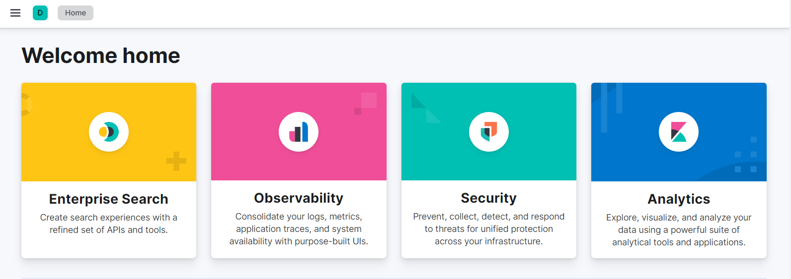
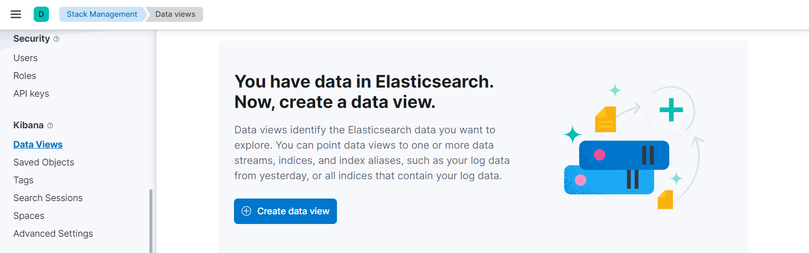
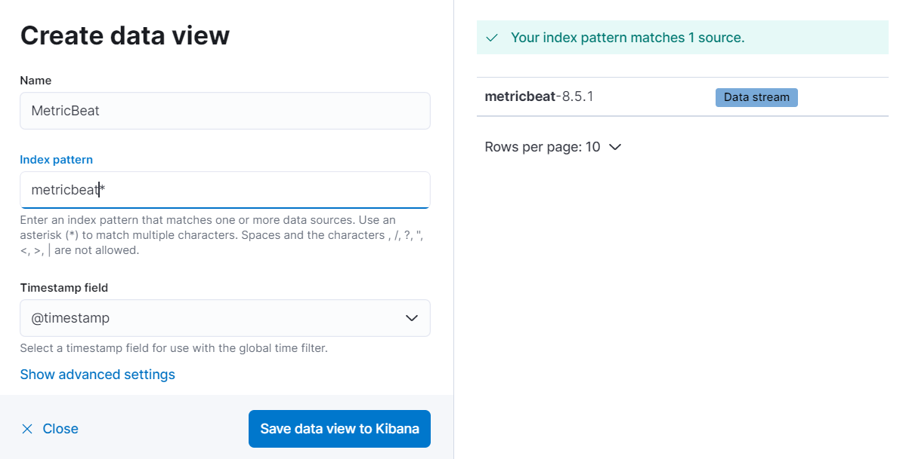
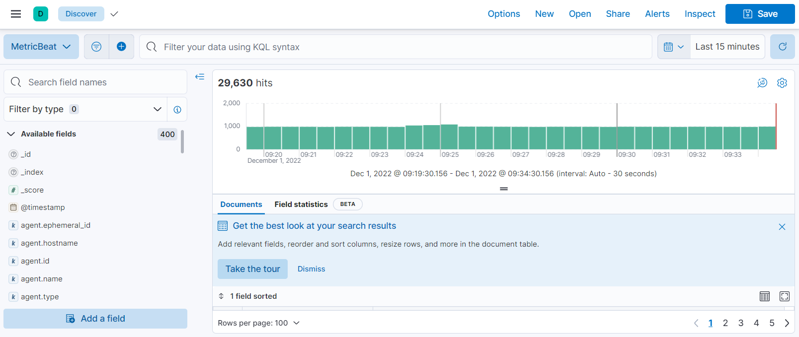
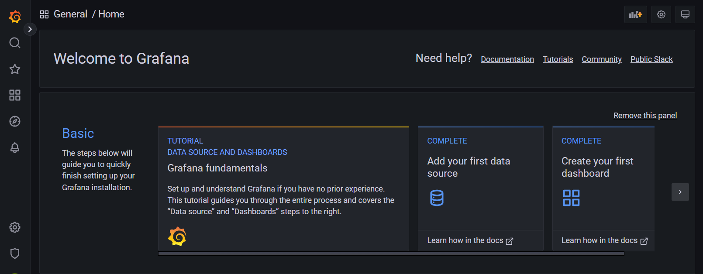
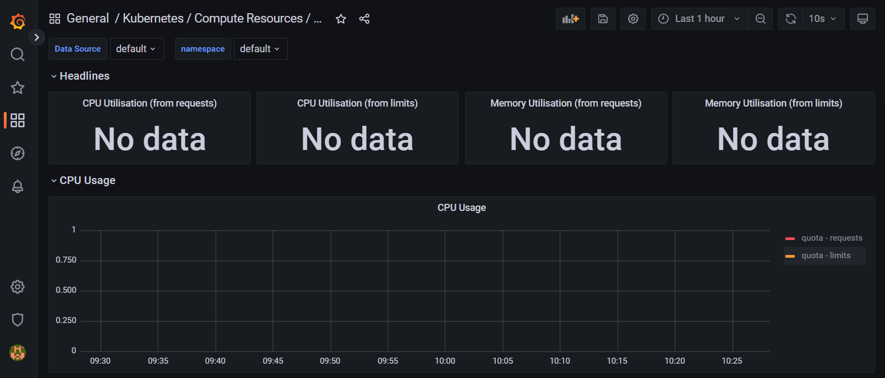
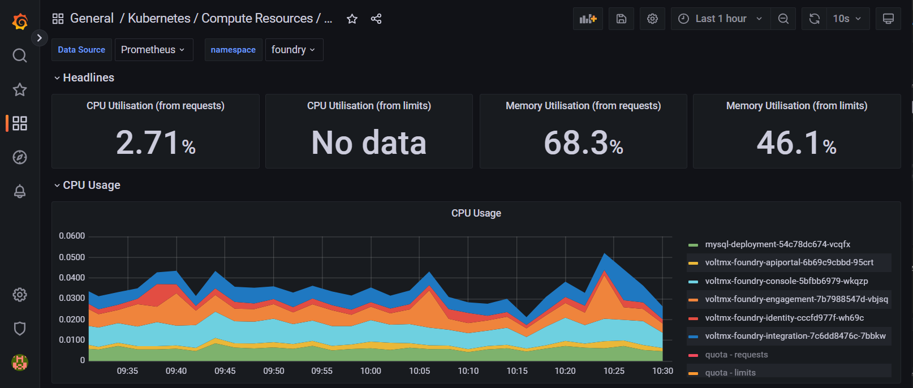

Post Installation Tasks
=======================

*   [Configuring Kibana Dashboard](#configuring-kibana-dashboard): Kibana is another application in elastic stack, commonly know as the charting tool, which provides search and data visualization capabilities for data indexed in ElasticSearch. ElasticSearch is primarily used for search and log analysis. Kibana also acts as user interface for monitoring, managing, and securing an Elastic Stack cluster.
*   [Configuring Grafana Monitoring Tool](#configuring-grafana-monitoring-tool): To know the resource consumption of each pod in a cluster Prometheus and Grafana are used. Prometheus is a metrics collection tool that collects CPU, memory, and network usage of all pods across a cluster. Grafana is a visualization tool which takes data from Prometheus and displays the metrics in a visual format.
*   [Configuring Alert Manager](#configuring-alert-manager): When a predefined condition is met or exceeded, for example, when the predefined limit of CPU usage is crossed, email alerts can be sent to the administrator using the Prometheus Alert Manager. The Prometheus alert manager can be configured as part of Prometheus to send email alerts to the administrator for certain critical events like High CPU usage, High Node Memory Usage, etc.
*   [How to access the Kubernetes Dashboard](#how-to-access-the-kubernetes-dashboard): You can use the Kubernetes Dashboard to get an overview of the applications running on your cluster, as well as for creating or modifying individual Kubernetes resources.
*   [How to Upgrade Individual Foundry Components](#how-to-upgrade-individual-foundry-components): If you want to upgrade individual foundry components, follow the steps mentioned in this section.
*   [How to Upgrade All Foundry Components](#how-to-upgrade-all-foundry-components): If you want to upgrade all foundry components, follow the steps mentioned in this section.

Configuring Kibana Dashboard
----------------------------

Access Kibana by using the host you provided as part of the Helm install. You will be prompted to login to elasticsearch. Use the username 'elastic' and obtain the password using the command you were shown as part of the helm install of Kibana such as the following:

```
2. Retrieve the elastic user's password.
  $ kubectl get secrets --namespace=elastic elasticsearch-master-credentials -ojsonpath='{.data.password}' | base64 -d
```



Once the Kibana dashboard is available, a data view must be created. Perform the following steps to create the data view.

1.  Navigate to **Create data view** by opening the main menu, then click **Management** Stack Management > **Kibana** Data Views
2. Click **Create data view**.

    

2.  Under Create data view, add a Name such as **MetricBeat**, Index pattern such as **metricbeat\***,
select **@timestamp** under the Timestamp field, and click **Save data view to Kibana**..

    

6.  Navigate to **Discover** by opening the main menu, then click **Analytics** Discover, and select the data view you created in the previous step to view the logs.

    


Configuring Grafana Monitoring Tool
-----------------------------------

Grafana is installed as part of the helm install for kube-prometheus-stack. Access the Grafana dashboard using the host you provided as part of the Helm install, and use the 'admin' username and password to login. Once you have logged in you can access Foundry metrics via a few simple steps:



1.  Click the Search icon to Search dashboards and select *Kubernetes / Compute Resources / Namespace (pods)* from the General list and you will see the following dashboard:

    

2.  Select Prometheus from the *Data Source* drop down list and select your Foundry namespace from the *namespace* dropdown list.

    

3.  The Foundry Metrics should be visible once you have made these selections. If you choose, you can save this dashboard to a JSON file for reference later.


Configuring Alert Manager
-------------------------

The Prometheus Alert Manager is installed as part of the Helm install for kube-prometheus-stack. The Prometheus Alert Manager configuration is an optional configuration that can be done if the administrator wishes to receive email alerts on critical events. It can be configured as part of Prometheus to send email alerts to the administrator when certain predefined conditions are met or exceeded.


How to access the Kubernetes Dashboard
--------------------------------------

Use the following instructions if you would like to deploy and access the
[Kubernetes Dashboard](https://github.com/kubernetes/dashboard#kubernetes-dashboard).


How to Upgrade Individual Foundry Components
--------------------------------------------

**Note:** If you are upgrading a version of Volt MX Foundry that you had installed with Volt MX Foundry Container Cluster Solution scripts and templates, ensure you follow the steps to run *init-guids.sh* as part of an upgrade so your current properties are preserved.

To upgrade individual Volt MX Foundry components, perform the following steps.

1.  Download the target upgrade version of the Helm charts from [HCL Flexnet software portal](https://hclsoftware.flexnetoperations.com/flexnet/operationsportal/entitledDownloadFile.action?downloadPkgId=HCL_Volt_Foundry_v9.5.n&orgId=HCL), open a command prompt, and unzip the contents as shown in the following example. From the root of the unzipped content you will see `values.yaml` along with Charts in the subdirectories named `apps` and `dbupdate`.

    <pre><code>
    $ mkdir ~/Foundry-9.5.n.0_GA
    $ cd ~/Foundry-9.5.n.0_GA
    $ unzip ~/Downloads/HelmChart-9.5.n.0_GA.zip
    </code></pre>

2.  Compare the `values.yaml` from your current install with the target upgrade version, copy the custom settings from your current install into the target upgrade version of the `values.yaml` file, and save the updates.

3.  Keep the target upgrade version of the `values.yaml` file open, update the version value of **imageTagOverride** to the desired version for the component(s) that you want to upgrade, and save the updates. **Note:** imageTagOverride is provided in the following component sections:
    * apiportal
    * console
    * engagement
    * identity
    * integration

4.  Before you upgrade the applications, you must upgrade the database. The one exception is the apiportal - there is no database component for portal. Only one version is handled by database update at a time. If upgrading multiple components to different versions, you must do the following steps for each target version:

    A.  In values.yaml, locate the "advancedMode" under dbupdate. Toggle the "enabled" parameter to true. Update the "versionTag" to your target version. Just below the "versionTag" locate the updateXXXXSchema parameters.   For each component that is being updated to this new version, change the Update Schema tag to true. For example, if updating only the Console component, set `updateConsoleSchema: true`. After making the necessary changes here, save the file.

    B.  Trigger the database update to run in order to update the specified component databases. Do this with the command `helm upgrade dbupdate dbupdate -f values.yaml -n foundry` from within the root of your Foundry helm directory (where you have `values.yaml` and the subdirectories `apps` and `dbupdate`).

    C.  Ensure the database update completes successfully. Locate the database update pod with the command `kubectl get pods -l job-name=foundry-db-update -n foundry` and then review the database update log output with `kubectl logs -n foundry <pod-name> | less` where < pod-name > is the name you identified for the database update pod.

    D.  If there are errors, correct the error and rerun the `helm upgrade` command and validation (steps B-D).

    E.  If there are additional Foundry components you are upgrading repeat Steps A-E but first change all updateXXXSchema parameters to `false`.

5.  Once you have run database update for all necessary Foundry components being updated, run the following command to install the new version(s) of the application components:

    <pre><code>
    helm upgrade foundry apps -f values.yaml -n foundry
    </code></pre>

    This should terminate any applications that are being upgraded and download and deploy your specified new versions. Observe the pod status for each of the applications via `kubectl get pods -w -n foundry`, and review pod logs to ensure they are healthy via `kubectl logs podName`.

How to Upgrade All Foundry Components
-------------------------------------

**Note:** If you are upgrading a version of Volt MX Foundry that you had installed with Volt MX Foundry Container Cluster Solution scripts and templates, ensure you follow the steps to run *init-guids.sh* as part of an upgrade so your current properties are preserved.

To upgrade all Volt MX Foundry components, perform the following steps.

1.  Use Steps 1 and 2 from [How to Upgrade Individual Foundry Components](#how-to-upgrade-individual-foundry-components).

2.  Keep the target upgrade version of the `values.yaml` file open, confirm that the version value of **foundryBuildVer** is the desired version for the upgrade, and save the updates.

3.  Before you upgrade the applications, you must upgrade the database. The one exception is the apiportal - there is no database component for portal.

    A.  Trigger the database update to run in order to update all of the component databases. Do this with the command `helm upgrade dbupdate dbupdate -f values.yaml -n foundry` from within the root of your Foundry helm directory (where you have `values.yaml` and the subdirectories `apps` and `dbupdate`).

    B.  Ensure the database update completes successfully. Locate the database update pod with the command `kubectl get pods -l job-name=foundry-db-update -n foundry` and then review the database update log output with `kubectl logs -n foundry <pod-name> | less` where < pod-name > is the name you identified for the database update pod.

    C.  If there are errors, correct the error and rerun the `helm upgrade` command and validation (steps A-C).

4.  Once you have run database update for all necessary Foundry components being updated, run the following command to install the new version(s) of the application components:

    <pre><code>
    helm upgrade foundry apps -f values.yaml -n foundry
    </code></pre>

    This should terminate any applications that are being upgraded and download and deploy your specified new versions. Observe the pod status for each of the applications via `kubectl get pods -w -n foundry`, and review pod logs to ensure they are healthy via `kubectl logs podName`.
