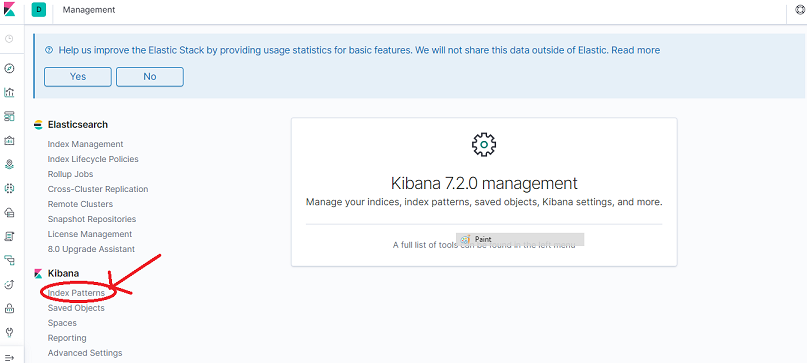
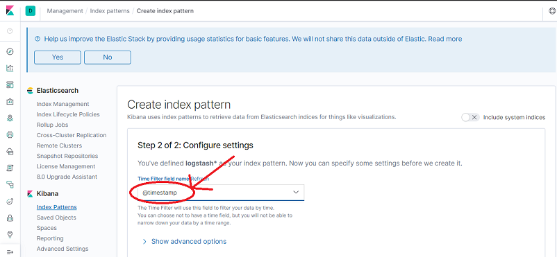

                           

You are here: Configuring Kibana

Post Installation Tasks
=======================

*   [Configuring Kibana Dashboard](#configuring-kibana-dashboard): ElasticSearch, Fluentd, and Kibana (EFK) are used as a log collection mechanism in this framework. The EFK stack is designed to allow users to take to data from any source, in any format, and to search, analyze, and visualize that data in real time. ElasticSearch stores the logs, Fluentd collects the logs from all pods, and Kibana displays the logs in a visual format.
*   [Configuring Grafana Monitoring Tool](#configuring-grafana-monitoring-tool): To know the resource consumption of each pod in a cluster Prometheus and Grafana are used. Prometheus is a metrics collection tool that collects CPU, memory, and network usage of all pods across a cluster. Grafana is a visualization tool which takes data from Prometheus and displays the metrics in a visual format.
*   [Configuring Alert Manager](#configuring-alert-manager): When a predefined condition is met or exceeded, for example, when the predefined limit of CPU usage is crossed, email alerts can be sent to the administrator using the Prometheus Alert Manager. The Prometheus alert manager can be configured as part of Prometheus to send email alerts to the administrator for certain critical events like High CPU usage, High Node Memory Usage, etc.
*   [How to access the Kubernetes Dashboard](#how-to-access-the-kubernetes-dashboard): You can use the Kubernetes Dashboard to get an overview of the applications running on your cluster, as well as for creating or modifying individual Kubernetes resources.
*   [How to Upgrade Individual Foundry Components](#how-to-upgrade-individual-foundry-components): If you want to upgrade individual foundry components, follow the steps mentioned in this section.

Configuring Kibana Dashboard
----------------------------

Navigate to Management by clicking on the Management icon located at the bottom-left corner of the Dashboard

After the installation is complete, the Kibana service is available on node port 30300. The Kibana dashboard can be accessed with any one of the master IPs.

URL to access Kibana: http://<MASTER\_NODE\_IP>:30300.


Once the Kibana dashboard is available, the index-pattern must be configured. Perform the following steps to configure the index-pattern.

1.  Navigate to **Management** by clicking on the Management icon located at the bottom-left corner of the Dashboard.
    
    
    
2.  Under Kibana, click **Index Patterns**.
    
    
    
3.  Click **Create index pattern**.
    
    
    
4.  Enter **logstash\*** in the **Index pattern** text box and then click **Next step**.
    
    
    
5.  In **Time Filter** select **@timestamp** and then click **Create index pattern**.
    
    
    
6.  Click the **Discover** icon to view the logs. You can apply filters to view component specific logs.
    
    
    

Configuring Grafana Monitoring Tool
-----------------------------------

After the installation is complete, the Grafana service is available on node port 30400. The Grafana dashboard can be accessed with any one of the master IPs. Credentials to access the dashboard are:

*   Username: admin
*   Password: admin

URL to access Grafana: http://<MASTER\_NODE\_IP>:30400.

Once Grafana is accessible, the Foundry metrics dashboard must be configured. Perform the following steps to configure the foundry metrics dashboard in Grafana.

1.  Click **Add data source**.
    
    
    
2.  Click **Prometheus**.
    
    
    
3.  In the URL text box enter the URL to access Prometheus http://<MASTER\_NODE\_IP>:30000 and click **Save & Test**.
    
    
    
4.  Click the following dashboard icon and then click **Manage**.
    
    
    
5.  Click **Import**.
6.  Copy the entire JSON text which is present in `templates/Grafana_Dashboard/Dashboard.json` of the Foundry container artifact folder and paste it in the **Or paste JSON** text field and then click **Load**.
7.  Click **Import**.
    
    
    
8.  The **Foundry Metrics** dashboard is displayed.
    
    
    

Configuring Alert Manager
-------------------------

The Prometheus Alert Manager configuration is an optional configuration that can be done if the administrator wishes to receive email alerts on critical events. From Volt MX Foundry V9SP1 onwards, the Prometheus alert manager can be configured as part of Prometheus to send email alerts to the administrator when certain predefined conditions are met or exceeded.

The installation through the **config.properties** file is as follows:


The installation through interactive mode is as follows:


The following alerts are currently supported by Volt MX Foundry:

*   **Container restarted**: This alert indicates that a container named X in a pod Y in the namespace Z was restarted.
*   **High Memory Usage of Container**: This alert indicates that a container named X in a pod Y in the namespace Z is using more than 80% of the memory limit.
*   **High CPU Usage of Container**: This alert indicates that a container named X in a pod Y in the namespace Z is using more than 80% of the CPU Limit.
*   **High Node Memory Usage**: This alert indicates that a node N has used more than 80% of the memory and to alert about planning the capacity.
*   **High Node CPU Usage**: This alert indicates that a node N has used more than 80% of the allocatable CPU and to alert about planning the capacity.
*   **High Node Disk Usage**: This alert indicates that node N has used more than 85% disk space and to alert about planning the capacity.

After the installation is complete, the **Alertmanager** service is exposed to nodePort 30500. The Alertmanager Console can be accessed with any one of the master IPs and will be as follows:

URL to access Alert Manager: http://<MASTER\_NODE\_IP>:30500.


To see the alerts which are in the pending or the firing state, go to the Prometheus console using http://<MASTER\_NODE\_IP>:30000 and go to the **Alerts** tab.


### Updating Alert Manager Configuration

The Alert Manager rules configuration is present in the **prometheus-rules config** map at:

*   `<INSTALL_DIR>/<templates folder pre-install>/**voltmx-foundry-monitoring.yml**`
*   `<WORKING_DIR>/gen/<INSTALL_ENV_NAME>/<post_installation_folder>/**voltmx-foundry-monitoring.yml**`.

Update as required and run the following commands to apply the changes:

```
kubectl apply -f voltmx-foundry-monitoring.yml
```
```
kubectl delete pod prometheus-server-0 prometheus-server-l -n kube-monitoring
```

The SMTP configuration is present under the **email\_configs** section under alertManager configmap in `voltmx-foundry-monitoring.yml` file. Update as required and run the following commands to apply the changes:

```
kubectl apply -f voltmx-foundry-monitoring.yml
```
```
kubectl delete pod <alertmanager-pod- name> -n kube-monitoring
```

How to access the Kubernetes Dashboard
--------------------------------------

By default the Kubernetes dashboard service is exposed on node port 31000. You can access the dashboard with any of the master IPs. You can ignore any security related warnings and proceed further.

URL to access dashboard is https://<ANY\_MASTER\_IP>:31000.

Once the Kubernetes dashboard is launched, it prompts for a token to sign in. To generate the token, run the following command on any master:

```
kubectl -n kubernetes-dashboard describe secret $(kubectl -n kubernetes-dashboard get secret | grep admin-user | awk '{print $1}')
```

Once the token is generated, copy the token and go to the Kubernetes dashboard page. Select the **Token** option, paste the token in the required text box, and click **Sign in**.

How to Upgrade Individual Foundry Components
-------------------------------------------

To upgrade individual Foundry components, perform the following steps.

1.  Go to the Foundry container artifact folder.
2.  Open `install-foundry.sh` file and change the version value of **VOLTMX\_FOUNDRY\_BUILD\_VER** to the required version.
3.  Open `config.properties` file, in the install components section select the components that need to be upgraded. Set value of **USE\_EXISTING\_DB** to **Y**. Provide the previously installed artifacts location in the **PREVIOUS\_INSTALL\_LOCATION** field.
4.  Run the following command to begin the upgrade.
```
sudo ./install-foundry.sh config.properties
```
