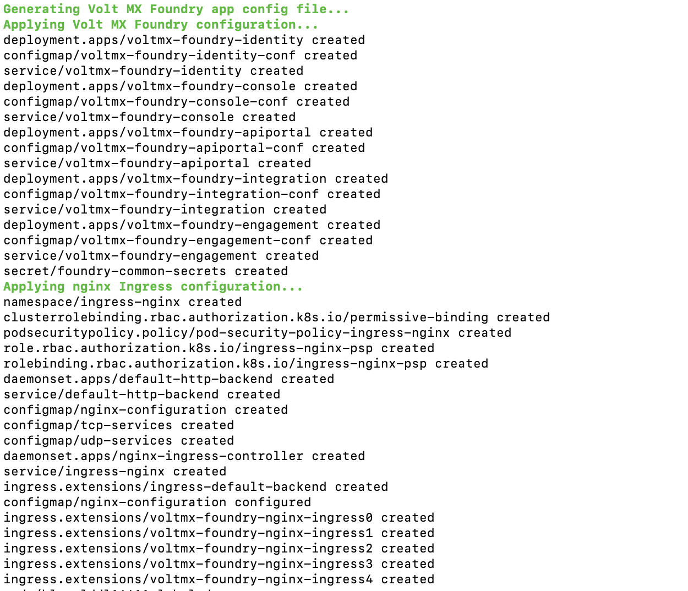

You are here: [Installation](#installation) > Salient Features

# Overview

The Volt MX Foundry Container Cluster Solution provides a flexible and scalable solution for deploying Volt MX Foundry on your on-premises setup, including scaling the installation to multi-node systems and robust logging capabilities.

Volt MX Foundry Container Cluster Solution On-Premises setup occurs with minimal manual intervention and leverages the following technologies:

- **Docker** - To package different components as portable container images (with all the required binaries and libs).
- **Kubernetes** - To orchestrate and maintain all the running containers. It will also have features like auto-scaling, secrets, deployment upgrades, and rollbacks.

You should use this installation if you plan to use docker to setup your on-premise production grade installation of Volt MX Foundry. If you want to setup a developer instance, please refer to the install instructions at [Single container setup (On-Prem)](../../../Foundry/voltmxfoundry_single_container/Content/VoltMX_Foundry_Single_Container_Solution_On-Prem_.md).

## Salient Features

The Volt MX Foundry Container Cluster Solution provides developers with tools to build applications. The Volt MX Foundry Container Cluster Solution has the following features:

1.  Deploys Volt MX Foundry on Kubernetes environment.
2.  Supports deployment in Linux (CentOS version 7.4).

# Prerequisites

## Software Requirements

- Install OpenJDK 11.
- Install Zip and Dig.

### Supported OS Platform

Foundry Kubernetes cluster is supported on CentOS version 7.4.

### Supported Application Servers

Volt MX Foundry Container Cluster Solution supports only the Tomcat Application server. The Tomcat server comes bundled along with the installer.

All the Docker images built for Volt MX Foundry are built using the Tomcat version 9.0.22-jdk11 as the base image.

### Supported Databases

Volt MX Foundry Container Cluster Solution supports the following database servers:

| Database Type        | Version Supported                   |
| -------------------- | ----------------------------------- |
| MySQL                | 5.6, 5.7, 8.0.17                    |
| Microsoft SQL Server | 2016, 2017                          |
| Oracle               | Oracle 12c (12.1.0.1.0), Oracle 18c |

> **_Note:_** You must have an existing external Database. The Database does not come bundled with the Installer.

### Supported Kubernetes Version

Volt MX Foundry Container Cluster Solution supports the following Kubernetes package versions:

| Database Type | Version Supported |
| ------------- | ----------------- |
| Docker        | 18.09.9           |
| kubectl       | 1.15.4            |
| kubelet       | 1.15.4            |
| kubeadm       | 1.15.4            |

### Date and Time

The date and time should be synchronized across all the nodes in a cluster.

## Hardware Requirements

This setup requires a minimum of three machines (1 master node, 1 worker node, and 1 load balancer node) for a development environment and five machines (3 masters, 2 worker nodes, and 1 load balancer node) for a production grade environment.

Following is the hardware requirement for a development environment setup.

| Component        | Requirement                                |
| ---------------- | ------------------------------------------ |
| RAM              | 4 GB for master node, 8 GB for worker node |
| Internal Storage | 100 GB                                     |
| CPU Cores        | Dual or above.                             |

Following is the hardware requirement for a production grade cluster.

| Component        | Requirement    |
| ---------------- | -------------- |
| RAM              | 20 GB          |
| Internal Storage | 100 GB         |
| CPU Cores        | Dual or above. |

## Firewall Settings

You must ensure that the following ports are used to expose the required services when a Firewall is enabled on your system.

### Required Open Ports

The following port ranges must be opened before installing Foundry on all nodes in a cluster.

- 30000-32767/tcp
- 6443-10252/tcp
- 2379-2380/tcp

Run the following commands to open the ports:

```
sudo firewall-cmd --permanent --add-port=30000-32767/tcp --zone=public  
sudo firewall-cmd --permanent --add-port=6443-10252/tcp --zone=public  
sudo firewall-cmd --permanent --add-port=2379-2380/tcp --zone=public
```

The following ports must be opened explicitly when a firewall is enabled on all nodes. These are required by Weave CNI to avoid hostname issues.

- 6783/udp, 6783/tcp
- 6784/udp, 6784/tcp

Run the following commands to open the ports:

```
sudo firewall-cmd --permanent --add-port=6783/udp --zone=public  
sudo firewall-cmd --permanent --add-port=6783/tcp --zone=public  
sudo firewall-cmd --permanent --add-port=6784/udp --zone=public  
sudo firewall-cmd --permanent --add-port=6784/tcp --zone=public
```

The following ports should be opened on the load-balancer node.

- 443/tcp
- 80/tcp

Run the following commands to open the ports:

```
sudo firewall-cmd --permanent --add-port=443/tcp --zone=public  
sudo firewall-cmd --permanent --add-port=80/tcp --zone=public
```

At the end run the following command to load the new firewall settings.

```
sudo firewall-cmd --reload
```

Some of the app services in Foundry cluster use specific node ports to expose the services. Therefore, the ports mentioned below must be free on all nodes before installing the Foundry Kubernetes cluster.

| Ports | Services using the Port                                                                                                                    |
| ----- | ------------------------------------------------------------------------------------------------------------------------------------------ |
| 30000 | Prometheus                                                                                                                                 |
| 31000 | Kubernetes Dashboard. (The default port value can be changed by changing value of KUBERNETES_DASHBOARD_PORT in the config.properties file) |
| 30200 | Internal nginx load balancer                                                                                                               |
| 30300 | Kibana logging tool                                                                                                                        |
| 30400 | Grafana monitoring tool                                                                                                                    |

# Preinstallation Tasks

Following are the preinstallation tasks to be performed on all nodes before starting installation.

1.  All Kubernetes masters and nodes must have the swap disabled. This is the recommended deployment as per the Kubernetes community.
    1.  Run the following command to disable swap.
```
sudo swapoff -a
```<br>
    2.  Run the following command to update fstab so that the swap remains disabled even after a reboot.
```
sudo sed -i '/ swap / s/^\(.\*\)$/#\1/g' /etc/fstab
```<br>
    3.  Restart the node after the swap is disabled.
2.  Download Foundry container artifacts from [VoltMX Downloads](https://community.hclvoltmx.com/downloads).
3.  If the Foundry cluster is being reinstalled, you must execute the following command on all nodes and delete the **.kube** folder present in the root directory from all the master nodes.
```
sudo kubeadm reset
```<br>

# Architecture

Following is the architecture diagram of the Volt MX Foundry Container Cluster Solution.


The complete Volt MX Foundry Container Cluster Solution will have a total of six pods.

Following is the list of pods present in the VoltMX Foundry Container Cluster Solution:

- Console
- API Developer Portal
- Identity
- Integration
- Engagement
- Database (exits on completion of the Database scripts execution)

The following is the list of Docker images used for the pods in the VoltMX Foundry Container Cluster Solution:

- Foundry Console (Contains `mfconsole.war`,   `workspace.war`,  and  `accounts.war`)
- API Developer Portal (Contains `apiportal.war`)
- Identity (Contains `authService.war`)
- Integration (Contains `admin.war`, ` services.war`,  ` middleware.war`, and `apps.war`)
- Engagement (Contains `vpns.war`)
- Database (Contains Database migration scripts)

The docker images will be pulled when you execute the installation scripts in the "HCL Volt MX Foundry Container Installer" found on HCL's FNO download website: [https://hclsoftware.flexnetoperations.com/flexnet/operationsportal/entitledDownloadFile.action?downloadPkgId=HCL_Volt_Foundry_v9.2.x&orgId=HCL](https://hclsoftware.flexnetoperations.com/flexnet/operationsportal/entitledDownloadFile.action?downloadPkgId=HCL_Volt_Foundry_v9.2.x&orgId=HCL)

Volt MX Foundry Container Cluster Solution downloadable bundle contains the following directories and files:

- **install-foundry.sh** - Installation script
- **install-actions.sh** - Installation actions script which is internally used by install-foundry.sh.
- **templates** - Directory containing the config template files
- **add-ons directory**\- Directory containing additional deployments and configurations for the Kubernetes cluster.
- **config.properties** - Properties file to pass the inputs to install-foundry.sh instead of giving inputs in shell prompts.
- **lib** \- Folder containing the foundry-utils.jar file.
- **resources** - Folder containing a few resources required for the Kubernetes CNI.
- **setup-loadbalancer.sh** - Needs to be executed on a different machine to support the load balancer.

## Installation Types

Inputs for installation can be gathered through two modes. Any of the following modes can be chosen for installation.

- **Command Line** - Volt MX Foundry Container Cluster Solution can be installed using the bundled install shell script, which will prompt the user for required values.

  The syntax for installing through the Command Line:

  ```
sudo ./install-foundry.sh
  ```<br>

- **Silent Installation** - The installation script also supports silent installation if the config.properties file is passed as an argument (for example, /path/install-foundry.sh config.properties). Using this, you can have additional ability to pass custom Tomcat JAVA_OPTS, Heap memory settings, and time-zone settings as well.

  The syntax for installing using the config.properties:

  ```
sudo ./install-foundry.sh config.properties
  ```

# Configuration

The following parameters are to be provided by the user during Installation:

1.  **INSTALL_ENV_NAME** - The install environment name can be anything in lowercase (String). The possible values are: `dev`, `qa`, `prod`, or `eastusprod`.

    > **_Note:_** The Install Environment Name must not contain numbers.

2.  **Install Components**: The following properties must be set to either Y (yes) or N (no). If ALL_COMPONENTS_ENABLED is set to Y, the rest of the inputs can be left empty. If ALL_COMPONENTS_ENABLED is set to N then at least one of the following input properties must be set to Y.

    - ALL_COMPONENTS_ENABLED
    - INTEGRATION_ENABLED
    - IDENTITY_ENABLED
    - MESSAGING_ENABLED
    - CONSOLE_ENABLED
    - APIPORTAL_ENABLED

3.  **Application Server Details**

    - **SERVER_DOMAIN_NAME**: The **Domain Name** for Volt MX Foundry. This value should be the hostname of the LoadBalancer. For example: abc.companyname (DNS name).

      > **_Note:_** Domain name cannot be an IP address or 'localhost'.

    - **COM_PROTOCOL**: The communication protocol for Volt MX Foundry. This value can be either http or https.
    - **HTTPS_CERT_FILE**: The path to the existing certificate and key files. This value can be empty if the communication protocol is HTTP. The path should point to a valid pem file.
    - **HTTPS_KEY_FILE**: The path to the existing certificate and key files. This value can be empty if the communication protocol is HTTP. The path should point to a valid pem file.

4.  **Database Details**:

    - **DB_TYPE** - This is the Database type you want to use for hosting Volt MX Foundry. The possible values are:
      - For MySQL DB server: `mysql`
      - For Azure MSSQL or SQL Server: `sqlserver`
      - For Oracle DB server: `oracle`
    - **DB_HOST** - This is the Database Server hostname used to connect to the Database Server.

    > **_Note:_** If the Database Hostname is an IP address, it should be a static IP address.

    - **DB_PORT**– This is the Port Number used to connect to the Database Server. This can be empty for cloud manage service.
    - **DB_USER** - This is the Database Username used to connect to the Database Server.
    - **DB_PASS** - This is the Database Password used to connect to the Database Server.
    - **DB_PREFIX** – This is the Database server prefix for Volt MX Foundry Schemas/Databases.
    - **DB_SUFFIX** – This is the Database server suffix for Volt MX Foundry Schemas/Databases.

    > **Note:**

    - Database Prefix and Suffix are optional inputs.
    - In case of upgrade, ensure that the values of the Database Prefix and Suffix that you provide are the same as you had provided during the initial installation.
    - If **DB_TYPE** is set as **oracle**, the following String values need to be provided:
      - **DB_DATA_TS**: Database Data tablespace name.
      - **DB_INDEX_TS**: Database Index tablespace name.
      - **DB_LOB_TS**: Database LOB tablespace name.
      - **DB_SERVICE**: Database service name.
    - **USE_EXISTING_DB**: If you want to use an existing databases from a previous Volt MX Foundry instance set this variable to Y. If not the set the USE_EXISTING_DB variable to N.

      You must provide the location of the previously installed artifacts (the location should contain upgrade.properties file).

      For example: **PREVIOUS_INSTALL_LOCATION** = `/C/voltmx-foundry-containers-onprem/kubernetes`.

5.  **VoltMX Foundry Account Registration Details**: The following properties are required for owner registration. It is not required for an upgrade. If OWNER_REGISTRATION_REQUIRED is set to **Y** (yes), then you must provide all the following inputs:
    - **OWNER_REGISTRATION_REQUIRED** - Y/N.
    - **OWNER_USER_ID** – E-mail ID used for Volt MX Foundry Registration.
    - **OWNER_PASSWORD** – Password used for Volt MX Foundry Registration.
    - **OWNER_FIRST_NAME** – First Name used for Volt MX Foundry Registration.
    - **OWNER_LAST_NAME** – Last Name used for Volt MX Foundry Registration.
    - **OWNER_ENV_NAME** – Environment name to which the generated applications should be published.
6.  **TIME_ZONE** - The Time Zone of the Database used for Volt MX Foundry installation. The Time Zone variable must be set to maintain consistency between the Application server and the Database server. For determining what value to set for the time zone you can refer to [List of tz database time zones](https://en.wikipedia.org/wiki/List_of_tz_database_time_zones) on Wikipedia.

    > **_Note:_** The Time Zone is an optional value. If you do not provide any Time Zone, it is set to Etc/UTC.

7.  **Readiness and Liveness Probes Details**: Following variables are set with default values in seconds. You can modify them in the config.properties file.
    - IDENTITY_READINESS_INIT_DELAY: The readiness probe initial delay for Identity, in seconds. The default value is 180.
    - IDENTITY_LIVENESS_INIT_DELAY: The liveness probe initial delay for Identity, in seconds. The default value is 300.
    - CONSOLE_READINESS_INIT_DELAY: The readiness probe initial delay for Console, in seconds. The default value is 300.
    - CONSOLE_LIVENESS_INIT_DELAY: Liveness probe initial delay for Console, in seconds. The default value is 600.
    - INTEGRATION_READINESS_INIT_DELAY: The readiness probe initial delay for Integration, in seconds. The default value is 300.
    - INTEGRATION_LIVENESS_INIT_DELAY: Liveness probe initial delay for Integration, in seconds. The default value is 600.
    - ENGAGEMENT_READINESS_INIT_DELAY: The readiness probe initial delay for Engagement, in seconds. The default value is 180.
    - ENGAGEMENT_LIVENESS_INIT_DELAY: The liveness probe initial delay for Engagement, in seconds. The default value is 300.
8.  **Minimum and Maximum RAM percentage Details**: The following variables are set with default String values. You can modify them in the config.properties file.
    - CONSOLE_MIN_RAM_PERCENTAGE: Minimum RAM percentage for Console. The default value is "50".
    - CONSOLE_MAX_RAM_PERCENTAGE: Maximum RAM percentage for Console. The default value is "80".
    - ENGAGEMENT_MIN_RAM_PERCENTAGE: Minimum RAM percentage for Engagement. The default value is "50".
    - ENGAGEMENT_MAX_RAM_PERCENTAGE: Maximum RAM percentage for Engagement. The default value is "80".
    - IDENTITY_MIN_RAM_PERCENTAGE: Minimum RAM percentage for Identity. The default value is "50".
    - IDENTITY_MAX_RAM_PERCENTAGE: Maximum RAM percentage for Identity. The default value is "80".
    - INTEGRATION_MIN_RAM_PERCENTAGE: Minimum RAM percentage for Integration. The default value is "50".
    - INTEGRATION_MAX_RAM_PERCENTAGE: Maximum RAM percentage for Integration. The default value is "80".
    - APIPORTAL_MIN_RAM_PERCENTAGE: Minimum RAM percentage for API Portal. The default value is "50".
    - APIPORTAL_MAX_RAM_PERCENTAGE: Maximum RAM percentage for API Portal. The default value is "80".
9.  **Container resource limits for memory and CPU**: The following variables are set with default String values. You can modify them in the config.properties file.
    - IDENTITY_RESOURCE_MEMORY_LIMIT: The resource memory limit for Identity. The default value is "1.2G".
    - IDENTITY_RESOURCE_REQUESTS_MEMORY: The resource memory requests for Identity. The default value is "1G".
    - IDENTITY_RESOURCE_REQUESTS_CPU: The resource CPU requests for Identity. The default value is "200m".
    - CONSOLE_RESOURCE_MEMORY_LIMIT: The resource memory limit for Console. The default value is "2.2G".
    - CONSOLE_RESOURCE_REQUESTS_MEMORY: The resource memory requests for Console. The default value is "2G".
    - CONSOLE_RESOURCE_REQUESTS_CPU: The resource CPU requests for Console. The default value is "300m".
    - APIPORTAL_RESOURCE_MEMORY_LIMIT: The resource memory limit for API Portal. The default value is "1.2G",
    - APIPORTAL_RESOURCE_REQUESTS_MEMORY: The resource memory requests for API Portal. The default value is "1G".
    - APIPORTAL_RESOURCE_REQUESTS_CPU: The resource CPU requests for API Portal. The default value is "200m",
    - INTEGRATION_RESOURCE_MEMORY_LIMIT: The resource memory limit for Integration. The default value is "2.2G".
    - INTEGRATION_RESOURCE_REQUESTS_MEMORY: The resource memory requests for Integration. The default value is "2G".
    - INTEGRATION_RESOURCE_REQUESTS_CPU: The resource CPU requests for Integration. The default value is "300m".
    - ENGAGEMENT_RESOURCE_MEMORY_LIMIT: The resource memory limit for Engagement. The default value is "1.2G".
    - ENGAGEMENT_RESOURCE_REQUESTS_MEMORY: The resource memory requests for Engagement. The default value is "1G".
    - ENGAGEMENT_RESOURCE_REQUESTS_CPU: The resource CPU requests for Engagement. The default value is "200m".
10. **Custom JAVA_OPTS Details**: The following variables can be set with default String values. You can modify them in the config.properties file.
    - CONSOLE_CUSTOM_JAVA_OPTS: The custom JAVA_OPTS for Console.
    - ENGAGEMENT_CUSTOM_JAVA_OPTS: The custom JAVA_OPTS for Engagement
    - IDENTITY_CUSTOM_JAVA_OPTS: The custom JAVA_OPTS for Identity.
    - INTEGRATION_CUSTOM_JAVA_OPTS: The custom JAVA_OPTS for Integration.
    - APIPORTAL_CUSTOM_JAVA_OPTS: The custom JAVA_OPTS for API Portal.
11. **Number of instances to be deployed for each component**: The following variables can be set with default integer values. You can modify them in the config.properties file.
    - IDENTITY_REPLICAS: The number of instances of Identity. The default value is 1.
    - CONSOLE_REPLICAS: The number of instances of Console. The default value is 1.
    - APIPORTAL_REPLICAS: The number of instances of API Portal. The default value is 1.
    - INTEGRATION_REPLICAS: The number of instances of Integration. The default value is 1.
    - ENGAGEMENT_REPLICAS: The number of instances of Engagement. The default value is 1.
12. The port on which the **Kubernetes Dashboard** can be accessed:

    - KUBERNETES_DASHBOARD_PORT: The default value is 31000.

# Installation

Run the Volt MX Foundry Container Cluster install script to generate and deploy Volt MX Foundry containers.

**Steps to Install Volt MX Foundry Container Cluster Solution on an On-Premises setup:**

1.  [Setting up HAProxy LoadBalancer](#setting-up-haproxy-loadbalancer)

    > **_Note:_** This step is optional if you have your own load balancer setup. You must provide the pre-configured load balancer hostname as the SERVER_DOMAIN_NAME input in the installation process instead of performing the following instructions.

2.  [Setting up Cluster](#setting-up-cluster)
3.  [Resuming installation in Master Node](#resuming-installation-in-master-node)

## Setting up HAProxy LoadBalancer

Before starting the cluster installation, a loadbalancer must be set up. Without the loadbalancer the cluster setup cannot be started. The HAProxy is a certified external loadbalancer for the Foundry container cluster setup. Installation and configuration of HAProxy is taken care of by the script. Initially, the installation script configures the loadbalancer with one master. Going forward you can edit the `haproxy.cfg` file to add other masters to the loadbalancer.

Perform the following steps to setup the HAProxy loadbalancer through a script file.

1.  Download the **VoltMXFoundryContainersOnPrem-9.0.0.0_GA.zip** from the [Download Link](https://hclsoftware.flexnetoperations.com/flexnet/operationsportal/entitledDownloadFile.action?downloadPkgId=HCL_Volt_Foundry_v9.2.x&orgId=HCL&fromRecentFile=false&fromRecentPkg=true&fromDL=false) and extract it.
```
sudo unzip VoltMXFoundryContainersOnPrem-9.0.0.0_GA.zip
    -d VoltMXFoundryContainerOnPrem-9.0.0.0_GA
```
2.  Navigate to foundry container artifact folder.
```
cd VoltMXFoundryContainerOnPrem-9.0.0.0_GA
```
3.  Run `setup-loadbalancer.sh`. It prompts for master node hostname and communication protocol. The loadbalancer is then installed and configured.
```
sudo ./setup-loadbalancer.sh
```
4.  Check if haproxy gets successfully started by executing the `systemctl status haproxy` command. If it throws the "_cannot bind socket [0.0.0.0:xxxx|https://stackoverflow.com/questions/34793885/haproxy-cannot-bind-socket-0-0-0-08888]_" error. Run the following command and restart haproxy.
```
setsebool -P haproxy_connect_any=1
```

Before setting up master nodes, all the IPs of master nodes should be configured in HAProxy loadbalancer. If any master node IP is not listed and you try to set the master node, that node will not be added to cluster. To add master node IPs, edit the file `/etc/haproxy/haproxy.cfg` and make the following two changes for each master node IP to be added.

1.  In the **Configure HAProxy SecureBackend** section, add the following line at the end. List all the other master node IPs in the same way.
```
server k8s-api-2 <IP-ADDRESS>:6443 check
```
2.  In the **Configure HAProxy Foundry Backend** section, add the following line at the end. List all the other master node IPs in the same way.
```
server foundry-1 <IP-ADDRESS>:30200 check
```

## Setting up Cluster

In setting up a cluster a minimum of one master can be configured. To improve failure tolerance and ensure cluster availability it is recommended to have an odd number (minimum three) of master nodes. To start cluster setup choose one node as starting point of installation which should be the master node.

1.  Download the **voltmx-foundry-containers-onprem_9.0.0.0_GA.zip** from the [Download Link](https://hclsoftware.flexnetoperations.com/flexnet/operationsportal/entitledDownloadFile.action?downloadPkgId=HCL_Volt_Foundry_v9.2.x&orgId=HCL&fromRecentFile=false&fromRecentPkg=true&fromDL=false) and extract it.
```
sudo unzip VoltMXFoundryContainersOnPrem-9.0.0.0_GA.zip
    -d VoltMXFoundryContainerOnPrem-9.0.0.0_GA
```
2.  Navigate to foundry container artifact folder.
```
cd VoltMXFoundryContainerOnPrem-9.0.0.0_GA
```
3.  Run the following command to setup the master. It downloads and installs cluster packages, initializes kubeadm, sets up Weave CNI, generates token and waits for the worker node to join the master to proceed further.
```
sudo ./install-foundry.sh config.properties
```

> **_Note:_** You must provide **execute** permissions to run the `install-foundry.sh` file on Linux.


6.  To join other nodes as master/worker, copy the setup-node.zip file which is available in the Foundry Container artifact folder(VoltMXFoundryContainerOnPrem-9.0.0.0_GA) into the node to join as the master/worker and then perform the following steps.

    1.  Extract the `setup-nodes.zip` file.

        `sudo unzip setup-node.zip -d setup-node`

    2.  Navigate to the `setup-nodes` folder.

        `cd setup-node`

    3.  Execute the following command.

        For Master:

        `sudo ./setup-node.sh control-plane`

        For Worker:

        `sudo ./setup-node.sh`

7.  After the cluster setup is done to get the list of nodes in cluster, use below command.

    `kubectl get nodes`

    

## Resuming Installation In Master Node

After joining masters and worker nodes, you must press enter in the master node terminal to resume the installation.

1.  Kubernetes Dashboard and DB Migrations

    

2.  Foundry and Ingress configuration

    

3.  EFK , Prometheus, and Grafana Monitoring tool configuration.

    

4.  Foundry healthcheck

    

5.  Run the following command to check status of pods.

    `sudo kubectl get pods`

    

## Known Issues and Limitations

Volt MX Foundry Container Cluster Solution has the following known issues and limitations:

- Support for **SPA / Desktop Web** is only available for zipped SPA apps, not for WARs.
