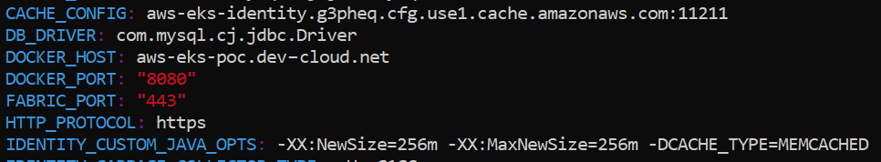
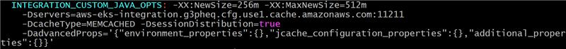

# Additional Considerations

## <a name="Foundry_Reporting"></a>Configure Foundry Reporting and Analytics

[JasperReports Server Professional Edition](https://www.jaspersoft.com/) is a prerequisite to configuring Reporting and Analytics on Foundry. After you successfully set up the JasperReports Server, refer to the [Volt MX Analytics and Reporting Installation Guide](https://opensource.hcltechsw.com/volt-mx-docs/docs/documentation/Foundry/voltmx_analytics_reporting/Content/homepage.md).

## <a name="Logging"></a>Logging Considerations

All the Foundry component pods generate logs, which are routed to the standard output (STDOUT). You can use the **Fluent Bit** plugin to capture these logs and route them to Amazon CloudWatch for log analysis.

To configure logging for pods that are deployed in **Managed EC2**, refer to the following blog post: [Analyze Kubernetes container logs using Amazon S3 and Amazon Athena](https://aws.amazon.com/blogs/containers/analyze-kubernetes-container-logs-using-amazon-s3-and-amazon-athena/). To configure logging for pods deployed in the **Fargate profile**, refer to the following blog post: [Fluent Bit for Amazon EKS on AWS Fargate is here](https://aws.amazon.com/blogs/containers/fluent-bit-for-amazon-eks-on-aws-fargate-is-here/).

In case you want to set up a mixed data plane, you need to use a combination of both approaches. For more information about the configurations that can be used, refer to the `samples/Logging` folder in the `FoundryKube.zip` file that you downloaded.

## <a name="Monitoring"></a>Monitoring Considerations

You can use CloudWatch Container Insights to manage metrics and logs from your container applications and microservices. Container Insights is available for Amazon Elastic Container Service (Amazon ECS), Amazon Elastic Kubernetes Service (Amazon EKS), and Kubernetes platforms on Amazon EC2.

CloudWatch collects metrics for resources such as CPU, memory, disk, and network. Container Insights also provides diagnostics such as container restart failures, which can help you isolate issues and resolve them quickly. You can also set alarms on the metrics that are collected by Container Insights. For more information, refer to following documents.

*   [Container Insights Prerequisites](https://docs.aws.amazon.com/AmazonCloudWatch/latest/monitoring/Container-Insights-prerequisites.md)
*   [Set Up the CloudWatch Agent to Collect Cluster Metrics](https://docs.aws.amazon.com/AmazonCloudWatch/latest/monitoring/Container-Insights-setup-metrics.md)

## <a name="Caching"></a>Caching Considerations

Amazon provides the [ElastiCache](https://aws.amazon.com/elasticache/) service if your application needs a caching service. For production grade deployments, Volt MX recommends that you use caching to reduce load on your Foundry run-time services such as Integration and Identity. For information about setting up ElastiCache, refer to the [ElastiCache for Memcached User Guide](https://docs.aws.amazon.com/AmazonElastiCache/latest/mem-ug/WhatIs.md).

After you complete the setup, edit the Identity and Integration configmaps as described in the following sections to complete the configuration.

### Identity

1.  Add the following key-value pair:  
    `CACHE_CONFIG: <Identity Memcached cluster hostname:port>`
2.  Append the following **-D** parameter to the `IDENTITY_CUSTOM_JAVA_OPTS` value:  
    `–DCACHE_TYPE=MEMCACHED`



### Integration

Append the following **–D** parameters to the `INTEGRATION_CUSTOM_JAVA_OPTS` value:

*   `-Dservers=<Integration Memached cluster hostname:port>`
*   `-DcacheType=MEMCACHED`
*   `-DsessionDistribution=true`
*   `-DadvancedProps='{"environment_properties":{},"jcache_configuration_properties":{},"additional_properties":{}}'`




## Encrypt the Database Password

> **Important:** Encryption is only supported for Tomcat application servers.

Volt MX Foundry provides a 256-bit AES/GCM/NoPadding encryption utility, which can be used to encrypt your database password. To encrypt your database password, follow these steps:

1.  After you download and extract the installation zip file, navigate to the `lib` folder.
2.  From the `lib` folder, open a terminal (console), and then execute the following command:

    ```
    java -jar EncryptionUtility.jar</code></pre>
    ```

3.  In the **Enter Password to be Encrypted** field, type the password that is used to access your database.
4.  In the **Enter Key to be Encrypted** field, type the key that must be used to encrypt the password.

The console then displays the **Encrypted Password** and **Encrypted Key**. These values must be added to the `DB_PASS` and `DB_PASS_SECRET_KEY` parameters in the `config.properties` file. For more information, refer to [Database Details](configuration_and_setup.html#Database).

