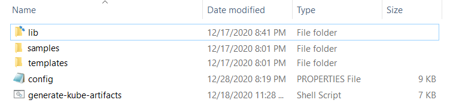
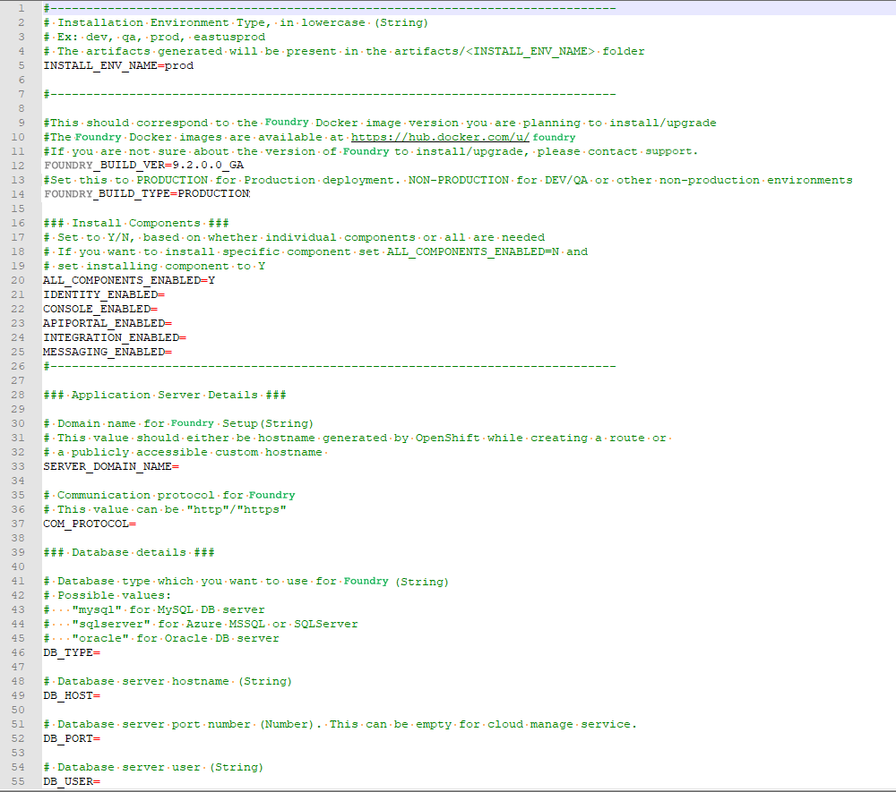

# Configuration and Setup for Foundry on Amazon EKS

## Configure the properties file

1.  Extract the `FoundryKube.zip` file. The zip file is organized as follows:  
    
    *   **lib**: Contains dependent jars and helper bash functions
    *   **samples**: Contains sample Foundry deployments
    *   **templates**: Contains the following files
        *   **foundry-app-tmpl.yml**: YAML template for Foundry deployments
        *   **foundry-db-tmpl.yml**: YAML template for Foundry Database schema creation
        *   **foundry-services.yml**: YAML template for Foundry services
        *   **foundry-ingress.yml**: YAML template for Ingress configuration
    *   **config.properties**: Contains inputs that you must configure for the installation
    *   **generate-kube-artifacts.sh**: A user script that is used to generate required artifacts

    As a result of executing the `generate-kube-artifacts.sh` script, the `artifacts` folder is created containing YAML configuration files. The YAML configuration files are generated based on the `config.properties` file, and they must be applied later to deploy Volt MX Foundry on EKS.

2.  Update the `config.properties` file with relevant information.  
    

For more information about the properties, refer to the following section.

config.properties

1.  **INSTALL_ENV_NAME**: The install environment name must be a in string value in lowercase. For example: `dev`, `qa`, `prod`, or `eastusprod`.
2.  **VOLTMX_FOUNDRY_BUILD_VER**: The build version of Foundry that you want to install. While upgrading, this specifies the build version to which you want to upgrade.
3.  **VOLTMX_FOUNDRY_BUILD_TYPE**: The type of Foundry environment that must be created. For production environments, the value must be `PRODUCTION`. For dev, QA, or other non-production environments, the value must be `NON-PRODUCTION`.  

4.  **Install Components**: The following properties must be set to either Y (yes) or N (no). Make sure that at least one of the following input properties must be set to Y. If ALL_COMPONENTS_ENABLED is set to Y, the rest of the inputs can be left empty.

    *   ALL_COMPONENTS_ENABLED
    *   INTEGRATION_ENABLED
    *   IDENTITY_ENABLED
    *   MESSAGING_ENABLED
    *   CONSOLE_ENABLED
    *   APIPORTAL_ENABLED
5.  **Application Server Details**
    *   **SERVER_DOMAIN_NAME**: The **Domain Name** for Volt MX Foundry. This value should be the hostname of the LoadBalancer. For example: abc.companyname (DNS name).
    *   **COM_PROTOCOL**: The communication protocol for Volt MX Foundry. This value can be either http or https.
6.  **Database Details** 
    *   **DB_TYPE** - The Database type that is used to host Volt MX Foundry. The possible values are:
        *   For MySQL DB server: `mysql`
        *   For Azure MSSQL or SQL Server: `sqlserver`
        *   For Oracle DB server: `oracle`
    *   **DB_HOST** - The Database Server hostname that is used to connect to the Database Server.
    *   **DB_PORT**– The Port Number that is used to connect to the Database Server. This can be empty for cloud manage service.
    *   **DB_USER** - The Database Username that is used to connect to the Database Server.
    *   **DB_PASS** - The Database Password that is used to connect to the Database Server. Make sure that the value is enclosed in single quotes, for example, `'password'`.
    *   **DB_PASS_SECRET_KEY** - This is the decryption key for the database password, which is required only if you are using an encrypted password.
    *   **DB_PREFIX** – This is the Database server prefix for Volt MX Foundry Schemas/Databases.
    *   **DB_SUFFIX** – This is the Database server suffix for Volt MX Foundry Schemas/Databases.

    >  ***Note:***
    >  *   Database Prefix and Suffix are optional inputs.
    >  *   In case of upgrade, ensure that the values of the Database Prefix and Suffix that you provide are the same as you had provided during the initial installation.

    *   If **DB_TYPE** is set as **oracle**, the following String values must be provided:
        *   **DB_DATA_TS**: Database Data tablespace name.
        *   **DB_INDEX_TS**: Database Index tablespace name.
        *   **DB_LOB_TS**: Database LOB tablespace name.
        *   **DB_SERVICE**: Database service name.
    *   **USE_EXISTING_DB**: If you want to use an existing database from a previous Volt MX Foundry instance, set this property to Y. Otherwise, set the property to N.

        If you want to use an existing database, you must provide the location of the previously installed artifacts (the location must contain the `upgrade.properties` file).

        For example: **PREVIOUS_INSTALL_LOCATION** = `/C/voltmx-foundry-containers-onprem/kubernetes`.

7.  **Time Zone**: The time zone must be set to maintain consistency between the application server and the database. This section contains the following property:
    *   **TIME_ZONE**: The country code of the time zone from the tz database. For more information, refer to [List of tz database time zones](https://en.wikipedia.org/wiki/List_of_tz_database_time_zones). The default value is **UTC**.
8.  **Readiness and Liveness Probes Details**: The readiness and liveness probes are used to check the status of a container. The probes can check whether a container is ready to receive traffic, or if a container can be stopped and restarted. The following properties specify the initial delay (in seconds) of the probes for the Foundry components:
    *   IDENTITY_READINESS_INIT_DELAY
    *   IDENTITY_LIVENESS_INIT_DELAY
    *   CONSOLE_READINESS_INIT_DELAY
    *   CONSOLE_LIVENESS_INIT_DELAY
    *   INTEGRATION_READINESS_INIT_DELAY
    *   INTEGRATION_LIVENESS_INIT_DELAY
    *   ENGAGEMENT_READINESS_INIT_DELAY
    *   ENGAGEMENT_LIVENESS_INIT_DELAY
9.  **Minimum and Maximum RAM percentage Details**: These properties specify the minimum and maximum RAM (in percentage) that a Foundry component can use on the server. For example: `CONSOLE_MAX_RAM_PERCENTAGE="80"`. This section contains the following properties:
    *   CONSOLE_MIN_RAM_PERCENTAGE
    *   CONSOLE_MAX_RAM_PERCENTAGE
    *   ENGAGEMENT_MIN_RAM_PERCENTAGE
    *   ENGAGEMENT_MAX_RAM_PERCENTAGE
    *   IDENTITY_MIN_RAM_PERCENTAGE
    *   IDENTITY_MAX_RAM_PERCENTAGE
    *   INTEGRATION_MIN_RAM_PERCENTAGE
    *   INTEGRATION_MAX_RAM_PERCENTAGE
    *   APIPORTAL_MIN_RAM_PERCENTAGE
    *   APIPORTAL_MAX_RAM_PERCENTAGE
10. **Container resource limits for memory and CPU**: The resource limits are used to restrict resource usage for the Foundry components. The values must be provided in gigabytes (G) or megabytes (m). For example: `CONSOLE_RESOURCE_REQUESTS_CPU="300m"`. This section contains the following properties:  
    *   IDENTITY_RESOURCE_MEMORY_LIMIT
    *   IDENTITY_RESOURCE_REQUESTS_MEMORY
    *   IDENTITY_RESOURCE_REQUESTS_CPU
    *   CONSOLE_RESOURCE_MEMORY_LIMIT
    *   CONSOLE_RESOURCE_REQUESTS_MEMORY
    *   CONSOLE_RESOURCE_REQUESTS_CPU
    *   APIPORTAL_RESOURCE_MEMORY_LIMIT
    *   APIPORTAL_RESOURCE_REQUESTS_MEMORY
    *   APIPORTAL_RESOURCE_REQUESTS_CPU
    *   INTEGRATION_RESOURCE_MEMORY_LIMIT
    *   INTEGRATION_RESOURCE_REQUESTS_MEMORY
    *   INTEGRATION_RESOURCE_REQUESTS_CPU
    *   ENGAGEMENT_RESOURCE_MEMORY_LIMIT
    *   ENGAGEMENT_RESOURCE_REQUESTS_MEMORY
    *   ENGAGEMENT_RESOURCE_REQUESTS_CPU
11. **Custom JAVA_OPTS Details**: The custom JAVA_OPTS properties specify Java options that must be configured for the Foundry components on the application server. The following properties can be used to configure additional Java options for the Foundry components:
    *   CONSOLE_CUSTOM_JAVA_OPTS
    *   ENGAGEMENT_CUSTOM_JAVA_OPTS
    *   IDENTITY_CUSTOM_JAVA_OPTS
    *   INTEGRATION_CUSTOM_JAVA_OPTS
    *   APIPORTAL_CUSTOM_JAVA_OPTS
12. **Number of instances to be deployed for each component**: These properties specify the number of instances that must be deployed for every component. This section contains the following properties:
    *   IDENTITY_REPLICAS
    *   CONSOLE_REPLICAS
    *   APIPORTAL_REPLICAS
    *   INTEGRATION_REPLICAS
    *   ENGAGEMENT_REPLICAS

## Deploy Foundry on Amazon EKS

After you update the `config.properties` file, follow these steps to deploy Volt MX Foundry on Amazon EKS:  

<ol>
  <li>
    
Generate the foundry services by running the following command:

    <pre><code style="display:block;background-color:#eee;">./generate-kube-artifacts.sh config.properties</code></pre>
    <pre> 

</pre>
  </li>
  <li>
    
Create the services by running the following command:

    <pre><code style="display:block;background-color:#eee;">kubectl apply -f ./artifacts/&lt;INSTALL_ENV_NAME&gt;/foundry-services.yml</code></pre>
<code>&lt;INSTALL_ENV_NAME&gt;</code> is the install environment name input that you provided in the <code>config.properties</code> file.

  </li>
  <li>
    
Create the ingress controller and the internet facing application load balancer (ALB). For more information, refer to the following blog post: <a href="https://aws.amazon.com/blogs/opensource/kubernetes-ingress-aws-alb-ingress-controller/">Kubernetes Ingress with AWS ALB Ingress Controller</a>

    
Use the <code>foundry-ingress.yml</code> file, which will map the created services to the load balancer paths.

    
The specified process generates a load balancer domain name. Volt MX recommends that you use a custom domain name and terminate your SSL connection at the public load balancer. You need to obtain a custom domain name from a DNS provider and an SSL certificate. To generate a certificate for your custom domain name and the corresponding ARN ](Amazon Resource Name), refer to <a href="https://docs.aws.amazon.com/acm/latest/userguide/gs-acm-request-public.md">Requesting a public certificate</a>.

    
The generated ARN needs to be updated in the annotations section of the <code>foundry-ingress.yml</code> file as shown in the following screenshot:

  </li>
</ol>  

> ***Note:*** 

  >*   All foundry services are exposed by using a single ALB.
  >*   You need to create a security group rule to allow traffic from the ALB to the EC2 Managed nodes on the **8080** port, which is the listen port for the Foundry Services.
  >*   The Foundry components for **accounts**, **mfconsole**, and **workspace** share the same deployment and service. Therefore, while creating the ingress objects for **accounts**, **mfconsole**, and **workspace**, the paths are mapped to the same service: **voltmx-foundry-console**.

Make sure that the format of the route location is as follows:

<pre><code style="display:block;background-color:#eee;">&lt;scheme&gt;://&lt;common_domain_name&gt;/&lt;foundry_context_path&gt;</code></pre>

For example, `https://voltmx-foundry.domain/mfconsole`

Reference table for the mapping of paths and service names:

<table style="border-top-left-radius: 0px;border-top-right-radius: 0px;border-bottom-right-radius: 0px;border-bottom-left-radius: 0px;border-left-style: solid;border-left-width: 2px;border-left-color: #a9a9a9;border-right-style: solid;border-right-width: 2px;border-right-color: #a9a9a9;border-top-style: solid;border-top-width: 2px;border-top-color: #a9a9a9;border-bottom-style: solid;border-bottom-width: 2px;border-bottom-color: #a9a9a9;margin-left: 0;margin-right: auto;mc-table-style: url('Resources/TableStyles/Basic.css');" class="TableStyle-VoltMXTables" cellspacing="0"><colgroup><col style="width: 15%;" class="TableStyle-VoltMXTables-Column-Column1"> <col style="width: 15%;" class="TableStyle-VoltMXTables-Column-Column1"> <col style="width: 15%;" class="TableStyle-VoltMXTables-Column-Column1"></colgroup>

<thead>

<tr class="TableStyle-VoltMXTables-Head-Header1">

<th class="TableStyle-VoltMXTables-HeadE-Column1-Header1" style="text-align: left;" scope="col">Foundry Component</th>

<th class="TableStyle-VoltMXTables-HeadE-Column1-Header1" style="text-align: left;" scope="col">Foundry Service Name</th>

<th class="TableStyle-VoltMXTables-HeadD-Column1-Header1" style="text-align: left;" scope="col">Context Path</th>

</tr>

</thead>

<tbody>

<tr class="TableStyle-VoltMXTables-Body-Body1">

<td style="text-align: left;" class="TableStyle-VoltMXTables-BodyE-Column1-Body1">mfconsole</td>

<td style="text-align: left;" class="TableStyle-VoltMXTables-BodyE-Column1-Body1">voltmx-foundry-console</td>

<td style="text-align: left;" class="TableStyle-VoltMXTables-BodyD-Column1-Body1">/mfconsole</td>

</tr>

<tr class="TableStyle-VoltMXTables-Body-Body1">

<td style="text-align: left;" class="TableStyle-VoltMXTables-BodyE-Column1-Body1">workspace</td>

<td style="text-align: left;" class="TableStyle-VoltMXTables-BodyE-Column1-Body1">voltmx-foundry-console</td>

<td style="text-align: left;" class="TableStyle-VoltMXTables-BodyD-Column1-Body1">/workspace</td>

</tr>

<tr class="TableStyle-VoltMXTables-Body-Body1">

<td style="text-align: left;" class="TableStyle-VoltMXTables-BodyE-Column1-Body1">accounts</td>

<td style="text-align: left;" class="TableStyle-VoltMXTables-BodyE-Column1-Body1">voltmx-foundry-console</td>

<td style="text-align: left;" class="TableStyle-VoltMXTables-BodyD-Column1-Body1">/accounts</td>

</tr>

<tr class="TableStyle-VoltMXTables-Body-Body1">

<td style="text-align: left;" class="TableStyle-VoltMXTables-BodyE-Column1-Body1">Identity</td>

<td style="text-align: left;" class="TableStyle-VoltMXTables-BodyE-Column1-Body1">voltmx-foundry-identity</td>

<td style="text-align: left;" class="TableStyle-VoltMXTables-BodyD-Column1-Body1">/authService</td>

</tr>

<tr class="TableStyle-VoltMXTables-Body-Body1">

<td style="text-align: left;" class="TableStyle-VoltMXTables-BodyE-Column1-Body1">Integration</td>

<td style="text-align: left;" class="TableStyle-VoltMXTables-BodyE-Column1-Body1">voltmx-foundry-integration</td>

<td style="text-align: left;" class="TableStyle-VoltMXTables-BodyD-Column1-Body1">/admin</td>

</tr>

<tr class="TableStyle-VoltMXTables-Body-Body1">

<td style="text-align: left;" class="TableStyle-VoltMXTables-BodyE-Column1-Body1">Services</td>

<td style="text-align: left;" class="TableStyle-VoltMXTables-BodyE-Column1-Body1">voltmx-foundry-integration</td>

<td style="text-align: left;" class="TableStyle-VoltMXTables-BodyD-Column1-Body1">/services</td>

</tr>

<tr class="TableStyle-VoltMXTables-Body-Body1">

<td style="text-align: left;" class="TableStyle-VoltMXTables-BodyE-Column1-Body1">apps</td>

<td style="text-align: left;" class="TableStyle-VoltMXTables-BodyE-Column1-Body1">voltmx-foundry-integration</td>

<td style="text-align: left;" class="TableStyle-VoltMXTables-BodyD-Column1-Body1">/apps</td>

</tr>

<tr class="TableStyle-VoltMXTables-Body-Body1">

<td style="text-align: left;" class="TableStyle-VoltMXTables-BodyE-Column1-Body1">Engagement</td>

<td style="text-align: left;" class="TableStyle-VoltMXTables-BodyE-Column1-Body1">voltmx-foundry-engagement</td>

<td style="text-align: left;" class="TableStyle-VoltMXTables-BodyD-Column1-Body1">/kpns</td>

</tr>

<tr class="TableStyle-VoltMXTables-Body-Body1">

<td style="text-align: left;" class="TableStyle-VoltMXTables-BodyB-Column1-Body1">ApiPortal</td>

<td style="text-align: left;" class="TableStyle-VoltMXTables-BodyB-Column1-Body1">voltmx-foundry-apiportal</td>

<td style="text-align: left;" class="TableStyle-VoltMXTables-BodyA-Column1-Body1">/apiportal</td>

</tr>

</tbody>

</table>

### Deploy Kubernetes artifacts

After deploying the Foundry components on EKS, follow these steps to deploy the remaining Foundry Kubernetes artifacts:  

<ol>
  <li>
    
Create the database schema by executing the following command.

    <pre><code style="display:block;background-color:#eee;">kubectl apply -f ./artifacts/&lt;INSTALL_ENV_NAME&gt;/foundry-db.yml</code></pre>
The <code>&lt;INSTALL_ENV_NAME&gt;</code> is the name of the install environment that you provided in the <code>config.properties</code> file.
  </li>
  <li>
    
The previous step executes a job that is responsible for creating the schemas. Verify the completion of the job by executing the following command.

    <pre><code style="display:block;background-color:#eee;">kubectl get job</code></pre>

  </li>
  <li>
    
Create the Foundry deployments by executing the following command.

    <pre><code style="display:block;background-color:#eee;">kubectl apply -f ./artifacts/&lt;INSTALL_ENV_NAME&gt;/foundry-app.yml</code></pre>

 
Based on the <code>default replica count</code> that is provided in the <code>config.properties</code> file, one deployment of every Foundry component is created. The Foundry deployments can be scaled up later as required.
  </li>
</ol>  

## Launch the Foundry Console

1.  After all the Foundry services are up and running, launch the Foundry console by using the following URL.  

    <pre><code style="display:block;background-color:#eee;">&lt;scheme&gt;://&lt;foundry-hostname&gt;/&lt;mfconsole&gt;</code></pre> 

   The <code>&lt;scheme&gt;</code> is <code>&lt;http&gt;</code> or <code>&lt;https&gt;</code> based on your domain. The <code>&lt;foundry-hostname&gt;</code> is the host name of your publicly accessible Foundry domain.
2.  After you launch the Foundry Console, create an administrator account by providing the appropriate details.

After you create an administrator account, you can sign-in to the Foundry Console by using the credentials that you provided.

## Data Plane Configuration Options

AWS Fargate is a computation engine for containers. With AWS Fargate, you do not require servers, and you can manage and pay for resources based on the number of applications. As all the apps are isolated in Fargate, you also get improved security.

With Amazon EKS, you can create a data plane that consists of a Fargate profile, or a combination of both EC2 instances and a Fargate profile as shown in the following diagram:

For the advantages and disadvantages of the various data plane options, refer to the following table:

<table style="mc-table-style: url('Resources/TableStyles/Basic.css');border-top-left-radius: 0px;border-top-right-radius: 0px;border-bottom-right-radius: 0px;border-bottom-left-radius: 0px;border-left-style: solid;border-left-width: 2px;border-left-color: #a9a9a9;border-right-style: solid;border-right-width: 2px;border-right-color: #a9a9a9;border-top-style: solid;border-top-width: 2px;border-top-color: #a9a9a9;border-bottom-style: solid;border-bottom-width: 2px;border-bottom-color: #a9a9a9;margin-left: 0;margin-right: auto;" class="TableStyle-VoltMXTables" cellspacing="0"><colgroup><col class="TableStyle-VoltMXTables-Column-Column1" style="width: 15%;"> <col class="TableStyle-VoltMXTables-Column-Column1" style="width: 30%;"> <col class="TableStyle-VoltMXTables-Column-Column1" style="width: 30%;"></colgroup>

<thead>

<tr class="TableStyle-VoltMXTables-Head-Header1">

<th class="TableStyle-VoltMXTables-HeadE-Column1-Header1" style="text-align: left;" scope="col">Data Plane Architecture</th>

<th class="TableStyle-VoltMXTables-HeadE-Column1-Header1" style="text-align: left;" scope="col">Advantages</th>

<th class="TableStyle-VoltMXTables-HeadD-Column1-Header1" style="text-align: left;" scope="col">Disadvantages</th>

</tr>

</thead>

<tbody>

<tr class="TableStyle-VoltMXTables-Body-Body1">

<td class="TableStyle-VoltMXTables-BodyE-Column1-Body1" style="text-align: left;">Managed EC2</td>

<td class="TableStyle-VoltMXTables-BodyE-Column1-Body1" style="text-align: left;">

<ul>
<li>Better control and visibility into the infrastructure that is being used.</li>
<li>Allows Auto-Scaling, which needs to be configured.</li>
</ul>

</td>

<td class="TableStyle-VoltMXTables-BodyD-Column1-Body1" style="text-align: left;">

<ul>
<li>You need to manage both Infrastructure and applications.</li>
<li>Node capacity can lie unused, that is, you are responsible to pack the maximum number of containers on the node.</li>
</ul>

</td>

</tr>

<tr class="TableStyle-VoltMXTables-Body-Body1">

<td class="TableStyle-VoltMXTables-BodyE-Column1-Body1" style="text-align: left;">AWS Fargate</td>

<td class="TableStyle-VoltMXTables-BodyE-Column1-Body1" style="text-align: left;">

<ul>
<li>Less Complexity. You can focus on deploying and managing applications rather than managing infrastructure.</li>
<li>Security. You are responsible only for application-level security.</li>
<li>Scaling: Auto-Scaling. You don't need to set up and scale the cluster capacity. The clusters can handle sudden spikes in traffic very well.</li>
<li>Lower Costs. You are charged for the duration of container workload usage and not for the duration for which the VM instance is running.</li>
</ul>
</td>

<td class="TableStyle-VoltMXTables-BodyD-Column1-Body1" style="text-align: left;">

<ul>
<li>Some features of Kubernetes, such as Daemon Sets and hostPath volumes, are not available.</li>
</ul>

</td>

</tr>

<tr class="TableStyle-VoltMXTables-Body-Body1">

<td class="TableStyle-VoltMXTables-BodyB-Column1-Body1" style="text-align: left;">Mixed Mode</td>

<td class="TableStyle-VoltMXTables-BodyB-Column1-Body1" style="text-align: left;">

<ul>
<li>In case you have acquired EC2 instances at a reasonable cost (Spot or Reserved), you can run the fixed component of the workload on EC2 and the variable component of the workload on Fargate.</li>
</ul>

</td>

<td class="TableStyle-VoltMXTables-BodyA-Column1-Body1" style="text-align: left;">

<ul>
<li>Additional planning is required to decide how the workload must be split between managed EC2 and Fargate</li>
<li>Additional manual configuration changes are required.</li>
</ul>

</td>

</tr>

</tbody>

</table>

The choice of **Managed EC2**, **Fargate**, or **Mixed Mode** depends on what works best based on the advantages and disadvantages that are highlighted in the table. For more information, refer to the Amazon documentation, especially the section on [Fargate Pricing](https://aws.amazon.com/fargate/pricing/).

### Steps to setup a Fargate data plane

1.  Create a Fargate Profile. Select the namespace as default while creating the profile.

> ***Note:*** All the generated foundry artifacts are configured with the default namespace. Unless you want to deploy the artifacts to a different namespace, no further configuration is needed.

2.  Deploy the Ingress controller to the Fargate profile. profile by following the steps in the following blog post: [How do I set up the AWS Load Balancer Controller on an Amazon EKS cluster for Fargate?](https://aws.amazon.com/premiumsupport/knowledge-center/eks-alb-ingress-controller-fargate#:~:text=To run the ALB Ingress,IAM roles for service accounts)
3.  Deploy the Foundry artifacts as described in the earlier sections. For more information, refer to [Deploying Foundry on Amazon EKS](#Deploying_Foundry).

### Steps to setup a Mixed data plane

1.  Extra planning is required to decide which components must be deployed to the EC2 managed data plane and which components must be deployed to the Fargate profile.
2.  Based on the planning, while creating a Fargate profile, you need to specify the namespace on which the foundry components need to be deployed.
3.  The generated Foundry artifact YAML files need to be edited to specify the namespace on which the deployment must occur.
4.  An Ingress object from one namespace cannot communicate with services in another namespace. To work around this issue, you need to create ingress objects that correspond to the services that are deployed in the namespace. The `alb.ingress.kubernetes.io/group.name` annotation can be used to group both ingress objects together and ensure that a single ALB is provisioned by Amazon.
5.  The `foundry-common-secrets` need to be duplicated in both namespaces so that it can be accessed by the deployments in both namespaces.

> ***Note:*** You can refer to the `Samples/mixedDataPlane` folder in the `FoundryKube.zip` file for a sample configuration where the Identity and Integration components are deployed to the **foundry-runtime** namespace in a Fargate data plane; and the rest of the components (Console, API Portal, and Engagement) are deployed in the EC2 managed data plane.

