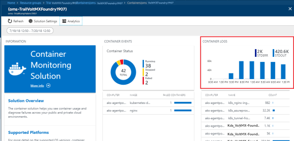
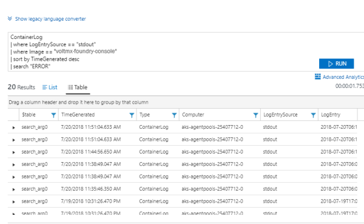
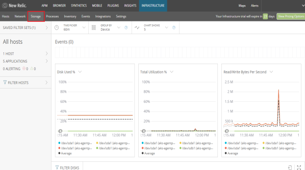
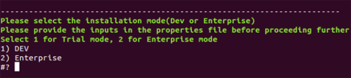
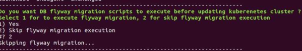
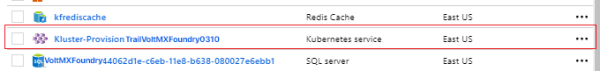
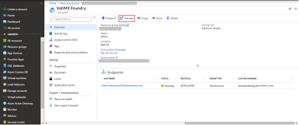

                           

Appendices
==========

Prerequisite Packages
---------------------

White-list the [https://packages.microsoft.com/repos/azure-cli/](https://packages.microsoft.com/repos/azure-cli/) URL to allow the Volt MX Foundry Containers on Azure Solution to download Azure CLI.

Network Settings - Accessing Azure SQL Database
-----------------------------------------------

Communication from HCL's License servers will originate from the following HCL IP address, which should be white-listed in an organization's firewall configuration:

*   115.113.211.130

White-listing the HCL IP address enables access to the Azure SQL Database.

Configuring NAT Gateway
-----------------------

A network address translation (NAT) gateway is used to enable instances in a private subnet to connect to the internet or other AWS services, but prevent the internet from initiating a connection with those instances. For more information about NAT, see [NAT](https://docs.aws.amazon.com/vpc/latest/userguide/vpc-nat.html).

Volt MX Foundry on Azure will support the routing of private subnets through a NAT instance.

To enable NAT Gateway, Set the `AZURE_FIREWALL_ENABLED` flag in properties file to `true`.

Azure Firewall acts as NAT Gateway. All the internet traffic from Kubernetes nodes(VMs) is routed through the NAT Gateway. Deployment of Azure Firewall will increase the overall cost. The cost for Firewall in the east US region is $1.25/hour in Azure. On a monthly basis, the cost of azure firewall deployment costs around 900$. If you do not want to configure the NAT Gateway, disable the firewall deployment by setting the `AZURE_FIREWALL_ENABLED` flag to `false`.

Hosting your domain with Azure DNS
----------------------------------

The Domain Name System, or DNS, is responsible for translating (or resolving) a website or service name to its IP address. Azure DNS is a hosting service for DNS domains, providing name resolution using Microsoft Azure infrastructure. By hosting your domains in Azure, you can manage your DNS records using the same credentials, APIs, tools, and billing as your other Azure services.

Follow these steps to create your first DNS zone and record using the Azure Portal:

1.  **Create a DNS Zone**
    1.  Sign in to the Azure portal.
    2.  On the Hub menu, click **Create a resource** > **Networking** > and then click **DNS zone** to open the **Create DNS zone** page.  
        
    3.  On the **Create DNS zone** page enter the following values, then click **Create**:
    
      
    | Setting | Value | Details |
    | --- | --- | --- |
    | Name | customdomainname.com | The name of the DNS zone |
    | Subscription | \[Your subscription\] | Select a subscription to create the DNS zone in. |
    | Resource group | Create new: testresourcegroup | Create a resource group. The resource group name must be unique within the subscription you selected. |
    | Location | West US |   |
    
    > **_Note:_** The resource group refers to the location of the resource group, and has no impact on the DNS zone. The DNS zone location is always **global**, and is not shown.
    
2.  **Create a DNS Record**
    1.  Go to **DNS Zones** in the Azure portal and select **customdomainname.com** DNS zone in the list.
    2.  At the top of the **DNS zone page**, select `+ Record` set to open the **Add record set** page.
    3.  On the **Add record set** page, enter the following values, and click **OK**. In this example, you are creating a CNAME record.
    
      
    | Setting | Value | Details |
    | --- | --- | --- |
    | Name | www | Name of the record. |
    | Type | CNAME | Type of DNS record you want to create. Acceptable values are A, AAAA, CNAME, MX, NS, SRV, TXT, and PTR. For more information about record types, visit [Overview of DNS zones and records](https://docs.microsoft.com/en-us/azure/dns/dns-zones-records). |
    | TTL | 1 | Time-to-live of the DNS request. |
    | TTL unit | Hours | Measurement of time for TTL value. |
    | IP Address | Alias value | This value is the Alias that the DNS record resolves. |
    
3.  Update Name Servers  
    Once you are satisfied that your DNS zone and records have been set up correctly, you need to configure your domain name to use the Azure DNS name servers. This enables other users on the Internet to find your DNS records. The name servers for your zone are given in the Azure portal:  
      
    These name servers should be configured with the domain name registrar (where you purchased the domain name). Your registrar offers the option to set up the name servers for the domain. For more information, refer [Delegate your domain to Azure DNS](https://docs.microsoft.com/en-us/azure/dns/dns-domain-delegation).  
    

> **_Note:_** Currently, Azure DNS does not support purchasing of domain names. If you want to purchase domains, you need to use a third-party domain name registrar. The domains can then be hosted in Azure DNS for management of DNS records.

Generating a PFX file from PEM
------------------------------

Different platforms and devices require SSL certificates to be converted to different formats. Use the following command to generate the **.pfx** file from a **.pem** file:

```
$ openssl pkcs12 -inkey private.pem -in public.pem -export -out certificate.pfx -passout
 pass:xxxxxxxx -certfile more.crt
```

Breaking down the command:

*   **openssl** – Is the command for executing OpenSSL
*   **pkcs12** – Is the file utility for PKCS#12 files in OpenSSL
*   **\-export -out certificate.pfx** – Helps export and save the PFX file as certificate.pfx
*   **\-inkey privateKey.key** – Uses the private key file privateKey.pem as the private key to combine with the certificate.
*   **\-in infile** - Is this parameter for input filename
*   **\-passout p** - Is the output file to pass phrase source. Should be passed as pass:<password>
*   **\-certfile more.crt** – This is optional, this is if you have any additional certificates you would like to include in the PFX file.

Extracting Logs from your Application
-------------------------------------

If you want to extract logs from a container, execute the following commands from your terminal:

  
| COMMAND | LOG |
| --- | --- |
| $ kubectl config current-context | Display the current-context |
| $ kubectl config use-context <cluster-name\> | Set the default context to the cluster-name if the current context does not point to the Volt MX Foundry cluster. |
| $ kubectl get pods | Lists all the pods |
| $ kubectl logs -f <pod-name\> | To tail logs from a specific pod |
| $ kubectl logs pod-name > logs.txt | To extract the logs of a specific pod to local file |

Connecting to AKS nodes through Jumpbox
---------------------------------------

1.  Get the Public IP of the Jumpbox from the Azure Portal.
    
2.  Use the following SSH command to connect to the Jumpbox:
    
    `$ ssh username@publicip`

    The default username is **devops** and password is **Devops@12345**.
    
3.  To log in to Azure Kubernetes node from Jumpbox, you need to get the Private IP of the node from the Azure Portal.
    
4.  Use the private key of the public key you have provided during Volt MX Foundry installation. Copy the private key to Jumpbox. Make sure you delete the key during logout.
    
5.  Execute the following command to login to AKS node:
    
    `$ ssh -i key.pem username@privateIpOfNode`
    
    The default username is **azureuser**.
    

Log Analytics
-------------

Microsoft Azure provides OMS (Operation Management Suite) Log Analytics solution to view the application logs. If you enable the flag for installation of log analytics solution (AZURE\_LOG\_ANALYTICS\_ENABLED) in the properties file, then the Operations Management Workspace is created in the Azure Resource Group.

Follow these steps to view the application specific logs:

1.  Navigate to [http://portal.azure.com/](http://portal.azure.com/).

2.  On the home page, select the resource group in which the AKS cluster is created. You can find the resource group (`AZURE_RESOURCE_GROUP`) in the properties file which was used in the VoltMX Foundry installation.
<br>
4.  Select **Containers** solution.
<br>
6.  Select **Container Monitoring Solution**.
<br>
8.  Select **CONTAINER LOGS.**
<br>
10.  In the **Log Search** page, you need to execute the following queries to fetch the logs.
<br>  

   *  `ContainerLog | where LogEntrySource == "stdout" | sort by TimeGenerated desc` - To fetch all the logs.
   *  `ContainerLog | where LogEntrySource == "stderr" | sort by TimeGenerated desc` - To fetch all the error logs.

### Search Logs

*   Using Docker Image Name:

If you want to view feature specific (console, identity, integration, engagement, API Portal) logs, select the respective image.

  
| Feature | Docker image |
| --- | --- |
| Console | VoltMX-foundry-console |
| Identity | VoltMX-foundry-identity |
| Integration | VoltMX-foundry-integration |
| Engagement | VoltMX-foundry-engagement |
| API Portal | VoltMX-foundry-apiportal |


The image name gets appended to the query when you select the image. Execute the new query to get logs specific to the image.


*   Using content

    When you want to search specific key word in the logs execute the following query:

    `ContainerLog | where LogEntrySource == "stdout" | where Image == "<image-name>" | sort by TimeGenerated desc | search "<keyword>`"

    

    You can also apply filters to the logs. Filters can be applied to any column.

    

*   Using request ID

    To view the logs based on request id, you need to apply a filter on the **Log Entry** column.

    

*   Using date range

    You can select custom date range to access the logs.

    

*   By pod name

    You can fetch the logs specific to a pod in the kubernetes cluster.

  
    | Feature | Pod name prefix |
    | --- | --- |
    | Console | K8s\_VoltMX-foundry-console |
    | Identity | K8s\_VoltMX-foundry-identity |
    | Integration | K8s\_VoltMX-foundry-integration |
    | Engagement | K8s\_VoltMX-foundry-engagement |
    | Api Portal | K8s\_VoltMX-foundry-apiportal |

    

New Relic Monitoring
--------------------

New Relic is a monitoring system that enables you to understand the performance of the application, dependencies, bottlenecks, and also increases the efficiency and accuracy. New Relic enables you to:

*   Get a complete overview of the application and the operating environment.
*   Manage your application's performance.
*   Identify and troubleshoot bottlenecks.
*   Analyze data about customers' usage and experience.
*   Monitor your technical resources and ecosystem.

Monitoring of Volt MX Foundry on Azure using New Relic is performed at two levels:

*   Infrastructure Monitoring
*   Application Performance Monitoring

**Infrastructure Monitoring** enables you to monitor node-level metrics like CPU, Memory, Disk Usage, Average load, and I/O metrics.

**Application Performance Monitoring** enables you to view application performance trends like page load times, error rates, slow transactions, and a list of servers running the application in the real-time. It helps in identifying and troubleshooting the issues and metrics of Transactions, Databases, JVM's, Error analytics of each pod individually.

### Enabling New Relic Monitoring in Microsoft Azure Cloud

You must have a **New Relic license key** to enable New Relic Monitoring in Microsoft Azure cloud. For more information, refer [license key](https://docs.newrelic.com/docs/accounts/install-new-relic/account-setup/license-key).

Follow these steps to enable New Relic Monitoring in Microsoft Azure cloud:

*   To enable **New Relic Infrastructure Monitoring**, change the value of `NEW_RELIC_INFRA_MONITORING_ENABLED` to **true** in the  `trial.properties`  or  `enterprise.properties` file.
*   To enable **New Relic Application Performance Monitoring**, change the value of `NEW_RELIC_APP_PERF_MONITORING_ENABLED` to **true** in the ` trial.properties ` or  `enterprise.properties` file.
*   Provide the **New Relic Authorized license key** for the `NEW_RELIC_LICENSE_KEY` parameter in the  `trial.properties`  or   `enterprise.properties`  file.

### Accessing New Relic Monitoring Data

Follow these steps to view the business insights or application performance results:

1.  Create a **New Relic** account to get the required `NEW_RELIC_LICENSE_KEY` to enable the **New Relic Monitoring** feature.
2.  **Sign in** to the New Relic portal by providing your credentials at [https://rpm.newrelic.com/accounts/2056095/applications](https://rpm.newrelic.com/accounts/2056095/applications).
<br>
4.  Choose the required monitoring option in the upper left corner of the New Relic portal. Select **APM** for Application Performance Monitoring and **INFRASTRUCTURE** for Infrastructure Monitoring.
<br>

### Application Performance Monitoring

<br>In APM, you can view the metrics of Volt MX Foundry **Kubernetes** **pods** deployed on Microsoft Azure Kubernetes cluster.  
  
Select a specific pod to view the performance metrics of that pod.  


You can view various application performance metrics by selecting the options from the left navigation pane.


*   **Distributed tracing** lets you trace the path of a single request in a complex system. You can understand the entire chain of events, discover the latency of that complete request, and know which step in the path is creating a bottleneck.
*   **Service maps** show the connections and dependencies of your app, including databases and external services.  
    Health indicators and performance metrics show you the current operational status for every part of your architecture.
*   The **Transactions** screen provides an overview of the throughput metrics and the top five time-consuming transactions.

A **transaction trace** gives a detailed snapshot of a single transaction in your application. It records the available function calls, database calls, and external calls. You can use transaction traces to troubleshoot performance issues and get detailed low-level insight into how your app is working.


*   The **Databases** screen provides a detailed overview of the performance of your database - pointing out critical errors that are slowing down your application. The database overview provides a stack ranking of the most time-consuming database calls along with aggregated metrics around response times, throughput, and slow SQL traces.


*   The **External services** screen captures calls to out-of-process services such as web services, resources in the cloud, and any other network calls. The external services dashboard provides charts with your top five external services by response time and external calls per minute.


*   The **JVMs** screen captures metrics that include thread activity, HTTP session data, connection pool metrics, class load (or) unload counts, and so on.


### Infrastructure Monitoring

In the **Infrastructure** portal of **New Relic Monitoring**, you can view the Infrastructure metrics of Volt MX Foundry.


You can view various infrastructure level metrics by selecting different options from the top navigation pane.


*   The **Hosts** screen helps you understand the performance metrics such as CPU usage, load average, and memory used.
*   The **Network** screen provides real-time visibility into the health and performance of individual hosts, web servers, or other groups of resources across your network. Charts include bandwidth metrics by packet, bandwidth by bytes, and errors per second.


*   The **Storage** screen allows you to monitor the capacity and efficiency of your resources, overall utilization, disk usage, or I/O operations.



*   The **Processes** screen lets you view information about the processes running on your infrastructure and set alerts on process metrics.


*   The **Inventory** screen provides a real-time view to filter and search the inventories in each host's configuration
*   The **Events** screen is a live feed of important system and host activity; including inventory change events, configuration changes, and log analytics events. The event feed helps you understand the correlations between the events and the performance of your system. You can search and filter your events to decrease the mean time to detect and repair the infrastructure issues.

The **INSIGHTS** tab leverages the data from New Relic's other products to allow you to analyze user behavior, business transactions, customer insights, and more. Using the Insights interface, you can quickly and easily build dashboards to identify problems with your apps and hosts in real-time or to track ongoing data trends.


Select a Dashboard from Kubernetes insights window to view the data about container CPU usage, container memory usage, container restarts, resources used etc.


Rolling Updates
---------------

Microsoft Azure provides rolling updates feature to update the deployment with zero downtime by incrementally updating the pod instances with new pods.

Using the rolling updates feature, you can perform the following actions:

*   Update kubernetes pod configuration.
    *   Update the properties in the deployment section.
    *   Update the `-d` parameters.
*   Increase or decrease the pod count.
*   Update the docker image of the container present in the pod.

### Prerequisites

**Following are the prerequisites to perform rolling updates:**

*   Linux machine with Ubuntu 16.04 installed.
*   Unzipped directory of the **VoltMX Foundry installation zip** (Use the same unzipped directory of the Volt MX Foundry installation which was used for the initial Volt MX Foundry setup).

<blockquote><em><b>Note:</b></em> You can update the following Volt MX Foundry pods using the rolling update feature:
<ul>
<li>voltmx-foundry-apiportal</li>
<li>voltmx-foundry-console</li>
<li>voltmx-foundry-engagement</li>
<li>voltmx-foundry-identity</li>
<li>voltmx-foundry-integration</li>
</ul>
</blockquote>


### Execute Rolling Updates in Azure Kubernetes Cluster

To execute the rolling updates in Azure Kubernetes cluster, perform the following steps.

1.  Log on to the **Linux machine.**
2.  Perform the following actions in the unzipped directory of the Volt MX Foundry on Azure setup.
    1.  Provide the inputs in the properties file.
    2.  Execute the `kf_setup.sh` script.
    3.  Execute **kubectl** commands to check the latest status of pods.

> **_Note:_** Upgrade one pod at a time for smooth roll out of upgrade process.  
Modify the properties file for the specific pod you want to upgrade, and execute the script.  
Once the new pod is created, repeat the process for other pods.

#### Provide Inputs in Properties File

> **_Note:_** Use the same properties file that was used to create the cluster.

*   Make sure that all the values (`AZURE_RESOURCE_GROUP`, `AZURE_SUBSCRIPTION_ID`, `SERVICE_PRINCIPAL_CLIENT_ID`, `SERVICE_PRINCIPAL_CLIENT_SECRET`, `AZURE_LOCATION`, `SSH_PUBLIC_KEY, SERVER_DOMAIN_NAME`, `NEW_RELIC_LICENSE_KEY`, Azure DB service parameters, Azure Redis cache details) match with the existing cluster.
*   For Non-SSL cloud, `SERVER_DOMAIN_NAME` must be the **Domain Name** of the **Azure Application Gateway**. For example, `<random_value>.cloudapp.net`.  
    You can find the Domain Name in Azure console using the following path:  
    `Home > resource group > application gateway > Frontend public IP address`
*   For SSL Cloud, `SERVER_DOMAIN_NAME` must be the **External Domain Name**.
*   To execute the rolling update for a pod, set the values of the following parameters in the properties file:
    *   `MAX_SURGE` - The number of pods that are created in addition to the desired number of pods during rolling update. Once the roll out is complete, the number of pods are reduced to the desired number of pods. `MAX_SURGE` is set to one in the properties file, by default.  
        For example, if the number of pods is three, and maxSurge= 1, then there are at most four pods during the update process. Once the roll out is complete, the number of pods will be three.
    *   `MAX_UNAVAILABLE` - The maximum number of pods that can be unavailable during the update process. `MAX_UNAVAILABLE` is set to one in the properties file, by default.  
        For example, If the number of pods is three, and maxUnavailable=1, then there will be at least two pods in service during the update process. Once the roll out is complete, the number of pods will be three.

> **_Note:_** The values of `MAX_SURGE` and `MAX_UNAVAILABLE` must not be zero simultaneously.

<a id="execute-the-script"></a>

#### Execute the `kf_setup.sh` Script

1.  Make sure the current directory is `/azure`.
2.  Execute the `kf_setup.sh` script using the `$bash kf_setup.sh` command.
3.  Select the installation mode of the cloud that you want to upgrade (If the setup was done in enterprise mode, then select enterprise; otherwise, select trial mode).  
    
4.  Select the execution mode. For rolling updates, select **Update**.  
    
5.  If a database upgrade is required, choose to execute flyway migration. Otherwise, skip the flyway migration.  
    

#### Execute kubectl Commands to Check Latest Status of Pods

**Execute the following actions to check the latest status of the pods**

*   Open a new terminal instance on the Linux machine.
*   While the rolling update is in progress, execute the following command in the terminal to view the current state of the pod:
```
$kubectl get pods  
$kubectl get deployments
```

Wait till the desired and available counts for the specific pod are equal.


If you want to upgrade other pods, repeat the process.

### Update kubernetes Pod Configuration

#### Modify the Properties in Deployment Section

The kubernetes rolling update allows you to update the values in the deployment object for every deployment of the Volt MX Foundry pod.

You can update the following values in the kubernetes cluster:

*   Number of Pods
*   Docker image
*   Readiness init delay
*   Liveness probe init delay

Update the values in the properties file based on your requirement. The image displays the options available to upgrade the Integration pod:


#### Modify -d parameters for the Pod

Perform the following actions to modify other parameter values for the pod:

*   Edit the required values in the properties file.
*   Increase the value of **readiness\_init\_delay (or)** **liveness\_init\_delay** of the pod by one second so that the kubernetes rolling update for the pod will get triggered.

> **_Note:_** The kubernetes rolling update starts only when the parameter values in the deployment object are modified. To modify the -d parameters in the **configmap** section, edit the liveness (or) readiness probe delay to perform the rolling update.

> **Note:**  
Consider a scenario where your Volt MX Foundry setup does not contain New Relic Monitoring enabled, and you obtain the license key later. You can enable new relic on your Volt MX Foundry setup by setting the following values  to true.      
*   NEW\_RELIC\_INFRA\_MONITORING\_ENABLED = true  
*   NEW\_RELIC\_APP\_PERF\_MONITORING\_ENABLED = true      
Provide the license key value in the properties file `NEW_RELIC_LICENSE_KEY = <value>`      
You must increase the value of readiness (or) liveness probe by one second for a pod to trigger the rolling update and enable the new relic agent in the pod.      
Perform the rolling update.  

### Increase (or) Decrease Pod Count

To increase the pod count, make sure that the kubernetes worker nodes (Azure VM’s) are scaled properly, and the number of pods is equal to the number of worker nodes.

For example, if you want to increase the integration pod count to three, then the number of worker nodes must be three.

#### Increasing kubernetes Worker Nodes in Azure

1.  Sign In to Microsoft Azure Console.
2.  Select the resource group in which the AKS Cluster is created.  
    
3.  Select the **Scale** option on the cluster home page, increase (or) decrease the count of worker nodes based on your requirement. Save the configuration.  
    

#### Increase (or) Decrease the Number of Pods

After increasing (or) decreasing the number of worker nodes (Azure VM’s), you can modify the pod count by following the given steps:

1.  Modify the node count of the pod in the properties file.  
    
2.  Execute the `kf_setup.sh` file as described in the [earlier](#execute-the-script) section.


### Update the Docker Image of the Container inside the Pod

*   Modify the docker image in the properties file.  
    
*   Execute the `kf_setup.sh` file as described in the [earlier](#execute-the-script) section.

Kubernetes Dashboard
--------------------

You can access the Kubernetes dashboard in the Azure portal to view the information related to an application deployed in Azure Kuberntes cluster. Using the kubernetes dashboard, you can also view pod metrics such as CPU Usage, Memory Consumption, as well as Kubernetes objects like deployments, configmaps etc.

### Prerequisites

Following are the prerequisites to use the Kubernetes dashboard:

*   Linux machine with Ubuntu 16.04 installed
*   A valid Azure account
*   AKS Cluster deployed in Azure

### Steps to Initialize Kubernetes Dashboard in Browser

Following are the steps to access Kubernetes dashboard in browser:

1. Sign in to the **Azure** portal.

2. Select the **Resource Group** in which the Kubernetes cluster is created.

3. In the list of resources, select the created **Kubernetes cluster**.

4. Select the **View Kubernetes dashboard** tab in the lower-right corner of the screen.  
   
   The configuration screen appears:
     

5. Follow these steps to initialize the Kubernetes dashboard    
    1. Click on the copy button below the _Open the Kubernetes dashboard by running the following command_ step. The following code is copied:  
       `$az aks browse --resource-group <resource group name> --name <aks cluster name>`

    2. From the top right corner on the navigation bar, click the Power Shell icon.           
        
       The bash terminal opens at the bottom of the window.
       
        
    3. Paste and execute the copied command in the Bash terminal.  
       
        
    4. Copy the response URL and open it in a browser to display the Kubernetes Dashboard for the requested resource group. The Kubernetes Dashboard is rendered on the browser.

You can view the summary of Kubernetes objects of a deployed application like daemon sets, jobs, pods, CPU usage, memory usage, and so on.


Select options from the left navigation pane to view the detailed information of various Kubernetes objects.

**For example**, select Daemon Sets to view the analytics specific to daemon sets.


### Viewing an Application

*   Select **Pods** from the left pane to view the information about each pod.  
    
*   Click **Services** from the left pane to get the IP address of the application.  
    

You can also view more information about daemon sets, replica sets, replication controllers, jobs, deployments, pods, and stateful sets.

Pod Anti-Affinity
-----------------

Pod anti-affinity is used to handle the creation of pods in worker nodes in Azure Kubernetes cluster for deploying a resilient application in the Kubernetes cluster. Certain rules are defined in a pod configuration which allows pod to be deployed only on a particular node when the required conditions are satisfied. No two pods of same kind will be deployed on a single node. Pod anti-affinity helps in distributing the pods across the cluster nodes and helps in creating resilient applications.

<a id="Autoscaling"></a>

AKS Autoscaling
---------------

AKS autoscaling feature helps to scale the service in case of a spike or a drop in application traffic. Incase of a spike in traffic new pods need to be created and the cluster should create new worker nodes to deploy additional pods to serve the incoming traffic. Similarly, when there is a drop in traffic, nodes and pods need to scale down. This ability to automatically scale up or down the number of nodes in the AKS cluster helps in running an efficient and cost-effective cluster.

There are two components involved in auto scaling of AKS cluster.

*   **Cluster Autoscaler**: Scale the nodes in the cluster based on the pending pods which need to be deployed.
*   **Horizontal Pod Autoscaler**: Monitors the resource demand of pods. If a service needs more resources, the number of pods is automatically increased to meet the demand. You must give inputs of memory, CPU limit, and the min and max number of pods that can be scaled.

You can check the runtime usage of memory and CPU by using the following command:

```
"kubectl get hpa"
//hpa is horizontal pod autoscaler.
```

Whenever the usage of either the memory or the CPU exceeds the limit given for that particular pod, the Horizontal Pod Autoscaler is triggered and it starts scaling up the pod.

As pod anti-affinity is implemented, multiple nodes of same component can’t be scheduled on a node to take care of fault-tolerance of deployed application.

When the traffic goes down and the memory and CPU usage falls below the threshold values, newly created pods are terminated. This also results in scaling down of newly created nodes to the minimum number of nodes specified by the user.

For the details about user inputs, refer to the [Configuration](VoltMX_Foundry_on_Azure.md#autoscaling) section.

Azure Resource Group Role Based Access Control (RBAC)
-----------------------------------------------------

The way to control access to resources using RBAC is to create role assignments.  
A role assignment is the process of binding a role definition to a user, group, or service principal at a particular scope for the purpose of granting access. You can create Role assignments using the Azure portal, Azure CLI, Azure PowerShell, Azure SDKs, or REST APIs.

The creation of Role Assignments has the following three elements:

*   **Security Principal**: An object that represents a user, group, or service principal that requests access to Azure resources.
*   **Role Definition**: A collection of permissions such as read, write, and delete. Roles can be generic, like **owner**; or specific, like **virtual machine reader**. you can either use the built-in roles or create custom roles for assigning.
*   **Scope**: A boundary that the access applies to. It can be specified at multiple levels such as management group, subscription, resource group or resource.

To create and remove role assignments, you must have Microsoft.Authorization/ roleAssignments/ \* permission. The Owner or User Access Administrator roles can grant this permission.

> **_Note:_** When planning the access control strategy, it is a best practice to grant users the least privilege to get their work done.

### Assign a Role at a Resource Group Scope

1.  In the navigation list, select Resource groups.
2.  Select a resource group.
3.  Select **Access control** (IAM) to see the current list of role assignments at the resource group scope.
    
    
    
4.  Select **Add** to open the **Add Permissions** pane.
5.  The Add option is visible only if you have the permission to assign roles.
    
    
    
6.  In the **Role** drop-down list, select a role such as **Virtual Machine Contributor**.
7.  In the **Select** list, select a user, group, or application. If you don't see the security principal in the list, you can type in the **Select** box to search the directory for display names, email addresses, and object identifiers.
8.  Click **Save** to assign the role.
9.  After a few moments, the security principal is assigned the role at the resource group scope.

You can use the same process to assign a role at the subscription level, management group level.

> **_Note:_** If the built-in roles do not meet the specific needs of your organization, then you can create custom roles. Just like built-in roles, you can assign custom roles to users, groups, and service principals at subscription, resource group, and resource scopes. Custom roles are stored in an Azure Active Directory (Azure AD) directory and can be shared across subscriptions. Each directory can have up to 2000 custom roles. You can create custom roles with Azure PowerShell, Azure CLI, or the REST API.

Block IP addresses in the Azure Web Application Firewall
--------------------------------------------------------

Follow these steps to block IP addresses in the Azure Web Application Firewall:

1.  Log on to the Azure portal [portal.azure.com](http://portal.azure.com/) using your Microsoft account credentials.
2.  Select the **Resource group** in which WAF is created.
    
    
    
3.  Select the Web Application Firewall resource.
    
    
    
    <a id="subnet"></a>
4.  Select the subnet which has the WAF attached.
    
    
    
5.  Create a new **Network Security Group** (NSG).
    
    
    
    > **_Note:_** By default, NSG is not created for AppGateway.
    
6.  Configure inbound rules in the Network Security Group.
    
    
    
7.  Add new rules in the Network Security Group.
    
    
    
8.  Associate the **AppGateway [subnet](#subnet)** with the **Network Security Group**.
    
    
    

Block IP addresses in the Azure CDN
-----------------------------------

Follow these steps to block IP addresses in the Azure Content Delivery Network (CDN):

1.  Log on to the Azure portal [portal.azure.com](http://portal.azure.com/) using your Microsoft account credentials.
2.  Select the **Resource group** in which CDN is created.
3.  Go to **CDN profile** from the list of resources available in the Azure Resource Group.
    
    
    
4.  Click **Manage** from the top navigation bar.
    
    
    
5.  From the **HTTP Large** list, select **Rules Engine**.
    
    
    
6.  Configure the new **Rule**.
    
    
    

Whitelist IP Address in Azure CDN
---------------------------------

Automation of rules configuration is not supported by az-cli, therefore we need to access CDN manage portal to configure rules.

Follow these steps to whitelist IP addresses in the Azure Content Delivery Network (CDN):

1.  Log on to the Azure portal [portal.azure.com](http://portal.azure.com/) using your Microsoft account credentials.
2.  Select the **Resource group** in which CDN is created.
3.  Go to **CDN profile** from the list of resources available in the Azure Resource Group.
4.  Click on the **Manage** from the top navigation bar to access CDN Manage Portal.

    

5.  Configure the new **Rule**.

    

6.  Set **Deny Access (403)** to **Enabled**.
    
    This determines whether all requests are rejected with a 403 Forbidden response or not.
        
    You can set Deny Access (403) to the values shown in the following table:
    
    | Value | Result |
    | --- | --- |
    | Enabled | Causes all requests that satisfy the matching criteria to be rejected with a 403 Forbidden response. |
    | Disabled | Allow the origin server to determine the type of response that will be returned. |
    
> **_Note:_** It takes some time for the rule to be propagated to the CDN edge nodes. Check the status of rule in CDN Manage Portal.
    

Configure Email Alerts for ClamAV and OSSEC
-------------------------------------------

### INSTALLING OMS AGENT ON THE VIRTUAL MACHINE

1.  Select **OMS workspace** from the list of resources available in the resource group, .
    
    
    
2.  Select **virtual machines** from the left navigation pane.
    
    
    
3.  From the list of available virtual machines, select the virtual machine from the required resource group.
    
    
    
4.  Click **Connect** to install OMS agent on the selected virtual machine.
    
    
    

### CONFIGURING CUSTOM LOGS IN LOG ANALYTICS

1.  Log on to the Azure portal [portal.azure.com](http://portal.azure.com/) using your Microsoft account credentials.
    
    
    
2.  Select **Resource Groups** from the left navigation pane.
    
    
    
    All existing resource groups appear.  
    Select the resource group in which the Log Analytics workspace is created.
    
    
    
3.  Click on **Log Analytics Workspace**.
    
    
    
4.  Select **Advance settings** from the left navigation pane.
    
    
    
5.  Navigate to Data -> Custom Logs -> and click **Add+** to create a new custom log.
    
    
    
6.  Upload a sample log file which is of the same format as that of the logs to be collected.
    
    
    
7.  Select the delimiter (newline/timestamp) based on which the logs are to be separated.
    
    
    
8.  Give the path from where the logs are to be fetched.
    
    
    
9.  Give a **Name** and **Description** for the custom log created and click **OK**.
    
    
    

### CREATE ALERT RULES FOR THE LOGS

1.  Log on to the Azure portal [portal.azure.com](http://portal.azure.com/) using your Microsoft account credentials.
    
    
    
2.  Select **Resource Groups** from the left navigation pane.
    
    
    
    All existing resource groups appear.  
    Select the resource group in which the Log Analytics workspace is created.
    
    
    
3.  Click on **Log Analytics Workspace**.
    
    
    
4.  Click **Alerts** on **Monitoring**.
    
    
    
5.  Click **New Alert Rule**.
    
    
    
6.  Creation of an Alert rule consists of 3 steps.
    
    *   Select the resource for which you want to configure the alert.
        
        
        
    *   Configure the condition on which the alert should be triggered.
        
        Click **Add condition**.
        
        
        
    *   Select the type of log on which the condition must be configured.
        
        Select Custom log search.
        
        
        
    *   Write the query for which the alert should be triggered.
        
        Set the Alert logic, Condition, Threshold, Period and Frequency values.
        
        Click **Done**.
        
        
        
7.  Set the action group which must trigger or intimate the alert.
    
    Click **Create new**.
    
    
    
8.  Configure all the details.
    
    Select action type as Email/SMS/Push/Voice.
    
    Give the **mail id** and other details to create the action group.  
    Click **Ok**.
    
    
    
9.  Set the alert rule details such as **Name** and **Description** to be shown in the triggered mail.
    
    Select `yes` for **Enable rule upon creation**.
    
    
    

VPN Reference Implementation
----------------------------

> **_Note:_** VPN Reference Implementation is documented assuming that the FortiGate Firewall is used on the On-Premise setup. If you are using any other firewall, contact your system administrator for setting up the incoming policies from Volt MX Foundry set up on Microsoft Azure Cloud.

<!-- A Site-to-Site VPN gateway connection is used to connect your on-premises network to an Azure virtual network over an IPsec or IKE (IKEv1 or IKEv2) VPN tunnel. This type of connection requires an on-premises VPN device that has an externally facing public IP address assigned to it.  -->

<!-- Follow the steps described [here](VPN_Implementation.md) to setup a site-to-site VPN. -->

Configure Backup and Restore for Azure File Share
-------------------------------------------------

An Azure file share is a convenient place for cloud applications to write their logs, metrics, and crash dumps. Logs can be written by the application instances via the File REST API, and developers can access them by mounting the file share on their local machine. To understand how to create a file share on Azure, refer to [Create a file share in Azure Files](https://docs.microsoft.com/en-us/azure/storage/files/storage-how-to-create-file-share).

Before you back up an Azure file share, you must ensure that it is present in one of the supported [Storage Account types](https://docs.microsoft.com/en-us/azure/backup/backup-azure-files#limitations-for-azure-file-share-backup-during-preview).

### Configuring Backup

1.  Create a **Recovery Services Vault** in the same region as your file share.
2.  After creating a vault or if you already have a vault, open your vault’s Overview page and click **Backup**.
3.  In the **Backup Goal** menu, from **What do you want to back up?**, choose **Azure FileShare**.
4.  Click **Backup** to configure the backup of Azure FileShare to your Recovery Services vault.
    
    A **Select Storage Account** window appears. A list of all the supported **Storage Accounts** in the region where your vault exists is displayed.
    
5.  From the given list of Storage accounts, you should select an account and click **OK**.
    
    Azure searches for the storage account for file shares that can be backed up. If you have recently added your file shares and do not see them in the list, allow a little time for the file shares to appear.
    
6.  From the list of **File Shares** that appear, select one or more of the file shares you want to back up and click **OK**.
7.  After choosing your file shares, the Backup menu switches to the **Backup policy**. From this menu either select an existing backup policy, or create a new one, and then click **Enable Backup**.

After establishing a backup policy, a snapshot of the file shares will be taken at the scheduled time, and the recovery point is retained for the chosen period.

You can also create an on-demand backup of file shares. For more information on this feature, refer to [Create an on-demand backup](https://docs.microsoft.com/en-us/azure/backup/backup-azure-files#create-an-on-demand-backup).

### Configuring Restore

If you need to restore an entire file share or individual files or folders from a Restore Point, do the following in the Backup Items menu.

1.  Open the **Recovery Services Vault** that contains the file share recovery points and click **Backup Items**. The list of Backup Item types appears.
2.  From the list, select **Azure Storage (Azure Files)**. The list of Azure file shares appears.
3.  From the list of **Azure file shares**, select the desired file share. The Backup Item details appears.
4.  From the Backup Item menu, choose **Restore Share** to restore an entire file share from a desired [Point-in-time](https://docs.microsoft.com/en-us/azure/azure-app-configuration/concept-point-time-snapshot).
5.  From the list of **Restore Points** that are displayed, select one. The selected restore point will be used to **Overwrite** your current file share or **Restore** it to an alternate file share in the same region.

### Create and share a File Share Snapshot

Azure Files provides the capability to take share snapshots of file shares. Share snapshots capture the share state at that point in time.

Snapshots can be of the following types, based on the operating system in which they're being captured.

*   Logical Volume Manager (LVM) snapshots for Linux systems
*   Apple File System (APFS) snapshots for MacOS
*   Volume Shadow Copy Service (VSS) for Windows file systems. NTFS and ReFS are examples of VSS.

The **az storage share snapshot** command must be used to create a snapshot of an existing share under the specified account.

Command

```
az storage share snapshot --name [--account-key] [--account-name] [--connection-string] [–metadata] [–quota] [--sas-token] [–subscription] [–timeout]
```

Example

```
SNAPSHOT=$(az storage share snapshot --account-name $STORAGEACCT  --account-key $STORAGEKEY  --name "myshare"  --query "snapshot" | tr -d '"')
```

### Restore from a share snapshot

The **az storage file copy start** command can be used to restore a file. Perform the following steps to restore from a share snapshot:

Delete the sample file (for example: SampleUpload.txt) that you have uploaded earlier, so you can restore it from the snapshot.

```
az storage file delete --account-name $STORAGEACCT --account-key $STORAGEKEY --share-name "myshare" --path "myDirectory/SampleUpload.txt"
```

Build the source URI for a snapshot restore.

```
URI=$(az storage account show --resource-group "myResourceGroup" --name $STORAGEACCT --query "primaryEndpoints.file" | tr -d '"')
```

```
URI=$URI"myshare/myDirectory/SampleUpload.txt?sharesnapshot="$SNAPSHOT
```

Restore SampleUpload.txt from the share snapshot.

```
az storage file copy start --account-name $STORAGEACCT --account-key $STORAGEKEY --source-uri $URI --destination-share "myshare" --destination-path "myDirectory/SampleUpload.txt"
```

Setting custom VNet and Subnet ranges
-------------------------------------

**Steps to use custom VNet and Subnet ranges for Azure Volt MX setup:**

For Azure installation, we use the `10.X.X.X/8` VNet and Subnet ranges. In a few cases where Volt MX Foundry must connect to the customer backend network which also has IP ranges in the same private address space, you can use a different private address range for Azure Volt MX installation. Perform the following steps to use a different private IP address range.

1.  Open the input properties file `<Installation Directory>/conf/enterprise.properties`.
2.  Find properties related to vnet and subnet ranges starting from the **VNET\_ADDRESS\_SPACE** property.
3.  Update all the properties to use the preferred private address range. For example: `192.168.X.X`.
4.  Also, update the **network.properties** file located under `<Installation Directory>/conf/` to use address ranges matching the custom private address range.

Features and Supported Regions
------------------------------

Following is the list of features and their supported regions. If the region specified by the user’s input(AZURE\_LOCATION property) does not support a specific feature, then that feature is skipped and an alternate option is installed.

*   Regions where **WAF v2 is not supported**:
    
```
australiacentral,southafricanorth,uaenorth,westcentralus
```  

*   Regions where **CDN is supported**:
    
```
australiaeast, australiasoutheast, brazilsouth, canadacentral, canadaeast, centralindia, centralus, eastasia, eastus, eastus2, japaneast, japanwest, northcentralus, northeurope, southcentralus, southindia, southeastasia, westeurope, westindia, westus, westcentralus
```  

*   Regions where **multiple availability zones are supported for AKS**:
    
```
centralus, eastus2, eastus, francecentral, japaneast, northeurope, southeastasia, uksouth, westeurope, westus2
```  

*   Regions where **multiple availability zones are supported for Application Gateway**:
    
```
centralus,eastus,eastus2,westus2,francecentral, northeurope,uksouth,westeurope,japaneast,southeastasia
```  

*   Regions where **ZRS is not supported for Storage account**:
    
```
westus2,eastus,eastus2,northeurope,westeurope,southeastasia, francecentral,japaneast,centralus,uksouth,australiaeast,southafricanorth
```
