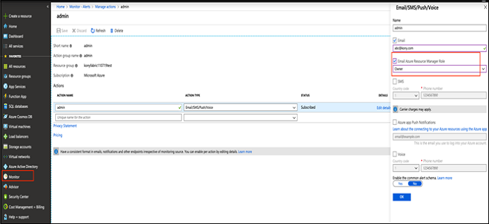



Frequently Asked Questions (FAQs)
=================================

1.  **What permissions do I need to have to create the Azure AKS resources?**
    
    You require the following permissions to create the Azure AKS resources:
    
    The Azure account holder should have the role of a **Global Administrator**. The default role is **User**. As a Global Administrator you can create AKS clusters and other resources through the **Azure Portal** or the **Azure CLI**. Otherwise, the following error will be shown:  
    **Directory permission is needed for the current user to register the application.**  
    For how to configure the service principal portal, refer [Create service principal portal on Azure](https://docs.microsoft.com/en-us/azure/azure-resource-manager/resource-group-create-service-principal-portal).  
    For more details, refer [Check azure subscription permissions](https://docs.microsoft.com/en-us/azure/azure-resource-manager/resource-group-create-service-principal-portal#check-azure-subscription-permissions).  
    
2.  **Is Azure Kubernetes Service (AKS) supported in all the regions?**
    
    No. The available regions for the resource type - **Microsoft.ContainerService/managedClusters** are: **eastus, westeurope, centralus, canadacentral, canadaeast.**
    
3.  **Do I need to have an account with the Docker Hub to pull the VoltMX Foundry Images?**
    
    No, you do not need an account with the Docker Hub to access the VoltMX Foundry images. The images are public and you do not need any authorization to download them.
    
4.  **Can I decide the number of nodes in my AKS cluster?**
    
    Yes, you can provide this as an input through the **K8S\_NODE\_COUNT** parameter in the **aks\_cluster\_config.properties** file along with the other parameters.
    
5.  **Can I configure a custom address space for AKS cluster instead of the default address space?**
    
    Yes, you can provide the custom address space by setting the value for **VNET\_ADDRESS\_SPACE** in the **aks\_cluster\_config.properties** file.
    
    To provide a custom address space, ensure that the AKS subnet address space, Azure application gateway subnet address space, and the jumpbox subnet address space, exist within the same virtual network address space and do not overlap.
    
6.  **Can I configure an additional email address for alert notifications?**
    
    Yes, you can provide an additional email address for alert notifications. To do so, you need to select the Azure role to configure sending alert notifications in the Azure portal. Perform the following steps:
    
    1.  Log in to Azure portal.
    2.  Select Monitor, click Manage action groups.
    3.  Edit the action group for which the email IDs needs to be added.
    4.  Select the role from the given list, as illustrated in the following image.
    
    
    
7.  **What is the frequency of monitoring for alert notification?**
    
    By default, for a window size of 60 minutes, polling will take place to check for threshold violation in every 5 minutes. A value for window size and polling time can be set on the Azure portal, if required.
    
    Based on the Azure subscription, user can customize the polling time according to requirement.
    
    
8.  **How can I use a custom domain name to access my VoltMX Foundry installation?**
    
    You can use the Azure DNS Service for installing VoltMX Foundry.  
    For detailed documentation, refer to [DNS-Getting Started Portal](https://docs.microsoft.com/en-us/azure/dns/dns-getstarted-portal)
    
9.  **How can I whitelist custom IP ranges to allow access to my Database service?**
    
    You can whitelist the required IP addresses under the Firewall Rules of the Connection Security page for the Database, so that it is accessible by the DB user and the application.  
    For more details, refer to [Firewall Rules](https://docs.microsoft.com/en-us/azure/mysql/concepts-firewall-rules)
    
10.  **Can I create multiple clusters simultaneously?**
    
    Yes, you can. Make sure that you maintain separate folders for each installation.
    
11.  **How can I delete my AKS cluster?**
    
    Go to the **Resource Groups** tab in the Azure portal and delete the resource group which was created during the installation.
    
12.  **What can be done if the Installation fails underway?**
    
    If the error is related to some misconfiguration of the properties file, user permissions, or Azure quota issues, you need to fix those issues. Then you need to delete the resource group and execute the installation script.
    
13.  **What can be done if VNet Peering is required with the existing AKS Cluster VNet?**
    
    You can have VNet Peering with the existing VNet created during the installation. Make sure that the address range for VNets does not overlap. The CIDR for the existing VNet is `10.0.0.0/8`.
    
14.  **Can I publish an app in WAR format?**
    
    No, you cannot publish an app in WAR format. VoltMX Foundry on Azure currently supports publishing an app only in Zip folder format. Publishing app in WAR format results in error.
    
15.  **Can I run two installations parallely?**
    
    No, you must first ensure that an installation is completed atleast till the Application Gateway mapping and auto registration before running another setup in the same subscription. For a single subscription, do not run multiple installations parallelly even from 2 different client machines. This is very error prone and can end up in a state which is difficult to recover.
    
16.  **Can I use the same extracted installation folder for multiple installations?**
    
    No, whenever a new installation needs to be done, you must extract a new folder from the installation zip. Do not try to reuse existing installation folder.
    
17.  **I am not able to access my Kubernetes server. What could be the reason?**
    
    **Command executed**: `kubectl get pods`
    
    **Error Response**: The connection to the server voltmx-a32c4f04.hcp.eastus.azmk8s.io:443 was refused - did you specify the right host or port?
    
    **Reason**: The Kubernetes API server has been restricted to specific IPs. It is possible that you might be accessing the server from a machine whose IP is not authorized for the API.
    
    server.
    
    **Validation**: To check if IP of your machine from which you are accessing the API server is authorized or not, perform the following steps.
    
    1.  Execute the following command:az aks show -n <AKS\_cluster\_name> -g <Resource\_group\_name>
        
    2.  From the output, check if your machine IP is listed in the `authorizedIpRanges` object in `apiServerAccessProfile` block.
    
    If your machine IP is not listed there, then it does not have access to the API server and you cannot access the Kubernetes Server.
    
    **If I want to access the Kubernetes API server from a machine whose IP address is not authorized, what are the steps that I should follow?**
    
    **Resolution**: To provide access to a machine IP which is not initially authorized, perform the following steps.
    
    1.  Execute the following command.az aks show -n <AKS\_cluster\_name> -g <Resource\_group\_name>
        
    2.  From the output, note the list of authorised IPs present in `authorizedIpRanges` object in the `apiServerAccessProfile` block.
    3.  Execute the following command by including the new machine IP in **\--api-server-authorized-ip-ranges** parameter which is to be authorised in the following format.az aks update -g <Resource\_group\_name> -n 
        <AKS\_cluster\_name>--api-server-authorized-ip-ranges <existing\_ip,existing\_ip,…,new\_ip>
        
    
    Once these steps are executed successfully, you will be able to access the Kubernetes API server from your machine.
    

### Installation Metadata

In case of a non-production environment, the same Foundry Console, Shared Cluster, Integration App Gateway, Integration VNet etc., are used for all the environments within the subscription. To securely store the information about these components so that they can be easily retrieved for subsequent environment installations, the installation details are stored as Installation Metadata into Azure Cosmos DB. The sensitive information such as Foundry Console Password, Shared Cluster Database Password, etc., is stored into the Azure Key Vault.

The name of Azure Cosmos DB and Key Vault are stored in the following property file: `conf/internal/internal.properties`.

During the installation process, the script first tries to fetch metadata for the given subscription from this DB and stores it into `conf/internal/metadata.properties`. Then the script checks if the SHARED Cluster already exists based on the metadata and then proceeds with the installation accordingly.

If it is the first non-production installation in the subscription, the SHARED Cluster does not exist and hence the installation script creates both the clusters (SHARED and INT). At the end of the installation after the auto registration of foundry environment, metadata is updated by the script in the same property file (`conf/internal/metadata.properties`) and that is stored in the Azure Cosmos DB. For sensitive properties such as passwords, the value in `metadata.properties` is replaced with a reference to the Azure Key Vault key and the original value is stored into Azure Key Vault.

For the subsequent non-production installations on this subscription, the script fetches the metadata from the CosmosDB and it skips the SHARED cluster creation to proceed with INT cluster creation.
