   

VoltMX Foundry V9 on Azure
==========================

<!-- A container is a lightweight, standalone, and executable package of a piece of a software that includes everything needed to run the code: runtime, system tools, system libraries, and settings. The Docker container is available for both Windows-based and Linux-based apps, and containerized software will always run the same regardless of the environment. For more information, refer to [What is a container?](https://www.docker.com/what-container) -->

<!-- For installation of VoltMX Foundry V9 SP2 (or later) on Azure, refer to [VoltMX Foundry V9 SP1 on Azure](VoltMX Foundry on Azure.html). -->

VoltMX Foundry Containers on Azure Solution is designed to facilitate VoltMX Foundry on Azure for Trial and Enterprise needs. This setup occurs with minimal manual intervention and leverages the following technologies:

*   **Docker** - To package different components as portable container images (with all the required binaries and libs)
*   **Kubernetes** - To orchestrate and maintain all these running containers. It will also have features like auto-scaling, secrets, deployment upgrades and rollbacks.
*   **Azure** - For provisioning of the underlying infrastructure.

**Salient Features**

The VoltMX Foundry Containers on Azure Solution Trial Version provides developers with tools to build applications and the Enterprise Version provides IT with multi-architecture operations at scale.

The VoltMX Foundry Containers on Azure Solution has the following features:

*   Creates a multi-layer architecture along with the Application Gateway in a Virtual Network making it secure.
*   Supports options to configure a custom DNS name, SSL cert support for secure communication, and includes Jumpbox for DevOps activities.

Prerequisites
-------------

1.  **Azure Account** - The setup script creates all the resources in this account. In your Azure subscription, your account should have the following permissions.
    
    **Azure Subscription Permissions**
    
    *   Your account must have the role of an **[Owner](https://docs.microsoft.com/en-us/azure/role-based-access-control/built-in-roles#owner)**.
    *   If your account has the role of a **Contributor**, you do not have adequate permissions. Contact your Azure Account Administrator for getting the required permissions.
    
    Steps to check the permissions of your Azure subscription:  
    
    1.  In the Azure Portal, select your account from the upper right corner, and select **My permissions**.  
        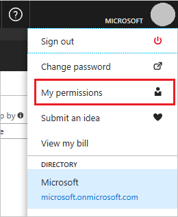
    2.  From the drop-down list, select **Subscription**. Select **Click here to view complete access details for this subscription.  
        **
    3.  View the roles assigned to you. In the following image, the user has the role of the **Owner**, which means that the user has adequate permissions.  
        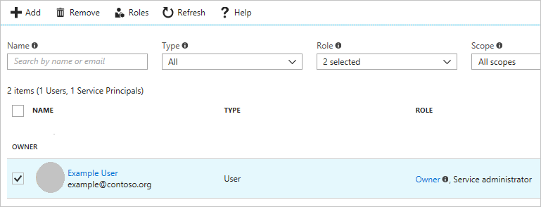
    
    **Azure Active Directory Permissions**
    
    To check your Azure AD permissions:
    
    1.  Select **Azure Active Directory**.  
        
    2.  In Azure Active Directory, select **Overview** and look at your user information. You should have the role of a **Global Administrator** to proceed further. If you do not have this role, contact your administrator to assign this role to you.  
        
    
2.  **Prerequisite packages** - The VoltMX Foundry Containers on Azure Solution does not need any additional software to be pre-installed, as the prerequisite packages are downloaded as a part of the setup scripts.

    **The packages that are installed as part of the install scripts are: azure-cli, kubectl, jq, and sponge.**

    To make sure that the script is able to download all the necessary software, you might need to open outbound connections to the respective sites. For more information, refer to the [Appendices](./Appendices.md) section of this document.

    
7.  **Generate an SSH Public Key** – Using the SSH protocol, you can connect and authenticate to remote servers and services. VoltMX Foundry setup expects an SSH key pair for authentication. The SSH public key is used for creating the Azure Virtual Machine, and for installing the VoltMX Foundry Setup. You need to specify the SSH Public Key in the properties file.
    
    On Ubuntu terminal, use the `ssh-keygen` command to generate SSH public and private key files that are created by default in the `~/.ssh` directory. This command can be executed from your local (Ubuntu) machine:
    
    `ssh-keygen -t rsa -b 2048` - This command is used to generate the SSH key pair using RSA encryption and a bit length of 2048. Name this key to be generated as **id\_rsa**.
    
    You must create and configure a key pair as you need to provide them in the [Configuration](#SSH) settings.
    
    The SSH key needs to be placed in **sshkeys** folder.
    
    You must leave the passphrase empty while generating the SSH key. VM logins are protected by other features such as the Google Authenticator.
    
8.  **Domain Name**\- You can have a Domain Name for the solution, which you can purchase from any third-party organizations, such as GoDaddy, and a proper DNS which you need to map to the public DNS of the Application Gateway. Refer to the [Appendices](./Appendices.md) section, for more details.
9.  **SSL certs**\- To secure the communication, acquire the SSL certs (Azure Application Gateway requires certificates in .pfx format) and provide them during the Installation process. These SSL certs must be associated with the Domain Name that the user has procured. Refer to the [Appendices](./Appendices.md) section on SSL cert pfx format conversion.
    *   Place the SSL certificate (in a **.pfx** file format) in the ssl-cert folder, and then provide the **Server Domain Name** and **AppGateway SSL Cert Password**.
    *   For enabling HTTPS on the back-end of appgateway, perform the following steps:
        1.  The SSL certificates with the cert data and key data should be in separate files (both in a **.pem** file format).
        2.  Save the Cert file as `ingress.pem`.
        3.  Save the Key file as `ingress_key.pem`.
        4.  Place both ingress.pem and ingress\_key.pem files in the **certs** folder of the installation directory.

It is recommended to use CA signed SSL cert to avoid any errors.

To execute the installation scripts, you must use Bash version 4 or later.

<!-- You must white-list VoltMX IP Address(115.113.211.130) to be able to the Azure SQL Database. -->

VM Setup
--------

You need an Azure Virtual Machine to download the artifacts, and execute the setup scripts from the VM to install VoltMX Foundry on Azure.  
Follow these steps to create a VM through Azure Portal:

1.  Login to the Azure Portal with the same account you configured for the role of the **Global Administrator.** Navigate to the **Virtual Machines** Tab.  
    Click on `+Add` button and select the Ubuntu Server image.  
    
2.  Select **Ubuntu Server 16.04 LTS** image and click on **Create**.  
    
3.  Proceed with the remaining steps in the wizard and provide the **SSH Public Key** where needed.  
    

Source Code Setup
-----------------

Steps to Install VoltMX Foundry on MS Azure:

1.  Fetch the **Public IP** of the Virtual Machine from Azure Portal.  
      
    Login to the VM by executing the following command in the Terminal:  
    `$ ssh azureuser@<public-ip> -i ~/.ssh/id_rsa`
2.  Switch to the root user, install the **unzip** package for extracting contents, and download the `voltmx-foundry-containers-azure.zip` file:  
    `$ sudo -s`    
    `$ apt-get install unzip`  
    `$ curl -o voltmx-foundry-containers-azure.zip -L voltmx-foundry-containers-azure_9.0.0.1_GA.zip` 

    <!-- `$ curl -o voltmx-foundry-containers-azure.zip -L [voltmx-foundry-containers-azure_9.0.0.1_GA.zip](http://download.voltmx.com/onpremise/mobilefoundry/docker/9.0.0.1/VoltMXFoundryContainersAzure-9.0.0.1_GA.zip)` -->

3.  Unzip the downloaded artifacts:  
    **$ unzip voltmx-foundry-containers-azure.zip -d <directory-name>  
    **The structure of the document will be as shown below:  
    

Configuration
-------------

Edit the input parameters in the following files based on the type of solution you want to create.

*   **<Installation Directory\>/conf/trial.properties** for Trial solution.
*   **<Installation Directory\>/conf/enterprise.properties** for Enterprise solution.  
    For more information, refer to the [sample.properties (zip)](https://github.com/HCL-TECH-SOFTWARE/volt-mx-docs/raw/master/voltmxlibrary/foundry/zip/user_guide/sample.zip) file.

<!-- VoltMX Foundry setup expects configuration through the properties file available in the **conf** directory of the unzipped artifacts. For the Trial solution, edit the **trial.properties** file. For the Enterprise solution, edit the **enterprise.properties** file. -->

You need to provide the following parameters during Installation:

None of the values for parameters in trial or enterprise properties file should contain quotes.

1.  **Azure Subscription ID**, **Azure Service Principal ID Name**, **Azure Service Principal ID Secret**, **Service Principal Object ID**, and **Tenant ID** - Azure Subscription ID is a GUID that uniquely identifies your subscription to use Azure services. The Application needs the Service Principal to access or configure resources through the Azure Resource Manager (ARM) in the Azure Stack.  
    You must have an Azure account with the permissions of a **Global Administrator** and the role of a **User**. Without these privileges, it is not possible to create the AKS clusters (or other resources).  
    The following section describes fetching **Azure Subscription ID**, generating **Azure Service Principal ID Name**, **Azure Service Principal ID Secret**, **Service Principal Object ID**, and **Tenant ID**.

    1.  Steps to get the Subscription ID:

        *   Navigate to [http://portal.azure.com/](http://portal.azure.com/).
        *   Navigate to Browse.
        *   In the search box, begin to type subscription.
        *   Select Subscriptions from the search results.  
            
            Find the appropriate subscription to check your Azure subscription GUID.  
            
    
    2.  Generating **Azure Service Principal ID Name** and **Azure Service Principal ID Secret**:  
        Login to Azure Portal and click on **Cloud Shell** as shown:  
          
        *   Execute:
            `$ az group create --name "resource_group_name" --location "eastus"`
            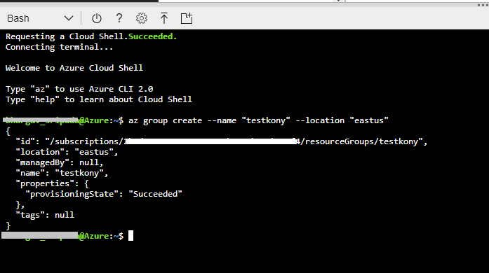
        *   Execute:  
            `$ az ad sp create-for-rbac --role="Contributor" --scopes="/subscriptions/<subscription_id>/resourceGroups/<resource_group_name>"`
            
            After executing the above command, a json response will be displayed on the command prompt.

            <pre><code>{
            "appId": "APP\_ID",  
            "displayName": "ServicePrincipalName",  
            "name": "http://ServicePrincipalName",  
            "password": ...,  
            "tenant": "XXXXXXXX-XXXX-XXXX-XXXX-XXXXXXXXXXXX"  
             }</code></pre>

        *   In the properties file of the **conf** directory:

            *   SERVICE\_PRINCIPAL\_CLIENT\_ID is the value of the appId.
            *   SERVICE\_PRINCIPAL\_CLIENT\_SECRET is the value of the password.
                The values of the SERVICE\_PRINCIPAL\_CLIENT\_ID and SERVICE\_PRINCIPAL\_CLIENT\_SECRET should not contain any quotation marks. For example:
            *   SERVICE\_PRINCIPAL\_CLIENT\_ID = a5afa829-525c-436c-ca4f-f442027cfd2e
            *   SERVICE\_PRINCIPAL\_CLIENT\_SECRET = cx4q44eq-fq7a-450v-zf41-4049183d1eb8
    
    3.  Generating **Service Principal Object ID**  
        Login to Azure Portal and click on **Power Shell**. 

        *   Execute:  
            `$(Get-AzureADServicePrincipal -Filter "AppId eq ‘<Service_principle_client_ID>’").ObjectId`
            
        
    4.  **Tenant ID** - Following are the steps to know your Tenant ID:
        *  Go to Portal.azure.com > Azure Active Directory.
        *  In the Overview section you can find the Tenant ID.
           
    

2.  **Azure Location** - Azure location is the location of the Azure Resource group.

    Azure AKS is supported in various Azure locations. For more information about Azure locations, refer to [Products available by region](https://azure.microsoft.com/en-gb/global-infrastructure/services?products=kubernetes-service&regions=all).

    

3.  **SSH\_PUBLIC\_KEY** - You need this to configure all the Linux machines with the SSH RSA public key string.
       
       *    **ID\_RSA\_PASSPHRASE** - The passphrase of the SSH key.
             It is advised to avoid having a passphrase for the SSH key.
             You must use a single set of SSH keys (id\_rsa.pub and id\_rsa) for the entire subscription to use a single common resource group for PCI. If a new set of SSH keys is being used for cloud creation then you must create a new common resource group for PCI. To create a new common resource group for PCI you must change the default value of the variable **COMMON\_RESOURCE\_GROUP** in the properties file.
        
    For information on how to Generate an SSH public key, click [here](VoltMX_Foundry_v9_on_Azure.md#Generate).
        
6.  **VNET\_ADDRESS\_SPACE**: Provide custom address space of virtual network, if required.
7.  **AKS\_SUBNET\_ADDRESS\_SPACE**: If custom address space of virtual network is configured, then set the value of AKS subnet address space.
8.  **APP\_GATEWAY\_SUBNET\_ADDRESS\_SPACE**: If custom address space of virtual network is configured, then set the value of azure application gateway subnet address space.
9.  **JUMPBOX\_SUBNET\_ADDRESS\_SPACE**: If custom address space of virtual network is configured, then set the value of jumpbox subnet address space.
10.  **DNS\_SERVICE\_IP**: If custom address space of virtual network is configured, then set the IP address value of the DNS service.
11.  **SERVICE\_CIDR**: If custom address space of virtual network is configured, then set the IP address value of the Kubernetes internal service.
    
     If custom address space of virtual network is configured then make sure AKS\_SUBNET\_ADDRESS\_SPACE, APP\_GATEWAY\_SUBNET\_ADDRESS\_SPACE, JUMPBOX\_SUBNET\_ADDRESS\_SPACE, DNS\_SERVICE\_IP, SERVICE\_CIDR IP address do not overlap and at the same time exist in the virtual network address space.
    
12.  **ALERT\_NOTIFICATION\_ENABLED**: Flag to enable or disable alert notifications.
13.  **AZURE\_ACTION\_GROUP\_NAME**: Action group name is the identifier for a set of email IDs to which notifications are sent.
14.  **USER\_EMAIL\_ID**: Primary email ID is provided for receiving alert notifications. You can access the Azure portal to add other email IDs, if required.
15.  **IS\_DB\_SSL\_ENABLED**: Flag for enabling or disabling SSL connection to access MySQL DB.
    
    If IS\_DB\_SSL\_ENABLED is set to true then IS\_SSL\_ENABLED should also be set to true.
    
16.  **ARRAY\_TO\_WHITELIST\_IPS\_TO\_ACCESS\_DB**: Enter the IP address to be whitelisted to access any database.
17.  **IS\_SSL\_ENABLED** – Flag to enable or disable SSL on VoltMX Foundry setup. This flag is set to **true** by default. If you do not require SSL, set this parameter to **false**.
    *   Place the SSL certificate (in a **.pfx** file format) in the ssl-cert folder, and then provide the **Server Domain Name** and **AppGateway SSL Cert Password**.
    *   For enabling HTTPS on the back-end of appgateway, perform the following steps:
        1.  The SSL certificates with the cert data and key data should be in separate files (both in a **.pem** file format).
        2.  Save the Cert file as `ingress.pem`.
        3.  Save the Key file as `ingress_key.pem`.
        4.  Place both ingress.pem and ingress\_key.pem files in the **certs** folder of the installation directory.
18.  **Server Domain Name** - This is the external server domain that you need to map with the Azure Application Gateway DNS name.
19.  **AppGateway SSL Cert Password** – This is the Password used for getting the **pfx** key for the SSL offloading.
20.  **AZURE\_LOG\_ANALYTICS\_ENABLED** – Flag to enable Azure Operations Management Suite (OMS) Log analytics solution.
21.  **AZURE\_LOG\_ANALYTICS\_SERVICE\_TIER** - Service tier for Azure log analytics. The allowed values are **Free**, **Standalone**, and **PerNode**. The **Free** Tier is applicable only if you created your Azure account before 02-April-2018. This tier has a 500MB limit on the amount of data collected daily and also has a 7-day limit on data retention. If you created your Azure Account after 02-April-2018, you only have the **Standalone** or **PerNode** options. If you use the **Free** tier, the installation throws an error. For information about the pricing of the **Standalone** and **PerNode** options, refer to the [Azure pricing for Log Analytics](https://azure.microsoft.com/en-in/pricing/details/log-analytics/).
22.  **AZURE\_LOG\_ANALYTICS\_DATA\_RETENTION\_PERIOD** – This is the data retention period for the logs in log analytics solution (minimum data retention period: 7, maximum data retention period : 738). This value is required if log analytics is enabled. For **Free** tier, data retention period is not allowed for more than 7 days. For **Standalone** and **PerNode** tiers, data is retained at no charge for the first 31 days. There is no daily limit for data upload for **Standalone** or **PerNode** tiers.
23.  **DATABASE\_TYPE** - This is the database type you want to use for hosting VoltMX Foundry on Azure.  
    The VoltMX Foundry Containers on Azure Solution supports the MS SQL and MySQL Server Databases.
24.  **DATABASE\_USER\_NAME** - The preferred Database Username (other than `Admin`).

     **_Note:_**: Ensure that the value of the DB\_NAME parameter in the properties file is unique. An installation error is thrown when a DB service with the same name already exists.

28.  **DATABASE\_PASSWORD** - String containing a minimum of 8 characters and combination of alpha-numeric and non-alpha-numeric characters.

     **_Note:_**: The Database Username and Database Password provided here must also be used to login to the Database using the Azure Portal. You must not use the **$** and **#** characters in the Database password field.

31.  **DB\_SKUTIER**: For MySQL DB, the Skutier can be **Basic**, **GeneralPurpose**, or **MemoryOptimized** tier. The default is set to GeneralPurpose.
32.  **DB\_SKUCAPACITY**: Specify the vCore capacity. If Skutier is Basic, the possible values include 1,2. If Skutier is GeneralPurpose the possible values include 2, 4, 8, 16, 32 or 64. If Skutier is MemoryOptimized the possible values include 2, 4, 8, 16, 32.
33.  **DB\_SKUFAMILY**: Specify the Computer Generation. If Skutier is Basic the possible values include Gen4, Gen5. If Skutier is GeneralPurpose the possible values include Gen4, Gen5. If Skutier is MemoryOptimized the possible values include Gen5.
34.  **DB\_SKUNAME** = Specify the Skutier name in the following format: **TierPrefix\_family\_capacity**. For example, B\_Gen5\_1, GP\_Gen5\_16, MO\_Gen5\_32.
35.  **DB\_SKUSIZEMB**: Specify the max provisioned storage size required for the server in megabytes. For example, 5120.
36.  **MYSQL\_VERSION**: Specify the MySQL version. Currently supported MySQL versions are 5.6, and 5.7.
37.  **DB\_BACKUP\_RETENTION\_DAYS**: Specify the desired backup retention period in days. If PCI is enabled choose the value as 31 days. If PCI is disabled choose the value as 15 days.
38.  **DB\_GEO\_REDUNDANT\_BACKUP**: To configure the Geo-Redundancy backup for DB snapshots, set the value to **Enabled**. The default value is set as Disabled.

     **_Note:_**: The DB\_SKUTIER, DB\_SKUCAPACITY, DB\_SKUFAMILY, DB\_SKUNAME, DB\_SKUSIZEMB, MYSQL\_VERSION, DB\_BACKUP\_RETENTION\_DAYS, and DB\_GEO\_REDUNDANT\_BACKUP properties are specific to the **MySQL Database**.

40.  **DATABASE\_PORT**: Specify the Database Port. For MySQL it is 3306. For MS SQL it is 1433.
41.  **AZURE\_AUTH\_REDIS\_CACHE\_NAME**: Name for the cache. Name can only contain letters, numbers, and hyphens. The first and last characters must each be a letter or a number. Consecutive hyphens are not allowed.
42.  **AZURE\_AUTH\_REDIS\_SKU\_TYPE**: The possible values are **Basic**, **Standard**, **Premium**.
43.  **AZURE\_AUTH\_REDIS\_SKU\_FAMILY**: The possible values are: '**C**', '**P**'; where C = Basic/Standard, and P = Premium.
44.  **AZURE\_AUTH\_REDIS\_SKU\_CAPACITY** : The possible value for this can only be a numeric value. For the C (Basic/Standard) family: (0, 1, 2, 3, 4, 5, 6). For the P (Premium) family: (1, 2, 3, 4).
45.  **AZURE\_AUTH\_REDIS\_CACHE\_EVICTION\_POLICY**: The available Eviction policies are **volatile-lru**, **allkeys-lru**, **volatile-random**, **allkeys-random**, **volatile-ttl**, and **noeviction**. The default value is set to volatile-lru.
46.  **AZURE\_SERVER\_REDIS\_CACHE\_NAME**: Name for the cache. Name can only contain letters, numbers, and hyphens. The first and last characters must each be a letter or a number. Consecutive hyphens are not allowed. For example: kfrediscacheserver.
47.  **AZURE\_SERVER\_REDIS\_SKU\_TYPE**: The possible values are **Basic**, **Standard**, **Premium**.
48.  **AZURE\_SERVER\_REDIS\_SKU\_FAMILY**: The possible values are: '**C**', '**P**'; where C = Basic/Standard, and P = Premium.
49.  **AZURE\_SERVER\_REDIS\_SKU\_CAPACITY**: The possible value for this can only be a numeric value. For the C (Basic/Standard) family: (0, 1, 2, 3, 4, 5, 6). For the P (Premium) family: (1, 2, 3, 4).
50.  **AZURE\_SERVER\_REDIS\_CACHE\_EVICTION\_POLICY**: The available Eviction policies are **volatile-lru**, **allkeys-lru**, **volatile-random**, **allkeys-random**, **volatile-ttl**, and **noeviction**. The default value is set to volatile-lru.
51.  **AZURE\_SERVER\_REDIS\_CONNECTION\_MINIMUM\_IDLE\_SIZE**: The value for Minimum idle Redis connection amount. The default value is set to 5.
52.  **AZURE\_SERVER\_REDIS\_IDLE\_CONNECTION\_TIMEOUT\_IN\_MILLISECONDS**: The value for Redis Idle connection timeout. Default value is set to 10000.
53.  **AZURE\_SERVER\_REDIS\_CONNECTION\_POOL\_SIZE**: This is the maximum pool size for Redis connection. Default value is set to 64.
54.  **AZURE\_SERVER\_REDIS\_CONNECTION\_TIMEOUT**: The value for Redis connection timeout in milliseconds. Default value is set to 10000.
55.  **JUMPBOX\_ENABLED** - Flag to create Jumpbox as a part of the VoltMX Foundry setup. Set this to false if you do not require Jumpbox. Refer to [Appendices](./Appendices.md) for more details on how to connect to the Azure Kubernetes through Jumpbox.
    
     **_Note:_**: After completion of installation, you  must whitelist the URLs that the DevOps would use to Log-in.
    
56.  **Automatic Registration Details:**
 
     | PARAMETER | DESCRIPTION |
     | --- | --- |
     | AUTO\_REGISTRATION\_USER\_ID | The E-mail id used for VoltMX Foundry Registration. |
     | AUTO\_REGISTRATION\_PASSWORD | The Password used for VoltMX Foundry Registration. |
     | AUTO\_REGISTRATION\_FIRST\_NAME | The First Name used for VoltMX Foundry Registration. |
     | AUTO\_REGISTRATION\_LAST\_NAME | The Last Name used for VoltMX Foundry Registration. |

  
     **AUTO\_REGISTRATION\_ENV\_NAME**: Name of the environment. You can set this in the **.properties** file

     The AUTO\_REGISTRATION\_USER\_ID and AUTO\_REGISTRATION\_PASSWORD provided here will also be used to login to the VoltMX Foundry Console.

     You must provide the following parameters **additionally** for an Enterprise solution.

     *   **AKS Node Count** - This is the number of worker nodes in the cluster.
     *   **AKS Node Size** - Type of the worker nodes in the cluster.
     *   **AKS Master Node Count** - This is the AKS Master Node Count.

     Specify the following parameters in the **trial.properties/enterprise.properties** file to enable **Autoscaling**. For more information on Autoscaling refer to, [AKS Autoscaling](./Appendices.md#Autoscaling).

64.  **AKS\_MAX\_NODE\_COUNT**: Specify the maximum number of worker nodes that can be provisioned by Autoscaling.

     **_Note:_**: The max pod count for all the components should not exceed the max node count.

66.  **AKS\_MULTI\_AZ\_ENABLED**: Specify either true or false to enable or disable the deployment of AKS across multiple availability zones. Azure supports this feature only in [specific regions](https://docs.microsoft.com/en-us/azure/aks/availability-zones). If a region does not support AKS across multiple availability zones, setting this value to true has no effect.
67.  **NUM\_INGRESS\_PODS**: Specify the number of ingress pods, if required. The default and recommended value is 2.

     For the **INTEGRATION** Component:

69.  **NUM\_INTEGRATION\_PODS**: The number of minimum pods. For example, the values can be set to: 1, 2, etc.
70.  **INTEGRATION\_POD\_MAX\_REPLICAS**: The maximum number of pods to be scaled. Provide an integer value.
71.  **INTEGRATION\_POD\_CPU\_USAGE\_THRESHOLD**: The scaling of pods will be triggered if CPU utilization value in percentage crosses the user given threshold value. For example, the values can be set to: 80, 90, etc.
72.  **INTEGRATION\_POD\_CPU\_USAGE\_REQUESTS**: For pod placement, AKS looks for a node that has enough CPU to handle the pod requests. For example, the values can be set to: 300m, 400m, etc.
73.  **INTEGRATION\_POD\_MEMORY\_USAGE\_THRESHOLD**: The memory utilization threshold in percentage that is required to trigger scaling. For example, the values can be set to: 80, 90, etc.
74.  **INTEGRATION\_POD\_MEMORY\_USAGE\_REQUESTS**: For pod placement AKS looks for a node that has enough memory according to the requests configuration. For example, the values can be set to: 1G, 2G, etc.
75.  **INTEGRATION\_POD\_MEMORY\_USAGE\_LIMIT**: The maximum amount of memory that can be allocated to a pod in the node. For example, the values can be set to: 3.2G, 3.5G, etc.

     For the **ENGAGEMENT** Component:

77.  **NUM\_ENGAGEMENT\_PODS**: The number of minimum pods. For example, the values can be set to: 1, 2, etc.
78.  **ENGAGEMENT\_POD\_MAX\_REPLICAS**: The maximum number of pods to be scaled. For example, the values can be set to: 1, 2, etc.
79.  **ENGAGEMENT\_POD\_CPU\_USAGE\_THRESHOLD**: The scaling of pods will be triggered if CPU/memory utilization value in percentage crosses the user given threshold value. For example, the values can be set to: 80, 90, etc.
80.  **ENGAGEMENT\_POD\_CPU\_USAGE\_REQUESTS**: For pod placement, AKS looks for a node that has a CPU that can handle the pods, according to the requests. For example, the values can be set to: 300m, 400m, etc.
81.  **ENGAGEMENT\_POD\_MEMORY\_USAGE\_THRESHOLD**: The memory utilization threshold in percentage that is required to trigger scaling. For example, the values can be set to: 80, 90, etc.
82.  **ENGAGEMENT\_POD\_MEMORY\_USAGE\_REQUESTS**: For pod placement AKS looks for a node that has enough memory according to the requests configuration. For example, the values can be set to: 1G, 2G, etc.
83.  **ENGAGEMENT\_POD\_MEMORY\_USAGE\_LIMIT**: The maximum amount of memory that can be allocated to a pod in the node. For example, the values can be set to: 3.2G, 3.5G, etc.

     For the **IDENTITY** component:

85.  **NUM\_IDENTITY\_PODS**: The number of minimum pods. For example, the values can be set to: 1, 2, etc.
86.  **IDENTITY\_POD\_MAX\_REPLICAS**: The maximum number of pods to be scaled. For example, the values can be set to: 1, 2, etc.
87.  **IDENTITY\_POD\_CPU\_USAGE\_THRESHOLD**: The scaling of pods will be triggered if CPU/memory utilization value in percentage crosses the user given threshold value. For example, the values can be set to: 80, 90, etc.
88.  **IDENTITY\_POD\_CPU\_USAGE\_REQUESTS**: For pod placement, AKS looks for a node that has a CPU that can handle the pods, according to the requests. For example, the values can be set to: 300m, 400m, etc.
89.  **IDENTITY\_POD\_MEMORY\_USAGE\_THRESHOLD**: The memory utilization threshold in percentage that is required to trigger scaling. For example, the values can be set to: 80, 90, etc.
90.  **IDENTITY\_POD\_MEMORY\_USAGE\_REQUESTS**: For pod placement AKS looks for a node that has enough memory according to the requests configuration. For example, the values can be set to: 1G, 2G, etc.
91.  **IDENTITY\_POD\_MEMORY\_USAGE\_LIMIT**: The maximum amount of memory that can be allocated to a pod in the node. For example, the values can be set to: 3.2G, 3.5G, etc.

     For the **CONSOLE** component:

93.  **NUM\_CONSOLE\_PODS**: The number of minimum pods. For example, the values can be set to: 1, 2, etc.
94.  **CONSOLE\_POD\_MAX\_REPLICAS**: The maximum number of pods to be scaled. For example, the values can be set to: 1, 2, etc.
95.  **CONSOLE\_POD\_CPU\_USAGE\_THRESHOLD**: The scaling of pods will be triggered if CPU/memory utilization value in percentage crosses the user given threshold value. For example, the values can be set to: 80, 90, etc.
96.  **CONSOLE\_POD\_CPU\_USAGE\_REQUESTS**: For pod placement, AKS looks for a node that has a CPU that can handle the pods, according to the requests. For example, the values can be set to: 300m, 400m, etc.
97.  **CONSOLE\_POD\_MEMORY\_USAGE\_THRESHOLD**: The memory utilization threshold in percentage that is required to trigger scaling. For example, the values can be set to: 80, 90, etc.
98.  **CONSOLE\_POD\_MEMORY\_USAGE\_REQUESTS**: For pod placement AKS looks for a node that has enough memory according to the requests configuration. For example, the values can be set to: 1G, 2G, etc.
99.  **CONSOLE\_POD\_MEMORY\_USAGE\_LIMIT**: The maximum amount of memory that can be allocated to a pod in the node. For example, the values can be set to: 3.2G, 3.5G, etc.

     For the **APIPORTAL** component:

101.  **NUM\_API\_PORTAL\_PODS**: The number of minimum pods. For example, the values can be set to: 1, 2, etc.
102.  **APIPORTAL\_POD\_MAX\_REPLICAS**: The maximum number of pods to be scaled. For example, the values can be set to: 1, 2, etc.
103.  **APIPORTAL\_POD\_CPU\_USAGE\_THRESHOLD**: The scaling of pods will be triggered if CPU/memory utilization value in percentage crosses the user given threshold value. For example, the values can be set to: 80, 90, etc.
104.  **APIPORTAL\_POD\_CPU\_USAGE\_REQUESTS**: For pod placement, AKS looks for a node that has a CPU that can handle the pods, according to the requests. For example, the values can be set to: 300m, 400m, etc.
105.  **APIPORTAL\_POD\_MEMORY\_USAGE\_THRESHOLD**: The memory utilization threshold in percentage that is required to trigger scaling. For example, the values can be set to: 80, 90, etc.
106.  **APIPORTAL\_POD\_MEMORY\_USAGE\_REQUESTS**: For pod placement AKS looks for a node that has enough memory according to the requests configuration. For example, the values can be set to: 1G, 2G, etc.
107.  **APIPORTAL\_POD\_MEMORY\_USAGE\_LIMIT**: The maximum amount of memory that can be allocated to a pod in the node. For example, the values can be set to: 3.2G, 3.5G, etc.
108.  **AZURE\_FILE\_SHARE\_SECRET**: The name for the Kubernetes secret used by integration pods to access Azure file share. The default value is azure-file-share-secret.
109.  **MOUNT\_PATH**: Enter the Mount path of the Integration pods required to store data. The default value is set to `/mnt/shared`.
110.  **AZURE\_FILE\_SHARE\_ENABLED**: The flag to enable or disable Azure file share on the VoltMX Foundry setup. This flag is set to true by default.
111.  **AZURE\_FILE\_SHARE\_STORAGE\_ACCOUNT**: The Azure storage account name must be between 3 and 24 characters in length and must contain alpha-numeric characters in lowercase. The default value is set to voltmxfs.
112.  **AZURE\_FILE\_SHARE\_DIRECTORY\_NAME**: The Azure file share directory name must be between 1 and 255 characters in length and must not contain the following special characters **\\/:|<>\*?**. The default value is set to voltmx.
113.  **STORAGE\_ACCOUNT\_KIND**: Enter the value for the kind of Storage account. The possible values include StorageV2 and FileStorage. The default value is set to StorageV2 as FileStorage Storage account does not support Zone Redundant Storage(ZRS).
114.  **STORAGE\_ACCOUNT\_REPLICATION\_TYPE**: If Storage Account kind is StorageV2, possible values include Standard\_LRS, Standard\_GRS, Standard\_RAGRS, Standard\_ZRS, Premium\_LRS, Premium\_ZRS, Standard\_GZRS, and Standard\_RAGZRS. If Storage Account kind is FileStorage, possible values include Premium\_LRS. Default value is set to Standard\_ZRS.

      **_Note:_**: Only few regions support Standard\_ZRS. Therefore, you must ensure that the region entered in the AZURE\_LOCATION param supports Standard\_ZRS.

116.  **ACCESS\_TIER**: Only the Standard performance has access tiers. The possible values for access tiers include Hot and Cool. The default value is set to Cool.
117.  **AZURE\_FILE\_SHARE\_NAME**: The file share name must be between 3 and 63 characters in length and can use numbers, lower-case letters, and hyphens only. The default value is voltmxfileshare.
118.  **AZURE\_FILE\_SHARE\_QUOTA**: The maximum size of the share in Gigabytes. You can edit the value later in Azure portal. If performance is Standard then its value must be greater than 0, and less than or equal to 5120(5 Terabytes). If performance is Premium then its value must be greater than 0, and less than or equal to 102400(100 Terabytes). The default value is set to 1024.

     

120.  **AZURE\_FILE\_SHARE\_BACK\_UP\_VAULT**: The Recovery Services vault name must be between 2 and 50 characters in length, must start with a letter, and should consist only of letters, numbers, and hyphens. The default value is VoltMXRecoveryServiceVault.
121.  **ARRAY\_TO\_WHITELIST\_IPS\_TO\_ACCESS\_FILE\_SHARE**: Enter the IP address that should be whitelisted to access Azure file share. For example: ("103.140.124.130").
122.  **AZURE\_STORAGE\_ACCOUNT\_NAME**: The Azure storage account name must be between 3 and 24 characters in length, must contain only lowercase alphabets. The default value is voltmx.

      **_Note:_**: The default values for all the above parameters are given in the properties file.

Script Execution
----------------

1.  Switch to the directory that contains the kf\_setup.sh file and execute the setup script using:  
    **$ bash kf\_setup.sh**
2.  Select the Installation mode – **Trial** or **Enterprise**.  
    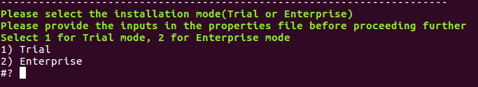
3.  Login to your Azure account using the link printed on the screen, and enter the given code for the script to continue the setup process.  
    
4.  The Bash prompt prints the Public DNS of the Application Gateway while executing the script. You must map this DNS to your custom Domain Name, if SSL is to be configured. Once you  confirm the mapping on the command line, the script resumes execution and completes the setup.  
    

    To execute the installation scripts, you must use Bash version 4 or later.

    Upon successful completion of the setup, all the Application URLs will be printed on the screen as shown in the image.

    

    You can start using VoltMX Foundry using the **VoltMX Foundry Console URL**. The credentials to login to the Console are the same as that of the Auto-registration details provided in the properties file.

    <!-- Make sure to take a backup of the unzipped directory created in **Step 3** for being able to perform further updates to AKS clusters. -->

    Once the installation is complete, and you take a backup, you can delete the Virtual Machine created for executing the setup script. To do so, go to the Azure Portal and navigate to the Virtual Machines Tab. Select the VM and confirm its deletion.

Configuring Iris to Connect to VoltMX Foundry on Azure
------------------------------------------------------------

For details about connecting to VoltMX Foundry Console through Iris, refer to [Connecting to VoltMX Foundry](./../../../Iris/iris_user_guide/Content/Connect_to_VoltMXFoundry.md).

Updating the Azure Kubernetes Service Cluster configuration
-----------------------------------------------------------

You need to have the current config files if you want to update the AKS cluster configuration. Once the installation is complete, take a backup of the unzipped directory where you installed the `voltmx-foundry-containers-azure.zip` to perform further updates to the AKS clusters.

If you do not have a backup of the unzipped directory, updating the AKS cluster is difficult.

Setting up Azure Content Delivery Network (CDN)
-----------------------------------------------

A Content Delivery Network (CDN) is a distributed network of servers that can efficiently deliver web content to users. To minimize latency, CDNs store cached content on edge servers in Point-Of-Presence (POP) locations that are close to end users.

Azure Content Delivery Network (CDN) offers a global solution for developers to rapidly deliver high-bandwidth content to users by caching the content at strategically placed physical nodes across the world.

Azure CDN SKU for AKS cluster is set to Premium Verizon, which supports configuration of cache rules for VoltMX Foundry Apps.

### Enable CDN on Azure AKS cluster

Follow these steps to enable CDN in your AKS cluster .

1.  Set the value of `AZURE_CDN_ENABLED` to **true** in the properties file (trail.properties /enterprise.properties).
    
    
    
2.  Set the CDN Endpoint:
    *   FOR SSL ENABLED CLOUD (`IS_SSL_ENABLED = true`), after creating the CDN endpoint, map the CDN endpoint to a custom domain name.
        
        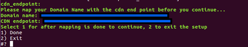
        
    *   FOR SSL DISABLED CLOUD (IS\_SSL\_ENABLED = false), no mapping of server domain name is required.
        

Once you create the CDN profile and endpoint, follow these steps to manually configure the CDN settings in the Azure portal:

3.  Open the Azure portal ([portal.azure.com](http://portal.azure.com/)) and login using your Microsoft account credentials.
    
    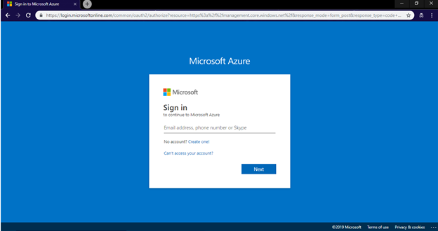
    
2.  Select **Resource groups** from the left navigation pane.
    
    
    
    All existing resource groups appear.  
    Select the resource group in which the AKS Cluster is created.
    
    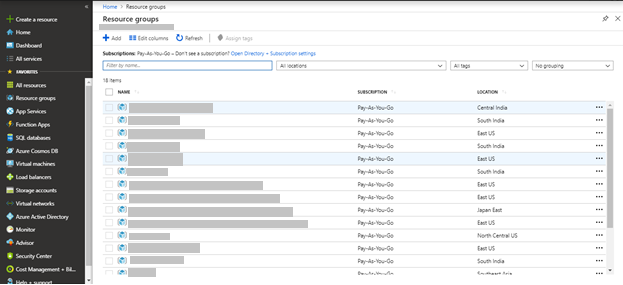
    
3.  If the cloud is SSL enabled, open **CDN Endpoint** from the list of resources in the Azure Resource Group.
    
    
    
4.  Click **Custom Domain**.The Custom Domain page appears.
    
    
    
5.  Select ON to enable HTTPS for custom domain.
    
    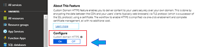
    

### Configuring Caching Rules

1.  Go to **CDN profile** from the list of resources available in the Azure Resource Group (having the created AKS cluster).  
    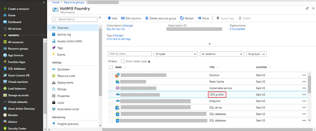
2.  Click **Manage** from the top navigation bar.
    
    
    
3.  Configure all the rules in the **CDN Manage Console**.
    
    
    
4.  From the **HTTP Large** list, select `cache settings -> query string caching` .  
    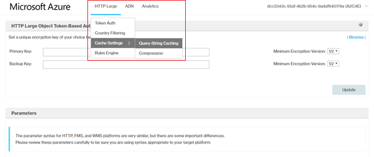
5.  Select **no-cache** as the **query string caching** and click **Update**.  
    
6.  From the **HTTP Large** list, select **Rules Engine**.  
    
7.  Configure all the required rules.  
    
    *   Rule 1  
        
    *   Rule 2  
        
    *   Rule 3  
        
    *   Rule 4  
        
    *   Rule 5  
        
    *   Rule 6  
        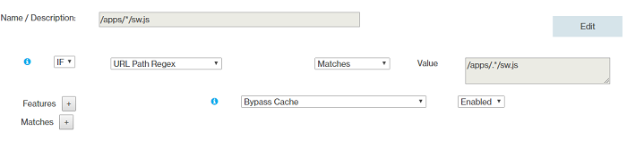
    *   Rule 7  
        
    *   Rule 8  
        
    *   Rule 9  
        
    *   Rules Order

Configuring Clam AntiVirus for Azure Virtual Machines
-----------------------------------------------------

Clam AntiVirus (ClamAV) is an open-source anti-virus software toolkit. You can choose to install ClamAV on Azure Virtual Machines in the kubernetes cluster. ClamAV is designed to be an on-demand scanner, and will only run when invoked to run.

A cron job is configured to run ClamAV on Azure Virtual Machines based on the frequency specified in the properties file. ClamAV scans all the files in the virtual machine and pushes the logs (**clamscan.log** and **freshclam.log**) present in **/var/log/clamav** directory to the **clamavlogs** container in the **storage account** of the Azure Resource Group in which the AKS cluster is created.

Provide the following inputs in the properties file to enable ClamAV.

<!-- ### Generating SSH Keys

Using the SSH protocol, you can connect and authenticate to remote servers and services.

On Ubuntu terminal, use `$cd ~/.ssh` command to set `~/.ssh` as the current directory to generate the SSH public and private key files.

Use the `ssh-keygen -t rsa -b 2048` to generate the SSH key pair using RSA encryption and a bit length of 2048.

Name the key to be generated as **id\_rsa**.

In the properties file, the value of the public key is SSH\_PUBLIC\_KEY. -->

### Install ClamAV on Azure Virtual Machine

Follow these steps to install ClamAV on your Azure Virtual Machine:

1.  Set the value of `INSTALL_CLAMAV` to `true` in the properties file (trail.properties /enterprise.properties).
2.  Place your SSH private key and SSH public key in the `sshkeys` folder with names **id\_rsa** and **id\_rsa.pub** respectively.
3.  Set the frequency of the cron job to start the ClamAV scan and push the generated logs to the storage account.

    Use the following format to set the values for the frequencies of `clamscan_cron_schedule` and `clamscanlogpush_cron_schedule` in the properties file (trail.properties /enterprise.properties). 
<pre><code>
*  *  *  *  *
|  |  |  |  |
|  |  |  |  |
|  |  |  | +---- Day of the Week   (range: 1-7, 1 standing for Monday)
|  |  | +------ Month of the Year (range: 1-12)
|  | +-------- Day of the Month  (range: 1-31)
| +---------- Hour (range: 0-23)
+------------ Minute (range: 0-59)
* = any value
</code></pre>

For example, if you configure the crontab timing as 00 16 \* \* \*, this indicates that the crontab runs every day at 16:00:00 (UTC).

*   You must maintain a minimum gap of 02:30 hrs. between the `clamscan_cron_schedule` and `clamscanlogpush_cron_schedule`.
*   All cron job timings follow UTC timezone.

### Access ClamAV logfiles in the Virtual Machine

Follow these steps to access the ClamAV logs in the Virtual Machine.

*   Log on to Jumpbox using the following ssh command:  
    `ssh devops@<Jumpbox_Public_IP_Address>`
*   Log on to the Virtual Machine from Jumpbox using the following SSH command:  
    `ssh -i id_rsa azureuser@<Virtual_Machine_IP_Address>`
*   Using the following command, go to `/var/log/clamav` directory:  
    `cd /var/log/clamav`

This directory contains the `clamscan.log` and `freshclam.log` files that are generated by ClamAV after scanning the Virtual Machine.

Another cron job is configured to push the generated logs into the Azure Storage Account.

### Edit the cron job

*   Use the following command to view existing cron jobs on the VM.  
    `crontab -l`
    
    
    
*   Use the `crontab -e` command to open the crontab list in edit mode.  
    

### Edit the ClamAV conf file

The `freshclam.conf` file configures the ClamAV Database Updater.

*   Go to the `etc/clamav/` directory.
*   Open the `freshclam.conf` file in any editor to make any required changes to the conf file.

### Accessing Logs in the Azure Storage Account

All the logs generated by CLAMAV are pushed to the Azure Storage Account.

1.  Log on to the Azure portal (`[portal.azure.com](http://portal.azure.com/)`) using your Microsoft account credentials.
    
    
    
2.  Select **Resource Groups** from the left navigation pane.
    
    
    

    All existing resource groups appear.  
    Select the resource group in which the AKS Cluster is created.

    

6.  Select the storage account from the list of resources available in the resource group.

7.  Click **Blobs** to see all the containers available in the storage account.
    
    
    
8.  Select the **clamavlogs** container from the list of containers available in the storage account.
    
    
    
    This shows all the log files pushed by ClamAV from the virtual machine.
    
9.  Click **Download** to view the logs in the file.
    
    
    
10.  Unzip the downloaded .zip file and extract the content.
    
     You can now view all the logs that are pushed by CLAMAV from virtual machine.
    

Configuring OSSEC Intrusion Detection
-------------------------------------

OSSEC is an open source Host-based Intrusion Detection System (HIDS). It has a powerful correlation and analysis engine, and can perform integrating log analysis, file integrity checking, Windows registry monitoring, centralized policy enforcement, rootkit detection, real-time alerting, and active response.

OSSEC runs as a daemon process. It notifies through alert logs when intrusion attacks occur. These alert logs are pushed to the **osseclogs** container in the storage account in the Azure Resource Group in which AKS cluster is created.

Provide the following inputs in the properties file to enable OSSEC.

<!-- ### Generating SSH Keys

Using the SSH protocol, you can connect and authenticate to remote servers and services.

On Ubuntu terminal, use `$cd ~/.ssh` command to set `~/.ssh` as the current directory to generate the SSH public and private key files.

Use the `ssh-keygen -t rsa -b 2048` to generate the SSH key pair using RSA encryption and a bit length of 2048.

Name the key to be generated as id\_rsa. -->

### OSSEC Installation steps

1.  Enable the `INSTALL_OSSEC` flag in the properties file (trial.properties /enterprise.properties):
    
    
    
2.  As OSSEC is a daemon process, it continuously detects intrusion activities and stores alerts in `alerts.log` file. A cron job is configured to push the alerts from `/var/ossec/logs/alerts/alerts.log` to the Azure Storage Account.

    Configure the `cronjob osseclogpush_cron_schedule` in the properties file (trail.properties /enterprise.properties) to set the frequency value of the cron job. Configure the Crontab timing in the following format: 

     <pre><code>
        *  *  *  *  *
        |  |  |  |  |
        |  |  |  |  |
        |  |  |  | +---- Day of the Week   (range: 1-7, 1 standing for Monday)
        |  |  | +------ Month of the Year (range: 1-12)
        |  | +-------- Day of the Month  (range: 1-31)
        | +---------- Hour (range: 0-23)
        +------------ Minute (range: 0-59)
        \* = any value
     </code></pre>   

    For example, if you configure the crontab timing as 00 16 \* \* \*, this indicates that the crontab runs every day at 16:00:00 (UTC).

    *   You can modify the default values of the cron job, if required.
    *   All cron job timings follow UTC timezone.

3.  Place your SSH private key in the sshkeys folder with name id\_rsa.

### Access log files of OSSEC in Virtual Machine

Follow these steps to access OSSEC logs in the Virtual Machine.

1.  Use the following SSH command to log on to Jumpbox
    
    `$ ssh devops@<Jumpbox_Public_IP_Address>`
    
2.  Use the following SSH command, to log on to the Virtual Machine from the Jumpbox
    
    `$ ssh -i id_rsa azureuser@IPaddress of Virtual Machine`
    
3.  Execute the following command to login as a root user.
    
    `$ sudo su`
    
4.  You can view the **syslogs** at `/var/log/syslog`.
    
    `$cd /var/log/`
    
    `$cat syslog`
    
5.  Logs created by OSSEC daemons are stored in the sub directories of `/var/ossec/logs`.
    
    *   You can view the OSSEC logs at `/var/ossec/logs/ossec.log`
        
        `$cd /var/ossec/logs/`
        
        `$cat ossec.log`
        
    *   You can view the OSSEC alerts at `/var/ossec/logs/alerts/alerts.log`.
        
        `$cd /var/ossec/logs/alerts/`
        
        `$cat alerts.log`
        

### Edit cron jobs

*   To view the existing cron jobs use the following command on VM.
    
    $ crontab -l
    
    
    
*   Use the `crontab -e` command to open the crontab list in edit mode.  
    

### Accessing Logs in Azure Storage Account

All the logs generated by OSSEC are pushed to the Azure Storage Account.

1.  Log on to the Azure portal (`[portal.azure.com](http://portal.azure.com/)`) using your Microsoft account credentials..
    
    
    
2.  Select **Resource groups** from the left navigation pane.
    
    
    
    All existing resource groups appear.  
    Select the resource group in which the AKS Cluster is created.
    
    
    
3.  Select the storage account from the list of resources available in the resource group.
4.  Click **Blobs** to see all the containers available in the storage account.
    
    
    
5.  Select the **osseclogs** container from the list of containers available in the storage account.
    
    
    
    The page displays the log files pushed by OSSEC from Virtual Machine.
    
6.  Click **Download** to view the logs file.
    
    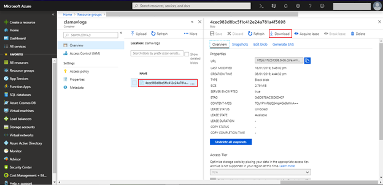
    
    You can now view all the logs that are pushed by OSSEC from the virtual machine.
    
    Follow these steps to edit the `preloaded-vars.conf` file to give customized inputs (other than defaults) to install OSSEC.
    
    1.  Login to the specific Virtual Machine (node) using SSH keys in the terminal.
    2.  Go to the `/home/azureuser/ossec-hids-2.9.0/etc/` directory by using following command.
        
        `$ cd /home/azureuser/ossec-hids-2.9.0/etc/`
        
    3.  Open the `preloaded-vars.conf` file and edit as required.
    
    Follow these steps to edit the `ossec.conf file` and change the existing configurations of OSSEC.
    
    1.  Login to the specific Virtual Machine (node) using SSH keys in the terminal.
    2.  Go to the `/var/ossec/etc` directory using following command.
        
        `$ cd /var/ossec/etc`
        
    3.  Open the **ossec.conf** file and edit as required.
    

<!-- Limitations
-----------

VoltMX Foundry Containers on Azure Solution has the following limitations:

1.  Support for **SPA / Desktop Web** is currently not available.
2.  **Log Analytics** is currently not supported.
3.  The type of **Database collation** is currently not configurable. It will be supported in the subsequent releases. -->
