# <a name="Configuration"></a>Configuration and Setup for Foundry on OpenShift

## <a name="Configuring"></a>Configure the properties file

1.  Extract the `FoundryKube.zip` file. The OpenShift Foundry artifacts generation zip is organized as follows:  
    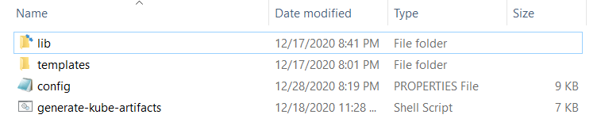
    *   **lib**: Contains dependent jars and helper bash functions
    *   **templates**: Contains the following files
        *   **foundry-app-tmpl.yml**: YAML template for Foundry deployments
        *   **foundry-db-tmpl.yml**: YAML template for Foundry Database schema creation
        *   **foundry-services.yml**: YAML template for Foundry services
    *   **config.properties**: Contains inputs that you must configure for the installation
    *   **generate-kube-artifacts.sh**: A user script that is used to generate required artifacts


    As a result of executing the `generate-kube-artifacts.sh` script, the `artifacts` folder is created containing YAML configuration files. The YAML configuration files are generated based on the `config.properties` file, and they must be applied later to deploy Volt MX Foundry on the OpenShift cluster.

2.  Update the `config.properties` file with relevant information.  
    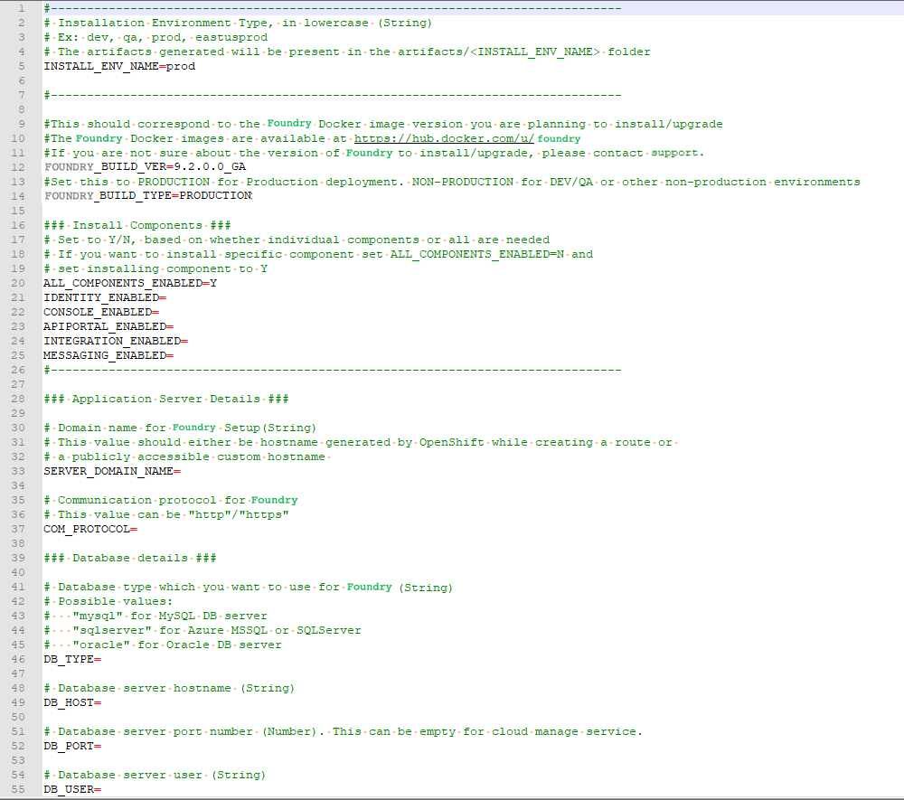

For more information about the properties, refer to the following section.


<details close markdown="block"><summary id="config-properties">config.properties</summary>

1.  **INSTALL_ENV_NAME**: The install environment name must be a in string value in lowercase. For example: `dev`, `qa`, `prod`, or `eastusprod`.
2.  **VOLTMX_FOUNDRY_BUILD_VER**: The build version of Foundry that you want to install. While upgrading, this specifies the build version to which you want to upgrade.
3.  **VOLTMX_FOUNDRY_BUILD_TYPE**: The type of Foundry environment that must be created. For production environments, the value must be `PRODUCTION`. For dev, QA, or other non-production environments, the value must be `NON-PRODUCTION`.  

4.  **Install Components**: The following properties must be set to either Y (yes) or N (no). Make sure that at least one of the following input properties must be set to Y. If ALL_COMPONENTS_ENABLED is set to Y, the rest of the inputs can be left empty.

    *   ALL_COMPONENTS_ENABLED
    *   INTEGRATION_ENABLED
    *   IDENTITY_ENABLED
    *   MESSAGING_ENABLED
    *   CONSOLE_ENABLED
    *   APIPORTAL_ENABLED
5.  **Application Server Details**  <a id="Application-Server-Details"></a> 
    *   **SERVER_DOMAIN_NAME**: The **Domain Name** for Volt MX Foundry. This value should be the hostname of the LoadBalancer. For example: abc.companyname (DNS name).
    *   **COM_PROTOCOL**: The communication protocol for Volt MX Foundry. This value can be either http or https.
    *   **PASSTHROUGH_ENABLED**: Enables HTTPS passthrough mode while creating routes from the OpenShift Console.    
    *   **KEYSTORE_FILE**: The path to an existing keystore file, which must be a valid jks file. This parameter can be left empty for HTTP and HTTPS without passthrough.   
    *   **KEYSTORE_FILE_PASS**: The password for the jks file that is specified in the KEYSTORE_FILE parameter.  
    *   **KEYSTORE_FILE_PASS_SECRET_KEY**: The secret key for the Keystore password. This parameter is required if you are using an encrypted Keystore password.
6.  **Database Details** <a id="Database"></a>
    *   **DB_TYPE** - The Database type that is used to host Volt MX Foundry. The possible values are:
        *   For MySQL DB server: `mysql`
        *   For Azure MSSQL or SQL Server: `sqlserver`
        *   For Oracle DB server: `oracle`
    *   **DB_HOST** - The Database Server hostname that is used to connect to the Database Server.
    *   **DB_PORT**– The Port Number that is used to connect to the Database Server. This can be empty for cloud manage service.
    *   **DB_USER** - The Database Username that is used to connect to the Database Server.
    *   **DB_PASS** - The Database Password that is used to connect to the Database Server. Make sure that the value is enclosed in single quotes, for example, `'password'`.
    *   **DB_PASS_SECRET_KEY** - This is the decryption key for the database password, which is required only if you are using an encrypted password.
    *   **DB_PREFIX** – This is the Database server prefix for Volt MX Foundry Schemas/Databases.
    *   **DB_SUFFIX** – This is the Database server suffix for Volt MX Foundry Schemas/Databases.

    >  ***Note:***
    >  *   Database Prefix and Suffix are optional inputs.
    >  *   In case of upgrade, ensure that the values of the Database Prefix and Suffix that you provide are the same as you had provided during the initial installation.

    *   If **DB_TYPE** is set as **oracle**, the following String values must be provided:
        *   **DB_DATA_TS**: Database Data tablespace name.
        *   **DB_INDEX_TS**: Database Index tablespace name.
        *   **DB_LOB_TS**: Database LOB tablespace name.
        *   **DB_SERVICE**: Database service name.
    *   **USE_EXISTING_DB**: If you want to use an existing database from a previous Volt MX Foundry instance, set this property to Y. Otherwise, set the property to N.

        If you want to use an existing database, you must provide the location of the previously installed artifacts (the location must contain the `upgrade.properties` file).

        For example: **PREVIOUS_INSTALL_LOCATION** = `/C/voltmx-foundry-containers-onprem/kubernetes`.

7.  **Time Zone**: The time zone must be set to maintain consistency between the application server and the database. This section contains the following property:
    *   **TIME_ZONE**: The country code of the time zone from the tz database. For more information, refer to [List of tz database time zones](https://en.wikipedia.org/wiki/List_of_tz_database_time_zones). The default value is **UTC**.
8.  **Readiness and Liveness Probes Details**: The readiness and liveness probes are used to check the status of a container. The probes can check whether a container is ready to receive traffic, or if a container can be stopped and restarted. The following properties specify the initial delay (in seconds) of the probes for the Foundry components:
    *   IDENTITY_READINESS_INIT_DELAY
    *   IDENTITY_LIVENESS_INIT_DELAY
    *   CONSOLE_READINESS_INIT_DELAY
    *   CONSOLE_LIVENESS_INIT_DELAY
    *   INTEGRATION_READINESS_INIT_DELAY
    *   INTEGRATION_LIVENESS_INIT_DELAY
    *   ENGAGEMENT_READINESS_INIT_DELAY
    *   ENGAGEMENT_LIVENESS_INIT_DELAY
9.  **Minimum and Maximum RAM percentage Details**: These properties specify the minimum and maximum RAM (in percentage) that a Foundry component can use on the server. For example: `CONSOLE_MAX_RAM_PERCENTAGE="80"`. This section contains the following properties:
    *   CONSOLE_MIN_RAM_PERCENTAGE
    *   CONSOLE_MAX_RAM_PERCENTAGE
    *   ENGAGEMENT_MIN_RAM_PERCENTAGE
    *   ENGAGEMENT_MAX_RAM_PERCENTAGE
    *   IDENTITY_MIN_RAM_PERCENTAGE
    *   IDENTITY_MAX_RAM_PERCENTAGE
    *   INTEGRATION_MIN_RAM_PERCENTAGE
    *   INTEGRATION_MAX_RAM_PERCENTAGE
    *   APIPORTAL_MIN_RAM_PERCENTAGE
    *   APIPORTAL_MAX_RAM_PERCENTAGE
10. **Container resource limits for memory and CPU**: The resource limits are used to restrict resource usage for the Foundry components. The values must be provided in gigabytes (G) or megabytes (m). For example: `CONSOLE_RESOURCE_REQUESTS_CPU="300m"`. This section contains the following properties:  
    *   IDENTITY_RESOURCE_MEMORY_LIMIT
    *   IDENTITY_RESOURCE_REQUESTS_MEMORY
    *   IDENTITY_RESOURCE_REQUESTS_CPU
    *   CONSOLE_RESOURCE_MEMORY_LIMIT
    *   CONSOLE_RESOURCE_REQUESTS_MEMORY
    *   CONSOLE_RESOURCE_REQUESTS_CPU
    *   APIPORTAL_RESOURCE_MEMORY_LIMIT
    *   APIPORTAL_RESOURCE_REQUESTS_MEMORY
    *   APIPORTAL_RESOURCE_REQUESTS_CPU
    *   INTEGRATION_RESOURCE_MEMORY_LIMIT
    *   INTEGRATION_RESOURCE_REQUESTS_MEMORY
    *   INTEGRATION_RESOURCE_REQUESTS_CPU
    *   ENGAGEMENT_RESOURCE_MEMORY_LIMIT
    *   ENGAGEMENT_RESOURCE_REQUESTS_MEMORY
    *   ENGAGEMENT_RESOURCE_REQUESTS_CPU
11. **Custom JAVA_OPTS Details**: The custom JAVA_OPTS properties specify Java options that must be configured for the Foundry components on the application server. The following properties can be used to configure additional Java options for the Foundry components:
    *   CONSOLE_CUSTOM_JAVA_OPTS
    *   ENGAGEMENT_CUSTOM_JAVA_OPTS
    *   IDENTITY_CUSTOM_JAVA_OPTS
    *   INTEGRATION_CUSTOM_JAVA_OPTS
    *   APIPORTAL_CUSTOM_JAVA_OPTS
12. **Number of instances to be deployed for each component**: These properties specify the number of instances that must be deployed for every component. This section contains the following properties:
    *   IDENTITY_REPLICAS
    *   CONSOLE_REPLICAS
    *   APIPORTAL_REPLICAS
    *   INTEGRATION_REPLICAS
    *   ENGAGEMENT_REPLICAS

</details>


## <a name="Deploying_Foundry"></a>Deploy Foundry on OpenShift

After you update the `config.properties` file, follow these steps to deploy Volt MX Foundry on OpenShift:  

<ol>
  <li>
    <p>Create a project from the oc command line or from the OpenShift console. For example:</p>
    <pre><code style="display:block;background-color:#eee;">oc new-project foundrytest</code></pre>
  </li>
  <li>
    <p>Generate the Foundry services by running the following command:</p>
    <pre><code style="display:block;background-color:#eee;">./generate-kube-artifacts.sh config.properties svcs</code></pre>
    <p>To generate the services configuration, you only need to fill the <code>INSTALL_ENV_NAME</code> property and the <b>## Install Components ###</b> section in the <code>config.properties</code> file.</p>
    <pre>
    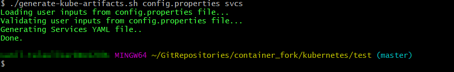
    </pre>
  </li>

  <li>
    <p>Create the services by running the following command:</p>
    <pre><code style="display:block;background-color:#eee;">oc apply -f ./artifacts/&lt;INSTALL_ENV_NAME&gt;/foundry-services.yml</code></pre>
   The &lt;INSTALL_ENV_NAME&gt; is the install environment name input as provided in the <code>config.properties</code> file.
  </li>
  <li>
    <p>Follow either of the following steps to expose Foundry publicly.</p>
    <ul>
        <li>For development or proof of concept, using HTTP (non-SSL) routes and OpenShift generated hostnames is a quick way to get started. Create the routes from the OpenShift console or by running the following command:
        <pre><code style="display:block;background-color:#eee;">oc expose service/&lt;foundry-service&gt; --path=&lt;context_path&gt; --name=&lt;route_name&gt;</code></pre>
        For <code>&lt;foundry-service&gt;</code> and <code>&lt;context-path&gt;</code>, refer to <a href="configuration_and_setup.html#Context">Context paths for Foundry components.</a> The <code>&lt;foundry-service&gt;</code> is one of the Foundry services that were created earlier.
        <br>
        Executing the <code>oc expose service</code> command assigns a unique OpenShift generated host name to the route that is created. The assigned host name can be identified by executing the following command:
		
        <pre><code style="display:block;background-color:#eee;">oc describe route &lt;foundry-route&gt;</code></pre>
		
        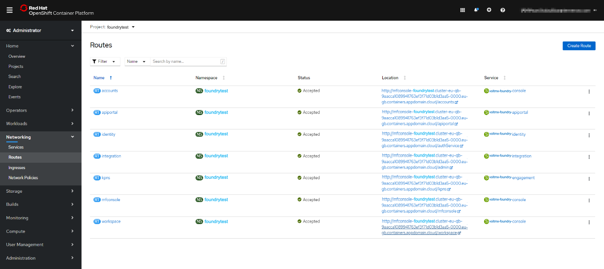
        </pre>
        </li>
        <li>
            <p>For production, Volt MX recommends that you use a custom domain name and terminate your SSL connection at the public load balancer. You need to obtain a custom domain name from a DNS provider, and SSL certificate and keys from a certificate authority. For more information, refer to <a href="https://cloud.ibm.com/docs/openshift?topic=openshift-openshift_routes">Exposing apps with routes in OpenShift 4.</a></p>
            <blockquote><em><b>Note: </b></em>The route types <b>Reencrypt</b> and <b>Passthrough</b> are not supported.</blockquote>
           For a sample configuration, refer to the following screenshot.
           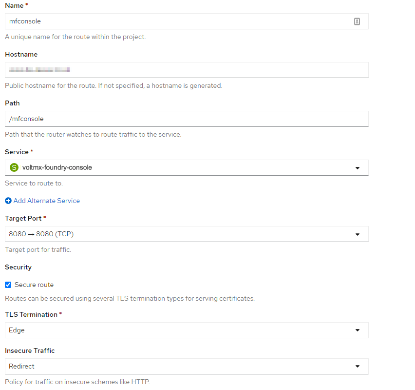
           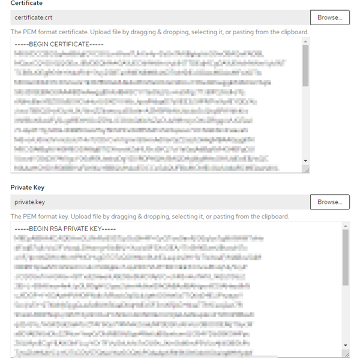        
           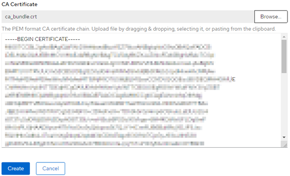
           
        </li>
    </ul>
  </li>
</ol>  


### <a name="ConfigurePassthroughRoutes"></a>Configure Passthrough Routes

To configure the passthrough, you need to create a secure route for the Foundry component. To do so, follow these steps:

1. On the **Create Route** page, configure details for the Foundry component.
   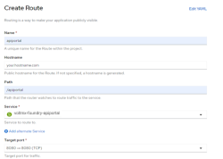

    > **_Note:_** The details in the screenshot are specific to the API Portal component and use a specific domain. Make sure that you change the details for other routes. For more information, refer to [Context paths and Service Names for Fabric components](#Context).  


2. Under **Security**, select the **Secure Route** check box.

3. From the **TLS termination** list, select **Passthrough**.
    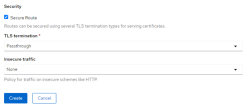

4. Provide the required values in the [Application Server Details](#Application-Server-Details) section of the [config.properties](#config-properties) file.


### <a name="Context"></a>Context paths and Service Names for Foundry components

> ***Note:*** 

  >*   Make sure that you use the same host name for all the Foundry routes that you plan to create.
  >*   The Foundry components for **accounts**, **mfconsole**, and **workspace** share the same deployment and service. Therefore, while creating the ingress objects for **accounts**, **mfconsole**, and **workspace**, the paths are mapped to the same service: **voltmx-foundry-console**.

Make sure that the format of the route location is as follows:

<pre><code style="display:block;background-color:#eee;">&lt;scheme&gt;://&lt;common_domain_name&gt;/&lt;foundry_context_path&gt;</code></pre>

For example, `https://voltmx-foundry.domain/mfconsole`

Reference table for the mapping of paths and service names:

<table style="border-top-left-radius: 0px;border-top-right-radius: 0px;border-bottom-right-radius: 0px;border-bottom-left-radius: 0px;border-left-style: solid;border-left-width: 2px;border-left-color: #a9a9a9;border-right-style: solid;border-right-width: 2px;border-right-color: #a9a9a9;border-top-style: solid;border-top-width: 2px;border-top-color: #a9a9a9;border-bottom-style: solid;border-bottom-width: 2px;border-bottom-color: #a9a9a9;margin-left: 0;margin-right: auto;mc-table-style: url('Resources/TableStyles/Basic.css');" class="TableStyle-VoltMXTables" cellspacing="0"><colgroup><col style="width: 15%;" class="TableStyle-VoltMXTables-Column-Column1"> <col style="width: 15%;" class="TableStyle-VoltMXTables-Column-Column1"> <col style="width: 15%;" class="TableStyle-VoltMXTables-Column-Column1"></colgroup>

<thead>

<tr class="TableStyle-VoltMXTables-Head-Header1">

<th class="TableStyle-VoltMXTables-HeadE-Column1-Header1" style="text-align: left;" scope="col">Foundry Component</th>

<th class="TableStyle-VoltMXTables-HeadE-Column1-Header1" style="text-align: left;" scope="col">Foundry Service Name</th>

<th class="TableStyle-VoltMXTables-HeadD-Column1-Header1" style="text-align: left;" scope="col">Context Path</th>

</tr>

</thead>

<tbody>

<tr class="TableStyle-VoltMXTables-Body-Body1">

<td style="text-align: left;" class="TableStyle-VoltMXTables-BodyE-Column1-Body1">mfconsole</td>

<td style="text-align: left;" class="TableStyle-VoltMXTables-BodyE-Column1-Body1">voltmx-foundry-console</td>

<td style="text-align: left;" class="TableStyle-VoltMXTables-BodyD-Column1-Body1">/mfconsole</td>

</tr>

<tr class="TableStyle-VoltMXTables-Body-Body1">

<td style="text-align: left;" class="TableStyle-VoltMXTables-BodyE-Column1-Body1">workspace</td>

<td style="text-align: left;" class="TableStyle-VoltMXTables-BodyE-Column1-Body1">voltmx-foundry-console</td>

<td style="text-align: left;" class="TableStyle-VoltMXTables-BodyD-Column1-Body1">/workspace</td>

</tr>

<tr class="TableStyle-VoltMXTables-Body-Body1">

<td style="text-align: left;" class="TableStyle-VoltMXTables-BodyE-Column1-Body1">accounts</td>

<td style="text-align: left;" class="TableStyle-VoltMXTables-BodyE-Column1-Body1">voltmx-foundry-console</td>

<td style="text-align: left;" class="TableStyle-VoltMXTables-BodyD-Column1-Body1">/accounts</td>

</tr>

<tr class="TableStyle-VoltMXTables-Body-Body1">

<td style="text-align: left;" class="TableStyle-VoltMXTables-BodyE-Column1-Body1">Identity</td>

<td style="text-align: left;" class="TableStyle-VoltMXTables-BodyE-Column1-Body1">voltmx-foundry-identity</td>

<td style="text-align: left;" class="TableStyle-VoltMXTables-BodyD-Column1-Body1">/authService</td>

</tr>

<tr class="TableStyle-VoltMXTables-Body-Body1">

<td style="text-align: left;" class="TableStyle-VoltMXTables-BodyE-Column1-Body1">Integration</td>

<td style="text-align: left;" class="TableStyle-VoltMXTables-BodyE-Column1-Body1">voltmx-foundry-integration</td>

<td style="text-align: left;" class="TableStyle-VoltMXTables-BodyD-Column1-Body1">/admin</td>

</tr>

<tr class="TableStyle-VoltMXTables-Body-Body1">

<td style="text-align: left;" class="TableStyle-VoltMXTables-BodyE-Column1-Body1">Services</td>

<td style="text-align: left;" class="TableStyle-VoltMXTables-BodyE-Column1-Body1">voltmx-foundry-integration</td>

<td style="text-align: left;" class="TableStyle-VoltMXTables-BodyD-Column1-Body1">/services</td>

</tr>

<tr class="TableStyle-VoltMXTables-Body-Body1">

<td style="text-align: left;" class="TableStyle-VoltMXTables-BodyE-Column1-Body1">apps</td>

<td style="text-align: left;" class="TableStyle-VoltMXTables-BodyE-Column1-Body1">voltmx-foundry-integration</td>

<td style="text-align: left;" class="TableStyle-VoltMXTables-BodyD-Column1-Body1">/apps</td>

</tr>

<tr class="TableStyle-VoltMXTables-Body-Body1">

<td style="text-align: left;" class="TableStyle-VoltMXTables-BodyE-Column1-Body1">Engagement</td>

<td style="text-align: left;" class="TableStyle-VoltMXTables-BodyE-Column1-Body1">voltmx-foundry-engagement</td>

<td style="text-align: left;" class="TableStyle-VoltMXTables-BodyD-Column1-Body1">/kpns</td>

</tr>

<tr class="TableStyle-VoltMXTables-Body-Body1">

<td style="text-align: left;" class="TableStyle-VoltMXTables-BodyB-Column1-Body1">ApiPortal</td>

<td style="text-align: left;" class="TableStyle-VoltMXTables-BodyB-Column1-Body1">voltmx-foundry-apiportal</td>

<td style="text-align: left;" class="TableStyle-VoltMXTables-BodyA-Column1-Body1">/apiportal</td>

</tr>

</tbody>

</table>


### <a name="Additional"></a>Additional Resources

You can also use automatic certificate management for your cluster. To automate with OpenShift routes, you can use the open-source project [openshift-acme](https://github.com/tnozicka/openshift-acme). To automate with Kubernetes Ingress, you can use [cert-manager](https://github.com/jetstack/cert-manager).

Alternatively, if you are using a managed OpenShift service, the public cloud vendor might offer a key manager service, such as [Certificate Manager](https://cloud.ibm.com/catalog/services/certificate-manager) on IBM Cloud.


### <a name="Deploying_Artifacts"></a>Deploy Kubernetes artifacts

After deploying the Foundry and creating routes for the components, follow these steps to deploy the remaining Foundry Kubernetes artifacts:  


<ol>
  <li>
    <p>In the <code>config.properties</code> file, in the <code>SERVER_DOMAIN_NAME</code> field, add the custom host name or the host name that was generated while creating the routes.</p>
  </li>
  <li>
    <p>In the <code>config.properties</code> file, update the <b>Database Details</b> section with appropriate information.</p>
  </li>
  <li>
    <p>Generate the Foundry application and database configuration files by executing the following command.</p>
    <pre><code style="display:block;background-color:#eee;">./generate-kube-artifacts.sh config.properties</code></pre>
    <pre>

</pre>
  </li>
  <li>
    <p>Edit the <b>privileged</b> security context by running the following command, and then add the service account that corresponds to your project.</p>
    <pre><code style="display:block;background-color:#eee;">oc edit scc privileged</code></pre>
<br>
For example: In the following screenshot, <b>foundrytest</b> is the project and <b>default</b> is the service account that is being used.
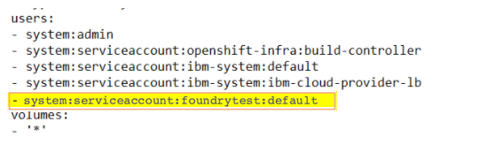

    <blockquote>
      <em><b>Note:</b></em> Adding the service account to the privileged security context is only needed to create the database schema in the following step. After the execution of the Foundry database job is completed, you can remove the service account from the privileged security context.
    </blockquote>
  </li>
  <li>
    <p>Create the database schema by executing the following command.</p>
    <pre><code style="display:block;background-color:#eee;">oc apply -f ./artifacts/&lt;INSTALL_ENV_NAME&gt;/foundry-db.yml</code></pre>
The &lt;INSTALL_ENV_NAME&gt; is the name of the install environment that you provided in the <code>config.properties</code> file.

  </li>
  <li>
    <p>After the database schema creation is completed, verify the completion by executing the following command.</p>
    <pre><code style="display:block;background-color:#eee;">oc get jobs</code></pre>
    <pre>
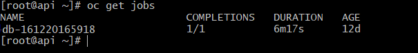
</pre>
  </li>
  <li>
    <p>Create the Foundry deployments by executing the following command.</p>
    <pre><code style="display:block;background-color:#eee;">oc apply -f ./artifacts/&lt;INSTALL_ENV_NAME&gt;/foundry-app.yml</code></pre>
    <br>Based on the <code>default replica count</code> that is provided in the <code>config.properties</code> file, one deployment of every Foundry component is created. Based on your requirements, the Foundry deployments can be scaled up from the OpenShift Console, or from the command line.
  </li>
</ol>

## Deploy Fabric using Helm Charts

To deploy Fabric by using Helm charts, make sure that you have installed Helm, and then follow these steps:

1. Open a terminal console and navigate to the extracted folder.

2. Generate the Fabric services by running the following command:

    ```
    ./generate-kube-artifacts.sh config.properties svcs
    ```

    To generate the services configuration, you only need to fill the `INSTALL_ENV_NAME` property and the ## Install Components ### section in the `config.properties` file.

3. Navigate to the `helm_charts` folder by executing the following command.

    ```
    cd helm_charts
    ```

4. Create the `fabricdb` and `fabricapp` Helm charts by executing the following commands.

    ```
    helm package fabric_db/
    ```

    ```
    helm package fabric_app/
    ```

5. Install the `fabricdb` Helm chart by executing the following command.

    ```
    helm install fabricdb  fabric-db-<Version>.tgz
    ```

6. Install the fabricapp Helm chart by executing the following command.

    ```
    helm install fabricapp  fabric-app-<Version>.tgz
    ```

> **IMPORTANT:**
>
> * Make sure that you generate the artifacts (generate-artifacts.sh) before creating the Helm charts.
> * Make sure that the fabricdb Helm chart installation is complete before installing the fabricapp Helm chart.

## <a name="Launching"></a>Launch the Foundry Console

1.  After all the Foundry services are up and running, launch the Foundry console by using the following URL.  

    <pre><code style="display:block;background-color:#eee;">&lt;scheme&gt;://&lt;foundry-hostname&gt;/&lt;mfconsole&gt;</code></pre> 

    The <code>&lt;scheme&gt;</code> is <code>&lt;http&gt;</code> or <code>&lt;https&gt;</code> based on your domain. The <code>&lt;foundry-hostname&gt;</code> is the host name of your publicly accessible Foundry domain.

2.  After you launch the Foundry Console, create an administrator account by providing the appropriate details.
<!--
    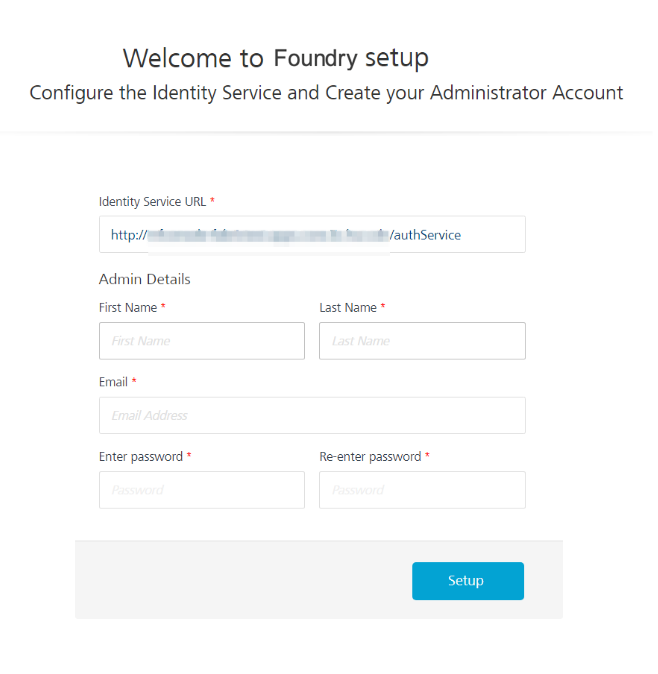
-->
After you create an administrator account, you can sign-in to the Foundry Console by using the credentials that you provided.

## Logging Considerations

All Foundry application logs will be streamed to the Standard Output (stdout). You can view the logs by using the `kubectl logs` command. For more details refer to [Interacting with running Pods](https://kubernetes.io/docs/reference/kubectl/cheatsheet#interacting-with-running-pods).