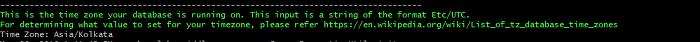
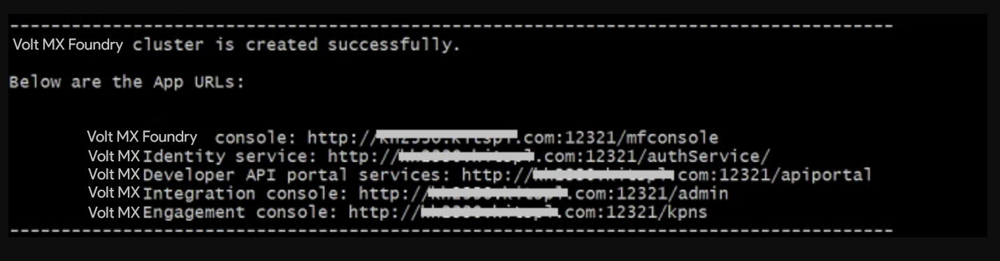

Overview - Volt Foundry Single Container Solution
===================================================

The Volt Foundry Single Container On-Premises solution offers a quick way to set up Volt Foundry on your local environment. It leverages the following technology:

*   **Docker** - To package different components as portable container images (with all the required binaries and libs).

Salient Features
----------------

The Volt Foundry Single Container Solution provides developers with tools to build applications.

The Volt Foundry Single Container Solution has the following features:

*   Deploys Volt Foundry on a native Docker container.
*   Supports multi-platform deployment in Windows, Linux, and macOS.
*   Deploys MySQL container along with Foundry for developer use.

Prerequisites
-------------

*   Install `Docker Engine version 26.0.0` and `Docker Compose version 2.24.6`.
    
    > **Note:** For Windows and macOS, you can download and install the package installer for `Docker Desktop version 4.28.0 (139021)`. For Linux, you must install Docker Engine and Docker Compose separately.  
        
*   On Windows machines, use any bash/shell prompt to execute the install-foundry.sh script. macOS and Linux support Bash prompt by default. install-foundry.sh is located in `VoltFoundrySingleContainer-<version>_GA.zip`, which you will download to start the installation. See <a href="#installation">Installation</a> for details.
*   Install Java 11.
*   Install an external Database. (The supported types are mentioned [here](#supported-databases).)

    > **Note:** The Single Container Solution comes with built-in MySQL, which will deploy alongside the Volt Foundry container. This can be used for developer use. Please refer to the Configuration section for more details. For other supported databases, Volt Foundry requires an existing external database.

> **Note:**

>   *   To execute the installation scripts, you must use **Bash version 4** or later.  
>   *   To avoid an unknown host exception, make sure that the IP address is configured with the hostname. To do so, follow the steps that are mentioned in the [FAQs section](#faqs-and-troubleshooting).  

Software Requirements
---------------------

### Recommended Operating Systems

HCL recommends using the following operating systems to install Volt Foundry Single Container Solution:

  
| Operating System | Recommended Version |
| --- | --- |
| Microsoft Windows | Windows 10 Pro or Windows 11 Pro |
| Linux | RHEL 9.0 or Ubuntu 22.04 |
| macOS | Ventura |

### Supported Application Servers

Volt Foundry Single Container Solution supports only the **Tomcat Application server**.

All the Docker images built for Volt Foundry are built using the `Tomcat version 9.0.62-jdk11.0.13` as the base image.

### Supported Databases

Volt Foundry Single Container Solution supports the following database servers:

  
| Database Type | Version Supported |
| --- | --- |
| MySQL | 8.0 |
| Microsoft SQL Server | 2017,2019,2022 |
| MySQL Database HA (active/passive) Cluster | 8.0 |
| Oracle | 19c |

Hardware Requirements
---------------------

*   **CPU**: Dual-core processor
*   **Memory**: A minimum RAM of 8 GB is required. HCL recommends using a system with 16 GB RAM.

Architecture
------------

For flyway migrations, a container with database image (voltmx-foundry-db) is created. The database image is terminated after all the migrations are completed.

After the migrations are completed, the second container will run the Volt Foundry Docker single image (voltmx-foundry-all). This container keeps running in the background for as long as the Volt Foundry setup is required.

Following are the two containers present in the Volt Foundry Single Container Solution:

*   Volt Foundry
*   Database (exists on completion of the Database scripts execution)

The following is the list of Docker images used in the Volt Foundry Single Container Solution:

*   Foundry (contains `mfconsole.war`,   `workspace.war`, `accounts.war`, `apiportal.war`, `authService.war`, `admin.war`, `services.war`, `middleware.war`, `apps.war`, and `vpns.war`)
*   Database (contains database migration scripts)


The docker images will be pulled when you execute the installation scripts in the "HCL Volt Foundry Container Installer" found on HCL's FNO download website. To download "HCL Volt Foundry Single Container Installer (Docker)", log on to "https://hclsoftware.flexnetoperations.com/flexnet/operationsportal/entitledDownloadFile.action?downloadPkgId=HCL_Volt_Foundry_v9.5_Latest&orgId=HCL.


To pull the images, use this docker command.

<!-- `docker pull hclcr.For eio/Volt/Volt-foundry-console:9.2.0.0_GA` -->

`docker pull https://hclcr.io/harbor/projects/47/repositories/voltmx-foundry-all:<version_tag>`

&lt;version_tag&gt; is the Volt Foundry version; for example, `9.5.15.10_GA`

Volt Foundry Single Container Solution downloadable bundle contains the following directories and files.


*   **install-foundry.sh** - Installation script
*   **install-actions.sh** - Installation actions script
*   **templates** - Directory containing the config template files
*   **config.properties** - Properties file to pass the inputs to install-foundry.sh instead of giving inputs in shell prompts.
*   **lib** - Folder containing the foundry-utils.jar file.
*   **foundry** - Folder containing the docker-compose.yml file.
*   **flyway** - Folder containing the docker-compose.yml file.

Installation Types
------------------

*   **Command Line or GUI Installation** - Volt Foundry Single Container Solution can be installed using the bundled install shell script, which will prompt the user for the required values.
*   **Silent Installation** - The installation script also supports silent installation if the config.properties file is passed as an argument (for example, /path/install-foundry.sh config.properties). Using this, you can have additional ability to pass custom Tomcat JAVA\_OPTS, and time-zone settings as well.  


Configuration
-------------

The following parameters must be provided by the user during installation:

*   **Install Environment Name** - The install environment name can be anything, for example, `dev`, `qa`, `prod`, or `eastusprod`.

    > **_Note:_** The Install Environment Name must not contain numbers.

*   **FABRIC_BUILD_VERSION** and **FABRIC_DATABASE_BUILD_VERSION** - For each, the value should be in the format "9.2.0.0_GA". This should correspond to the Foundry Docker image version you are planning to install/upgrade. The Foundry Docker images are available at [https://hclcr.io/harbor/projects/47/repositories](https://hclcr.io/harbor/projects/47/repositories). If you are not sure about the version of Foundry to install or upgrade, please contact HCL support.

*   **FABRIC_BUILD_TYPE** - Set this to `PRODUCTION`	 for Production deployment or `NON-PRODUCTION` for DEV/QA or other non-production environments.

*   **Application Server Details**:
    
    *   **Domain Name**: The Domain Name for Volt Foundry.  
        
        > **_Note:_** Domain name must not be a dynamic IP address or 'localhost'. Although, the domain name can be a static IP address.
        
    *   **Server Port** - The Port Number for Volt Foundry.  
        
        > **_Note:_** Ensure that the specified port is not being used by another service. The default 8443 or 8080 ports are exposed inside the container and the server port which user provides is to expose the service outside the container.
        
    *   **COM\_PROTOCOL**: The communication protocol that is used for Volt Foundry. This value can be either **http** or **https**.
    
    *   **KEYSTORE\_FILE** : The path to the existing Keystore file. The path should point to a valid `JKS` file. This value can be empty if the communication protocol is HTTP.
    
    *   **KEYSTORE\_FILE\_PASS**: Password for the Keystore (`JKS`) file. This value can be empty if the communication protocol is HTTP. Please enter it in double quotes. 

    <a name="DatabaseDetails"></a> 
    
*   **Database Details**:
    
    *   **Database Type** - This is the Database Type you want to use for hosting Volt Foundry.

    *   **IS_MYSQL_CONTAINER_REQUIRED** This value can be true/false  

        > **_Note:_** When the value is true, **MYSQL 8.0.31** will come with Foundry Scripts. Please note that the DB_HOST, DB_PORT and DB_USER will be defaulted for MySQL Container and need not be entered.

    *   **Database Hostname** - This is the Database Server hostname used to connect to the Database Server.

    *   **Database Port Number**– This is the Port Number used to connect to the Database Server.

    *   **Database Username** - This is the preferred Database Username used to connect to the Database Server.

    *   **Database Password** - This is the Database Password used to connect to the Database Server.  
        
        > **_Note:_** The Password must be a string containing at least 8 characters, and must include at least one uppercase letter, one lowercase letter, one digit and one special character.
    
    *    **Database Password Secret Key** - This is the decryption key for the database password, which is required only if you are using an encrypted password.

         > **IMPORTANT:** If you are using an encrypted password, use the values that you receive from the encryption utility. For more information, refer to [Encrypting the Database Password](Single_Container_Appendices.md).
		 
    *   **Database Prefix** – This is the Database server prefix for Volt Foundry Schemas/Databases.

    *   **Database Suffix** – This is the Database server suffix for Volt Foundry Schemas/Databases.  

        > **_Note:_** In case of upgrade, ensure that the values of the Database Prefix and Suffix you provide are those you provided during the initial installation.
		
        > **_Note:_** Before each installation attempt, update the prefix and suffix to avoid configuration issues that might result in mfconsole showing 500 error.
		
        > **_Note:_** If DB_TYPE is "oracle", the following values need to be set:
		
        > * DB_DATA_TS - Database Data tablespace name (String)
        > * DB_INDEX_TS - Database Index tablespace name (String)
        > * DB_LOB_TS - Database LOB tablespace name (String)
        > * DB_SERVICE - Database service name (String)

    *   **USE_EXISTING_DB** - Use existing databases from a previous Volt Foundry instance? (Y/N)

    
*   **Automatic Registration Details** (not applicable for upgrade):

    *   **User Id** – E-mail ID used for Volt Foundry Registration.
    *   **Password** – Password used for Volt Foundry Registration.
    *   **First Name** – First Name used for Volt Foundry Registration.
    *   **Last Name** – Last Name used for Volt Foundry Registration.
    *   **Environment Name** – The Volt Foundry Environment to publish generated applications.

*   **Time Zone** - The Time Zone of the Database used for Volt Foundry installation.
    
    > **_Note:_** The Time Zone is an optional value. If you do not provide any Time Zone, it is set to Etc/UTC.
    

<a name="installation"></a> 

Installation
------------

Run the Volt Foundry Single Container install script to generate and deploy Volt Foundry containers.

**Steps to Install Volt Foundry Single Container Solution on On-Premises:**

1.  Download the **` VoltFoundrySingleContainer-<version>_GA.zip`** from [downloads](https://hclsoftware.flexnetoperations.com/flexnet/operationsportal/entitledDownloadFile.action?downloadPkgId=HCL_Volt_Foundry_v9.5_Latest&orgId=HCL) and extract it. The file structure will be as shown below:
    
```
config.properties
install-foundry.sh
install-actions.sh
  lib/
  templates/
  foundry/
  flyway/
```

2.  To run the installation script in silent mode using ./install-foundry.sh config.properties, make sure before running to update the values in config.properties files according the comments provided above the values. This mode is recommended as it is easy to review and edit inputs if required instead of entering all the inputs again as in interactive mode.    

3.  To run the installation script in interactive mode, run the `install-foundry.sh` file.

    > **_Note:_** You must provide **execute** permissions to run the `install-foundry.sh` and `install-actions.sh` files on Linux and macOS.

4.  When prompted, enter the required details. For correct values, see [Configuration](#configuration).
    
    
    
    > **_Note:_** Domain name cannot be a dynamic IP address or 'localhost', but can be a static IP address.

6.  Enter the database details.  For correct values, see [Configuration](#configuration).
    
    
    
    > **_Note:_** If you are upgrading using an existing database, you must also provide the **Previous install artifact directory**, which is the location of your existing Volt Foundry instance.

> **_Note:_**  

> *   Ensure that the database details you provide point to an existing database instance.  
> *   In case of upgrade, ensure that the database points to the existing instance of the database running Volt Foundry.  
> *   Database Hostname cannot be localhost.  
> *   If the Database Prefix or Suffix contain numeric characters, enclose the values in single quotes (' ').  
> *   In case of upgrade, ensure that the values of the Database Prefix and Suffix that you provide are the same as you had provided during the initial installation.  

8.  Enter the Administration Account Configuration details as shown:
    
    > **_Note:_** This step is not applicable for upgrades. You can use the credentials that you used to create the initial account.
    
    
    
    > **_Note:_** The Password must contain at least 8 characters, at most 20 characters and must include at least one uppercase letter, one lowercase letter, one digit and one special character.
    
9.  Enter the Time Zone of your Database as shown:  
      
    
    > **_Note:_** The Time Zone is an optional value. If you do not provide any Time Zone, it is set to Etc/UTC.
    

Once all the input parameters are given, the installation procedure starts.  


> **_Note:_** Auto Registration will not occur during upgrade.

After successful completion of execution, the Volt Foundry URLs are displayed on the screen.



Limitations
-----------

Volt Foundry Single Container Solution has the following limitations:

*   Support for **SPA / Desktop Web** is only available for zipped SPA apps, but not for WARs.
*   **Log Analytics** is currently not supported.

FAQs and Troubleshooting
------------------------

*   **Do I need to have an account with the HCL Harbor to pull the Volt Foundry Images?**
    
    No. The images are public, and you do not need any authorization to download them.
    
*   **How should I restart a container that has been killed?**
    
    To restart a container you must do the following:
    
    *   Go to Downloads (the folder you downloaded and extracted it to) > `VoltMXFoundrySingleContainer-9.x.x.x-GA/foundry-<NUMBER>/` folder. &lt;NUMBER&gt; is a random number generated during installation.
	
    *   Run the command: `docker-compose up -d`.
    
*   **How to configure the IP address as the hostname to avoid an unknown host exception?**
    
    1. Update the hostname and IP in the hosts file.

      *   For **Linux**: `“/etc/hosts”`
      *   For **Windows 10 and 8**: `“c:\Windows\System32\Drivers\etc\hosts”`
      *   For **macOS**: `/private/etc/hosts`
      *   Once the file is updated with <IP> SPACE <HOSTNAME>, save and close the file.
        
          > **_Note:_** In case you still face an issue with the hostname resolution, you must flush the DNS cache.
        
    2.  Update `docker-compose.yml` file under `Downloads/VoltMXFoundrySingleContainer-9.x.x.x-GA/foundry/`
	
        *   Add a section under restart key in the following order:
        
            ```
            extra_hosts:  
            - "<HOSTNAME>:<IP>"
			```
        
        Once updated, the file will look like the following image: 
        
    <br/>
    
    
    

Extracting Logs from your Application
-------------------------------------

To perform any actions related to the logs of your application, you need the names or IDs of the containers in the application.

At a bash or CMD prompt, run "docker ps" to get the list of currently running containers. You can then use `docker logs -f <CONTAINER ID>` or `docker logs -f <CONTAINER_NAME>` to get the logs of the desired pod. Please refer to the official <a href="https://docs.docker.com/reference/cli/docker/container/logs/" target="_blank">Docker</a> documentation for more logging options for the container.

If you want to **teletype (tty)** into the container, execute one of the following commands from your terminal:

*   For **Windows**: `winpty docker exec -it <container_name> bash` or `winpty docker exec -it <container_id> bash`
*   For **macOS/Linux**: `docker exec -it <container_name> bash` or `docker exec -it <container_id> bash`

> **_Note:_** A database container terminates after the flyway migrations are complete. As a result, you cannot tty into the database container post installation.

If you want to **copy logs** (for example: Component logs) from the Foundry container to your local machine, execute one of the following commands from your terminal:

`docker cp <container_name>:<location_in_container> <location_in_machine>`

`docker cp <container_id>:<location_in_container> <location_in_machine>`

For example, to copy **authService logs**, execute the following command from your terminal:

`docker cp foundry_tomcat_1:/usr/local/logs/authService.log /d/Foundry/logs`

> **_Note:_** Component logs can be found at `/usr/local/logs` inside the container.

Configuring Iris to connect to Volt Foundry
---------------------------------------------------

For details on configuring Iris to connect to Volt Foundry, refer to [Connect to Volt Foundry](../../../Iris/iris_user_guide/Content/Connect_to_VoltMXFoundry.md?Highlight=foundry) in the Iris User Guide.

<!--comment-->
