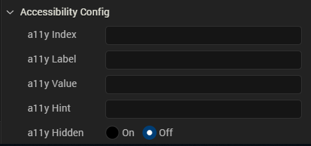

                            

Volt MX  Application Design and Development Guidelines: [Accessibility (508 Compliance)](Accessibility_Overview.md) > [Enable Accessibility in Iris](#enable-accessibility-in-iris) > Configuring Accessibility

Enable Accessibility in Iris
==================================

Volt MX  Iris provides accessibility features to support all the above principles for support to assistive technology, for its widgets and components to be compliant with WCAG 2.0. WCAG 2.0 compliance is not a framework compliance but it applies to the applications designed & developed using the framework. The framework enables (through its features) app design & development to follow this standard. The application design and development requirements would need to adhere to the WCAG 2.0 guidelines while developing the application. This along with the features that the platform exposes would ensure compliance to WCAG 2.0.

The built-in assistive technology in the iOS and Android platforms reads some basic widgets of Volt MX Iris, such as Button, Label, and TextBox. The assistive technology in iOS and Android platforms read the information differently on other widgets.

Every application that is created using Volt MX Iris is accessible to the built-in assistive technology of the iOS and Android platforms. The way the assistive technology interprets the widget information is left to its individual capability. Developers can enhance the behaviour of assistive technology with the configuration property (explained in the next page) available for each accessibility supported widget.

Configuring Accessibility
-------------------------

To define the Accessibility Config property for a widget from Volt MX Iris, follow these steps:

1.  From the Default Library in Volt MX Iris, drag a widget and drop it onto the canvas. For example, a Button widget.
2.  Select the Button widget and navigate to the Look tab of the Properties pane.
3.  Locate the **Accessibility Config** section, and enter the following values in the respective fields:
    *   **a11yLabel**: Specifies an alternate text to identify the widget. In general, the label must be the text that is displayed on the screen.
    *   **a11yValue**: Specifies the current state/ value associated with the widget so that the user can perform an action. For example, a checkbox is in selected state or unselected state.
    *   **a11yHint**: Specifies the descriptive text that explains the action about the widget.
    *   **a11yHidden**: Specifies if the widget must be ignored by assistive technology.
    *   **a11yIndex**: Specifies the order in which the widgets are focused on the screen while using the assistive technology. This field is applicable only for iOS native platform.
    *   **Tab order**:Specifies the order in which widgets must be focused in a form during navigation. It is linked to a11yARIA\[“tabindex"\] at runtime. This field is applicable for all channels except iOS.
        
        From Volt MX Iris V9 SP2 GA, you can enter the value of tab order as 0 and -1. Prior to V9 SP2, the developer could only set the value from 1. To set the tab order as 0 or -1, the developer had to define the values only through the code.
        
        | Tab Order Value | Description |
        | --- | --- |
        | 0 | This value allows you to configure a non-focusable element to get focus, value also gives first priority to the widget on focus of a form during keyboard navigation. |
        | \-1 | No focus on a form during keyboard navigation. |
        
    *   **a11yARIA**: Specifies the JSON object containing the key-value pairs that are added as the attribute and value to HTML tags respectively. These HTML tags provide the information to the assistive technologies such as screen readers. Any values provided for attributes such as `aria-labelledby` and `aria-describedby` inside this field, takes precedence over values given in `a11yLabel` and `a11yHint` fields. This field is applicable only for Desktop Web platform.

The following image shows the **Accessibility Config** section in the Android platform.

 


The following image shows the **Accessibility Config** section in the iOS native platform.


The following image shows the **Accessibility Config** section in the Desktop Web platform.



> **_Note:_** The **Accessibility Config** section appears on the **Look** tab only when the **Accessibility Config** check box is selected in the **Project Settings > Application**.

For Camera widget, when the capture mode is set to video, you will get additional options to record the video. The below keys are used to configure accessibility for the additional options:

*   **accessibilityConfigCaptureControl**: Provides accessibility support to video capture button.
*   **accessibilityConfigTimerControl**: Provides accessibility support to video timer button.
*   **accessibilityConfigSettingsControl**: Provides accessibility support to video settings button.
*   **accessibilityConfigCancelControl**: Provides accessibility support to video cancel button.
*   **accessibilityConfigVideoStartButton**: Provides accessibility support to video start button.
*   **accessibilityConfigVideoStopButton**: Provides accessibility support to video stop button.

accessibilityConfig Property
----------------------------

In order to support accessibility in Iris, a common property, accessibilityConfig is available in all widgets. This property enables you to control accessibility behavior and alternative text for the widget.

Syntax

accessibilityConfig = {  
"a11yLabel" = "string value",  
"a11yValue" = "string value",  
"a11yHint" = "string value",  
"a11yHidden" = true/false  
}

Type

Object

Read/Write

Read + Write

Remarks

The accessibilityConfig property is enabled for all the widgets which are supported under the Flex Layout.

> **_Note:_** From Volt MX Iris V9 SP2 GA version, you can provide i18n keys as values to all the attributes used inside the `accessibilityConfig` property. Values provided in the i18n keys take precedence over values provided in `a11yLabel`, `a11yValue`, and `a11yHint` fields.

The accessibilityConfig property is a JavaScript object which can contain the following key-value pairs.

| Key | Type | Description | ARIA Equivalent |
| --- | --- | --- | --- |
| a11yIndex | Integer with no floating or decimal number. | This is an optional parameter. Specifies the order in which the widgets are focused on a screen. | For all widgets, this parameter maps to the `aria-index`, `index`, or `taborder` properties. |
| a11yLabel | String | This is an optional parameter. Specifies alternate text to identify the widget. Generally the label should be the text that is displayed on the screen. | For all widgets, this parameter maps to the `aria-labelledby` property of ARIA in HTML.> **_Note:_** For the Image widget, this parameter maps to the **alt** attribute of ARIA in HTML. |
| a11yValue | String | This is an optional parameter. Specifies the descriptive text that explains the action associated with the widget. On the Android platform, the text specified for `a11yValue` is prefixed to the `a11yHint`. | This parameter is similar to the `a11yLabel` parameter. If the `a11yValue` is defined, the value of `a11yValue` is appended to the value of `a11yLabel`. These values are separated by a space. |
| a11yHint | String | This is an optional parameter. Specifies the descriptive text that explains the action associated with the widget. On the Android platform, the text specified for `a11yValue` is prefixed to the `a11yHint`. | For all widgets, this parameter maps to the `aria-describedby` property of ARIA in HTML. |
| a11yHidden | Boolean | This is an optional parameter. Specifies if the widget should be ignored by assistive technology. The default option is set to `false`. This option is supported on iOS 5.0 and above, Android 4.1 and above, and SPA | For all widgets, this parameter maps to the `aria-hidden` property of ARIA in HTML. |
| a11yARIA | Object | This is an optional parameter. For each widget, the key and value provided in this object are added as the attribute and value of the HTML tags respectively. Any values provided for attributes such as `aria-labelledby` and `aria-describedby` using this attribute, takes precedence over values given in `a11yLabel` and `a11yHint` fields.> **_Note:_** When a widget is provided with the following key value pair or attribute using the a11yARIA object, the tabIndex of the widget is automatically appended as zero: `{"role": "main"}` and `aria-label`. | This parameter is only available on the Desktop Web platform. |

 

Android limitations

*   If the results of the concatenation of a11y fields result in an empty string, then accessibilityConfig is ignored and the text that is on widget is read out.
*   The soft keypad does not gain accessibility focus during the right/left swipe gesture when the keypad appears.

SPA/ Desktop Web limitations

*   When `accessibilityConfig` property is configured for any widget, the `tabIndex` attribute is added automatically to the `accessibilityConfig` property.
*   The behavior of accessibility depends on the Web browser, Web browser version, Voice Over Assistant, and Voice Over Assistant version.
*   Currently SPA/Desktop web applications support only a few ARIA tags. To achieve more accessibility features, use the attribute a11yARIA. The corresponding tags will be added to the DOM as per these configurations.

Example 1

This example uses the button widget, but the principle remains the same for all widgets that have an accessibilityConfig property.

```
//This is a generic property that is applicable for various widgets.
//Here, we have shown how to use the accessibilityConfig Property for button widget.
/*You need to make a corresponding use of the accessibilityConfig property for other applicable widgets.*/

Form1.myButton.accessibilityConfig = {
    "a11yLabel": "Label",
    "a11yValue": "Value",
    "a11yHint": "Hint",     
     a11yARIA: {
        "tabindex" < all lowercase > : integer // no floating/decimal numbers,
        "role": 'Prescribed string value as per wcag guidelines', //not encouraged
        "aria-invalid": true / false,
        "aria-keyshortcuts": "Shift+Space"
    }
};
```

Example 2

This example uses the button widget to implement internationalization in `accessibilityConfig` property, but the principle remains the same for all widgets.

```
/*Sample code to implement internationalization in accessibilityConfig property in Native platform.*/

Form1.myButton.accessibilityConfig = {
    "a11yLabel": voltmx.i18n.getLocalizedString("key1")     
};  
/*Sample code to implement internationalization in accessibilityConfig property in Desktop Web platform.*/

Form1.myButton.accessibilityConfig = {
    "a11yLabel": "voltmx.i18n.getLocalizedString(\"key3\")"
};
```

Platform Availability

*   Available in the IDE
*   iOS, Android, SPA, and Desktop Web
